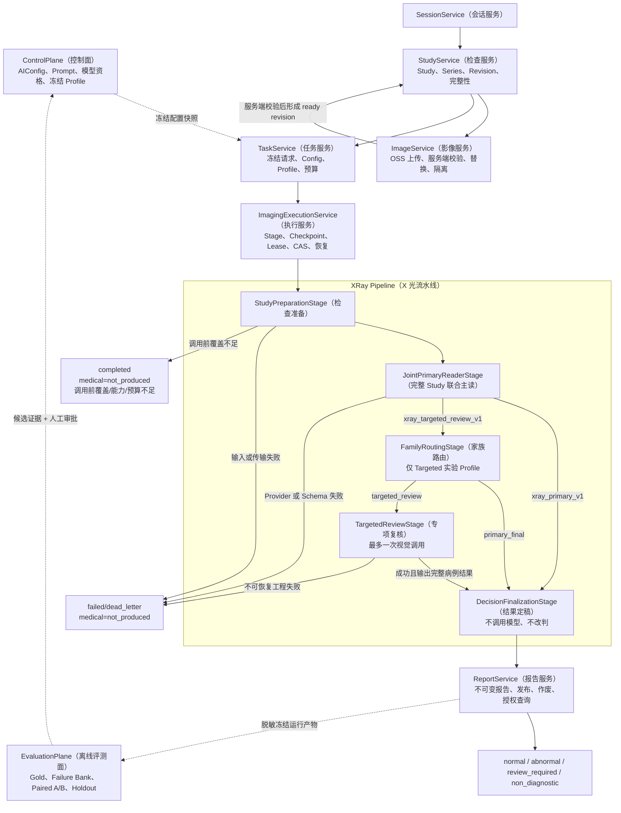

# MS-Image（宠物影像 AI 服务）

状态：`PARTIAL_IMPLEMENTATION / ONLINE_CODE_IMPLEMENTED / NOT_MIGRATED / NOT_RUNTIME_VALIDATED`（部分实现/在线链代码已实现/未迁移/未做真实运行验证）

当前日期：2026-08-21

适用范围：XRay（X 光）首期闭环，以及 CT（计算机断层成像）、MRI（磁共振成像）、超声、视频和 WSI（全切片影像）的通用影像底座。

MS-Image 是宠物多模态影像接入、AI（人工智能）诊断执行、报告和离线评测服务，不是用于生成其他 FastAPI 项目的脚手架。

当前 Runtime 源码已唯一收敛到 `services/runtime/`，包含 Session/Study/Series/Image、Task/Stage、provider-disabled AI Call、Report、Evaluation Job/Outbox/Relay/Worker、readiness 与 Operational Status；Compose 同时定义在线和隔离 Evaluation MySQL。代码尚未迁移到真实 schema，也尚未完成真实 MySQL/OSS/RabbitMQ 演练；Provider 仍未资格化，医学准确率为 `UNKNOWN`，发布状态为 `NO-GO`。

## 项目目的

MS-Image 负责形成一条可追溯、可恢复、可评测的影像 AI 链路：

1. 接收 Session（会话）、Study（检查）、Series（序列）和 Image（影像）。
2. 通过 OSS（对象存储）直传保存影像 bytes（文件字节），服务端校验对象后封存 Study revision（检查修订版本）。
3. 冻结 Task（任务）的输入、AI Config（AI 配置）、Profile（流程配置）和预算。
4. 通过 Outbox（事务发件箱）、Broker（消息代理）、Lease（租约）和 CAS（比较并设置）可靠执行 Stage。
5. 由模型产生医学判断；Python 只做校验、路由、持久化和审计，不改写医学结论。
6. 保存不可变 Report（报告），并把脱敏运行产物送入隔离 Evaluation Plane（离线评测面）。
7. 使用 Gold（可信金标准）、Failure Bank（失败样本库）、Paired A/B（配对对照实验）和 Holdout（隔离留出集）验证候选链，禁止用工程成功率冒充医学准确率。

## Canonical XRay Chain（X 光权威主链）

以下流程是当前文档必须统一遵循的权威链路：



两个 Profile（流程配置）的边界固定如下：

- `xray_primary_v1`（X 光仅主读基线）：`StudyPreparation -> JointPrimaryReader -> DecisionFinalization -> Report`。
- `xray_targeted_review_v1`（X 光专项复核实验）：Primary 后执行确定性 `FamilyRouting`；只允许 `primary_final` 或最多一次 `TargetedReview`。
- `FamilyRouting` 只属于 Targeted 实验 Profile，不调用模型、不读取 Gold、不修改 `normal/abnormal`。
- `TargetedReview` 必须输出完整病例结果；触发后若发生不可恢复技术失败，必须 fail closed（失败关闭），不得静默回退 Primary。
- Evaluation Plane 只产生候选证据；必须经过人工审批，Control Plane 才能激活新配置。

## 文档阅读顺序

| 目的 | 文档 |
|---|---|
| 第一次完整了解 XRay 或向开发人员讲解 | [XRay 完整核心架构与专项设计](docs/refactor/14-xray-specialty-design.md) |
| 审查每一层的目的、逻辑、输入、输出和必要性 | [XRay 权威主链逐层责任与接口合同](docs/refactor/12-canonical-xray-layer-responsibility-contract.md) |
| 查看完整 XRay 状态、事务和故障链 | [XRay 详细链路与开发流程图](docs/refactor/10-xray-detailed-flow.md) |
| 查看精确表、字段、索引和不变量 | [最终架构、数据库与完整链路设计](docs/ms-image-final-architecture-and-database-design.md) |
| 判断基于哪个代码状态重构 | [重构基线决策](docs/refactor/13-refactor-base-decision.md) |
| 开始重构 | [重构文档包](docs/refactor/README.md) -> [新会话交接](docs/refactor/08-new-session-handoff.md) |
| 查看历史方案 | [历史文档索引](docs/history/README.md)，只用于追溯，不指导新开发 |
| 查询英文含义 | [英文术语中英对照](docs/术语中英对照.md) |

## 目标边界

- 在线核心业务 Service 只有 `SessionService / StudyService / ImageService / TaskService / ImagingExecutionService / AIConfigService / AIRequestService / ReportService` 这 8 个。
- 目标 XRay 注册 5 个 Stage Service；默认 Profile 执行其中 3 个，Targeted 实验 Profile 才增加 FamilyRouting 和 TargetedReview。
- XRay、CT、MRI 等复用 Session/Study/Series/Image/Task/Stage/Call/Report 公共领域模型；医学 Pipeline（流水线）分别资格化。
- OSS 保存文件字节；MySQL 保存领域 owner（所有者）和完整 ObjectRef（对象引用），不建设公共 `file_asset`（文件资产）表。
- 首期没有报告 callback/ack（回调/确认）生命周期，没有人工复核表，也没有在线 Evidence Graph（证据图）或通用 DAG（有向无环图）引擎。
- 当前 10+4 表是候选基线，不是数量指标；只有独立事实 owner、生命周期、事务、查询或审计合同才能触发增删表。

## 工程分层

业务接口必须遵循：

```text
API（接口层） -> Service（业务层） -> CRUD/DAL（数据访问层） -> Model/DB（模型/数据库）
```

- 数据访问统一复用 `app.core.crud.DalBase`，不得新增 Repository（仓储层）、第二套 CRUDBase 或 DatabaseService（数据库服务）。
- Service 接收 `AsyncSession`（异步数据库会话）并初始化实体 DAL；API、Service、Worker 和脚本不得直接拼装 SQLAlchemy 查询。
- 每张目标 MySQL 表使用服务端生成、非空、独立的 `id VARCHAR(64)` 单列主键。
- 不使用 Foreign Key（外键）、数据库 Enum（枚举）、联合主键或 `tenant_id`（租户字段）。
- API 资源 ID 使用 query（查询参数）或 request body（请求体），不设计 `/{id}`。
- 未经明确授权不生成迁移脚本、新测试脚本，不操作真实数据库或生产对象。

## 本地运行

详细说明见 [USAGE.md](USAGE.md)。最小启动方式：

```bash
python -m venv .venv
source .venv/bin/activate
pip install -r services/runtime/requirements.txt
cp .env.example .env-01
python services/runtime/run_servers.py
```

- 用户 API（应用程序接口）：`http://localhost:8000/docs`
- 管理 API：`http://localhost:8001/docs`
- 用户健康检查：`http://localhost:8000/api/v1/health`

不要把服务成功启动、请求成功或工程测试通过解释为 XRay 医学准确率已经提高。
