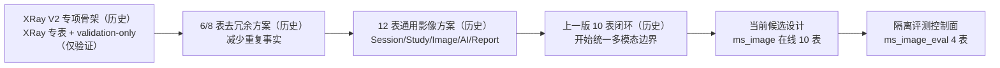

# MS-Image 历史文档演进与冲突索引

状态：`ARCHIVED_INDEX`（历史索引）
用途：解释设计为什么演进、哪些结论仍可借鉴、哪些合同已经失效。
当前设计依据：[MS-Image 最终架构、数据库与完整链路设计](../ms-image-final-architecture-and-database-design.md)
重构工作入口：[MS-Image 重构文档包](../refactor/README.md)
术语解释：[MS-Image 英文术语中英对照](../术语中英对照.md)

`docs/history/`（历史文档目录）不是当前建表、开发、迁移或发布依据。目录内正文出现的“当前”“最终”“必须”“下一步”和 `DONE`（已完成），都只描述该文件记录时点。读取历史资料时必须同时读取本索引和当前设计依据。

## 1. 为什么保留历史文档

历史文档承担三种价值：

1. 保存从 XRay（X 光）专项实现走向通用影像平台的推理过程。
2. 保存被否决方案及其失败原因，防止重构时重复引入旧问题。
3. 保存可复核的代码、迁移和工程基线线索，但不把时间点证据误写成当前事实。

历史资料不能承担四种职责：

- 不能定义当前数据库字段、索引或状态机。
- 不能授权执行迁移、双写、重命名或删除旧表。
- 不能证明目标 10 张在线表或 4 张评测表已经实现。
- 不能证明 Provider（AI 服务提供方）成功率或医学准确率已经达标。

## 2. 设计演进总览

演进中保留下来的正确原则：

- `API -> Service -> CRUD(DalBase) -> Model/DB`（接口层到业务层、数据访问层和数据库层）。
- Task（任务）、Stage（阶段）、Outbox（事务发件箱）和 AI Call（AI 调用）分别拥有自己的状态。
- Broker（消息代理）只负责至少一次触发，MySQL（关系型数据库）的幂等、CAS（比较并设置）和 lease（租约）才是恢复事实。
- OSS（对象存储）保存文件字节，业务表保存所属领域的完整 `ObjectRef`（对象引用）；不建设公共 `file_asset`（文件资产）表。
- 医学结论只能来自模型或医生；Python 只做校验、路由、持久化和审计。

被当前设计推翻或延后的结论：

- XRay 专表不能继续作为多模态领域模型；XRay 只应是 `modality_type=xray`（模态类型为 X 光）。
- 固定二次 `FinalMedicalReader`（最终医学判读器）已被直接对照中的退化证据否决。
- `FamilyRouting + TargetedReview`（家族路由加专项复核）只能作为完整实验候选，不能默认进入生产主链。
- 人工复核、在线 Evidence Graph（证据图）、在线 RiskGate（风险门）、任意 DAG（有向无环图）和网络化阶段微服务均不属于首期闭环。
- 旧 `tenant_id`（租户标识）只属于历史实现；目标表不设计租户字段。
- 旧 Provider Key（服务密钥）、明文 Prompt（提示词）、完整响应和 signed URL（签名地址）不得直接迁移。

## 3. 历史方案与当前归宿

| 历史主题 | 当时解决的问题 | 当前结论 | 当前归宿 |
|---|---|---|---|
| XRay 专项 Session/Run（会话/运行） | 快速建立独立 XRay validation-only（仅验证）骨架 | 业务根方向保留，XRay 前缀和 Run 语义不保留 | `session_record`（会话记录表）、`study_record`（影像检查记录表）、`task_record`（任务记录表） |
| 6/8 表极简方案 | 减少表和重复字段 | 过度压缩 Stage/Outbox 会丢失独立生命周期 | 当前在线 10 表候选基线 |
| 12 表通用方案 | 补齐资源、执行、报告和发布 | 部分表没有独立 owner（所有者）或形成重复事实 | 合并为当前 10 表；条件扩展另行评审 |
| `file_asset`（文件资产表） | 为所有 OSS 对象提供统一索引 | 公共文件表会模糊对象 owner、删除权和生命周期 | 不采用；原图由 `image_record`（影像记录表）持有，其他产物由各 owner 行保存完整 `ObjectRef` |
| XRay 固定多 Reader（多判读器） | 希望通过重复读片提高准确率 | 调用次数不等于独立证据；已见 NOR9 退化 | 默认只保留 JointPrimaryReader（联合主读）；专项复核需配对实验晋级 |
| 在线 Evidence Graph/RiskGate | 希望显式处理冲突和风险 | 当前无可信增益证据，且会增加第二医学 owner 风险 | 放到 `ms_image_eval`（影像评测数据库）做离线 Artifact（不可变产物）实验 |
| 人工复核链 | 处理 AI 不确定结果 | 没有业务 owner、领取、SLA 和裁决合同 | 首期 `N/A`（不适用）；`review_required`（AI 无法确定）直接作为可发布 AI 终态 |
| 独立 Delivery（交付）状态 | 表达回调和下游确认 | 首期仅查询报告，没有 callback/ack 生命周期 | 由 `task_record.current_report_id -> report_record.status` 计算，不落重复状态 |
| 旧 AI 配置五表 | 分拆 Provider/Prompt/Model/Connection | 首期会形成过多事实源，且旧表含明文 Secret 风险 | 合并为不可变 `ai_config_record`（AI 配置记录表）；Secret 只存引用 |
| DeepSeek Harness（离线研究框架） | 协助失败归因和实验建议 | 不具备线上恢复与医学 owner 合同 | 仅作为 `ms_image_eval` 的只读可选执行器 |

## 4. 全部历史文件目录

### 4.1 通用设计

| 文档 | 生命周期 | 历史价值 | 读取时必须忽略 |
|---|---|---|---|
| [architecture-decision.md](design/architecture-decision.md) | `SUPERSEDED`（已被取代） | 旧 8 表取舍 | 8 表不是当前建表合同 |
| [imaging-database-design.md](design/imaging-database-design.md) | `SUPERSEDED` | 旧 12 表职责、淘汰原因和归宿 | 字段字典、表数量和迁移命令 |
| [module-and-chain-design.md](design/module-and-chain-design.md) | `SUPERSEDED` | 旧模块调用链 | 旧 Service（业务服务）数量和阶段顺序 |
| [service-and-table-design.md](design/service-and-table-design.md) | `SUPERSEDED` | 旧 Service 与表的关系 | 被删除字段和旧事务边界 |
| [ms-image-module-database-closed-loop-design.md](design/ms-image-module-database-closed-loop-design.md) | `SUPERSEDED` | 上一版 10 表闭环 | 旧候选状态、字段和发布结论 |

### 4.2 XRay（X 光）历史设计

| 文档 | 生命周期 | 历史价值 | 当前归宿 |
|---|---|---|---|
| [xray-accuracy-detailed-development-document.md](xray/design/xray-accuracy-detailed-development-document.md) | `ARCHIVED`（已归档） | XRay V2 可靠执行、Prompt、Provider 和评测思想 | 通用 Task/Stage/Outbox/Call、目标 Stage Service、离线评测面 |
| [xray-accuracy-database-redesign.md](xray/design/xray-accuracy-database-redesign.md) | `ARCHIVED` | 6 表去冗余原则 | 当前字段最小化原则；不保留 XRay 专表 |

### 4.3 XRay（X 光）历史计划

| 文档 | 生命周期 | 历史价值 | 限制 |
|---|---|---|---|
| [xray-accuracy-development-plan.md](xray/plans/xray-accuracy-development-plan.md) | `ARCHIVED` | 早期准确率与工程开发顺序 | 不代表当前 Phase（阶段）或完成状态 |
| [xray-accuracy-phase0-development-plan.md](xray/plans/xray-accuracy-phase0-development-plan.md) | `ARCHIVED` | 2026-08-11 Phase 0 工程基线 | `DONE` 只对当时 Artifact 有效 |
| [xray-accuracy-migration-plan.md](xray/plans/xray-accuracy-migration-plan.md) | `ARCHIVED` | Provider/Key/Prompt 迁移风险 | 不授权迁移 Secret、数据或配置 |

### 4.4 XRay（X 光）历史报告与 Prompt（提示词）

| 文档 | 生命周期 | 历史价值 | 限制 |
|---|---|---|---|
| [xray-accuracy-ai-infrastructure-migration-report.md](xray/reports/xray-accuracy-ai-infrastructure-migration-report.md) | `ARCHIVED` | AI 请求基础设施的时间点审计 | 当前状态必须回到 `docs/artifacts/`（工程证据目录）核验 |
| [xray-accuracy-comparison-matrix.md](xray/reports/xray-accuracy-comparison-matrix.md) | `ARCHIVED` | `vet-platform`（旧平台）和 `ms-image` 的历史能力比较 | 文件行号和差距可能已经变化 |
| [xray-accuracy-detailed-development-document-prompt.md](xray/prompts/xray-accuracy-detailed-development-document-prompt.md) | `ARCHIVED` | 复现旧文档生成上下文 | 不得直接当作新会话任务执行 |

## 5. 冲突解释规则

冲突不能使用一条线性总排名处理，必须先判断问题属于哪条权威轴：

| 问题 | 权威来源 | 历史资料的作用 |
|---|---|---|
| 当前允许执行什么 | 当前用户授权 + `AGENTS.md` | 不能扩大授权 |
| 当前代码实际做什么 | 当前 worktree 源码、配置和启动合同 | 只解释旧实现来源 |
| 当前环境实际存在什么 | 绑定环境和时间的 DB schema、OSS bytes/hash、Broker/Provider trace | 只提供历史对照 |
| 目标系统应该是什么 | 当前设计母文 | 历史设计不能覆盖目标合同 |
| 目标如何实施 | `docs/refactor/` | 历史计划不能作为当前开发步骤 |
| 医学效果是否改善 | 冻结 Gold、同病例 Paired A/B、确定性 scorer、隔离 Holdout | 旧 PASS、调用成功率和单例不能证明准确率 |
| 旧方案为何存在 | 本目录和外部历史设计包 | 这是 history 唯一拥有的权威轴 |

旧真实 schema 只能证明对应时点的现状，不能覆盖目标 schema；设计母文定义目标，却不能证明已经实现、迁移或提高准确率。来源不一致时记录 Current-to-Target Gap（当前到目标差距），并标注 `CONFIRMED / INFERRED / PROPOSED / UNKNOWN / N/A`，不得跨轴互相冒充。

## 6. 历史资料使用检查表

引用任一历史结论前确认：

- [ ] 已读取文件顶部的 `ARCHIVED/SUPERSEDED`（已归档/已被取代）状态。
- [ ] 已找到当前设计中的对应表、Service（业务服务）或 Stage（阶段）归宿。
- [ ] 已使用当前 Artifact（工程证据）复核代码或运行状态。
- [ ] 未复制旧 `tenant_id`、XRay 专表、明文 Secret、公共文件表或固定 FinalReader。
- [ ] 未把历史 SQL、迁移步骤或 Prompt 当成执行授权。
- [ ] 未把旧 `DONE/PASS` 写成当前生产或医学资格。

## 7. 维护规则

- 本目录不新增 `CURRENT`（当前）文档。
- 历史事实原则上不改写；允许补充状态、冲突说明和当前归宿。
- 新架构决策先更新当前设计依据，再同步重构工作包和本索引。
- 历史报告引用的代码行变化后不回填伪造新证据；生成新的 Artifact。
- 删除历史文件前必须证明其内容已被更高等级文档完整吸收，并保留变更记录。
