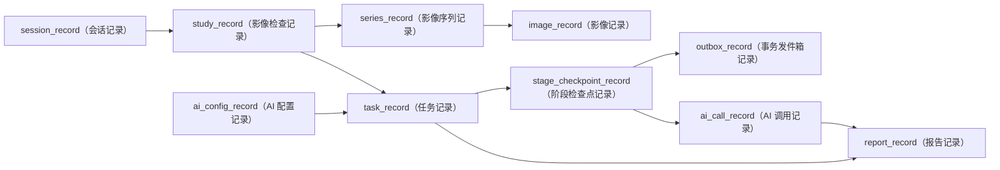

# MS-Image 旧 12 表设计演进记录

> 中文阅读说明：`SUPERSEDED`（已被取代）表示本文不能作为建表依据；通用术语请参阅[英文术语中英对照](../../术语中英对照.md)。

状态：`SUPERSEDED`（已被取代）

目标数据库：`ms_image`

当前依据：[MS-Image 最终架构、数据库与完整链路设计](../../ms-image-final-architecture-and-database-design.md)。

历史语境：本文后文的“当前”只表示归档时记录的迁移归宿，不应替代权威文档中的最新定义。

本文只解释旧 12 表方案为什么被淘汰，以及旧事实应迁到哪里。旧方案从未形成当前生产字段合同，因此不再保留可复制的字段字典、索引或建表语句。

## 1. 历史方案解决的问题

旧方案第一次把影像会话、检查、异步任务、AI（人工智能）调用和报告放进同一条链，方向是正确的：

```text
session_record（会话记录）
  -> study_record（影像检查记录）
  -> image_record（影像记录）
  -> task_record（任务记录）
  -> task_attempt_record（任务尝试记录）
  -> ai_call_record（AI 调用记录）
  -> report_record（报告记录）
```

它还曾把 AI（人工智能）运行配置拆为：

```text
ai_connection_record（AI 连接记录）
ai_prompt_revision（AI 提示词修订）
ai_output_schema（AI 输出结构）
ai_model_pool_lane（AI 模型池通道）
ai_stage_round（AI 阶段轮次）
```

这些表表达了“配置需要版本化、调用需要追溯”的正确意图，但拆分粒度过细，运行时可能拼出跨版本组合，无法冻结一个可重放的 Release（发布版本）。

## 2. 为什么不再保留旧字段字典

| 问题 | 旧表现 | 当前处理 |
|---|---|---|
| 一个事实多处保存 | Task（任务）、Attempt（尝试）、Report（报告）重复保存状态和失败原因 | 分别由 Task（任务）、Stage（阶段）、Report（报告）拥有唯一状态 |
| JSON（结构化数据）与列双写 | coverage（覆盖范围）、limitations（限制）、medical evaluable（医学可评估）既在报告内容又拆列 | 只在不可变 `report_record.content_json`（报告内容）保存一次 |
| 可计算投影落库 | retry count（重试次数）、image count（影像数量）、call number（调用序号）可从冻结记录计算 | 不作为独立事实字段 |
| 配置过度拆表 | Connection（连接）、Prompt（提示词）、Schema（结构）、Pool（模型池）、Round（轮次）运行时拼装 | 合并为不可变 `ai_config_record`（AI 配置记录）版本包 |

继续保留完整旧字段表会产生两套可执行合同，因此本历史文档只保留表职责和迁移归宿。

## 3. 旧表在归档时的迁移归宿

| 旧表 | 当时用途 | 当前归宿 | 处理结论 |
|---|---|---|---|
| `session_record`（会话记录） | 记录一次影像会话开始、完成和关闭 | `session_record`（会话记录） | 保留概念；只拥有会话生命周期，不保存聊天或宽泛上下文 |
| `study_record`（影像检查记录） | 表示一次 XRay（X 光）或其他影像检查 | `study_record`（影像检查记录） | 保留概念；使用 `modality_type`（影像模态类型）统一 XRay、CT、MRI 等 |
| `image_record`（影像记录） | 保存 OSS（对象存储）对象索引和影像技术事实 | `series_record`（影像序列记录）+ `image_record`（影像记录） | 补齐 CT/MRI 必需的 Series（影像序列）层级 |
| `task_record`（任务记录） | 保存异步业务任务 | `task_record`（任务记录） | 保留概念；拥有执行、AI 医学、交付三组正交状态 |
| `task_attempt_record`（任务尝试记录） | 保存 Worker（异步工作进程）尝试、锁和心跳 | `stage_checkpoint_record`（阶段检查点记录） | 删除独立表；阶段级 CAS（比较并交换）、lease（租约）和 attempt（尝试）更精确 |
| 旧任务投递字段 | 保存消息发布重试 | `outbox_record`（事务发件箱记录） | 从 Task（任务）拆出；数据库提交与 Broker（消息代理）发布形成可靠边界 |
| `ai_connection_record`（AI 连接记录） | Provider（AI 服务提供方）连接和 Secret（密钥）引用 | `ai_config_record`（AI 配置记录） | 合并；Secret 只保留引用 |
| `ai_prompt_revision`（AI 提示词修订） | Prompt（提示词）不可变版本 | `ai_config_record`（AI 配置记录）中的版本化 bundle（配置包） | 合并；配置激活时整体冻结 |
| `ai_output_schema`（AI 输出结构） | AI 输出 JSON Schema（结构合同） | `ai_config_record`（AI 配置记录）中的 schema bundle（结构配置包） | 合并；不允许跨版本拼装 |
| `ai_model_pool_lane`（AI 模型池通道） | Provider（AI 服务提供方）路由和 fallback（降级） | `ai_config_record`（AI 配置记录）中的 provider plan（提供方计划） | 合并；预算和降级策略一起冻结 |
| `ai_stage_round`（AI 阶段轮次） | 定义 Pipeline（处理流水线）阶段顺序 | `ai_config_record`（AI 配置记录）中的 compiled pipeline（编译流水线） | 合并；发布前由 Compiler（编译器）校验 DAG（有向无环图） |
| `ai_call_record`（AI 调用记录） | 保存真实 Provider（AI 服务提供方）请求事实 | `ai_call_record`（AI 调用记录） | 保留概念；关联 Task（任务）和 Stage（阶段），以逻辑调用键和幂等键防重 |
| `report_record`（报告记录） | 保存结构化医学结果和报告版本 | `report_record`（报告记录） | 保留概念；内容不可变，Task（任务）持有当前报告指针 |

全部关系均为逻辑关联，不声明数据库 Foreign Key（外键）。状态和类型使用 String（字符串），不使用数据库 Enum（枚举）。

## 4. 已删除的旧字段类别

以下字段不应在新表中恢复：

| 旧字段或字段类别 | 删除原因 | 当前单一事实源 |
|---|---|---|
| `session_record.context_json`（会话宽泛上下文） | 边界不清，容易复制病历、用户或聊天数据 | Task（任务）不可变请求快照只保存执行必需的脱敏上下文 |
| `task_record.engineering_eligibility`（工程资格） | 与 Stage（阶段）工程门禁和评测资格混淆 | 在线由阶段结果和 Task（任务）执行状态表达；评分资格由 `ms_image_eval`（影像评测控制面）计算 |
| `task_record.retry_count`（任务重试次数） | 可由 attempt（尝试）和 Stage（阶段）记录确定性计算 | `task_record.attempt_no`（任务尝试号）和 `stage_checkpoint_record`（阶段检查点记录） |
| `report_group_id`（报告分组标识） | Task（任务）已经是报告修订系列稳定 owner（所有者） | `task_id + revision_no`（任务标识加修订号） |
| `coverage_status/limitations_json`（覆盖状态/限制）独立列 | 与不可变报告内容双写 | `report_record.content_json`（报告内容） |
| `medical_evaluable`（医学可评估） | 在线服务不应决定评测分母 | `ms_image_eval`（影像评测控制面）的冻结 scorer（评分器）产物 |
| `retention_status`（保留状态） | 与报告业务状态和 OSS（对象存储）生命周期重叠 | 报告 `status`（状态）+ owner lifecycle policy（所有者生命周期策略） |
| `task_attempt_id/stage_round_id/call_no`（尝试/轮次/调用序号） | 旧关联不能表达当前阶段实例、输入和配置版本 | `stage_checkpoint_id + logical_call_key + stage_attempt_no`（阶段检查点、逻辑调用键和阶段尝试号） |
| `image_count_received`（接收影像数量） | 数量不能证明 Provider（AI 服务提供方）消费了正确影像 | requested/sent manifest（请求/发送清单）+ 逐图 receipt（回执） |
| 单独的原始响应对象键 | ObjectRef（对象引用）不完整，无法确定存储配置、摘要和大小 | `ai_call_record`（AI 调用记录）完整响应 ObjectRef（对象引用） |
| `parent_image_id`（单一父影像标识） | 多源派生图无法用单父节点表达 | 版本化 lineage manifest（来源清单）和 EvidenceGraph Artifact（证据图产物） |

## 5. 归档时的迁移归宿关系图



关系说明：

```text
session_record（会话记录） 1 -> N study_record（影像检查记录）
study_record（影像检查记录） 1 -> N series_record（影像序列记录）
series_record（影像序列记录） 1 -> N image_record（影像记录）
study_record（影像检查记录） 1 -> N task_record（任务记录）
task_record（任务记录） 1 -> N stage_checkpoint_record（阶段检查点记录）
stage_checkpoint_record（阶段检查点记录） 1 -> N ai_call_record（AI 调用记录）
task_record（任务记录） 1 -> N report_record（报告记录）
```

## 6. OSS（对象存储）归属

数据库不保存文件 bytes（二进制内容）、永久 URL（链接）或长期 signed URL（签名链接）。

```text
原始或派生影像 -> image_record（影像记录）完整 ObjectRef（对象引用）
Task（任务）大型请求快照 -> task_record（任务记录）自己的 ObjectRef（对象引用）
Stage（阶段）大型输入/输出 -> stage_checkpoint_record（阶段检查点记录）自己的 ObjectRef（对象引用）
Provider（AI 服务提供方）原始响应或大型解析结果 -> ai_call_record（AI 调用记录）自己的 ObjectRef（对象引用）
报告 PDF/HTML（可移植文档/网页） -> report_record（报告记录）自己的 ObjectRef（对象引用）
```

每个 ObjectRef（对象引用）至少包含 `storage_profile/object_key/sha256/size_bytes/content_type`（存储配置、对象键、摘要、字节数、内容类型）。业务 owner（所有者）负责保留、删除和孤儿对账，不建设跨领域公共文件目录。

## 7. 多模态结论

XRay（X 光）只是一种 `modality_type`（影像模态类型）。统一层级为：

```text
Session（会话） -> Study（检查） -> Series（序列） -> Image（影像）
```

- XRay（X 光）和普通照片使用 `series_key=default`（默认序列）。
- CT（计算机断层成像）和 MRI（磁共振成像）使用真实 Series（影像序列）和 SOP Instance（影像实例）顺序。
- 超声、内窥镜和视频通过 `image_kind`（影像形态）及技术元数据表达。
- WSI（全切片影像）首期把整张切片作为一个 Image（影像），分片策略属于后续专项能力。

## 8. 历史链路到归档时目标链路的变化

```text
旧链：Session -> Study -> Image -> Task -> Attempt -> Round/Prompt/Schema/Pool/Connection -> AI Call -> Report
归档时目标链：Session -> Study -> Series -> Image -> Task -> StageCheckpoint + Outbox -> AI Config -> AI Call -> Report
```

主要变化：

1. Series（影像序列）成为核心表，保证 CT/MRI 完整性。
2. Attempt（任务尝试）和 Round（阶段轮次）不再各自拥有平行状态；StageCheckpoint（阶段检查点）统一阶段恢复。
3. Outbox（事务发件箱）独立拥有 Broker（消息代理）发布事实。
4. AI Config（AI 配置）冻结完整 Release（发布版本），避免运行时跨版本拼装。
5. Report（报告）的 coverage（覆盖范围）、limitations（限制）和 source refs（来源引用）只保存在不可变内容中一次。
6. Gold（可信金标准）、医学分母和准确率结果进入独立 `ms_image_eval`（影像评测控制面），不污染在线表。

## 9. 实施边界

- 本文不能作为 Model（模型）、Alembic（数据库迁移工具）或 SQL（结构化查询语言）生成依据。
- 当前设计阶段不修改数据库，不生成迁移脚本和测试脚本。
- 实现必须遵循 `API -> Service -> CRUD(DalBase) -> Model/DB`（接口到服务到数据访问到模型/数据库）。
- 资源 ID（标识）只放 query parameter（查询参数）或 request body（请求体），不使用 `/{id}` 路由。
