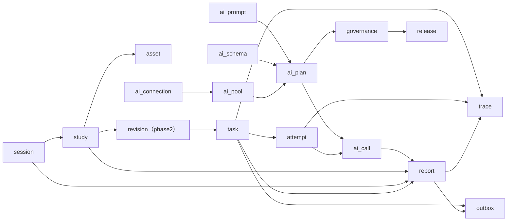

# MS-Image 模块与链路设计

> 中文阅读说明：`Service` 是“业务服务层”，`Chain` 是“链路”；其余英文术语请参阅[英文术语中英对照](../../术语中英对照.md)。

> **SUPERSEDED / 已被取代**：本文对应旧 12 表模块拆分，仅保留为设计演进记录。当前模块和链路以 [MS-Image 最终架构、数据库与完整链路设计](../../ms-image-final-architecture-and-database-design.md) 为准。

状态：`SUPERSEDED`（已被取代）

当前依据：[MS-Image 最终架构、数据库与完整链路设计](../../ms-image-final-architecture-and-database-design.md)

历史语境：本文后文的“当前”“必须”和实现顺序只描述旧 12 表方案，不构成当前开发或数据库合同。

本文仅保留历史模块拆分记录，不再指导当前代码或数据库落地。数据库字段、模块和链路以 [MS-Image 最终架构、数据库与完整链路设计](../../ms-image-final-architecture-and-database-design.md) 为准。

> 字段审计说明（2026-08-17）：以下链路已删除宽泛上下文、单父影像、Run（运行）级工程资格、数量式 Provider（AI 服务提供方）证明、报告内容双写以及旧 Attempt/Round（尝试/轮次）调用参数。旧模块名称只用于解释演进。

## 1. 模块总览

| 模块 | 职责 | 核心表 |
|---|---|---|
| `session` | 影像会话、来源、主体、状态 | `session_record` |
| `study` | 影像检查、模态、DICOM Study（影像检查） 身份 | `study_record` |
| `image` | 文件元数据、对象存储、Series（影像序列）/SOP、hash、receipt | `image_record（影像记录表）` |
| `task` | 异步任务、请求快照、投递、状态、重试汇总 | `task_record` |
| `attempt` | Worker（异步工作进程） 租约、心跳、单次执行尝试 | `task_attempt_record` |
| `ai_connection` | Provider（AI 服务提供方） 连接和 qualification | `ai_connection_record` |
| `ai_prompt` | Prompt（提示词） 版本和发布状态 | `ai_prompt_revision` |
| `ai_schema` | 输出 JSON Schema | `ai_output_schema` |
| `ai_pool` | 模型池连接泳道 | `ai_model_pool_lane` |
| `ai_plan` | AI 阶段轮次配置 | `ai_stage_round` |
| `ai_call` | 每次模型请求审计 | `ai_call_record` |
| `report` | 结构化诊断和交付报告 | `report_record` |

第二阶段模块：

| 模块 | 职责 | 核心表 |
|---|---|---|
| `revision` | 冻结实际参与诊断的影像清单 | `study_revision`、`study_revision_item` |
| `trace` | 技术事件、迟到结果、状态审计 | `trace_event_record` |
| `outbox` | 可靠消息投递 | `outbox_record` |
| `governance` | AI 配置发布和回滚审计 | `ai_governance_change_record` |
| `release` | validation/shadow/gray/active 和回切 | `release_event_record` |

## 2. 模块内部边界

### 2.1 `session`（历史会话对象）

职责：

- 幂等创建影像会话
- 保存来源会话、医疗记录、主体标识
- 保存会话开始时间和脱敏上下文
- 管理 open/processing/completed/closed/cancelled 状态

表：

```text
session_record
```

代码路径：

```text
app/models/session.py
app/crud/session.py
app/service/session_service.py
app/api/api_v1/endpoints/sessions.py
```

### 2.2 `study`（历史影像检查对象）

职责：

- 创建一次影像检查
- 保存 modality、body_part、DICOM Study UID
- 管理 uploading/ready/processing/completed/failed/invalid

表：

```text
study_record
```

### 2.3 `image`（影像对象；现行名称已收束）

职责：

- 文件元数据落库
- 文件二进制进对象存储
- DICOM UID、Series、SOP 和顺序管理
- 文件 hash 和技术 lineage（来源链路）；Provider receipt（提供方回执）只属于 `ai_call_record`（AI 调用记录）
- 派生影像通过有序来源 manifest（清单）表达，支持多源派生

表：

```text
image_record（影像记录表）
```

### 2.4 `task`（历史任务对象）

职责：

- 接收业务任务
- 冻结当前有序 Asset 清单
- 保存请求合同、发布指纹和 CAS 版本
- 保存投递状态和任务结果状态
- 管理执行、AI 医学和交付三组正交状态；full_sent（完整发送）只属于 AI Call（AI 调用）清单对账

表：

```text
task_record
```

### 2.5 `attempt`（历史执行尝试对象）

职责：

- 记录每次 Worker 执行
- 管理租约、心跳、重试
- 关联 `ai_call_record`

表：

```text
task_attempt_record
```

### 2.6 AI（人工智能）配置模块

职责：

- 管理 Provider 连接
- 管理 Prompt、Schema、模型池和阶段轮次
- 供任务执行时解析

表：

```text
ai_connection_record
ai_prompt_revision
ai_output_schema
ai_model_pool_lane
ai_stage_round
```

### 2.7 `ai_call`（历史 AI 调用对象）

职责：

- 记录一次真实模型请求
- 保存请求、响应、图像回执、Token、错误
- 保存 Prompt、Schema、模型、Provider 快照

表：

```text
ai_call_record
```

### 2.8 `report`（历史报告对象）

职责：

- 保存结构化医学结果和交付报告
- 保存版本、最终模型调用、医学和交付状态
- 保存报告渲染文件引用

表：

```text
report_record
```

## 3. 业务主链

```text
上游 medical_record/session
  -> session_record
  -> study_record
  -> image_record（影像记录表）
  -> task_record
  -> task_attempt_record
  -> AI 配置
  -> ai_call_record
  -> report_record
```

### 3.1 创建影像会话

输入：

```text
source_system
source_session_id
source_medical_record_id
subject_id
request_id
```

输出：

```text
session_record.id
session_record.status=open
```

### 3.2 创建影像检查

输入：

```text
session_id
source_study_id
modality_key
dicom_study_uid
body_part
```

输出：

```text
study_record.id
study_record.status=uploading
```

### 3.3 接收影像文件

输入：

```text
study_id
文件二进制
file_type
modality_key
series_key
series_uid
sop_instance_uid
sop_class_uid
instance_no
sequence_no
projection
```

输出：

```text
image_record（影像记录表）.object_key -> OSS
image_record（影像记录表）.sha256
image_record（影像记录表）.status=ready / invalid / quarantined
```

## 4. 任务链

```text
Study 所有必要文件 ready
  -> task_record
  -> task_attempt_record
  -> dispatch
  -> Worker
```

输入快照：

```text
task_record.request_payload_json
```

内容：

```json
{
  "contract_version": "xray.request.v1",
  "pipeline_key": "xray-accuracy-v2",
  "assets": [
    {
      "asset_id": "asset-1",
      "sequence_no": 1,
      "sha256": "...",
      "projection": "VD"
    }
  ]
}
```

任务创建后，`request_payload_json` 不可修改。

## 5. AI（人工智能）请求链

```text
task_attempt_record
  -> ai_stage_round
  -> ai_prompt_revision
  -> ai_output_schema
  -> ai_model_pool_lane
  -> ai_connection_record
  -> Provider
  -> ai_call_record
```

输入事实：

```text
request_sha256
ordered_image_sha256
image_receipt_json
prompt_sha256
rendered_prompt_sha256
schema_sha256
requested_language
actual_language
```

输出事实：

```text
response_object_ref
response_sha256
parsed_response_sha256
schema_validation_status
finish_reason
fallback_used
input_tokens
output_tokens
error_code
error_message
```

## 6. 结果与报告链

```text
ai_call_record
  -> Schema 校验
  -> report_record
  -> task_record.status=completed
  -> study_record.status=completed
  -> session_record.status=completed
```

报告输出：

```text
content_json
content_hash
final_ai_call_id
decision_owner
ai_medical_status
delivery_status
render_manifest_json
```

报告内容创建后不可修改。

## 7. 失败与重试链

```text
ai_call_record.status=failed
  -> task_attempt_record.status=failed/retry_waiting
  -> 创建新 task_attempt_record
  -> 重新执行 AI 请求
```

```text
任务取消
  -> task_record.status=cancel_requested
  -> 当前 task_attempt_record.status=cancelled
  -> 后续 attempt 不允许启动
```

```text
迟到结果
  -> trace_event_record.event_type=late_result
  -> 不覆盖最终 report_record
```

## 8. 第二阶段链路

### 8.1 影像 Revision（修订版本）链

```text
Study 准备完成
  -> study_revision
  -> study_revision_item
  -> task_record.study_revision_id
```

Revision 冻结后不可修改。

### 8.2 消息投递链

```text
task/report 终态
  -> outbox_record
  -> relay
  -> 上游接收
```

### 8.3 AI（人工智能）配置治理链

```text
Prompt/Schema/连接/模型池/阶段配置变更
  -> ai_governance_change_record
  -> release_event_record
  -> 生效
```

### 8.4 发布链

```text
validation_only
  -> shadow
  -> gray
  -> active
  -> rollback
```

## 9. 多模态链路

### 9.1 XRay（X 光）

```text
session_record
  -> study_record(modality=xray)
  -> image_record（影像记录表）
       series_key=default
       projection
       sequence_no
```

### 9.2 CT（计算机断层成像）/MRI（磁共振成像）

```text
session_record
  -> study_record(dicom_study_uid)
  -> image_record（影像记录表）
       series_key
       series_uid
       sop_instance_uid
       sop_class_uid
       instance_no
       sequence_no
       geometry_json
```

### 9.3 视频、病理和普通照片

```text
视频：media_format=mp4、duration_ms
病理：media_format=svs/tiff、不拆瓦片
普通照片：modality=clinical_photo、series_key=default
```

## 10. 模块实现顺序

建议按以下顺序实现：

```text
1. session
2. study
3. asset
4. task
5. attempt
6. ai_connection
7. ai_prompt_revision
8. ai_output_schema
9. ai_model_pool_lane
10. ai_stage_round
11. ai_call
12. report
```

第二阶段：

```text
revision
trace
outbox
governance
release
```

## 11. 历史方案当时边界

- 当前不生成迁移和测试脚本。
- 当前不修改现有数据库。
- 当前不启用真实 Provider。
- 代码实现后仍遵循 `API -> Service -> CRUD(DalBase) -> Model/DB`。

## 12. 基于数据库表的模块所有权

每个模块必须拥有自己的表，其他模块不能直接操作这些表。

| 模块 | 拥有表 | 只读或跨模块引用 |
|---|---|---|
| `session` | `session_record` | 为 study、task、report 提供 session_id |
| `study` | `study_record` | 为 asset、task、report 提供 study_id |
| `image` | `image_record（影像记录表）` | 为 task、report 提供有序资产和 SHA256 |
| `task` | `task_record` | 为 attempt、report、trace、outbox 提供 task_id |
| `attempt` | `task_attempt_record` | 历史尝试对象；当前由 `stage_checkpoint_record`（阶段检查点记录）的 attempt/lease（尝试/租约）取代 |
| `ai_connection` | `ai_connection_record` | 供 ai_pool、ai_call 解析连接 |
| `ai_prompt` | `ai_prompt_revision` | 供 ai_plan、ai_call 解析 Prompt（提示词） |
| `ai_schema` | `ai_output_schema` | 供 ai_plan、ai_call 解析 Schema |
| `ai_pool` | `ai_model_pool_lane` | 供 ai_plan 选择赛道 |
| `ai_plan` | `ai_stage_round` | 供 ai_call 选择执行配置 |
| `ai_call` | `ai_call_record` | 供 report 保存最终模型调用 ID |
| `report` | `report_record` | 供 task、outbox、trace 关联最终结果 |

第二阶段：

| 模块 | 拥有表 |
|---|---|
| `revision` | `study_revision`、`study_revision_item` |
| `trace` | `trace_event_record` |
| `outbox` | `outbox_record` |
| `governance` | `ai_governance_change_record` |
| `release` | `release_event_record` |

## 13. 模块依赖方向



依赖规则：

- 上层业务只能调用下层模块的 Service。
- 任何模块都不能直接读取或修改其他模块的 DAL。
- API 只调用本业务入口的 Service。
- 模型文件可以互相通过 ID 引用，但数据库不声明 Foreign Key。

## 14. 模块 Service（业务服务层）合同

### 14.1 `SessionService`（会话服务）

```text
create_session(payload) -> session_id
get_session(session_id)
complete_session(session_id)
cancel_session(session_id)
```

### 14.2 `StudyService`（检查服务）

```text
create_study(session_id, payload) -> study_id
get_study(study_id)
mark_study_ready(study_id)
fail_study(study_id, error)
```

### 14.3 `ImageService`（影像服务）

```text
prepare_upload(study_id, series_id, file_metadata) -> image_id
complete_upload(image_id, payload)
claim_validation(image_id, lease_generation)
verify_image(image_id, object_ref)
list_ready_images(series_id) -> ordered images
create_derived_image(source_manifest, payload)
```

### 14.4 `TaskService`（任务服务）

```text
create_task(study_id, task_type, contract) -> task_id
get_task(task_id)
cancel_task(task_id, expected_version)
mark_task_completed(task_id, report_id)
mark_task_failed(task_id, error)
```

### 14.5 `AttemptService`（执行尝试服务）

```text
start_attempt(task_id)
heartbeat_attempt(attempt_id)
complete_attempt(attempt_id)
fail_attempt(attempt_id, error)
```

### 14.6 `AIConfigService`（AI 配置服务）

```text
resolve_stage_round(pipeline_key, stage_key, version)
  -> prompt revision
  -> output schema
  -> pool lanes
  -> connection
```

### 14.7 `AICallService`（AI 调用服务）

```text
start_call(task_id, stage_checkpoint_id, logical_call_key)
complete_call(call_id, response_receipt)
fail_call(call_id, error)
```

### 14.8 `ReportService`（报告服务）

```text
create_report(task_id, final_ai_call_id, content)
publish_report(report_id)
query_latest_report(session_id/study_id/task_id)
```

第二阶段 Service：

```text
RevisionService.freeze_study(study_id)
TraceService.append_event(payload)
OutboxService.append(event)
OutboxRelay.publish_due()
GovernanceService.record_change(payload)
ReleaseService.transition(release_event)
```

## 15. 事务边界

| 业务操作 | 事务所有者 | 参与模块 |
|---|---|---|
| 创建会话 | `SessionService` | session |
| 创建 Study（影像检查） | `StudyService` | study |
| 上传影像 | `ImageService` | image、study、series、outbox |
| 冻结 Revision | `RevisionService` | revision、image |
| 创建任务 | `TaskService` | task、study、revision、attempt |
| 执行 AI 请求 | `AICallService` | ai_plan、ai_connection、ai_pool、ai_call |
| 生成报告 | `ReportService` | report、ai_call、task |
| 发布消息 | `OutboxService` | outbox、task/report |
| 配置变更 | `GovernanceService` | governance、对应 AI 配置表 |

规则：

- 事务所有者负责提交和回滚。
- 被调用模块只提供领域操作，不自行 commit。
- 同一业务事务使用同一个 `AsyncSession`。
- 消息发布通过 Outbox，与业务数据同事务写入。

## 16. 目录落点

不创建新的平行 module 包，继续复用当前项目分层：

```text
app/models/
  session.py
  study.py
  legacy_asset_model.py（历史示意文件，已废弃）
  task.py
  task_attempt.py
  ai_connection.py
  ai_prompt_revision.py
  ai_output_schema.py
  ai_model_pool_lane.py
  ai_stage_round.py
  ai_call.py
  report.py

app/crud/
  session.py
  study.py
  ...

app/service/
  session_service.py
  study_service.py
  asset_service.py
  task_service.py
  ...

app/api/api_v1/endpoints/
  sessions.py
  studies.py
  assets.py
  tasks.py
  reports.py
  ai_calls.py
```

模块边界是逻辑边界，物理目录继续遵循项目现有的 Model/CRUD/Service/API 结构。
