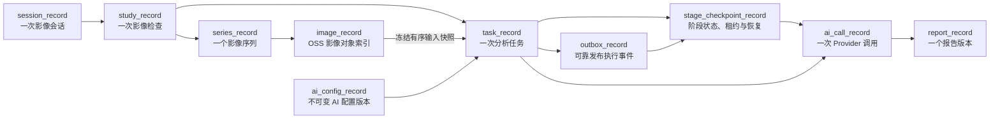
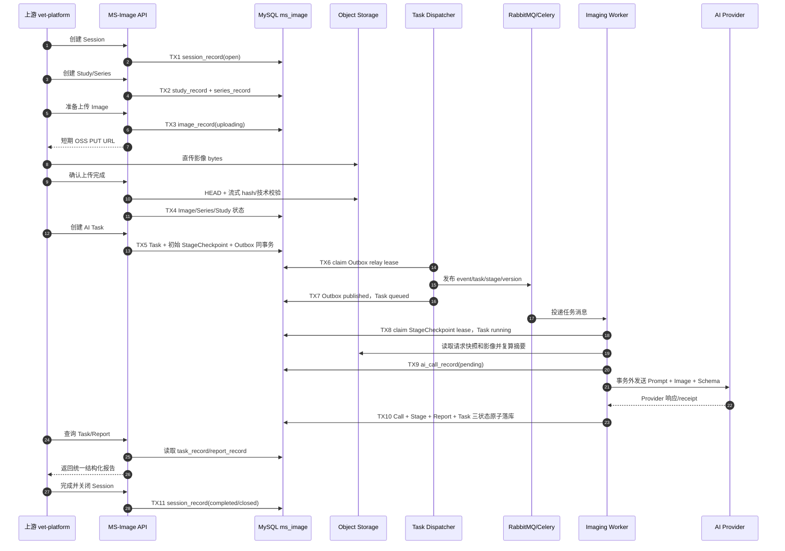
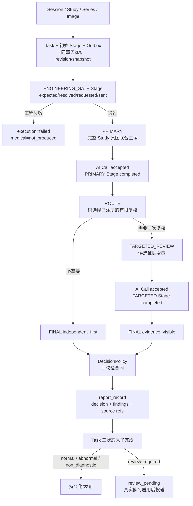
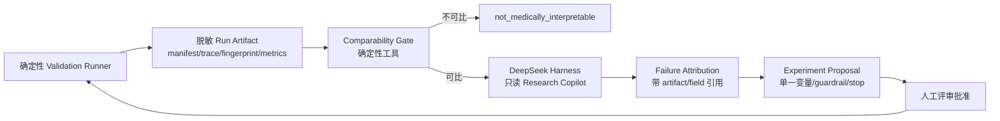

# MS-Image 模块、数据库与全链路闭环设计

> 中文阅读说明：`closed loop` 是“闭环”，`SUPERSEDED` 是“已被取代”；其余英文术语请参阅[英文术语中英对照](../../术语中英对照.md)。

状态：`SUPERSEDED`（已被取代）

日期：2026-08-14

当前依据：[MS-Image 最终架构、数据库与完整链路设计](../../ms-image-final-architecture-and-database-design.md)

历史语境：本文后文的“当前”“最终”“推荐”“实施顺序”和“门禁”均属于 2026-08-14 上一版候选方案，不构成当前建表、迁移、开发或发布授权。

目标服务：`ms-image`

目标 MySQL 数据库：`ms_image`

> 本文是开发前的上一版候选设计稿，不代表表已经创建或数据已经迁移。
> 本文不授权生成 Alembic 迁移、迁移脚本、测试脚本，也不授权修改现有数据库。

> 本文已被 [MS-Image 最终架构、数据库与完整链路设计](../../ms-image-final-architecture-and-database-design.md) 取代。最终文档补充了 `docs/artifacts` 工程证据核对、DeepSeek Harness 独立研究控制面和上线门禁；本文仅保留为上一版 10 表候选记录。

> 字段审计说明（2026-08-17）：本次已删除没有独立事实所有权、可由冻结清单确定性计算或已并入现行单一事实源的候选字段。本文剩余字段只用于解释上一版方案，不得据此建表；当前字段合同只看权威设计第 6 节。

## 1. 上一版候选建议

`ms-image` 应是统一的兽医影像分析服务，而不是 XRay 专用服务，也不是用户、宠物、聊天、病历、支付和额度等公共数据服务。

首期采用 10 张在线核心表；这是结合当前可复用实现与 XRay V2 权威合同后的最小充分业务闭环，不包含离线评测、Gold、Holdout 和研发 Copilot 的控制面数据：

```text
影像业务事实
1. session_record
2. study_record
3. series_record
4. image_record

执行与 AI
5. task_record
6. stage_checkpoint_record
7. outbox_record
8. ai_config_record
9. ai_call_record

结果
10. report_record
```

主链：



本方案不是把旧表改名后全部搬入新库，而是只迁移 `ms-image` 自己拥有的事实：

- 保留会话开始和结束：`session_record`。
- 用 `study_record.modality_type` 表示 `xray/ct/mri/...`，不再建立 `xray_*` 业务表。
- OSS 保存文件二进制，`image_record` 只保存影像与 Study/Series 的关系、顺序、对象键、摘要和技术元数据。
- `task_record` 承担逻辑 Run、整体重试和执行/AI 医学/交付三个正交状态；不再用一个 `status` 混写三种语义。
- `outbox_record` 只负责数据库事实到 Broker 的可靠发布；`stage_checkpoint_record` 只负责每个执行节点的状态、租约、心跳与恢复，二者都不拥有医学结论。
- AI 由本服务发起，配置使用一个自包含的多阶段 `ai_config_record` 版本；每次真实 Provider 请求写入 `ai_call_record`，并归属于一个 StageCheckpoint。
- `report_record` 统一承载所有模态报告，`report_type` 表示报告类型，影像模态从对应 Study 获得。
- Finding 是报告合同内的结构化证据对象，首期保存在不可变 `report_record.content_json` 和阶段调用结果中；没有跨报告检索需求前不重复建立 `finding_record`。
- 人工复核有独立领取、租约、SLA 和人类裁决生命周期后再启用 `review_record`；`review_required` 医学状态本身不等于已经有人复核。

### 1.1 AI（人工智能）请求链路

这里的 AI 链路就是 `ms-image` 自己组装并请求 AI Provider 的完整链路，不依赖上游替本服务调用 AI：

```mermaid
flowchart LR
    API["POST /api/v1/tasks<br/>业务 AI 请求"] --> T["task_record<br/>逻辑请求、三正交状态"]
    IMG["image_record<br/>OSS 对象、顺序、SHA256"] --> SNAP["不可变请求快照"]
    CTX["最小脱敏临床上下文"] --> SNAP
    SNAP --> T
    CFG["ai_config_record<br/>Pipeline + Prompt/Schema bundle + Model policy"] --> T
    T --> O["outbox_record<br/>与 Task 同事务创建"]
    O --> W["Imaging Worker<br/>PRIMARY / 可选 TARGETED / FINAL"]
    W --> CP["stage_checkpoint_record<br/>节点 claim / lease / recovery"]
    CP --> CALL["ai_call_record(pending)<br/>物理请求、幂等键"]
    CALL --> P["AI Provider"]
    P --> CALL2["ai_call_record(succeeded/failed)<br/>回执、模型、耗时、响应摘要"]
    CALL2 --> VALIDATE["JSON Schema + stage contract 校验"]
    VALIDATE -->|"PRIMARY/TARGETED 通过"| W
    VALIDATE -->|"FINAL 通过"| R["report_record<br/>结构化报告版本"]
    VALIDATE -->|"失败或可重试错误"| NEXT["fallback / retry<br/>新 logical_call_key"]
    R --> DONE["task_record<br/>execution=completed<br/>medical=normal/abnormal/review/non_diagnostic"]
```



六张表在 AI 请求链中的分工：

| 表 | 表示什么 | 一次业务请求有几条 |
|---|---|---:|
| `task_record` | 上游要求执行的一次诊断、质控或报告任务，即逻辑 AI 请求 | 1 |
| `outbox_record` | Task（任务）/Stage（阶段） 的可靠发布事件；解决数据库提交与 Broker（消息代理） 发布之间的一致性 | 1..N |
| `stage_checkpoint_record` | Pipeline（处理流水线） 每个阶段的状态、租约、输入输出摘要和恢复锚点 | 1..N |
| `ai_config_record` | 本次请求冻结使用的 Pipeline（处理流水线）、各阶段 Prompt（提示词）/Schema、模型策略和 Provider（AI 服务提供方） 计划 | 1 个不可变版本引用 |
| `ai_call_record` | `ms-image` 向 Provider（AI 服务提供方） 发出的每一次真实 HTTP/SDK 请求 | 1..N |
| `report_record` | 被接受的 AI Call 产生的最终结构化业务结果及后续修订 | 0..N |

因此不再增加含义模糊的 `ai_request_record`：

- 如果它表示用户的一次 AI 请求，会与 `task_record` 重复。
- 如果它表示一次 Provider 请求，会与 `ai_call_record` 重复。
- 逻辑请求和物理调用必须分开，因为一次 Task 可能包含主模型调用、格式修复、fallback、验证或重试。

Provider 请求内容由以下事实组装：

```text
task_record.request_snapshot
  + ai_config_record.pipeline_manifest_json
  + ai_config_record.prompt_bundle_json
  + ai_config_record.schema_bundle_json
  + ai_config_record.model_policy_json / provider_plan_json
  + image_record 对应的 OSS 内容
  -> AIService.execute_call
  -> AI Provider
```

影像传输形式由 Provider Adapter 决定，可以是短期签名 URL、受控下载后编码或 Provider 文件引用；签名 URL、Authorization 和明文密钥不得写入 Task、AI Call、日志或数据库。

## 2. 设计依据与问题判断

### 2.1 已确认事实

| 事实 | 证据 | 结论 |
|---|---|---|
| 旧 `session_record` 是聊天消息明细，不是会话主记录 | `vet-platform/app/models/session_record.py:6-29` | 不能原表照搬；新表保留名字但重新定义为一会话一行 |
| 旧 `medical_images` 同时保存文件、AI 状态、分析结果、网格和病灶 | `vet-platform/app/models/medical_image.py:6-96` | 文件事实、任务状态和报告必须拆开 |
| 旧 XRay（X 光） 任务是一张简单状态表 | `vet-platform/app/models/async_xray_task.py:6-64` | `task_record` 可以作为首期调度与执行主表 |
| 旧报告按 `report_index` 分片 | `vet-platform/app/models/report_content.py:15-33` | 新报告应一行保存一个完整、可版本化的结构化结果 |
| 旧 AI 日志保存完整 Prompt（提示词）/响应和连接地址 | `vet-platform/app/models/ai_request_log.py:24-103` | 新调用表只保存版本、摘要、状态和受控 OSS（对象存储） 引用 |
| `ms-ai-fast` 虽然简单，仍使用旧公共文件资产模型保存 OSS（对象存储）元数据 | `ms-ai-fast` 历史模型证据（旧路径不再作为当前实现引用） | 上传 OSS（对象存储）不等于数据库不需要对象索引 |
| `ms-ai-fast` 将投递字段直接放在任务表 | `ms-ai-fast/app/models/ai_task.py:10-59` | 首期可让 `task_record` 同时承担任务调度事实 |
| 当前 `ms-image` 仍有 10 张 `xray_accuracy_*` 表 | `app/models/xray_accuracy/` | 这些是准确率工程实现，不应直接成为通用影像业务模型 |
| 当前服务已经能直接调用 OpenAI-compatible Provider（AI 服务提供方） | `app/core/ai/openai_compatible.py:81` | AI 请求应由 `ms-image` 发起并审计 |
| XRay V2（X 光第 2 版）权威合同要求 execution/medical/delivery（执行/医学/交付）三状态正交 | `X光V2重构专题/08.../12-ms-image-Prompt-AI请求-Celery异步链路开发实施文档与新会话Prompt.md:155-181` | `task_record` 必须拆分三个状态字段 |
| XRay（X 光） V2 权威合同要求 Run/Outbox（事务发件箱） 同事务、逐 Stage（阶段） checkpoint、Broker（消息代理） 仅作触发器 | 同上 `:238-240,578-618,627-635` | Outbox（事务发件箱） 与 StageCheckpoint 是独立恢复边界，不能压进 Task（任务）/AI Call |
| 当前 `ms-image` 已实现 Outbox（事务发件箱） relay 发布租约、confirm、retry、dead-letter 和 reconcile | `app/core/messaging/outbox_relay.py:34-233`；`app/crud/xray_accuracy/outbox.py:398-868` | 通用化复用比删除后重造风险更低 |
| 当前 StageCheckpoint 已实现节点 claim、lease、heartbeat、CAS 和恢复 | `app/models/xray_accuracy/stage_checkpoint.py:9-82`；`app/crud/xray_accuracy/stage_checkpoint.py` | 它覆盖零模型阶段，不能由 AI Call 完整替代 |
| 完整 Study（影像检查） 需要 revision、expected/resolved/requested/sent 四集合 | 同上 `:643-668`；`08.../02-准确率优先全链路与状态机.md:73` | Study（影像检查） 当前修订与 Task（任务） 冻结快照必须同时可追溯 |
| Final 输出必须包含带原图锚点的 Finding | 同上 `:463-497`；`08.../03-接口数据合同与持久化设计.md:117-133` | Finding 先作为版本化报告合同，不因命名习惯立即拆表 |
| DeepSeek Harness（离线分析执行框架） 是插件化 Agent Runtime，模型可见输入由追加式 Session log 重建 | `deepseek-harness/docs/architecture.md:9-13,53-59,92-96` | 可用于离线只读研究工具，不是影像业务数据库或医学裁决器 |
| DeepSeek Harness（离线分析执行框架） Workflow 当前没有 journaling/resume | `deepseek-harness/packages/workflow/workflow/README.md:53-59` | 不能替代 Task（任务）/Celery/DB checkpoint 或医学实验 runner |

### 2.2 为什么采用 10 表而不是 8 表或上一版 13 表

上一版把以下能力都设为首期核心：

```text
task_attempt_record
outbox_record
ai_connection_record
ai_prompt_revision
ai_output_schema
ai_pipeline_revision
```

13 表方案会带来三个问题：

1. 将每次 Worker Attempt 再独立成表，会在没有审计查询合同前增加一套历史状态。
2. AI 配置被拆成连接、Prompt、Schema、Pipeline 四张表，发布一个可运行配置需要跨表校验和组装。
3. 配置治理、可靠回调和完整 Attempt 审计属于可演进的运维能力，不是影像诊断业务闭环成立的前提。

原 8 表候选方案曾进一步把 Outbox 压进 Task、把 StageCheckpoint 压进 AI Call。结合当前代码与权威链路复核后，这两个合并不成立：

- Task 状态变更与 Broker publish 之间存在不可消除的事务外窗口，Transactional Outbox 是可靠发布事实，不是 callback 才需要的附属表。
- ASSEMBLE、ENGINEERING_GATE、ROUTE、DECISION_POLICY、REPORT 等阶段并不都对应 Provider 调用；即使模型调用 accepted，也不等于该阶段的后处理与下一阶段事件已经提交。
- 当前 Outbox/StageCheckpoint 已是 Worker、relay 与 reconcile 的活跃事实源。删除它们是高风险内部重写，不是表名整理。

因此首期只做有证据的合并，并保留两个独立工程边界：

| 原设计 | 新设计 | 合并理由 |
|---|---|---|
| 历史通用文件资产方案 | `image_record` | 旧方案已移除；现行表明确只属于影像域，不做公共文件中心 |
| `task_record + task_attempt_record` | `task_record` | Task（任务） 只保留当前整体 attempt/retry；完整 Attempt 历史没有首期独立查询合同 |
| 通用 Stage（阶段） 执行事实 | `stage_checkpoint_record` | 零模型和模型阶段统一 claim/lease/checkpoint/recovery |
| DB 到 Broker（消息代理） 发布事实 | `outbox_record` | 与 Task（任务）/下一 Stage（阶段） 同事务创建，relay 可靠发布并可 reconcile |
| 4 张 AI 配置表 | `ai_config_record` | 一个 Revision 自包含 Provider（AI 服务提供方） 计划、Prompt（提示词）、Schema 和参数 |

所以 10 表不是向 13 表回退：没有 `task_attempt_record`，AI 配置仍是一张自包含 Revision，也没有提前建立 Review/Finding/Event/StudyRevision 等条件表。

### 2.3 为什么仍然需要 `image_record`（影像记录表）

OSS 只回答“对象存在哪里”，无法可靠回答：

- 这个对象属于哪个租户、Session、Study 和 Series；
- XRay 的投照位和顺序；
- CT/MRI 的 SOP Instance UID、Instance Number 和 Series 完整性；
- 本次 AI 实际使用了哪些对象；
- 对象是否完成校验、是否隔离、是否为派生图；
- 对象内容是否变化，能否通过 SHA256 重放。

所以不能删除影像索引表。正确做法是移除历史通用文件资产方案，保留影像域专用 `image_record`：MySQL 不保存文件 bytes、永久 URL 或签名 URL，只保存稳定对象引用和影像技术事实。

## 3. 服务边界

### 3.1 `ms-image` 拥有的数据

```text
影像会话生命周期
影像检查、Series 和影像对象索引
影像分析任务和当前执行状态
本服务可运行的 AI 配置版本
每次 Provider 物理调用事实
结构化影像报告版本
```

### 3.2 只保存 opaque ID（不透明标识），不复制的公共数据

```text
user_id / owner_id
pet_id / subject_id
medical_record_id
tenant_id
source_session_id
```

这些字段只用于租户隔离、关联和追溯，不在 `ms_image` 建立对应主表。

### 3.3 明确不迁移的公共表

```text
用户与账号
完整宠物档案
聊天消息
通用病历主表
支付、订单、额度、计费和用量账户
RTC/通知等平台公共表
Prompt 评测数据集和准确率实验结果
```

### 3.4 不允许出现的重复事实

- `task_record` 不保存最终报告正文。
- `image_record` 不保存 AI 分析结果。
- `report_record` 不重复保存 `session_id`、`modality_type` 和任务状态。
- `study_record` 不保存任务状态和报告状态。
- `ai_call_record` 不再保存一份最终报告正文。
- 用户和宠物资料不得塞入 Session 或 Image 的任意 JSON 字段。

## 4. 模块划分

| 模块 | Service（业务服务层） | DAL（数据访问层） | 表 | 职责 |
|---|---|---|---|---|
| 会话 | `SessionService` | `SessionDal` | `session_record` | 会话幂等创建、开始、完成、关闭、取消 |
| 检查 | `StudyService` | `StudyDal`、`SeriesDal` | `study_record`、`series_record` | 模态、Study（影像检查）、Series（影像序列）、完整性 |
| 影像 | `ImageService` | `ImageDal` | `image_record` | OSS（对象存储） 上传准备、确认、顺序、SHA256、DICOM 元数据 |
| 任务 | `TaskService` | `TaskDal` | `task_record` | 输入冻结、三正交状态、整体 attempt/retry、取消 |
| 执行 | `ImagingExecutionService` | `StageCheckpointDal`、`OutboxDal` | `stage_checkpoint_record`、`outbox_record` | 节点 claim/lease/recovery、DB 到 Broker（消息代理） 可靠发布 |
| AI | `AIService` | `AIConfigDal`、`AICallDal` | `ai_config_record`、`ai_call_record` | 多阶段配置解析、Provider（AI 服务提供方） 请求、物理调用审计、Schema 校验 |
| 报告 | `ReportService` | `ReportDal` | `report_record` | 报告创建、修订、发布和查询 |
| 离线评测 | 独立 `evaluation/` runner + scorer | 不访问在线 DAL（数据访问层） | 无在线核心表 | 冻结 manifest、paired scorer、failure bank、Gold/Holdout 门禁 |
| 研发 Copilot | DeepSeek Harness（离线分析执行框架） 只读插件/工具 | 不访问在线 DAL（数据访问层） | 使用 Harness（离线分析执行框架） 自有 Session artifact | 读取脱敏实验产物、检查可比性、归因失败、生成待审批实验建议 |

跨模块执行由 `ImagingExecutionService` 编排。它仍位于现有 `app/service/`，使用现有 `DalBase` 访问 StageCheckpoint/Outbox，不创建平行 Repository 或第二套 Service 框架。

## 5. 公共数据库规则

1. 所有 ID 使用服务端生成的 opaque `VARCHAR(64)`。
2. 不声明数据库 Foreign Key；关联由逻辑 ID、索引和 Service 校验保证。
3. 不使用数据库 Enum；状态和类型使用 `VARCHAR`，中文注释列出候选值。
4. 所有租户业务表都包含 `tenant_id`，任何查询和更新必须带租户条件。
5. 时间统一保存 UTC，使用 `DATETIME(6)`。
6. JSON 字段必须有 Pydantic/JSON Schema 白名单，不能作为任意字段垃圾桶。
7. 原始影像、已激活 AI 配置和报告内容不可覆盖；变更通过新行或新 Revision 表达。
8. Python 只能做路由、技术校验、Schema 校验、持久化和状态推进，不得改写医学结论。

上一版要求所有租户业务表都具备服务端 opaque ID（不透明标识）、可信 `tenant_id`（租户标识）和 UTC（协调世界时）审计时间；具体字段类型、可空性和索引不在历史文档重复，以当前权威设计为准。

`ai_config_record` 属于服务级配置，首期不带 `tenant_id`。如以后允许租户自定义模型或 Prompt，再明确增加 `scope_type/scope_id`，不能默认为全租户可写。

## 6. 上一版十表职责与归档时归宿

> 本节原有字段字典已完成去冗余审计。为避免与当前权威设计形成第二套建表合同，字段、类型、索引和候选状态不再在历史文档重复；只保留上一版表职责、被调整原因和当前归宿。

### 6.1 `session_record`（会话记录）

上一版职责与当前一致：它是影像诊疗会话的业务根，只拥有开始、完成和关闭生命周期。它不是聊天消息、完整病历、用户档案、任务状态或报告状态表。宽泛 `context_json`（上下文）不再保存；执行必需的脱敏上下文属于 Task（任务）不可变快照。

### 6.2 `study_record`（影像检查记录）

上一版已确立“一次影像检查一行”和 `modality_type`（影像模态类型）通用化原则，当前继续保留。XRay（X 光）只是 `modality_type=xray`，不会派生 XRay 专用 Study/Task/Report（检查/任务/报告）表。

当前表仍只保存当前 revision（修订）头；有 Task（任务）的历史修订由 Task（任务）不可变快照保存。只有没有 Task（任务）的旧修订也必须长期查询时，才条件评审 `study_revision_record`（检查修订记录）。

### 6.3 `series_record`（影像序列记录）

上一版首次把 Series（影像序列）提升为核心表，这一结论保留：它对 XRay（X 光）很薄，但对 CT/MRI（计算机断层/磁共振）的实例分组、顺序和完整性不可替代。

已删除没有独立必要性的来源 Series 别名和描述列；稳定 `series_key`（序列键）、DICOM UID（医学数字影像标识）、完整性状态、确定性计数/清单摘要和技术元数据由当前权威字段合同定义。XRay（X 光）与普通照片统一创建 `series_key=default`（默认序列）。

### 6.4 `image_record`（影像记录）

上一版职责与当前一致：一行表示由影像领域拥有的 OSS（对象存储）对象及其技术事实，可承载 DICOM Instance（医学影像实例）、XRay（X 光）图片、超声 cine（动态序列）、视频、WSI（全切片影像）或派生图。

当前不使用单一 `parent_image_id`（父影像标识）表达派生关系；多源 lineage（来源链路）由版本化 source manifest（来源清单）和证据图产物表达。该表不保存 bytes（二进制内容）、永久/签名 URL、密钥、Provider receipt（提供方回执）、AI 结果或完整患者资料。

### 6.5 `task_record`（任务记录）

上一版已正确把 Task（任务）定义为业务 Run（运行）与执行、AI 医学、交付三组正交状态的聚合根；当前继续保留。

字段审计删除了可从 manifest（清单）计算的影像数量、可从 attempt/checkpoint（尝试/检查点）计算的重试次数和与状态/错误重复的终态原因。Task（任务）创建后冻结 Study revision（检查修订）、AI Config（AI 配置）、compiled pipeline（编译流水线）、请求快照、预算和 release fingerprint（发布指纹）；补图或重新诊断必须创建新 Task（任务）。

### 6.6 `stage_checkpoint_record`（阶段检查点记录）

上一版职责与当前一致：一行表示冻结 Pipeline（处理流水线）中的一个逻辑 Stage（阶段），是 claim（领取）、lease（租约）、心跳、CAS（比较并交换）、崩溃恢复和节点幂等的唯一事实源。

StageCheckpoint（阶段检查点）不复制 Task（任务）三组终态，不拥有医学 Final（最终结论）；模型阶段可以产生多个 AI Call（AI 调用），但只能接受一个结果。当前字段合同还要求精确冻结 handler key/version（处理器键/版本）、stage config hash（阶段配置摘要）、input/output ObjectRef（输入/输出对象引用）和 lease generation（租约代次）。

### 6.7 `outbox_record`（事务发件箱记录）

上一版职责与当前一致：保存数据库提交后必须可靠发布的不可变领域事件，关闭“数据库已提交但消息未发出”和“消息已发出但确认未落库”的窗口。RabbitMQ/Celery（消息代理/异步队列）只是触发器，不是业务事实源。

Outbox（事务发件箱）只拥有发布状态、relay lease（中继租约）、重试和 Broker confirm（消息代理确认）；不复制 Worker（异步工作进程）消费状态、Stage（阶段）状态或 Task（任务）终态。`published`（已发布）不等于 callback/review（回调/人工复核）业务确认。

### 6.8 `ai_config_record`（AI 配置记录）

上一版已选择“一个不可变配置包冻结完整 AI Release（AI 发布版本）”，当前继续保留并补强：源 manifest（清单）必须经过 PipelineCompiler（流水线编译器）校验并生成 compiled pipeline/hash（编译流水线/摘要），Task（任务）还需冻结 Registry contract（注册表合同）和 release fingerprint（发布指纹）。

该表合并 Prompt（提示词）、Schema（结构）、模型策略、Provider plan（提供方计划）、预算、风险/校准产物引用和阶段图，避免运行时跨版本拼装。Secret（密钥）只保存引用；只有出现独立 Prompt 平台或明确多人审批合同后才重新拆表。

### 6.9 `ai_call_record`（AI 调用记录）

上一版职责与当前一致：一行表示一个预先持久化的真实 Provider（AI 服务提供方）逻辑调用，并记录其 transport attempt（传输尝试）、实际模型、Prompt/Schema/request/response hash（提示词/结构/请求/响应摘要）、requested/sent manifest（请求/发送清单）、逐图 receipt（回执）、预算、成本和结果处置。

字段审计删除了全局 `call_no`（调用序号）；逻辑身份由 `stage_checkpoint_id + logical_call_key + stage_attempt_no`（阶段检查点、逻辑调用键和阶段尝试号）表达。不确定 Provider（AI 服务提供方）结果必须复用原调用和幂等键，不能创建第二逻辑请求。ObjectRef（对象引用）必须完整，不能只保存 object key（对象键）。

### 6.10 `report_record`（报告记录）

上一版已决定使用通用 `report_record`（报告记录）统一替代 XRay 专用报告、诊断行和分片报告内容，当前继续保留。一个 Task（任务）通过 `task_id + revision_no`（任务标识和修订号）形成不可变报告版本链。

字段审计删除独立 `report_group_id`（报告分组标识）、evidence hash（证据摘要）和 limitations（限制）列；coverage（覆盖范围）、findings（发现）、normal basis（正常依据）、families not assessed（未评估家族）、limitations（限制）、review reason（复核原因）和 source refs（来源引用）只在不可变 `content_json`（报告内容）中保存一次。Report（报告）不重复保存 Session/Study/modality（会话/检查/模态）投影，展示产物使用完整 ObjectRef（对象引用）。

## 7. 关系与基数

```text
session_record  1 -> N study_record
study_record    1 -> N series_record
series_record   1 -> N image_record
study_record    1 -> N task_record
ai_config_record 1 -> N task_record
task_record     1 -> N stage_checkpoint_record
task_record     1 -> N outbox_record
stage_checkpoint_record 1 -> 0..N ai_call_record
task_record     1 -> N ai_call_record
task_record     1 -> N report_record
ai_call_record  1 -> 0..N report_record（初始 AI 报告及其后续人工修订）
```

逻辑关联不声明 Foreign Key，但 Service 必须在同一租户下验证父记录存在和状态合法。

## 8. 状态唯一所有权

| 状态 | 唯一事实源 |
|---|---|
| 会话是否开始、完成、关闭 | `session_record.status` |
| 检查是否可分析 | `study_record.status` |
| Series（影像序列） 是否完整 | `series_record.status` |
| OSS（对象存储） 影像是否有效 | `image_record.status` |
| Task（任务） 整体执行和重试终态 | `task_record.execution_status` |
| Broker（消息代理） 事件是否可靠发布 | `outbox_record.publish_status` |
| Worker（异步工作进程） 当前节点、租约、心跳和恢复 | `stage_checkpoint_record.status/owner_id/lease_expires_at` |
| AI 是否产生医学结论及结论类别 | `task_record.ai_medical_status`，详情必须对应当前 `report_record.content_json` |
| 报告是否已持久化、进人审或已发布 | `task_record.delivery_status` |
| Provider（AI 服务提供方） 调用是否成功、结果是否被接受 | `ai_call_record.status/result_disposition` |
| 报告内容版本和发布状态 | `report_record.status` |

禁止使用以下重复状态：

```text
study.report_status
image.analysis_status
task.report_status
report.task_status
session.ai_status
```

### 8.1 主状态转换

| 表 | 合法主路径 | 异常路径 |
|---|---|---|
| `session_record` | `open -> processing -> completed -> closed` | 任意非终态可转 `cancelled` |
| `study_record` | `ingesting -> validating -> ready -> closed` | `ingesting/validating -> invalid`；补图时 `ready -> validating` |
| `series_record` | `ingesting -> validating -> ready` | `validating -> incomplete/invalid`；补图或补齐时 `ready/incomplete -> validating` |
| `image_record` | `uploading -> validating -> ready` | `uploading/validating -> quarantined`；合规删除转 `deleted` |
| `task_record.execution_status` | `pending -> dispatching -> queued -> running -> completed` | `dispatching/running -> retry_wait -> dispatching`；超过上限转 `failed/dead_letter`；非终态可转 `cancelled` |
| `task_record.ai_medical_status` | 诊断：`not_produced -> normal/abnormal/review_required/non_diagnostic`；非医学：`not_produced -> not_applicable` | 技术失败和取消始终保持 `not_produced` |
| `task_record.delivery_status` | `not_required -> pending -> persisted -> published` | `review_pending -> review_queued/review_queue_failed`；取消或迟到结果为 `suppressed` |
| `outbox_record.publish_status` | `pending -> publishing -> published` | `publishing -> retry_wait -> publishing`；耗尽为 `dead_letter`；未发布可取消 |
| `stage_checkpoint_record.status` | `queued -> running -> completed` | `running -> retry_wait -> queued`；或转 `failed/cancelled/late` |
| `ai_call_record` | `pending -> succeeded` | `pending -> failed/cancelled` |
| `report_record` | `draft -> final -> published -> superseded` | `draft/final/published -> void` |

Task 特殊规则：

- Task 与初始 StageCheckpoint/Outbox 必须同事务创建；Dispatcher 只 claim Outbox relay lease，不直接把 Task 当消息表扫描。
- Broker 消息只携带 `outbox_event_id + task_id + task_attempt_no + stage_checkpoint_id + expected_task_version + trace_id`；Worker 只有在版本一致且 StageCheckpoint CAS claim 成功时才能执行。
- Task 的 `execution_status` 进入 `completed/failed/cancelled/dead_letter` 后不可重新打开；重新执行必须创建新 Task。
- Stage lease 恢复只推进该 Stage `running -> retry_wait/queued`；只有整个 Task Attempt 判定失败时才推进 Task `running -> retry_wait` 并增加 `attempt_no`。
- 只有 FinalMedicalReader 的 Schema-valid 输出可以推进 `ai_medical_status`；DecisionPolicy 只验证合同，不能新增医学判断。
- `delivery_status=review_queued` 必须有外部人工队列的确认回执；没有回执只能保持 `review_pending`。
- `report_record.content_json`、`image_record` 已 ready 的对象事实和 active `ai_config_record` 内容均不可覆盖。

### 8.2 核心不变量

```text
INV-01 所有租户业务读写都必须携带 tenant_id。
INV-02 Study ready 前，所有必需 Series 必须 ready。
INV-03 Series ready 前，影像数量、顺序、UID 和 manifest hash 必须完成校验。
INV-04 Image ready 前，OSS 对象、大小、SHA256 和 MIME 必须由服务端校验。
INV-05 Study ready 必须绑定 revision_id、expected/resolved manifest 和 completeness owner；未知完整性不得伪装 complete。
INV-06 Task 创建后，study_revision_id、请求快照、AI Config 和 request_sha256 不可修改。
INV-07 Provider 网络调用不得运行在数据库事务或持有行锁期间。
INV-08 Task/Stage 的每个待执行事件必须与业务状态在同一事务创建 Outbox；Broker publish 不在事务内。
INV-09 每个 Stage 的 claim、lease、heartbeat、输入输出摘要和 accepted Call 只能由 StageCheckpoint 持有。
INV-10 每次物理调用必须先持久化 AI Call 和 idempotency_key。
INV-11 Provider 结果未知时，重试同一物理调用必须复用 idempotency_key。
INV-12 expected/resolved/requested/sent 四集合不一致时不得进入医学完成路径；没有逐图 receipt 时 provider_image_ack_status 只能是 unsupported/unknown。
INV-13 Schema 校验失败不得生成 final Report。
INV-14 report-required Task 的 execution_status=completed 时必须存在唯一 final Report；诊断 Task 医学状态与报告 decision 一致，非医学 Task 为 not_applicable 且报告 medical_decision 为空。
INV-15 技术失败必须是 execution_status=failed/dead_letter 且 ai_medical_status=not_produced。
INV-16 同一个 Task 只能有一个当前 final/published 报告版本。
INV-17 Python、fallback、DecisionPolicy、Renderer 和状态机不得改写医学结论。
```

## 9. 完整业务链路

本节是实现时的端到端执行合同。每一个箭头都必须能回答：谁调用、读取什么、写入什么、在哪个事务、失败后由谁恢复。

### 9.1 全链路总图



网络边界与事务边界必须分离：

```text
OSS PUT/HEAD/GET      不在数据库事务内
RabbitMQ/Celery publish 不在数据库事务内
AI Provider HTTP/SDK  不在数据库事务内
```

### 9.2 执行步骤总账

| 步骤 | 入口/执行者 | 前置条件 | 主要读取 | 原子写入 | 成功结果 | 失败处理 |
|---:|---|---|---|---|---|---|
| 1 | API（应用程序接口） 鉴权 | JWT/服务凭证有效 | 认证上下文 | 无 | 得到可信 `tenant_id` | `401/403`，不访问业务表 |
| 2 | `SessionService` | 请求合同有效 | `session_record` 幂等键 | `session_record(open)` | 返回 `session_id` | 同键不同内容返回 `409` |
| 3 | `StudyService` | Session 为 `open/processing` | Session、现有 Study（影像检查） | `study_record(ingesting)` | 返回 `study_id` | Session closed 则拒绝 |
| 4 | `StudyService` | Study（影像检查） 可接收 Series（影像序列） | Study（影像检查）、现有 Series（影像序列） | `series_record(ingesting)` | 返回 `series_id` | UID/分组键冲突则 `409` |
| 5 | `ImageService` | Series（影像序列） 可接收 Image（影像） | Series（影像序列）、Image（影像） 幂等键 | `image_record(uploading)` | 返回 object key/短期 PUT URL | 格式/大小/顺序非法则 `422` |
| 6 | 客户端 | 上传凭证未过期 | 无 | OSS（对象存储） bytes | 对象上传完成 | 客户端重试，同 object key 不允许覆盖 ready 对象 |
| 7 | `ImageService` | 对象已上传 | OSS（对象存储） HEAD/stream、Image（影像） | Image（影像） `validating -> ready/quarantined` | 影像技术事实可信 | hash/UID/MIME 错误进入隔离 |
| 8 | `StudyService` | Image（影像） 状态已更新 | Series（影像序列） 下全部 ready Image（影像） | Series（影像序列） count/hash/status | Series（影像序列） ready/incomplete | 不完整时禁止创建 Task（任务） |
| 9 | `StudyService` | 必需 Series（影像序列） 均校验 | Study（影像检查） 下 Series（影像序列） | Study（影像检查） `validating -> ready` | Study（影像检查） 可分析 | 任一 Series（影像序列） invalid 则 Study（影像检查） invalid |
| 10 | `TaskService` | Study（影像检查） ready 且修订完整 | Study（影像检查）/Series（影像序列）/Image（影像）/active Config | Task（任务） + 初始 StageCheckpoint + Outbox（事务发件箱） 同事务 | 返回 `task_id` | 幂等冲突、修订不完整或配置不可用则拒绝 |
| 11 | Dispatcher | Outbox（事务发件箱） pending/retry_wait 且到期 | Outbox（事务发件箱） | `publish_status=publishing + relay lease` | 获得发布所有权 | CAS 失败则跳过 |
| 12 | Dispatcher | 持有 relay lease | Outbox（事务发件箱）/Task（任务）/Stage（阶段） | Broker（消息代理） confirm 后 Outbox（事务发件箱） published、Task（任务） queued | 消息可消费 | 发布失败写 Outbox（事务发件箱） retry_wait/dead_letter |
| 13 | Worker（异步工作进程） | 消息版本匹配 | Task（任务）/StageCheckpoint/Outbox（事务发件箱） | Stage（阶段） `running + owner/lease`，Task（任务） running | 获得节点执行所有权 | 旧消息/重复消息 ACK 丢弃 |
| 14 | Worker（异步工作进程） | 持有有效 Stage（阶段） lease | Task（任务） 快照、Config、Image（影像） | 无 | 输入和配置通过 preflight | 漂移/过期/取消则终止 |
| 15 | `AIService` | 模型 Stage（阶段） preflight 通过 | Config/Task（任务）/Stage（阶段）/既有 Call | `ai_call_record(pending)` | 固定 logical_call_key/idempotency_key | 已存在相同逻辑调用则复用 |
| 16 | Provider（AI 服务提供方） Adapter | Call pending、预算足够 | OSS（对象存储） Image（影像）、Prompt（提示词）/Schema | 无 | 发出真实 Provider（AI 服务提供方） 请求 | timeout/429/transport 分类处理 |
| 17 | `AIService` | 收到 Provider（AI 服务提供方） 响应 | AI Call、Config Schema | AI Call 响应事实 | 得到 passed/failed 校验结果 | 原始响应受控写 OSS（对象存储） |
| 18 | `ReportService` | Final Call accepted 且 Schema passed | Task（任务）/Stage（阶段）/Call/已有 Report（报告） | Call + Stage（阶段） + Report（报告） + Task（任务） 三状态同事务 | execution completed，医学状态原样保存，Report（报告） final | lease/CAS 丢失则标记 late/ignored |
| 19 | 查询 API（应用程序接口） | 同租户且 ID 有效 | Task（任务）、Report（报告） | 无 | 返回进度或报告 | 跨租户统一表现为 404 |
| 20 | `SessionService` | 目标 Study（影像检查）/Task（任务） 均终态 | Session 下 Study（影像检查）/Task（任务） | completed/closed | 会话闭环 | 有活动任务时禁止提前完成 |

### 9.3 第一步：认证和租户边界

所有业务入口先完成认证，再调用 Service：

```text
Authorization / service credential
  -> Auth dependency 验签
  -> 解析 tenant_id、caller_id、scope
  -> tenant_id 只从可信认证上下文注入
  -> Pydantic request extra="forbid"
  -> Service
```

规则：

- 请求体中的 `tenant_id` 即使存在也不得覆盖认证上下文。
- 所有 Session、Study、Series、Image、Task、Call、Report 查询必须显式带 `tenant_id`。
- 跨租户 ID 与不存在 ID 都返回同一 `404`，避免资源枚举。
- AI 配置属于服务级配置，只允许 Admin scope 写入。

### 9.4 第二步：创建影像会话

入口：

```text
POST /api/v1/sessions
```

最小输入：

```text
source_system
source_session_id
source_medical_record_id（可空）
subject_id
request_id
```

`SessionService.create_session`：

```text
TX1 begin
  -> 按 (tenant_id, source_system, source_session_id) 查询
  -> 不存在：创建 session_record(status=open, started_at=now)
  -> 已存在且 request_id/subject_id 一致：返回已有记录
  -> 已存在但关键字段不一致：SESSION_IDEMPOTENCY_CONFLICT
TX1 commit
```

`session_record` 一会话一行，只记录影像业务生命周期。旧聊天消息和 AI 对话内容仍由上游系统拥有。

### 9.5 第三步：创建 Study（影像检查）和 Series（影像序列）

入口：

```text
POST /api/v1/studies
```

`StudyService.create_study`：

```text
TX2 begin
  -> 查询同租户 Session
  -> 校验 Session status=open/processing
  -> 按 (tenant_id, session_id, source_study_id) 幂等
  -> 创建 study_record(status=ingesting, modality_type=..., revision_no=1, revision_id=...)
  -> 保存可信上游提供的 expected_image_count/expected_manifest/completeness owner；未提供则 completeness=unknown
  -> Session 首个 Study 时 open -> processing
  -> XRay/普通照片：同时创建 series_record(series_key=default)
  -> CT/MRI：等待调用方逐个登记真实 Series
TX2 commit
```

CT/MRI 创建 Series：

```text
StudyService.create_series
  -> 校验 series_key/dicom_series_uid 在 Study 内唯一
  -> 保存 expected_image_count（上游确实提供时）
  -> series_record(status=ingesting, actual_image_count=0)
```

模态差异只在完整性校验策略中体现，不能分裂成不同父子表：

```text
xray validator
ct validator
mri validator
ultrasound validator
pathology validator
```

这些 Validator 只验证技术输入，不产生医学结论。

### 9.6 第四步：准备上传并直传 OSS（对象存储）

入口：

```text
POST /api/v1/image-upload-preparations
```

`ImageService.prepare_upload`：

```text
TX3 begin
  -> 查询同租户 Series 和 Study
  -> 校验 Series 未 closed/invalid
  -> 若 Study 已 ready：先令 Study/Series -> validating，revision_no + 1 并生成新 revision_id；历史 Task 不变
  -> 校验 file_format/content_type/size_bytes/sha256/sequence_no
  -> 按 source_image_id 或 request_id 幂等
  -> 服务端生成 image_id 和 object_key
  -> 创建 image_record(status=uploading)
TX3 commit

事务外：
  -> OSS Adapter 生成短期 PUT URL
  -> 返回 image_id/object_key/upload_url/expires_at
```

客户端随后直接向 OSS 上传 bytes，API 不代理大文件。签名 URL 只在本次响应中出现，不写 MySQL、日志、Trace 或消息。

对象键由服务端生成；客户端不得指定 Bucket、Endpoint 或任意路径。ready 对象不可覆盖，重传必须创建新 Image 或命中同一 uploading 幂等记录。

### 9.7 第五步：确认 Image（影像）、Series（影像序列）和 Study（影像检查）完整性

入口：

```text
POST /api/v1/image-upload-completions
```

执行分为网络校验和短事务落库：

```text
事务外：
  -> OSS HEAD 确认对象存在、size、Content-Type
  -> 流式读取并计算服务端 SHA256
  -> DICOM parser 提取 Study UID/Series UID/SOP UID/InstanceNumber
  -> 图片/视频/WSI reader 提取白名单技术元数据

TX4 begin
  -> 锁定同租户 image_record(uploading/validating)
  -> 声明值与服务端事实一致：Image -> ready
  -> hash/MIME/UID 冲突：Image -> quarantined + error_code
  -> 重算 Series.actual_image_count
  -> 按 sequence_no/image_id 生成 Series manifest_sha256
  -> 执行 modality validator
  -> Series -> ready/incomplete/invalid
  -> 聚合 expected/resolved Image 集合和 manifest
  -> 只有 completeness_status=complete 且 expected/resolved 一致时 Study -> ready
TX4 commit
```

Study 不得因为“文件已经上传”就直接 ready。不同模态至少校验：

| 模态 | 技术完整性 |
|---|---|
| XRay（X 光） | 图片数、投照位、顺序、格式、hash |
| CT/MRI | Study（影像检查）/Series（影像序列）/SOP UID、Instance 顺序、数量、几何一致性 |
| 超声/内窥镜 | 静态图或视频可读性、帧数/时长、顺序 |
| 病理 WSI | 文件格式、可读取金字塔/尺寸、hash；不展开内部瓦片 |

### 9.8 第六步：创建业务 AI（人工智能）Task（任务）

入口：

```text
POST /api/v1/tasks
```

最小输入：

```text
study_id
task_type
business_key
contract_version
clinical_context（最小脱敏上下文）
requested_config_key（可空，由模态和任务类型解析）
deadline_at（可空）
```

`TaskService.create_task` 在一个事务中完成：

```text
TX5 begin
  -> 查询同租户 Study，必须 status=ready 且 completeness_status=complete
  -> 冻结 Study revision_id、expected/resolved manifest、completeness owner
  -> 查询所有必需 Series，必须 status=ready
  -> 查询有序 ready Image，数量/hash 必须与 Series manifest 一致
  -> AIService.resolve_config(modality_type, task_type)
  -> Config 必须 status=active，且其 modality/task_type 匹配
  -> 生成 canonical request snapshot
  -> 计算 request_sha256；影像数量由冻结 manifest 条目数确定
  -> 按 (tenant_id, business_key) 查询幂等记录
  -> 同 key 且 request/config/hash 一致：返回已有 Task
  -> 同 key 但内容不同：TASK_IDEMPOTENCY_CONFLICT
  -> 创建 task_record(execution_status=pending, ai_medical_status=not_produced,
                        delivery_status=not_required, attempt_no=1, state_version=1)
  -> 创建初始 stage_checkpoint_record(stage_key=assemble, status=queued)
  -> 创建 outbox_record(event_type=execute_stage, publish_status=pending)
TX5 commit
```

Task 创建成功只代表已受理，不代表已经调用 AI。API 返回 `202`：

```json
{
  "task_id": "task-001",
  "execution_status": "pending",
  "ai_medical_status": "not_produced",
  "delivery_status": "not_required",
  "trace_id": "trace-001"
}
```

### 9.9 第七步：Dispatcher（调度器）可靠投递

Task 受理时已经在 TX5 中同时创建 Task、初始 StageCheckpoint 和 Outbox。Dispatcher 不补建业务事件，只 claim 已提交的 Outbox：

```text
TX5 已提交：
  task_record(execution=pending, attempt_no=1)
  + stage_checkpoint_record(stage_key=assemble, status=queued)
  + outbox_record(event_type=execute_stage, publish_status=pending)
```

Dispatcher 只扫描 `outbox_record.publish_status in (pending,retry_wait)` 且到期的事件：

```text
TX7 begin
  -> CAS claim Outbox relay_owner_id/relay_lease_expires_at
  -> publish_status -> publishing
TX7 commit

事务外：
  -> Broker publish {
       outbox_event_id,
       tenant_id,
       task_id,
       task_attempt_no,
       stage_checkpoint_id,
       expected_task_version,
       trace_id
     }
  -> 等待 publisher confirm

TX8 begin
  -> relay lease 仍有效：Outbox publishing -> published
  -> 保存 broker_message_id/published_at
  -> 初始事件可同时推进 Task pending/dispatching -> queued
TX8 commit
```

发布边界的三种结果：

| 情况 | 数据库状态 | 恢复方式 |
|---|---|---|
| Publish 明确失败 | Outbox（事务发件箱） `retry_wait/dead_letter` | 指数退避；不篡改 Task（任务） 医学状态 |
| Publish confirm 且状态落库 | Outbox（事务发件箱） `published` | Worker（异步工作进程） 正常消费 |
| Broker（消息代理） 可能收到但 confirm/落库未知 | Outbox（事务发件箱） `publishing` 到 lease 过期 | reconcile 后使用同一 event key 重投；Worker（异步工作进程） 靠 Stage（阶段） CAS 去重 |

### 9.10 第八步：Worker（异步工作进程）消费、claim（领取）和预检

Worker 收到的消息不包含影像、Prompt 或密钥，只包含 opaque ID 和执行令牌。

```text
TX9 begin
  -> 查询 tenant_id + outbox_event_id + task_id + stage_checkpoint_id
  -> task_attempt_no/expected_task_version 必须仍匹配
  -> Outbox 必须 published，Task 必须为可执行非终态
  -> CAS Stage queued/retry_wait -> running
  -> 写 owner_id/lease_expires_at/heartbeat_at，Stage state_version + 1
  -> 首个 Stage claim 时 Task execution_status -> running
TX9 commit
```

以下消息直接 ACK 丢弃，不重跑业务：

```text
旧 task_attempt_no / expected_task_version
未知、未发布或已取消的 outbox_event_id
Task execution_status 已 completed/failed/cancelled/dead_letter
Stage 已 completed/failed/cancelled/late
相同 Stage 已被其他 Worker claim
```

claim 后执行 preflight：

1. Task 未取消、deadline 未过期、lease 仍有效。
2. `request_sha256` 与快照内容一致。
3. Task 引用的 `ai_config_record.id/config_sha256` 一致，即使该 Config 后来 retired 也继续使用被冻结版本。
4. 快照中的每个 Image 仍属于原 Series/Study，状态 ready。
5. OSS 对象存在，内容 SHA256 与快照一致。
6. 剩余 deadline 足以覆盖 Provider timeout、结果解析和落库预留时间。

任何 preflight 漂移都属于工程失败，不能进入医学评估，也不能静默换用最新 Image 或最新 Config。

Worker 必须在独立心跳协程中续租：

```text
每隔 lease_duration / 3
  -> StageCheckpointDal.heartbeat(stage_checkpoint_id, owner_id, state_version)
  -> 仅在 status=running、owner_id 和版本匹配时
     更新 Stage heartbeat_at/lease_expires_at
  -> CAS 失败即表示执行所有权丢失
  -> 停止尚未发出的网络调用；已发出的结果只能按 late/ignored 处理
```

Provider timeout 必须小于当前可保证的剩余 Task deadline；心跳协程不得与 Provider 请求共用一个会被同步阻塞的执行线程。

### 9.11 第九步：组装 Provider（AI 服务提供方）请求

`AIService.prepare_call` 输入：

```text
Task 不可变 request snapshot + Study revision
AI Config pipeline manifest 中的当前 stage
AI Config 当前 stage 的 Prompt/Schema/model policy
AI Config Provider plan
OSS Image bytes 或短期 Provider 可读引用
```

组装顺序：

```text
1. 校验 Prompt 变量白名单
2. 只注入快照中的脱敏 clinical_context
3. 按 Series 和 Image sequence_no 生成固定影像顺序
4. 按 Provider 能力选择 image_url/base64/file reference
5. 注入结构化输出 Schema
6. 计算 rendered prompt、image manifest 和完整 request SHA256
7. 从当前 stage model policy 计算 timeout/max_tokens/temperature
8. 生成 stage_key、logical_call_key 和 idempotency_key
```

禁止行为：

- 运行时重新查询“最新病历”或“最新影像”替换 Task 快照。
- 把 OSS 永久 URL、signed URL、Authorization 或 API key 写入数据库。
- Python 根据关键词增加、删除或修正医学结论。
- Provider 不支持某项能力时静默换模型或删图。

### 9.12 第十步：创建 AI Call（AI 调用）并请求 Provider（AI 服务提供方）

调用前先落审计事实：

```text
TX10 begin
  -> 读取 Task 当前 attempt_no/state_version 与当前 Stage owner/lease
  -> 生成唯一 logical_call_key 和本次物理 stage_attempt_no
  -> 创建 ai_call_record(
       status=pending,
       result_disposition=pending,
       stage_key/stage_attempt_no/logical_call_key,
       idempotency_key,
       ai_config_id/config_sha256,
       provider/model,
       request_sha256,
       requested_image_manifest_sha256,
       image_count_requested,
       started_at
     )
TX10 commit
```

随后在数据库事务外调用：

```text
ProviderAdapter.complete_json(
  prompt,
  ordered_images,
  output_schema,
  execution_options,
  idempotency_key
)
```

每次物理请求一条 `ai_call_record`。主模型、fallback 模型、格式修复或验证调用分别使用新的 `logical_call_key + stage_attempt_no`；只有“同一次结果未知的网络重放”复用原 `idempotency_key` 和原调用记录。

调用预算必须有上限：

```text
max_call_count
per_call_timeout_ms
task_deadline_at
fallback_on 白名单
```

这些参数来自被冻结的 `ai_config_record.pipeline_manifest_json/model_policy_json/provider_plan_json`。

### 9.13 第十一步：接收、校验和决定结果

Provider 返回后，AIService 只做技术处理：

```text
1. 保存 provider_request_id、actual_model、token、latency、finish_reason
2. 保存 sent manifest/count 和逐图 receipt；四集合一致才 full_sent_status=confirmed；没有 receipt 时 provider_image_ack_status=unsupported/unknown
3. 原始响应如需保留，受控写 OSS，只在 Call 保存 object key/hash
4. 解析 JSON，不做医学内容纠正
5. 对当前 stage 的 schema_bundle 条目做严格校验
6. 检查 Task version 与当前 Stage owner/lease/CAS 是否仍有效
7. 根据结果决定 accepted/fallback/late/ignored
```

分支：

| 结果 | AI Call | StageCheckpoint / Outbox（事务发件箱） | Task（任务） / Report（报告） |
|---|---|---|---|
| PRIMARY/TARGETED 成功、Schema 通过、lease 有效 | `succeeded/accepted` | 当前 Stage（阶段） completed；下一 Stage（阶段） + Outbox（事务发件箱） 同事务 | Task（任务） 继续，不创建 Report（报告） |
| FINAL 成功、Schema 通过、lease 有效 | `succeeded/accepted` | FINAL Stage（阶段） 等待原子完成 | 诊断或报告型 Task（任务） 创建 Report（报告） |
| Provider（AI 服务提供方） 成功、Schema 失败 | `succeeded/fallback` 或 `failed` | 按配置进入受控 repair/retry 或失败 | 不创建 |
| timeout/429/transport | `failed` | Stage（阶段）/Task（任务） 进入受控 fallback/retry_wait/failed | 不创建 Report（报告） |
| Task（任务） 已取消或 Stage（阶段） lease 丢失 | `succeeded/late` 或 `ignored` | Stage（阶段） late/不推进 | 不创建 Report（报告） |
| 逐图发送不完整 | `failed` 或受控 fallback | Stage（阶段） 不得 completed | 不创建 Report（报告） |

Schema 校验成功只证明结构有效，不证明医学诊断正确。

### 9.14 第十二步：报告和任务原子完成

诊断 Task 只有被接受的 FinalMedicalReader Call 才能生成 AI diagnostic Report。PRIMARY 和 TARGETED 的 accepted Call 只绑定到不可变 StageCheckpoint，其 Finding 是候选证据，不拥有最终医学状态。非医学 Task 由其注册的 FINAL/RESULT Stage 生成 quality/technical Report，`medical_decision` 必须为空。

```text
TX11 begin
  -> 锁定同租户 Task
  -> 校验 execution_status=running、attempt_no、state_version
  -> 校验当前 Stage status=running、owner_id/state_version/lease
  -> 校验 AI Call 属于当前 Task/Attempt，status=succeeded，disposition=accepted
  -> 校验 schema_validation_status=passed
  -> 校验当前 Task 尚无 final/published Report
  -> ReportService 创建 report_record(
       task_id,
       source_call_id,
       revision_no=1,
       report_type,
       schema_version,
       content_json,
       content_sha256,
       medical_decision=诊断 Task 的模型 final decision；非医学 Task 为空,
       source_type=ai,
       status=final
     )
  -> AI Call 保持 accepted
  -> 当前 Stage.status -> completed，绑定 accepted_call_id/output_sha256
  -> Task.execution_status -> completed
  -> 诊断 Task.ai_medical_status -> 模型原样的 normal/abnormal/review_required/non_diagnostic
  -> 非医学 Task.ai_medical_status -> not_applicable
  -> Task.delivery_status -> persisted；若 review_required 则 review_pending
  -> 清理 Stage owner/lease，写 Task/Stage finished_at
TX11 commit
```

这三个结果必须处于同一个事务：

```text
ai_call_record accepted
stage_checkpoint_record completed
report_record final
task_record execution=completed + medical/delivery 正交终态
```

禁止出现 report-required Task execution completed 但没有 Report，或者 AI Report final 但 FINAL AI Call/Stage 未被接受。技术失败不生成 Report；医学 `review_required/non_diagnostic` 仍生成结构化 Report，因为它们是合法医学终态而不是工程失败。明确注册为 no-report 的非医学 Task 完成时不受 Report 不变量约束，但仍必须写 `ai_medical_status=not_applicable`。

报告正文由模型输出直接映射到已批准 Schema。ReportService 可以规范化 JSON 序列化和计算 hash，但不得添加、删除或改写医学判断。

### 9.15 第十三步：任务和报告查询交付

首期正式交付合同是轮询：

```text
GET /api/v1/tasks?task_id=
GET /api/v1/reports?task_id=
```

查询路径：

```text
API auth tenant
  -> TaskService.get_task(tenant_id, task_id)
  -> execution pending/dispatching/queued/running/retry_wait：返回三个正交状态
  -> execution failed/cancelled/dead_letter：返回稳定 error_code，medical 必须为 not_produced
  -> execution completed：report-required Task 查询当前 final/published Report；no-report Task 返回注册结果合同
  -> GenericResponse
```

report-required Task 返回 `execution_status=completed` 时必须能同时取得唯一当前报告；否则属于数据库不变量损坏，返回稳定内部错误并触发告警，不能返回空成功。

如果后续上游明确要求“结果可靠回调”，复用现有 `outbox_record` 创建 `event_type=deliver_callback`，并与 Report final 同事务写入。不得再新增第二套 callback Outbox 或在 `task_record` 复制发布状态。

### 9.16 fallback（降级）、重试和耗尽

允许自动 fallback/retry 的仅是明确工程错误：

```text
connection_error
timeout
rate_limit
provider_5xx
invalid_json
schema_validation_failed（仅配置明确允许）
```

不允许自动重试：

```text
模型医学结论看起来不理想
Python 规则与模型结论不一致
希望获得更“正常”或更“严重”的答案
输入影像不完整但试图绕过 Study 校验
```

一次 Task 内的 Provider fallback：

```text
当前 Call 明确终态 failed
  -> Config fallback_on 包含该错误类型
  -> 未超过 max_call_count
  -> deadline 足够
  -> 创建新的 logical_call_key/stage_attempt_no，选择下一 Provider lane
  -> 不增加 task.attempt_no
```

整个 Worker Attempt 失败：

```text
Task execution running -> retry_wait
  -> attempt_no + 1
  -> 旧 Attempt 未完成 Stage 转 failed/late，清理 Stage owner/lease
  -> next_retry_at
  -> 创建新 Attempt 初始 StageCheckpoint + Outbox（同事务）
```

超过重试次数、deadline 到期或遇到不可重试错误时 `execution_status -> failed/dead_letter`，同时 `ai_medical_status` 保持 `not_produced`。

### 9.17 重复消息、Worker（异步工作进程）崩溃和不确定 Provider（AI 服务提供方）结果

重复消息：

```text
相同 outbox_event_id + stage_checkpoint_id + expected_task_version
  -> 只有第一次 Stage CAS claim 成功
  -> 其他 Worker ACK 丢弃
```

Worker 在调用 AI 前崩溃：

```text
Stage lease 到期
  -> reconcile 验证没有 pending/unknown AI Call
  -> 当前 Stage running -> retry_wait/queued，并创建同一 Stage 新 Outbox
  -> Stage 重试耗尽才使 Task execution running -> retry_wait，创建新 Attempt
```

Worker 在 Provider 已接收请求后崩溃：

```text
存在 ai_call_record(pending)
  -> 不直接创建新的逻辑调用记录
  -> 使用 provider_request_id/idempotency_key 查询结果
  -> Provider 支持幂等重试：复用同一 idempotency_key
  -> 无法确认结果：保持工程失败/人工处置，不能假装调用未发生
```

这类不确定调用是 `ai_call_record` 必须独立于 Task 的主要原因。

### 9.18 取消和迟到结果

入口：

```text
POST /api/v1/task-cancellations
```

取消前尚未发布：

```text
execution pending/retry_wait/dispatching -> cancelled
medical 保持 not_produced，delivery -> suppressed
所有尚未 published 的 Outbox -> cancelled
已 published 的旧消息由 Task 终态 + Stage CAS 拒绝
```

已排队或处理中：

```text
execution queued/running -> cancelled（CAS）
  -> Worker 在读取 OSS 前、Provider 调用前、Provider 返回后检查状态
  -> 无法物理中止 Provider 时允许请求继续返回
  -> 返回结果写 ai_call_record(late/ignored)
  -> 不创建 Report，不重新打开 Task
```

Task 一旦进入 cancelled，任何迟到消息、心跳或 Provider 响应都不能推进为 completed 或产生医学状态。

### 9.19 补图、重新诊断和报告修订

补图不会修改历史 Task：

```text
原 Study/Series 追加新的 image_record
  -> Series/Study 重新 validating
  -> 重新计算 count/manifest_sha256
  -> Study revision_no + 1，生成新的 revision_id
  -> 重新核对 expected/resolved manifest 和 completeness owner
  -> Study ready
  -> 使用新的 business_key 创建新 Task
  -> 新 Task 冻结新的 study_revision_id/request_sha256
  -> 新 AI Call
  -> 新 report_record revision
  -> 旧当前报告 -> superseded
```

历史 Task、Call、Report 的输入 hash 和内容必须保持不变。若医生修改报告，也创建新的 `report_record.revision_no`，不更新旧 `content_json`。

### 9.20 配置变更期间的运行任务

发布新 AI 配置：

```text
创建 ai_config_record(version=N+1, draft)
  -> 校验 Provider plan、Prompt variables、Schema、hash
  -> qualification/preflight
  -> validated -> active
  -> 旧版本 active -> retired（新 Task 不再选择）
```

已经创建的 Task 永远使用其 `ai_config_id` 指向的版本，即使该版本之后 retired。只有配置被安全禁用或发现密钥泄漏等必须阻断的情况，才取消尚未调用 Provider 的 Task；不能静默切换版本。

### 9.21 会话完成和关闭

`SessionService.complete_session`：

```text
TX11 begin
  -> 查询 Session 下目标 Study
  -> 所有目标 Study 必须 ready/closed/invalid 等明确状态
  -> 所有已创建 Task execution_status 必须 completed/failed/cancelled/dead_letter
  -> 不存在 running/retry_wait Task
  -> Session processing -> completed
TX11 commit
```

`SessionService.close_session`：

```text
completed -> closed
```

`completed` 表示本次处理已经结束；`closed` 表示业务方承诺不再向该 Session 新增 Study。Session closed 后补充影像必须创建新 Session，不能重新打开旧 Session。

### 9.22 Trace（技术追踪）和完整 lineage（来源链路）

一次成功报告必须能够沿逻辑 ID 完整反查：

```text
report_record
  -> task_record
  -> study_record
  -> session_record
  -> task.request_snapshot
  -> series_record + image_record
  -> ai_config_record
  -> ai_call_record
  -> Provider request/response hash
```

必须一致的摘要：

```text
Task request_sha256
Task study_revision_id + expected/resolved/requested/sent manifest sha256
Task snapshot 内 Series/Image hash
Series manifest_sha256
Image sha256
AI Config release/config/prompt bundle/schema bundle sha256
AI Call stage/logical call/request/image manifest/parsed result/response sha256
Report content/evidence sha256
```

该 lineage 证明“使用了什么输入和配置得到哪个输出”，不证明医学判断一定正确。医学准确率仍需独立 trusted gold、paired evaluation 和 holdout。

## 10. 多模态如何落库

| 模态 | Study（影像检查） | Series（影像序列） | Image（影像） |
|---|---|---|---|
| XRay（X 光） | `modality_type=xray` | 通常一个 `default` Series（影像序列） | 每个投照位一行，`projection` 保存体位 |
| CT | `modality_type=ct` | 每个 SeriesInstanceUID 一行 | 每个 SOP Instance 一行，按 InstanceNumber 排序 |
| MRI | `modality_type=mri` | 每个序列一行 | 每个 SOP Instance 或受控 volume 对象一行 |
| 超声 | `modality_type=ultrasound` | 每个检查片段/序列一行 | 静态图、多帧 DICOM 或 cine/video 一行 |
| 内窥镜 | `modality_type=endoscopy` | 每个片段一行 | 图片或视频对象一行 |
| 病理 WSI | `modality_type=pathology` | 每个玻片/染色组一行 | WSI 文件一行，不为内部瓦片建数据库行 |
| 普通照片 | `modality_type=clinical_photo` | 自动创建 `default` | 每张照片一行 |

支持新模态通常只需要：

1. 增加 `modality_type` 候选字符串；
2. 增加该模态的技术元数据 Schema；
3. 新建对应 `ai_config_record`；
4. 不新增新的 Session、Task、Call 或 Report 表。

## 11. 任务请求快照

Task 必须冻结当次实际输入，不能运行时重新查询 Study 的“最新 Image”。

小型 XRay 请求可放 `request_snapshot_json`：

```json
{
  "snapshot_version": "imaging-task.v1",
  "study_id": "study-001",
  "study_revision_id": "study-revision-003",
  "completeness": {
    "status": "complete",
    "attested_by": "trusted-upstream",
    "expected_image_ids": ["image-001"],
    "resolved_image_ids": ["image-001"],
    "requested_image_ids": ["image-001"],
    "expected_manifest_sha256": "64-char-hex",
    "resolved_manifest_sha256": "64-char-hex"
  },
  "clinical_context": {
    "species": "dog",
    "age_text": "8 years",
    "chief_complaint": "sanitized text"
  },
  "series": [
    {
      "series_id": "series-001",
      "images": [
        {
          "image_id": "image-001",
          "sequence_no": 1,
          "object_key": "v1/dicom/.../image-001.dcm",
          "sha256": "64-char-hex",
          "projection": "VD"
        }
      ]
    }
  ]
}
```

`sent_image_ids` 和实际发送摘要由每条 `ai_call_record` 保存，因为不同阶段或 Provider attempt 可能不同；Final 仍必须重新发送完整原图集合。大型 CT/MRI 快照写入 OSS，Task 只保存对象键、SHA256 和数量。快照中的临床上下文必须是完成 AI 任务所需的最小脱敏数据，不得复制完整宠物档案或聊天历史。

## 12. API（应用程序接口）边界

资源 ID 只能使用 query 参数或 request body，禁止 `/{id}`。

```text
POST /api/v1/sessions
GET  /api/v1/sessions?session_id=
POST /api/v1/session-completions
POST /api/v1/session-closures
POST /api/v1/session-cancellations

POST /api/v1/studies
GET  /api/v1/studies?study_id=
POST /api/v1/study-validations
GET  /api/v1/series?study_id=

POST /api/v1/image-upload-preparations
POST /api/v1/image-upload-completions
GET  /api/v1/images?series_id=

POST /api/v1/tasks
GET  /api/v1/tasks?task_id=
POST /api/v1/task-cancellations

GET  /api/v1/reports?report_id=
GET  /api/v1/reports?task_id=
GET  /api/v1/reports?study_id=&latest=true
```

AI 配置和调用审计属于 Admin API：

```text
POST /api/admin/v1/ai-configs
POST /api/admin/v1/ai-config-validations
POST /api/admin/v1/ai-config-activations
GET  /api/admin/v1/ai-calls?task_id=
```

所有业务接口遵循：

```text
API -> Service -> XxxDal(DalBase) -> Model/MySQL
```

API 不直接编排 DAL；Service/Worker 不直接写 SQLAlchemy `select/update/delete`；每个实体 DAL 只定义一次并继承 `app.core.crud.DalBase`。

## 13. Service（业务服务层）关键合同

```text
SessionService
  create_session / complete_session / close_session / cancel_session

StudyService
  create_study / create_series / validate_series / validate_study

ImageService
  prepare_upload / complete_upload / quarantine_image / list_ready_images

TaskService
  create_task / retry_task / cancel_task / complete_task

OutboxService
  create_event / claim_publish / mark_published / mark_retry / reconcile_publish

StageCheckpointService
  create_stage / claim_stage / heartbeat / complete_stage / retry_stage / recover_expired_stage

AIService
  create_config / validate_config / activate_config
  resolve_stage / prepare_call / execute_call / persist_call_result

ReportService
  create_ai_report / create_revision / publish_report / get_latest_report

ImagingExecutionService
  execute_stage / schedule_next_stage / resume_from_checkpoint / reconcile_orphan
```

事务边界：

| 操作 | 数据库事务内 | 数据库事务外 |
|---|---|---|
| 创建 Task（任务） | 校验父记录、冻结快照、创建 Task（任务） + 初始 StageCheckpoint + Outbox（事务发件箱） | 不发布消息 |
| 调度 | claim Outbox（事务发件箱） relay lease；confirm 后更新 Outbox（事务发件箱）/Task（任务） | Broker（消息代理） publish |
| Worker（异步工作进程） claim | StageCheckpoint claim、lease、state version；首 Stage（阶段） 推进 Task（任务） | 不读取大文件 |
| AI 请求 | Call pending/Call result 短事务 | OSS（对象存储） 读取、Provider（AI 服务提供方） HTTP |
| 中间 Stage（阶段） 完成 | Call/Stage（阶段） + 下一 StageCheckpoint/Outbox（事务发件箱） 同一事务 | 不发布下一消息 |
| 最终成功落库 | Call + Stage（阶段） + Report（报告） + Task（任务）；需要回调时同时创建 Outbox（事务发件箱） | 不调用回调 |

## 14. 旧表迁移映射

| 旧表或事实 | 新表 | 迁移规则 |
|---|---|---|
| 旧 `medical_record` 中影像会话必要字段 | `session_record` | 只迁来源 ID、subject opaque ID 和生命周期；不迁支付、完整病历 |
| 旧聊天 `session_record` | 不迁 | 它是消息明细，不是影像会话根 |
| `medical_images` | `study_record + series_record + image_record` | 文件/投照位/格式迁到 Image（影像）；AI 状态和结果不迁到 Image（影像） |
| `async_xray_task` | `task_record` | `xray_*` task type 映射为通用 task type + Study（影像检查） modality |
| `ai_api_connection + ai_prompt_template + ai_model_pool + ai_config` | `ai_config_record` | 每个可运行组合生成一个不可变 Revision；API（应用程序接口） key 改成 secret reference |
| `ai_request_log` | `ai_call_record` 或归档 | 只迁调用摘要、模型、耗时、状态；不迁明文 Prompt（提示词）/响应/密钥 |
| `report_content` | `report_record` | 将同一完整报告聚合为一个 JSON 版本，不再按 `report_index` 分片 |
| `xray_accuracy_session` | `session_record` | 迁移租户、subject/source request、会话状态和关闭时间；`module_key=xray` 改由 Study（影像检查） modality 表达 |
| `xray_accuracy_session_event` | 归档；条件 `event_record` | 只用于校验/重建 Session 生命周期；首期不把 append-only 审计事件复制进业务主表 |
| `xray_accuracy_study_snapshot` | `study_record + series_record`，历史运行部分进 Task（任务） 快照 | 稳定 Study（影像检查） 事实进入 Study（影像检查）/Series（影像序列）；旧 revision、manifest、coverage 随对应 Task（任务） 不可变快照保留 |
| `xray_accuracy_image_asset` | `image_record` | object key、hash、MIME、顺序、投照位和技术元数据迁入；短期引用、过期 URL 不迁 |
| `xray_accuracy_run` | `task_record` | Run 映射为通用 Task（任务）；保留 fingerprint、幂等键和 execution/medical/delivery 三状态，XRay（X 光） 由 Study（影像检查） modality 表达 |
| `xray_accuracy_request_snapshot` | `task_record.request_snapshot_*` | 与 Run 一对一合并；小快照进 JSON，大快照进 OSS（对象存储） object key，并保留 canonical SHA256 |
| `xray_accuracy_stage_checkpoint` | `stage_checkpoint_record` | 去掉 XRay（X 光） 命名，保留节点状态、CAS、lease、heartbeat、input/output hash；按新 Pipeline（处理流水线） stage key 映射 |
| `xray_accuracy_model_call` | `ai_call_record` | 每次物理调用一行；补齐 StageCheckpoint 关联、actual model、Prompt（提示词）/Schema/image manifest、receipt 和处置状态 |
| `xray_accuracy_trace_event` | 可观测平台/冷归档；关键终态摘要进入 Task（任务）/Stage（阶段）/Call | 不把高频 append-only trace 变成首期业务表；迁移前保留原审计存档和 ID/hash 关联 |
| `xray_accuracy_outbox` | `outbox_record` | 保留发布 lease、confirm、retry、dead-letter、reconcile；旧 consumer 状态归并到 StageCheckpoint，不在 Outbox（事务发件箱） 重复保存 |

迁移前必须先建立旧状态到新字符串状态的明确映射。本文不生成迁移脚本。

## 15. 为什么该方案能覆盖最初需求

| 最初需求 | 设计响应 |
|---|---|
| 必须记录会话开始 | `session_record.started_at/status` |
| XRay（X 光） 只是一种类型 | `study_record.modality_type=xray` |
| 后续支持 CT（计算机断层成像）/MRI（磁共振成像）等 | 固定 `Study -> Series -> Image`（影像检查 → 影像序列 → 影像），CT/MRI 无需改主链 |
| 报告去掉 XRay（X 光） 前缀 | 统一 `report_record`，用 `report_type` 表示报告类别 |
| AI 由本服务请求 | `task -> outbox -> stage checkpoint -> ai_config/ai_call -> report` |
| 文件上传 OSS（对象存储） | OSS（对象存储） 存 bytes，`image_record` 存领域索引和完整性事实 |
| 不迁公共数据 | 只保留 tenant/subject/medical record 等 opaque ID |
| 表不要过度设计 | 13 张收敛到 10 张；只保留有独立事务/恢复生命周期的 Outbox（事务发件箱） 与 StageCheckpoint |
| 模块和数据库均闭环 | 现有 Service（业务服务层） 分层覆盖会话、检查、影像、任务、可靠投递、阶段执行、AI 和报告 |

## 16. 条件扩展，不属于首期

只有出现以下真实需求时才增加表：

| 条件 | 可增加的表 | 触发证据 |
|---|---|---|
| 必须可靠推送结果，轮询不满足合同 | 复用 `outbox_record.event_type=deliver_callback` | 已确认 callback/event 交付 SLA；不新增表 |
| 必须查询每次 Worker（异步工作进程） 尝试的完整历史 | `task_attempt_record` | 合规/运维需要独立 Attempt 检索和保留 |
| 未创建 Task（任务） 的历史 Study（影像检查） 修订也必须长期查询 | `study_revision_record` | 上游或审计合同要求独立列出所有历史 image-set revision |
| Prompt（提示词）、Schema、连接需独立审批和高频复用 | 拆分 AI 配置治理表 | 单表 Revision 已造成实际发布冲突或规模问题 |
| 需要医生复核队列 | `review_record` | 人工工作流、领取、SLA 已明确 |
| 需要结构化 Finding 搜索 | `finding_record` | 有跨报告检索和统计需求 |
| 需要离线实验与 Holdout 台账 | `experiment_record` | 准确率评估进入独立产品能力 |
| 需要完整状态审计 | `event_record` | 监管要求状态变更不可变审计 |

没有触发证据时，不增加这些表。

## 17. 实施顺序

### Phase 0（第 0 阶段）：评审冻结

- 确认本 10 表方案，以及 Task/StageCheckpoint/Outbox/AI Call 四种状态事实的边界。
- 确认移除历史通用文件资产方案，并由 `image_record`（影像记录表）只承担影像域索引。
- 确认 AI 四表合并为 `ai_config_record`。
- 确认 Study 当前修订头 + Task 不可变历史快照，不先建 revision 历史表。
- 确认 Task 使用 execution/medical/delivery 三个正交状态。
- 确认首期结果查询使用轮询；若启用 callback，复用同一 `outbox_record`。
- 确认 CT/MRI 上游能提供的 UID、数量和完成信号。

### Phase 1（第 1 阶段）：影像业务事实

```text
session_record -> study_record -> series_record -> image_record
```

先打通 XRay default Series 和 revision/completeness，再使用真实 CT/MRI 样本验证多 Series、大量 Instance、补图新修订和不可变旧 Task。

### Phase 2（第 2 阶段）：任务闭环

```text
task_record + stage_checkpoint_record + outbox_record
  -> dispatcher -> worker -> lease/retry/cancel/reconcile
```

验证三状态、重复消息、发布后更新失败、Worker 崩溃、租约到期、取消和 late result。

### Phase 3（第 3 阶段）：AI（人工智能）请求

```text
ai_config_record -> stage_checkpoint_record -> ai_call_record
```

先使用 Stub/Replay 验证多阶段 Config、Stage checkpoint、accepted Call、hash、Schema 和追踪，不直接声明医学准确率。

### Phase 4（第 4 阶段）：报告闭环

```text
ai_call_record -> report_record -> query API
```

验证报告不可覆盖、Revision、补图重诊断和迟到结果保护。

### Phase 5（第 5 阶段）：兼容与迁移

- 旧 XRay API 只做 Compatibility Adapter，不拥有新事实。
- 在隔离数据库验证映射后，再单独评审 Alembic 和数据迁移。
- 迁移、测试脚本需要用户另行授权。

## 18. 验证门禁

| Gate | 必须证明 | 失败动作 |
|---|---|---|
| G1 表边界 | 10 表无 FK/Enum、中文注释完整、无公共主表；每张表有唯一生命周期 | 停止开发 |
| G2 状态正交 | execution/medical/delivery 不互相代替，技术失败不产生医学状态 | 回到表设计评审 |
| G3 多模态 | XRay（X 光）、CT/MRI、视频、WSI 都可用 Study（影像检查）/Series（影像序列）/Image（影像） 表达 | 不建表 |
| G4 OSS（对象存储） 与修订完整性 | 对象、SHA256、顺序、UID、revision 和 expected/resolved manifest 可对账 | Study（影像检查） 不得 ready |
| G5 任务可靠性 | Outbox（事务发件箱） publish confirm/retry/reconcile 与 Stage（阶段） lease/recovery 能处理重复消息、崩溃、取消和迟到且不产生第二 final | 不调用真实 Provider（AI 服务提供方） |
| G6 AI 追溯 | 多阶段 Config、Prompt（提示词）、Schema、模型、输入和每阶段 checkpoint 可重放 | 结果不可交付 |
| G7 报告闭环 | Final 重读完整原图；Finding 有 source refs；内容不可覆盖；Task（任务） 医学状态与报告一致 | 不发布报告 |
| G8 医学门禁 | 独立医学评估通过 | 不进入生产发布 |

工程闭环成功不等于医学准确率提高。本文不声称新表设计会提高诊断准确率。

## 19. 仍待确认

以下事实为 `UNKNOWN`，不影响设计评审，但会阻塞相应实现阶段：

1. CT/MRI 上游是否提供可靠的 Study UID、Series UID、SOP UID、预期 Instance 数和检查完成信号。
2. `tenant_id` 的生产 JWT claim 名称和服务间传播方式。
3. 上游最终是否接受轮询；若要求 callback，需要定义回调签名、重试、幂等回执和 SLA，并复用 `outbox_record`。
4. 原始 AI 响应是否必须保存到 OSS，以及加密、保留期和删除策略。
5. `ai_config_record` 是全局配置还是未来允许租户级覆盖。
6. 旧 XRay API 的兼容期限和下线条件。
7. Human Review 是否由 `ms-image` 拥有，以及 reviewer 资格、队列回执、lease、SLA、分歧仲裁和人类结果系统。
8. Provider 是否提供逐图 receipt；没有 receipt 时只能记录 `provider_image_ack_status=unsupported/unknown`，医学分母和发布门禁如何处理需预注册。
9. trusted gold、病例级 split、target visibility 和独立 Holdout 的实际可用规模；这些不属于在线 10 表。

## 20. 架构范围决定

```text
Decision: existing-entry internal modular refactor
Confidence: Inferred from current code and model evidence

保留：
- FastAPI 入口和统一响应
- app/service/ 与 DalBase
- OSS transport
- OpenAI-compatible Provider client
- Celery/Broker 基础设施
- 现有 Transactional Outbox relay 与 StageCheckpoint 的可靠性语义

改变：
- xray_accuracy 专属业务命名
- 旧聊天 Session 语义
- 文件、任务、AI 结果混表
- 13 表中过度拆分的 AI 配置和完整 Attempt/Event 表

不选择局部改名：
- 当前缺少通用 Study/Series/Report 边界，只改表名仍不能覆盖 CT/MRI。

不选择全链重写：
- 现有分层、DAL、Provider、OSS 和 Worker 机制仍有复用价值。

停止/回滚条件：
- 10 表无法表达真实 CT/MRI 输入；
- 通用 Outbox/StageCheckpoint 不能通过 publish confirm、重复消息和崩溃恢复验证；
- 单表 AI Config 无法稳定重放实际请求。
```

## 21. 与 XRay（X 光）V2 权威链路的适配结论

### 21.1 总判断

```text
结论：CONDITIONAL FIT
数据库范围：10 张在线核心表承载第一阶段通用影像业务、可靠异步执行与 AI 链
已纳入：Study revision、三正交状态、多阶段 Config、独立 Outbox/StageCheckpoint、Finding source anchor
明确外置：trusted gold、failure bank、paired scorer、Holdout、Release Governor、DeepSeek Harness Session
条件启用：Human Review、callback 事件类型、独立 Finding 查询、完整 Attempt/Event 审计
未被证明：新架构本身能够提高医学准确率
```

本设计符合“XRay 只是一种 `modality_type`，CT/MRI/超声等复用同一业务骨架”的最初目标。XRay 专题中的 `xray_run/xray_model_call/xray_finding/...` 是逻辑能力清单，不等于必须按 XRay 前缀一表一表照搬。这里使用通用实体承载相同合同，避免 XRay 和 CT 各自形成第二套事实源。

### 21.2 在线医学执行链



节点所有权：

| 节点 | 输入 | 输出 | 医学 final owner | 持久化位置 |
|---|---|---|---:|---|
| StudyAssembler | Task（任务） 不可变快照、原始 OSS（对象存储） 对象 | 有序完整 Study（影像检查） | 否 | `task_record` 快照 + `image_record` + ASSEMBLE Stage（阶段） |
| EngineeringGate | revision、四集合、hash、预算、Provider（AI 服务提供方） 能力 | 工程可执行/失败 | 否 | ENGINEERING_GATE Stage（阶段） + Task（任务） 工程状态 |
| PRIMARY | 完整原图、安全上下文、Primary Prompt（提示词） | 带 source refs 的候选 Findings | 否 | PRIMARY Stage（阶段） + accepted `ai_call_record.parsed_result_*` |
| ROUTE | Primary 候选、固定 taxonomy | 是否触发一次复核 | 否 | ROUTE Stage（阶段）；下一 Stage（阶段）/Outbox（事务发件箱） 同事务 |
| TARGETED_REVIEW | 完整原图、候选锚点、Family 合同 | evidence delta | 否 | TARGETED Stage（阶段） + accepted AI Call |
| FINAL | 完整原图；按实验臂选择是否可见前序 evidence | 唯一 AI decision、Findings、normal basis、limitations | 是 | FINAL Stage（阶段） + accepted AI Call + `report_record` |
| DecisionPolicy | Final 结构化输出 | 合同通过/技术失败 | 否 | DECISION_POLICY Stage（阶段） + Task（任务） 三状态 |
| Renderer | 已接受报告 JSON | PDF/HTML/接口 DTO | 否 | REPORT Stage（阶段） + OSS（对象存储） render + `report_record.render_object_key` |

CT/MRI 不改变上述节点所有权，只改变输入组织、Provider 能力门禁、预算策略、Prompt/Schema 和 `ai_config_record`。超过模型图像预算时不得静默取前 N 张；必须使用经过独立验证的 volume/chunk/montage 策略、转人工或输出 `non_diagnostic`。

### 21.3 权威要求适配矩阵

| XRay（X 光） 权威要求 | 当前设计承载 | 结论 | 约束 |
|---|---|---|---|
| Study（影像检查）-first、原始图像是主要证据 | `study -> series -> image -> task snapshot` | `FIT` | PRIMARY 和 FINAL 都从冻结快照读完整原图 |
| Study（影像检查） 补图/替换必须有不可变 revision | Study（影像检查） 当前 `revision_id` + Task（任务） 历史 `study_revision_id` | `FIT_WITH_CONDITION` | 未创建 Task（任务） 的历史修订如需独立查询再建 revision 表 |
| expected/resolved/requested/sent 四集合 | Study（影像检查） + Task（任务） snapshot + AI Call | `FIT` | 四集合不一致不得医学完成 |
| execution/AI medical/delivery 三状态 | `task_record` 三字段 | `FIT` | 禁止再添加一个混合 `status` |
| Final 是唯一 AI 医学 owner | Final stage + Report（报告） + Task（任务） 原子完成 | `FIT` | PRIMARY/TARGETED accepted 只能是 checkpoint |
| Finding 必须有原图证据锚点 | Call 阶段 JSON + Report（报告） `content_json` | `FIT` | source refs、limitations 和 evidence digest 只在不可变内容中保存一次；无 source refs 的 abnormal Finding 不得发布 |
| 技术失败 fail-closed | `execution=failed/dead_letter + medical=not_produced` | `FIT` | 不生成 degraded normal/abnormal Report（报告） |
| `review_required/non_diagnostic` 与技术失败分开 | Task（任务） medical 状态 +结构化 Report（报告） | `FIT` | 两者进入医学分母但不算自动正确 |
| Provider（AI 服务提供方） 物理调用、重试、模型漂移可追溯 | `ai_call_record` | `FIT` | 每次物理请求一行；actual model 必须记录 |
| Stage（阶段） checkpoint 与崩溃恢复 | `stage_checkpoint_record` | `FIT` | 模型与零模型阶段统一 claim/lease/hash/recovery；AI Call 只表示物理调用 |
| DB 到 Broker（消息代理） 可靠投递 | `outbox_record` | `FIT` | Task（任务）/下一 Stage（阶段） 与 Outbox（事务发件箱） 同事务，relay confirm/retry/reconcile |
| Human Review（人工复核） 的领取、SLA、人类裁决 | 条件 `review_record` | `INTENTIONALLY_DEFERRED` | Gray 前必须关闭 owner/SLA/队列合同 |
| Gold、实验、Holdout、Release | 隔离的 evaluation/control plane | `INTENTIONALLY_EXTERNAL` | 不进入在线 10 表，不向医学 Prompt（提示词） 泄漏 truth |

### 21.4 为什么是 10 表，而不是更少或更多

10 表保留了两个不能合并的工程事实源，同时继续合并没有独立生命周期的概念：

| 逻辑概念 | 首期承载 | 当前决定 | 后续变化触发条件 |
|---|---|---|---|
| RequestSnapshot | `task_record.request_snapshot_*` | 与 Task（任务） 一对一、创建后不可变 | 快照需要独立生命周期、权限或大规模跨 Task（任务） 复用 |
| StageCheckpoint | `stage_checkpoint_record` | **独立保留**：含零模型节点，有独立 lease/heartbeat/recovery，Call 成功不等于 Stage（阶段） 已提交 | 若未来只有单节点同步执行，可重新评估合并，但当前证据不支持 |
| ImageReceipt | `ai_call_record.image_receipt_json` | 回执属于一次 Provider（AI 服务提供方） 调用 | 逐图回执量大且需要独立检索/保留策略 |
| Finding | Report（报告）/Call 的结构化 JSON | 当前只随报告整体读取和版本化 | 跨报告搜索、标注、统计或 Finding 独立生命周期 |
| Attempt | Task（任务） 当前 attempt + Call 的 `task_attempt_no` | 首期只需恢复当前执行并保留调用事实 | 审计要求列出每次 Worker（异步工作进程） attempt 的完整事件 |
| Outbox（事务发件箱） | `outbox_record` | **独立保留**：DB commit 与 Broker（消息代理） publish 是独立失败边界；轮询结果合同也不能消除执行消息可靠性 | callback/review 复用新 event type，不新增第二张 Outbox（事务发件箱） |
| TraceEvent | 可观测平台/冷归档 + 核心表摘要 | 高频事件不进入在线业务核心表 | 监管要求完整 append-only DB 审计时增加 `event_record` |
| Review（人工复核） | Task（任务） `review_pending`，尚无人工事实 | 没有真实 reviewer/queue/SLA 时建表只会伪造闭环 | 人工领取、lease、决策和回执合同明确 |

### 21.5 在线面与评测控制面

```text
在线业务面（ms_image 10 表）
  影像事实 -> AI 执行 -> 结构化报告 -> 业务交付

离线评测面（独立权限、独立产物）
  frozen manifest -> trusted gold -> paired runs -> scorer
  -> failure bank -> fresh replicate -> holdout -> release decision

研发 Copilot 面（DeepSeek Harness，自有 Session artifact）
  只读脱敏 run artifact -> 可比性检查 -> 失败归因
  -> 单变量 experiment proposal -> 人工审批
```

评测面可以引用在线 Task/Call/Report 的 opaque ID 和 hash，但在线服务不得读取 truth、ABN/NOR、failure-bank role、scorer 结果或 Holdout 标签来组装医学 Prompt。

## 22. DeepSeek Harness（离线分析执行框架）能否协助提高准确率

### 22.1 结论

```text
可以：作为离线、只读、可重放的研发与实验 Copilot，间接提高定位问题和设计有效实验的效率。
不可以：作为线上影像诊断模型、医学投票器、Gold 生成器、Scorer、Celery Worker 或 Release 决策者。
准确率声明：UNKNOWN；只有它促成的单变量候选通过 trusted-gold paired A/B、重复性和独立 Holdout 后，才能说“间接帮助”。
```

当前核验版本：`deepseek-harness` commit `47f943859bef60e4160492346772ded9b24f765a`。它的真实定位是插件化 Agent Runtime：模型适配器、工具、Session log 和 Agent loop 都通过插件组合（`deepseek-harness/docs/architecture.md:9-25`）；模型可见内容必须能从 append-only Session log 重建（同文件 `:92-96`）。这对可审计研究过程有价值，但不是现成的 XRay 评测能力。

### 22.2 实际能力矩阵

| 需要的能力 | 仓库现状 | 判定 | `ms-image` 还需建设 |
|---|---|---|---|
| Prompt（提示词） 候选生成 | 通用 Agent 可读文件、调用工具并输出建议 | `EXTENSIBLE_NOT_DOMAIN_READY` | 只读 Prompt（提示词）/失败证据工具、固定输出 Schema、人工审批；不得自动写 active Prompt（提示词） |
| Failure-bank 聚类/分析 | 未发现 XRay（X 光） failure-bank、医学分母或聚类实现 | `MISSING_DOMAIN_CAPABILITY` | `load_run_artifact`、确定性特征提取和只读 failure taxonomy 插件 |
| Paired A/B 编排 | Workflow 可 fan-out 子 Agent，但当前无 journaling/resume，进程重启不能续跑（`packages/workflow/workflow/README.md:53-59`） | `UNSUITABLE_AS_RUNNER` | 继续由确定性 validation runner/scorer 执行；Harness（离线分析执行框架） 只检查可比性和解释结果 |
| Trace（技术追踪） 分析 | Session events 是持久事实，Session persistence 支持 append/load/inspect/readFrom（`packages/session/session-persistence/README.md:12-30`） | `FOUNDATION_AVAILABLE` | XRay（X 光） artifact parser、脱敏、字段级 evidence refs；不直接读生产凭证 |
| 批判/对抗复核 | Subagent 和 Workflow 支持多子 Agent；结构化子 Agent 输出会按 JSON Schema 校验（`packages/subagent/subagent-in-process-driver/src/structured.ts:16-19,64-96`） | `FOUNDATION_AVAILABLE` | 固定只读角色；结果是工程归因建议，不是独立兽医读片或多数票 |
| Schema lint | 工具层有 JSON Schema 校验，结构化结果可强制 | `PARTIAL` | XRay（X 光） Prompt（提示词） placeholder、输出 Schema、source refs、truth leakage 的确定性 linter |
| Prompt（提示词） lint | 没有 XRay（X 光） 标签泄漏、语言/hash、placeholder 白名单实现 | `MISSING_DOMAIN_CAPABILITY` | `validate_prompt_asset` 和 `validate_payload_leakage` 只读工具 |
| 可复现实验 manifest | Session log 能重建 Agent 所见内容；Harness（离线分析执行框架） snapshot/replay 可复核会话行为 | `PARTIAL` | XRay（X 光） case/image/prompt/model/provider/scorer fingerprint 仍由 validation 控制面冻结 |
| 医学 Scorer/Gold/Holdout | 仓库不是医学数据集或评测平台 | `MISSING_AND_MUST_REMAIN_EXTERNAL` | 保留现有确定性 scorer、专家 Gold Store 和 Holdout Governor |

### 22.3 推荐接入链



推荐只提供以下受控工具；它们是 `PROPOSED`，当前 Harness 仓库没有现成 XRay 实现：

| 工具 | 责任 | 硬限制 |
|---|---|---|
| `load_run_artifact` | 读取脱敏 manifest、逐例结果、trace 和 fingerprint | 不返回密钥、长效 URL、生产身份或未授权原图 |
| `validate_comparability` | 确定性比较 case、image SHA、Prompt（提示词）、Schema、model/provider、scorer、attempt | 任一关键差异直接阻断自然语言胜负结论 |
| `diff_paired_case` | 输出 unsafe flip、review/non-diagnostic、Finding/source refs、技术失败差异 | 只处理已通过 comparability 的 pair |
| `classify_failure_owner` | 将失败归到 truth、Study（影像检查）、图像、Prompt（提示词）、Stage（阶段）、Provider（AI 服务提供方）、Scorer 等单一主层 | 无字段证据必须输出 `unknown` |
| `validate_prompt_asset` | 校验 Prompt（提示词） key/version/language/hash/placeholder/schema 引用 | 不评价医学答案是否正确 |
| `propose_next_experiment` | 生成单变量实验、目标指标、guardrail、pass/stop 条件 | 只输出 proposal，不执行、不发布、不改标签 |

### 22.4 数据库与部署边界

DeepSeek Harness 不增加 `ms_image` 在线核心表。第一阶段独立进程运行，每个研究任务使用新的 Harness Session ID、只读 artifact workspace 和固定 Harness commit；其 Session JSONL/SQLite、工具日志和 proposal 属于研发产物，不写 `session_record/task_record/report_record`。

```text
允许读取：脱敏 Task/Call/Report export、冻结实验 manifest、scorer 输出、hash 和错误分类
禁止读取：生产 secret、数据库写凭证、truth 未授权原文、Holdout 标签、长期 signed URL
允许输出：失败归因报告、证据引用、实验 proposal
禁止输出到线上：医学 final、Task 医学状态、报告正文、发布状态、Gold 或分母变更
```

### 22.5 最小 PoC（概念验证）与停止条件

PoC 只验证研发工程净增益，不验证 Harness 能否读片：

1. 选择 ABN 漏诊、NOR 误报、工程干净 review、429/timeout/parse 各若干历史脱敏 artifact。
2. Harness 不接收原始医学图像，不执行新医学模型调用。
3. 与人工复盘比较 owning-layer 一致率、证据引用完整率、伪 A/B 阻断率和单例复盘耗时。
4. 所有输出满足固定 `xray_accuracy_experiment_proposal_v1` Schema，并要求人工批准。
5. PoC 通过只表示“研发归因更可重放/更高效”，不能写成“诊断准确率提高”。

任一条件触发立即停止：跨病例 Session 污染；标签/文件名/failure-bank role 影响医学链；不可比运行仍给出胜负；建议过滤失败行或缩小分母；Harness 获得生产写权限；为接入 Harness 同时改变医学 Prompt、模型、图像或 scorer。

### 22.6 准确率改进的正确因果顺序

```text
trusted gold 与病例级 split
-> Study revision / full-sent / provider qualification
-> 固定 failure bank
-> Prompt 单变量 A/B
-> independent_first vs evidence_visible
-> 只替换已定位弱节点的模型
-> 稀疏 TargetedReview
-> 三次 fresh replicate
-> 隔离 Holdout
-> Shadow / Gray / Rollback
```

DeepSeek Harness 可以帮助检查和解释这条流程，但每一项医学指标仍由确定性 scorer 计算。429、timeout、parse failure、missing row、label conflict 和不同 image set 污染的运行不得用于准确率胜负判断。
