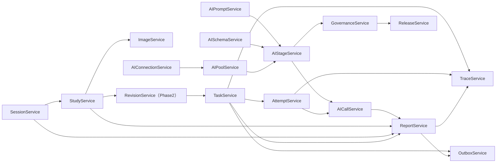

# MS-Image Service（业务服务层）与表设计

> 中文阅读说明：`Service` 是“业务服务层”；其余英文术语请参阅[英文术语中英对照](../../术语中英对照.md)。

> **SUPERSEDED / 已被取代**：本文对应旧 12 表 Service 映射，仅保留为设计演进记录。当前 Service 与表关系以 [MS-Image 最终架构、数据库与完整链路设计](../../ms-image-final-architecture-and-database-design.md) 为准。

状态：`SUPERSEDED`（已被取代）

当前依据：[MS-Image 最终架构、数据库与完整链路设计](../../ms-image-final-architecture-and-database-design.md)

历史语境：本文后文的“当前”“必须”和代码落点只描述旧 12 表 Service 方案，不构成当前实现合同。

本文件用于整理历史版本的 Service 分层、模块依赖、事务边界和表映射。字段、索引内容仅供历史参考；当前定义以 [MS-Image 最终架构、数据库与完整链路设计](../../ms-image-final-architecture-and-database-design.md) 为准。

> 字段审计说明（2026-08-17）：已移除旧 Service（业务服务层）合同中无独立事实所有权的 `parent_image_id`（单父影像标识）、`task_attempt_id`（任务尝试标识）和 `stage_round_id`（阶段轮次标识）参数。旧服务边界仍只用于解释演进。

## 1. Service（业务服务层）设计原则

```text
API
  -> Service
  -> CRUD(DalBase)
  -> Model/DB
```

规则：

- API 只接收请求、做依赖注入和响应包装。
- Service 只做业务编排、校验、状态流转和跨模块调用。
- CRUD/DAL 只做数据访问。
- Service 构造函数接收 `AsyncSession`。
- Service 不依赖 `Request`、`APIRouter`、`Depends`。
- Service 不直接写 SQL 或拼接复杂 SQLAlchemy 查询。
- 一个模块只拥有自己的表。
- 跨模块通过 Service 合同调用，不直接访问其他模块 DAL。

## 2. 模块与表所有权

| Service（业务服务层） | 拥有表 | 关键职责 |
|---|---|---|
| `SessionService` | `session_record` | 创建/关闭/取消会话 |
| `StudyService` | `study_record` | 创建/完成/失败 Study（影像检查） |
| `ImageService` | `image_record`（影像记录表） | 影像上传受理、元数据、对象引用、hash、UID、校验与隔离；不管理报告或任意公共文件 |
| `TaskService` | `task_record` | 任务创建、快照、投递、状态、重试汇总 |
| `AttemptService` | `task_attempt_record` | Worker（异步工作进程） 租约、心跳、尝试状态 |
| `AIConnectionService` | `ai_connection_record` | Provider（AI 服务提供方） 连接和 qualification |
| `AIPromptService` | `ai_prompt_revision` | Prompt（提示词） 版本、发布、校验 |
| `AISchemaService` | `ai_output_schema` | 输出 Schema 版本 |
| `AIPoolService` | `ai_model_pool_lane` | 模型池泳道 |
| `AIStageService` | `ai_stage_round` | 阶段轮次配置 |
| `AICallService` | `ai_call_record` | 模型请求审计 |
| `ReportService` | `report_record` | 结果、报告版本、发布状态 |

第二阶段：

| Service（业务服务层） | 拥有表 |
|---|---|
| `RevisionService` | `study_revision`、`study_revision_item` |
| `TraceService` | `trace_event_record` |
| `OutboxService` | `outbox_record` |
| `GovernanceService` | `ai_governance_change_record` |
| `ReleaseService` | `release_event_record` |

## 3. Service（业务服务层）依赖图



## 4. Service（业务服务层）合同

### 4.1 `SessionService`（会话服务）

依赖表：

```text
session_record
```

方法：

```text
create_session(payload) -> session_id
get_session(session_id)
complete_session(session_id)
cancel_session(session_id)
```

幂等：

```text
(source_system, source_session_id)
request_id
```

### 4.2 `StudyService`（检查服务）

依赖表：

```text
study_record
```

方法：

```text
create_study(session_id, payload) -> study_id
get_study(study_id)
mark_study_ready(study_id)
fail_study(study_id, error)
```

### 4.3 `ImageService`（影像服务；现行替代）

依赖表：

```text
image_record（影像记录表）
```

方法：

```text
prepare_upload(study_id, series_id, payload) -> image_id
complete_upload(image_id, payload)
claim_validation(image_id, lease_generation)
verify_image(image_id, object_ref)
quarantine_image(image_id, reason)
list_ready_images(series_id) -> ordered images
create_derived_image(source_manifest, payload)
```

文件二进制由 OSS（对象存储）处理；`ImageService` 通过 `ImageDal(DalBase)` 保存影像域元数据和完整 `ObjectRef`（对象引用）。报告等非影像对象由各自业务 Service（业务服务层）拥有。

### 4.4 `TaskService`（任务服务）

依赖表：

```text
task_record
```

依赖 Service：

```text
StudyService
ImageService
RevisionService（第二阶段）
AttemptService
```

方法：

```text
create_task(study_id, task_type, contract) -> task_id
get_task(task_id)
cancel_task(task_id, expected_version)
mark_task_completed(task_id, report_id)
mark_task_failed(task_id, error)
```

创建任务时：

```text
读取 ready assets
生成 request_payload_json
冻结 asset_id、sequence_no、sha256
创建 task_record
创建首个 task_attempt_record
```

### 4.5 `AttemptService`（执行尝试服务）

依赖表：

```text
task_attempt_record
```

方法：

```text
start_attempt(task_id) -> attempt_id
heartbeat_attempt(attempt_id)
complete_attempt(attempt_id)
fail_attempt(attempt_id, error)
retry_attempt(task_id, previous_attempt_id)
```

### 4.6 `AIConnectionService`（AI 连接服务）

依赖表：

```text
ai_connection_record
```

方法：

```text
create_connection(payload)
update_connection(connection_id, payload)
qualify_connection(connection_id, result)
resolve_connection(connection_id)
```

### 4.7 `AIPromptService`（AI 提示词服务）

依赖表：

```text
ai_prompt_revision
```

方法：

```text
create_revision(prompt_key, version, language, content)
publish_revision(revision_id)
get_revision(prompt_key, version, language)
```

### 4.8 `AISchemaService`（AI 输出结构服务）

依赖表：

```text
ai_output_schema
```

方法：

```text
create_schema(schema_key, version, schema_json)
activate_schema(schema_id)
get_schema(schema_key, version)
```

### 4.9 `AIPoolService`（AI 模型池服务）

依赖表：

```text
ai_model_pool_lane
```

方法：

```text
upsert_lane(pool_key, lane_no, connection_id)
disable_lane(pool_key, lane_no)
resolve_pool(pool_key) -> ordered lanes
```

### 4.10 `AIStageService`（AI 阶段服务）

依赖表：

```text
ai_stage_round
```

方法：

```text
upsert_stage_round(payload)
activate_stage_round(round_id)
resolve_stage_round(pipeline_key, stage_key, version)
```

### 4.11 `AICallService`（AI 调用服务）

依赖表：

```text
ai_call_record
```

依赖 Service：

```text
AIStageService
AIConnectionService
AIPoolService
```

方法：

```text
start_call(task_id, stage_checkpoint_id, logical_call_key) -> call_id
complete_call(call_id, response_receipt)
fail_call(call_id, error)
mark_winner(call_id)
```

### 4.12 `ReportService`（报告服务）

依赖表：

```text
report_record
```

方法：

```text
create_report(task_id, final_ai_call_id, content) -> report_id
publish_report(report_id)
supersede_report(report_id, new_report_id)
query_latest_report(session_id/study_id/task_id)
```

第二阶段 Service：

```text
RevisionService.freeze_study(study_id)
TraceService.append_event(payload)
OutboxService.append(event)
GovernanceService.record_change(payload)
ReleaseService.transition(state)
```

## 5. Service（业务服务层）事务边界

| 操作 | 事务所有者 | 参与 Service（业务服务层） |
|---|---|---|
| 创建会话 | `SessionService` | session |
| 创建 Study（影像检查） | `StudyService` | study、session |
| 影像接入 | `ImageService` | image、study、series、outbox |
| 冻结 Revision | `RevisionService` | revision、image |
| 创建任务 | `TaskService` | task、study、revision、attempt |
| 执行模型请求 | `AICallService` | ai_plan、pool、connection、call |
| 生成报告 | `ReportService` | report、ai_call、task |
| 发布消息 | `OutboxService` | outbox、task/report |
| 配置变更 | `GovernanceService` | governance、对应 AI 配置表 |

规则：

- 事务所有者负责 commit/rollback。
- 被调用 Service 只提供领域操作，不自行 commit。
- 同一业务事务使用同一个 `AsyncSession`。

## 6. 表状态职责

| 表 | 负责状态 |
|---|---|
| `session_record` | 会话生命周期 |
| `study_record` | 影像检查接收与处理 |
| `image_record（影像记录表）` | 文件有效性、隔离、删除 |
| `task_record` | 任务执行、投递、重试、交付 |
| `task_attempt_record` | Worker（异步工作进程） 尝试和租约 |
| `ai_connection_record` | 连接与 qualification |
| `ai_prompt_revision` | Prompt（提示词） 版本发布 |
| `ai_output_schema` | Schema 启用 |
| `ai_model_pool_lane` | 泳道启用 |
| `ai_stage_round` | 阶段配置启用 |
| `ai_call_record` | 模型调用结果 |
| `report_record` | 结果和发布状态 |

## 7. 表关系

```text
session_record
  1 -> N study_record

study_record
  1 -> N image_record（影像记录表）
  1 -> N task_record

task_record
  1 -> N task_attempt_record
  1 -> N report_record

task_attempt_record
  1 -> N ai_call_record

ai_stage_round
  N -> 1 ai_prompt_revision
  N -> 0..1 ai_output_schema
  1 -> N ai_model_pool_lane（按 pool_key）

ai_model_pool_lane
  N -> 1 ai_connection_record

report_record
  N -> 0..1 ai_call_record（final_ai_call_id）
  1 -> 0..N 报告渲染 ObjectRef（对象引用，render_manifest_json）
```

## 8. 代码落点

```text
app/models/
  session.py
  study.py
  legacy_asset_model.py（历史示意文件，已废弃）
  task.py
  task_attempt.py
  ai_connection.py
  ai_prompt_revision.py
  ai_output_schema.py
  ai_model_pool_lane.py
  ai_stage_round.py
  ai_call.py
  report.py

app/crud/
  session.py
  study.py
  ...

app/service/
  session_service.py
  study_service.py
  asset_service.py
  task_service.py
  attempt_service.py
  ai_connection_service.py
  ai_prompt_service.py
  ai_schema_service.py
  ai_pool_service.py
  ai_stage_service.py
  ai_call_service.py
  report_service.py
```

依赖注入示例：

```python
async def get_task_service(
    db: AsyncSession = Depends(get_async_session),
) -> TaskService:
    return TaskService(db)
```

## 9. 历史方案当时边界

- 当前不生成迁移和测试脚本。
- 当前不修改现有数据库。
- 当前不调用真实 Provider。
- 当前只是 Service 和表结构设计。
