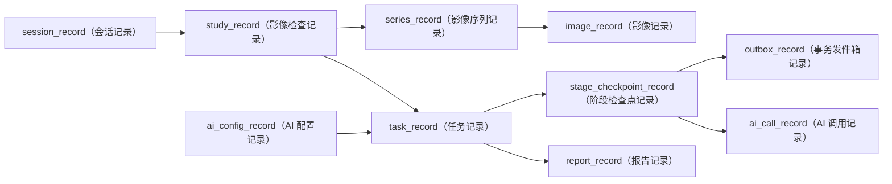

# XRay（X 光）6 表去冗余方案历史摘要

> 中文阅读说明：`ARCHIVED`（已归档）表示本文不能作为当前建表或迁移授权；通用术语请参阅[英文术语中英对照](../../../术语中英对照.md)。

状态：`ARCHIVED`（已归档）

当前依据：[MS-Image 最终架构、数据库与完整链路设计](../../../ms-image-final-architecture-and-database-design.md)。

历史语境：本文后文的“当前”只表示归档时记录的替代关系，不构成当前建表或迁移合同。

本文记录早期 XRay Accuracy（X 光准确率）6 表去冗余思路。该方案只服务 validation-only（仅验证）骨架，未覆盖 Session（会话）、Study（检查）、Series（序列）、Image（影像）、通用多模态报告和当前评测控制面，因此已经被当前 10 张在线表加 4 张评测表取代。旧候选字段从未成为当前生产合同，本文不再保留完整字段字典。

## 1. 当时保留的正确原则

1. 一个事实只有一个 owner（所有者）；状态、hash（摘要）和业务结果不能多表双写。
2. 不声明数据库 Foreign Key（外键），关系通过 tenant-scoped opaque ID（租户范围不透明标识）表达。
3. 状态和类型使用 String（字符串）或 JSON（结构化数据），不使用数据库 Enum（枚举）。
4. Broker（消息代理）只负责触发，MySQL（关系型数据库）中的 CAS（比较并交换）和 Outbox（事务发件箱）才是可靠执行事实。
5. Prompt（提示词）、响应、影像 bytes（二进制内容）、signed URL（签名链接）和 Secret（密钥）不能散落在业务表。
6. validation-only（仅验证）、shadow（影子运行）、gray（灰度）和 active（正式激活）是运行/发布模式，不能与医学结论混写。

这些原则继续有效，但旧 6 表边界已经不足。

## 2. 旧 6 表职责与归档时归宿

| 旧表 | 当时用途 | 当前归宿 | 结论 |
|---|---|---|---|
| `xray_accuracy_run`（X 光运行记录） | 保存一次验证运行和三组状态 | `task_record`（任务记录） | 通用化；XRay 只由 `study_record.modality_type=xray`（检查表影像模态为 X 光）表达 |
| `xray_accuracy_request_snapshot`（X 光请求快照） | 冻结 manifest（清单）和脱敏请求 | `task_record`（任务记录）请求快照或自己的完整 ObjectRef（对象引用） | 合并；不再为每个模态建专表 |
| `xray_accuracy_stage_checkpoint`（X 光阶段检查点） | 保存阶段 CAS（比较并交换）、lease（租约）和恢复 | `stage_checkpoint_record`（阶段检查点记录） | 通用化；保留独立生命周期 |
| `xray_accuracy_model_call`（X 光模型调用） | 保存 Provider（AI 服务提供方）请求审计 | `ai_call_record`（AI 调用记录） | 通用化；按 Stage（阶段）和逻辑调用键关联 |
| `xray_accuracy_trace_event`（X 光追踪事件） | 保存 append-only（仅追加写）技术追踪 | 外部 `AuditSink`（审计接收端）；合同未验证前保留现有 TraceEvent（追踪事件）事实 | 不进入当前核心 10 表，不能提前删除现有事实 |
| `xray_accuracy_outbox`（X 光事务发件箱） | 可靠发布 Worker（异步工作进程）事件 | `outbox_record`（事务发件箱记录） | 通用化；也承载 callback（回调）和 review handoff（人工复核交接）事件 |

旧方案没有 Session（会话）、Study（检查）、Series（序列）、Image（影像）、AI Config（AI 配置）和 Report（报告）的完整 owner（所有者），因此不能覆盖 CT（计算机断层成像）、MRI（磁共振成像）或完整在线诊断闭环。

## 3. 已删除的候选字段与双写

| 旧字段或表达 | 删除原因 | 当前单一事实源 |
|---|---|---|
| `case_request_id`（病例请求标识） | 没有已确认的独立授权、幂等或查询用途 | 上游 opaque ID（不透明标识）只在有明确合同的实体保存 |
| `engineering_eligibility`（工程可评估资格） | 在线工程状态与离线评测分母混合 | 在线 Stage（阶段）技术结果；离线由 `ms_image_eval`（影像评测控制面）计算 |
| Run（运行）级 `coverage_json`（覆盖数据） | 与 Study（检查）/Task（任务）快照、Call receipt（调用回执）重复 | expected/resolved/requested/sent manifest（预期/解析/请求/发送清单）各自由其 owner 保存 |
| `late_flag`（迟到标志） | 与 `status=late`（状态为迟到）双写 | Stage（阶段）状态和 late/ignored disposition（迟到/忽略处置） |
| `validation_only`（仅验证布尔值） | 与 `execution_mode`（执行模式）双写 | 受信控制面冻结的 `run_mode`（运行模式） |
| `image_count`（影像数量）类字段作为消费证明 | 数量不能证明顺序、内容或逐图消费 | manifest SHA256（清单摘要）+ Provider receipt（提供方回执） |
| Outbox（事务发件箱）同时保存同值 `id/event_id`（标识/事件标识） | 同一事件身份重复 | 单一事件主键和稳定 `event_key`（事件幂等键） |
| Run（运行）与 Snapshot（快照）重复保存 revision/hash/metadata（修订/摘要/元数据） | 形成双事实源 | 当前 Task（任务）不可变请求快照 |

## 4. 归档时替代关系

旧 `xray_accuracy_*`（X 光准确率类）物理表只能作为隔离验证历史处理，不允许直接 rename（重命名）、生产双写或一表一表照搬到当前通用表。迁移必须按业务语义、租户、hash（摘要）、状态所有权和不可变快照重新映射。

## 5. 实施边界

- 本文不授权创建、删除、清空或迁移任何数据库。
- 本文不授权生成 Alembic（数据库迁移工具）或测试脚本。
- 旧表中确有运行事实时先只读盘点，不能因为目标表已重设计就删除审计证据。
- 当前实现必须遵循 `API -> Service -> CRUD(DalBase) -> Model/DB`（接口到服务到数据访问到模型/数据库）。
- 资源 ID（标识）只放 query parameter（查询参数）或 request body（请求体），不使用 `/{id}` 路由。
