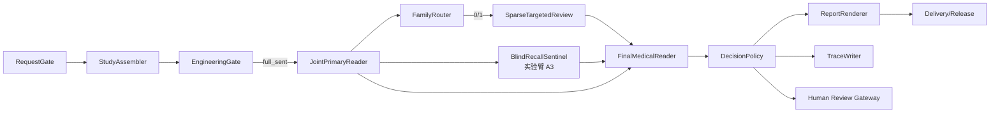

# XRay（X 光）V2 独立诊断服务详细开发文档

> 中文阅读说明：`ARCHIVED` 是“已归档”，`development document` 是“开发文档”；其余英文术语请参阅[英文术语中英对照](../../../术语中英对照.md)。

> `ARCHIVED / 历史资料`：本文仅用于追溯 XRay V2 设计过程，当前实现以根目录权威设计和最新工程证据为准。

状态：`ARCHIVED`（已归档）

当前依据：[MS-Image 最终架构、数据库与完整链路设计](../../../ms-image-final-architecture-and-database-design.md)

历史语境：本文后文的“当前”“现有”“下一步”“必须”和 `CONFIRMED` 均限定于 2026-08-09 及后续文内校正时点，不表示现在的仓库状态或执行授权。

版本：v1.1（完整开发计划稿）
日期：2026-08-09
目标仓库：`/Users/mozhicheng/workspace/code/cy-code/ms-image`
逻辑领域名称：`vet-xray-accuracy-service`

> 本文严格依据 `docs/history/xray/prompts/xray-accuracy-detailed-development-document-prompt.md` 编制。本文是设计与差距文档，不是实现状态声明。除本文外，不修改目标仓库业务代码、配置、数据库、迁移、测试脚本或参考仓库。

> 状态校正（2026-08-10）：实现状态以 `docs/history/xray/plans/xray-accuracy-phase0-development-plan.md` 和当前 artifacts 为准。当前工作树已增加公共 Broker/Celery/Outbox relay、Provider adapter、XRay Worker、validation-only Model/DAL/Service，并在隔离本机测试库完成 Stub/Replay 持久化闭环；这些本地工程证据不等于生产 Broker、真实 Provider、医学链或 G0 通过。

## 1. 证据规则与结论摘要

### 1.1 证据分类

| 标记 | 含义 | 本文使用方式 |
|---|---|---|
| `CONFIRMED` | 当前源码、工作树或原始专题证据直接确认 | 可作为当前基线事实 |
| `INFERRED` | 由多个证据推导但未由单一原始事实直接确认 | 必须在 P0 复核 |
| `PROPOSED` | 本文目标方案，尚未实现 | 不得写成现状 |
| `UNKNOWN` | 尚无可信证据，或外部事实未能独立核验 | 阻断相关实验/发布 |
| `N/A` | 当前阶段不适用 | 不进入医学分母 |

权威顺序固定为：原始 validation JSON/manifest/image hash/model trace/truth audit > 当前实际代码 > Git/Prompt 资产 > 专题 07 准确率合同 > 专题 08 独立服务设计 > 历史方案与日志。专题根 README 明确 07 是准确率上游基线，08 是 ms-image 独立服务设计；文档完整不等于代码已实现或准确率已提升（`/Users/mozhicheng/workspace/code/py-project-v2/vet-platform-system/vet-platform/documents/X光V2重构专题/README.md:3-9`、`/Users/mozhicheng/workspace/code/py-project-v2/vet-platform-system/vet-platform/documents/X光V2重构专题/07-准确率优先全链路重构文档包/README.md:7-16,84-86`）。

### 1.2 执行摘要

当前 ms-image 已有 validation-only 的零模型 XRay Run/Trace/Outbox 合同、tenant-scoped API、SQLAlchemy Model/DAL/Service、技术型 Prompt registry、stub AI 请求、公共 Outbox relay/Celery Worker 和 deterministic replay；隔离本机测试库已完成 Service→DalBase→Worker 持久化闭环。仍不存在 Study 组装、图像完整性门、医学 Prompt/医学模型调用、医学 scorer、Alembic revision、生产 Broker/Worker 证据或真实 Provider qualification。医学准确率、正式盲测和生产替换状态均为 `UNKNOWN/PAUSED/NO-GO`。首轮仍禁止真实医学 Provider。

目标是在既有仓库内建立 XRay 领域模块和可替换 Worker，先 validation-only/shadow，保持 vet-platform 生产 V2 唯一 active。医学链的唯一 AI final owner 是 `FinalMedicalReader`；Python、Renderer、fallback 和 Human Review 不改写 AI 医学结论。只有 trusted gold、paired A/B、三次 fresh replicate、隔离 Holdout、可审计 full_sent 和真实 Provider qualification 全部通过，才讨论灰度。

### 1.3 关键链路问题（记录时点已确认或待复核）

1. Phase 0 前的 `main.py` 创建 `admin_app`，但默认 Docker 只运行 `main:app`；本轮已增加 Compose `admin` 服务和 8001 暴露，但反向代理外部路径仍未验证（`/Users/mozhicheng/workspace/code/cy-code/ms-image/main.py:33-48,108-109`；`/Users/mozhicheng/workspace/code/cy-code/ms-image/docker-compose.yml:1-61`）。
2. requirements 含 Celery/Pika；当前已增加共享 Celery app factory、XRay task、Transactional Outbox relay、Worker 和 replay contract，但生产 Broker/consumer/DLQ/recovery 尚无部署证据（`/Users/mozhicheng/workspace/code/cy-code/ms-image/app/core/messaging/`、`/Users/mozhicheng/workspace/code/cy-code/ms-image/workers/xray_accuracy_worker/`、`docs/artifacts/p0-broker-adr.md`）。
3. 本轮已为用户端和 admin_app 复用 Redis lifespan，并将 ping 失败时 client 清空、readiness 返回失败；Redis 仍不能作为事实源或可靠队列（`/Users/mozhicheng/workspace/code/cy-code/ms-image/main.py:24-31,42-49`、`/Users/mozhicheng/workspace/code/cy-code/ms-image/app/core/redis_manager.py:7-44`）。
4. 现有文档中“管理员硬编码 Basic Auth”的描述与当前工作树代码不一致：实际 `admin.py` 使用独立 HS256 JWT 和 scope 依赖（`/Users/mozhicheng/workspace/code/cy-code/ms-image/app/api/admin_v1/endpoints/admin.py:10-13,31-34`、`/Users/mozhicheng/workspace/code/cy-code/ms-image/app/api/deps.py:75-122`）。文档应标记旧描述为 stale，P0 仍需完成租户隔离和控制面授权。
5. 代码同时存在 SQLAlchemy `DalBase` 与 MongoEngine legacy `CRUDBase`；新 XRay 只能使用前者，禁止把 `/Users/mozhicheng/workspace/code/cy-code/ms-image/app/crud/base.py:14-111` 引入新链。`/Users/mozhicheng/workspace/code/cy-code/ms-image/app/crud/example_user.py:13-36` 的 `model=None` 只是示例，不是可复用实体 DAL。
6. API 当前已有 validation-only XRay Run/Trace/取消和 admin tenant-scoped control read；Study/EngineeringGate、Provider qualification 持久化、医学节点、scorer 和生产 Worker 仍缺失，技术 Worker/Outbox relay 仅有本地工程证据（`/Users/mozhicheng/workspace/code/cy-code/ms-image/app/api/api_v1/api.py`、`/Users/mozhicheng/workspace/code/cy-code/ms-image/app/api/api_v1/endpoints/xray_runs.py`、`/Users/mozhicheng/workspace/code/cy-code/ms-image/workers/xray_accuracy_worker/`）。
7. `main.py` 的 root_path 只是 ASGI 部署提示，不证明代理真的暴露 `/ms-image`；外部路径、OpenAPI、健康检查必须通过代理回归冻结（`/Users/mozhicheng/workspace/code/cy-code/ms-image/main.py:33-48`）。
8. Alembic 现在显式导入 XRay model，并从 Settings 构造 URL；`alembic_migrations/versions/` 仍为空，测试库由 metadata.create_all 创建，未生成 revision。首轮 schema 只在隔离测试库验收，生产迁移需另行授权。Compose 的 MySQL/Redis/RabbitMQ host 端口已收窄为本机开发绑定，但生产网络隔离仍是 UNKNOWN。
9. 审计发现取消接口在 `cancel_requested` 状态下若带当前版本重试，会再次递增 CAS 版本并追加 Trace/Outbox；现已改为同状态幂等返回。幂等创建也只吞掉明确的 `(tenant_id,request_id,contract_version)` 唯一冲突，其他完整性错误继续作为技术错误抛出（`app/service/xray_accuracy/application_service.py`、`app/crud/xray_accuracy/run.py`）。
10. 管理 readiness 原先匿名返回依赖组件状态，和控制面最小暴露合同不一致；现已要求 `xray:admin:read`，旧的匿名 503 smoke 记录降级为过时证据（`app/api/admin_v1/endpoints/admin.py`、`docs/artifacts/p0-process-boundary.md`）。禁止输入错误现在不再把用户字段路径放进响应，只保留稳定错误码。
11. Outbox 模型已补充消息 hash、白名单版本、发布尝试和最后错误等 relay 对账字段；当前测试 schema 删除了重复 aggregate 字段，并以 ORM synonym 保留 event_id 兼容访问。没有生产 migration、Broker recovery 或持久化 DLQ 证据；该变化仍是 `PARTIAL`（`app/models/xray_accuracy/outbox.py`、`docs/artifacts/p0-imaging-test-db-qualification.json`）。
12. 请求 schema 的 `study_revision` 若只停留在 API 体会破坏 Study lineage；当前仅由不可变 RequestSnapshot 保存，Run 不重复存储该事实，生产 schema 仍待迁移授权（`app/schemas/xray_accuracy/run.py`、`app/models/xray_accuracy/request_snapshot.py`、`app/service/xray_accuracy/application_service.py`）。
13. Outbox DAL 现在会重算并校验白名单消息 hash、版本和状态；`event_id` 是 `id` 的逻辑 synonym，避免重复物理列。API 外层事务、relay/publish 状态推进已有本地测试库证据，生产部署和恢复演练尚未实现（`app/crud/xray_accuracy/outbox.py`、`app/service/xray_accuracy/application_service.py`）。

### 1.4 记录时点证据表

| ID | 结论 | 分类 | 证据 | 关闭/复核动作 | Owner |
|---|---|---|---|---|---|
| E01 | 用户端和管理端是两个 FastAPI 实例 | CONFIRMED | `/Users/mozhicheng/workspace/code/cy-code/ms-image/main.py:33-48`，符号 `app/admin_app` | P0 冻结部署方式 | 平台负责人 |
| E02 | 默认 Docker 只启动用户 `app` | CONFIRMED | `/Users/mozhicheng/workspace/code/cy-code/ms-image/Dockerfile:25-28` | 双端启动和代理回归 | 平台/SRE |
| E03 | 已有 validation-only XRay（X 光） 路由、Model、DAL（数据访问层）、Service（业务服务层） 草案，医学链仍不存在 | CONFIRMED | `/Users/mozhicheng/workspace/code/cy-code/ms-image/app/api/api_v1/endpoints/xray_runs.py`、`app/models/xray_accuracy/`、`app/crud/xray_accuracy/`、`app/service/xray_accuracy/` | G0/DB schema/迁移授权和零模型 replay 验收 | 后端负责人 |
| E04 | SQLAlchemy 异步 `DalBase` 是新链唯一 DAL（数据访问层） 基线 | CONFIRMED | `/Users/mozhicheng/workspace/code/cy-code/ms-image/app/core/crud.py:24-345`，符号 `DalBase` | 每个实体 DAL（数据访问层） 继承性审查 | 数据负责人 |
| E05 | MongoEngine CRUD 是 legacy，不能进入 XRay（X 光） | CONFIRMED | `/Users/mozhicheng/workspace/code/cy-code/ms-image/app/crud/base.py:14-111`，符号 `CRUDBase` | import/依赖扫描为零 | 架构负责人 |
| E06 | Celery/Pika、共享 Broker（消息代理）/Relay/Worker（异步工作进程） 代码已存在，但生产部署与恢复未验收 | PARTIAL | `/Users/mozhicheng/workspace/code/cy-code/ms-image/app/core/messaging/`、`workers/xray_accuracy_worker/`、`docs/artifacts/p0-imaging-test-db-qualification.json` | Broker（消息代理） 生产审批、恢复演练和 G0 | 异步基础设施负责人 |
| E07 | 用户/管理 app 复用 Redis lifespan；失败清空 client，readiness fail-closed，断线后探针可重连 | CONFIRMED | `/Users/mozhicheng/workspace/code/cy-code/ms-image/main.py`、`app/core/redis_manager.py`、`app/core/readiness.py` | 部署环境 readiness 与故障恢复演练 | 平台/SRE |
| E08 | 零模型 XRay（X 光） 路由已使用 tenant claim 和 DAL（数据访问层） tenant filter，真实 DB 越权回归仍缺失 | PARTIAL | `/Users/mozhicheng/workspace/code/cy-code/ms-image/app/api/deps.py`、`app/api/api_v1/endpoints/xray_runs.py`、`app/api/admin_v1/endpoints/xray_control.py` | 部署环境同租户/跨租户验收 | 安全负责人 |
| E09 | 完整 Study（影像检查） 联合主读可能改善准确率 | PROPOSED | 专题 07 的实验假设，不是已证实增益 | A1 paired + fresh replicate + Holdout | 医学 AI/统计负责人 |
| E10 | Provider（AI 服务提供方） 是否逐图消费、Study（影像检查） 上游是否完整 | UNKNOWN | 当前无 receipt/manifest artifact | Phase 2 qualification artifact | Provider（AI 服务提供方）/影像负责人 |
| E11 | 医学准确率、生产替换资格 | UNKNOWN | trusted gold、paired、Holdout 尚未通过 | Phase 5 后才允许结论 | 医学负责人 |
| E12 | 零模型工程链路已实现；医学 Provider（AI 服务提供方）/准确率验证未实现 | PARTIAL | 用户后续授权先完成链路改动；`docs/artifacts/p1-zero-model-chain-contract.md` | G0、DB schema/迁移授权、医学阶段门禁 | 项目负责人 |

### 1.5 阅读导航与术语

建议阅读顺序：管理/评审先读第 1、2、11、12、16–18 章；后端先读第 3–10、12 章；医学 AI 先读第 4、9、11 章；QA/SRE 先读第 5、8、10、12、14、18 章。

| 术语 | 本文唯一含义 |
|---|---|
| `Implementation Phase` | 第 12 章的工程交付阶段 Phase 0–6 |
| `Experiment Arm` | Control、B0、A1、A3a、A2、A3b、A4，不等于工程 Phase |
| `stage_key` | 一次 Run 内的机器状态节点，如 `engineering_gate`、`joint_primary_reader` |
| `Priority P0/P1` | 风险/问题优先级，不等于 `Phase 0/1` |
| `ai_final_decision` | FinalMedicalReader 写一次的 AI 结果；允许 normal/abnormal/review_required/non_diagnostic |
| `human_decision` | 人工复核独立结果，不覆盖 `ai_final_decision` |
| `report_decision` | 报告引用 AI 或人工结果，不得重新诊断 |
| `full_sent` | expected/resolved/requested/sent 四集合一致且逐图 receipt 可信；无逐图 receipt 一律不能为 true |

| Implementation Phase | 可运行 Experiment Arm | 新启用的主要 stage_key |
|---|---|---|
| Phase 0 | 无 | readiness/auth/tenant/broker ADR |
| Phase 1 | 无，只有 stub/replay | request_gate、状态/trace/outbox 骨架 |
| Phase 2 | B0 工程 qualification | study_assembler、engineering_gate |
| Phase 3 | Control、B0、A1 | joint_primary_reader、final_medical_reader |
| Phase 4 | A3a、A2、A3b、最后 A4 | blind_recall_sentinel、family_router、sparse_targeted_review |
| Phase 5 | paired、fresh replicate、Holdout | scorer/manifest，不增加生产医学节点 |
| Phase 6 | Shadow、Gray、Active | release_governor、review_gateway |

## 2. 背景、目标与边界

### 2.1 背景

历史 V2/V3 将图像 fan-out、单项分析、文本融合、旧 gate、fallback 和报告拼装耦合，无法证明每例实际发送了完整 Study，也无法把医学错误与工程失败归因。专题 07 的辩证审查指出：图像截断、Study identity 错合并、primary 漏诊无法触发 targeted review、Final evidence anchoring、共同错误、弱标签分母和 review 掩盖都会制造虚假提升（`/Users/mozhicheng/workspace/code/py-project-v2/vet-platform-system/vet-platform/documents/X光V2重构专题/07-准确率优先全链路重构文档包/01-辩证评审与准确率修订结论.md:6-26,41-59`）。

### 2.2 目标（`PROPOSED`：已提出，尚未实现）

- 建立可追溯的 Run/RequestSnapshot/StageCheckpoint/ModelCall/Finding/Review/Outbox/ReleaseEvent 数据合同。
- 以 Study 为最小医学上下文，完成真实 ordered SHA 与 provider receipt 的 `full_sent` 门禁。
- 采用以下独立链：

  `RequestGate → StudyAssembler → EngineeringGate → JointPrimaryReader → FamilyRouter → SparseTargetedReview（可选） → FinalMedicalReader → DecisionPolicy → ReportRenderer → TraceWriter → Human Review Gateway`。

- 通过双状态域、CAS、lease、幂等、late trace、死信和孤儿恢复保证最终 owner 唯一。
- 以 Control/B0/A1/A2/A3a/A3b/A4、trusted gold、paired、fresh replicate、Holdout 证明或否定医学增益。
- 在 shadow/gray 期间不覆盖旧平台生产报告，任意 fallback 明确标记为 `v2_fallback`。

### 2.3 非目标（`N/A`：不适用，或后置）

- 本轮不实现医学代码、真实 Provider、模型训练、Embedding 在线裁决、DICOM 转换、迁移脚本、测试脚本或生产替换。
- 不复制 vet-platform 的旧 `xray_v2` Pipeline、单图 fan-out、mandatory 全量 closure、text-only CaseAdjudicator、同源多数票或 Python 医学覆盖。
- 不将技术成功率、解析率、延迟、review 率称为医学准确率。
- 不把 `ABN/NOR`、疾病码、文件名/目录标签、历史模型结果、弱标签、人工结论或 score eligibility 送入在线医学 Prompt。

### 2.4 责任边界

| 领域 | vet-platform（现平台） | ms-image（目标独立服务） |
|---|---|---|
| 用户/租户/病例 | 鉴权、用户、病例关系、原图凭证、任务入口 | 接收并验证最小安全合同，不拥有上游 truth |
| 生产链 | 旧 V2、生产报告、灰度回切 | 不替换旧生产链，shadow 旁路 |
| Study（影像检查） 证据 | 提供 study/revision/expected manifest | 组装、去重、ordered hash、完整性和 provider receipt |
| 医学读片 | 旧系统责任 | JointPrimary、Family 路由、Targeted、Final AI 状态 |
| 审计/实验 | 旧日志仅作历史证据 | Run/Trace（技术追踪）/分母/fingerprint/scorer/release artifact |
| 发布 | 保留旧入口和唯一生产 owner | 通过 release contract 后才申请灰度 |

两边通过版本化安全 Study 请求交互；ms-image 不接受标签、truth、历史结论或可推断标签的 EXIF/OCR。

## 3. 记录时点 ms-image 代码基线

### 3.1 启动与路由

- 用户 `app`：`FastAPI(... root_path='/ms-image')`，`/api/v1` 前缀来自 `settings.API_V1_STR`，已有 health/version/readiness 以及 `/xray/runs`、`/xray/run-cancellations`、`/xray/traces` validation-only 路由（`/Users/mozhicheng/workspace/code/cy-code/ms-image/main.py`；`/Users/mozhicheng/workspace/code/cy-code/ms-image/app/api/api_v1/endpoints/xray_runs.py`）。
- 管理 `admin_app`：独立 `FastAPI(... root_path='/ms-image/admin')`，注册 status/info/readiness 和 tenant-scoped `/api/v1/xray/control/runs`（`/Users/mozhicheng/workspace/code/cy-code/ms-image/main.py`；`/Users/mozhicheng/workspace/code/cy-code/ms-image/app/api/admin_v1/endpoints/xray_control.py`）。Compose 现有独立 admin 服务，代理路径仍需外部验证。
- 生命周期初始化 Redis 并写入 `app.state.redis_manager`；新增 readiness 对 DB/Redis/Broker 返回真实状态，数据库 engine 仍在导入时创建（`/Users/mozhicheng/workspace/code/cy-code/ms-image/main.py:24-31`；`/Users/mozhicheng/workspace/code/cy-code/ms-image/app/core/readiness.py:1-54`）。

### 3.2 依赖、基础设施与配置

`requirements.txt` 固定 FastAPI 0.115.6、SQLAlchemy 2.0.36/aiomysql、Alembic、Redis 5.2.1、Celery 5.5.2、Pika 1.3.2、MongoEngine、OSS/aiofiles 等（`/Users/mozhicheng/workspace/code/cy-code/ms-image/requirements.txt:1-55`）。Compose 提供 MySQL 8、Redis 7、RabbitMQ 3.13 基础设施及健康检查，并声明 app/admin/relay/worker 服务；Docker daemon 和生产消费尚未验收（`/Users/mozhicheng/workspace/code/cy-code/ms-image/docker-compose.yml:1-145`）。

主/HD 两个异步 engine 的连接池均为 size=5、overflow=5、pre_ping/recycle=3600（`/Users/mozhicheng/workspace/code/cy-code/ms-image/app/core/async_db.py:7-53`）；session dependency 在事务上下文中 yield（`/Users/mozhicheng/workspace/code/cy-code/ms-image/app/core/async_db.py:97-114`）。

### 3.3 数据访问与模型

规范 DAL 是 `app.core.crud.DalBase`，异步提供 `get_data/get_datas/get_count/create_data/create_datas/put_data/cas_put_data/delete_datas`（`/Users/mozhicheng/workspace/code/cy-code/ms-image/app/core/crud.py:24-36,38-345`）。新实体 DAL 必须在 `app/crud/` 单次继承它，并由 Service 注入 `AsyncSession`。

已增加 `app/models/xray_accuracy/` 的 Run/Snapshot/Checkpoint/ModelCall/Trace/Outbox 草案，均无 foreign key、状态为 string、字段带候选 SQL 类型和中文 comment；当前没有 Alembic migration。MongoEngine `CRUDBase` 是遗留同步实现（`/Users/mozhicheng/workspace/code/cy-code/ms-image/app/crud/base.py:1-111`），不得用于新链。

### 3.4 鉴权、租户与响应

用户 JWT 使用 RS256 key/issuer/audience/exp/sub；管理员使用隔离 HS256 key、tenant claim 和 scope（`/Users/mozhicheng/workspace/code/cy-code/ms-image/app/api/deps.py`）。零模型 XRay 路由已使用用户/管理员 tenant scope；`GenericResponse`/`PagedResponse` 复用于外部响应，XRay 专用 schema 位于 `app/schemas/xray_accuracy/`。

### 3.5 Alembic（数据库迁移工具）与工作树

`alembic_migrations/env.py` 使用同步 `engine_from_config`，已显式导入 XRay metadata，并通过 Settings/`URL.create` 构造 URL，不再依赖 `alembic.ini` 硬编码密码；当前没有 `versions/` revision（`/Users/mozhicheng/workspace/code/cy-code/ms-image/alembic_migrations/env.py:13-31,72-84`）。当前工作树已有用户修改（`.env.example`、`.gitignore`、`AGENTS.md`、`CLAUDE.md`、`README.md`、`USAGE.md`、鉴权/config/requirements 及 `app/lib/`）；禁止 reset/checkout/clean 或覆盖。

## 4. 目标架构与完整数据流（`PROPOSED`：已提出，尚未实现）



1. **RequestGate**：鉴权、tenant scope、`extra=forbid` schema、大小/请求频率/敏感字段递归泄漏检查、request_id 幂等。
2. **StudyAssembler**：冻结 RequestSnapshot；校验 study/revision/event、序列、projection、重复和冲突；计算 expected ordered SHA。
3. **EngineeringGate**：下载短期凭证或内部 ref；校验 allowlist、重定向、MIME、字节/像素/方向/EXIF/叠加层；计算 resolved/sent SHA 和 provider receipt；不能完整发送则 fail-closed。
4. **JointPrimaryReader**：一次完整原图联合主读，输出逐图 source anchor、跨投照证据、候选 Family、normal basis；不接收 truth/历史结论。
5. **FamilyRouter**：只按 primary evidence 路由，不重新读图、不写医学结论；记录 route_reason、selected_families、mandatory_closure、fingerprint。
6. **SparseTargetedReview**：最多一次，专门处理 FP-prone、open-set、高风险或单投照冲突；失败只写 `review_delta_failed`，原图可用仍进入 Final。
7. **BlindRecallSentinel**：A3 固定实验臂，primary-negative 子样本盲读，不接收 primary findings/route pack，不写 final。
8. **FinalMedicalReader**：重新接收完整原图；`independent_first` 与 `evidence_visible` 必须作为不同实验臂。仅此节点写一次 `ai_final_decision`。
9. **DecisionPolicy**：只检查状态、证据锚点、预算、coverage 和 writer CAS，不做医学判断或结果改写。
10. **ReportRenderer/TraceWriter/Human Review Gateway**：渲染只能引用 AI 或人工记录；review/non-diagnostic 入队，人工结果另存，不能覆盖 AI trace。

## 5. API（应用程序接口）合同

### 5.1 路由

内部路由（挂在现有 `/api/v1`）：

```text
POST /api/v1/xray/runs
GET  /api/v1/xray/runs?run_id={run_id}
POST /api/v1/xray/run-cancellations
```

禁止 `/{id}`。外部 `/ms-image` 或 `/ms-image/admin` 只在反向代理/OpenAPI/受控请求确认后冻结，不能由 `root_path` 单独推断。

### 5.2 创建请求（`extra=forbid`：禁止额外字段）

```json
{
  "request_id": "opaque-request-id",
  "study_id": "opaque-study-id",
  "study_revision_id": "opaque-revision-id",
  "expected_image_manifest": [{
    "source_index": 0,
    "image_ref": "short-lived-ref-or-url",
    "expected_sha256": "64-hex",
    "projection_hint": "optional-safe-string"
  }],
  "images": [{"source_index": 0, "image_ref": "...", "safe_metadata": {}}],
  "contract_version": "xray.request.v1"
}
```

允许的 safe metadata：species、body_part_hint、projection_hint、study_date、序号。拒绝 ABN/NOR、疾病码、filename/path、历史报告/模型输出、failure-bank、truth、score eligibility、bbox/annotation、可推断标签的 EXIF/OCR。

服务端决定 chain/model/prompt/retry/fallback，不接受客户端覆盖。图片 credential 必须短期、单用途、allowlist 绑定且不写 broker。

### 5.3 响应与错误

创建返回 HTTP `202`、`GenericResponse[RunAccepted]`、run_id、request_id、release_fingerprint 和受信控制面冻结的 `run_mode=validation_only`。查询返回三正交状态、coverage、findings、limitations、review、decision_owner、trace_ref、`production_eligible=false`；工程资格由 Stage（阶段）事实判断，不在 Run（运行）重复保存。

错误类别：`INPUT_INVALID`、`LEAKAGE_INVALID`、`STUDY_IDENTITY_CONFLICT`、`PARTIAL_SENT`、`OVER_BUDGET`、`PROVIDER_UNQUALIFIED`、`TECHNICAL_FAILURE`、`CANCELLED`、`DEAD_LETTER`。技术失败不得携带 normal/abnormal 医学 verdict。

取消 body：`run_id`、`reason`、`expected_version`、`request_id`；CAS 成功后阻止后续发布，迟到 Provider 结果仅写 late trace。

### 5.4 鉴权、租户与幂等

- 诊断平面使用平台签发的用户/内部 JWT；控制平面使用管理员 JWT scope（至少 `xray:admin:read`，写 release/truth/Holdout 需独立 scope）。
- 每个 Run 保存 tenant_id、subject_id 和有明确合同的 request_id；所有查询、取消、review、release 操作带 tenant scope，控制面与数据面分离。
- `request_id + tenant_id + contract_version` 唯一幂等键；同键 payload hash 不同返回冲突，不新建 Run。
- 状态更新必须带 `expected_version`/CAS；尝试使用新的 attempt_id；最终 writer 只允许一个成功者。

### 5.5 API（应用程序接口）版本、查询与兼容规则（`PROPOSED`：已提出，尚未实现）

- URI 只承载主版本 `/api/v1`；业务合同使用 `contract_version=xray.request.v1`、`response_schema_version=xray.response.v1`。
- 服务端只接受 allowlist 中的合同版本；未知 major 返回 `CONTRACT_VERSION_UNSUPPORTED`。同 major 只允许新增可选字段，不改变既有字段语义。
- 响应始终回显 request/response schema version、chain_version、release_fingerprint；废弃版本至少提前一个发布周期记录告警，禁止静默转换医学字段。
- 单 Run 查询使用 `run_id` query；列表查询使用 `page/limit`、`created_from/created_to`、`execution_status/delivery_status` query，强制 tenant scope，返回 `PagedResponse`。不得支持任意字段排序或客户端 SQL 表达式。
- `GET` 只返回可授权字段；原始 Prompt、原图地址、Provider secret、完整 raw output 不在普通响应中。

### 5.6 错误 Envelope（响应信封）与 HTTP（超文本传输协议）映射（`PROPOSED`：已提出，尚未实现）

错误响应统一为 `GenericResponse[ErrorDetail]`，`success=false`，`data={error_code,retryable,run_id,trace_ref,current_version}`；禁止把内部异常栈和敏感 URL 返回客户端。

| 场景 | HTTP | error_code | 可重试 | Run 语义 |
|---|---:|---|---|---|
| schema/extra 字段非法 | 422 | INPUT_INVALID | 修正后可新请求 | 不创建 Run |
| 泄漏门命中 | 422 | LEAKAGE_INVALID | 否，必须修输入 | 不调用模型；是否保留审计 Run 由 ADR-API（应用程序接口）-01 决定 |
| 未认证/租户越权 | 401/403 | AUTH_INVALID/TENANT_FORBIDDEN | 否 | 不泄露 Run 是否存在 |
| request_id 相同且 payload hash 相同 | 200/202 | IDEMPOTENT_REPLAY | 是 | 返回既有 Run |
| request_id 相同但 payload hash 不同 | 409 | IDEMPOTENCY_CONFLICT | 否 | 不创建第二 Run |
| expected_version 过期 | 409 | STATE_VERSION_CONFLICT | 读取后重试 | 返回 current_version |
| Study（影像检查）/revision 冲突 | 422 | STUDY_IDENTITY_CONFLICT | 修正数据后重试 | fail-closed |
| Run 不存在 | 404 | RUN_NOT_FOUND | 否 | 同租户内仍返回通用信息 |
| 已完成后取消 | 409 | RUN_TERMINAL | 否 | 不改变终态 |
| 已接受后工程失败 | 查询返回 200 | TECHNICAL_FAILURE/PARTIAL_SENT/OVER_BUDGET | 按 retry policy | Run 为 failed；AI 为 not_produced |
| 服务未配置/依赖不可用 | 503 | SERVICE_NOT_READY | 是 | 创建前失败则不建 Run |

### 5.7 受理、查询与取消时序（`PROPOSED`：已提出，尚未实现）

```text
POST /runs
  → auth/tenant/schema/leakage/idempotency
  → transaction: Run + Snapshot + Checkpoint + Outbox
  → 202
  → relay/worker 异步推进

GET /runs?run_id=
  → auth/tenant scope
  → Run + 允许展示的 Finding/Review/coverage
  → 200（即使异步执行失败，失败通过状态表达）

POST /run-cancellations
  → auth/tenant + expected_version
  → CAS cancelled/suppressed
  → Provider 迟到结果只写 late trace
```

## 6. API（应用程序接口）→ Service（业务服务层）→ CRUD（增删改查）→ Model/DB（模型/数据库）分层

### 6.1 目录（零模型骨架 `PARTIAL`：部分完成；医学/Provider（AI 服务提供方）部分仍 `PROPOSED`：已提出）

当前已落地的零模型文件为 `xray_runs.py`、`xray_control.py`、
`app/schemas/xray_accuracy/`、`app/models/xray_accuracy/{run,request_snapshot,stage_checkpoint,model_call,trace_event,outbox}.py`、
对应 `app/crud/xray_accuracy/`、`app/service/xray_accuracy/` 以及
`workers/xray_accuracy_worker/replay.py`；这些文件不含真实 Provider 或医学 verdict。

```text
app/api/api_v1/endpoints/xray_runs.py
app/api/admin_v1/endpoints/xray_control.py
app/schemas/xray_accuracy/{requests,responses,internal,validation}.py
app/models/xray_accuracy/{run,request_snapshot,image,stage_checkpoint,model_call,finding,review,outbox,release_event}.py
app/crud/xray_accuracy/{run,request_snapshot,image,stage_checkpoint,model_call,finding,review,outbox,release_event}.py
app/service/xray_accuracy/{application_service,state_machine,study_assembler,engineering_gate,joint_primary_reader,family_router,blind_recall_sentinel,sparse_targeted_review,final_medical_reader,decision_policy,report_renderer,prompt_registry,prompt_renderer,leakage_preflight,checkpoint_service,trace_service,release_governor}.py
app/service/xray_accuracy/providers/{base,openai_compatible,qualification}.py
workers/xray_accuracy_worker/{celery_app,tasks,reconcile}.py
evaluation/{manifest,failure_bank,scorer,holdout}.py
prompts/xray_accuracy/...
```

### 6.2 调用责任

Endpoint 只做 request parsing、依赖注入、鉴权和 `GenericResponse/PagedResponse` 包装；不拼 SQL、不下载图片、不编排多个 DAL。Service 构造函数接收 `AsyncSession`，初始化实体 DAL 并编排状态、幂等、预算、Provider adapter。DAL 继承 `app.core.crud.DalBase`，只调用其异步方法。Model 只定义字段/索引/comment；Schema 只定义接口和校验。

### 6.3 依赖方向

```text
endpoint → service → crud(DalBase) → model/DB
                 ↘ provider/broker adapter（不访问 DB）
schema  ↔ endpoint/service 合同；schema 不依赖 DB
worker → service application use-case（不能自写 SQL）
```

不得新建 Repository、第二套 CRUDBase、DatabaseService、平行 service 包，也不得 Service/API/Worker 直接 `select/update/delete` 或操作 session。

### 6.4 节点到模块的唯一映射（`PROPOSED`：已提出，尚未实现）

| stage_key | Service（业务服务层） 模块/主符号 | 是否读原图 | 是否可写 AI 医学状态 |
|---|---|---:|---:|
| request_gate | `application_service.py:XRayRunService.create_run`（XRay（X 光） 运行服务） | 否 | 否 |
| study_assembler | `study_assembler.py:StudyAssembler`（检查组装器） | 工程读取 | 否 |
| engineering_gate | `engineering_gate.py:EngineeringGate`（工程门禁） | 工程读取 | 否 |
| joint_primary_reader | `joint_primary_reader.py:JointPrimaryReader`（联合主读器） | 完整原图 | 否，只写候选 Finding |
| family_router | `family_router.py:FamilyRouter`（证据家族路由器） | 否 | 否 |
| blind_recall_sentinel | `blind_recall_sentinel.py:BlindRecallSentinel`（盲召回哨兵） | 完整原图 | 否，只写实验 evidence |
| sparse_targeted_review | `sparse_targeted_review.py:SparseTargetedReview`（稀疏定向复核器） | 原图/受控 crop | 否，只写 evidence delta |
| final_medical_reader | `final_medical_reader.py:FinalMedicalReader`（最终医学判读器） | 完整原图 | 是，唯一 write-once owner |
| decision_policy | `decision_policy.py:DecisionPolicy`（决策策略） | 否 | 否，只校验/持久化已存在结果 |
| report_renderer | `report_renderer.py:ReportRenderer`（报告渲染器） | 否 | 否 |
| trace_writer | `trace_service.py:TraceService`（追踪写入服务） | 否 | 否 |
| review_gateway | provider adapter + `ReviewService`（人工复核服务） | 否 | 否，人工结果写 Review（人工复核） 表 |

顶层 `workers/`、`evaluation/`、`prompts/` 分别是进程入口、离线验证资产和 Prompt 资产，不是第二套 Service/Repository，也不能直接访问数据库；Worker 只能调用 `app/service/` 用例。

## 7. 历史 MySQL（关系型数据库）候选表（`ARCHIVED`：已归档；不得据此建表）

> 字段审计说明（2026-08-17）：本节 9 张 `xray_accuracy_*`（X 光准确率类）候选表没有形成当前生产字段合同。已删除无独立用途、双写或已被当前 10 表方案吸收的字段；剩余内容只用于追溯当时的职责和工程约束。当前建表字段只看[根目录权威设计](../../../ms-image-final-architecture-and-database-design.md)第 6 节。

历史候选表均不声明 Foreign Key（外键）；状态和类型使用 String（字符串），不使用数据库 Enum（枚举）。当前归宿如下：

| 历史候选表 | 当前归宿 | 结论 |
|---|---|---|
| `xray_accuracy_run`（X 光运行记录） | `task_record`（任务记录） | XRay（X 光）通用化为一种影像模态 |
| `xray_accuracy_request_snapshot`（X 光请求快照） | `task_record`（任务记录）不可变快照 | 不再独立建表 |
| `xray_accuracy_image`（X 光影像记录） | `series_record`（影像序列记录）+ `image_record`（影像记录）+ Call manifest（调用清单） | 影像事实与发送事实分开拥有 |
| `xray_accuracy_stage_checkpoint`（X 光阶段检查点） | `stage_checkpoint_record`（阶段检查点记录） | 通用化保留 |
| `xray_accuracy_model_call`（X 光模型调用） | `ai_call_record`（AI 调用记录） | 通用化保留 |
| `xray_accuracy_finding`（X 光结构化发现） | `report_record.content_json`（报告内容）+ EvidenceGraph Artifact（证据图产物） | 首期不独立建表 |
| `xray_accuracy_review`（X 光人工复核） | 外部 Review（人工复核）系统 + Task handoff/ack（任务交接/确认） | 队列归本服务时才条件新增 |
| `xray_accuracy_outbox`（X 光事务发件箱） | `outbox_record`（事务发件箱记录） | 通用化保留 |
| `xray_accuracy_release_event`（X 光发布事件） | `ai_config_record`（AI 配置记录）+ AuditSink（审计接收端）+ `ms_image_eval`（影像评测控制面） | 配置、审计和评测分开拥有 |

以下逐表说明只保留历史职责和当前归宿，不得据此生成 Model（模型）或 migration（迁移）。

### 7.1 `xray_accuracy_run`（XRay 运行记录表）

历史职责：保存一次 XRay（X 光）运行的幂等身份、冻结版本、CAS（比较并交换）和执行/医学/交付三组正交状态。

当前归宿：`task_record`（任务记录）。Run（运行）级工程资格、coverage（覆盖范围）和病例请求别名不再作为独立字段；工程结果由 Stage（阶段）拥有，评测资格由 `ms_image_eval`（影像评测控制面）计算。

### 7.2 `xray_accuracy_request_snapshot`（XRay 请求快照表）

历史职责：冻结请求合同、脱敏上下文和有序影像 manifest（清单），保证重放不读取“最新数据”。

当前归宿：`task_record`（任务记录）的内联请求快照或完整 ObjectRef（对象引用），两种载体严格二选一并由 `request_sha256`（请求摘要）校验；不再独立建快照表。

### 7.3 `xray_accuracy_image`（XRay 影像记录表）

历史职责：把影像解析、请求、发送和 Provider receipt（提供方回执）集中在 Run（运行）级影像行。

当前归宿：原始技术事实进入 `series_record`（影像序列记录）和 `image_record`（影像记录）；requested/sent manifest（请求/发送清单）与逐图 receipt（回执）进入 `ai_call_record`（AI 调用记录）。这种拆分避免影像状态与调用状态双写。

### 7.4 `xray_accuracy_stage_checkpoint`（XRay 阶段检查点表）

历史职责：保存 Stage（阶段）claim（领取）、CAS（比较并交换）、lease（租约）、心跳、输入输出摘要和崩溃恢复事实。

当前归宿：`stage_checkpoint_record`（阶段检查点记录）。它保留独立生命周期；迟到只由 Stage status（阶段状态）和 Call disposition（调用处置）表达，不增加 `late_flag`（迟到标志）双写。

### 7.5 `xray_accuracy_model_call`（XRay 模型调用记录表）

历史职责：保存真实 Provider（AI 服务提供方）请求的模型、Prompt（提示词）、Schema（结构）、影像清单、回执、hash（摘要）、成本和错误审计。

当前归宿：`ai_call_record`（AI 调用记录）。当前调用以 `stage_checkpoint_id + logical_call_key + stage_attempt_no`（阶段检查点、逻辑调用键和阶段尝试号）定位；Secret（密钥）、原图、完整 signed URL（签名链接）仍不得落库。

### 7.6 `xray_accuracy_finding`（XRay 结构化发现记录表）

历史职责：把每个 Finding（发现）及其 Family（证据家族）、观察、原图锚点和证据摘要拆成独立行。

当前归宿：首期不建 Finding（发现）独立表；规范医学内容一次性保存在不可变 `report_record.content_json`（报告内容），来源依赖保存在 EvidenceGraph Artifact（证据图产物）。只有跨报告检索、独立标注或单 Finding（发现）生命周期成为真实需求时才重新评审。

### 7.7 `xray_accuracy_review`（XRay 人工复核记录表）

历史职责：在 `ms-image` 内拥有人工队列、lease（租约）、SLA（服务等级协议）和人类裁决。

当前归宿：首期采用外部 Review（人工复核）系统，Task（任务）只保存 handoff/ack opaque ID（交接/确认不透明标识），人类结果创建新的 Report（报告）版本且不覆盖 AI（人工智能）事实。只有队列所有权明确归本服务时才条件新增 `review_record`（人工复核记录）。

### 7.8 `xray_accuracy_outbox`（XRay 事务发件箱表）

历史职责：在数据库事务内保存待发布事件，由 relay（中继）至少一次发布到 Broker（消息代理）。

当前归宿：`outbox_record`（事务发件箱记录）。它使用单一事件幂等键、aggregate owner/version（聚合所有者/版本）和白名单消息，不重复保存可由 owner/payload（所有者/载荷）表达的关联；`published`（已发布）只表示 Broker confirm（消息代理确认），不表示 callback/review（回调/人工复核）业务已确认。

### 7.9 `xray_accuracy_release_event`（XRay 发布事件记录表）

历史职责：把候选 fingerprint（指纹）、Holdout（留出验证集）证据、发布状态、操作者和回滚原因放在一张 XRay（X 光）事件表。

当前归宿：Active Config（已激活配置）及唯一 Activation Slot（激活槽）由 `ai_config_record`（AI 配置记录）拥有；管理事件进入外部 AuditSink（审计接收端）；Holdout（留出验证集）和统计证据进入 `ms_image_eval`（影像评测控制面）Artifact（产物）。三类事实不再混成在线发布事件表。

## 8. 三正交状态、CAS（比较并交换）与失败恢复

### 8.1 状态定义

`execution_status` 描述任务执行；`ai_medical_status` 描述是否产生 AI 医学状态；`delivery_status` 描述结果交付/人工队列。三者不可互相推断：`OVER_BUDGET`/`TECHNICAL_FAILURE` 使用 `ai_medical_status=not_produced`，不能写 normal/abnormal；`review_required` 进入人工队列但不等于 human 已解决；`non_diagnostic` 单独报告。

`ai_final_decision` 保存在 Run 的 `ai_medical_status` 和 Final Finding/ModelCall lineage 中，只能由 `FinalMedicalReader` write-once。`review_required` 与 `non_diagnostic` 都是合法 AI final；随后创建 Review 行并推进 delivery，不覆盖 AI final。技术失败没有 AI final，`ai_medical_status=not_produced`。Human Review 完成后只写 `xray_accuracy_review.human_decision`；ReportRenderer 通过 `decision_source=ai|human` 引用现有结果。

| 场景 | execution_status | ai_medical_status | delivery_status | 唯一写入者/动作 |
|---|---|---|---|---|
| 已受理 | queued | not_produced | pending | ApplicationService |
| 工程执行中 | running | not_produced | pending | StateMachine CAS |
| 技术失败/缺图/超预算 | failed | not_produced | suppressed 或 review_queued | EngineeringGate + StateMachine；禁止医学 verdict |
| Final=normal | completed | normal | persisted/published | FinalMedicalReader 写 AI；Renderer 只引用 |
| Final=abnormal | completed | abnormal | persisted/published | FinalMedicalReader 写 AI；Renderer 只引用 |
| Final=review_required | completed | review_required | review_queued | FinalMedicalReader 写 AI；Review（人工复核） Gateway 建任务 |
| Final=non_diagnostic | completed | non_diagnostic | review_queued 或 suppressed | FinalMedicalReader 写 AI；按预注册规则处理 |
| 人工复核完成 | completed | 保持原 AI 状态 | persisted/published | Review（人工复核） 表写 human_decision；Run AI 字段不变 |
| 已取消 | cancelled | not_produced 或保留已写 AI | suppressed | Cancel Service（业务服务层） CAS；late result 不发布 |
| 死信 | dead_letter | not_produced | suppressed/review_queue_failed | Reconciler；告警/人工处理 |

### 8.2 原子推进

```text
读 Run(state_version=v)
→ 校验 execution/ai/delivery 允许转移
→ UPDATE ... WHERE run_id=? AND state_version=v
→ 成功则 state_version=v+1；失败重新读取并判断幂等/迟到
```

Worker 先 claim lease/heartbeat，再执行一个 stage；checkpoint、ModelCall、TraceEvent 和下一 Outbox 必须在事务内写入。final writer 使用 `final_writer_claimed` + CAS write-once；迟到结果仅插入 `late_trace=true`，不可发布。

### 8.3 重试、死信与孤儿

- transport/429/timeout：同逻辑节点新 `attempt_id`，受全局 physical attempt/token/deadline 预算约束；医学结论不满意禁止自动 retry。
- JSON parse/schema：最多一次独立 repair，不回送 `previous_output`；仍失败为 parse/schema technical failure。
- broker redelivery：消息只含白名单 opaque ID；消费者以 task_id/event_id + expected_version 幂等。
- worker crash：lease 过期由 reconcile 扫描，恢复到可重试 checkpoint 或 dead_letter；不得创建第二 final。
- cancel：CAS 标记 cancelled；Provider late response 记录而不发布。

### 8.4 `stage_key` 与失败语义

| stage_key | 成功后下一节点 | 失败语义 | 可自动重试 |
|---|---|---|---:|
| request_gate | study_assembler | input/leakage invalid；模型未调用 | 否 |
| study_assembler | engineering_gate | identity conflict/manifest invalid | 修正输入后新 Run |
| engineering_gate | joint_primary_reader | partial_sent/over_budget/technical | 仅 transport 有界重试 |
| joint_primary_reader | family_router 或 final | Provider（AI 服务提供方）/parse/schema technical | 按第 9.4 合同 |
| family_router | sparse_targeted_review 或 final | routing contract failure | 不得产生医学结论 |
| blind_recall_sentinel | final | 实验 evidence unavailable | A3 标失败；不伪造 evidence |
| sparse_targeted_review | final | `review_delta_failed=true`；原图可用仍进 Final | 有界 transport retry |
| final_medical_reader | decision_policy | 无可解析 final 则 technical/non-diagnostic 按预注册规则 | 禁止因不满意而 retry |
| decision_policy | renderer/trace/review | 合同/CAS 冲突 | 只重读状态，不重跑医学 |

## 9. Prompt（提示词）、图像传输与 Provider（AI 服务提供方）合同

### 9.1 Prompt（提示词）manifest（清单）

字段固定：`prompt_key/node_key/species_scope/body_scope/language/version/template_path/schema_key/prompt_sha256/owner/active/validated_at/commit`。实际 DB 内容、rendered checksum、requested/actual language 必须进入 ModelCall fingerprint；英文缺失禁止静默回退中文。

### 9.2 输入边界与泄漏门

渲染顺序：读取不可变 Snapshot → typed context → 确定性渲染 → 固定图像顺序 → 递归扫描最终 payload 的 key/value/list/dict/URL/header/tool/schema/trace → 计算 payload/render hash → 调 Provider。命中 ABN/NOR、疾病码、filename/path、历史输出、annotation/OCR/EXIF、failure-bank、score eligibility 即 `leakage_invalid`、停止调用、记录命中路径和值 hash、不进医学分母。

### 9.3 图像完整性

Study 的四集合 `expected/resolved/requested/sent` 必须逐图对账。下载校验 URL allowlist、重定向、credential TTL、MIME、字节、像素、方向、EXIF/overlay 和 SHA256；保持原图，不重编码。Provider 没有逐图 receipt 时 `full_sent` 必须为 `unknown`，不能进入正式 model-conditioned 分母；qualification 不能把 unknown 改写为 true，只能决定该 Provider 是否具备参与后续实验的资格。

ordered SHA 规范固定如下：

```text
1. 校验 source_index 为非负整数且在 Run 内唯一；重复/缺号显式报错。
2. 每张图使用“原始下载 bytes”的小写十六进制 SHA256；禁止先重编码。
3. 按 source_index 升序形成记录：source_index + ':' + sha256。
4. 以 UTF-8 和换行符 '\n' 连接所有记录，末尾不加换行。
5. 对连接结果计算 SHA256，得到 expected/resolved/requested/sent_ordered_sha256。
6. full_sent=true 当且仅当四个 ordered hash 相同、数量相同、逐图 receipt=confirmed、无 duplicate/conflict/over_budget。
```

Provider receipt 的最小字段：`provider_request_id`、`actual_model`、`image_count_received`、`image_receipts[{source_index,sent_sha256,status}]`、`received_at`、`receipt_capability_version`。可信等级只有 `confirmed` 或 `unknown`；客户端自报、HTTP 200、image_count 或 prompt 文本回显都不能单独构成 confirmed。

schema/prompt/ordered hash 任一不一致时，调用不得进入医学分母：调用前失败为 `ENGINEERING_CONTRACT_FAILURE`；调用后发现为 `PROVIDER_DRIFT`，Run fail-closed 并触发告警，禁止将输出写入 final。

### 9.4 Provider（AI 服务提供方）adapter（适配器）

`ProviderRequest` 包含 run/attempt/node/release/prompt/images/response_contract/model_policy；密钥只在 adapter 内存。记录 actual model、finish_reason、usage、HTTP、raw/parsed hash、latency、retry/fallback、receipt。Provider qualification 必须证明图像输入、完整 Study、strict JSON、实际模型回显、逐图 receipt、timeout/429 行为；未 qualification 只能 stub/replay。

模型 A/B 只在固定 failure bank 上先做：pool 1 `gemini-3-flash-preview` 为 baseline，pool 15 `gemini-3.1-pro-preview` 为高价值 single-item 候选，pool 16 `gpt-5.5` 为高价值视觉/融合候选。每次只改变一个变量；Claude/Grok 只有在真实连接、图像支持和 strict JSON smoke 通过后才可测试。

`safe_metadata.study_date` 仅允许用于 Study revision/排序和重复审计，不得出现在医学 Prompt，不得用于推断疾病、严重度、标签或 score eligibility；如 Provider payload 需要时间信息，必须单独 ADR 和 leakage review。

## 10. Broker（消息代理）、Worker（异步工作进程）、Outbox（事务发件箱）与成本

### 10.1 事务与消息

```text
API transaction:
  Run + RequestSnapshot + first Checkpoint + Outbox
COMMIT
  Outbox relay confirm_publish → broker
Worker:
  claim(CAS/lease) → stage → Checkpoint/ModelCall/Trace → next Outbox
```

队列命名空间建议：exchange `vet_xray`（XRay 消息交换器）；`xray_accuracy_execute`（XRay 执行队列）、`xray_accuracy_reconcile`（XRay 对账队列）、`xray_accuracy_review`（XRay 人工复核队列）。消息 JSON 白名单仅 `run_id/task_id/stage_key/release_fingerprint/expected_version/trace_namespace`。不把 Prompt、图片 bytes、signed URL、truth 或模型输出放入 broker。

Celery 的 `acks_late/reject_on_worker_lost/prefetch=1/confirm_publish/heartbeat/max_tasks_per_child` 只有在幂等、consumer timeout、DLQ 和部署演练通过后启用；`result_backend=None/ignore_result`，MySQL 是事实源，不能以 Celery chain/chord 或 Redis 状态替代。

| Exchange/Queue | 类型与 routing key | TTL/DLX | Consumer |
|---|---|---|---|
| `vet_xray` | direct；`xray.execute`、`xray.reconcile`、`xray.review` | 由 ADR-BROKER-01 冻结，不得无界重投 | 统一 publisher confirm |
| `xray_accuracy_execute`（XRay（X 光） 执行队列） | bind `xray.execute` | 超期/拒绝进入 `xray_accuracy_execute.dlq` | XRay（X 光） worker，prefetch 初值 1 |
| `xray_accuracy_reconcile`（XRay（X 光） 对账队列） | bind `xray.reconcile` | 失败进入 reconcile DLQ | 单实例或 leader lease |
| `xray_accuracy_review`（XRay（X 光） 人工复核队列） | bind `xray.review` | 按人工 SLA，不自动丢弃 | Review（人工复核） gateway |

P0 建议安全初值仅用于工程压测，不能直接作为生产值：单 Worker 并发 1、prefetch 1、heartbeat 30s、lease 120s、transport retry 最多 2 次、parse repair 最多 1 次、单 Run 医学逻辑节点最多 3、任何无全局 deadline 的任务拒绝执行。消息 TTL、consumer timeout、队列长度、tenant QPS、每日成本和字节预算均为 `UNKNOWN`，必须在 ADR-BROKER-01/ADR-COST-01 中由 SRE、Provider 和产品负责人共同冻结。

### 10.2 预算与限流

按 Run 固定 logical medical nodes、physical attempts、token、byte、deadline、cost；primary/final 各 1 次，targeted 0/1，sentinel 仅实验臂 1 次，retry/fallback 独立计数。按 tenant、provider、队列设置并发/速率/每日预算；超预算 fail-closed 并进入人工或 non-diagnostic，不静默截断。

成本计划至少记录：每节点 image bytes、input/output token、物理尝试、Provider 单价版本、费用币种、单例费用、分层 P50/P95、月度预算消耗和超限原因。成本超限只能停止/降级到人工或旧 V2 显式 fallback，不能通过少发图片、删困难样本或缩小医学分母解决。

## 11. 验证与准确率门禁

### 11.1 医学分母

```text
medical_evaluable = trusted_gold
  ∩ study_revision_complete ∩ full_sent
  ∩ engineering_clean ∩ actual_model_confirmed
  ∩ scorer_contract_confirmed
```

`TECHNICAL_FAILURE` 不进入 model-conditioned 医学分母，但必须进入 end-to-end 总分母；`REVIEW_REQUIRED`、`NON_DIAGNOSTIC` 进入医学分母并单独报告。`objective_clean`、`historical_proxy`、`label_conflict`、`visibility_pending` 不进入主医学分母。

### 11.2 实验路线

| 阶段 | 实验 | 输入/输出 | 完成定义 | 阻断/回滚 |
|---|---|---|---|---|
| P0 | 工程基线 | runtime、import、双端、auth/tenant、DB/Redis、Broker（消息代理） ADR | artifact 可重放；未引入模型 | 任一启动/隔离失败，停止后续 |
| Control | 冻结旧 V2/V3 同批基线 | 相同病例、ordered SHA、现行 provider/scorer | 仅作 paired 对照，不改变旧生产结果 | 标签/发送集合不一致，样本移出比较 |
| B0 | Joint-only qualification | 固定 Study（影像检查）、完整原图、真实 provider qualification | actual model/receipt/schema 可证 | receipt/coverage UNKNOWN，退回工程 |
| A1 | Joint + independent final | Control 对照、同 hash/model/prompt/scorer | ABN→normal 预注册改善，NOR 守护通过 | 无净增益或反向漂移，删除变量 |
| A3a | BlindRecallSentinel offline | primary-negative 固定样本 | 增量召回有预注册下界 | 无信息增益，删除 sentinel |
| A2 | Sparse targeted evidence | Family 风险子集、evidence-visible final | FP 改善且 recall/coverage/SLA 不恶化 | review 掩盖错误，No-Go |
| A3b | Sentinel evidence | 仅 A3 通过后 | evidence 增量可归因 | 失败回 A3a |
| A4 | 组合链 | 只组合通过变量 | fingerprint、成本、最差 subgroup 均通过 | 任一守护失败，拆回单变量 |
| Holdout | 独立冻结集 | 未调参、隔离、claim_allowed | 三次 fresh replicate、CI 和 scorer 合同通过 | holdout 污染，整批失效 |
| Shadow/Gray | 旁路→小流量 | 旧 V2 仍唯一 active | 可回切、review SLA、成本/SLO/演练通过 | 停分流，release=shadow，V2 恢复 |

### 11.3 指标与 No-Go（禁止放行）

必须报告 automatic abnormal recall、safe capture、NOR specificity、ABN→normal、NOR→abnormal、review rate、coverage、non-diagnostic、engineering clean、end-to-end、P95 latency、cost、fresh replicate 一致性，并按 species/body/projection/device/time/severity/Family 分层。

No-Go：trusted ABN 漏诊超预注册界限；NOR FP 或 review/SLA 超限；full_sent/hash/provider/prompt/language/fingerprint 不一致；技术失败/fallback/解析失败污染分母；agreement 只是共同重复而非正确性；holdout 未通过；任一 high-risk subgroup 低于下界。回滚停止新分流、release 回 shadow、保留 immutable trace、V2 作为唯一 active。

### 11.4 实验预注册合同与统计方法（`PROPOSED`：已提出，尚未实现）

每个实验臂在运行前冻结：`experiment_id`、历史失败假设、included/excluded case IDs 与原因、truth/visibility 状态、ordered SHA、Prompt/schema/model/provider/runtime/scorer fingerprint、race/retry 策略、主/次指标、可能回归指标、样本量依据、CI/多重比较规则、停止条件和下一步决策规则。

| 实验臂 | 最小信息目标 | 样本/统计要求 | 通过/No-Go 口径 |
|---|---|---|---|
| Control | 同批旧链基线 | 与候选逐病例配对；不复用污染结果 | 只报告，不优化旧输出 |
| B0 | JointPrimary 能否真实消费完整 Study（影像检查） 并稳定输出 | 先 2 例 smoke，再固定 failure bank；不声称准确率 | receipt/schema/trace 100% 工程 clean |
| A1 | Joint + independent final 是否降低 ABN→normal | ABN/NOR 平衡、逐例 paired；样本量由预期差和 power 计算；三次 fresh replicate | McNemar/paired bootstrap CI；ABN 改善且 NOR 守护不回退 |
| A3a | primary-negative 是否存在可补回漏诊 | 固定 high-risk/primary-negative 子集 | 增量 rescue 下界通过，否则删除 Sentinel |
| A2 | targeted evidence 是否降低 FP | 只纳入预注册 Family；逐例 paired | NOR FP 改善且 ABN recall/review/SLA 不恶化 |
| A3b | Sentinel evidence 是否能安全进入 final | 仅 A3a 通过后 | 不增加 unsafe flip，证据可归因 |
| A4 | 通过变量组合是否仍保持净增益 | 只组合已通过变量；独立开发集 | 任一主守护失败即拆回单变量 |
| Holdout | 未调参候选能否外部复现 | 完全隔离，一次性解封；species/body/device/time 分层 | 预注册 CI、最差 subgroup、重复性全部通过 |

本文不预填虚假准确率阈值或样本量数字。阈值必须由兽医、统计和产品负责人依据错误代价、目标 prevalence、现有 paired 差异和 power calculation 签字冻结。未冻结即 `UNKNOWN/NO-GO`，不能以“小样本看起来更好”替代。

### 11.5 病例级 scorer（评分器）规则（`PROPOSED`：已提出，尚未实现）

```text
if leakage_invalid:
    experiment_invalid; stop; do_not_score
elif not trusted_gold or not visibility_confirmed:
    report_in_truth_audit_only
elif not study_revision_complete or not full_sent or not engineering_clean:
    report_in_end_to_end_only
elif not actual_model_confirmed or not scorer_contract_confirmed:
    report_in_engineering_only
else:
    include_in_medical_evaluable
    normal/abnormal 按冻结 truth 计 strict
    review_required/non_diagnostic 进入医学分母但不计 automatic strict correct
    technical_failure 永不进入 model-conditioned 医学分母
```

同一病例三次 fresh replicate 用于估计稳定性，不当作三张独立医学票，不挑最好一次。主分析使用预注册的单次 paired run 或预注册聚合规则；多 Family/子组比较采用预注册 multiplicity 控制和 paired bootstrap/Wilson/exact CI。

### 11.6 failure bank（失败样本库）闭环

固定报告 ABN→normal、NOR→abnormal、review、parse、degraded/timeout 五类。每个失败只能归一个主要层：image/event grouping、crop/evidence packaging、single reader Prompt、final/fusion Prompt、model capability、parsing/schema、engineering latency。先修 truth 和 image assessability，再修 Prompt/model；固定 failure bank 有净增益后才允许随机 30/100 例。

## 12. 分阶段实施路线

### Phase 0（第 0 阶段）：P0 工程基线

**输入**：当前工作树快照、依赖/runtime manifest、代理/鉴权合同。
**输出**：双端进程边界、readiness、tenant scope、DB/Redis 语义、Broker ADR、import artifact。
**文件清单**：`main.py`、`app/core/config.py`、`app/core/async_db.py`、`app/core/redis_manager.py`、`app/api/deps.py`、`Dockerfile`、`docker-compose.yml`、`.env.example`（只在获授权实现时修改）。
**前置**：保留所有未提交修改。
**完成**：用户/管理可按既定入口独立启动，资源和认证失败可观测且 fail-closed。
**阻断**：默认 Docker 管理端不可达、硬编码密钥、无 tenant scope、DB/Redis readiness 不明。
**回滚**：不进入 XRay 业务；恢复原脚手架进程边界。
**负责人角色**：平台/运行时负责人（进程与依赖）、安全负责人（JWT/tenant）、DBA（连接池/Alembic 语义）。

### Phase 1（第 1 阶段）：零模型 Run（运行）/Trace（追踪）/Outbox（事务发件箱）

当前状态：`PARTIAL`。validation-only Run/Trace/Outbox API、模型/DAL/Service 草案和
deterministic replay 已建立；DB migration、relay/Celery Worker、reconcile 仍待 G0、ADR
和部署授权，不得把当前 skeleton 当作生产链路。

**输入**：P0 artifact 和 API schema。
**输出**：受理/查询/取消、幂等/CAS、Run/Snapshot/Checkpoint/ModelCall/Trace/Outbox model 草案、worker stub/replay、DLQ/reconcile。
**文件清单**：`app/api/api_v1/endpoints/xray_runs.py`、`app/schemas/xray_accuracy/`、`app/models/xray_accuracy/`、`app/crud/xray_accuracy/`、`app/service/xray_accuracy/{application_service,state_machine,checkpoint_service,trace_service}.py`、`workers/xray_accuracy_worker/`、`evaluation/replay/`。
**完成**：重复消息不产生第二 final；technical failure 无医学 verdict；trace 可按 fingerprint 重放。
**阻断**：直接调用真实 Provider、Redis 充当队列、API 直接操作 session。
**回滚**：删除/停用 validation-only 入口，保留审计数据。
**负责人角色**：XRay 平台服务负责人（用例/状态机）、数据负责人（模型/DAL）、异步基础设施负责人（Worker/reconcile）。

### Phase 2（第 2 阶段）：Study（检查）/Image（影像）/EngineeringGate（工程门禁）

**输入**：不可变 manifest、短期图像 credential/ref。
**输出**：四集合 hash、MIME/尺寸/像素/方向/EXIF/overlay 校验、receipt、full/partial/over-budget 状态。
**文件清单**：`app/service/xray_accuracy/{study_assembler,engineering_gate}.py`、`app/service/xray_accuracy/providers/image*.py`、`app/models/xray_accuracy/image.py`、`app/crud/xray_accuracy/image.py`、`app/schemas/xray_accuracy/internal.py`。
**完成**：每张图 expected→sent 可对账；不完整 Study fail-closed。
**阻断**：无 provider receipt、静默截断、跨 Study 合并、DICOM 能力未冻结。
**回滚**：所有样本标 `engineering_unknown`，禁止医学评分。
**负责人角色**：影像工程负责人（媒体边界/哈希）、Provider 适配负责人（receipt/能力）、安全负责人（URL/SSRF）。

### Phase 3（第 3 阶段）：B0/A1 最小医学链（validation-only：仅验证）

**输入**：qualification 通过的真实 provider、固定 Prompt/schema/model。
**输出**：JointPrimaryReader、Final independent_first、finding/source anchor、DecisionPolicy、renderer/trace。
**文件清单**：`app/service/xray_accuracy/providers/`、`app/service/xray_accuracy/{prompt_registry,prompt_renderer,decision_policy}.py`、`prompts/xray_accuracy/`、`evaluation/{failure_bank,scorer,manifest}.py`。
**完成**：固定 failure bank paired A/B、三次 fresh replicate、同 fingerprint。
**阻断**：任何泄漏、fallback 混用、full_sent 非 full、Python 改写结论。
**回滚**：仅保留 stub/replay；医学状态 PAUSED。
**负责人角色**：医学 AI 负责人（Prompt/节点合同）、验证负责人（paired/scorer）、Provider 负责人（qualification）。

### Phase 4（第 4 阶段）：A3a/A2/A3b 实验臂

**文件清单**：`app/service/xray_accuracy/{blind_recall_sentinel,family_router,sparse_targeted_review}.py`、对应 `schemas`、`evaluation/experiments/`、Prompt manifest。
**输入/输出**：A1 固定 artifact 与预注册失败族 → 增量 evidence、rescue/FP、review coverage、成本和删除判断。
**前置/完成**：A1 通过且单变量 fingerprint 固定；每个节点独立 flag、预算、fingerprint、指标和删除条件。Sentinel 不读取 primary findings；Targeted 最多一次；`sparse_targeted_review` 失败只能写 `review_delta_failed`，原图可用时不能绕过 `final_medical_reader`。
**阻断/回滚**：无信息增益、review 降但 recall 降、预算/SLA 超限即删除节点，回到 A1。
**负责人角色**：医学 AI/实验负责人（节点与统计）、运营负责人（review/SLA）、发布负责人（flag/fingerprint）。

### Phase 5（第 5 阶段）：trusted gold（可信金标准）、paired（配对比较）与 Holdout（留出验证集）

**文件清单**：`evaluation/{gold,split,manifest,scorer,holdout}/`、实验 artifact（由授权会话创建）。
**输入/输出**：原始 manifest、逐张审计、专家盲读和仲裁记录 → trusted_gold、paired 集、隔离 Holdout、scorer contract、CI/样本量报告。
**前置/完成**：双专家盲读、仲裁、visibility/provenance、StudyEvent/pHash/near-duplicate/pet/time/device 切分，冻结 scorer 和样本。Holdout 一次性、未调参；泄漏或污染使整个 artifact 失效，不得挑有利病例重算。
**阻断/回滚**：label conflict、visibility pending、跨 split 重复、previous_output/URL 泄漏或样本量不足时，医学状态 PAUSED，回到数据审计。
**负责人角色**：兽医专家负责人（gold/visibility）、数据治理负责人（split/lineage）、统计负责人（scorer/CI）。

### Phase 6（第 6 阶段）：Shadow（影子运行）→ Gray（灰度发布）→ Active（正式激活）

**文件清单**：`app/models/xray_accuracy/release_event.py`、`app/crud/xray_accuracy/release_event.py`、`app/service/xray_accuracy/release_governor.py`、部署/代理 ADR、review gateway adapter。
**输入/输出**：通过 Holdout 的 immutable candidate artifact → shadow/gray release event、canary 观测、人工队列和 rollback artifact。
**前置/完成**：Shadow 异步旁路、不改旧报告；Gray 需 CAS release、canary/观察窗、回切演练、review owner/SLA、成本和 SLO；Active 只能有一个生产 final owner。
**阻断/回滚**：医学回滚条件触发即停分流，release 回 shadow，V2 唯一 active。
**负责人角色**：发布/值班负责人（release 与回滚）、医学负责人（No-Go）、SRE/运营负责人（SLO、队列和故障演练）。

### 12.1 Phase Gate（阶段门禁）交接表

| Gate | 前置 artifact | 产出 artifact（不可变） | 生产者 | 审批者 | 存放/lineage | 消费阶段 | 通过条件 |
|---|---|---|---|---|---|---|---|
| G0 | 工作树快照、runtime manifest | `p0-baseline.json`、双端启动/readiness、ADR 索引 | 平台/SRE | 安全+架构 | release artifact store | Phase 1 | import、资源、auth/tenant 可复现 |
| G1 | G0、API（应用程序接口） schema | `run-contract.v1`、schema hash、零模型 replay | 后端/数据 | 架构+QA | Run/Trace（技术追踪） artifact | Phase 2 | 幂等/CAS/取消/迟到不产生第二 final |
| G2 | G1、图像 manifest | `study-coverage.v1`、四集合 hash、receipt artifact | 影像/Provider（AI 服务提供方） | 医学+安全 | image lineage store | B0 | full_sent 100% 或明确工程不可评 |
| G3 | G2、Provider（AI 服务提供方） qualification | `provider-qualification.v1`、ModelCall fingerprint | Provider（AI 服务提供方）/AI | 医学+QA | qualification registry | A1 | actual model、strict JSON、receipt、deadline 通过 |
| G4 | G3、预注册实验合同 | `paired-run.v1`、failure-bank regression | 验证/统计 | 医学负责人 | evaluation registry | A3a/A2 | 单变量、固定样本、无泄漏、CI 可复现 |
| G5 | 通过的 A1/A3a/A2 | `holdout-manifest.v1`、`scorer-contract.v1` | 数据/统计 | 双专家+产品 | immutable holdout store | Phase 6 | 未调参、隔离、claim_allowed=true |
| G6 | G5、回滚/人审演练 | `release-event.v1`、SLO/演练报告 | Release/SRE | 医学+值班 | release ledger | Gray/Active | 单一 owner、CAS 回切、SLA/成本达标 |

任何 artifact 缺少 producer、approver、生成时间、输入 fingerprint、内容 hash 或存放位置，都不算 Gate 通过；下一阶段必须回到上一个已通过 Gate。

### 12.2 最小 RACI（职责分工矩阵）/持续运营 Owner（负责人）

| 能力 | Responsible | Accountable | Consulted | 只读/审计 |
|---|---|---|---|---|
| Run 状态/CAS/最终 owner | XRay（X 光） 后端 | 架构负责人 | QA、SRE | 审计 |
| Outbox（事务发件箱）/DLQ/orphan reconcile | 异步基础设施 | SRE | 后端、Provider（AI 服务提供方） | 审计 |
| Study（影像检查）/full_sent/receipt | 影像工程 | Provider负责人 | 安全、医学 | QA |
| Prompt（提示词） manifest/版本 | 医学 AI | 医学负责人 | Provider（AI 服务提供方）、统计 | 审计 |
| trusted gold/visibility | 兽医专家 | 医学负责人 | 数据治理、统计 | QA |
| scorer/Holdout | 统计/数据治理 | 医学负责人 | QA、产品 | 审计 |
| Human Review（人工复核） SLA | Review（人工复核） 运营 | 医学负责人 | 法务、SRE | 审计 |
| release/rollback | 发布值班 | 产品/医学负责人 | SRE、后端 | 审计 |
| 数据删除/tombstone | 数据安全 | 安全负责人 | DBA、法务 | 审计 |

## 13. 安全、租户和数据生命周期

- 外部图像 URL 仅 allowlist、HTTPS/内部 ref、短 TTL、单用途；拒绝开放重定向、私网 SSRF、非图像 MIME、超大 bytes/像素、叠加/标注图。
- 租户和 subject 在 Run/查询/Outbox/Review/Trace 全链路传播；普通诊断调用不能提交 truth、release、Holdout 或读取其他租户。
- 日志只保存 request/run/study opaque ID、hash、错误类别和 trace ref；不保存原图、密钥、完整 signed URL、完整 Prompt/output（按最小审计摘要和 hash）。
- Prompt/payload 递归泄漏门覆盖 key/value、URL、header、tool 参数、trace；命中即阻断。
- 原图和凭证按租户、用途、TTL 生命周期删除；Run/Trace/审计 artifact 按合规保留期不可篡改，删除请求记录 tombstone。
- 外部 Provider 使用最小权限、区域/数据处理合同和 no-training/no-retention 约束；未确认则 `UNKNOWN`，不可进入医学分母。

## 14. 观测性、审计、SLO（服务等级目标）与故障演练

每个 Run 生成 trace_id；跨 HTTP→Outbox→Broker→Worker 传播 trace context。TraceEvent/ModelCall 记录 stage、attempt、provider/model、Prompt/schema/render/input/output hash、receipt、latency、token/cost、retry/fallback、state_version、writer、late flag。借鉴 OpenTelemetry/LLM span 语义，但 P0 不强依赖第三方栈。

建议 SLO（上线前由 ADR 定值）：API 202 受理 P95、Run 终态 P95/P99、队列等待、Provider timeout/429、engineering_clean、full_sent、parse success、review queue age、人工 ACK/完成 SLA、成本/例。SLO 不能替代医学指标。

| SLO/SLI | 计算分母 | 初始目标/状态 | 告警 | Owner |
|---|---|---|---|---|
| API（应用程序接口） 202 受理 P95 | 合法受理请求 | `UNKNOWN`，P0 先测基线 | 连续窗口超目标 | API（应用程序接口）/SRE |
| Run 终态 P95/P99 | 已受理 Run | `UNKNOWN`，按 body/图像数分层 | deadline burn | Worker（异步工作进程）/SRE |
| engineering_clean | 有完整工程 artifact 的 Run | P0 目标 100% | 任一污染样本阻断实验 | 影像/QA |
| full_sent | 有 expected manifest 的 Run | 医学实验必须 100%；其余 unknown 单独报 | partial/unknown 告警 | 影像/Provider（AI 服务提供方） |
| parse/schema success | actual Provider（AI 服务提供方） calls | 预注册门槛，未冻结为 UNKNOWN | 连续失败/漂移 | Provider（AI 服务提供方） |
| queue age/Review（人工复核） SLA | review_queued 任务 | 由人审 ADR 冻结 | P95/P99 超时 | Review（人工复核） 运营 |
| retry/429/timeout | physical attempts | 预算内；不作为医学正确 | provider drift/预算燃尽 | Provider（AI 服务提供方）/SRE |
| cost per Run | engineering clean Run | 由 Provider（AI 服务提供方） 价格和预算 ADR 冻结 | tenant/月度预算 | 产品/财务 |

审计实现最低要求：TraceEvent append-only；禁止 update/delete 原始 ModelCall/receipt；所有读取控制面动作写 access audit；artifact 以内容 hash、schema version、生成者、审批者和父 fingerprint 链接；保留期结束只允许 tombstone，不得静默物理删除医学审计证据。

必须演练：重复 publish/consume、worker crash、lease 过期、provider timeout/429、parse repair 失败、取消后迟到、Outbox relay 重试/DLQ、Redis/DB 不可用、图像凭证过期、hash mismatch、租户越权、release 回切。每次产出 immutable artifact 和演练结论。

## 15. GitHub 外部参考（工程模式，不是医学证据）

本章不是 P0 强依赖。URL 可达性已核验；许可证和关键目录来自目标仓库既有只读核验记录，未在本文生成时逐仓读取最新 HEAD 的 LICENSE，因此“最新 HEAD 许可证”统一标记 `UNKNOWN/待法务复核`。表中许可证仅作为当前设计参考，不能据此直接引入或分发代码。

| 项目与 URL | 许可证（当前记录） | 可借鉴 | 不直接复制/映射 |
|---|---|---|---|
| [dcm4chee-arc-light](https://github.com/dcm4che/dcm4chee-arc-light) | MPL-1.1/GPL-2.0/LGPL-2.1 三选一，需法务确认；不能写 Apache-2.0 | Study（影像检查）→Series（影像序列）→Instance、UID、completeness/failed retrieve；Study（影像检查）.java/Series（影像序列）.java/Instance.java | 仅借鉴身份/完整性；不引入 Java EE/WildFly/JPA、其 enum 或运维状态；映射 `StudyAssembler/Image` |
| [MONAILabel](https://github.com/Project-MONAI/MONAILabel) | Apache-2.0 | DICOMWeb、hash cache、frame 获取、模型服务边界（`monailabel/datastore/dicom.py`） | 先过媒体 ADR；不把标注服务器当诊断链；映射 image provider adapter |
| [OHIF/Viewers](https://github.com/OHIF/Viewers) | MIT | DisplaySet、SOPInstanceUID 去重和 Study（影像检查） 组织 | 仅查看器参考；后端医学状态仍由 ms-image；映射 dedupe/renderer |
| [celery/celery](https://github.com/celery/celery) | BSD-3-Clause | ack/retry/countdown、worker 生命周期、RabbitMQ | 与 MySQL CAS/Outbox（事务发件箱）/幂等结合；result backend 非事实源；映射 Worker（异步工作进程） |
| [transactional-outbox](https://github.com/tomorrow-one/transactional-outbox) | Apache-2.0 | 同事务 outbox、relay、至少一次、消费幂等 | Kafka/Java 不能照搬；按 ADR 映射 RabbitMQ |
| [langfuse/langfuse](https://github.com/langfuse/langfuse) | MIT | trace/span/generation、Prompt（提示词） version、eval 记录 | P0 仅吸收字段语义；不引入完整栈或记录原图；映射 TraceWriter |
| [openllmetry](https://github.com/traceloop/openllmetry) | Apache-2.0 | OTEL LLM span、跨 HTTP/Broker（消息代理）/Worker（异步工作进程） context | 过滤原图/密钥/signed URL；映射 trace propagation |
| [promptfoo](https://github.com/promptfoo/promptfoo) | MIT | Prompt（提示词） matrix、assertion、回归和版本结果 | 医学 scorer/trusted gold/Holdout 由本项目定义；映射 evaluation |
| [openai/evals](https://github.com/openai/evals) | MIT | task/dataset registry、可复现实验 | 不替代病例级医学分母；映射 manifest/scorer |
| [HELM](https://github.com/stanford-crfm/helm) | MIT | scenario/adaptor/metric、benchmark lineage | 只作离线编排参考；不作为生产服务；映射实验 runner |
| [vLLM](https://github.com/vllm-project/vllm) | Apache-2.0 | 推理 API（应用程序接口）、排队、batch/并发边界 | P0 非依赖；每例 deadline/token/cost；未来 Provider（AI 服务提供方） |
| [BentoML](https://github.com/bentoml/BentoML) | Apache-2.0 | Runner、模型版本、部署适配 | P0 非依赖；未来 adapter |
| [Ray](https://github.com/ray-project/ray) | Apache-2.0 | replica、异步 batching、扩缩容 | ADR 证明高并发后再评估；P0 不建集群 |

本轮网络核验能确认各 URL 可达；许可证与目录沿用目标仓库既有只读核验记录（`docs/history/xray/plans/xray-accuracy-development-plan.md:317-335`）。正式引入前必须记录 commit/tag、LICENSE 文件路径、核验日期和法务结论；不能把 GitHub 示例数据/标签/模型输出混入 gold/Holdout。

## 16. 风险登记表

| ID | 风险 | 证据/影响 | 缓解与触发 |
|---|---|---|---|
| R1 | 默认容器管理 API（应用程序接口） 不可达 | main 只运行 app；管理 app 未 mount | P0 独立进程/显式 mount + 代理回归 |
| R2 | 队列依赖缺失 | Celery/Pika 仅 requirements，Compose 无 RabbitMQ | Broker（消息代理） ADR、stub/replay，真实 broker qualification 前禁医学 |
| R3 | Study（影像检查） 被截断/错合并 | 历史 max image、日期多数规则 | expected/sent SHA、UID fail-closed、full_sent gate |
| R4 | Provider（AI 服务提供方） 未实际消费全部图片 | image_count 不等 receipt | 逐图 receipt；unknown 移出医学分母 |
| R5 | 漏诊无法触发 targeted | candidate-only route | A3 BlindRecallSentinel 固定实验臂 |
| R6 | Final evidence anchoring | 文本先于原图 | independent_first/evidence_visible 分开 A/B |
| R7 | Review（人工复核） 掩盖错误 | review 无 coverage/SLA 上限 | 同报自动指标、safe capture、review rate/SLA |
| R8 | 真值/重复污染 | label conflict、visibility、near dup | trusted gold、双专家、hash/pet/StudyEvent/time split |
| R9 | fallback/语言漂移破坏因果 | actual model/language 未固定 | fingerprint、fallback 单独标记、缺语言 fail-closed |
| R10 | 两套 CRUD 语义 | MongoEngine legacy | 新链只 SQLAlchemy 2.x + AsyncSession + DalBase |
| R11 | 租户越权/敏感泄漏 | XRay（X 光） 路由已有 tenant scope，但 live DB/代理回归未验收，旧日志链仍需审计 | 数据平面/控制面隔离、递归 leakage gate、最小日志 |
| R12 | Redis/DB 故障被误判成功 | Redis ping 失败仍保留 client，readiness 不完整 | fail-closed readiness；MySQL 事实源 |
| R13 | 开发基础设施端口/默认凭证误入生产 | Compose 已收窄为 localhost 开发绑定，但生产网络拓扑尚未知 | secret/network ADR、外部端口扫描、生产不暴露内部 broker/DB |

## 17. `UNKNOWN`（证据不足）清单与 ADR（架构决策记录）模板

### 17.1 必须先解开的 `UNKNOWN`（证据不足项）

- 反向代理真实外部前缀、admin 独立进程和 OpenAPI 路径。
- RabbitMQ 版本、部署、consumer timeout、DLQ/requeue、Celery worker 生命周期。
- 上游 expected manifest、StudyEvent、projection 和 image credential 的真实性。
- Provider 是否逐图确认实际消费、最大 Study 图片/字节/JSON 限制、实际模型回显。
- DICOM/PNG/JPG/派生图、重编码、EXIF/overlay 的媒体边界。
- trusted gold 规模、visibility、专家一致性、冲突/重复切分、CI/样本量/multiplicity。
- Human Review owner、ACK/lease、SLA、升级和法律责任。
- 外部 Provider 数据保留/no-training/区域合同；Claude/Grok 的实际 vision 连接。
- `DalBase` 在无真实 model 时的 schema/commit 语义、Alembic async 迁移策略。

### 17.2 ADR（架构决策记录）模板

```text
ADR-ID / 标题：
状态：proposed | accepted | rejected | superseded
问题与范围：
CONFIRMED 证据（绝对路径:行号）：
UNKNOWN 与假设：
候选方案：
决策与理由：
安全/租户/医学分母影响：
回滚条件与演练 artifact：
负责人/评审人/日期：
```

## 18. 发布与回滚门禁

发布门禁必须同时满足：P0 artifact 完整；`engineering_clean=100%`；actual provider/model/prompt/schema/language/ordered SHA fingerprint 一致；trusted gold paired A/B、三次 fresh replicate、最差 subgroup、成本/延迟/review SLA 达到预注册门槛；隔离 Holdout `claim_allowed=true`；安全、租户、故障演练通过；单一 final owner 和可回切 release CAS 已证明。

任一门禁失败即 No-Go：release 保持 `validation_only` 或回 `shadow`，V2 保持唯一 active；保留 immutable Run/Trace/ModelCall，不删除不利样本，不重算有利分母。fallback 结果只标 `v2_fallback`，不计为新链医学正确。

## 19. 后续实现 Prompt（提示词）

```text
你将在 /Users/mozhicheng/workspace/code/cy-code/ms-image 实现本开发文档，先只做 P0 工程基线和零模型 replay/stub。

必须先读 AGENTS.md、CLAUDE.md、main.py、app/、requirements.txt、docker-compose.yml、Dockerfile、alembic.ini、alembic_migrations/env.py、docs/history/xray/plans/xray-accuracy-development-plan.md，以及参考项目专题 07/08 指定文档。保留工作树未提交修改；禁止 git reset --hard、git checkout --、git clean；未经授权不创建 migration/test。

第一阶段只实现可审计合同：API → Service → CRUD(DalBase) → Model/DB；SQLAlchemy 2.x + AsyncSession；实体 DAL 只能在 app/crud 中继承 DalBase；新表无 foreign key、状态用 string/json/timestamp 并写候选类型和中文 comment；路由不得使用 /{id}。

目标路由：POST /api/v1/xray/runs、GET /api/v1/xray/runs?run_id=、POST /api/v1/xray/run-cancellations。请求 extra=forbid，只接收 tenant/subject/case/study_revision、expected manifest、未标注原图引用和 safe metadata；拒绝 ABN/NOR、疾病码、filename/path、历史输出、truth、annotation/OCR/EXIF、failure-bank/score 字段。返回 202、run_id、release_fingerprint 与三正交状态。

在同一 MySQL 事务创建 Run、RequestSnapshot、首个 StageCheckpoint、Outbox；commit 后仅发布包含 run_id/task_id/stage_key/release_fingerprint/expected_version/trace_namespace 的消息。MySQL 是状态事实源；实现 CAS、lease、heartbeat、attempt、幂等、cancel、late trace、DLQ 和 orphan reconcile；不把 Redis 或 Celery result backend 当事实源。

先实现 Prompt manifest/typed renderer/leakage preflight 和 Provider stub/replay，不调用真实医学 Provider。递归扫描最终 payload；命中泄漏即 leakage_invalid、停止调用、保存命中路径和值 hash，不入医学分母。transport/429/timeout 用新 attempt；JSON repair 最多一次且不得回送 previous_output；医学结论不满意不得自动 retry。

EngineeringGate 必须逐图记录 expected/resolved/requested/sent SHA、MIME/大小/像素/方向、provider receipt；不能证明 full_sent 就 fail-closed，不能把技术失败改写成 normal/abnormal。之后再按 B0→A1→A3a→A2→A3b→A4→Holdout→Shadow→Gray 顺序推进。每次只改变一个医学变量，固定病例、ordered SHA、Prompt/schema/model/provider/scorer，至少三次 fresh replicate；未通过 trusted gold/paired/Holdout/回滚演练不得灰度或替换生产。

输出每阶段的：证据分类、变更文件清单、输入/输出、完成定义、阻断条件、回滚方式、artifact 路径、未解 UNKNOWN。不要生成医学判断的 Python override，不复制旧 vet-platform XRay Pipeline，不声称准确率提升。
```

## 20. 历史交付摘要

### 20.1 文档路径与章节摘要

历史开发文档路径：`docs/history/xray/design/xray-accuracy-detailed-development-document.md`

| 章节 | 阅读者可得到的结论 |
|---|---|
| 1–3 | 证据等级、当前代码事实、已确认链路错误和基础设施差距 |
| 4 | 目标 XRay（X 光） 数据流、节点边界和医学 final owner |
| 5–6 | API（应用程序接口）/版本/错误/鉴权合同以及 API（应用程序接口）→Service（业务服务层）→CRUD→Model 目录映射 |
| 7–8 | 无 FK/string 状态的 MySQL 逻辑表、三正交状态、CAS/重试/迟到/死信 |
| 9–10 | Prompt（提示词）-first、泄漏防护、ordered SHA、receipt、Provider（AI 服务提供方）、Broker（消息代理）/Worker（异步工作进程）/Outbox（事务发件箱）/成本 |
| 11 | 医学分母、Control/B0/A1/A3a/A2/A3b/A4、统计、failure bank、No-Go |
| 12 | 每个实施 Phase 的输入、输出、文件、Gate、owner、完成/阻断/回滚 |
| 13–15 | 安全生命周期、观测/SLO/演练和外部工程参考边界 |
| 16–18 | 风险、UNKNOWN、RACI、ADR、发布和回滚门禁 |
| 19 | 可交给后续实现会话的 Prompt（提示词） |

### 20.2 记录时点 `CONFIRMED`（已确认）

- ms-image 只有 FastAPI 脚手架、双 FastAPI 实例、health/version/status/info、SQLAlchemy async engine/session、DalBase、RedisManager 和基础 JWT 依赖。
- 当前已有 validation-only XRay API、Service、Model/DAL、Trace/Outbox、公共 relay、XRay Worker 和 replay stub；隔离测试库本地闭环通过，仍没有真实 Provider、医学 scorer、生产 Worker 或迁移版本。
- Compose 已声明用户端、管理端、relay、worker、RabbitMQ；Docker daemon、外部代理、生产 readiness 和恢复演练仍无证据。
- MongoEngine legacy CRUD 与 SQLAlchemy DalBase 并存；新 XRay 必须只使用 SQLAlchemy 2.x + AsyncSession + DalBase。

### 20.3 记录时点 `PROPOSED`（已提出，尚未实现）

- 独立 XRay 领域模块和可替换 Worker，validation-only → shadow → gray → active 生命周期；当前仅 validation-only 技术骨架。
- Study-first、full_sent、JointPrimaryReader、FamilyRouter、可选 Targeted/Sentinel、FinalMedicalReader、DecisionPolicy、Trace/Review/Release 合同。
- Run 等九类逻辑表、三正交状态、CAS/lease/Outbox、Prompt manifest、Provider qualification 和实验路线。

### 20.4 主要 `UNKNOWN`（证据不足）

Provider 是否逐图消费、上游 manifest 是否可信、DICOM/媒体边界、RabbitMQ 部署参数、tenant claim/代理路径、trusted gold/visibility/样本量/CI、人工 Review owner/SLA、Provider 数据保留和最新 GitHub 许可证。

### 20.5 主要风险

默认 admin 不可达、队列依赖缺失、Study 错合并/截断、receipt 不可信、primary 漏诊没有盲法安全网、Final evidence anchoring、review 掩盖错误、truth/duplicate 泄漏、fallback/语言/Provider 漂移、租户越权和两套 CRUD 语义。

### 20.6 不应提前实现的内容

- 真实医学 Provider、医学 Prompt 调优、模型全局切换、Embedding/小模型医学裁决。
- 将 ABN/NOR、疾病码、弱标签、历史模型输出、文件名/path、人工结论或 failure bank 标签送入在线 Prompt。
- 在 Python/Renderer/fallback 中把 abnormal 改成 normal，或把 review_required/non_diagnostic 改成医学结论。
- 迁移脚本、测试脚本、生产报告替换、Shadow/Gray/Active、Holdout 解封，除非对应阶段获得明确授权且 Gate 已通过。

### 20.7 本轮未执行动作

- 未创建 Alembic revision、生产 schema、医学节点、测试脚本、真实 Provider 或 Prompt 医学调优。
- 已调用 Stub/Replay 并在隔离测试库完成技术闭环；未调用真实 Provider、未运行医学验证、未修改标签/truth/scorer/原始数据、未进行 Shadow/Gray/Active。
- 已创建/更新脱敏执行 artifact；其状态均为本地工程证据，不替代生产审批或 G0。
