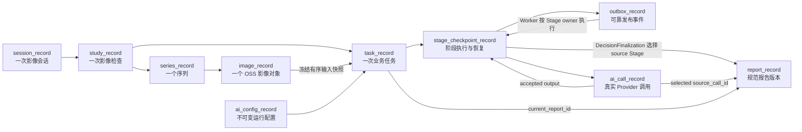
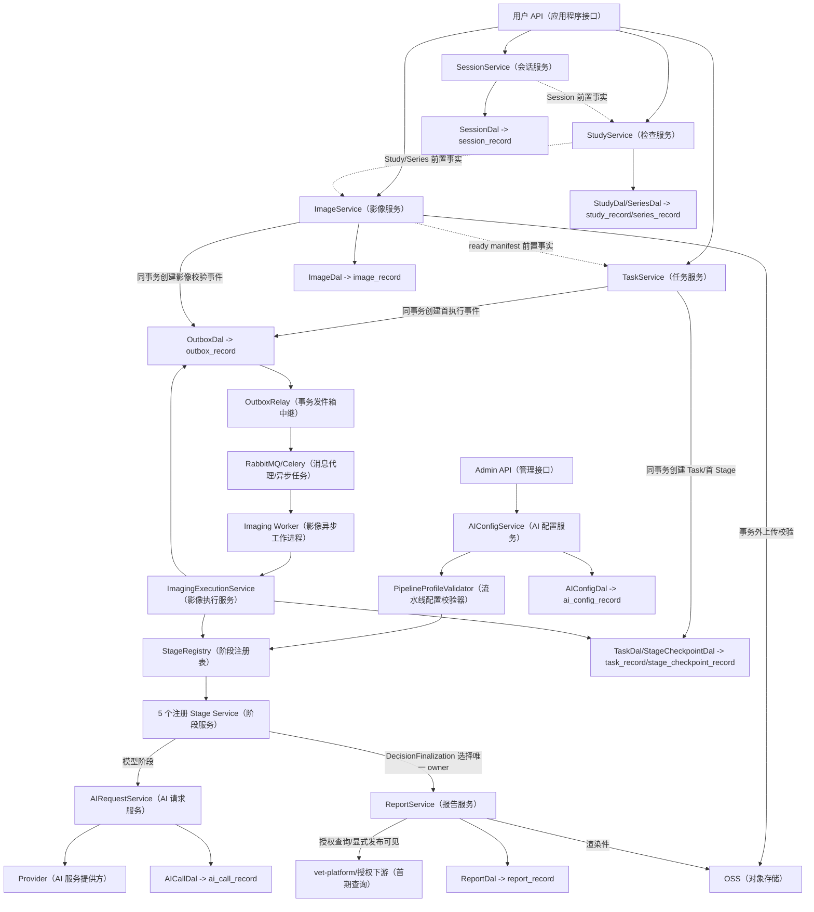
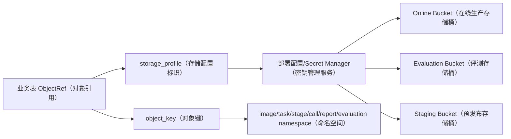
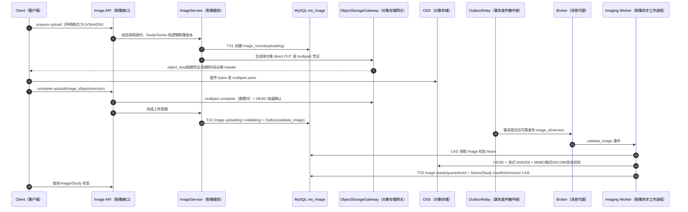
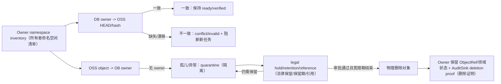
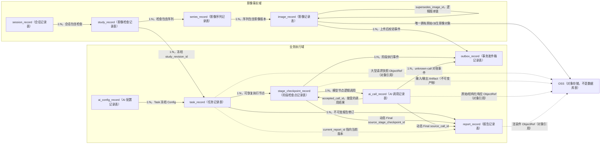
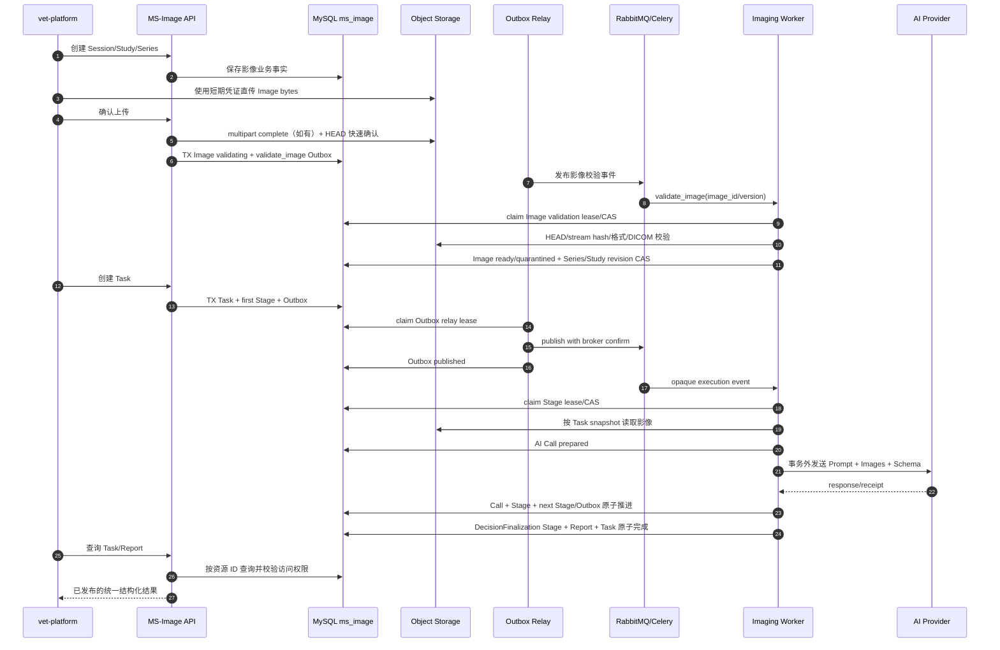
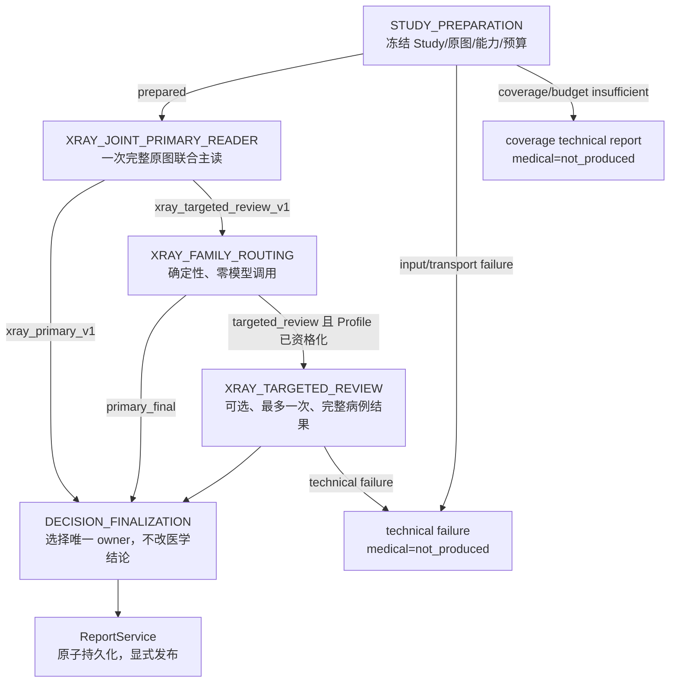

# MS-Image 最终架构、数据库与完整链路设计

> 英文术语、状态、缩写和数据库类型请参阅[英文术语中英对照](术语中英对照.md)；代码、表名、字段名和 API 路径保持英文原样。

状态：`CURRENT`

日期：2026-08-18

目标服务：`ms-image`

目标 MySQL 数据库：`ms_image`

> 本文是开发前的当前唯一集成设计，不代表数据库已经创建、旧数据已经迁移或代码已经完成。
> 本文只整理设计，不生成 Alembic、数据迁移脚本、测试脚本，也不修改当前数据库。

本文分成两个主部分：

```text
Part I  数据库与表链路：第 5、6、7、11、12、13、14.1 节
Part II 模块与服务链路：第 4、8、9、10、14、15、16 节
```

在线生产数据库当前以 10 张核心表作为候选闭环基线；专家 Gold、数据集、配对实验、统计评分、
校准、拓扑/OOD 和 DeepSeek Harness 共用独立的 evaluation/control plane，不向 `ms_image`
增加生产医学事实表。

### Part I（第一部分）：数据库与表链路

阅读顺序：数据库规则（第 5 节）→ 十张在线表字段（第 6 节）→ 表关系和状态所有权（第 6.11、7 节）→ 旧表迁移归宿（第 11～13 节）→ 四张评测表（第 14.1 节）。

### Part II（第二部分）：模块与服务链路

阅读顺序：模块分层（第 4 节）→ 在线服务时序（第 8～10 节）→ 评测与数学治理模块（第 14 节）→ 实施阶段与门禁（第 15～18 节）。

## 0. 权威来源与事实等级

本版以以下历史设计资料作为输入之一；它们用于解释设计演进，不自动拥有当前目标或实现权威：

```text
08-XRay独立诊断服务新项目设计文档包/00-项目总览与权威边界.md
08-XRay独立诊断服务新项目设计文档包/01-独立服务架构决策与系统边界.md
08-XRay独立诊断服务新项目设计文档包/02-准确率优先全链路与状态机.md
08-XRay独立诊断服务新项目设计文档包/03-接口数据合同与持久化设计.md
08-XRay独立诊断服务新项目设计文档包/04-Prompt知识库Embedding与小模型边界.md
08-XRay独立诊断服务新项目设计文档包/05-验证实验门禁与医学分母.md
08-XRay独立诊断服务新项目设计文档包/06-实施迁移灰度与回滚计划.md
08-XRay独立诊断服务新项目设计文档包/07-旧资料继承淘汰与代码差距清单.md
08-XRay独立诊断服务新项目设计文档包/08-辩证审查与待修订决策清单.md
08-XRay独立诊断服务新项目设计文档包/09-ms-image落地基线与目录映射.md
08-XRay独立诊断服务新项目设计文档包/10-ms-image-P0工程基线执行清单.md
08-XRay独立诊断服务新项目设计文档包/11-XRayV2全量数据审计与盲测治理最终方案.md
08-XRay独立诊断服务新项目设计文档包/12-ms-image-Prompt-AI请求-Celery异步链路开发实施文档与新会话Prompt.md
```

权威按问题分轴，禁止把不同问题压成一条线性排名：

| 权威轴 | 首要来源 | 适用结论 | 边界 |
|---|---|---|---|
| 项目规则与授权 | 当前用户明确授权 + 当前适用 `AGENTS.md` | 修改范围、工程约束、需另行授权的动作 | 不证明实现、目标设计或医学效果 |
| 当前实现事实 | 当前 worktree 的源码、配置、依赖和启动合同 | 当前代码行为 | 不覆盖目标设计，不代表生产环境 |
| 当前外部事实 | 经授权读取的真实 DB schema、OSS bytes/hash、Broker/Provider trace | 对应环境、对象和采集时点事实 | 旧 schema 不能覆盖目标 schema，时间点事实不能外推未来 |
| 目标设计 | 本设计母文 | 目标表、状态、事务、Service、Stage 和核心不变量 | 不证明已经实现、迁移或验证 |
| 实施指导 | `docs/refactor/*` | 分阶段开发、迁移和验证方法 | 不得独立覆盖本母文精确合同 |
| 医学准确率 | 冻结 Gold、同病例 paired A/B、确定性 scorer、隔离 Holdout | 预注册指标和安全 guardrail 是否改善 | 工程通过、调用成功率和案例演示均不能替代 |
| 历史解释 | `docs/history`、07/08 等旧外部设计包 | 设计由来、旧证据和失败复盘 | 不作为当前建表或实现合同 |

来源冲突时，先确定问题所属轴，再比较同轴来源的代码版本、环境、命令、采集时间和完整性。
跨轴只能形成“现状与目标差距”，不能互相覆盖：旧真实 schema 能证明旧/当前状态，但不能否决目标
schema；本母文能定义目标，却不能宣称代码已完成或准确率已提高。

每个结论使用以下事实等级：

| 等级 | 含义 |
|---|---|
| `CONFIRMED` | 当前代码、原始运行产物或可复核 manifest 已证明 |
| `INFERRED` | 多项证据支持的推断，仍需实验确认 |
| `PROPOSED` | 本文候选设计，尚未实现 |
| `UNKNOWN` | 缺少决策所需证据 |
| `N/A` | 当前阶段不适用 |

当前项目的医学准确率仍是 `UNKNOWN`。工程完成、医学指标、运营可用性和生产发布不能互相替代。

### 0.1 本次权威交叉核对

| 权威合同 | 本设计的落点 | 本次收口结论 |
|---|---|---|
| [02-准确率优先全链路与状态机.md](/Users/mozhicheng/workspace/code/py-project-v2/vet-platform-system/vet-platform/documents/X光V2重构专题/08-XRay独立诊断服务新项目设计文档包/02-准确率优先全链路与状态机.md) | 第 7、8、16 节 | 继承 `execution_status`（工程状态）与 `ai_medical_status`（AI 医学状态）正交，以及 `OVER_BUDGET`（超预算）、`PARTIAL_SENT`（部分发送）、`TECHNICAL_FAILURE`（技术失败）不得伪装成医学状态；由于首期没有 callback/ack（回调/确认）的独立交付生命周期，旧 `delivery_status` 不进入 Task 表，持久化/发布/作废由当前 Report（报告）指针与状态唯一表达。 |
| [03-接口数据合同与持久化设计.md](/Users/mozhicheng/workspace/code/py-project-v2/vet-platform-system/vet-platform/documents/X光V2重构专题/08-XRay独立诊断服务新项目设计文档包/03-接口数据合同与持久化设计.md) | 第 6、8、10 节 | 请求快照、Stage（阶段） CAS、Outbox（事务发件箱） relay、Provider（AI 服务提供方） 调用和报告版本均有独立事实源；API（应用程序接口） 不直接调用模型。 |
| [04-Prompt知识库Embedding与小模型边界.md](/Users/mozhicheng/workspace/code/py-project-v2/vet-platform-system/vet-platform/documents/X光V2重构专题/08-XRay独立诊断服务新项目设计文档包/04-Prompt知识库Embedding与小模型边界.md) | 第 6.8、8.6、11.4、14 节 | Prompt（提示词）、KB、历史结果、标签和 scorer 分离；`primary_only/targeted_review` 必须使用不同实验指纹，不能把额外调用隐藏进同一版本。 |
| [05-验证实验门禁与医学分母.md](/Users/mozhicheng/workspace/code/py-project-v2/vet-platform-system/vet-platform/documents/X光V2重构专题/08-XRay独立诊断服务新项目设计文档包/05-验证实验门禁与医学分母.md) | 第 11.4、11.5、15 节 | 模型条件分母、端到端产品分母、Holdout、fallback 和 missing rows 分开报告。 |
| [06-实施迁移灰度与回滚计划.md](/Users/mozhicheng/workspace/code/py-project-v2/vet-platform-system/vet-platform/documents/X光V2重构专题/08-XRay独立诊断服务新项目设计文档包/06-实施迁移灰度与回滚计划.md) | 第 11.5、13、15 节 | 继承“灰度只有一个 active owner；回滚只切 release routing，不重写历史事实”。该文档的人审合同不进入首期；未来若重启人审，必须完整拥有 ack、lease、SLA 和人类结果，不能只加一个状态字段。 |
| [07-旧资料继承淘汰与代码差距清单.md](/Users/mozhicheng/workspace/code/py-project-v2/vet-platform-system/vet-platform/documents/X光V2重构专题/08-XRay独立诊断服务新项目设计文档包/07-旧资料继承淘汰与代码差距清单.md) | 第 8.6、11、12 节 | 运行时只采用新节点命名；旧 XRay（X 光）/Adjudicator 命名仅在迁移映射中出现。 |
| [12-ms-image-Prompt（提示词）-AI请求-Celery异步链路开发实施文档与新会话Prompt.md](/Users/mozhicheng/workspace/code/py-project-v2/vet-platform-system/vet-platform/documents/X光V2重构专题/08-XRay独立诊断服务新项目设计文档包/12-ms-image-Prompt-AI请求-Celery异步链路开发实施文档与新会话Prompt.md) | 第 8.4、8.7、15 节 | DB 事务提交后才发布 RabbitMQ/Celery；消息只携带 opaque ID 和版本，不能携带 bytes、Prompt（提示词） 或 Secret。 |

### 0.2 `ms-image/docs/artifacts` 工程证据核对

本节把目标设计与当前仓库能复核的运行产物分开。`CONFIRMED` 只表示某个本地代码或 artifact 行为已经被观察到，不表示生产依赖、医学效果或目标表已部署。

本次工程证据截止时间为 **2026-08-11T04:05:17Z**。截止时间之后的代码、配置、数据库或
Provider 变化不能自动继承下表结论，必须生成带代码版本/工作树摘要、命令、环境、时间和脱敏状态的
新 Artifact。缺少其中任一绑定的旧 Artifact 只能作为时间点线索，不能作为当前发布资格。

| 证据文件 | 当前可确认事实 | 对设计的约束 | 等级 |
|---|---|---|---|
| [`release-readiness-summary.md`](artifacts/release-readiness-summary.md) | import/Compose 为本地通过；Stub/Replay 为本地部分通过；真实 Provider（AI 服务提供方） 阻塞；G0 未开始；发布为 `PARTIAL / NO-GO` | 只能继续工程基础线和脱敏适配，不得宣称真实医学链或生产放行 | `CONFIRMED` |
| [`ai-provider-qualification.v1.json`](artifacts/ai-provider-qualification.v1.json) / [`ai-provider-transport-qualification.v1.json`](artifacts/ai-provider-transport-qualification.v1.json) | 运行时稳定资格合同当前均为 `blocked`，直接 reason 是 `qualification_artifact_signing_key_missing` | 这是当前运行时读取的阻断事实；`provider_auth` 只属于 2026-08-11 历史真实尝试，不能替代当前 reason | `CONFIRMED / BLOCKED` |
| [`xray-implementation-baseline-20260811T040517Z.txt`](artifacts/xray-implementation-baseline-20260811T040517Z.txt) | `ms_image_imaging_test` 是隔离快照，只有 10 张 `xray_accuracy_*` 临时表；Broker（消息代理）/Provider（AI 服务提供方） 均 disabled | 不能把“临时 XRay（X 光） 十表”解释为本文“通用在线十表”已创建、迁移或部署 | `CONFIRMED / ISOLATED` |
| [`p1-zero-model-chain-contract.md`](artifacts/p1-zero-model-chain-contract.md) | request_gate 的 validation-only Stub/Replay 骨架部分完成；无 Alembic、live Broker（消息代理）、真实图像 Provider（AI 服务提供方）、医学节点或准确率评测 | 当前链只证明局部工程语义；Stage（阶段） Registry（注册表）、目标十表和四张评测表均仍是设计 | `CONFIRMED / PARTIAL` |
| [`p0-readiness.json`](artifacts/p0-readiness.json) | 本地 MySQL 不可用，Redis 可达，Broker（消息代理） disabled，Provider（AI 服务提供方） 仅 `stub_only`；readiness fail-closed | 本地 Redis 可达不能当作生产依赖可用；异步链路按 Outbox（事务发件箱）/Worker（异步工作进程） 目标设计但仍待 live 验证 | `CONFIRMED` |
| [`qualification-matrix.md`](artifacts/qualification-matrix.md) | Provider（AI 服务提供方） endpoint/TLS/auth/model、真实图像输入和逐图 receipt 未证实；strict JSON、timeout/retry 仅 Stub/Replay 通过 | `ai_call_record` 的 receipt、actual model 和 schema 合同必须保留 `unknown`/失败状态，不能把 replay 当真实资格 | `CONFIRMED` |
| [`module-mapping-audit.md`](artifacts/module-mapping-audit.md) | Outbox（事务发件箱） relay、Celery factory 和 XRay（X 光） adapter 是 baseline；Provider（AI 服务提供方）/config、Prompt（提示词）、AI Pool、Worker（异步工作进程）、DB schema 仍为 partial | 采用公共 imaging/ai/worker 内核 + modality adapter；迁移授权前不得假定目标表已部署 | `CONFIRMED` / `PROPOSED` |
| [`p0-runtime-manifest.json`](artifacts/p0-runtime-manifest.json) | user/admin 入口为 8000/8001；开发基础设施绑定 localhost；Broker（消息代理） disabled | 开发 Compose 端口不等于生产拓扑；生产网关、admin 隔离和 host 暴露策略必须单独确认 | `CONFIRMED` / `UNKNOWN` |
| [`p0-unknowns.md`](artifacts/p0-unknowns.md) | 网关转发、JWT claims、Alembic/secret 注入、Rabbit 拓扑、live DB/Redis/Rabbit、Provider（AI 服务提供方） 原子落库和图像合同仍未决 | 这些项目是上线门禁，不得在设计中伪装成已确定的部署合同 | `UNKNOWN` |

因此，本文中的“10 张在线表、4 张评测表、服务责任和事务边界”全部是 `DESIGNED / NOT IMPLEMENTED`
的目标闭环；当前实现和本地 artifact 只为其中部分可靠性语义提供 `CONFIRMED` 基线。任何建表、迁移或
生产发布前，必须重新完成 live schema、Broker/Worker、Provider 图像/Schema 和安全边界资格验证。
真实多模态输入、完整原图发送和逐图 receipt 目前均为 `UNKNOWN / BLOCKED`。

### 0.3 当前医学与统计证据基线

| 证据 | 可确认结果 | 解释边界 | 状态 |
|---|---|---|---|
| [2026-06-19 V2 fixed NOR-FP loop record](/Users/mozhicheng/workspace/code/py-project-v2/vet-platform-system/vet-platform/validation/xray_v2_validation/output/xray_v2_validation_20260619_090026.loop_record.json) | 3 例提交，只有 1 例医学可评估；2 例 `fusion_parse_failure` | `strict_accuracy=1.0` 只有单例分母，不能外推 | `CONFIRMED / INSUFFICIENT` |
| [2026-06-11 failure-bank recompute](/Users/mozhicheng/workspace/code/py-project-v2/vet-platform-system/vet-platform/validation/xray_v2_validation/output/recomputed_audit/xray_v2_failure_bank_recompute_20260611_062414.json) | 12 个终端病例，8 个医学可评估；strict `6/8=0.75`；NOR clean `4/6`，NOR FP `2/6` | Wilson 95% 区间很宽；只能定位失败层，不能证明总体准确率 | `CONFIRMED / SMALL_SAMPLE` |
| [2026-08-07 Accuracy Core 执行记录](/Users/mozhicheng/workspace/code/py-project-v2/vet-platform-system/vet-platform/documents/X光V2重构专题/02-V2重构定稿/10-重构执行日志.md) | historical proxy：ABN4 `4/4 abnormal`；Prompt（提示词） 修复后 NOR9 `5/9 normal, 4/9 abnormal` | 都是 historical weak-label proxy，不是 trusted Gold | `CONFIRMED_PROXY` |
| [2026-08-07 Accuracy Core NOR9 Primary/Final 对照](/Users/mozhicheng/workspace/code/py-project-v2/vet-platform-system/vet-platform/documents/X光V2重构专题/02-V2重构定稿/10-重构执行日志.md) | 同一冻结 NOR9：Primary 为 `4 normal/4 abnormal/1 review`；固定 Final 复读后为 `2 normal/5 abnormal/2 review` | 直接证明该固定小样本上第二次 Final 调用没有净收益且发生退化；不能外推总体准确率 | `CONFIRMED_PROXY / REJECT_FIXED_FINAL` |
| [旧复杂链 NOR30](/Users/mozhicheng/workspace/code/py-project-v2/vet-platform-system/vet-platform/validation/xray_v3_accuracy/output/historical_proxy_round10j_48.metrics.json) / [Direct Sol NOR30](/Users/mozhicheng/workspace/code/py-project-v2/vet-platform-system/vet-platform/validation/xray_v3_accuracy/output/historical_proxy_round27_nor30_blinded_direct_sol.json) | 旧链在同类 NOR30 只有 `1 normal/28 review/1 abnormal`；Direct 为 `25 normal/5 abnormal` | 运行不构成严格单变量 A/B，但反驳“节点更多自然更准”；复杂链不能作为默认基线 | `CONFIRMED_PROXY / MULTI_VARIABLE` |
| [Round22 重复性摘要](/Users/mozhicheng/workspace/code/py-project-v2/vet-platform-system/vet-platform/validation/xray_v3_accuracy/output/historical_proxy_round22_e8_accuracy_first_repeatability.summary.json) | 同一 fingerprint 的 3 次工程 clean 运行中，Final/Primary family/closure/verifier/challenge 一致率均为 `0` | 说明复杂证据闭环的医学重复性尚未成立；只能保留为实验线索 | `CONFIRMED_PROXY / NO-GO_COMPLEX_CHAIN` |
| Expert Holdout | 200 病例/378 图像模板已冻结，但专家结果仍未填充 | 没有双专家盲读、仲裁、score 和 Holdout governor | `UNKNOWN / NO-GO` |
| Calibration/Conformal | 当前代码和可信 Gold 中均无可用冻结 Artifact（不可变产物） | 模型 confidence 不能视为校准概率 | `PROPOSED / UNKNOWN` |
| Topology/OOD | 当前无影像 embedding reference、topology map 或独立收益实验 | 只能先做离线 label-blind 数据/质量分析 | `PROPOSED / UNKNOWN` |

因此，本设计能主张的是“提高证据独立性、可追溯性和实验可解释性的结构条件”，不能主张已经
提高医学准确率。任何候选收益都必须经过同病例 paired A/B、unsafe flip、置信区间和独立 Holdout。

## 1. 结论

`ms-image` 应被定义为统一兽医影像分析服务。XRay（X 光）不是一个独立业务域，只是 `study_record.modality_type=xray`；CT（计算机断层成像）、MRI（磁共振成像）、超声、内窥镜、病理切片、牙科影像和临床照片只复用稳定的数据、任务、审计和交付边界，各模态医学执行链必须分别资格化，不能强行复用 XRay 节点。

当前建议首期以 10 张在线核心表作为候选基线：

**10 张在线表和 4 张评测表只是当前最小可实施候选，不是表数量上限。** 后续如果出现独立
owner（所有者）、独立生命周期/状态机、高频独立查询、独立事务/恢复边界，或独立权限、保留与审计
要求，可以新增物理表；反过来，如果真实实现证明某表没有独立事实，也可以合并。新增或合并必须先
给出查询、事务、恢复、权限或运维证据，并同步更新字段合同、关系图、迁移方案和发布门禁。

```text
影像事实
1. session_record（会话记录）
2. study_record（影像检查记录）
3. series_record（影像序列记录）
4. image_record（影像记录）

业务执行
5. task_record（任务记录）
6. stage_checkpoint_record（阶段检查点记录）
7. outbox_record（事务发件箱记录）

AI 与结果
8. ai_config_record（AI 配置记录）
9. ai_call_record（AI 调用记录）
10. report_record（报告记录）
```

独立 `ms_image_eval` 控制面当前使用 4 张候选基础表：
`evaluation_job_record`（评测任务记录）、`evaluation_outbox_record`（评测事务发件箱记录）、
`evaluation_run_record`（评测执行记录）、`evaluation_artifact_record`（评测产物记录）。
它们统一承载数据集/Gold manifest、预注册实验、逐次执行、统计结果、校准模型、拓扑/OOD 结果
以及可选的 Harness 分析，不属于在线医学事实，也不计入在线 10 表方案。

### 1.1 评审后的当前设计决策

| 决策项 | 当前选择 | 原因与边界 | 状态 |
|---|---|---|---|
| 重构级别 | 允许内部代码完全重构；当前推荐保留外部入口的模块化重建 | 现有 `xray_accuracy` 模块、目录、类和内部实现均可替换；可复用 FastAPI（Web 应用程序接口框架）、`DalBase`（数据访问基类）、Provider（AI 服务提供方）、Outbox（事务发件箱）和 Worker（异步工作进程）的已验证合同，不建设并行事实源 | `AUTHORIZED_SCOPE / PROPOSED_DESIGN`（已授权范围/候选设计） |
| 权威文档治理 | 证据可以推翻旧结论，但任一时点只保留一个 `CURRENT`（当前）入口 | 本次保留数据库和可靠执行合同，推翻固定 FinalReader、首期人审链和过度在线实验节点；变更必须在本文形成一致合同，历史事实留在 `docs/history` | `CURRENT GOVERNANCE` |
| 识别阶段 | 现有 Service（业务服务层）内的版本化 Stage Service（阶段服务） | 公共阶段与 XRay（X 光）专项阶段分开；默认进程内执行，不把每个阶段拆成网络微服务 | `PROPOSED`（已提出，尚未实现） |
| 链路编排 | 目标代码内置注册的固定 Profile + 受限校验 + 冻结执行图 | 静态 Registry/Profile Validator 属 CORE；首期只有 `primary_only` 与待资格化的 `targeted_review` 两种固定拓扑，不做任意可拖拽 DAG；当前仓库尚未实现这 5 个目标 Stage Service | `PROPOSED CORE`（通用 DAG 为 `DEFERRED`） |
| XRay 医学所有权 | 分支动态 Final owner（最终医学结果所有者） | 不触发专项复核时 Primary 成为 Final；触发且成功时 TargetedReview 输出完整病例结果并成为 Final；DecisionFinalization 只选择、校验和持久化 | `PROPOSED / REPLACES_FIXED_FINAL` |
| 固定 FinalMedicalReader | 删除默认固定二次视觉调用 | NOR9 直接对照已观察到退化；没有独立证据证明固定复读能改善准确率，保留它只会增加成本、延迟和第二医学 owner | `REJECTED` |
| 在线基础表 | 以 10 张为当前候选基线，不设数量上限 | 每张表当前被推断拥有独立生命周期；必要时可按 owner、状态机、查询、事务/恢复、权限/保留证据新增，实施后也可按真实证据合并 | `INFERRED / PROPOSED` |
| 文件模型 | 不增加公共文件资产表 | 原始影像由 `image_record`（影像记录表）持有；其他 OSS（对象存储）内容使用角色化 `ObjectRef`（对象引用）；同一对象键禁止跨业务 owner（所有者）复用，删除和保留由 owner（所有者）+ 对象生命周期合同闭环 | `PROPOSED`（已提出，尚未实现） |
| 历史 Study revision（检查修订版本） | 首期不增加 `study_revision_record`（检查修订记录表） | 有 Task（任务）的历史 revision（修订版本）由 Task（任务）快照保存；只有无 Task（任务）的 revision（修订版本）也必须查询时才增加 | `PROPOSED`（已提出，尚未实现） |
| 人工复核 | 首期 `N/A`（不纳入当前在线链和目标表） | `review_required` 只作为 AI 合法终态持久化和发布，不预留人审队列、ack、lease 或人类裁决字段；未来需求必须另开 ADR 并重新推导表 | `DEFERRED / OUT_OF_SCOPE` |
| 技术审计 | 不能直接删除现有 TraceEvent（追踪事件） | 先冻结外部 append-only（仅追加写）`AuditSink`（审计接收器）的幂等、保留和查询合同；未冻结前保留现有事实 | `PROPOSED`（已提出，尚未实现） |
| 多模态范围 | 统一数据模型，逐模态资格放行 | XRay（X 光）首先闭环；CT（计算机断层成像）/MRI（磁共振成像）/视频/WSI（全切片影像）必须通过真实样本、分片汇合和 Provider capability Gate（AI 服务提供方能力门禁） | `PROPOSED`（已提出，尚未实现） |
| 证据独立性 | 在线只保留 source lineage（来源链）与 source family（来源家族）折叠；不设置 EvidenceGraph 在线 Service | 证据图、支持/反驳边和复杂图推理留在离线 Artifact 实验；候选 FamilyRouting 只读取类型化 Primary 结果和确定性配置 | `CORE_LINEAGE / EXPERIMENTAL_ROUTING_AND_GRAPH` |
| 数学风险门 | 首期只做离线校准与统计评测，不进入在线路由 | 当前没有人工复核执行合同，在线 RiskGate 没有合法下游；校准 Artifact 只能产出离线发布证据，不能修改医学结论 | `EXPERIMENTAL / OFFLINE_ONLY` |
| 拓扑/OOD（分布外检测） | 只用于离线数据覆盖和工程质量；在线默认关闭 | 持续同调、Mapper（拓扑映射算法）、Betti/Euler（贝蒂数/欧拉特征）等结果必须经独立验证后才能申请只读路由资格 | `EXPERIMENTAL` |
| 评测控制面 | 4 张通用 `evaluation_*`（评测类）候选基础表 | Gold（可信金标准）、split（数据划分）、case result（病例结果）和 deterministic metrics（确定性指标）是发布证据 CORE；calibration、topology 和 Harness 只是可选 executor/Artifact | `CORE BOUNDARY / PROPOSED SCHEMA` |
| Harness | 只读研究辅助，不进入线上链 | 只能基于脱敏冻结 Artifact 提出实验线索；不能写 Gold、scorer、Task、Report 或发布配置 | `DEFERRED / OPTIONAL` |
| 医学效果 | 不由表设计证明 | 工程闭环只提高可追溯性和可验证性，准确率仍需 trusted gold（可信金标准）、paired A/B（配对 A/B 对照实验）和独立 Holdout（留出验证集） | `UNKNOWN`（证据不足，尚不能判断） |

本设计完成后仍不得直接宣称“已经上线”。`CURRENT` 只表示它是当前唯一开发依据；目标 schema、真实 Broker、真实 Provider 和医学指标仍需各自门禁。

### 1.2 权威设计的辩证结论与能力分级

“权威”只表示当前开发决策应从本文出发，不表示本文中的每项候选能力都已经被事实证明，也不表示
后续实验不能推翻当前选择。当前最主要的矛盾不是“功能不够多”，而是：一方面需要可靠、可追溯、
可回滚的医学执行底座；另一方面，真实 Provider、完整医学链、可信 Gold 和足够样本都尚未闭环。
如果在证据不足时一次性实现全部候选节点，会同时改变数据模型、执行拓扑、Prompt、模型输入和风险路由，
最终既无法归因准确率变化，也会扩大首期故障面。

因此采用以下四级边界。分级表达的是**当前启用优先级**，不是永久删减：

| 等级 | 判定标准 | 当前能力 | 当前处理 |
|---|---|---|---|
| `CORE` | 没有它就无法形成可靠、可恢复、可审计的最短业务闭环 | `API -> Service -> DalBase -> Model/DB`、Session/Study/Series/Image、Task、Stage CAS/lease、Outbox、AI Config/Call、静态 Stage Registry、固定 Profile 校验/hash、StudyPreparation、JointPrimaryReader、DecisionFinalization、Report、工程/医学两个正交 Task 状态、独立 Report 生命周期、冻结版本和资源授权 | 首期实现并作为发布前置门禁 |
| `CONDITIONAL` | 合同方向清楚，但是否启用取决于真实边界或前一阶段证据 | 未来 callback、CT/MRI/视频/WSI 分片 fan-out/fan-in、多模态 Adapter | callback 当前不预留字段/API；多模态只保留公共数据边界，触发条件满足后另行启用 |
| `EXPERIMENTAL` | 可能改善质量，但当前没有可信边际收益证据 | FamilyRouting + TargetedReview 候选策略、语义 Evidence Graph、多 Reader、Segmentation、Calibration/Conformal、Topology/OOD、Blind Sentinel | 仅 validation-only/shadow 或离线实验；通过 paired A/B、guardrail 和独立 Holdout 后才可晋级 |
| `DEFERRED` | 当前没有业务合同，或引入成本明显高于可证明收益 | 人工复核执行、任意可拖拽 DAG、网络化阶段微服务、Temporal 等第二工作流运行时、在线 Gold/Finding 明细表、Harness 参与线上决策、首期 CT/MRI/WSI 医学执行 | 不实现；出现明确 owner、SLA、查询或恢复缺口后重新评审 |

分级必须作用于**最小能力切片**，不能把整个模块一刀归类。例如 Registry 的精确版本解析是
可靠性内核，而数据库动态装载 handler 不是；source image/call lineage 是审计内核，而模型生成的
support/refute/conflict 语义图不是；确定性地把 Final（最终）结果持久化和发布是业务内核，而基于小样本
confidence（置信度）的统计 RiskGate（风险门）不是。辩证分析不能只列风险，还必须给出可推翻当前结论的条件：

| 设计判断 | 正面价值 | 反面成本或反证 | 当前调整 | 晋级/扩展门禁 | 停止或回滚条件 | 状态 |
|---|---|---|---|---|---|---|
| 10 张在线表 | 生命周期和状态 owner 清楚，Stage 与 Call、Task 与 Outbox 不混写 | “10”只由合同推导，尚未经过真实 schema、查询和运维负载验证 | 作为候选基线，不称为不可变的最小充分集 | XRay 最短链证明 10 表均有独立读写生命周期；若某表无独立状态则合并评审 | 出现双写事实、无法原子提交或主要查询必须跨大量 JSON 扫描 | `INFERRED / PROPOSED` |
| 4 张评测表 | Job/Outbox/Run/Artifact 可以先覆盖不可变离线事实，避免 Gold 进入线上 | Artifact 化会降低逐病例交互查询和标注工作台效率 | 首期用于冻结评测；不宣称长期足够 | 出现逐病例检索、法规逐行审计或多人标注 owner 后再拆专表 | Artifact 关系无法验证、查询不可接受或权限无法隔离 | `PROPOSED` |
| 静态 Registry + 固定 Profile preflight | 精确解析 handler/version、冻结执行序列和 hash，是重放与防热切换的必要条件 | 如果同时实现任意 DAG、动态代码路径和通用类型系统，会过度设计 | 保留最小 Registry 和 direct Profile 校验，二者属于 CORE | direct Profile 在部署、回滚、旧 Task 重放中保持相同 handler 和 Stage 序列 | 运行时解析 latest、hash 与实执行不一致或旧 Task 无法解析 | `CORE` |
| 通用 DAG Compiler | 可支持多个拓扑、静态检查分支和 fan-in | 单链未跑通前会制造大量抽象、组合状态和测试面 | 首期不实现任意拖拽/数据库定义 DAG | 至少两个已资格化生产 Profile 确有不同分支拓扑，固定校验已成为阻碍 | 配置绕过强制门禁、组合爆炸或回放不能确定 | `DEFERRED` |
| 基础 source lineage | requested/sent/accepted、source image、crop/retry 后代关系可防止输入丢失和审计断链 | 若扩展成医学语义图，会把事实记录与算法假设混在一起 | 作为 Call/Stage/Artifact 的 CORE provenance 保留，不需要复杂 Graph 节点 | 每次 Provider 调用都可从报告追溯到冻结原图和 receipt | 任一报告无法追到原图、accepted Call 或真实发送集合 | `CORE` |
| 语义 Evidence Graph | 显式表达支持、反驳和冲突，可能抑制同源证据重复放大 | 图节点增加 Prompt/调用/延迟，语义边也可能由模型幻觉产生；目前没有独立准确率收益 | 保留 Artifact 合同，默认生产链不启用 | 对固定病例做 direct vs graph paired A/B，改善预注册主指标且不增加 ABN unsafe flip | 无显著收益、成本/延迟超预算或错误传播增加 | `EXPERIMENTAL` |
| Targeted Review/多 Reader | 可能对局部疑难点增加信息 | 容易形成“多调用即多证据”的假象，并放大选择偏差 | 只在离线预注册实验中启用，按 source family 折叠 | 相对 direct baseline 有独立增益，且调用选择规则在看标签前冻结 | NOR FP、ABN 漏诊、review 比例或预算任一越界 | `EXPERIMENTAL` |
| 确定性 DecisionFinalization | 在分支结束时选择唯一 accepted owner，校验 Schema、完整原图、source refs、状态并原子生成 Report | 若在这里写阈值改判，就会形成第二医学 owner | CORE 保留；不调用模型、不改变 verdict | primary-only 与 targeted 分支都能证明恰好一个 Final owner | 修改 normal/abnormal、拼接两次结果、选取“看起来更好”的输出 | `CORE` |
| Calibration/Conformal | 能量化候选链覆盖风险和分层可靠性 | 小样本和分布漂移下会产生伪概率；当前又没有在线人审下游 | 仅在 `ms_image_eval` 离线拟合和评测，不进入首期在线 Pipeline | development Gold 足够、独立 Holdout 达标且未来业务路由合同明确后另行评审 | fingerprint/strata 失配、覆盖风险超阈值或数据漂移 | `EXPERIMENTAL / OFFLINE_ONLY` |
| 多模态统一 | 统一资源、Task 和审计边界，减少重复平台 | CT volume、视频和 WSI tile 不能被 XRay 最低公分母流程正确表达 | 统一数据边界，首期只闭环 XRay 医学执行 | 每个模态以真实样本、Provider capability、分片合同和独立 Holdout 单独资格化 | 模态专项字段大量泄漏进公共表，或适配器无法表达完整输入 | `CONDITIONAL` |
| Topology/OOD/Harness | 可能帮助发现数据覆盖空洞和提出实验线索 | 缺少金标准因果链，容易把可视化或模型建议误当医学证据 | 保持离线只读，与线上 Task/Report 隔离 | 单独实验能改善数据治理指标，并经人工审批和确定性 scorer 复核 | 参与线上 verdict、读取隔离 Holdout 调参或无法复现实验 | `EXPERIMENTAL / DEFERRED_ONLINE` |

基于当前证据，首期控制面和默认执行链分别收缩为：

```text
固定 xray_primary_v1 -> Profile Validator -> StageRegistry 精确解析 -> compiled hash

StudyPreparation
-> XRay JointPrimaryReader（完整病例结果候选）
-> DecisionFinalization（无复核时选择 Primary 为 Final）
-> Report persist/publish
```

其中静态 Registry、固定 Profile preflight、基础 lineage、Stage、Outbox、Call、Report 和版本冻结仍完整
保留，因为它们解决的是版本漂移、崩溃恢复、外部调用不确定性
和事实可追溯问题，不依赖“复杂医学链是否更准”的假设。TargetedReview、Evidence Graph、在线风险门、
Topology/OOD 和 Harness 不得成为这条基线链的隐含前置条件。每次只允许一个预注册候选相对
该基线比较：Prompt/模型调整尽量做单变量实验，`FamilyRouting + TargetedReview` 必须明确标记为不可拆的 chain-only candidate（仅链路候选），不能伪装成单变量。若不能建立“设计变化 -> 中间机制 -> 预注册指标 -> 独立验证”的证据链，
就保持关闭或回滚。

#### 1.2.1 不能把不同平面的能力误写成一条在线链

原设计把 Registry/Compiler、Evidence Graph、RiskGate、Topology/Harness 连续讨论，容易让人误以为它们
都要成为首期请求的同步必经节点。实际上它们解决不同问题，依赖方向也不同：

| 平面 | 能力 | 是否进入默认请求热路径 | 首期必要性 | 失败影响 |
|---|---|---:|---|---|
| 配置发布面 | 静态 Registry + 固定 Profile preflight/hash | 否；Task 创建时只读取已验证且冻结的 Config | `CORE`，用于防 latest 漂移和不可重放 | Config 不得激活，新 Task 不得创建；不应拖垮已冻结旧 Task |
| 在线执行面 | StudyPreparation/JointPrimaryReader/DecisionFinalization/Report | 是 | `CORE`，产生最短可评测业务结果 | fail closed，保留工程事实，不伪造医学结果 |
| 在线候选扩展 | FamilyRouting + TargetedReview | 默认否；只在实验指纹明确的 validation-only/shadow Task 中进入 | `EXPERIMENTAL`；Router 本身不改医学结论，候选变量是“确定性选择 + 最多一次专项复核”的完整策略 | 关闭候选 Profile 并回到 primary-only，不改写既有 Final/Report |
| 离线候选扩展 | Evidence Graph、Calibration/Conformal、Topology/OOD | 否；只读取冻结 Artifact | `EXPERIMENTAL`，分别验证 | 结束对应 Evaluation Job，不影响线上 Task/Report |
| 评测控制面 | Gold/split、deterministic scorer、paired statistics、missing-row/分母报告 | 否；读取冻结在线 Artifact | 发布资格的 `CORE`，但不是在线请求节点 | 候选不得发布，线上 direct 事实不被修改 |
| 研究辅助面 | Topology/OOD、Harness | 否 | `EXPERIMENTAL` 或 `DEFERRED` | 只结束对应 Evaluation Job，不影响线上 Task/Report |

所以“首期收缩”不是删除 Registry、评测或审计，而是减少**在线医学变量**。最快产生可证伪证据的链
也不是代码最少的链：它必须保留完整原图 receipt、Provider 实际模型、Schema、版本指纹、missing row、
同病例 control 和可回滚发布事实；删掉这些会让链更短，却让任何准确率结论都无法相信。

### 1.3 当前代码基线与目标差距

当前代码不是本文 10 张通用表的实现。它是 validation-only、zero-model 的 XRay 工程骨架；
后续允许大规模重构，但迁移必须以这张差距表为事实起点：

| 范围 | 当前代码事实 | 目标设计 | 状态 |
|---|---|---|---|
| ORM | 5 张遗留 AI 配置表 + 10 张 `xray_accuracy_*` 表 | 10 张通用在线表 + 独立 4 张 `evaluation_*` 表 | `CONFIRMED / PROPOSED` |
| 业务根 | `XRaySession/XRayRun`，Run 仍固定 validation-only | `session_record/study_record/task_record`，XRay（X 光） 仅是 modality | `CONFIRMED / PROPOSED` |
| 医学执行 | `XRayRun.ai_medical_status` 明确禁止写 verdict | 目标改为分支动态医学 owner：默认 Primary；候选分支成功时 TargetedReview；DecisionFinalization 只选择和校验 | `CONFIRMED / PROPOSED` |
| 异步可靠性 | Run + Snapshot + Checkpoint + Trace（技术追踪） + Outbox（事务发件箱） 已形成同事务骨架 | 保留并通用化为 Task（任务） + Stage（阶段） + Outbox（事务发件箱）；Trace（技术追踪） 在 AuditSink 验收前不删除 | `CONFIRMED / PROPOSED` |
| 阶段编排 | `TechnicalExecutor` 当前只执行 `request_gate`，无 StageRegistry/Profile Validator | 先实现版本化 Stage（阶段） Service（业务服务层）、静态 Registry 和 `xray_primary_v1` 固定 Profile 校验；Task（任务）/Stage（阶段）精确冻结执行图和 handler 版本 | `CONFIRMED_MISSING / CORE` |
| Provider（AI 服务提供方） | 已有调用、receipt、hash 和 qualification 工程合同 | 补全 requested/sent/ack、unknown-call reconcile、预算和 accepted Call | `PARTIAL / PROPOSED` |
| 证据图 | 只有 expected/resolved/requested/sent 图像 lineage | 先保留 Artifact（不可变产物）和同源折叠实验合同，不进入 direct 默认链 | `PARTIAL / EXPERIMENTAL` |
| 统计校准 | 未实现 calibration、Conformal、paired statistics | paired statistics 属评测基础；calibration/Conformal 风险路由需证据晋级 | `CONFIRMED_MISSING / EXPERIMENTAL` |
| 拓扑/OOD | 只有 RabbitMQ topology；无影像 TDA/OOD | 先做离线数据覆盖和质量分析 | `CONFIRMED_MISSING / PROPOSED` |
| 人工复核 | 只有 review event 占位，无 queue/ack/decision 闭环 | 首期明确不实现；`review_required` 仅作为 AI 医学终态发布。未来若有真实业务 owner/SLA，另开 ADR（架构决策记录）并重新推导表和接口 | `CONFIRMED_MISSING / N/A` |

关键代码证据：[`XRayRun`](/Users/mozhicheng/workspace/code/cy-code/ms-image/app/models/xray_accuracy/run.py#L8-L92)
当前只允许 `not_produced`；[`XRayRunService.create_run`](/Users/mozhicheng/workspace/code/cy-code/ms-image/app/service/xray_accuracy/application_service.py#L209-L365)
写入 Run/Snapshot/Checkpoint/Trace/Outbox；[`TechnicalExecutor`](/Users/mozhicheng/workspace/code/cy-code/ms-image/app/service/xray_accuracy/technical_executor.py#L83-L87)
明确不生成医学 verdict。

这 10 张表不是把当前 10 张 `xray_accuracy_*` 表改名搬家。保留 10 张的原因是：

- Session、Study、Series、Image 是通用影像业务事实。
- Task 是一次业务请求和聚合状态事实。
- StageCheckpoint 有独立的阶段租约、恢复、幂等和非模型节点生命周期。
- Outbox 有独立的 DB 到 Broker 发布确认、重试、死信和 reconcile 生命周期。
- AIConfig 是不可变运行配置包。
- AICall 是一次逻辑 Provider 请求；同一幂等键下的有界 transport 重放仍归同一行，物理发送次数进入计数与 AuditSink。
- Report 是最终业务结果版本。

不进入首期核心表的能力：

```text
公共用户/宠物/病历/聊天/支付/额度
完整 Task Attempt 事件历史
独立 Prompt/Schema/Connection 治理表
Finding 独立检索表
人工复核工作台
目标在线 TraceEvent 明细表（现有表在 AuditSink 验收前继续保留）
Gold / Failure Bank / Holdout / Experiment
DeepSeek Harness Session
```

## 2. 目标、非目标与完整主链

### 2.1 目标指标

不以单一 overall accuracy 作为唯一目标，至少同时观察：

| 维度 | 目标 |
|---|---|
| ABN 安全性 | 降低 trusted ABN -> normal 漏诊 |
| NOR 特异性 | 降低 trusted NOR -> abnormal 误报 |
| 自动覆盖 | 控制 `review_required`、模型 `non_diagnostic` 和 coverage 不足 |
| 工程可信度 | full_sent、actual model、trace、schema 和分母完整 |
| 重复性 | 相同 fingerprint 的逐例结果稳定 |
| 运营约束 | 延迟、Provider（AI 服务提供方）调用次数、成本、队列容量和错误率可承受 |

### 2.2 非目标

- 第一阶段不直接替换 V2 生产结果。
- 不修改 ABN/NOR 标签、删除困难病例或缩小医学分母。
- 不把 Python 规则、投票、旧报告、Disease-Code、annotation 或邻居标签变成医学结论。
- 不在没有 trusted gold、paired A/B、独立 Holdout 和回滚演练前进入 Gray/Active。
- 不把 Shadow 运行数、解析成功率或 Provider 成功率写成准确率提升。

### 2.3 核心对象与完整主链



统一基数：

```text
session_record           1 -> N study_record
study_record             1 -> N series_record
series_record            1 -> N image_record
study_record             1 -> N task_record
task_record              1 -> N stage_checkpoint_record
task_record              1 -> N ai_call_record
task_record              1 -> N report_record
image_record             1 -> N outbox_record（影像校验/对账事件）
stage_checkpoint_record  1 -> N outbox_record（阶段执行事件）
ai_call_record           1 -> N outbox_record（unknown-call 对账事件）
stage_checkpoint_record  1 -> 0..N ai_call_record
ai_call_record           1 -> 0..N report_record（仅 selected source Call；N 来自同源规范修订）
```

MySQL 不声明 Foreign Key。Service 必须按资源 ID 验证逻辑父记录、访问权限、状态和版本。

## 3. 服务边界

### 3.1 `ms-image` 自己拥有

- 影像会话生命周期。
- Study、Series、Image 的技术事实、顺序、完整性和修订头。
- OSS 对象的稳定索引、SHA256、大小、格式和 DICOM 技术元数据。
- Task 请求快照、任务级状态、重试、取消和截止时间。
- DB 到 Broker 的可靠发布事件。
- Pipeline 阶段 checkpoint、claim、lease、heartbeat 和恢复事实。
- AI 配置版本、物理调用事实、Provider 回执和输入输出摘要。
- 通用影像报告及其版本。

### 3.2 只保存 opaque ID（不透明标识）

以下事实由上游公共服务拥有，`ms-image` 只保存完成业务所需的 opaque ID：

```text
subject_id
source_session_id
source_medical_record_id
source_study_id
requester_id
```

### 3.3 不迁入 `ms_image`

```text
user / pet / medical_record 主表
聊天消息和聊天 Session 明细
支付订单、套餐、积分、额度
权限角色和组织主数据
公共文件资产表
完整患者档案
```

### 3.4 控制平面与数据平面

```text
数据平面：Session/Study/Series/Image、Task、Stage、Outbox、AI Call、Report
控制平面：release state、Prompt/model/schema manifest、feature flag、experiment arm、Gold/Holdout artifact
```

普通诊断调用方不能提交或覆盖 `run_mode`、`experiment_arm_id`、`chain_policy`、Provider、模型、Prompt 版本或 release fingerprint。控制平面必须独立权限、CAS version、不可变 artifact 和审计事件；在线服务不能读取验证目录、truth、failure-bank role 或 Holdout 标签。

### 3.5 新旧系统集成边界

`vet-platform` 保留用户鉴权、病例/病历关系、用户可见任务兼容、生产报告兼容、灰度选择和回切开关。`ms-image` 拥有影像事实、Study 完整性、AI 执行、报告候选和 trace。Shadow 期间新服务只能保存候选结果，不能写旧 `report_content/report_status`；Gray/Active 期间同一用户可见 AI final 只能有一个服务拥有。

## 4. 模块闭环

项目继续遵循 `API -> Service -> CRUD(DalBase) -> Model/MySQL`，不新建第二套 Repository 或数据库服务。

### 4.0 模块名与数据库表名的对应原则

模块与数据库需要“可追溯对应”，但不能机械地一张表对应一个 Service（业务服务层）。持久化层按实体一一对应，
业务层按聚合、用例和事务所有权组织：

| 层 | 与数据库表的对应关系 | 命名示例 | 强制规则 |
|---|---|---|---|
| MySQL（关系型数据库）表 | 业务事实源 | `session_record`、`stage_checkpoint_record` | 使用 `*_record`，表名表达持久化事实，不反向决定 Service（业务服务层）边界 |
| Model（模型层） | 一张表一个 ORM（对象关系映射模型） | `Session` -> `session_record`，`StageCheckpoint` -> `stage_checkpoint_record` | Python 类和文件去掉 `record` 后缀；一个 ORM（对象关系映射模型）只声明一张表 |
| DAL（数据访问层） | 一张表一个实体 DAL（数据访问对象） | `SessionDal`、`StageCheckpointDal` | 与 Model（模型层）严格一一对应；全部继承 `DalBase`，不新建 Repository（仓储层） |
| Schema（结构合同层） | 对应 API 资源或业务命令 | `SessionCreate/SessionResponse`、`TaskCancel` | 不要求一张表一组 Schema；请求合同不能暴露内部表结构 |
| Service（业务服务层） | 对应业务能力、聚合和事务边界 | `ImageService`、`TaskService`、`ImagingExecutionService` | 可以协调多个实体 DAL；不能为了表名对齐拆出无业务含义的 Service |
| Stage Service（阶段服务） | 对应一个可版本化处理阶段 | `XRayJointPrimaryReaderStageService` | 不拥有独立表；结果统一由 `ImagingExecutionService` 写 Stage/Call/Task/Report |
| Core/Gateway（核心组件/网关） | 对应外部能力边界 | `ObjectStorageGateway`、`ProviderClientRegistry` | 不建设同名业务表，不直接拥有医学或业务状态 |
| Worker（异步工作进程） | 对应异步执行入口 | `imaging_worker`、`outbox_relay` | 只调用 Service，不直接查询 ORM 或拼 SQL |

因此，`SessionService -> SessionDal -> Session -> session_record` 可以接近一一对应；
`StudyService` 同时协调 Study/Series，`ImageService` 在上传确认时协调 Image/Series/Study，
`TaskService` 原子创建 Task/Stage/Outbox，`ImagingExecutionService` 原子推进
Task/Stage/Outbox/Call/Report。这些多表关系来自真实业务事务，不能为了模块名与表名表面一致而拆散。

目标 Python 命名统一采用：

```text
app/models/session.py                    -> class Session           -> session_record
app/crud/session.py                      -> class SessionDal
app/service/session_service.py           -> class SessionService
app/schemas/session.py                   -> SessionCreate/SessionQuery/SessionResponse

app/models/stage_checkpoint.py           -> class StageCheckpoint   -> stage_checkpoint_record
app/crud/stage_checkpoint.py             -> class StageCheckpointDal
app/service/imaging_execution_service.py -> class ImagingExecutionService
```

不要创建 `SessionRecordService`、`SessionRecordRepository`、`session_record_service.py` 等把数据库后缀
扩散到业务层的名称，也不要为已拒绝或延后的 `EvidenceGraphService`（证据图服务）、
`RiskGateService`（风险门服务）、`DeliveryService`（交付服务）人为增加对应表。

#### 4.0.1 在线模块调用与持久化链路图



图中的 `Service -> DAL -> 表` 表示事实写入路径；Service（业务服务层）之间的虚线表示业务前置事实
或条件/实验调用，不是默认必经链；实线表示 CORE 调用或编排关系。它们不要求各自部署成网络微服务。
OSS（对象存储）、Broker（消息代理）和 Provider（AI 服务提供方）调用必须位于数据库事务之外。

| 模块 | Service（业务服务层） | DAL（数据访问层） | 核心表 | 责任 |
|---|---|---|---|---|
| Session | `SessionService`（会话服务：会话幂等和生命周期） | `SessionDal` | `session_record` | 会话幂等创建、开始、完成、关闭、取消和 CAS |
| Study（影像检查） | `StudyService`（检查服务：模态、修订和完整性） | `StudyDal`、`SeriesDal`、`ImageDal` | `study_record`、`series_record` | 模态、当前 revision、Series（影像序列） 分组、顺序、完整性和 Finalize |
| Image（影像） | `ImageService`（影像服务：上传校验和版本管理） | `ImageDal`、`SeriesDal`、`StudyDal`、`OutboxDal` | `image_record`、`outbox_record`（仅可靠触发校验） | 上传准备、对象确认、异步校验租约、版本替换、SHA256、DICOM 技术事实和接入对账 |
| Task（任务） | `TaskService`（任务服务：请求冻结、状态和取消） | `TaskDal`、`StudyDal`、`SeriesDal`、`ImageDal`、`AIConfigDal`、`StageCheckpointDal`、`OutboxDal` | `task_record`（并原子创建首 Stage（阶段）/Outbox（事务发件箱）） | 请求/路由/预算快照、工程/医学双状态、幂等、取消和 current Report（当前报告）指针 |
| Execution | `ImagingExecutionService`（影像执行服务：阶段编排和恢复） | `TaskDal`、`StageCheckpointDal`、`OutboxDal`、`AICallDal`、`ReportDal` | `stage_checkpoint_record`、`outbox_record`（并协调 Task/Call/Report） | Stage instance、租约恢复、预算结算、分支选择、DecisionFinalization 原子完成和下一事件 |
| Config/Release | `AIConfigService`（AI 配置服务） | `AIConfigDal` | `ai_config_record` | 调用内部 `PipelineProfileValidator` 和 `StageRegistry`，完成固定 Profile 校验、不可变发布、唯一 Active Slot、Release CAS 和 capability 合同 |
| AI Request | `AIRequestService`（AI 请求服务：Prompt（提示词）、Provider（AI 服务提供方） 调用和对账） | `AICallDal`、`TaskDal`、`StageCheckpointDal` | `ai_call_record` | Prompt/Schema 渲染、预算预留、Provider 请求、requested/sent receipt、unknown-call 对账和调用审计 |
| Report（报告） | `ReportService`（报告服务：报告版本、当前指针和发布） | `ReportDal`、`TaskDal` | `report_record` | canonical 报告创建、修订、current pointer、发布和查询；不改写医学裁决 |

基础设施中的 Outbox relay 只负责发布，不承载医学或 Task 业务判断。Worker 通过 Service 调用 DAL，不直接拼 SQLAlchemy 查询。

跨表事务由触发该用例的 Service 统一协调：Task 创建由 `TaskService` 写 Task/首 Stage/首 Outbox；上传确认与替换由 `ImageService` 写 Image/Series/Study；普通节点完成由 `ImagingExecutionService` 写 Call/Stage/Task/下一 Outbox；DecisionFinalization 由 `ImagingExecutionService` 调用 `ReportService`，在同一事务写 Finalization Stage/Report/Task；报告发布由 `ReportService` 校验 Task current pointer 后只推进 Report 状态。它们复用同一实体 DAL，不复制数据访问实现。

### 4.1 模块与服务的详细责任链

所有在线业务都遵循以下调用合同：

```text
API Endpoint
  -> Schema 校验与认证依赖
  -> XxxService（业务校验、幂等、状态机、多表事务）
  -> XxxDal（DalBase 异步数据访问）
  -> Model / MySQL
```

| 服务 | 上游入口 | 核心处理 | 下游事实/事件 | 失败处理 |
|---|---|---|---|---|
| `SessionService`（会话服务） | Session 创建、完成、关闭、取消 API（应用程序接口） | 按 source session 幂等；校验 `subject_id` 和调用身份权限；推进会话生命周期 | `session_record` | 重复请求返回已有 Session；身份冲突拒绝 |
| `StudyService`（检查服务） | Study（影像检查）/Series（影像序列） 创建、Finalize API（应用程序接口） | 创建模态、Series（影像序列） 分组；校验 UID、顺序、revision、完整性 | `study_record`、`series_record` | Study（影像检查） 未完整时保持 `validating/partial`，不允许创建可诊断 Task（任务） |
| `ImageService`（影像服务） | Prepare/Complete/Abort Upload API（准备/完成/终止上传接口） | 生成短期 OSS（对象存储）凭证；确认上传后同事务创建校验 Outbox（事务发件箱）事件；Worker 领取 Image（影像）校验租约并执行 HEAD、大小、MIME、SHA256、DICOM 技术校验 | `image_record` + `outbox_record`，校验通过后更新 Series（影像序列）/Study（影像检查） manifest | 对象不存在、hash 不一致、格式不支持进入 quarantine；重复事件由 Image（影像）CAS/lease 去重，不删除审计事实 |
| `TaskService`（任务服务） | 创建/取消/查询 Task（任务） API（应用程序接口） | 冻结 Study（影像检查） revision、Image（影像） manifest、AI Config、预算和脱敏上下文；CAS 推进工程/医学状态及 current Report 指针 | `task_record` + 首个 Stage（阶段） + 首个 Outbox（事务发件箱） | 幂等返回已有 Task（任务）；版本冲突拒绝更新；不可覆盖已冻结快照 |
| `ImagingExecutionService`（影像执行服务） | Celery Worker（异步工作进程） Stage（阶段） 事件 | 校验事件白名单、Task（任务） CAS、Stage（阶段） lease；启动/恢复节点；原子推进下一 Stage（阶段） | `stage_checkpoint_record`、下一 Outbox（事务发件箱） | 重复/迟到消息直接 ACK；lease 丢失不得覆盖结果；未知 Call 先对账 |
| `AIConfigService`（AI 配置服务） | Admin Config/Release API（应用程序接口）、Task 创建 | 调用内部 Validator/Registry；校验不可变 Config、Provider capability、Active Slot 和 Release CAS；解析确定版本 | `ai_config_record`、Task 路由快照 | 并发激活由唯一 Active Slot 拒绝；未验证 Config 不得被 Task 选择 |
| `AIRequestService`（AI 请求服务） | JointPrimaryReader/TargetedReview 模型 Stage | 加载冻结 Config；渲染 Prompt/Schema；泄漏检查；创建 AICall；事务外请求 Provider | `ai_call_record`，accepted Call 绑定 Stage | transport 有界重试；unknown 先对账；Schema 最多一次 repair；医学不满意禁止重试 |
| `ReportService`（报告服务） | DecisionFinalization、发布、作废和查询 API | 校验 selected owner Stage/Call；创建不可变 Report revision；CAS 切换 current pointer；校验 current pointer 后推进 Report 生命周期 | `report_record`、Task current Report 指针；首期无报告 Outbox | Report 不可覆盖；发布/作废冲突使用 CAS；迟到 Call 不得改写 |

只有上表 8 个类属于在线核心业务 Service。`OutboxRelay（事务发件箱中继）`、`StageRegistry（阶段注册表）`、`PipelineProfileValidator（流水线配置校验器）`、`ObjectStorageGateway（对象存储网关）`、`ProviderClientRegistry（AI 客户端注册表）` 和 `AuditSink（审计接收端）` 是基础设施组件；`CompatibilityAdapter（兼容适配器）` 是边界适配器；Evaluation 系列属于独立离线控制面，不能混入在线 Service 数量。

### 4.2 阶段服务化与可编排 Pipeline（处理流水线）的核心决策

每个可独立优化、替换、计量和失败隔离的识别阶段，都实现为 Service 层中的
`ImagingStageService`。这里的“服务”是 `app/service/` 内的阶段服务对象，不是每个阶段拆一个
FastAPI 进程或网络微服务。

```python
class ImagingStageService(Protocol):
    definition: StageDefinition

    async def execute(
        self,
        context: StageContext,
        payload: BaseModel,
    ) -> StageResult: ...
```

统一合同：

| 合同 | 必须包含 | 作用 |
|---|---|---|
| `StageDefinition` | `handler_key/handler_version/category/supported_modalities/input_schema/output_schema/medical_role/side_effect_policy/allowed_run_modes/required_capabilities` | 声明一个实现能做什么；`medical_role` 只允许 `none/candidate_final_owner/decision_finalizer` |
| `StageContext` | `task/attempt/stage/config/deadline/budget/immutable_input_refs/trace_id` | 提供冻结运行上下文，不暴露 Gold/Holdout 或任意 DB Session |
| `StageResult` | `technical_status/result_code/output或ObjectRef/complete_medical_result/route_signal/selected_owner_stage_id/error` | 返回类型化结果；Primary/Targeted 可以返回同一 Schema 的完整医学候选，只有 DecisionFinalization 可以选择 owner |
| `StageNode` | `stage_key/handler_key/handler_version/config_ref/timeout/retry/failure_policy/budget/input_binding` | Pipeline（处理流水线） 中的一个实例；同一 handler 可多次出现 |
| `StageEdge` | `edge_key/from_stage/to_stage/condition_key/priority` | 使用白名单条件选择下一节点，禁止数据库字符串 `eval` |

边界必须明确：

```text
ImagingExecutionService = 统一编排、lease/CAS、Stage/Outbox/Task 持久化 owner
ImagingStageService      = 单阶段业务计算，不拥有整条链和数据库提交
AIRequestService         = 所有模型阶段共用的 Provider 调用、预算、receipt、retry/fallback owner
StageRegistry            = handler_key/version 到代码实例工厂的静态注册表
PipelineProfileValidator = AIConfigService 内部的固定 Profile 校验组件，不执行医学节点
```

Stage Service 必须是无会话状态对象：可变事实只来自冻结 `StageContext`、输入 Artifact 和返回的
`StageResult`，不得把上一个 Task 的输出、缓存 verdict 或路由决定保存在实例内。一次执行的幂等身份为
`task_id + task_attempt_no + stage_instance_key + input_sha256 + stage_config_sha256`。

Stage Service 不能直接 commit、发 Outbox、推进 Task 终态或拼 SQLAlchemy 查询。需要影像、AI 请求
或报告能力时调用现有领域 Service；最终由 `ImagingExecutionService` 在短事务中保存 Stage 结果并创建
下一 Stage/Outbox。这能保证单个阶段可单测、可替换，同时不复制状态所有权。

### 4.3 `StageRegistry`（阶段注册表）与 `PipelineProfileValidator`（流水线配置校验器）

`StageRegistry` 是启动时由代码显式注册的内存注册表，不增加数据库表，也不允许数据库配置导入
任意 Python 路径。注册键为 `(handler_key, handler_version)`；旧版本在仍有运行中 Task 时必须继续
随 Worker 部署。

```text
register(common.study_preparation, 1)
register(xray.joint_primary_reader, 1)
register(xray.family_routing, 1)
register(xray.targeted_review, 1)        # EXPERIMENTAL，默认未激活
register(common.decision_finalization, 1)
```

`PipelineProfileValidator` 只由 `AIConfigService` 在 Config validate/activate 前调用。它是固定 Profile
校验组件，不是独立业务 Service，也不是通用工作流语言。所有 Profile 必须执行以下 `CORE` 门禁：

1. Profile ID 属于代码白名单；每个 `handler_key/version` 在 Registry 中精确存在并支持目标 modality/run mode。
2. 节点输入/输出 Schema 和必需 binding 与该固定 Profile 合同一致。
3. 所有 XRay Profile 都必须保持 `STUDY_PREPARATION -> JOINT_PRIMARY_READER -> DECISION_FINALIZATION` 的先后关系；Report 位于 Finalization 后。只有 targeted Profile 可在 Primary 与 Finalization 之间插入 `FAMILY_ROUTING -> [可选] TARGETED_REVIEW`。
4. retry/fallback 只能使用有界白名单策略；Prompt/Schema/Provider/input visibility 不得包含 truth、failure-bank role、previous verdict 或 Secret。
5. 节点调用、图像、token、成本和 deadline 上界不超过 Task 全局预算。
6. 生成 canonical `compiled_pipeline_json + compiled_pipeline_sha256` 并进入 release fingerprint；相同输入必须得到相同结果。
7. Primary 与 TargetedReview 必须输出相同版本的 `CompleteMedicalResult`；每条可执行分支到达 Finalization 时必须恰好选择一个 accepted owner。
8. `xray_primary_v1` 不得包含 FamilyRouting 或 TargetedReview，且只能选择 Primary；`xray_targeted_review_v1` 的 `primary_final` 分支选择 Primary，`targeted_review` 分支只有 Targeted 成功后才能选择 Targeted，失败不得静默回退为 Primary Final。

只有候选 Profile 实际声明对应能力时，才增加以下结构门禁；它们不能反向成为 `xray_primary_v1` 的
实现前置条件：

1. 分支图无环，每条分支到达明确终态，不存在孤儿/不可达节点或没有失败出口的分支。
2. fan-out/fan-in 生成确定性 dependency manifest，医学 owner 选择前必须收齐预期集合，不能按“已返回多少”动态收口。
3. FamilyRouting 与 TargetedReview 必须成对出现在 targeted Profile；TargetedReview 只能由 FamilyRouting 的白名单信号触发、最多一次，并绑定独立实验指纹和资格 Artifact。
4. validation-only handler（例如 Blind Recall Sentinel）不得出现在 production/gray Active 图中。
5. Evidence Graph、Segmentation、RiskGate 等未进入当前在线 Stage 列表的能力不得通过自由配置偷偷插入。

任意节点拖拽、数据库定义 Python 路径、通用表达式语言和运行时图改写均不属于首期 Validator。

编译失败的 Config 只能保持 `draft`，不能被 Task 选择。Worker 收到 Stage 后必须按 Task 冻结的
`compiled_pipeline_sha256 + handler_key + handler_version` 精确解析；不得自动退回 Registry 最新版本。
Worker 启动/readiness 还必须用所有 Active Config 和非终态 Task 的冻结引用做 Registry preflight；只要有
精确版本无法解析，该 Worker 就不能宣告可接对应队列。

`failure_policy` 同样必须是 Validator 白名单，而不是自由字符串脚本：

| 策略 | 允许范围 | 终态/下一步 |
|---|---|---|
| `fail_task` | 必需技术节点无法完成 | Task（任务） 技术失败，医学状态保持 `not_produced` |
| `coverage_terminal` | 调用前已证明输入不足 | 生成技术覆盖报告，不伪装模型 `non_diagnostic` |

未被 FamilyRouting 选中的 TargetedReview 不创建 Stage instance，不需要 `skip_optional` 状态；一旦创建就属于
必需节点，失败只能 `fail_task`。当前两个 Profile 没有其他允许跳过的在线节点，因此首期 Validator 不接受
`skip_optional`。

StudyPreparation、JointPrimaryReader、已触发的 TargetedReview、fan-in、DecisionFinalization 和持久化节点都必须 fail closed。
Provider transport retry/fallback 仍由 `AIRequestService` 在节点预算内处理，不能用图边绕开上限。

### 4.4 公共阶段服务与 XRay（X 光）专项阶段服务

目标在线代码只注册 5 个有独立输入/输出、失败边界或决策责任的阶段；默认 `xray_primary_v1` 只执行其中 3 个，另外 2 个只属于候选 targeted Profile。当前仓库尚未实现这些目标 Stage。鉴权属于 API dependency（接口依赖），
报告版本和发布属于 `ReportService`，审计属于 `AuditSink`，它们不再为了画图而伪装成医学 Stage。

| 类别 | Stage（阶段） Service（业务服务层） | 是否 AI | 责任 | 是否可调整顺序 |
|---|---|---:|---|---|
| 公共 | `StudyPreparationStageService`（检查准备阶段服务） | 否 | 加载冻结 revision 与有序原图；校验完整性、格式、投照覆盖、Provider capability、预算和泄漏；输出 `PreparedStudy` | 固定首节点 |
| XRay（X 光） | `XRayJointPrimaryReaderStageService`（X 光联合主读阶段服务） | 是 | 一次读取完整原图，输出完整 `CompleteMedicalResult`：decision、findings、normal basis、coverage、limitations 和逐图 source refs | 固定在 Preparation 后 |
| XRay（X 光）实验 | `XRayFamilyRoutingStageService`（X 光家族路由阶段服务） | 否 | 仅在 targeted Profile 中，根据 Primary 的疑点、冲突、高风险与配置化临床 Family 决定 `primary_final` 或最多一个 `targeted_review`；不读图、不改 verdict | 默认链不执行；targeted Profile 中固定在 Primary 后 |
| XRay（X 光）实验 | `XRayTargetedReviewStageService`（X 光专项复核阶段服务） | 是 | 仅对选中 Family 再读完整原图与 Primary 结果，输出同一完整 Schema；成功后成为该分支 Final owner，不输出增量碎片 | 默认关闭；只能位于 Routing 后，最多一次 |
| 公共 | `DecisionFinalizationStageService`（决策定稿阶段服务） | 否 | 按白名单分支选择 Primary 或 Targeted 的 accepted Stage/Call，校验完整结果、source refs、full_sent 与 owner 唯一性，返回定稿选择；随后由 ImagingExecutionService 调用 ReportService 原子持久化 | 固定末节点；不得调用模型、改判或自行 commit |

Family 必须区分两种含义，避免旧文档把它们混成“投票家族”：

| 名称 | 中文含义 | 作用 | 是否拆 Service/模型调用 |
|---|---|---|---|
| `clinical_family` | 临床专项家族：轴骨骼、四肢骨骼、心血管、呼吸、消化、泌尿生殖、全身性/非特异；头颅/胸腔属于独立 `body_scope` | 配置化表达复核问题域、Prompt 片段和评测分层 | 否；只是 Router 配置和 Targeted 输入 |
| `source_family` | 来源家族，同一原图、crop、retry 和其派生输出的等价类 | 防止把同源输出当独立证据或多数票 | 否；属于 lineage（来源链）审计 |

FamilyRouting 不按“发现数量”计票，不调用模型，也不能把 Primary 的 normal 改成 abnormal。它只决定是否值得
花费一次额外视觉调用；TargetedReview 是否有净收益必须相对 `xray_primary_v1` 做同病例 paired A/B。

公共与专项之间的依赖方向固定为：

```text
公共编排/领域 Service -> 调用注册的专项 StageService
专项 StageService       -> 调用 AIRequestService/ObjectStorage 等公共能力
专项 StageService       -X-> 直接写 Task/Stage/Outbox/Report 或读取 Evaluation Gold
```

### 4.5 顺序调整、链路版本与运行中任务

调整阶段顺序只修改 `ai_config_record.pipeline_manifest_json`，经过编译、资格验证和审批后创建新的
AI Config revision；不修改 Python 总入口，也不覆盖 Active Config 内容。

允许形成多个明确 Profile，而不是允许任意拖拽：

| Profile | 典型链路 | 用途 |
|---|---|---|
| `xray_primary_v1` | StudyPreparation -> JointPrimaryReader -> DecisionFinalization | `CORE` 默认基线；全链一次视觉调用，不运行无实际分支价值的 Router |
| `xray_targeted_review_v1` | StudyPreparation -> JointPrimaryReader -> FamilyRouting -> [条件 TargetedReview] -> DecisionFinalization | `EXPERIMENTAL`；无触发时 Primary 是 Final owner，触发且成功时 Targeted 是 Final owner；未通过 paired gate 前只允许 validation-only/shadow |

运行规则：

1. Task 创建时冻结 `ai_config_id/compiled_pipeline_sha256/stage_registry_contract_version`。
2. 每个 StageCheckpoint 冻结 `handler_key/handler_version/stage_config_sha256`；执行图摘要只由所属 Task 冻结一次。
3. 新 Config 激活只影响新 Task；运行中 Task 不热切换、不重排、不替换 handler。
4. Worker 部署必须保留仍被非终态 Task 引用的旧 handler 版本；缺失时 fail closed 为技术故障。
5. 回滚通过重新激活旧 Config revision 完成，不重写历史 Task/Stage/Call/Report。
6. 同一阶段单独优化时只改变一个维度：Prompt、Schema、模型、Provider policy、handler code 或顺序之一。
7. 顺序变化属于 chain-level 变量，必须使用新 fingerprint 和 paired A/B，不能与单阶段 Prompt A/B 混算。

阶段级可观测性至少按 `stage_key + handler_version + prompt/schema/model fingerprint` 报告：输入完整率、
技术成功率、Schema 通过率、医学可评估率、ABN/NOR unsafe flip、review/non_diagnostic、延迟、调用和成本。
局部指标改善但最终/安全指标变差时不得发布，避免局部最优破坏全链。

### 4.6 辩证审查：不能忽略的反面风险

本节是第 1.2 节能力分级的工程反证清单。表中约束不能被解释为“风险已写出，所以能力可以默认
启用”；没有达到对应晋级门禁的节点仍保持关闭。

| 看似合理的做法 | 潜在问题 | 设计约束 |
|---|---|---|
| 每个阶段都拆成网络微服务 | 增加网络延迟、鉴权、部署、版本漂移和分布式故障面 | 默认同一 Worker（异步工作进程） 进程内 StageService；只有 GPU/语言运行时/团队 SLA 隔离有证据时再拆 |
| 配置可以任意调顺序 | 类型不兼容、越过门禁、Final 多 owner、证据泄漏 | 只接受 `PipelineProfileValidator`（流水线配置校验器）通过的固定 Profile，新 revision 才能激活 |
| 节点越多准确率越高 | 同源证据放大、成本/延迟上升、局部错误传播 | 每个新增节点必须有边际增益实验和删除条件 |
| 统一所有模态 Stage（阶段） | XRay（X 光） 投照、CT volume、WSI tile 语义被最低公分母抽象破坏 | 只共享稳定公共合同；医学拆分留在 modality 专项 handler |
| Worker（异步工作进程） 自动用最新 handler | 运行中任务不可重放，部署中产生同 fingerprint 不同行为 | 精确 pin handler version；兼容窗口内保留旧实现 |
| Stage（阶段） 自己决定下一节点 | 隐式图、无法静态验证和审计 | Stage（阶段） 只返回白名单 route signal；Execution 按冻结 edge 选择 |
| 用图环实现 retry/自我反思 | 预算失控、非终止、医学重试挑结果 | retry/fallback 有界且属于节点技术策略；医学不满意不自动重试 |
| 局部 A/B 后直接换顺序 | 同时改变输入可见性和下游条件，因果不可解释 | 单阶段实验与 chain-order 实验分开，均使用 paired fingerprint |
| Celery Canvas 作为状态真相 | Broker（消息代理）/Backend 无法替代业务 CAS、医学状态和历史版本 | Canvas 只承载 chain/group/chord 触发，MySQL Stage（阶段）/Outbox（事务发件箱） 仍是事实源 |
| 立即引入新的 Workflow 平台 | 形成第二套状态、部署和恢复系统 | 先借鉴 durable/version/replay 原则；只有现有恢复能力不足且有迁移证据时再评审 |

外部参考及本项目取舍：

- [Celery Canvas 官方文档](https://docs.celeryq.dev/en/stable/userguide/canvas.html) 提供 Signature、Chain、Group、Chord；本项目借用执行组合，不把它当业务事实源。
- [Temporal Workflow 官方文档](https://docs.temporal.io/workflows) 强调 Workflow Definition/Execution、Event History、Replay 和确定性；本项目借用不可变定义、版本 pin 和重放思想，当前不引入第二套 Temporal Runtime。

只有出现多日人工信号、跨服务长事务、现有 Stage/Outbox 无法可靠恢复，且完成双写/回放/回滚方案时，
才重新比较 Temporal 等 durable workflow 平台。框架选择本身不是准确率改进。

### 4.7 服务之间的总调用顺序

```text
配置发布链：
AIConfigService -> PipelineProfileValidator -> StageRegistry -> validated/active AI Config

在线运行链：
SessionService
  -> StudyService
  -> ImageService
  -> StudyService.finalize
  -> AIConfigService（解析并冻结唯一 Active Release）
  -> TaskService.create_task
  -> OutboxRelay
  -> ImagingExecutionService
  -> StageRegistry（按冻结 handler key/version 解析）
  -> StudyPreparationStageService
  -> XRayJointPrimaryReaderStageService -> AIRequestService
  -> [仅 targeted Profile] XRayFamilyRoutingStageService（确定性、零模型调用）
  -> [仅 Router 触发且最多一次] XRayTargetedReviewStageService -> AIRequestService
  -> DecisionFinalizationStageService（选择 Primary 或 Targeted 为唯一 Final owner）
  -> ReportService（原子定稿、查询和发布）
  -> CompatibilityAdapter / 授权下游
```

服务边界必须保持以下单一所有权：

```text
SessionService       只拥有 Session 生命周期
Study/ImageService   只拥有影像事实、revision、manifest 和技术完整性
TaskService          只拥有业务 Task 聚合、工程/医学双状态和 current Report 指针
OutboxRelay          只拥有 DB -> Broker 发布事实
ImagingExecutionService 只拥有 Stage claim/lease/recovery、分支推进和 Finalization 事务编排
AIConfigService      只拥有 Config validation、Active Slot、Release 选择和冻结 Profile
PipelineProfileValidator 只拥有固定 Profile 静态校验和规范化编译，不拥有运行状态
StageRegistry        只拥有精确 handler 注册和解析，不拥有业务状态
AIRequestService     只拥有真实 Provider Call 事实
JointPrimaryReader/TargetedReview 只产生完整医学候选，不直接写 Task/Report
FamilyRoutingStage   只拥有确定性路由信号，不改写候选医学结论
DecisionFinalization 只选择唯一 accepted owner 并校验合同，不产生新医学判断
ReportService        只拥有报告版本、current pointer 和发布状态
EvaluationService    只拥有离线评测编排和 Artifact，不拥有线上医学结论
```

### 4.8 不新增业务表的公共组件

这些组件不是第二套 Service/Repository，也不直接拥有业务状态。它们位于现有 `app/core/` 或对应 Service 内部，通过明确接口复用：

| 组件 | 责任 | 明确禁止 |
|---|---|---|
| `ModalityAdapterRegistry`（模态适配器注册表） | 为 XRay（X 光）、CT、MRI、超声、内窥镜、病理等注册元数据 Schema、完整性规则、预处理策略和 Stage（阶段） handler | 不持久化独立模态状态，不复制整套 Service（业务服务层） |
| `StageRegistry`（阶段注册表） | 以 `(handler_key, handler_version)` 显式注册 Stage（阶段） Service（业务服务层） 工厂和静态定义 | 不从数据库导入任意 Python 路径，不解析“latest”，不拥有运行状态 |
| `PipelineProfileValidator`（流水线配置校验器） | 校验两个固定 XRay Profile、Schema binding、预算、分支 owner 唯一性并生成 compiled hash | 不作为独立业务 Service，不执行 Stage，不支持任意拖拽 DAG |
| `ObjectStorageGateway`（对象存储网关） | 生成短期凭证；执行 direct PUT（直接上传）签名；执行 multipart（分片上传）的 initiate（初始化）/sign-parts（分片签名）/list-parts（分片清单）/complete（完成）/abort（终止）；执行 HEAD、流式 hash/size/MIME/格式校验、读取和删除；统一解析 `ObjectRef` | 不决定 Study（影像检查） ready，不保存长期 signed URL，不把 OSS ETag 当 SHA256 |
| `ObjectLifecycleService`（对象生命周期服务） | 按业务 owner、对象前缀和保留策略执行 inventory、legal hold、quarantine、孤儿对账和删除证明 | 不建立公共文件目录，不越过 owner 删除对象，不用 OSS（对象存储） 删除代替业务 tombstone |
| `ProviderClientRegistry`（Provider（AI 服务提供方） 客户端注册表） | 按 Config 解析 Provider（AI 服务提供方） adapter、能力和稳定错误类 | 不选择医学 Final，不读取 Gold/Holdout |
| `AuditSink`（审计接收端） | 接收 append-only 技术/管理事件，提供幂等写入、保留和检索 | 不替代 Task（任务）/Stage（阶段）/Outbox（事务发件箱）/Call 当前状态事实 |
| `OutboxRelay`（事务发件箱中继） | claim 发布 lease、Broker（消息代理） confirm、retry/dead-letter/reconcile | 不执行 Stage（阶段），不写医学状态 |

### 4.9 API（应用程序接口）、Worker（异步工作进程）与事务所有权

Service 拥有业务事务，DAL 只通过 `DalBase` 查询、写入和 `flush`，不得自行 commit。API/Worker 入口负责创建短事务作用域，但不能让事务跨越 OSS、Broker 或 Provider 网络等待。

| 场景 | TX1 | 事务外 | TX2 |
|---|---|---|---|
| 上传完成受理 | Image（影像） `uploading -> validating` + Outbox（事务发件箱） `validate_image` | 客户端 direct PUT/multipart complete；Worker 领取 Image（影像）租约后执行 OSS（对象存储） HEAD/stream hash/MIME/DICOM 校验 | Image（影像） ready/quarantined + Series（影像序列）/Study（影像检查） revision CAS |
| Task（任务） 创建 | Task（任务） + 首 Stage（阶段） + 首 Outbox（事务发件箱） | 无 | 无 |
| Outbox（事务发件箱） 发布 | claim relay lease | Broker（消息代理） publish + confirm | 标记 published/retry/dead-letter |
| AI 调用 | 原子预算预留 + AICall prepared | Provider（AI 服务提供方） request/response | Call + Stage（阶段） + 预算结算 + 下一 Outbox（事务发件箱） |
| 决策定稿 | 已 accepted 的 Primary 或 Targeted Stage/Call | 无网络调用 | DecisionFinalization Stage + Report + Task 工程/医学状态与 current pointer |
| 报告发布 | Report 状态 CAS，并校验 `report_id == Task.current_report_id` | 无；首期由授权查询获取 | Report 是发布/作废唯一事实源；Task 不重复保存交付状态 |

当前代码以请求级 `AsyncSession.begin()` 和 Worker `db_getter()` 管理事务；实施时必须拆出上述短事务，不能因为 DAL 只做 `flush` 就让 Provider 调用发生在未提交事务中。

### 4.10 服务模块关联与表访问矩阵

| 调用方 | 被调用模块 | 允许读表 | 允许写表 | 原子边界 | 禁止事项 |
|---|---|---|---|---|---|
| Session API（应用程序接口） | `SessionService` | Session | Session | 单表 CAS | 不查询聊天消息，不创建 Study（影像检查） 医学状态 |
| Study（影像检查） API（应用程序接口） | `StudyService` | Session/Study（影像检查）/Series（影像序列）/Image（影像） | Study（影像检查）/Series（影像序列） | revision/finalize 短事务 | 不直接操作 OSS（对象存储），不生成诊断 |
| Image（影像） API（应用程序接口） | `ImageService` + `ObjectStorageGateway` | Study（影像检查）/Series（影像序列）/Image（影像）/Outbox（事务发件箱） | Image（影像）/Series（影像序列）/Study（影像检查）/Outbox（事务发件箱） | 完成受理时 Image（影像）+ 校验 Outbox（事务发件箱）；Worker 事务外校验后 revision CAS | 不保存 bytes/signed URL，不提前 supersede 旧版本，不让大对象校验占用 API 长请求 |
| Task（任务） API（应用程序接口） | `TaskService` + `AIConfigService` | Study（影像检查）/Series（影像序列）/Image（影像）/Config/Task（任务） | Task（任务）/Stage（阶段）/Outbox（事务发件箱） | Task（任务） + 首 Stage（阶段） + 首 Outbox（事务发件箱） | 不直接发 Broker（消息代理）/Provider（AI 服务提供方），不接受调用方覆盖 release |
| Admin Config API（应用程序接口） | `AIConfigService` + `PipelineProfileValidator` + `StageRegistry` | Config | Config | 编译在事务外；validated/active 状态 CAS | 不允许任意代码路径、运行时 latest handler 或未编译 manifest 激活 |
| Outbox（事务发件箱） Relay | `OutboxRelay` | Outbox（事务发件箱） | Outbox（事务发件箱） | claim / publish / confirm 三段 | 不执行 Stage（阶段），不写 Task（任务） 医学状态 |
| Imaging Worker（异步工作进程） | `ImagingExecutionService` | Task（任务）/Stage（阶段）/Outbox（事务发件箱）/Call/Config | Task（任务）/Stage（阶段）/Outbox（事务发件箱）/Call/Report（报告） | claim、外部执行、结果 CAS | 不直接 SQL，不在 DB TX 内等待网络 |
| 模型 Stage（阶段） | `AIRequestService` | Task（任务）/Stage（阶段）/Config/Image（影像） | Call，随后由 Execution 编排 Stage（阶段） | budget reserve / Provider（AI 服务提供方） / settle | 不读取 Gold/Holdout，不因医学不满意 retry |
| Family Routing（家族路由） | `XRayFamilyRoutingStageService` | Primary Stage/Call + Config | 仅 Stage output/route_signal | Stage CAS + 下一 Stage/Outbox | 不读 Gold、不调用模型、不修改 Primary verdict、不按数量投票 |
| Decision Finalization（决策定稿） | `DecisionFinalizationStageService` + `ReportService` | Task/Primary 或 Targeted Stage/Call/Config | Finalization Stage + Report + Task current pointer/工程与医学状态 | 单一短事务 | 不拼接两个医学结果、不选择“更好看”的 verdict、不调用 Provider |
| 报告发布 | `ReportService` | Task/Report | Report | 校验 current pointer 后执行 Report publish/void CAS | 不覆盖历史 Report；首期没有 callback/ack，不创建无消费者的发布 Outbox |
| Legacy API（应用程序接口） | `CompatibilityAdapter` | 映射配置/Task（任务）/Report（报告） | 只经通用 Service（业务服务层） 写入 | 沿目标 Service（业务服务层） 事务 | 不写旧新两套医学事实 |
| Admin Evaluation API（应用程序接口） | `EvaluationService` | `evaluation_*` 和授权 Artifact（不可变产物） | `evaluation_*` | Job + 首 Eval Outbox（事务发件箱） | 不写在线 Task（任务）/Report（报告），不直接读取生产 DB |
| Evaluation Worker（异步工作进程） | `EvaluationExecutionService` | 冻结 Eval Artifact（不可变产物） | Eval Run/Artifact（不可变产物） | claim / executor / result CAS | 不改 Job 假设、分母、threshold、fingerprint |
| Scorer/Calibration/Topology/Harness（离线分析执行框架） | 对应评测 Service（业务服务层） | 只读授权 Artifact（不可变产物） | 仅新 Eval Artifact（不可变产物） | 每个 Artifact（不可变产物） 不可变写入 | 不发布 Active Config，不产生线上医学结论 |

`Session/Study/Image/Task/Execution/AIConfig/AIRequest/Report` 是 8 个在线业务模块；`Dataset/Truth/Experiment/
Statistics/Calibration/Topology/Harness` 是隔离评测模块。两者唯一允许的受控连接是：在线运行导出
脱敏、不可变 Artifact；评测审批生成 candidate Config；`AIConfigService` 再独立校验并激活。

## 5. 数据库通用规则

1. 每张物理 MySQL 表都必须定义独立、非空、服务端生成的 opaque `id VARCHAR(64)`，并将该列声明为唯一的单列 `PRIMARY KEY`。业务 ID、请求 ID、事件键、版本号、哈希和联合 `UNIQUE` 约束只能作为业务键或候选键，不得替代 `id` 主键，也不得使用联合主键。
2. 不声明数据库 Foreign Key。
3. 不使用数据库 Enum；状态和类型使用 `VARCHAR`，字段注释列候选值和中文含义。
4. 目标架构为单实例业务模型，所有目标表均不设计 `tenant_id` 或其他租户分区字段；资源 ID 必须全局唯一。
5. 所有业务查询和更新仍必须校验可信用户/服务身份、业务 scope 和资源归属，不能用删除租户字段替代授权。
6. 时间保存 UTC，使用 `DATETIME(6)`。
7. JSON 必须有 Pydantic 或 JSON Schema 白名单，不能作为无边界扩展字段。
8. 已 ready 的原始影像事实、已激活 AI 配置、不可变请求快照和 final 报告不能覆盖。
9. 不保存明文 Secret、Authorization、长期 signed URL 或完整公共档案。
10. Python 只做路由、技术校验、Schema 校验、持久化和状态推进，不改写医学结论。
11. 所有状态推进使用 `state_version`、lease generation 或带 expected status 的条件更新做 CAS，不依赖“先查后改”。
12. 所有指向 OSS 的引用都遵循同一个 `ObjectRef` 合同，但不新增公共文件资产表。

### 5.0.1 身份、`tenant_id` 与 OSS key 过渡合同

目标表不保存 `tenant_id`，不等于取消认证或跨资源授权。当前代码仍通过 JWT tenant claim（租户声明）
建立兼容访问范围，当前 OSS key 也仍含 tenant 派生目录；实施期间必须按以下合同渐进替换，不能为了删除
字段一次性拆掉鉴权或盲目重写历史对象：

1. 可信 JWT tenant claim 可以暂时作为旧 API 的 compatibility/access scope（兼容访问范围），但不得写入目标表，也不得成为目标资源的唯一 owner。
2. 目标资源 owner 来自经验证的 subject/service identity（主体/服务身份）、业务 scope 和资源归属；request body/query 不能覆盖 owner 身份。
3. 新 OSS key 使用领域 owner namespace + 全局 `image_id` + generation/version（代次/版本），不再从 `tenant_id` 派生；数据库只保存完整 `ObjectRef`。
4. 历史 tenant-derived key 通过现有 OSS 网关内的兼容解析器继续只读，不批量盲改对象；对象迁移必须另行授权并以 bytes/hash/owner manifest 对账。
5. 不新增第二套平行 OSS Gateway；将现有 `OSSObjectStore` 逐步收敛到 `ObjectStorageGateway` 合同，先兼容旧 key，再切换新写入。
6. 只有目标 owner 校验、旧 key 兼容读取、拒绝请求体伪造 owner 和审计证据均通过后，才能移除旧 tenant dependency。

以下是在线表的通用字段基线。第 6 节每张表的字段清单仍会逐表显式列出这些字段，不能依赖本节隐式继承：

| 字段 | 类型 | 可空 | 中文备注 |
|---|---|---:|---|
| `id` | `VARCHAR(64)` | 否 | 服务端生成的记录 opaque ID；必须声明为该表唯一的单列 `PRIMARY KEY` |
| `created_at` | `DATETIME(6)` | 否 | 创建时间，UTC |
| `updated_at` | `DATETIME(6)` | 否 | 最后更新时间，UTC |

### 5.1 统一 `ObjectRef`（对象引用）合同

`image_record` 是影像领域实体；Task 快照、Stage 输入输出、Provider 响应和报告渲染件是其所属业务行拥有或引用的对象。评测内容同样存 OSS，但 `evaluation_artifact_record` 是具有独立身份、provenance、可见性、脱敏状态和生命周期的一等 Artifact 索引，不是普通内嵌字段。它们都使用下列最小合同，但不能因此增加公共文件中心：

| 字段 | 类型 | 可空 | 中文备注 |
|---|---|---:|---|
| `storage_profile` | `VARCHAR(40)` | 否 | 对象存储配置标识，用于解析区域、Bucket 和 Endpoint，不保存连接密钥 |
| `object_key` | `VARCHAR(512)` | 否 | 稳定对象键，不保存 signed URL |
| `object_version_id` | `VARCHAR(160)` | 是 | OSS（对象存储）版本标识；Bucket（存储桶）启用版本保护时锁定服务端已验证版本 |
| `sha256` | `CHAR(64)` | 否 | 对象内容 SHA256，不用 ETag 替代 |
| `size_bytes` | `BIGINT` | 否 | 服务端校验后的对象字节数 |
| `content_type` | `VARCHAR(128)` | 否 | 服务端校验后的 MIME |
| `kms_key_version` | `VARCHAR(128)` | 是 | 加密密钥版本引用，不保存密钥材料 |

落表规则：

- 单个对象使用同前缀列，例如 `response_storage_profile/response_object_key/response_sha256/...`。
- 多个对象使用版本化 manifest JSON；manifest 中每一项都必须包含完整 `ObjectRef`、业务角色和稳定顺序，manifest 自身再保存 SHA256。
- 对象引用不存在时整组字段均为空；`object_key` 非空时，除按 Bucket 能力允许为空的 `object_version_id` 和 `kms_key_version` 外，同组字段必须齐全。
- 原始或派生影像对象由对应 `image_record` 唯一拥有；Task/Stage/Call/Report/Evaluation 只拥有自己生产的对象，引用其他 owner 的对象时没有删除权。
- 同一个 `(storage_profile, object_key)` 只能属于一个业务 owner。跨 owner 需要相同 bytes 时必须写入新的 owner namespace，并保存来源 SHA/provenance；禁止共享对象键、跨表引用计数和隐式所有权转移。
- signed URL 只由 `ObjectStorageGateway` 按权限临时生成，不写 MySQL、消息体或日志。

### 5.2 OSS（对象存储）对象所有权、引用与删除合同

不建公共文件资产表的前提不是“对象不需要治理”，而是对象治理跟随业务 owner，不能再造一个与业务事实竞争的万能文件中心：

| 对象角色 | 唯一 owner | 允许的非拥有引用 | owner namespace | 保留、删除和孤儿对账 owner | 是否默认可再生 |
|---|---|---|---|---|---|
| 原始/派生影像 | `image_record` | Study（影像检查）/Task（任务）/Stage（阶段）/Call/Report（报告） 的冻结 manifest | `image/{image_id}/{generation}/...` | `ImageService` + `ObjectLifecycleService` | 原图否；派生图按冻结 transform 判断 |
| Task（任务） 大型请求快照 | `task_record` | Stage（阶段）、审计和受控导出 | `task/{task_id}/snapshot/...` | `TaskService` + `ObjectLifecycleService` | 否，必须保留执行时事实 |
| Stage（阶段） 输入/输出 Artifact（不可变产物） | `stage_checkpoint_record` | 后继 Stage（阶段）、Report（报告） | `stage/{stage_checkpoint_id}/{attempt_no}/...` | `ImagingExecutionService` + `ObjectLifecycleService` | 取决于 handler、输入和 Config 是否仍可解析 |
| Provider（AI 服务提供方） 原始/结构化响应 | `ai_call_record` | Stage（阶段）、Report（报告）、审计 | `call/{ai_call_id}/...` | `AIRequestService` + `ObjectLifecycleService` | 否；Provider（AI 服务提供方） 返回不可假定可重取 |
| 报告渲染件 | `report_record` | 授权查询和下游展示 | `report/{report_id}/{revision_no}/...` | `ReportService` + `ObjectLifecycleService` | 是；可由冻结 Report 内容和模板重建 |
| 评测输入/结果/Gold/校准等 | `evaluation_artifact_record` | Evaluation Job/Run、审批后的候选 Config | `evaluation/{artifact_id}/...` | `EvaluationService` + `ObjectLifecycleService` | 由 Artifact（不可变产物） 类型和审批状态决定 |

#### 5.2.1 OSS（对象存储）具体存储位置与环境拓扑

对象的逻辑完整位置是 `oss://{bucket}/{object_key}`。MySQL 不保存该完整 URI、Endpoint（访问端点）或长期 URL，只保存 `storage_profile + object_key + object_version_id + sha256 + size_bytes + content_type + kms_key_version`。`storage_profile` 由部署配置解析 Bucket、Region（区域）、Endpoint、KMS 和访问身份；凭证只能来自 RAM Role（云资源访问角色）或 Secret Manager（密钥管理服务），不能进入数据库、文档或代码仓库。

当前代码与目标设计必须分开理解：

| 层次 | Region/Endpoint（区域/访问端点） | Bucket（存储桶） | object key（对象键） | 事实状态 |
|---|---|---|---|---|
| 当前本地 XRay 骨架配置目标 | 华南 1（深圳）/ `oss-cn-shenzhen.aliyuncs.com` | `ms-sz` | `xray-images/{tenant_hash}/{study_revision_hash}/{source_index}-{sha256}.{suffix}` | `CONFIRMED CONFIG / NOT LIVE-QUALIFIED`（已确认配置/未完成真实环境资格验证） |
| 当前代码能力 | 由单一 `OSS_ENDPOINT + OSS_BUCKET_NAME` 解析 | 单 Bucket | 只实现 Worker `put_bytes/get_bytes/sign_download_url` | `PARTIAL`（部分完成）；尚无 direct PUT、multipart、HEAD、删除和双向 inventory 对账 |
| 目标在线生产对象 | `storage_profile=prod_online_v1` 解析，实际值由部署审批 | 生产专用 Bucket，名称 `UNKNOWN`（待确认） | `image/task/stage/call/report` 各 owner namespace | `DESIGNED / NOT IMPLEMENTED`（已设计/尚未实现） |
| 目标评测对象 | `storage_profile=prod_evaluation_v1` 解析，实际值由部署审批 | 与在线生产隔离的评测专用 Bucket，名称 `UNKNOWN`（待确认） | `evaluation/{artifact_id}/...` | `DESIGNED / NOT IMPLEMENTED`（已设计/尚未实现） |
| 目标开发/预发布对象 | `storage_profile=staging_v1` 解析，实际值由部署审批 | 非生产 Bucket，名称 `UNKNOWN`（待确认） | 与生产相同结构但不同 profile/Bucket | `DESIGNED / NOT IMPLEMENTED`（已设计/尚未实现） |

上表的 `tenant_hash` 只是旧 XRay 骨架对象键模板中的历史字符串，不是目标数据库字段或目标 owner namespace；迁移时不得把它带入新表或新对象键。目标对象键统一使用后续各业务 owner 的全局 opaque ID。



当前 `.env.example` 中 Bucket 配置与历史 `ALIYUN_OSS_BASE_URL` 指向的域名不一致，而运行代码只读取 `OSS_BUCKET_NAME/OSS_ENDPOINT`，不读取该 Base URL。上线前必须删除这个双重来源，冻结唯一 `storage_profile -> region/bucket/endpoint` 映射并完成真实读写、版本、KMS、权限和删除资格验证。仓库内任何疑似真实 Access Key（访问密钥）都必须在实现前从样例文件移除并在阿里云侧轮换；文档不得记录密钥值。

这里的 namespace 是逻辑结构，实际 key 不得包含患者姓名、组织名称、病种或原始文件名；服务端生成不可猜测 owner ID、generation 和随机段。所有 PUT 必须限制到单一预分配 key，使用“仅对象不存在时创建”的条件写或等价版本化保护，禁止覆盖 ready/verified 对象。

对象删除遵循 `legal hold > 法规/业务 retention > 历史 Task/Report/Evaluation 可重放要求 > 普通生命周期`。删除前必须由 owner 枚举所有非拥有引用并证明其保留期已结束；物理删除后，业务 owner 行仍保留原 ObjectRef/source hash 和已有领域状态，删除时间、策略版本、操作身份和不可变 deletion-proof SHA 只写已验收的 append-only AuditSink，不在 10 张表横向复制一组删除列。非拥有引用不得发起删除，也不得因 HEAD 404 擅自清空历史 ObjectRef。

源 Image 处于 legal hold，或其派生图仍是 current/historical Report、Task 或评测 Artifact 的必要证据时，相关派生对象一并受保护。派生对象只有在可确定重建且没有任何 hold/reference 时才允许更短保留；删除后仍在 owner/source manifest 中保留 source lineage、transform version 和 output hash，删除证明进入 AuditSink。

每个 producer 都必须对自己的 namespace 做 `DB owner -> OSS` 和 `OSS -> DB owner` 双向 reconcile。发现孤儿对象只进入 quarantine/retention 清单，超过已审批宽限期才删除，不能自动挂到业务记录。只有出现跨 owner 共享、全局引用计数、跨域检索或法规要求逐对象全局账本时，才单独评审 `object_ledger_record`；不能预先退化成公共文件资产表。

### 5.3 OSS（对象存储）完整闭环

OSS 只保存 bytes（文件字节），MySQL 只保存业务 owner（所有者）、稳定对象键、完整性事实和状态。
所有对象写入统一使用“预分配 owner -> 事务外上传 -> 服务端校验 -> CAS 绑定 ObjectRef -> 生命周期对账”，
不能先上传到任意公共目录再寻找业务归属。

#### 5.3.1 影像上传、校验和就绪链路



上传模式由服务端根据对象大小、格式和系统策略选择：

| 模式 | 适用对象 | API（应用程序接口）合同 | 完成条件 |
|---|---|---|---|
| `direct_put`（直接上传） | XRay（X 光）单图、普通照片、小型 DICOM | `prepare-upload -> PUT -> complete-upload` | HEAD 通过后进入异步完整校验 |
| `multipart`（分片上传） | 大型 CT/MRI volume、视频、WSI（全切片影像） | `prepare-upload -> prepare-upload-parts -> PUT parts -> complete-upload` | 服务端校验 part 清单并完成 multipart 后进入异步完整校验 |
| `internal_import`（内部导入） | 受信 PACS/旧系统迁移 | 只允许 service identity；仍预创建 Image（影像）和稳定 object key | 导入 Worker 使用同一校验器，不绕过 ready 门禁 |

上传接口统一使用 query 或 request body 的 ID，不使用 `/{id}`：

```text
POST /api/v1/images/prepare-upload
POST /api/v1/images/prepare-upload-parts
POST /api/v1/images/complete-upload
POST /api/v1/images/abort-upload
GET  /api/v1/images?image_id=
```

`complete-upload` 只表示对象上传完成并被服务端受理，不表示影像可信。只有校验 Worker 写入服务端计算的
SHA256、大小、MIME、DICOM UID/几何和 `verified_at` 后，Image（影像）才能进入 `ready`；客户端声明值、
OSS ETag（实体标签）或 multipart ETag 均不能代替 SHA256。

#### 5.3.2 所有 OSS 对象的生产、确认和消费链路

| 对象 | 生产者 | 上传前稳定 owner | 事务外 OSS 动作 | MySQL 确认事实 | 主要消费者 |
|---|---|---|---|---|---|
| 原始/派生影像 | `ImageService` / Adapter（适配器） | 预生成 `image_id` | 客户端直传或 Worker 生成；流式校验 | `image_record` 完整 ObjectRef + `ready` | Study（影像检查）、Task（任务）、Stage（阶段）、Provider（AI 服务提供方） |
| 大型 Task（任务）快照 | `TaskService` | 预生成 `task_id` | 上传 canonical snapshot（规范快照） | `task_record.request_snapshot_*` + SHA | Stage（阶段）、重放、审计 |
| Stage（阶段）输入/输出 | `ImagingExecutionService` / Stage Service（阶段服务） | 预生成 `stage_checkpoint_id` | 写不可变 input/output Artifact（不可变产物） | `stage_checkpoint_record.input_*/output_*` | 后继 Stage（阶段）、Report（报告） |
| Provider 原始/结构化响应 | `AIRequestService` | 已存在 `ai_call_id` | 响应流写入 Call namespace（调用命名空间） | `ai_call_record.response_*/parsed_result_*` | Stage（阶段）、Report（报告）、Audit（审计） |
| 报告渲染件 | `ReportService` | 预生成 `report_id/revision_no` | 写 render Artifact（渲染产物） | `report_record.render_manifest_json` | 授权查询和下游展示 |
| 评测输入/Gold/结果 | `EvaluationService` | 预生成 `artifact_id` | 写 evaluation namespace（评测命名空间） | `evaluation_artifact_record` 完整 ObjectRef + provenance（来源） | Evaluation Run（评测执行）、scorer（评分器）、审批 |

每一类 producer（生产者）都执行同一五步协议：

```text
1. 服务端生成 owner ID、namespace 和不可猜测 object key
2. 在数据库事务外上传 bytes；网络调用不持有数据库事务
3. ObjectStorageGateway 执行 HEAD、流式 hash、大小、MIME/KMS/version 校验
4. owner Service 使用 state_version/lease_generation 做 CAS，绑定完整 ObjectRef
5. DB 提交失败、进程崩溃或回调丢失时，由 owner namespace reconcile，不建立公共对象目录
```

#### 5.3.3 运行时读取和 Provider（AI 服务提供方）发送链路

```text
TaskService 创建 Task
  -> 冻结 Study revision + 有序 Image ID/ObjectRef/version/source lineage
  -> Stage Worker 只按冻结快照读取，不按 image_record 最新时间猜测
  -> ObjectStorageGateway 校验 object key 属于预期 owner namespace
  -> 读取时再次核对 size/SHA256；漂移立即阻断新 Task
  -> AIRequestService 生成 requested/sent manifest
  -> Provider adapter 发送完整原图或已审批的分片/volume 策略
  -> ai_call_record 保存 requested/sent count、manifest SHA 和 Provider receipt
```

任何 thumbnail（缩略图）、montage（拼图）、crop（裁剪图）、mask（掩膜）或 derived image（派生图）
都不能静默替换 Final（最终判读）所需的完整原始影像。Provider（AI 服务提供方）预算不足时必须在调用前
生成技术覆盖报告、选择已资格化 Provider，或使用合格的分片策略，不能截取前 N 张后继续声称“完整发送”。

#### 5.3.4 对账、隔离、保留和删除链路



删除优先级固定为 `legal hold > 法规/业务 retention > 历史 Task/Report/Evaluation 重放 > 普通生命周期`。
非 owner（所有者）引用没有删除权。物理删除后不清空历史 ObjectRef，而是在 owner 行保留对象摘要和已有领域状态，
并由 append-only AuditSink（仅追加审计接收端）保存删除时间、策略版本和 deletion-proof SHA（删除证明摘要）。
如果 AuditSink 尚未完成幂等、访问控制、保留和检索验证，则不得物理删除受监管对象。

#### 5.3.5 OSS 安全与失败关闭规则

1. signed URL（签名地址）只允许单一 object key、短 TTL、受限方法和必需 header，不写数据库、消息或日志。
2. object key 不包含患者名、宠物名、医院名、病种、手机号、原始文件名或可猜测业务序号。
3. Bucket（存储桶）默认私有，启用 KMS（密钥管理服务）、版本保护、服务身份最小权限和生产/评测 namespace 隔离。
4. HEAD 只做快速存在性/大小检查；ready 前必须有服务端流式 SHA256 和真实格式校验。
5. 校验白名单覆盖 MIME、magic bytes（文件魔数）、像素/帧/体积上限、压缩炸弹、DICOM tag（标签）白名单和重定向/SSRF（服务端请求伪造）防护。
6. 上传凭证过期、multipart 未完成、hash 不一致、对象漂移、owner 不存在或 KMS/version 不匹配均 fail closed（失败关闭），不能进入 Study ready。
7. OSS 成功不等于数据库成功；数据库成功也不等于对象仍可信，双向 reconcile 是持续合同而不是一次性脚本。

#### 5.3.6 OSS（对象存储）链路与模块/表对应总表

模块名表达业务能力，表名表达持久化事实，二者不要求机械同名；但每类对象必须只有一个业务 owner（所有者），且每个业务 Service（业务服务层）只能通过对应 DAL（数据访问层）访问表。`ObjectStorageGateway`（对象存储网关）和 `ObjectLifecycleService`（对象生命周期服务）是无业务表的公共能力，不得演变成公共文件中心。

| 链路 | API/Worker（接口/异步执行入口） | 业务 Service（业务服务层） | DAL（数据访问层）与 owner 表 | OSS 动作 | 成功终点 |
|---|---|---|---|---|---|
| 原始影像直传 | Image API（影像接口）+ Imaging Worker（影像异步工作进程） | `ImageService` | `ImageDal -> image_record`；同事务 `OutboxDal -> outbox_record` | 预签名 PUT、HEAD、流式 SHA256/MIME/DICOM/安全校验 | `image_record.ready`，再由 Series/Study revision CAS 进入 ready |
| CT/MRI 大对象分片 | Image API + Imaging Worker | `ImageService` | `ImageDal -> image_record`；`OutboxDal -> outbox_record` | initiate/sign-parts/list-parts/complete/abort，完成后走同一异步校验 | 分片清单、服务端摘要和影像完整性全部通过 |
| PACS/旧系统内部导入 | Internal Import Worker（内部导入工作进程） | `ImageService` + Adapter（适配器） | `ImageDal -> image_record`；`OutboxDal -> outbox_record` | 写预分配 Image namespace（影像命名空间），禁止任意公共目录 | 与直传相同的 `validating -> ready/quarantined` 门禁 |
| 大型 Task 请求快照 | Task API（任务接口） | `TaskService` | `TaskDal -> task_record` | 写 `task/{task_id}/snapshot` 不可变对象并校验完整 ObjectRef | Task 事务冻结 snapshot ObjectRef、Study revision 和 Config fingerprint |
| Stage 输入/输出产物 | Imaging Worker | `ImagingExecutionService` + 对应 Stage Service（阶段服务） | `StageCheckpointDal -> stage_checkpoint_record` | 写 `stage/{checkpoint_id}/{attempt_no}` 不可变对象 | checkpoint CAS 接受 output，并与下一 Outbox 同事务推进 |
| Provider 原始/结构化响应 | Imaging Worker | `AIRequestService` | `AICallDal -> ai_call_record` | 响应流写 `call/{ai_call_id}`，校验后绑定原始/解析结果 ObjectRef | Call 状态、receipt（回执）、requested/sent 清单和结果处置完整 |
| 报告渲染件 | Imaging Worker 或 Report Worker（报告工作进程） | `ReportService` | `ReportDal -> report_record` | 写 `report/{report_id}/{revision_no}`；渲染件进入 `render_manifest_json` | 不可变 Report revision（报告修订版本）拥有对象；current pointer 在定稿/修订事务切换，发布只推进该 current Report 的 status |
| 评测数据/Gold/结果 | Evaluation Worker（评测工作进程） | `EvaluationService` | 独立 `ms_image_eval` 的 `EvaluationArtifactDal -> evaluation_artifact_record` | 写 `evaluation/{artifact_id}`，与生产 namespace 隔离 | 脱敏、provenance（来源）、可见性和审批事实闭环 |
| 临时下载/Provider 读取 | Query API/Imaging Worker | 对应 owner Service + `ObjectStorageGateway` | 先按 owner ID 从对应表读取完整 ObjectRef 并校验访问权限 | 生成短期最小权限 URL 或受控流式读取；不落库 URL | 鉴权、owner namespace、version/size/hash 全部一致 |
| 双向对账 | Reconcile Worker（对账工作进程） | 各 owner Service + `ObjectLifecycleService` | 各 owner DAL；不得写公共对象表 | `DB owner -> OSS` HEAD/hash 与 `OSS -> DB owner` inventory | 一致保持；漂移阻断；孤儿隔离；不自动认领 |
| 保留与删除 | Lifecycle Worker（生命周期工作进程） | 各 owner Service + `ObjectLifecycleService` + `AuditSink` | owner 表保留 ObjectRef/领域状态；AuditSink 保存 deletion proof（删除证明） | legal hold/retention/reference 审批后物理删除 | 删除可审计、可证明，历史 ObjectRef 不被清空；AuditSink 未验收则禁止删除 |

上述链路均遵循 `API/Worker -> Service -> CRUD(DalBase) -> Model/DB`；OSS SDK 只出现在 `ObjectStorageGateway` 内。当前表和模块仍是 `DESIGNED / NOT IMPLEMENTED`（已设计/尚未实现），该表描述的是开发合同，不是已经跑通的运行事实。

## 6. 十张核心表

### 6.0 字段最小化结论

字段只有在拥有独立业务事实、参与幂等/CAS/租约/查询索引、冻结不可变证据，或无法从 owner（所有者）记录确定性推导时才保留。以下字段已从当前设计移除，不得在实现时重新生成：

| 原字段 | 移除原因 | 现行事实位置 |
|---|---|---|
| `study_record.coverage_status` | 与接入状态、完整性和身份状态重复 | `status + completeness_status + identity_status` |
| `study_record.status=closed` 候选值 | 没有独立 Study close 命令；Session `closed` 已阻止新增/修订，Study 再保存关闭状态会与 Session 双写 | Study 保持 `ready/invalid` 等自身接入事实；是否允许修订同时校验所属 Session 状态 |
| `series_record.source_series_id/description` | 分组身份已有 `series_key/dicom_series_uid`；描述不参与状态或索引 | 来源 ID 规范化为 `series_key`；描述进入 `technical_metadata_json` |
| `image_record.parent_image_id/upload_session_sha256` | 单源/多源不应有两套 lineage；上传会话摘要不属于长期影像事实 | `source_manifest_json`；上传审计进入 `AuditSink` |
| `task_record.case_request_id/engineering_eligibility_*/terminal_reason/resolution_route/retry_count/image_count` | 无独立查询合同、属于评测分母，或可由 Task 双状态、Stage result、快照/Attempt/错误确定性推导 | Evaluation Artifact、`request_snapshot_*`、`attempt_no`、`stage_checkpoint_record.result_code`、`error_code` |
| `task_record.delivery_status` | 首期只有授权查询和 Report 发布，没有 callback/ack、独立 delivery ID 或下游接收生命周期；与 current Report 指针和 `report_record.status` 双写会产生漂移 | `report_required + execution_status + current_report_id -> report_record.status`；未来出现真实下游确认合同后另开 ADR |
| `task_record.result_owner` | 目标 Task 只拥有 `ms_image` 自身执行和报告；旧 V2 active/fallback owner 属于 `vet-platform` 灰度路由，复制进新库会产生无法由 source Stage/Call 证明的第二事实源 | 新报告由 `current_report_id -> source_stage_checkpoint_id/source_call_id` 证明；Shadow 由 `run_mode=shadow` 表达；旧链 owner 只留上游发布路由 |
| `task_record.request_snapshot_object_sha256` | 与必填 `request_sha256` 在 canonical（规范化）快照下重复；两个摘要会形成漂移可能 | `request_sha256` 同时校验内联 JSON 或 OSS 对象实际载体，并作为大型快照 ObjectRef 的 SHA256 |
| `task_record.final_read_mode/review_case_id/review_ack_id/review_ack_at` | 固定 FinalReader 已被推翻；首期人工复核不在范围内 | Profile fingerprint + Stage route；未来人审另开 ADR，不在 Task 预留字段 |
| `stage_checkpoint_record.parent_stage_checkpoint_id/stage_type/compiled_pipeline_sha256` | DAG 可多父；类别与 Pipeline 摘要可由冻结 Task + Registry 推导 | `dependency_manifest_sha256`、`handler_key/version`、Task 的 `compiled_pipeline_sha256` |
| Outbox 的 Task/Stage 专用列 | 通用事件不能同时维护 aggregate 和专项 owner 两套身份 | `aggregate_type/id/version + message_json` |
| `ai_config_record.taxonomy_version/asset_manifest_sha256/knowledge_policy_json/evidence_policy_json/risk_policy_json/distribution_policy_json` | 未资格化能力不应占在线专列；Stage 专项配置已经由 Pipeline manifest 冻结 | `pipeline_manifest_json + config_sha256 + release_fingerprint`；离线实验进入 Evaluation Artifact |
| `ai_call_record.call_no` | 并发 DAG 不存在可靠的 Task 全局调用顺序 | `stage_checkpoint_id + stage_attempt_no + node_call_no` |
| `report_record.report_group_id/decision_owner/created_by_id/produced_at/evidence_sha256/coverage_json/families_not_assessed_json/review_reason/limitations_json/evidence_graph_*/risk_route_json/source_review_*` | 一个 Task 只有一个修订系列；owner/创建者可由 source Stage/Call 与定稿 Task 确定；`produced_at` 与定稿事务的 `created_at` 重复；报告内容不得在列和 JSON 双写；在线证据图、风险门和人审不在首期范围 | `(task_id, revision_no)`、`created_at`、`content_json/content_sha256`；来源用 `source_stage_checkpoint_id/source_call_id`，创建/作废操作进入 AuditSink |
| Evaluation Job 的来源列表、内嵌输入 ObjectRef、`queue_name` | 输入对象已有 Artifact owner；队列由 Outbox 拥有 | `input_manifest_artifact_id`、`evaluation_outbox_record.destination_key` |
| `evaluation_run_record.agents_started` | Harness 专项统计不属于通用 Run | Harness output Artifact/provenance |

允许保留的反规范化字段必须有机器校验：Series（影像序列） 的实际影像数必须从当前 ready Image（已就绪影像） 集合重算；AI Call（AI 调用） 的请求数/发送数必须匹配各自冻结 manifest；`task_id` 在 AI Call 中只作为 Task（任务） 级查询投影并必须与 Stage（阶段） 所属 Task 一致。小对象 JSON 与大型 ObjectRef 必须遵守 exactly-one（严格二选一），不能形成双事实源。

以下字段容易被误判为冗余，但承担不同事实或运行合同，当前设计必须保留：

| 字段组 | 为什么不能删除或合并 |
|---|---|
| `session_record.source_medical_record_id/started_at` | 前者是上游病历关联，后者是业务会话实际开始时间；都不同于本服务的 `id/created_at` |
| `image_record.source_image_id/logical_image_key` | 前者用于上游对账，后者是本服务版本链身份；上游 ID 缺失或变化时仍须稳定管理影像版本 |
| `expected_*/resolved_*/requested_*/sent_*` | 分别表示调用方声明、本服务解析、计划请求和真实发送，合并会掩盖丢图或部分发送 |
| 各 owner（所有者）表的完整 `ObjectRef`（对象引用） | `storage_profile/object_key/object_version_id/sha256/size/content_type/kms_key_version` 共同锁定对象和生命周期；不能退化成 URL 或公共文件表 |
| Task（任务） 的 `execution_status/ai_medical_status` 与 Report（报告） 的 `status` | 工程完成、医学结论和报告生命周期互相正交，但分别只在 Task/Report owner 保存一次；首期不复制 `delivery_status` |
| Stage（阶段）/Outbox（事务发件箱）/AI Call（AI 调用） 的独立状态与租约 | 三者分别拥有节点执行、消息发布和 Provider（AI 服务提供方） 调用事实，不能互相代替 |
| `compiled_pipeline_sha256/config_sha256/release_fingerprint` | 分别锁定可执行图、完整配置和发布资格，不是同一摘要 |
| `report_record.source_stage_checkpoint_id/source_call_id` | 前者锁定动态 Final owner 的 Stage 实例和 handler/version，后者锁定实际 accepted Provider Call；不能用固定 reader 名称替代 |
| Evaluation Run（评测执行） 的病例数、missing（缺失）数和医学分母 | 用于防止静默丢病例或篡改分母，不能只从成功结果反推 |

### 6.1 `session_record`（会话记录）

一行是一场影像诊疗会话，是业务根，不是聊天消息。

| 字段 | 类型 | 可空 | 中文备注 |
|---|---|---:|---|
| `id` | `VARCHAR(64)` | 否 | 主键；服务端生成的记录 opaque ID；该表唯一的单列 `PRIMARY KEY` |
| `created_at` | `DATETIME(6)` | 否 | 创建时间，UTC |
| `updated_at` | `DATETIME(6)` | 否 | 最后更新时间，UTC |
| `source_system` | `VARCHAR(64)` | 否 | 来源系统，例如 `vet-platform` |
| `source_session_id` | `VARCHAR(128)` | 否 | 上游会话 ID，用于跨服务幂等 |
| `source_medical_record_id` | `VARCHAR(128)` | 是 | 上游病历 opaque ID |
| `subject_id` | `VARCHAR(128)` | 否 | 宠物或患者 opaque ID |
| `requester_id` | `VARCHAR(128)` | 否 | 发起会话的用户或服务 opaque ID，来自可信认证上下文 |
| `request_id` | `VARCHAR(128)` | 否 | 创建请求幂等 ID |
| `status` | `VARCHAR(32)` | 否 | 会话状态；候选值：`open`（开放）、`processing`（处理中）、`completed`（处理完成）、`closed`（已关闭）、`cancelled`（已取消） |
| `state_version` | `BIGINT` | 否 | Session CAS 版本，合法状态推进时递增 |
| `started_at` | `DATETIME(6)` | 否 | 会话开始时间 |
| `completed_at` | `DATETIME(6)` | 是 | 影像处理完成时间 |
| `closed_at` | `DATETIME(6)` | 是 | 上游明确关闭时间 |
| `cancelled_by_id` | `VARCHAR(128)` | 是 | 取消操作人或服务 opaque ID |
| `cancel_reason` | `VARCHAR(200)` | 是 | 取消原因，脱敏且使用稳定业务语义 |
| `cancelled_at` | `DATETIME(6)` | 是 | 取消时间，UTC |

```text
UNIQUE (source_system, source_session_id)
UNIQUE (request_id)
INDEX  (subject_id, created_at)
INDEX  (status, created_at)
```

`source_system/source_session_id/source_medical_record_id/subject_id/requester_id/started_at` 创建后不可修改。`source_medical_record_id` 只承担上游关联和审计，不作为本服务聚合身份；没有真实按病历检索合同前不增加索引。`started_at` 是上游可信业务事件时间，`created_at` 是本服务落库时间，二者不得互相覆盖。主状态顺序为 `open -> processing -> completed -> closed`；首个 Study 创建后以 Session CAS 进入 `processing`，`open/processing` 可以转 `cancelled`。`completed` 表示上游已声明输入结束，且本会话不存在 `ingesting/validating` 的 Study/Image 或非终态 Task；`closed` 表示上游明确归档且不再接收新 Study，close 只能发生在 completed 后。完成、关闭和取消都必须携带 `expected_state_version`；`closed/cancelled` 为终态，重复同语义请求幂等返回，冲突推进拒绝。

Session 取消不做数据库级级联，也不隐式猜测子资源语义。存在 uploading/validating Image 或非终态 Task 时拒绝 Session cancel；调用方必须先通过 Image abort/Task cancel 的显式命令收口子资源，再取消 Session。这样不需要 Session 专用 Outbox 或跨大量子行的长事务。

### 6.2 `study_record`（影像检查记录）

一行是一项影像检查。XRay 和 CT 的差异由 `modality_type` 及 Series/Image 技术元数据表达。

| 字段 | 类型 | 可空 | 中文备注 |
|---|---|---:|---|
| `id` | `VARCHAR(64)` | 否 | 主键；服务端生成的记录 opaque ID；该表唯一的单列 `PRIMARY KEY` |
| `created_at` | `DATETIME(6)` | 否 | 创建时间，UTC |
| `updated_at` | `DATETIME(6)` | 否 | 最后更新时间，UTC |
| `session_id` | `VARCHAR(64)` | 否 | 所属 Session ID |
| `source_study_id` | `VARCHAR(128)` | 否 | 上游 Study（影像检查） ID；未提供时生成稳定值 |
| `modality_type` | `VARCHAR(32)` | 否 | 模态；候选值：`xray`（X 光）、`ct`（计算机断层成像）、`mri`（磁共振成像）、`ultrasound`（超声）、`endoscopy`（内窥镜）、`pathology`（病理）、`clinical_photo`（临床照片）、`dental_xray`（牙科 X 光）、`other`（其他） |
| `dicom_study_uid` | `VARCHAR(128)` | 是 | DICOM StudyInstanceUID |
| `body_part` | `VARCHAR(128)` | 是 | 上游或 DICOM 提供的检查部位技术信息 |
| `metadata_schema_version` | `VARCHAR(64)` | 否 | Study（影像检查） 技术元数据白名单合同版本 |
| `revision_no` | `BIGINT` | 否 | 当前影像集合修订号，从 1 递增 |
| `revision_id` | `VARCHAR(64)` | 否 | 当前修订 opaque ID |
| `revision_reason` | `VARCHAR(48)` | 是 | 当前修订原因；候选值：`initial`（初始）、`add`（补图）、`replace`（替换）、`delete`（删除）、`reorder`（重排）、`metadata_correction`（元数据纠正） |
| `revision_changed_at` | `DATETIME(6)` | 否 | 当前修订生效时间，UTC |
| `expected_image_count` | `INT` | 是 | 上游声明的当前修订预期数量；未知时为空 |
| `expected_manifest_sha256` | `CHAR(64)` | 是 | 上游声明的有序清单摘要 |
| `resolved_manifest_sha256` | `CHAR(64)` | 是 | 本服务解析校验后的有序清单摘要 |
| `completeness_status` | `VARCHAR(32)` | 否 | 完整性；候选值：`unknown`（未知）、`partial`（不完整）、`complete`（完整）、`conflict`（冲突） |
| `completeness_attested_by` | `VARCHAR(128)` | 是 | 完整性声明者标识 |
| `identity_status` | `VARCHAR(32)` | 否 | Study（影像检查）/宠物/采集身份一致性；候选值：`unknown`（未知）、`confirmed`（已确认）、`conflict`（冲突） |
| `status` | `VARCHAR(32)` | 否 | 接入状态；候选值：`ingesting`（接入中）、`validating`（校验中）、`ready`（已就绪）、`invalid`（无效）；是否还能修订由所属 Session 状态决定，不重复保存 closed |
| `state_version` | `BIGINT` | 否 | Study（影像检查） CAS 版本，修订和状态推进时递增 |
| `technical_metadata_json` | `JSON` | 是 | 白名单 Study（影像检查） 技术元数据，不含诊断结论 |
| `acquired_at` | `DATETIME(6)` | 是 | 采集时间 |
| `ready_at` | `DATETIME(6)` | 是 | 完整性通过时间 |

```text
UNIQUE (session_id, source_study_id)
UNIQUE (revision_id)
INDEX  (session_id, created_at)
INDEX  (modality_type, status, created_at)
INDEX  (dicom_study_uid)
```

`study_record` 是当前修订头。Finalize、补图、替换、删除、重排和元数据纠正都必须以 `expected_state_version + current revision_id` 做 CAS，成功后原子递增 `revision_no/state_version` 并生成新 `revision_id`；旧 Task 保存不可变旧修订快照。只有“没有 Task 的历史 Study 修订也必须独立查询”成为真实合同，才增加 `study_revision_record`。

Study revision 是否可创建 Task 由 `status=ready + completeness_status=complete + identity_status=confirmed` 确定性判断，不再保存第四个覆盖状态。每个 Task 的预算结果由冻结的 `budget_snapshot_json` 和 Stage `result_code` 表示；每次 Call 的实际发送和 Provider 消费证据只由 `ai_call_record.full_sent_status/provider_image_ack_status` 表示。

### 6.3 `series_record`（影像序列记录）

XRay 可只有一个 `default` Series；CT/MRI 通常有多个 Series，因此该表不能删除。

| 字段 | 类型 | 可空 | 中文备注 |
|---|---|---:|---|
| `id` | `VARCHAR(64)` | 否 | 主键；服务端生成的记录 opaque ID；该表唯一的单列 `PRIMARY KEY` |
| `created_at` | `DATETIME(6)` | 否 | 创建时间，UTC |
| `updated_at` | `DATETIME(6)` | 否 | 最后更新时间，UTC |
| `study_id` | `VARCHAR(64)` | 否 | 所属 Study（影像检查） ID |
| `series_key` | `VARCHAR(128)` | 否 | Study（影像检查） 内稳定分组键；优先使用规范化上游 Series ID 或 DICOM UID，非 DICOM 可用 `default` |
| `dicom_series_uid` | `VARCHAR(128)` | 是 | DICOM SeriesInstanceUID |
| `series_no` | `INT` | 是 | 归一化 SeriesNumber 或非 DICOM（医学数字成像与通信标准）序列的稳定展示顺序；参与 Series 列表排序 |
| `metadata_schema_version` | `VARCHAR(64)` | 否 | Series（影像序列） 技术元数据白名单合同版本 |
| `expected_image_count` | `INT` | 是 | 上游声明的预期 Instance 数 |
| `actual_image_count` | `INT` | 否 | 已通过校验的影像数 |
| `manifest_sha256` | `CHAR(64)` | 是 | Series（影像序列） 内有序影像清单摘要 |
| `status` | `VARCHAR(32)` | 否 | 状态；候选值：`ingesting`（接入中）、`validating`（校验中）、`ready`（已就绪）、`incomplete`（不完整）、`invalid`（无效） |
| `state_version` | `BIGINT` | 否 | Series（影像序列） CAS 版本，影像集合或状态变化时递增 |
| `technical_metadata_json` | `JSON` | 是 | 层厚、间距、方向、几何等白名单元数据 |
| `acquired_at` | `DATETIME(6)` | 是 | 采集时间 |
| `ready_at` | `DATETIME(6)` | 是 | 校验通过时间 |

```text
UNIQUE (study_id, series_key)
INDEX  (study_id, status, series_no)
INDEX  (dicom_series_uid)
```

Study 创建新 revision 时，受影响 Series 必须重新计算数量、顺序和 manifest；原来 `ready` 的 Series 先 CAS 回到 `validating`，校验成功后再进入 `ready`。未受影响 Series 可以复用原 manifest，但仍要进入新 Study manifest 的确定性计算。

`actual_image_count` 不是人工录入值，也不能只做 `+1/-1` 增量维护。每次 Series 进入 `ready` 或其影像集合发生变化时，必须在同一份当前 revision 输入上，从 `status=ready` 且属于该 manifest 的 Image（影像）集合确定性重算 `actual_image_count + manifest_sha256`，再用 `state_version` 做 CAS（比较并交换）提交；二者不一致时 Series 不得进入 `ready`。

### 6.4 `image_record`（影像记录）

OSS 保存 bytes；该表保存影像域索引和可重放技术事实，不是公共文件中心。

| 字段 | 类型 | 可空 | 中文备注 |
|---|---|---:|---|
| `id` | `VARCHAR(64)` | 否 | 主键；服务端生成的记录 opaque ID；该表唯一的单列 `PRIMARY KEY` |
| `created_at` | `DATETIME(6)` | 否 | 创建时间，UTC |
| `updated_at` | `DATETIME(6)` | 否 | 最后更新时间，UTC |
| `series_id` | `VARCHAR(64)` | 否 | 所属 Series（影像序列） ID |
| `source_image_id` | `VARCHAR(128)` | 是 | 上游影像 ID |
| `logical_image_key` | `VARCHAR(128)` | 否 | Series（影像序列） 内同一逻辑影像的稳定键，用于关联替换版本 |
| `image_version_no` | `INT` | 否 | 同一逻辑影像版本号，从 1 递增 |
| `supersedes_image_id` | `VARCHAR(64)` | 是 | 被当前版本替换的上一 Image（影像） ID，不声明外键 |
| `source_manifest_json` | `JSON` | 是 | 派生影像的有序源 Image（影像）/ObjectRef、变换参数和 transform version；单源也写一项，原始影像为空 |
| `sequence_no` | `INT` | 否 | Series（影像序列） 内稳定顺序，从 1 开始 |
| `image_role` | `VARCHAR(32)` | 否 | 角色；候选值：`original`（原始影像）、`display`（展示影像）、`thumbnail`（缩略图）、`normalized`（归一化影像）、`derived`（派生影像）、`segmentation`（分割结果） |
| `image_kind` | `VARCHAR(32)` | 否 | 形态；候选值：`instance`（单实例）、`photo`（照片）、`cine`（动态序列）、`video`（视频）、`wsi`（全切片影像）、`volume`（体数据）、`other`（其他） |
| `metadata_schema_version` | `VARCHAR(64)` | 否 | Image（影像） 技术元数据和 source manifest 合同版本 |
| `storage_profile` | `VARCHAR(40)` | 否 | OSS（对象存储） 配置标识，用于解析 Bucket 和 Endpoint |
| `object_key` | `VARCHAR(512)` | 否 | OSS（对象存储） 稳定对象键，不保存 URL |
| `object_version_id` | `VARCHAR(160)` | 是 | OSS（对象存储）版本标识；Bucket 开启版本保护时用于锁定已验证对象版本 |
| `file_format` | `VARCHAR(32)` | 否 | 格式；候选值：`dicom`（DICOM 文件）、`jpeg`（JPEG 图片）、`png`（PNG 图片）、`mp4`（MP4 视频）、`nifti`（NIfTI 体数据）、`tiff`（TIFF 图像）、`svs`（SVS 病理切片）、`other`（其他） |
| `upload_mode` | `VARCHAR(32)` | 否 | 上传模式；候选值：`direct_put`（直接上传）、`multipart`（分片上传）、`internal_import`（内部导入） |
| `upload_session_ref` | `VARCHAR(256)` | 是 | multipart 上传会话 opaque 引用；只在上传/终止/对账期间使用，不写消息或日志，ready 后清空 |
| `expected_part_count` | `INT` | 是 | multipart 预期分片数；非 multipart 为空 |
| `expected_sha256` | `CHAR(64)` | 是 | 上传前调用方声明的 SHA256；只能用于比对，不能作为已验证事实 |
| `expected_size_bytes` | `BIGINT` | 是 | 上传前调用方声明的对象字节数 |
| `declared_content_type` | `VARCHAR(128)` | 是 | 上传前调用方声明的 MIME |
| `content_type` | `VARCHAR(128)` | 是 | 服务端校验后的 MIME；ready 后必填 |
| `sha256` | `CHAR(64)` | 是 | 服务端校验后的内容 SHA256；ready 后必填，不用 ETag 替代 |
| `size_bytes` | `BIGINT` | 是 | 服务端校验后的对象字节数；ready 后必填 |
| `kms_key_version` | `VARCHAR(128)` | 是 | OSS（对象存储） 对象加密密钥版本引用 |
| `sop_instance_uid` | `VARCHAR(128)` | 是 | DICOM SOPInstanceUID |
| `sop_class_uid` | `VARCHAR(128)` | 是 | DICOM SOP Class UID |
| `instance_no` | `INT` | 是 | DICOM InstanceNumber |
| `projection` | `VARCHAR(64)` | 是 | XRay（X 光） 投照位；其他模态通常为空 |
| `technical_metadata_json` | `JSON` | 是 | 宽高、帧数、时长、方向、像素间距等 |
| `status` | `VARCHAR(32)` | 否 | 状态；候选值：`uploading`（上传中）、`validating`（校验中）、`ready`（已就绪）、`superseded`（已被替换）、`quarantined`（已隔离）、`deleted`（已删除） |
| `state_version` | `BIGINT` | 否 | Image（影像） 上传确认、替换和隔离状态 CAS 版本 |
| `validation_owner_id` | `VARCHAR(128)` | 是 | 当前影像校验 Worker（异步工作进程）租约 owner |
| `validation_lease_generation` | `BIGINT` | 否 | 每次成功领取校验递增的租约世代，阻止旧 Worker 回写 |
| `validation_lease_expires_at` | `DATETIME(6)` | 是 | 当前影像校验租约到期时间 |
| `validation_heartbeat_at` | `DATETIME(6)` | 是 | 当前影像校验 Worker 最近心跳时间 |
| `validation_attempt_count` | `INT` | 否 | 影像完整校验尝试次数 |
| `next_validation_at` | `DATETIME(6)` | 是 | 校验失败后下一次允许重试时间 |
| `error_code` | `VARCHAR(80)` | 是 | 稳定技术错误码 |
| `upload_expires_at` | `DATETIME(6)` | 是 | 上传凭证或上传窗口到期时间 |
| `verified_at` | `DATETIME(6)` | 是 | OSS（对象存储） 和影像技术事实校验通过时间 |

```text
UNIQUE (storage_profile, object_key)
UNIQUE (series_id, logical_image_key, image_version_no)
INDEX  (series_id, logical_image_key, status, image_version_no)
INDEX  (series_id, status, sequence_no)
INDEX  (sha256)
INDEX  (sop_instance_uid)
INDEX  (status, next_validation_at, created_at)
INDEX  (status, validation_lease_expires_at)
```

ready 的原始 Image 行不能覆盖。同一逻辑影像替换时创建 `image_version_no+1` 的新行；新对象校验 ready 后，在一个短事务中将旧行 `ready -> superseded`、写 `supersedes_image_id`、重算 Series manifest，并以 Study CAS 生成新 revision。若 CAS 失败，新行不得成为当前 revision 的成员，由 reconcile 重试或隔离；旧对象按保留策略处置，但不得破坏历史 Task 快照。

`source_image_id` 仅用于上游导入对账，不参与本服务版本唯一性；版本身份只由 `series_id + logical_image_key + image_version_no` 决定。上游重复或改变 `source_image_id` 时必须先解析到同一 `logical_image_key`，不能因此创建两条当前版本。

### 6.5 `task_record`（任务记录）

一行是上游请求的一次诊断、质控、报告或资格验证任务。Task 只拥有业务聚合状态，不保存 Broker relay lease 或具体阶段 Worker lease。

| 字段 | 类型 | 可空 | 中文备注 |
|---|---|---:|---|
| `id` | `VARCHAR(64)` | 否 | 主键；服务端生成的记录 opaque ID；该表唯一的单列 `PRIMARY KEY` |
| `created_at` | `DATETIME(6)` | 否 | 创建时间，UTC |
| `updated_at` | `DATETIME(6)` | 否 | 最后更新时间，UTC |
| `study_id` | `VARCHAR(64)` | 否 | 本次任务对应的 Study（影像检查） ID |
| `requester_id` | `VARCHAR(128)` | 否 | 发起任务的用户或服务 opaque ID，来自可信认证上下文 |
| `request_id` | `VARCHAR(128)` | 否 | 跨服务请求幂等 ID；同一输入重试必须复用 |
| `task_type` | `VARCHAR(48)` | 否 | 类型；候选值：`diagnose`（诊断）、`quality_control`（质量控制）、`generate_report`（生成报告）、`replay`（重放）、`qualification`（资格验证） |
| `business_key` | `VARCHAR(200)` | 否 | 服务内全局业务幂等键 |
| `contract_version` | `VARCHAR(64)` | 否 | API（应用程序接口） 和执行合同版本 |
| `ai_config_id` | `VARCHAR(64)` | 否 | 冻结使用的 AI Config ID |
| `compiled_pipeline_sha256` | `CHAR(64)` | 否 | 创建 Task（任务） 时冻结的规范化可执行 Pipeline（处理流水线） 摘要；运行中不得切换 |
| `stage_registry_contract_version` | `VARCHAR(64)` | 否 | StageDefinition/Context/Result 与注册表解析合同版本 |
| `routing_policy_version` | `VARCHAR(64)` | 否 | 创建 Task（任务） 时使用的路由、灰度和受控覆盖策略版本 |
| `assignment_sha256` | `CHAR(64)` | 否 | 请求快照内路由输入、候选 Release 和最终分配结果清单的规范化摘要 |
| `study_revision_id` | `VARCHAR(64)` | 否 | 创建 Task（任务） 时冻结的 Study（影像检查） revision ID |
| `report_required` | `TINYINT(1)` | 否 | 是否要求生成 Report（报告）；1 是，0 否 |
| `run_mode` | `VARCHAR(32)` | 否 | 运行模式；候选值：`production`（生产）、`shadow`（影子）、`validation_only`（仅验证）、`replay`（重放），由受信控制面注入 |
| `experiment_arm_id` | `VARCHAR(128)` | 是 | 预注册实验臂 opaque ID，普通调用方不可提交 |
| `execution_status` | `VARCHAR(32)` | 否 | 工程状态；候选值：`pending`（等待处理）、`queued`（已入队）、`running`（执行中）、`retry_wait`（等待重试）、`completed`（已完成）、`failed`（失败）、`cancelled`（已取消）、`dead_letter`（死信终止） |
| `ai_medical_status` | `VARCHAR(32)` | 否 | AI 医学状态；候选值：`not_produced`（未产生医学结论）、`not_applicable`（不适用医学结论）、`normal`（正常）、`abnormal`（异常）、`review_required`（AI 无法确定）、`non_diagnostic`（医学上不可判读） |
| `state_version` | `BIGINT` | 否 | Task（任务） CAS 版本，合法推进时递增 |
| `request_snapshot_json` | `JSON` | 是 | 小型任务不可变脱敏上下文和有序 Image（影像） 清单 |
| `request_snapshot_storage_profile` | `VARCHAR(40)` | 是 | 大型请求快照 OSS（对象存储） 存储配置标识 |
| `request_snapshot_object_key` | `VARCHAR(512)` | 是 | 大型 CT/MRI 快照 OSS（对象存储） 对象键 |
| `request_snapshot_object_version_id` | `VARCHAR(160)` | 是 | 大型请求快照 OSS（对象存储） 已验证版本标识 |
| `request_snapshot_size_bytes` | `BIGINT` | 是 | 大型请求快照对象字节数 |
| `request_snapshot_content_type` | `VARCHAR(128)` | 是 | 大型请求快照对象 MIME |
| `request_snapshot_kms_key_version` | `VARCHAR(128)` | 是 | 大型请求快照对象加密密钥版本引用 |
| `request_sha256` | `CHAR(64)` | 否 | 规范化请求快照载体摘要；使用 OSS 时同时作为该快照 ObjectRef 的内容 SHA256 |
| `budget_snapshot_json` | `JSON` | 否 | 创建 Task（任务） 时冻结的调用次数、图像数、token、成本和 deadline 预算 |
| `budget_reserved_json` | `JSON` | 否 | 已原子预留的调用、token、图像、成本和 deadline 配额 |
| `budget_consumed_json` | `JSON` | 否 | 已结算消耗；只能随 Task（任务） CAS 单调增加或释放预留 |
| `current_report_id` | `VARCHAR(64)` | 是 | 当前规范 Report（报告） ID；通过 Task（任务） CAS 切换，不声明外键 |
| `attempt_no` | `INT` | 否 | 当前任务级执行尝试序号，从 1 开始 |
| `next_retry_at` | `DATETIME(6)` | 是 | 下一次允许创建恢复事件的时间 |
| `deadline_at` | `DATETIME(6)` | 是 | 整个 Task（任务） 截止时间 |
| `trace_id` | `VARCHAR(128)` | 否 | HTTP、Broker（消息代理）、Worker（异步工作进程）、Provider（AI 服务提供方） 追踪 ID |
| `error_code` | `VARCHAR(80)` | 是 | 稳定任务错误码 |
| `error_message` | `VARCHAR(500)` | 是 | 脱敏错误摘要 |
| `cancel_requested_by_id` | `VARCHAR(128)` | 是 | 请求取消的用户或服务 opaque ID |
| `cancel_reason` | `VARCHAR(200)` | 是 | 取消原因，脱敏且可审计 |
| `cancel_requested_at` | `DATETIME(6)` | 是 | 请求取消时间，UTC |
| `started_at` | `DATETIME(6)` | 是 | 首次开始时间 |
| `finished_at` | `DATETIME(6)` | 是 | 进入终态时间 |

```text
UNIQUE (request_id, contract_version)
UNIQUE (business_key)
UNIQUE (current_report_id)
INDEX  (study_id, created_at)
INDEX  (execution_status, next_retry_at, created_at)
INDEX  (ai_medical_status, created_at)
INDEX  (run_mode, experiment_arm_id, created_at)
INDEX  (trace_id)
```

Task 创建后，`requester_id/request_id/study_id/study_revision_id/ai_config_id/compiled_pipeline_sha256/stage_registry_contract_version/routing_policy_version/assignment_sha256/request_snapshot_*/request_sha256/budget_snapshot_json/report_required/run_mode/experiment_arm_id` 不可修改。assignment 完整清单必须进入请求快照，`assignment_sha256` 与其一致。小型 `request_snapshot_json` 与大型 `request_snapshot_object_*` 严格二选一。`budget_reserved_json/budget_consumed_json` 必须由 Task CAS 原子预留、结算或释放，Worker 不能仅凭内存计数突破总预算；`current_report_id` 只能在同事务创建新 Report revision 后 CAS 切换。

Task 的两个状态正交；报告持久化和发布由 `current_report_id -> report_record.status` 独立表达：

- 技术失败：`execution_status=failed/dead_letter`，`ai_medical_status=not_produced`。
- 诊断完成：`execution_status=completed`，医学状态来自 DecisionFinalization 选中的 Primary 或 Targeted 完整结构化输出。
- 非医学完成：`execution_status=completed`，`ai_medical_status=not_applicable`。
- `review_required` 是 AI 医学终态，不表示人工已完成复核。
- `ai_medical_status` 只保存已选择 Final owner 的原始状态；`review_required` 仍生成并持久化 AI 报告，但当前不创建人审任务。
- 调用前因覆盖不足或 `OVER_BUDGET` 不能进入模型时，`execution_status=completed + ai_medical_status=not_produced`，并生成医学结论为空的技术覆盖报告；具体原因由 Preparation Stage `result_code` 和报告内容保存。
- 模型已完成但医学不可判读时，`ai_medical_status=non_diagnostic`，必须保留模型 reason。
- 工程/医学评分资格由 `ms_image_eval` 根据冻结 Task/Stage/Call/Report 事实计算并写 Evaluation Artifact（评测产物），不回写在线 Task。
- 在线 `task_type=qualification` 只允许做 Provider transport/capability/Schema 等零医学资格验证，完成时
  `ai_medical_status=not_applicable`；任何医学 A/B、Gold 评分和 Holdout 都必须进入 `ms_image_eval`。

首期不保存 `delivery_status`：`report_required=0` 表示无需报告；`current_report_id IS NULL` 表示当前没有可交付规范报告；指针所指 Report 的 `final/published/void` 分别表示已持久化、已发布或已作废。Task 查询可以返回计算字段 `delivery_state`，但不得落库或被调用方写入。

### 6.6 `stage_checkpoint_record`（阶段检查点记录）

一行是一个可独立 claim、续租、完成和恢复的 Pipeline 节点。它覆盖模型节点和非模型节点，因此不能用 `ai_call_record` 替代。

| 字段 | 类型 | 可空 | 中文备注 |
|---|---|---:|---|
| `id` | `VARCHAR(64)` | 否 | 主键；服务端生成的记录 opaque ID；该表唯一的单列 `PRIMARY KEY` |
| `created_at` | `DATETIME(6)` | 否 | 创建时间，UTC |
| `updated_at` | `DATETIME(6)` | 否 | 最后更新时间，UTC |
| `task_id` | `VARCHAR(64)` | 否 | 所属 Task（任务） ID |
| `task_attempt_no` | `INT` | 否 | 所属任务级 Attempt 序号 |
| `stage_key` | `VARCHAR(96)` | 否 | 配置内稳定阶段键 |
| `stage_instance_key` | `VARCHAR(160)` | 否 | 当前 Task（任务） Attempt 内节点实例键；线性节点等于 stage key，分片节点包含稳定 shard key |
| `handler_key` | `VARCHAR(128)` | 否 | 精确 Stage（阶段） Service（业务服务层） 实现键；候选格式：`common.study_preparation/xray.joint_primary_reader/xray.family_routing/xray.targeted_review/common.decision_finalization` |
| `handler_version` | `VARCHAR(64)` | 否 | 精确实现版本；不得使用 `latest` 或部署时间隐式解析 |
| `stage_config_sha256` | `CHAR(64)` | 否 | 当前节点 input binding、策略、Prompt（提示词）/Schema 引用和预算配置摘要 |
| `shard_key` | `VARCHAR(128)` | 是 | CT chunk、WSI tile、视频片段等稳定分片键 |
| `stage_no` | `INT` | 否 | PipelineProfileValidator（流水线配置校验器）生成的确定性拓扑序号；用于展示/检索，不代表候选分支一定串行执行 |
| `result_code` | `VARCHAR(64)` | 是 | 阶段业务结果码，不是技术状态；候选值：`input_invalid`（输入无效）、`prepared`（准备完成）、`coverage_non_diagnostic`（调用前覆盖不足）、`partial_sent`（部分发送）、`primary_completed`（主读完成）、`routing_completed`（路由完成）、`targeted_review_completed`（专项复核完成）、`decision_finalized`（决策已定稿）、`technical_failure`（技术失败）；路由分支只写 `route_signal`，不在结果码重复保存 |
| `route_signal` | `VARCHAR(64)` | 是 | Stage（阶段） Service（业务服务层） 返回的白名单路由信号；当前 XRay 候选值：`primary_final`（主读直接定稿）、`targeted_review`（进入一次专项复核）；非路由节点为空，不得是代码路径或任意表达式 |
| `selected_edge_key` | `VARCHAR(96)` | 是 | `ImagingExecutionService` 按冻结 DAG 实际选择的边；终端或失败前可能为空 |
| `status` | `VARCHAR(32)` | 否 | 技术执行状态；候选值：`queued`（已入队）、`running`（执行中）、`retry_wait`（等待重试）、`completed`（已完成）、`failed`（失败）、`cancelled`（已取消）；迟到只属于 AI Call 处置，不创建 Stage `late` 状态 |
| `state_version` | `BIGINT` | 否 | Stage（阶段） CAS 版本 |
| `owner_id` | `VARCHAR(128)` | 是 | 当前 Worker（异步工作进程） lease owner |
| `lease_generation` | `BIGINT` | 否 | 每次成功 claim 递增的 lease 世代，防止旧 Worker（异步工作进程） 回写 |
| `lease_expires_at` | `DATETIME(6)` | 是 | Worker（异步工作进程） lease 到期时间 |
| `heartbeat_at` | `DATETIME(6)` | 是 | Worker（异步工作进程） 最近心跳时间 |
| `input_json` | `JSON` | 是 | 小型规范化阶段输入；与 `input_object_*` 严格二选一 |
| `input_sha256` | `CHAR(64)` | 否 | 规范化阶段输入载体摘要；使用 OSS 时同时作为该输入 ObjectRef 的内容 SHA256 |
| `dependency_manifest_sha256` | `CHAR(64)` | 是 | fan-in 依赖节点、输出摘要和顺序的确定性清单摘要 |
| `input_storage_profile` | `VARCHAR(40)` | 是 | 大型阶段输入 OSS（对象存储） 存储配置标识 |
| `input_object_key` | `VARCHAR(512)` | 是 | 大型阶段输入 OSS（对象存储） 引用 |
| `input_object_version_id` | `VARCHAR(160)` | 是 | 大型阶段输入 OSS（对象存储） 已验证版本标识 |
| `input_size_bytes` | `BIGINT` | 是 | 大型阶段输入对象字节数 |
| `input_content_type` | `VARCHAR(128)` | 是 | 大型阶段输入对象 MIME |
| `input_kms_key_version` | `VARCHAR(128)` | 是 | 大型阶段输入对象加密密钥版本引用 |
| `output_json` | `JSON` | 是 | 小型 Schema-valid（结构合同有效）阶段输出；与 `output_object_*` 严格二选一 |
| `output_sha256` | `CHAR(64)` | 是 | 已接受阶段输出载体摘要；使用 OSS 时同时作为该输出 ObjectRef 的内容 SHA256 |
| `output_storage_profile` | `VARCHAR(40)` | 是 | 大型阶段输出 OSS（对象存储） 存储配置标识 |
| `output_object_key` | `VARCHAR(512)` | 是 | 大型阶段输出 OSS（对象存储） 引用 |
| `output_object_version_id` | `VARCHAR(160)` | 是 | 大型阶段输出 OSS（对象存储） 已验证版本标识 |
| `output_size_bytes` | `BIGINT` | 是 | 大型阶段输出对象字节数 |
| `output_content_type` | `VARCHAR(128)` | 是 | 大型阶段输出对象 MIME |
| `output_kms_key_version` | `VARCHAR(128)` | 是 | 大型阶段输出对象加密密钥版本引用 |
| `budget_reservation_json` | `JSON` | 是 | 当前节点从 Task（任务） 总预算中获得的原子预留及结算标识 |
| `accepted_call_id` | `VARCHAR(64)` | 是 | 产生被接受输出的 AI Call ID；非模型阶段为空 |
| `retry_count` | `INT` | 否 | 当前节点重试次数 |
| `next_retry_at` | `DATETIME(6)` | 是 | 下一次节点重试时间 |
| `error_code` | `VARCHAR(80)` | 是 | 稳定阶段技术错误码 |
| `started_at` | `DATETIME(6)` | 是 | 节点首次开始时间 |
| `finished_at` | `DATETIME(6)` | 是 | 节点终止时间 |

```text
UNIQUE (task_id, task_attempt_no, stage_instance_key)
INDEX  (task_id, stage_no)
INDEX  (handler_key, handler_version, created_at)
INDEX  (task_id, shard_key)
INDEX  (status, next_retry_at, created_at)
INDEX  (status, lease_expires_at)
INDEX  (accepted_call_id)
```

Stage 与 AI Call 的边界：

- Stage 表示业务节点是否完成。
- AI Call 表示真实网络调用是否发生及其结果。
- 一个 Stage 可以没有 AI Call，例如 StudyPreparation、FamilyRouting、DecisionFinalization。
- 一个模型 Stage 可以有多个 AI Call，例如 transport retry、format repair、fallback。
- 只有一个满足合同的 Call 可以成为 `accepted_call_id`。
- fan-out 的每个 shard 是独立 Stage instance；fan-in 必须校验冻结的 `dependency_manifest_sha256`，不能按“当前查到哪些分片”动态合并。
- `input_json` 与 `input_object_*` 严格二选一，`output_json` 与 `output_object_*` 严格二选一；非空 `object_key` 必须同时具有本行共享的 SHA256、size、content type 和允许为空的 version/KMS 字段。
- lease 丢失或 Task 已终态时，迟到事实只写 `ai_call_record.result_disposition=late/ignored`；Stage 保持已存在的 completed/failed/cancelled 事实，旧 Worker 不得覆盖。

### 6.7 `outbox_record`（事务发件箱记录）

一行是与业务聚合状态同事务创建、由 relay 在事务外发布的不可变事件。它统一解决 Image（影像）校验、Stage（阶段）执行和对账的 DB 已提交但 Broker 未可靠接收问题，不承载 Image/Task/Stage 自身业务状态。首期报告通过授权查询发布，不创建没有下游消费者的报告事件。

| 字段 | 类型 | 可空 | 中文备注 |
|---|---|---:|---|
| `id` | `VARCHAR(64)` | 否 | 主键；服务端生成的记录 opaque ID；该表唯一的单列 `PRIMARY KEY` |
| `created_at` | `DATETIME(6)` | 否 | 创建时间，UTC |
| `updated_at` | `DATETIME(6)` | 否 | 最后更新时间，UTC |
| `aggregate_type` | `VARCHAR(32)` | 否 | 事件业务 owner 类型；候选值：`image`（影像）、`stage`（阶段）、`call`（AI 调用）；reconcile（对账）是事件用途，不是 owner 类型 |
| `aggregate_id` | `VARCHAR(64)` | 否 | 事件业务 owner ID；由 `aggregate_type` 决定逻辑表，不声明外键 |
| `aggregate_version` | `BIGINT` | 否 | 创建事件时业务 owner 的 CAS 版本 |
| `event_key` | `VARCHAR(160)` | 否 | 事件幂等键 |
| `event_type` | `VARCHAR(48)` | 否 | 类型；候选值：`validate_image`（校验影像）、`execute_stage`（执行阶段）、`reconcile`（对账恢复） |
| `destination_key` | `VARCHAR(128)` | 否 | 目标队列或 topic 的稳定配置键 |
| `trace_id` | `VARCHAR(128)` | 否 | 跨边界追踪 ID |
| `message_version` | `VARCHAR(32)` | 否 | Broker（消息代理） 白名单消息合同版本 |
| `message_json` | `JSON` | 否 | 只含 opaque ID、版本和 trace，不含影像、Prompt（提示词）、truth、Secret |
| `message_sha256` | `CHAR(64)` | 否 | 规范化消息摘要 |
| `publish_status` | `VARCHAR(32)` | 否 | 发布状态；候选值：`pending`（等待发布）、`publishing`（发布中）、`published`（Broker 已确认）、`retry_wait`（等待重试）、`dead_letter`（死信终止）、`cancelled`（已取消） |
| `relay_owner_id` | `VARCHAR(128)` | 是 | relay lease owner |
| `relay_lease_expires_at` | `DATETIME(6)` | 是 | relay lease 到期时间 |
| `publish_attempt_count` | `INT` | 否 | Broker（消息代理） 发布尝试次数 |
| `next_retry_at` | `DATETIME(6)` | 是 | 下一次发布重试时间 |
| `broker_message_id` | `VARCHAR(128)` | 是 | Broker（消息代理）/Celery 消息 ID |
| `published_at` | `DATETIME(6)` | 是 | Broker（消息代理） confirm 后的确认时间 |
| `error_code` | `VARCHAR(80)` | 是 | 稳定发布错误码 |
| `error_message` | `VARCHAR(500)` | 是 | 脱敏发布错误摘要 |

```text
UNIQUE (event_key)
INDEX  (publish_status, next_retry_at, created_at)
INDEX  (publish_status, relay_lease_expires_at)
INDEX  (aggregate_type, aggregate_id, created_at)
```

Outbox 保证的是“事务事件最终至少一次发布”，不是 exactly-once。Broker 可能收到重复事件；所有消费者先校验
`aggregate_type + aggregate_id + aggregate_version`，再按 `message_version` 校验 `message_json` 中的关联 owner ID 和 expected version。执行 Stage 时使用 `aggregate_type=stage`，Image（影像）校验使用 `aggregate_type=image`，Provider unknown-call 对账使用 `aggregate_type=call`；周期性全局扫描不伪造 system owner 事件。`publish_status=published` 只表示 Broker publisher confirm 成功，不表示影像已经 ready、Stage 已完成或 Call 已对账；Report 发布不经过首期 Outbox。

### 6.8 `ai_config_record`（AI 配置记录）

一行是完整、不可变、可独立执行的 AI Release 配置包。首期不拆成 Prompt、Schema、ModelPool 和 Connection 四张表。

| 字段 | 类型 | 可空 | 中文备注 |
|---|---|---:|---|
| `id` | `VARCHAR(64)` | 否 | 主键；服务端生成的配置版本 opaque ID；该表唯一的单列 `PRIMARY KEY` |
| `config_key` | `VARCHAR(128)` | 否 | 稳定配置键，例如 `xray_diagnose` |
| `version` | `VARCHAR(64)` | 否 | 不可变版本号 |
| `activation_scope` | `VARCHAR(32)` | 否 | 激活范围；候选值：`global`（全局）、`experiment`（受控实验） |
| `scope_key` | `VARCHAR(128)` | 否 | 范围键；全局使用固定 `global`，实验范围使用受信 experiment opaque ID |
| `activation_slot` | `VARCHAR(320)` | 是 | Active 唯一槽；仅 active 行写确定值，draft/validated/retired 必须为空 |
| `modality_type` | `VARCHAR(32)` | 否 | 适用影像模态 |
| `task_type` | `VARCHAR(48)` | 否 | 适用任务类型 |
| `capability_manifest_json` | `JSON` | 否 | 冻结媒体类型、图像/帧/体积/payload 上限、区域、保留和逐图回执能力 |
| `pipeline_manifest_json` | `JSON` | 否 | 人工维护的源图：Profile、StageNode、StageEdge、路由、调用上限和 deadline 预算；不能直接由 Worker（异步工作进程） 执行 |
| `compiled_pipeline_json` | `JSON` | 否 | PipelineProfileValidator（流水线配置校验器）生成的规范化固定执行图；包含解析后的精确 handler、Schema binding、强制门禁、预算和确定性边 |
| `compiled_pipeline_sha256` | `CHAR(64)` | 否 | 规范化可执行 DAG 摘要；进入 Task（任务）、Stage（阶段） 和 Release fingerprint |
| `stage_registry_contract_version` | `VARCHAR(64)` | 否 | 编译时使用的 Stage（阶段） Registry（注册表） 与 Stage（阶段） 合同版本 |
| `prompt_bundle_json` | `JSON` | 否 | 各阶段 Prompt（提示词） 内容、语言、版本、SHA256 |
| `schema_bundle_json` | `JSON` | 否 | 各阶段 JSON Schema、版本、SHA256 |
| `model_policy_json` | `JSON` | 否 | requested model、参数、token/image budget、actual-model 要求 |
| `provider_plan_json` | `JSON` | 否 | Provider（AI 服务提供方） 顺序、secret reference、超时和受控 fallback |
| `release_fingerprint` | `CHAR(64)` | 否 | Pipeline（含 FamilyRouting/Targeted 配置）、Prompt、Schema、模型、Provider、资格 Artifact 和代码合同联合摘要 |
| `config_sha256` | `CHAR(64)` | 否 | 规范化完整配置摘要 |
| `status` | `VARCHAR(32)` | 否 | 状态；候选值：`draft`（草稿）、`validated`（已校验）、`active`（已激活）、`retired`（已退役） |
| `state_version` | `BIGINT` | 否 | Release 状态 CAS 版本；配置正文不可通过该字段覆盖 |
| `published_by_id` | `VARCHAR(128)` | 是 | 配置发布者 opaque ID，来自受信 Admin 认证上下文 |
| `validated_at` | `DATETIME(6)` | 是 | 工程 capability 和配置合同校验通过时间 |
| `activated_at` | `DATETIME(6)` | 是 | 进入 active 时间 |
| `retired_at` | `DATETIME(6)` | 是 | 退出 active 时间 |
| `created_at` | `DATETIME(6)` | 否 | 创建时间 |
| `updated_at` | `DATETIME(6)` | 否 | 仅状态类字段更新时间 |

```text
UNIQUE (config_key, version)
UNIQUE (release_fingerprint)
UNIQUE (activation_slot)
INDEX  (modality_type, task_type, status)
INDEX  (config_sha256)
INDEX  (compiled_pipeline_sha256)
```

`pipeline_manifest_json` 是面向设计者的源图，`compiled_pipeline_json` 是唯一可执行图；二者不能混用。任何顺序、节点、handler 版本或 binding 变化都必须重新编译并创建新 Config revision。`activation_slot` 的确定格式为 `activation_scope|scope_key|modality_type|task_type|config_key`。激活新版本时，在一个事务中以双方 `state_version` CAS：旧 Active 行改为 `retired + activation_slot=NULL`，新行改为 `active + activation_slot=确定值`；唯一键阻止同一槽出现两个 Active。明文 API key 不进入 JSON；只保存类似 `secret://ms-image/provider-a` 的引用。已激活配置内容不可覆盖，变更创建新版本。

`capability_manifest_json` 必须由真实 Provider 资格验证产生，至少冻结 accepted media types、单图/总图/帧/volume/payload/token 上限、区域和数据驻留、Provider retention/training 行为、幂等查询能力、逐图 receipt 能力及验证时间。仅配置了 base URL 或模型名不等于具备该能力。

知识库、Embedding、Evidence Graph、Calibration/Conformal 和 Distribution/OOD 当前全部属于离线实验，不在
`ai_config_record` 预留专用列。某项未来通过资格验证后，先在对应固定 Stage 的 `pipeline_manifest_json`
配置与 Evaluation Artifact 中冻结合同；只有出现跨 Profile 高频复用、独立审批或查询需求时再评审拆列/拆表。

Prompt manifest 至少包含 `prompt_key/node/species/body_scope/language/version/schema_key/prompt_sha256/last_verified_commit/verified_at`。每次调用只能使用一种显式语言，禁止静默语言 fallback；Primary 与 TargetedReview 使用不同 Prompt key、fingerprint 和评分分桶。

Prompt 最终 payload 只允许：opaque case/study/image ref、物种、部位、投照等安全元数据、未叠加原图和版本化 Schema；TargetedReview 还可见 Primary 的完整结构化结果、Router 选中的单一 `clinical_family` 和冻结问题清单。禁止标签、Disease-Code、filename/path、annotation/bbox/OCR/EXIF、历史报告、failure-bank role、truth 和 scorer 分母进入 Prompt、URL query、缓存键、header 或 retry context。每次 Provider 调用前做递归泄漏检查，命中即 `leakage_invalid`，不调用或不计分。

运输/429/timeout 可以按 budget 有界重试；parse/schema 只能做一次受控 repair，不能把失败内容当医学证据；“医学结论不满意”不得自动 retry，只能由预注册 FamilyRouting 触发最多一次 TargetedReview。

### 6.9 `ai_call_record`（AI 调用记录）

一行是一次逻辑 Provider 请求。一次逻辑请求在写 socket 前必须先落 `prepared` 行；同一
`idempotency_key` 下的有界 transport 重放仍更新这行，不另建第二个逻辑请求。每次物理发送的
时间、结果和错误进入受控 AuditSink，表内保存首/末发送时间和发送次数摘要。它不表示 Stage 本身，也不表示业务 Task。

| 字段 | 类型 | 可空 | 中文备注 |
|---|---|---:|---|
| `id` | `VARCHAR(64)` | 否 | 主键；服务端生成的记录 opaque ID；该表唯一的单列 `PRIMARY KEY` |
| `created_at` | `DATETIME(6)` | 否 | 创建时间，UTC |
| `updated_at` | `DATETIME(6)` | 否 | 最后更新时间，UTC |
| `task_id` | `VARCHAR(64)` | 否 | 所属 Task（任务） ID |
| `stage_checkpoint_id` | `VARCHAR(64)` | 否 | 所属 StageCheckpoint ID |
| `stage_attempt_no` | `INT` | 否 | 发起该逻辑请求的 Stage（阶段） 执行 Attempt 序号 |
| `node_call_no` | `INT` | 否 | 同一 Stage（阶段） Attempt 内逻辑请求序号，从 1 递增；允许 Primary/Targeted/repair 分别留痕 |
| `logical_call_key` | `VARCHAR(160)` | 否 | Task（任务）、Stage（阶段）、输入和配置组成的逻辑调用键 |
| `idempotency_key` | `VARCHAR(160)` | 否 | Provider（AI 服务提供方） 请求幂等键；未知结果重试必须复用 |
| `ai_config_id` | `VARCHAR(64)` | 否 | 实际配置 ID |
| `config_sha256` | `CHAR(64)` | 否 | 实际配置摘要 |
| `provider_type` | `VARCHAR(64)` | 否 | 实际 Provider（AI 服务提供方） adapter 类型 |
| `provider_request_id` | `VARCHAR(160)` | 是 | Provider（AI 服务提供方） 请求 ID |
| `requested_model` | `VARCHAR(128)` | 否 | 请求模型名 |
| `actual_model` | `VARCHAR(128)` | 是 | Provider（AI 服务提供方） 回显或确认的实际模型名 |
| `request_sha256` | `CHAR(64)` | 否 | 规范化 Provider（AI 服务提供方） 请求摘要 |
| `rendered_prompt_sha256` | `CHAR(64)` | 否 | 实际渲染 Prompt（提示词） 摘要 |
| `schema_sha256` | `CHAR(64)` | 否 | 实际输出 Schema 摘要 |
| `upstream_medical_result_sha256` | `CHAR(64)` | 是 | TargetedReview 可见的 Primary 完整结果摘要；Primary 必须为空，防止输入可见性漂移 |
| `requested_image_manifest_sha256` | `CHAR(64)` | 否 | 计划发送的有序影像清单摘要 |
| `sent_image_manifest_sha256` | `CHAR(64)` | 是 | Adapter 实际发送的有序影像清单摘要 |
| `image_count_requested` | `INT` | 否 | 计划发送数量 |
| `image_count_sent` | `INT` | 否 | 实际写入 Provider（AI 服务提供方） 请求的数量 |
| `image_receipt_json` | `JSON` | 是 | Provider（AI 服务提供方） 逐图回执；只存 opaque ID、hash 和状态 |
| `full_sent_status` | `VARCHAR(32)` | 否 | 客户端完整发送；候选值：`unknown`（未知）、`confirmed`（已确认完整发送）、`failed`（发送不完整） |
| `provider_image_ack_status` | `VARCHAR(32)` | 否 | Provider（AI 服务提供方） 消费证据；候选值：`unsupported`（不支持逐图回执）、`unknown`（未知）、`acknowledged`（全部确认）、`partial`（部分确认） |
| `response_storage_profile` | `VARCHAR(40)` | 是 | 原始响应 OSS（对象存储） 存储配置标识 |
| `response_object_key` | `VARCHAR(512)` | 是 | 受控原始响应 OSS（对象存储） 对象键 |
| `response_object_version_id` | `VARCHAR(160)` | 是 | 原始响应 OSS（对象存储） 已验证版本标识 |
| `response_sha256` | `CHAR(64)` | 是 | 原始响应摘要 |
| `response_size_bytes` | `BIGINT` | 是 | 原始响应对象字节数 |
| `response_content_type` | `VARCHAR(128)` | 是 | 原始响应对象 MIME |
| `response_kms_key_version` | `VARCHAR(128)` | 是 | 原始响应对象加密密钥版本引用 |
| `parsed_result_json` | `JSON` | 是 | 小型 Schema-valid 结构化结果 |
| `parsed_result_storage_profile` | `VARCHAR(40)` | 是 | 大型结构化结果 OSS（对象存储） 存储配置标识 |
| `parsed_result_object_key` | `VARCHAR(512)` | 是 | 大型结构化结果 OSS（对象存储） 对象键 |
| `parsed_result_object_version_id` | `VARCHAR(160)` | 是 | 大型结构化结果 OSS（对象存储） 已验证版本标识 |
| `parsed_result_sha256` | `CHAR(64)` | 是 | 规范化结构化结果摘要 |
| `parsed_result_size_bytes` | `BIGINT` | 是 | 大型结构化结果对象字节数 |
| `parsed_result_content_type` | `VARCHAR(128)` | 是 | 大型结构化结果对象 MIME |
| `parsed_result_kms_key_version` | `VARCHAR(128)` | 是 | 大型结构化结果对象加密密钥版本引用 |
| `schema_validation_status` | `VARCHAR(32)` | 否 | Schema 状态；候选值：`unknown`（未知）、`passed`（通过）、`failed`（失败） |
| `status` | `VARCHAR(32)` | 否 | 调用状态；候选值：`prepared`（已准备未发送）、`sent`（已发送）、`unknown`（结果未知）、`reconciling`（对账中）、`succeeded`（成功）、`failed`（失败）、`cancelled`（已取消） |
| `result_disposition` | `VARCHAR(32)` | 否 | 结果处置；候选值：`pending`（待处置）、`accepted`（被 Stage 接受）、`late`（Task/lease 终态后迟到）、`ignored`（未被接受）；fallback 是调用策略而不是处置值，备用调用若被采用仍写 accepted |
| `state_version` | `BIGINT` | 否 | AI Call（AI 调用） CAS 版本；发送、unknown、对账、终止和处置推进时递增，并作为 Call Outbox 的 aggregate version |
| `sent_at` | `DATETIME(6)` | 是 | Provider（AI 服务提供方） 请求开始离开本服务的时间；用于区分未发送与结果未知 |
| `last_sent_at` | `DATETIME(6)` | 是 | 最近一次幂等 transport 发送时间；首次发送时与 sent_at 相同 |
| `send_attempt_count` | `INT` | 否 | 同一逻辑请求和幂等键下的物理发送次数；受冻结预算上限约束 |
| `unknown_since` | `DATETIME(6)` | 是 | 已发送但无法确定结果的起始时间 |
| `reconcile_count` | `INT` | 否 | 使用原 request/idempotency key 对账次数 |
| `next_reconcile_at` | `DATETIME(6)` | 是 | 下一次允许对账时间 |
| `finish_reason` | `VARCHAR(64)` | 是 | Provider（AI 服务提供方） finish reason |
| `input_tokens` | `INT` | 是 | 输入 token 数 |
| `output_tokens` | `INT` | 是 | 输出 token 数 |
| `latency_ms` | `BIGINT` | 是 | 调用耗时，毫秒 |
| `error_code` | `VARCHAR(80)` | 是 | 稳定调用错误码 |
| `error_message` | `VARCHAR(500)` | 是 | 脱敏错误摘要 |
| `started_at` | `DATETIME(6)` | 否 | 调用开始时间 |
| `finished_at` | `DATETIME(6)` | 是 | 调用结束时间 |

```text
UNIQUE (stage_checkpoint_id, stage_attempt_no, node_call_no)
UNIQUE (logical_call_key)
UNIQUE (idempotency_key)
INDEX  (task_id, created_at)
INDEX  (stage_checkpoint_id, created_at)
INDEX  (provider_type, actual_model, status, created_at)
INDEX  (status, next_reconcile_at, created_at)
```

`full_sent_status=confirmed` 只证明本服务按冻结顺序完整组装和发送，不证明 Provider 实际消费了每张图。没有逐图 receipt 时，`provider_image_ack_status` 必须是 `unsupported/unknown`。

Call（AI 调用）技术状态和结果处置必须满足固定组合：非终态 `prepared/sent/unknown/reconciling` 只能是 `pending`；`succeeded` 可以是 `accepted/ignored/late`；`failed/cancelled` 只能是 `ignored/late`。同一 Stage Attempt 最多一个 Call 为 `accepted`，备用 Provider 调用被采用时同样写 `accepted`，不能用 `fallback` 模糊是否被业务接受。

`image_count_requested` 必须等于 `requested_image_manifest_sha256` 所对应冻结清单的条目数；`image_count_sent` 必须等于 Adapter（适配器） 实际写入请求且由 `sent_image_manifest_sha256` 锁定的条目数。二者是可索引的运营投影，不是独立事实源，禁止人工覆盖。`task_id` 同样只用于 Task（任务） 级检索，创建 Call 时必须由 `stage_checkpoint_id` 解析并校验其等于 Stage（阶段） 所属 Task；不一致时 Call 不得发送。

`prepared` 表示只落库、尚无发送证据；写 socket 前以 `state_version` CAS 推进为 `sent` 并记录 `sent_at/last_sent_at/send_attempt_count`。超时、断连或进程崩溃导致结果不确定时，在同一事务进入 `unknown` 并创建 `aggregate_type=call` 的 reconcile Outbox；消费者以 Call `state_version` 领取 `unknown -> reconciling`，只能使用原 `provider_request_id/idempotency_key` 查询或执行 Provider 明确支持的幂等重放。重放仍更新原行的计数与 AuditSink，不分配新 `logical_call_key/idempotency_key`。只有原逻辑请求明确终止且 Pipeline 合同允许新的 TargetedReview 或 repair 逻辑请求时，才创建新的 `node_call_no`。

### 6.10 `report_record`（报告记录）

一行是一个完整报告版本，统一替代 `xray_report_record`、`diagnosis_record` 和分片式报告。

| 字段 | 类型 | 可空 | 中文备注 |
|---|---|---:|---|
| `id` | `VARCHAR(64)` | 否 | 主键；服务端生成的记录 opaque ID；该表唯一的单列 `PRIMARY KEY` |
| `created_at` | `DATETIME(6)` | 否 | 创建时间，UTC |
| `updated_at` | `DATETIME(6)` | 否 | 最后更新时间，UTC |
| `task_id` | `VARCHAR(64)` | 否 | 生成报告的 Task（任务） ID |
| `source_stage_checkpoint_id` | `VARCHAR(64)` | 是 | 动态 Final owner 的 Primary 或 Targeted Stage ID；技术报告为空 |
| `source_call_id` | `VARCHAR(64)` | 是 | 动态 Final owner Stage 接受的 AI Call ID；技术报告为空 |
| `revision_no` | `INT` | 否 | 报告版本号，从 1 开始 |
| `report_type` | `VARCHAR(32)` | 否 | 类型；候选值：`diagnostic`（诊断报告）、`quality_control`（质量控制报告）、`technical`（技术说明报告） |
| `schema_version` | `VARCHAR(64)` | 否 | 报告内容合同版本 |
| `language_code` | `VARCHAR(16)` | 否 | 规范报告内容语言，例如 `zh-CN/en-US`；不可由 Renderer 静默翻译医学事实 |
| `content_json` | `JSON` | 否 | 完整结构化报告，创建后不可覆盖 |
| `content_sha256` | `CHAR(64)` | 否 | 规范化内容摘要 |
| `source_type` | `VARCHAR(32)` | 否 | 来源；候选值：`ai`（AI 医学结果）、`system`（系统技术结果）；首期不保存人工报告 |
| `medical_decision` | `VARCHAR(32)` | 是 | 诊断结论；候选值：`normal`（正常）、`abnormal`（异常）、`review_required`（AI 无法确定）、`non_diagnostic`（医学上不可判读）；非医学报告为空 |
| `status` | `VARCHAR(32)` | 否 | 生命周期状态；候选值：`final`（已定稿）、`published`（已发布供授权查询）、`superseded`（已被新修订替换）、`void`（已作废）；报告在定稿事务中直接创建为 final，不保存半成品 draft |
| `state_version` | `BIGINT` | 否 | 报告发布、作废或被替代的 CAS 版本，内容字段仍不可变 |
| `published_by_id` | `VARCHAR(128)` | 是 | 发布者 opaque ID |
| `render_manifest_json` | `JSON` | 是 | PDF/HTML/不同展示模板产物清单；每项含 variant 和完整 ObjectRef |
| `render_manifest_sha256` | `CHAR(64)` | 是 | 规范化渲染产物清单摘要 |
| `published_at` | `DATETIME(6)` | 是 | 发布时间 |

```text
UNIQUE (task_id, revision_no)
INDEX  (task_id, status, created_at)
INDEX  (source_stage_checkpoint_id)
INDEX  (source_call_id)
```

报告不重复保存 Session、Study 和 modality。通过 `report -> task -> study -> session` 查询。

`report_record` 只保存规范医学/技术报告，`standard/professional/compact` 等展示差异进入 `render_manifest_json`，不复制出多个医学 Report。一个 Task 只有一个报告修订系列，以 `(task_id, revision_no)` 唯一确定；任何内容修订都创建新行，在同一事务中将旧行标记 `superseded` 并以 Task CAS 切换 `current_report_id`。历史 revision 永不覆盖，发布必须指向 Task 当前 Report。定稿事务的 `created_at` 就是规范报告产生时间，不再重复保存 `produced_at`。AI 诊断报告必须同时保存 `source_stage_checkpoint_id + source_call_id`，并校验 Call 正是该 Stage 的 `accepted_call_id`；这样可以追溯 Primary/Targeted 动态 owner，无需固定 Reader 名称列。

诊断报告最低合同包含：

```text
decision
findings[]
normal_basis[]
coverage
families_not_assessed[]
limitations[]
review_reason
```

每个 Finding 至少包含 `finding_id/family_key/verdict/observation/source_image_refs[]/confidence_band/limitations`。`family_key` 必须来自冻结 taxonomy/schema version，不引用独立家族表。`not_assessed` 不是 Finding verdict，而是 coverage 辅助状态；未知或冲突 Family、review reason 和 limitations 只在不可变 `content_json` 中保存一次。Renderer 不得新增、删除或改写医学事实。

### 6.11 十张核心表的详细链路

数据库不声明 Foreign Key，但逻辑父子关系、资源访问权限和状态前置条件由 Service 在同一事务中校验。

#### 6.11.1 在线十表逻辑关系图



图中的实线表示在线表之间的逻辑父子、版本或来源关系，虚线表示当前指针或 OSS ObjectRef。
这些关系全部由 Service（业务服务层）+ DAL（数据访问层）的资源权限校验、唯一索引和 CAS 保证，
**不代表 MySQL Foreign Key（数据库外键）**。
`outbox_record` 只拥有发布事实，`stage_checkpoint_record` 只拥有节点执行事实，
`ai_call_record` 只拥有 Provider 调用事实，三者不能互相代替。

| 上游表/事实 | 下游表/事实 | 基数 | 触发条件 | 下游可使用的前置条件 |
|---|---|---:|---|---|
| `session_record` | `study_record` | 1:N | 创建影像检查 | 调用身份可访问 Session，且 Session 未取消 |
| `study_record` | `series_record` | 1:N | Study（影像检查） 按模态和 UID 分组 | Study（影像检查） identity 未冲突；Series（影像序列） key/UID 稳定 |
| `series_record` | `image_record` | 1:N | 上传单个影像对象 | OSS（对象存储） HEAD、大小、MIME、SHA256 和顺序校验通过 |
| 旧 `image_record` | 新 `image_record` | 1:N 版本链 | 替换同一逻辑影像 | 新版本 ready；旧版本 CAS 为 superseded；Study（影像检查） revision 原子递增 |
| `study_record` + `series_record` + `image_record` | Study（影像检查） revision/manifest | N:1 | Finalize Study（影像检查） | 必需 Series（影像序列）/Image（影像） ready，manifest 可重算 |
| `study_record` | `task_record` | 1:N | 上游提交一次诊断/质控请求 | Study（影像检查） revision 可分析，Task（任务） 冻结 revision 和 manifest |
| `task_record` | `stage_checkpoint_record` | 1:N | 创建首节点或恢复下一节点 | Task（任务） CAS 版本匹配；Stage（阶段） key 在 Config 中存在 |
| `image_record` | `outbox_record` | 1:N | 上传完成受理、校验重试或对象对账 | `aggregate_type=image`；事件只含 Image（影像）ID/版本/trace，不含 bytes/signed URL |
| `stage_checkpoint_record` | `outbox_record` | 1:N | 首 Stage（阶段）或下一 Stage 状态事务提交 | `aggregate_type=stage`；`aggregate_id/version` 即 Stage owner，避免重复 Task/Stage 专用列 |
| 旧 Active `ai_config_record` | 新 Active `ai_config_record` | 同槽 1:1 | 发布或回滚 Release | 同事务 CAS 释放/占用唯一 activation slot |
| `ai_config_record` | `task_record` | 1:N | 创建 Task（任务） 时选择 Release | Config 必须 `active`，slot/assignment SHA 匹配，内容和 fingerprint 不可变 |
| `stage_checkpoint_record` | `ai_call_record` | 1:N | 模型 Stage（阶段） 发起逻辑 Provider（AI 服务提供方） 请求 | Stage（阶段） 已 claim；每个逻辑请求首次发送前先落唯一 `prepared` Call，transport 重放复用原行 |
| `ai_call_record` | `outbox_record` | 1:N | 已发送 Call 结果未知，需要延迟对账 | `aggregate_type=call`；只能携带原 Call ID、版本、幂等键引用和 trace，不创建第二逻辑调用 |
| `ai_call_record` | `stage_checkpoint_record` | N:1 | Call 被接受 | Provider（AI 服务提供方） 回执、Schema、输入摘要和 lease/CAS 均通过 |
| `task_record` + accepted Primary/Targeted Stage/Call | `report_record` | 1:N | DecisionFinalization 选择唯一 owner 并原子完成 | source Stage/Call 一致；报告内容不可覆盖；Task CAS 指向 current Report |
| `report_record` | Task（任务）规范结果/上游兼容结果 | N:1 | 持久化、发布或作废 | 当前版本只能由 `task_record.current_report_id` 指向；Report status 是生命周期唯一事实源 |

每个核心写入链的事务边界：

```text
影像上传：Image uploading（事务） -> 客户端 OSS PUT（事务外） -> Image validating + Outbox（事务）
影像校验：Outbox publish -> Image lease（短事务） -> OSS HEAD/stream hash（事务外） -> Image/Series/Study CAS（短事务）
Task 创建：Task + 首 Stage + 首 Outbox（同一事务）
Outbox：claim（事务） -> Broker publish/confirm（事务外） -> published（事务）
Stage：claim/heartbeat（短事务） -> Provider/OSS（事务外） -> Stage/Call/下一 Outbox（同一事务）
定稿：DecisionFinalization Stage + Report + Task 状态/current pointer（同一事务；source Call 已在前序事务 accepted）
```

任何表都不能越权补写另一层的事实。例如 `ai_call_record` 不能直接把 Task 改为医学正常，
`report_record` 不能反向修改原始 Image，`outbox_record` 不能决定报告是否正确。

### 6.12 FamilyRouting（家族路由）与来源链合同（不新增表）

首期在线不建设 `EvidenceGraphService`，也不让 `report_record` 重复保存证据图 ObjectRef。Primary/Targeted
的完整结果保存在各自 Stage output 和 accepted Call；报告只通过 `source_stage_checkpoint_id/source_call_id`
追溯最终 owner。FamilyRouting 的输入输出保持小型、类型化，可直接作为 Stage output 保存：

| 合同 | 必须字段 | 语义 |
|---|---|---|
| `ClinicalFamilyAssessment`（临床家族评估） | `family_key/assessment_status/findings/source_image_refs/uncertainty_flags` | Primary 对每个已覆盖临床家族的结构化观察；不要求每个 Family 单独调用模型 |
| `SourceFamily`（来源家族） | `source_family_id/root_image_refs/member_refs/transform_or_retry_refs` | 折叠同一原图、crop、retry 和派生输出，防止伪独立投票 |
| `FamilyRouteDecision`（家族路由决定） | `route=primary_final\|targeted_review/selected_family_key/reason_codes/policy_version/input_sha256` | 确定性 Router 只决定是否触发一次专项复核，不产生医学 verdict |
| `CompleteMedicalResult`（完整医学结果） | `decision/findings/normal_basis/coverage/families_not_assessed/limitations/review_reason/source_refs` | Primary 与 Targeted 共享的最终候选 Schema；Targeted 不得只返回 delta |

`clinical_family`（临床专项家族）首期使用 7 个互斥性尽量高的稳定 key。它不是 Service、Stage 或模型
调用数量；Primary 一次完整读片应覆盖影像中所有可评估家族，Router 最多选择一个家族用于 TargetedReview：

| `family_key` | 中文名称 | 覆盖范围 | 旧配置归一化 |
|---|---|---|---|
| `axial_skeleton` | 轴骨骼家族 | 颅骨、脊柱、肋骨、骨盆等轴向骨骼 | `骨骼` 中的轴向部分、`轴骨骼系统`、`头颅单项检测` 中的骨性部分、`脊柱单项检测` |
| `appendicular_skeleton` | 四肢骨骼家族 | 肩带、骨盆带、四肢长骨和关节 | `四肢`、`四肢骨骼系统`、`骨骼` 中的附肢部分 |
| `cardiovascular` | 心血管家族 | 心影、肺血管和相关循环征象 | `心血管`、`心血管系统`、`胸腔单项检测` 中的心血管部分 |
| `respiratory` | 呼吸家族 | 气道、肺野、胸膜及呼吸相关征象 | `呼吸`、`呼吸系统`、`呼吸系统单项检测`、`胸腔单项检测` 中的呼吸部分 |
| `digestive` | 消化家族 | 食管、胃肠道、肝胆等影像可见消化系统征象 | `消化`、`消化系统` |
| `urinary_reproductive` | 泌尿生殖家族 | 肾脏、膀胱及影像可见生殖系统征象 | `泌尿生殖`、`泌尿生殖系统` |
| `systemic_nonspecific` | 全身性/非特异家族 | 不能归入单一系统的全身性、分布性或非特异征象 | `全身性/非特异性专用`、总结阶段中的跨系统征象 |

旧配置中的 `头颅/胸腔/腹部/脊柱/四肢/全身` 是 `body_scope`（身体范围），猫/犬是
`species`（物种），`器官检测/系统分析/裁剪区域定位/总结评估` 是 `stage_purpose`（阶段用途）。三者都
不得继续拼进 `family_key`，也不得复制出猫/犬两套 Service。`胸腔单项检测` 可同时产生 cardiovascular
和 respiratory assessment；`头颅单项检测` 的骨性发现归 axial_skeleton，其他发现按实际系统归类。

7 个 key 是首期可版本化候选词表，不是永远不变的医学本体。新增/拆分/合并家族必须创建新
taxonomy/schema version，并用逐家族漏诊、误报、coverage 和样本量证明价值；不能只因旧 Prompt 名称存在就保留。

强制不变量：

```text
同一原图 -> crop -> retry/派生输出，仍然只属于一个 source_family
raw finding/reviewer 数量不得作为多数票或置信度
FamilyRouting 不读取 Gold、不调用 Provider、不修改 Primary medical decision
primary_final 分支只能选择 Primary accepted Stage/Call
targeted_review 分支只能在 Targeted 成功并通过完整 Schema 后选择 Targeted
Targeted 技术失败不得静默回退为 Primary Final；Task 以技术失败关闭，医学状态 not_produced
所有 Finding 必须追溯到冻结 image/version/ObjectRef
```

语义 Evidence Graph 仍可在 `ms_image_eval` 中以不可变 Artifact 做离线实验，但通过门禁前不能加入在线 Profile、
不能产生在线专用表或字段，也不能被当作“节点更多所以更准”的依据。

## 7. 状态唯一所有权

| 状态问题 | 唯一事实源 |
|---|---|
| 会话是否开始、完成、关闭 | `session_record.status` |
| Study（影像检查） 是否可分析 | `study_record.status/completeness_status` |
| Series（影像序列） 是否完整 | `series_record.status` |
| OSS（对象存储） 影像是否可信 | `image_record.status` |
| 同一逻辑影像当前有效版本 | 当前 Study（影像检查） revision manifest + `image_record.status=ready` |
| 业务 Task（任务） 总体是否完成 | `task_record.execution_status` |
| AI Final 是否产生原始医学结论 | `task_record.ai_medical_status` + 来源为 AI 的 Report（报告） |
| 当前对外规范医学结论及拥有者 | `task_record.current_report_id -> report_record.medical_decision/source_stage_checkpoint_id/source_call_id`；具体 Primary/Targeted owner 由 source Stage 的冻结 handler 决定，旧链发布 owner 不复制进本库 |
| 是否要求报告 | `task_record.report_required` |
| Broker（消息代理） 事件是否可靠发布 | `outbox_record.publish_status` |
| 某 Pipeline（处理流水线） 节点是否完成 | `stage_checkpoint_record.status` |
| 一次 Provider（AI 服务提供方） 调用是否成功/被接受 | `ai_call_record.status/result_disposition` |
| Provider（AI 服务提供方） 已发送但结果是否未知/已对账 | `ai_call_record.status/unknown_since/reconcile_count` |
| 同一作用域当前 Active Release | `ai_config_record.activation_slot/status` |
| Task（任务） 当前规范报告 | `task_record.current_report_id` |
| 报告是否已持久化 | `task_record.current_report_id` 指向同 Task 的 `report_record` |
| 报告内容版本、发布和作废状态 | `report_record.status/state_version`；Task 不复制交付状态 |

状态不能互相代替。特别是：

```text
Outbox published != Task completed
Stage completed != Provider 医学正确
AI Call succeeded != Schema passed
Schema passed != 医学准确
execution completed != medical normal
review_required != 人工已复核
full_sent confirmed != Provider 已消费全部图像
Outbox published != Stage completed / Report published
Report final != Report published
```

## 8. 完整在线链路

### 8.1 总流程



OSS、Broker 和 Provider 网络调用都不得在持有数据库事务或行锁时执行。

### 8.2 接入与影像准备

1. API 从可信认证上下文取得用户或服务身份与业务 scope，请求体不能覆盖资源 owner 身份。
2. `SessionService` 按 `(source_system, source_session_id)` 全局幂等创建 Session，写 `started_at`。
3. `StudyService` 创建 Study 和 Series；XRay 自动创建 `series_key=default`，CT/MRI 按 UID 建多个 Series。
4. `ImageService.prepare_upload` 创建 `image_record(uploading)` 并按大小/格式返回短期 direct PUT 或 multipart 凭证。
5. 客户端直传 bytes；MySQL 不保存文件本体，multipart part 不经过 API 进程。
6. `ImageService.complete_upload` 完成 multipart（如有）、执行 HEAD 快速确认，并同事务推进 Image（影像）为 `validating`、创建 `outbox_record(validate_image)`。
7. Worker CAS 领取 Image（影像）校验租约，事务外执行流式 SHA256、大小、MIME、DICOM UID/几何和基础安全校验。
8. 校验通过后短事务写 Image（影像）完整 ObjectRef 和 `ready`，计算 Series 顺序、数量和 manifest，并以 Study CAS 更新 expected/resolved manifest。
9. 只有所有必需 Image/Series 完整性可信时 Study 才进入 `ready`；失败对象进入 `quarantined`，不生成可诊断 Task（任务）。

#### 8.2.1 上传、替换与对象对账

正常上传采用 `prepare -> direct PUT/multipart -> complete -> validate event -> ready`：

```text
TX1: 创建 image_record(uploading)，保存 expected_*、object key 和 upload_expires_at
事务外: 客户端 direct PUT 或 multipart PUT parts 到 OSS
事务外: complete-upload 执行 multipart complete（如有）和 HEAD 快速确认
TX2: Image uploading -> validating + Outbox(validate_image)
事务外: Worker 领取 Image lease，执行 HEAD/stream hash/格式/DICOM/安全校验
TX3: Image validating -> ready/quarantined；ready 时写 verified ObjectRef + Series/Study manifest CAS
TX4: 替换场景仅在新版本 ready 且 Study CAS 成功后，旧 ready -> superseded
```

替换不能复用旧行，也不能提前废弃旧版本：新版本验证失败时旧版本仍是当前事实。所有派生影像统一冻结有序 `source_manifest_json + transform version + output hash`；单源写一项，多源写多项，不再维护第二套父指针。

定时 reconcile 按以下事实处理不完整接入：

| 异常 | 判断依据 | 恢复动作 |
|---|---|---|
| `uploading` 超过 `upload_expires_at`，OSS（对象存储） 无对象 | DB + OSS（对象存储） HEAD | 标记 `quarantined` 或允许受控重新 prepare，不推进 Study（影像检查） |
| OSS（对象存储） 已有对象但 complete 回调丢失 | object key + expected hash/size | 重做服务端校验，幂等推进为 ready |
| DB 行存在但对象缺失 | DB + OSS（对象存储） HEAD | 保持不可用并记录稳定错误码；ready 行对象丢失立即告警并使 Study（影像检查） 冲突 |
| OSS（对象存储） 孤儿对象无 DB owner | 受控 prefix inventory | 进入 quarantine/retention 清单，超过宽限期后按策略删除，不自动挂入 Study（影像检查） |
| 新版本 ready 但 Study（影像检查） revision CAS 失败 | Image（影像） + Study（影像检查） version | 不覆盖旧 current；重算 manifest 后重试 CAS，冲突则人工处理 |
| ready 对象 hash/size 后续漂移 | ObjectRef 对账 | 使 Image（影像）/Study（影像检查） 进入 conflict/invalid，阻止新 Task（任务），历史 Task（任务） 保留原快照并告警 |

### 8.3 创建 Task（任务）的原子事务

创建 Task 时必须冻结：

```text
study_id + study_revision_id
expected/resolved image manifest
有序 image_id + 完整 ObjectRef + image version/source lineage
最小脱敏 clinical_context
ai_config_id/config_sha256/release_fingerprint
compiled_pipeline_sha256/stage_registry_contract_version
activation scope/slot + routing_policy_version + assignment_sha256
contract_version
report_required
budget_snapshot_json + budget_reserved_json（deadline、Provider 调用次数、图像数、token 和成本上限）
```

同一数据库事务写入：

```text
task_record(execution=pending, medical=not_produced)
stage_checkpoint_record(first stage, status=queued)
outbox_record(execute_stage, publish_status=pending)
```

事务提交后 API 返回 Task ID，不直接调用 Provider，也不在 API 内发布 Celery 消息。

#### 8.3.1 Active（已激活）Release（发布版本）选择与切换

Task 不能按 `status=active ORDER BY updated_at` 随机取配置。`AIConfigService` 使用受信控制面计算唯一 activation slot，并执行：

```text
发布:
  校验 candidate=validated、capability 合同、fingerprint 和审批证据
  TX: old active -> retired/slot=NULL
      candidate -> active/slot=deterministic value
      双方 state_version CAS

创建 Task:
  根据 modality/task/experiment 解析 scope 优先级
  精确读取 activation_slot 唯一行
  冻结 ai_config_id + config_sha256 + release_fingerprint
  冻结 compiled_pipeline_sha256 + stage_registry_contract_version
  冻结 routing_policy_version + assignment_sha256
```

回滚不是修改历史 Config 内容，而是将已验证的旧版本重新占用该 slot。并发发布由 `UNIQUE (activation_slot)` 和 CAS 共同拒绝；找不到唯一合格 Active 时 Task 创建失败关闭，不能静默选 draft、retired 或任意 Provider。

### 8.4 Outbox（事务发件箱）可靠投递

Relay 扫描 `pending/retry_wait` 且到期的 Outbox：

```text
TX1: CAS claim -> publishing + relay lease
事务外: Broker publish + publisher confirm
TX2: publishing -> published，保存 broker_message_id/published_at
```

异常语义：

| 情况 | 处理 |
|---|---|
| Publish 明确失败 | Outbox（事务发件箱） 进入 `retry_wait`，指数退避 |
| Publish 成功、DB 标记失败 | 允许重复发布；Worker（异步工作进程）依靠 aggregate version + Image（影像）/Stage（阶段）/Call（AI 调用）CAS 去重 |
| relay 崩溃且 lease 过期 | reconcile 重新 claim，不能假设消息从未发送 |
| 超过发布次数或 deadline | Outbox（事务发件箱） `dead_letter`；Image（影像）保持不可用、Stage（阶段）驱动 Task（任务）技术失败，或 Call（AI 调用）保持 unknown 并告警，按 aggregate 类型处理 |

Broker 消息只携带：

```text
aggregate_type
aggregate_id
aggregate_version
event_key
trace_id
message_version + message_json（按事件 Schema 仅含关联 owner ID 与 expected version）
```

不携带影像 bytes、signed URL、Prompt、模型输出、truth、Secret 或完整临床上下文。

### 8.5 Stage（阶段）claim（领取）、lease（租约）与恢复

Worker 收到消息后：

```text
TX:
  stage_checkpoint_id 查询并校验所属 Task
  校验 task_id/attempt/version/event_key
  Stage status 必须 queued/retry_wait
  CAS Stage -> running
  写 owner_id/lease_generation+1/lease_expires_at/heartbeat_at/state_version
  Task 首次执行时 pending/queued -> running
commit
```

重复消息、旧 Attempt、已完成 Stage 或无法获得 lease 的 Worker直接 ACK，不重复执行。

心跳和完成必须同时匹配 `owner_id + lease_generation + state_version`。lease 丢失后，Worker停止未发出的网络调用；已经返回的结果只能在重新校验 lease/CAS 后决定 accepted 或 late，旧 generation 永远不能回写新 owner 的 Stage。

### 8.6 医学 AI（人工智能）Pipeline（处理流水线）

首期默认使用 `xray_primary_v1`，只包含一次视觉调用，是工程可靠性和医学评测的 Control（对照基线）：

```text
STUDY_PREPARATION
-> XRAY_JOINT_PRIMARY_READER
-> DECISION_FINALIZATION（选择 Primary）
-> ReportService
```

`xray_targeted_review_v1` 是唯一允许进入在线 Stage 合同的候选扩展，但默认只允许
`validation_only/shadow`：

```text
STUDY_PREPARATION
-> XRAY_JOINT_PRIMARY_READER
-> XRAY_FAMILY_ROUTING
   -> primary_final -> DECISION_FINALIZATION（选择 Primary）
   -> targeted_review -> XRAY_TARGETED_REVIEW（最多一次）
                      -> DECISION_FINALIZATION（选择 Targeted）
-> ReportService
```

两个 Profile 使用相同的准备、Primary、Finalization、Report Schema 和工程边界；候选相对
Control 增加“确定性 FamilyRouting + 路由允许时的一次 TargetedReview”这一完整策略。Router 本身不调用模型，
但它决定哪些病例接受第二次读片，因此不能从候选变量中隐去。Evidence Graph、FinalMedicalReader、RiskGate、
Segmentation、Sentinel 和人工复核均不在当前在线图中，不得借助数据库自由配置重新插入。

旧阶段结果必须通过 `stage_checkpoint_record.result_code` 记录，不能直接当作 `stage_checkpoint_record.status` 或 Task 的工程/医学状态：

| XRay（X 光） V2 业务结果 | Stage（阶段） `status/result_code` | Task（任务） execution | Task（任务） medical |
|---|---|---|---|
| `INPUT_INVALID` | `failed/input_invalid` | `failed` | `not_produced` |
| `PREPARED` | `completed/prepared` | `running` | `not_produced` |
| `PARTIAL_SENT` | `failed/partial_sent` | `failed` | `not_produced` |
| `OVER_BUDGET` | `completed/coverage_non_diagnostic` | `completed` | `not_produced` |
| `TECHNICAL_FAILURE` | `failed/technical_failure` | `failed/dead_letter` | `not_produced` |
| `AI_NORMAL` | `completed/decision_finalized` | `completed` | `normal` |
| `AI_ABNORMAL` | `completed/decision_finalized` | `completed` | `abnormal` |
| `AI_REVIEW_REQUIRED` | `completed/decision_finalized` | `completed` | `review_required` |
| `AI_MEDICAL_NON_DIAGNOSTIC` | `completed/decision_finalized` | `completed` | `non_diagnostic` |

`OVER_BUDGET` 是调用前 coverage 结果，不能伪装成模型输出的 `non_diagnostic`；模型实际输出的 `non_diagnostic` 必须带医学 reason。`TECHNICAL_FAILURE`、`PARTIAL_SENT` 和调用前 coverage terminal 不进入模型医学分母，但必须进入端到端 population denominator 和运营统计。



晋级时必须从 `xray_primary_v1` 出发，把“冻结 FamilyRouting 策略 + 最多一次 TargetedReview”作为一个
`chain-only candidate`（仅链路候选）整体比较；同一病例、图像、Primary 输出、Primary 模型计划、Provider、
Schema、scorer 和 schedule 必须冻结。候选内部的 Router 规则、Targeted Prompt/模型同样必须预先冻结，
不能运行后改阈值或挑结果，再用聚合准确率倒推收益。

节点所有权：

| 节点 | 是否调用 AI | 是否拥有医学 Final | 持久化事实 |
|---|---:|---:|---|
| STUDY_PREPARATION | 否 | 否 | Study revision、有序原图、投照覆盖、能力、预算和技术失败；不生成医学判断 |
| XRAY_JOINT_PRIMARY_READER | 是 | 条件拥有 | Stage + accepted Call + 完整医学候选；`primary_final` 分支成为 Final owner |
| XRAY_FAMILY_ROUTING | 否 | 否 | 输出 `primary_final/targeted_review`、selected family 和 reason；不计票、不改 verdict |
| XRAY_TARGETED_REVIEW | 是 | 条件拥有 | 只在已资格化分支运行；输出完整医学结果；成功时成为 Final owner |
| DECISION_FINALIZATION | 否 | 否 | 校验并选择唯一 owner，原子生成 Report/Task 终态；不调用模型、不改 verdict |

Python、fallback、FamilyRouting、DecisionFinalization、ReportService 和多数票都不能改写被选 owner 的医学结论。

### 8.7 每次 Provider（AI 服务提供方）调用

调用前短事务创建唯一 `ai_call_record(status=prepared)` 并从 Task 预算中原子预留，随后事务外调用 Provider。开始发送时记录 `sent/sent_at/last_sent_at/send_attempt_count`，返回后记录：

```text
provider_request_id
requested_model / actual_model
request/prompt/schema hash
requested/sent image manifest + count
full_sent_status
provider_image_ack_status
raw/parsed result hash
schema status
token/latency/finish reason
error/disposition
```

每个逻辑 Provider 请求一行。主调用、fallback 和 format repair 是不同逻辑请求，分别建行；同一幂等键下的物理 transport retry 复用原行，并通过 `send_attempt_count` 与 `AuditSink` 区分。调用终态写回时，同一 Task CAS 结算 `budget_reserved_json/budget_consumed_json`；失败释放未消耗预留，已发送但未知的预留不得提前释放。

Provider unknown-call 对账顺序固定为：

```text
prepared 且无 sent_at
  -> 证明未发送，可在原 Stage lease 下发送

sent 后 timeout/断连/进程崩溃
  -> unknown，保留原 logical_call_key/idempotency_key/provider_request_id
  -> Outbox(reconcile) + next_reconcile_at
  -> reconciling：先查 Provider request/status/result
  -> 查到结果：原 Call -> succeeded/failed，再执行 Schema/Stage CAS
  -> 明确未接收且 Provider 支持幂等：复用同一 idempotency_key 受控重放
  -> 无法证明：继续 unknown，直到 deadline 后以技术失败关闭
```

任何时候都不能用一个新的 logical call 掩盖 unknown。Provider 不支持查询或幂等时，这一能力缺口必须写入 Config capability，路由策略要缩小自动重试范围。

### 8.8 Stage（阶段）原子推进

一个阶段成功后，同一短事务完成：

```text
当前 AI Call -> accepted（模型 Stage 才有）
当前 Stage -> completed + output_sha256 + accepted_call_id
下一 Stage -> queued
下一 Outbox -> pending
Task budget settle + state_version -> +1
```

这样 Worker 崩溃后可以从已完成 Stage 恢复，不重跑已经接受的节点。accepted Call 不能单独替代 Stage，因为阶段完成还包含后处理、非模型节点和下一事件创建。

### 8.9 Final（最终判读）、Report（报告）与 Task（任务）原子完成

诊断且 `report_required=1` 时，不存在额外的 Final 模型调用。Primary 或 TargetedReview 的来源
`ai_call_record` 已在前序模型 Stage 事务中进入 `succeeded/accepted`；定稿事务只选择、校验和持久化：

```text
selected source Stage/Call = 前序已 accepted 的 Primary 或 Targeted
DecisionFinalization stage_checkpoint_record = completed/decision_finalized
report_record = final，source_stage_checkpoint_id/source_call_id 指向 selected owner
task_record.execution_status = completed
task_record.ai_medical_status = selected owner 原样的 normal/abnormal/review_required/non_diagnostic
task_record.current_report_id = 新 Report ID
task_record.state_version = CAS + 1
```

同一短事务必须证明：

1. `xray_primary_v1` 只能选择 Primary；targeted Profile 的 `primary_final` 分支只能选择 Primary，已触发且成功的 `targeted_review` 分支只能选择 Targeted。
2. source Stage 属于当前 Task/Attempt，状态为 completed；source Call 是该 Stage 的 `accepted_call_id`，且 `status=succeeded`、`result_disposition=accepted`、Schema 通过、`full_sent_status=confirmed`。
3. Report 的 `medical_decision/content_sha256/source refs` 与 selected `CompleteMedicalResult` 一致；不能拼接 Primary 与 Targeted、不能按结果好坏二选一、不能改写 verdict。
4. DecisionFinalization、Report、Task 三者任一写入失败时整个事务回滚，不允许出现“Report 已有但 Task 未完成”的正常状态。

非医学 Task 使用 `ai_medical_status=not_applicable`。若 `report_required=1`，创建
`medical_decision=NULL` 的技术/质控 Report；若为 0，Stage 结果就是任务产物且 `current_report_id=NULL`。调用前覆盖或预算不足使用
`execution_status=completed + ai_medical_status=not_produced`，创建 `report_type=technical`、医学结论为空的覆盖报告；它不是
模型医学 `non_diagnostic`。技术失败不生成医学 Report，也不能写
`normal/abnormal/review_required/non_diagnostic`。已触发 TargetedReview 后发生技术失败时同样以
`execution_status=failed + ai_medical_status=not_produced` 关闭，不能静默回退 Primary。

终态组合必须满足以下矩阵。表中的报告生命周期是唯一交付事实，不回写 Task 重复状态（`report_required=1` 时适用报告列）：

| 场景 | `execution_status` | `ai_medical_status` | Report（报告）/当前指针要求 |
|---|---|---|---|
| AI 自动完成 | `completed` | `normal/abnormal/non_diagnostic` | `current_report_id` 必须指向来源可追溯的 `final/published` AI Report；模型 `non_diagnostic` 必须保留原因 |
| AI 无法确定 | `completed` | `review_required` | `current_report_id` 必须指向 `final/published` AI Report；这是当前合法终态，不创建人审任务 |
| 调用前覆盖不足 | `completed` | `not_produced` | `current_report_id` 必须指向 `report_type=technical` 且医学结论为空的 `final/published` Report |
| TargetedReview 或 Provider 技术失败 | `failed/dead_letter` | `not_produced` | 不生成医学 Report，`current_report_id=NULL`；保留 Stage/Call 错误事实 |
| 非医学任务 | `completed` | `not_applicable` | `report_required=1` 时指向技术/质控 Report；为 0 时 `current_report_id=NULL` |
| 用户取消 | `cancelled` | `not_produced` 或 `not_applicable` | 不生成新的医学 Report；取消前不得已有 current Report |

#### 8.9.1 规范 Report（报告）的版本、发布和作废

Report 是唯一规范事实，PDF/HTML/compact 等展示形式只是 `render_manifest_json` 中的可再生产物。
当前不开放医生裁决或调用方直接修改医学内容的接口：需要补图、重新分析或改变医学结论时，必须基于新的
Study revision 创建新 Task，不能修改旧 Task 的 AI Report。

`final`（已定稿）表示内容已经不可变地持久化，但尚未对普通业务查询发布；`published`（已发布）才允许普通调用方读取完整报告内容。Task 查询可以返回工程/医学状态和 current Report ID，但在 Report 为 final 时不得向无 `report:publish/read-final` 权限的身份泄漏内容。这样发布状态拥有真实可见性语义，而不是与“行已存在”重复。

```text
创建首版:
  TX: insert report(revision=1, final, selected source Stage/Call)
      Task.current_report_id = new report id（Task CAS）

确定性合同修订（极少数）:
  仅允许同一 source Stage/Call 在新 report schema 下做无医学语义变化的规范化
  medical_decision、findings、source refs 和来源结果摘要必须保持一致
  TX: insert report(revision=N+1, final)
      old report -> superseded（Report CAS）
      Task.current_report_id -> new report id（Task CAS）

发布:
  校验目标 report_id == Task.current_report_id
  report final -> published（Report CAS）

作废:
  只允许受信管理操作在保留历史内容和理由的前提下 report -> void
  同一事务 Task.current_report_id -> NULL（Task CAS）
  作废人、稳定 reason code 和脱敏原因写入 append-only AuditSink；不得回填另一份医学结论
```

首期结果交付采用授权查询和 Report 发布状态，不设计人审 handoff、callback ack 或人工结果回流 API。
未来若启用 callback，必须先冻结业务级 delivery ID、ack、重试、SLA 和权限合同，再决定是否新增独立交付事实；
Broker confirm 不能冒充下游业务接收。

### 8.10 查询、取消和修订

查询使用：

```text
GET /api/v1/tasks?task_id=
GET /api/v1/reports?task_id=
GET /api/v1/reports?report_id=
```

取消使用 request body，不把资源 ID 放在路径占位符中：

```text
POST /api/v1/tasks/cancel
body: {task_id, reason, expected_state_version}
```

只有 `pending/queued/running/retry_wait` 且 `current_report_id IS NULL` 的 Task 可以首次取消；`completed/failed/dead_letter/cancelled` 均为该命令的终态或冲突，同语义重复取消幂等返回。

取消后：

- Task 进入 `cancelled`，未发布 Outbox 进入 `cancelled`。
- queued/running Stage 进入 `cancelled`；当前 Provider 请求无法强制取消时等待返回。
- 迟到 Call 保存为 `late/ignored`，不得覆盖 Report 或 Task 终态。

补图或替换：

```text
Study 生成新 revision
-> 新 Task 冻结新 revision 和 manifest
-> 旧 Task/Call/Report 不修改
```

报告修订创建新 `revision_no`，旧版本进入 `superseded`，不覆盖 `content_json`。

### 8.11 崩溃与 reconcile（对账恢复）

| 异常 | 恢复事实源 | 处理 |
|---|---|---|
| Outbox（事务发件箱） publishing lease 过期 | `outbox_record` | 重试发布或 dead-letter |
| Stage（阶段） running lease 过期、无 sent/unknown Call | `stage_checkpoint_record` | 使用新 lease generation 重试 Stage（阶段） 或 Task（任务） 新 Attempt |
| Stage（阶段） running lease 过期、存在 sent/unknown Call | Stage（阶段） + Call | 先按原幂等键确认 Provider（AI 服务提供方） 结果，不直接新建调用 |
| Image（影像） uploading 超时或 complete 丢失 | Image（影像） + OSS（对象存储） ObjectRef | HEAD/上传会话对账后重新 complete、进入 validating 或 quarantine，不猜测上传结果 |
| Image（影像） validating 租约过期 | Image（影像） + Outbox（事务发件箱） + OSS（对象存储） ObjectRef | 新 lease generation 重新领取；复用唯一 `validate_image` event key，校验通过后才 ready |
| Image（影像） ready 但对象缺失/漂移 | Image（影像） + OSS（对象存储） inventory | Study（影像检查） 标记冲突、阻止新 Task（任务）、告警和受控修复 |
| Call 已 accepted、Stage（阶段） 未完成 | Call + Stage（阶段） | 校验摘要后完成 Stage（阶段） 或人工处置 |
| Stage（阶段） completed、下一事件缺失 | Stage（阶段） + Outbox（事务发件箱） | reconcile 在事务中补唯一 event_key |
| Final Report（报告） 已写、Task（任务） 未完成 | Report（报告） + Task（任务） | 视为不变量损坏，告警并做受控修复 |
| 新 Report（报告） 已写、current pointer 未切换 | Report（报告） + Task（任务） | 视为事务不变量损坏；只允许校验后 CAS 修复 |
| Task（任务） 已终态、Provider（AI 服务提供方） 迟到 | Task（任务） + Call | Call 记 late/ignored，不推进业务 |

### 8.12 服务级详细链路

#### 链路 A：影像接入

```text
vet-platform
  -> Session API
  -> SessionService
  -> session_record
  -> StudyService
  -> study_record / series_record
  -> ImageService.prepare_upload
  -> OSS direct PUT / multipart 直传
  -> ImageService.complete_upload
  -> TX: image_record validating + outbox_record(validate_image)
  -> OutboxRelay -> Broker -> Imaging Worker
  -> ImageService.claim_validation
  -> OSS HEAD/stream SHA256/MIME/DICOM/security validation
  -> TX: image_record ready/quarantined + Series/Study revision CAS
  -> StudyService.finalize
  -> Study/Series ready + resolved_manifest_sha256
  -> ObjectLifecycleService 定期核对 uploading/validating/ready/OSS orphan
```

关键规则：API 不接收文件 bytes；ImageService 不产生医学结论；Study 未 ready 时只能返回接入或技术状态。

#### 链路 B：创建业务 Task（任务）

```text
POST /api/v1/tasks
  -> TaskSchema
  -> TaskService
  -> AIConfigService 解析唯一 Active Slot
  -> 校验调用身份权限 / Study revision / Image manifest / AI capability
  -> 冻结 request_snapshot + routing/assignment + budget reserve + fingerprint
  -> TX: task_record + first stage_checkpoint_record + first outbox_record
  -> 返回 task_id
```

API 返回只代表数据库事务提交，不代表已发送 Broker、已请求 Provider 或已有医学结果。

#### 链路 C：可靠异步执行

```text
OutboxRelay
  -> claim outbox lease
  -> RabbitMQ publisher confirm
  -> Celery Worker
  -> ImagingExecutionService.claim_stage
  -> Stage Worker heartbeat + lease_generation
  -> 线性 next stage 或 shard fan-out/fan-in
  -> Stage result
  -> TX: Stage + Call + Task version + next Outbox
```

Broker 消息统一只含 `aggregate_type/aggregate_id/aggregate_version/event_key/trace_id/message_version`；关联 Task/Stage 与 expected version 位于经过 Schema 白名单和 SHA256 校验的 `message_json`，不再复制为 Outbox 专用列。

#### 链路 D：AI Provider（AI 服务提供方）调用

```text
AIRequestService
  -> load immutable ai_config_record
  -> render prompt/schema/model policy
  -> recursive leakage check
  -> TX: ai_call_record(status=prepared) + Task budget reserve
  -> Provider HTTP/SDK（事务外）
  -> sent/unknown/reconcile（复用原 idempotency key）
  -> record actual_model / image manifest / receipt / response hash
  -> Schema validation
  -> TX: accepted Call 或 retry/fallback/technical failure + budget settle
```

`AIRequestService`（AI 请求服务）只负责真实调用和调用事实。Primary 或 TargetedReview Stage 输出完整
医学候选；`DecisionFinalizationStageService`（决策定稿阶段服务）只按冻结分支选择唯一来源并校验合同，
不再调用模型。语义 Evidence Graph（证据图）只允许在 `ms_image_eval` 中作为离线 Artifact 实验。

#### 链路 E：报告和交付

```text
Primary accepted Stage/Call
  -> [targeted Profile 且命中] TargetedReview accepted Stage/Call
  -> DecisionFinalizationStageService 选择唯一 owner
  -> ReportService
  -> TX: DecisionFinalization Stage + Report revision + Task current_report_id/engineering/medical state
  -> vet-platform 授权查询
  -> [显式发布命令] 校验 current pointer 后 Report final -> published
```

首期没有 `DeliveryService`（交付服务）、`HumanReviewGateway`（人工复核网关）或在线 RiskGate（风险门）。
模型输出 `review_required` 时仍持久化并发布 AI Report；它表示“AI 无法确定”，不表示系统已创建人工任务。

#### 链路 F：独立评测、统计、校准、拓扑与 Harness（离线分析执行框架）

```text
Admin Evaluation API
  -> EvaluationService
  -> evaluation_job（独立 evaluation/control plane）
  -> Evaluation Worker
  -> frozen chain / deterministic scorer / calibrator / topology / read-only Harness
  -> evaluation_run/artifact
  -> paired statistics + guardrails
  -> human approval
  -> candidate ai_config_record（仅发布审批后进入线上）
```

所有评测执行器只读取冻结 manifest/artifact。Harness 只能读取脱敏 artifact 并生成分析建议；它不读取生产数据库、不写 `task_record/report_record`，也不参与线上医学 Final。

## 9. 多模态适配

XRay、CT 等不是不同报告表或 Task 表，而是相同聚合模型上的不同 Adapter 与 Pipeline manifest：

| 模态 | Study（影像检查）/Series（影像序列）/Image（影像） 表达 | Adapter 必须输出 | 典型执行拓扑 | AI 前置门禁 |
|---|---|---|---|---|
| XRay（X 光） | 一次检查、通常 default Series（影像序列）、多投照原图 | 有序投照 manifest、projection/方向/覆盖事实 | 线性 Stage（阶段），必要时一次 targeted review | 投照覆盖、顺序、完整原图 |
| CT | 一次 Study（影像检查）、多 Series（影像序列）、大量 DICOM Instance 或验证后的 volume | UID/几何/层序、volume 或 chunk manifest | Series（影像序列）/volume fan-out，确定性 fan-in 后 Final | Instance 数、层厚/间距/方向、模型 volume/image budget |
| MRI | 一次 Study（影像检查）、多序列、Instance/volume | 序列分类、几何、volume/chunk manifest | 按序列 fan-out，跨序列 fan-in 后 Final | 必需序列、方向、完整性和预算 |
| Ultrasound | 静态图/cine Series（影像序列）、图片或视频 | 帧时间线、采样策略和原视频 lineage | 视频解码/帧 shard，聚合后读片 | 帧数、时长、代表性和 Provider（AI 服务提供方） 能力 |
| Endoscopy | 视频/关键帧 Series（影像序列） | 时间段、关键帧、抽帧算法版本和源引用 | segment/frame fan-out + timeline fan-in | 时序覆盖、关键帧策略 |
| Pathology | slide/region Series（影像序列）、WSI/tile/derived | level/scale/region/tile manifest | tile fan-out、region/slide 分级 fan-in | 超大图切片策略、倍率和尺度 |
| Clinical photo | default Series（影像序列）、普通照片 | 方向、部位、隐私清洗后的原图 manifest | 通常线性，必要时按部位分组 | 方向、光照、部位和隐私门禁 |

### 9.1 统一 Adapter（适配器）合同

`ModalityAdapterRegistry` 根据 `modality_type + metadata_schema_version + AI capability` 选择 Adapter。Adapter 只输出技术事实：

```text
validated Study/Series/Image manifest
ordered logical image/version refs
derived object source_manifest + transform version
chunk/shard plan + dependency manifest
coverage facts + unsupported reason
```

Adapter 不创建医学 Finding，不猜测缺失序列，不把 montage/thumbnail 当原图，也不因 Provider 限制静默丢弃图像。派生图的每个 source 必须能追溯到原始 `image_record` 版本；同一输入、参数和 transform version 必须产生相同 manifest/hash。

### 9.2 线性、fan-out（扇出）与 fan-in（扇入）

XRay 的简单链可以保持一阶段一个 `stage_instance_key`。CT/MRI/视频/WSI 使用同一张 Stage 表表达分片，不新增 `ct_task`、`tile_task` 或 `chunk_result` 表：

```text
ASSEMBLER
  -> 生成冻结 shard plan
  -> Stage(stage_instance_key=reader:series-A:chunk-001, shard_key=...)
  -> Stage(stage_instance_key=reader:series-A:chunk-002, shard_key=...)
  -> ...
  -> FAN_IN(dependency_manifest_sha256=所有预期 shard + output hash + order)
  -> 模态专项 Primary Reader（完整检查级结果）
  -> DECISION_FINALIZATION
```

fan-in 只有在所有“预期依赖”处于可接受终态且 hash/顺序匹配时才能完成；不能把暂时查到的成功 shard 当完整集合。某 shard 重试只产生该 `stage_instance_key` 的新 lease/Call，不改变其他 shard。任何 late 输出都不得进入 dependency manifest。

### 9.3 Provider（AI 服务提供方）能力与预算退化规则

超过 Provider 图像、frame、volume、payload 或 token 预算时，不得静默取前 N 张。只能选择：

1. 使用已通过独立资格验证并冻结在 AI Config 中的 volume/chunk/montage 策略；
2. 路由到明确支持该媒体和上限的 Provider；
3. 在调用前以 `coverage_non_diagnostic` 生成技术说明；
4. 以技术失败关闭。

选择必须由冻结的 routing/capability/budget 合同决定，完整 assignment manifest 写入 Task 请求快照并由 `assignment_sha256` 校验，运行结果进入 Stage result 和 Report content coverage。CT/MRI/WSI 的表结构表达能力已经闭环，但具体医学 Pipeline、支持格式和准确率仍需对应模态真实样本及独立 Holdout 验证，不能由通用表设计推导。

### 9.4 数学、统计与拓扑在链路中的准确边界

数学层的目标不是代替模型诊断，而是减少伪独立证据、量化不确定性、选择有信息增益的节点，
并用可重复实验判断改动是否有效。每个方法都必须绑定 owner、Artifact、指标和停止条件：

| 问题 | 方法 | 在线/离线 owner | 写入位置 | 期望指标 | Guardrail 与停止条件 |
|---|---|---|---|---|---|
| 同源 Reviewer 重复放大 | source-family 等价类和离线证据 DAG | 在线仅保存 source lineage；离线由 `EvaluationExecutionService` 执行图实验 | Stage/Call source refs + evaluation Artifact（评测产物） | NOR false positive 降低 | ABN->normal 上升或 source anchor 缺失立即停止；图实验不进入默认在线链 |
| 不知道额外节点是否有价值 | 条件信息增益、单节点消融 | `ExperimentService/StatisticalEvaluationService` | evaluation Job/Run/Artifact（不可变产物） | 同成本下错误减少 | 只增加延迟/相关性而无 paired 改善则删除节点 |
| 不同物种/部位/模态可靠性差异 | 分层 Beta-Binomial/贝叶斯部分池化 | `StatisticalEvaluationService` | metric Artifact（不可变产物） | strata 风险估计更稳定 | 小样本只报告后验区间，不生成医学改判权重 |
| 模型 confidence 失真 | calibration + conformal risk analysis | 离线 `CalibrationService` | calibration/policy Artifact（不可变产物） | 量化候选链在不同 strata 的覆盖风险 | 当前不进入在线路由；样本不足、fingerprint 失配或 Holdout 退化立即停止 |
| Prompt（提示词）/模型 A/B 随机波动 | McNemar、病例/宠物 cluster bootstrap、Wilson/Jeffreys CI | `StatisticalEvaluationService` | scorer/metric Artifact（不可变产物） | 可信 paired 差异 | missing/工程失败保留；CI/unsafe flip 不通过则 No-Go |
| 总准确率掩盖安全问题 | 约束优化/Pareto frontier | `ExperimentService` | 预注册 Job policy | NOR、coverage、成本联合改善 | ABN->normal、延迟、成本和 `review_required/non_diagnostic` 比例作为硬约束 |
| Provider（AI 服务提供方）/Schema 漂移 | CUSUM/EWMA | 监控系统 + `StatisticalEvaluationService` | 指标平台/周期 Artifact（不可变产物） | 更早发现工程漂移 | 只能触发告警/降级，不能证明医学准确率 |
| 数据覆盖空洞/OOD | label-blind embedding + persistent homology/Mapper | `TopologyAnalysisService` | topology/OOD Artifact（不可变产物） | 发现数据盲区和异常采集簇 | 可视化簇不是诊断证据；未验证前不得在线启用 |
| CT/MRI/分割结构异常 | connected components、Euler characteristic、Betti numbers | Adapter QC + `TopologyAnalysisService` | quality/topology Artifact（不可变产物） | 分割/体数据质量提升 | 只能判工程质量或路由，不得直接推导疾病 |

第一优先级不是持续同调，而是来源依赖图和 paired 统计。拓扑方法在 XRay 第一阶段只做离线
dataset/OOD/质量分析；CT、MRI、WSI 的三维和多尺度结构稳定后再评估在线只读路由价值。

实验顺序不能从复杂图开始。先对 `xray_primary_v1` 做同病例 Prompt（提示词）或模型单变量 A/B，定位
ABN 漏诊、NOR 误报、Schema/解析和工程失败归属；只有 Primary 基线稳定后，才评估 targeted Profile。
该 Profile 比较属于 `chain-only candidate`（仅链路候选），不是字面上的单字段实验，因为它同时增加
确定性 Router、专项 Prompt 和最多一次模型调用；但 Primary 之前的所有输入与执行必须完全一致：

```text
固定：病例、原图 bytes/SHA、Primary Prompt/Schema/模型/Provider/连接、scorer、schedule
Control：xray_primary_v1，Primary 直接成为 Final owner
Candidate：xray_targeted_review_v1，同一 Primary 输出经冻结 Router 选择后最多一次 TargetedReview
主指标：预注册失败层对应的 ABN recall 或 NOR specificity，不用一个 overall accuracy 掩盖方向
安全指标：trusted ABN -> normal、trusted NOR -> abnormal unsafe flip
运营指标：review_required/non_diagnostic、missing row、technical failure、延迟、调用和成本
统计：逐例 McNemar + pet/study cluster bootstrap + Wilson/Jeffreys 区间
Stop：出现新增 ABN unsafe flip、输入/Primary 结果不一致、Gold/visibility 冲突、工程污染，或成本/延迟超预算
```

## 10. API（应用程序接口）边界

所有资源 ID 放 query 或 request body，不使用路径参数。

```text
POST /api/v1/sessions
POST /api/v1/sessions/complete
POST /api/v1/sessions/close
POST /api/v1/sessions/cancel

POST /api/v1/studies
POST /api/v1/series
POST /api/v1/images/prepare-upload
POST /api/v1/images/prepare-upload-parts
POST /api/v1/images/complete-upload
POST /api/v1/images/abort-upload
POST /api/v1/images/replace
POST /api/v1/studies/finalize

POST /api/v1/tasks
POST /api/v1/tasks/cancel
GET  /api/v1/tasks?task_id=

GET  /api/v1/reports?task_id=
GET  /api/v1/reports?report_id=
POST /api/v1/reports/publish
```

`POST /api/v1/reports/publish` 的 request body（请求体）必须携带
`report_id/expected_report_state_version`；Service 还要校验该 Report 正是 Task 的 current pointer，调用方不能提交发布者 ID。受信管理方作废使用独立 admin scope（管理权限域），不复用普通发布接口：

```text
POST /api/admin/reports/void
body: {report_id, reason_code, reason, expected_report_state_version, expected_task_state_version}
```

作废事务将 Report 推进为 `void`（已作废）并清空 Task current pointer；操作身份、稳定原因码和脱敏原因进入 append-only AuditSink（仅追加审计接收端）。首期不提供“恢复已作废报告”或替换医学结论的接口。

首期不提供 `review-handoffs`（人工复核交接）、`review-results`（人工复核结果）、`deliveries/ack`
（交付确认）或调用方直接修改报告内容的 API。`review_required` 通过 Task/Report 查询返回；它不是人审任务。

AI Release 使用独立 admin scope：

```text
POST /api/admin/ai-configs
GET  /api/admin/ai-configs?ai_config_id=
POST /api/admin/ai-configs/validate
POST /api/admin/ai-configs/activate
POST /api/admin/ai-configs/retire
```

Evaluation 控制面必须使用独立 admin scope、独立队列和独立数据库：

```text
POST /api/admin/evaluations/jobs
GET  /api/admin/evaluations/jobs?job_id=
POST /api/admin/evaluations/jobs/cancel
GET  /api/admin/evaluations/runs?job_id=
GET  /api/admin/evaluations/artifacts?job_id=
POST /api/admin/evaluations/approve-config
```

Evaluation API 只提交已授权的脱敏 manifest/Artifact ID、预注册假设和实验 fingerprint；普通评测执行器不能读取未授权 truth/isolated Holdout，任何请求都不能提交生产 Provider Secret。

旧 XRay 接口可以由 Compatibility Adapter 暂时保留：

```text
POST /api/v1/xray/runs              -> 创建通用 task_record，旧 run_id 只作兼容别名
GET  /api/v1/xray/runs?run_id=      -> 查询 task_id 映射后的聚合结果
POST /api/v1/xray/run-cancellations -> body 中携带 task_id/run_id/reason/version
```

验证/发布控制面必须使用独立 admin scope 和 schema，普通诊断请求不得提交 `truth_snapshot_ref`、`chain_policy`、`validation_only`、`shadow_only`、`model/provider`、`max_prompt_images` 或 Prompt 版本。`source_image_index` 对外兼容旧 0-based 时，进入 `image_record.sequence_no` 前必须转换为稳定 1-based，并将转换规则写入 manifest fingerprint。

API 只负责鉴权、参数、依赖注入、调用 Service 和统一响应。任何多表事务、状态推进、幂等、资源权限校验和业务错误归类都在 Service；数据库访问统一走对应 DAL。

控制面与数据面权限矩阵必须在实现前冻结；不存在或越权资源统一返回“不存在”，不能泄漏其他用户、任务或控制面的受限事实：

| 平面/操作 | 身份来源 | 必需权限 | DAL（数据访问层）/Service（业务服务层） 强制条件 | 当前证据 |
|---|---|---|---|---|
| Session/Study（影像检查）/Image（影像）/Task（任务）业务读写与 Report（报告）查询 | 已验证用户 JWT claim | 对应业务 scope | 按资源 ID 校验访问权限；body/query 不可覆盖资源 owner；普通 Report 查询只返回 published 内容 | validation-only 路由 `PARTIAL`，live DB 权限验收未完成 |
| Report 发布 | 已验证用户或服务 identity | `report:publish` + 对应资源 scope | 目标必须是 Task current Report；双重资源归属校验；final 才能发布；发布者 ID 来自认证上下文 | `DESIGNED / NOT IMPLEMENTED` |
| Worker（异步工作进程） Stage（阶段）/Outbox（事务发件箱）/Call | Broker（消息代理） 白名单消息 + 服务身份，再回查 Task（任务） | worker queue scope | task/stage/event/config 全部绑定，不能仅信消息中的关联 ID | deterministic replay，live Broker（消息代理） 未验收 |
| AI Config 管理 | Admin identity | `ai-config:read/write/activate` | scope/slot/version CAS；实验覆盖只能使用受信 `scope_key` | `DESIGNED / NOT IMPLEMENTED` |
| Report 作废管理 | Admin identity | `report:void` | report/task 资源归属、双版本 CAS、current pointer 一致、reason 审计；不得提交替代医学结果 | `DESIGNED / NOT IMPLEMENTED` |
| Evaluation/Gold/Holdout | 隔离 Admin/Evaluation identity | 按 dataset/truth/run/approve 分权 | 独立 DB/队列/Secret；普通诊断身份不可访问 | `DESIGNED / NOT IMPLEMENTED` |

生产 issuer、audience、subject/service identity、scope matrix、mTLS/allowlist 和资源越权 DB 回归仍是发布阻断；API
守卫通过不能替代 Service/DAL 资源权限校验或 live database 验收。

## 11. 当前旧表逐表迁移归宿

### 11.1 当前 `xray_accuracy_*` 十张表

| 当前表 | 当前主要事实 | 目标归宿 | 迁移原则 |
|---|---|---|---|
| `xray_accuracy_session` | XRay（X 光） 会话生命周期 | `session_record` | 去掉 XRay（X 光）/module 固定语义，补 source system、started/completed 生命周期 |
| `xray_accuracy_session_event` | Session append-only 事件 | 归档；必要终态汇总进 `session_record` | 首期不保留事件明细核心表；监管要求出现后再建通用 `event_record` |
| `xray_accuracy_run` | 一次逻辑 Run、旧三状态、CAS | `task_record` + `report_record` | `requested_operation -> task_type`；工程/医学状态进入 Task，旧 delivery 语义按 current Report 指针和 status 迁移，不复制冗余 `delivery_status`；保留 fingerprint、版本和错误事实 |
| `xray_accuracy_request_snapshot` | Run 不可变输入清单 | `task_record.request_snapshot_*` | 与 Task（任务） 一对一且不可变；大型清单放 OSS（对象存储） |
| `xray_accuracy_study_snapshot` | XRay（X 光） Study（影像检查） revision 和完整性 | `study_record` + Task（任务） 快照 | 当前 revision 进 Study（影像检查）；历史执行 revision 进 Task（任务）；不直接复制 XRay（X 光） 状态名 |
| `xray_accuracy_image_asset` | OSS（对象存储） 影像引用和技术元数据 | `series_record + image_record` | 建立通用 Series（影像序列）；source index 改为从 1 开始的稳定 sequence |
| `xray_accuracy_stage_checkpoint` | 节点状态、lease、heartbeat、input/output hash | `stage_checkpoint_record` | 保留独立生命周期，去掉 XRay（X 光）/Run 命名并关联通用 Task（任务） |
| `xray_accuracy_model_call` | Provider（AI 服务提供方） 请求与 transport 尝试 | `ai_call_record` | 归并为逻辑请求行，补 stage checkpoint、node call 序号、requested/sent 清单、发送次数、Provider（AI 服务提供方） ack 和 disposition |
| `xray_accuracy_trace_event` | append-only 技术 trace | 目标为外部 AuditSink；未验证或不可用时条件启用 `event_record` | 当前仍在写入/查询，AuditSink 迁移验收前不得删除；关键当前状态摘要仍进入 Task（任务）/Stage（阶段）/Call/Outbox（事务发件箱） |
| `xray_accuracy_outbox` | 事务事件、relay/consumer lease、retry/reconcile | `outbox_record` + `stage_checkpoint_record` | relay 发布字段进 Outbox（事务发件箱）；consumer 执行 lease 进 Stage（阶段），避免两处拥有 Worker（异步工作进程） 状态 |

2026-08-11 的 `ms_image_imaging_test` SQL 快照只证明上述 10 张 `xray_accuracy_*` 临时表存在于
隔离验证库；它不是本节迁移源的批准版本，更不是目标通用十表。落地时禁止直接 rename/drop/copy-all：
必须先冻结只读源快照和逐字段清洗映射，再通过 Compatibility Adapter 或一次性受控导入切换；切换前
旧表只作验证/历史读取，新的生产 Task 不得同时依赖两套事实源。

### 11.2 当前 AI 配置五张表

| 当前表 | 目标归宿 |
|---|---|
| `ai_config` | `ai_config_record` 配置版本头 |
| `gpt_config_item` | `model_policy_json/provider_plan_json` |
| `ai_prompt_template` | `prompt_bundle_json` |
| `ai_model_pool` | `model_policy_json/provider_plan_json` |
| `ai_api_connection` | `provider_plan_json` 的非敏感配置 + Secret Manager 引用 |

每个当前可运行组合生成一个不可变 AI Config revision。明文 Secret 不迁入新表。

### 11.3 旧 `vet-platform` 业务事实

| 旧事实 | 目标归宿 | 原则 |
|---|---|---|
| 影像会话所需病历引用 | `session_record` | 只迁 opaque ID 和生命周期，不迁公共主数据 |
| 旧聊天 `session_record` | 不迁 | 它是聊天消息明细，不是影像会话根 |
| `medical_images` | Study（影像检查）/Series（影像序列）/Image（影像） | 文件事实与 AI 结果拆开 |
| `async_xray_task` | `task_record` | XRay（X 光） 变 modality，不保留 XRay（X 光） 表前缀 |
| `ai_request_log` | `ai_call_record` 或归档 | 只迁安全调用事实，不迁明文 Prompt（提示词）、响应、URL、Secret |
| 分片 `report_content` | `report_record` | 聚合成完整不可变 JSON 版本 |

本文只给映射，不授权执行迁移。迁移前还需要冻结旧状态到新字符串状态的逐值映射、数据清洗规则、双写/回滚策略和验收口径。

### 11.4 离线数据审计与医学评测控制面

在线 10 张表只能保存运行所需的 opaque ID、hash、工程状态和模型输出；Gold、Failure Bank、Split、Scorer 和 Holdout 不进入 `ms_image`，由独立 evaluation/control plane 管理。

每个原始文件和病例 manifest 至少记录：

```text
dataset_root_id / source_stage / relative_path_hash
file_type / byte_size / sha256 / perceptual_hash / decode_status
json_parse_status / metadata_consistency / annotation_status / overlay_suspected
candidate_label / pet_key / study_event_key / acquisition_key
duplicate_group_id / conflict_group_id / audit_status / exclusion_reason / provenance
```

标签状态必须与工程状态分开：

| 数据状态 | 含义 | 医学分母 |
|---|---|---|
| `structurally_clean` | 文件、配对、JSON 和技术格式通过 | 不能直接进入 |
| `clinically_unverified` | 只有 NOR/ABN/Disease/annotation 等候选信息 | 不进入 |
| `label_conflict` | 标签、重复组、病例或 Study（影像检查） 冲突 | 不进入，保留审计 |
| `visibility_pending` | 目标异常是否在输入图像中可见尚未确认 | 不进入 |
| `clinically_adjudicated` | 双专家盲读、分歧仲裁、visibility/provenance 完成 | 可进入，仍需工程门禁 |
| `leakage_invalid` | 最终 payload 含答案、标签、标注或历史结果 | 实验暂停，不当作模型结果 |

病例级切分优先级：

```text
exact image hash
-> perceptual duplicate group
-> pet group
-> StudyEvent/acquisition
-> device/clinic/time strata
```

原图、crop、resize、normalized、montage、同宠物、多投照、retry 和同一 Run 的不同 Attempt 不得跨 train/dev/failure-bank/holdout。每个 split 保存不可变 manifest 和 digest。

医学评测同时输出两个分母：

```text
model_conditional_denominator
= clinically_adjudicated
  ∩ target_visibility_passed
  ∩ study_revision_complete
  ∩ full_sent
  ∩ actual_provider_confirmed
  ∩ engineering_clean
  ∩ scorer_contract_passed
```

```text
end_to_end_population_denominator
= 预注册病例级 manifest 全部样本
  technical_failure / missing / review / non_diagnostic / over_budget
  均单独计数，不能删除或伪装成成功
```

`TECHNICAL_FAILURE` 不进入模型条件医学分母，但必须进入端到端产品统计；`REVIEW_REQUIRED` 和模型 `MEDICAL_NON_DIAGNOSTIC` 进入医学分母并作为自动覆盖损失；调用前 `OVER_BUDGET` 不写模型医学状态，生成技术覆盖结果，并进入 coverage loss 和端到端分母。

每个实验必须冻结同一病例、图像 manifest、Prompt、Schema、模型、Provider、连接、scorer、schedule 和 fingerprint；先固定 ABN 漏诊/NOR 误报/review/工程失败 bank，再做小规模分层盲测，最后才申请 30/100 和独立 Holdout。429、timeout、parse failure、label conflict、missing row 或不同 image set 污染的运行不得用于胜负结论。

### 11.5 Shadow（影子运行）、Gray（灰度发布）、Active（正式激活）与回滚

```text
旧 V2 active
  -> ms-image validation_only / shadow
  -> trusted gold paired A/B
  -> 独立 Holdout
  -> 预注册 canary/gray
  -> 单一 active owner
```

Shadow 要求：异步旁路、不增加用户可见延迟、不写旧生产 Report、Task 标记 `run_mode=shadow` 且 Report 只保持 final 不对普通查询发布，并按预注册 strata 控制成本。Gray/Active 要求 release artifact、candidate fingerprint、holdout fingerprint 和 CAS version 一致，并完成队列、Provider、Report 查询/发布及回切演练。

回滚只改变 `vet-platform` 的 release routing，不删除或重解释历史 Task/Stage/Call/Report：停止新服务分流、release state 回到 shadow、V2 恢复唯一 active owner。新增 trusted ABN 漏诊、NOR FP/review/non-diagnostic 超门槛、Final full-study 审计失败、actual model 漂移、队列超 SLA 或数据污染时立即 No-Go。旧 V2 fallback 结果不复制进目标 Task/Report；评测只纳入 source Stage/Call 可追溯的 ms-image 结果。

## 12. 为什么当前以 10 张作为候选基线

| 方案 | 优点 | 关键问题 | 结论 |
|---|---|---|---|
| 8 张：Stage（阶段） 压入 Call、Outbox（事务发件箱） 压入 Task（任务） | 表最少 | 非模型阶段无法表达；DB/Broker（消息代理） 空窗；Task（任务） 混入 relay/worker lease；现有可靠性实现需大幅退化 | 不采用 |
| 10 张：独立 Stage（阶段） + Outbox（事务发件箱） | 生命周期清晰；复用当前实现；可靠投递和崩溃恢复可验证 | 多两张运维表；尚未经真实目标 schema 和负载验证 | 当前候选基线 |
| 13+ 张：Attempt、Prompt（提示词）、Schema、Connection 等全部拆分 | 治理粒度最大 | 首期发布和查询复杂，产生过多事实源 | 暂不采用 |

直接证据：

- XRay V2 权威链明确要求 `Run + Outbox` 同事务、每阶段 checkpoint、Broker 只作触发器。
- 当前 `app/core/messaging/outbox_relay.py` 已实现 claim、publisher confirm、retry 和 reconcile。
- 当前 `app/crud/xray_accuracy/outbox.py` 已实现 relay/consumer lease、dead letter 和 lease recovery。
- 当前 `app/service/xray_accuracy/technical_executor.py` 依赖 StageCheckpoint lease/CAS 阻止 lease 丢失后的迟到覆盖。
- StudyPreparation、FamilyRouting、DecisionFinalization 等无 Provider 调用的可恢复阶段不能塞进 AICall；Report 由独立 `ReportService` 持久化。

因此当前推荐的是 existing-entry internal modular refactor，不是全链重写：复用 FastAPI、Service、DalBase、OSS、Provider adapter、Celery/Broker 和现有可靠性机制，重构 XRay 专属数据语义为通用影像语义。
这只能证明 10 表是比 8 表或 13+ 表更可检验的起点，不能证明数字 10 永久正确。开发中如果发现某表
没有独立生命周期，或某个被压入 JSON 的事实已经产生独立 owner、状态机和高频查询，应带真实查询、
事务和运维证据重新评审合并或拆表。

### 12.1 重构级别决策

用户明确允许完全重构代码。现有 `app/models|crud|service/xray_accuracy`、Worker、内部类、文件和实现
都可以替换，不要求为了兼容而保留旧内部结构。但“可以完全重写代码”不等于“需要建立第二套入口、
第二运行时或第二事实源”。当前可靠性骨架仍有可复用合同，因此推荐 **保留外部入口和可验证合同的
内部模块化重建**：实现可以推倒重写，事实 owner、外部兼容、迁移可回滚性和验证门禁不能跳过。

| 方案 | Failure fit | 因果隔离 | 合同复用 | 增量验证 | 回滚 | 决策 |
|---|---|---|---|---|---|---|
| 局部改名/补字段 | 弱；无法解决 XRay（X 光） 专属模型、证据独立性和评测控制面缺失 | 弱 | 强 | 弱 | 强 | 不足 |
| 保留入口的内部模块化重构 | 强；先重做通用领域模型和最短 XRay 闭环，TargetedReview 和离线证据图/统计风险分析按实验晋级 | 强；可逐阶段 paired 验证 | 强；复用 API（应用程序接口） 分层、DalBase、Outbox（事务发件箱）、lease/CAS、Provider（AI 服务提供方） | 强 | 强 | 推荐 |
| 另建全新平行运行时 | 未证明更强；容易复制 Task（任务）/Stage（阶段）/Scorer/Report（报告） owner | 弱；多变量同时变化 | 弱 | 弱 | 中/弱 | 拒绝 |

```text
Decision: existing-entry internal modular refactor
Confidence: INFERRED（架构边界有直接代码证据；医学收益仍 UNKNOWN）
Preserved: FastAPI 双入口、Service/DalBase、OSS、Provider adapter、Outbox、Worker lease/CAS、兼容 API
Rebuilt first: XRay 专属 ORM、通用 Session/Study/Series/Image/Task、最短医学 Pipeline、评测基线
Conditional/experimental: Targeted Review、离线证据图/统计风险分析和多模态医学执行
First experiment: xray_primary_v1 在同一冻结病例上的可重放性、完整原图 receipt 和报告一致性
Stop/Rollback: 新增 ABN unsafe flip、image/fingerprint 不一致、missing/technical pollution 或可靠性不变量破坏
```

## 13. 条件扩展

表数量不是架构目标，也没有预设上限。新增表必须回答：谁写、谁读、拥有什么不可推导事实、是否有
独立状态/事务/恢复、主要查询与索引是什么、权限和保留策略是什么、为什么现有 owner 表或不可变
Artifact 无法表达。仅以“以后可能会用”“字段很多”或“希望一表一个 Service”为理由，不足以拆表。

| 真实条件 | 再增加的表/能力 |
|---|---|
| 必须独立查询每次 Worker（异步工作进程） Attempt 完整历史 | `task_attempt_record` |
| 无 Task（任务） 的历史 Study（影像检查） revision 也必须长期查询 | `study_revision_record` |
| Prompt（提示词）/Schema/Connection 需要独立审批和跨配置高频复用 | 拆分 AI 配置治理表 |
| Finding 需要跨报告搜索、标注和统计 | `finding_record` |
| 法规要求所有状态变化 append-only | 通用 `event_record` |
| 离线实验成为产品能力 | 独立 evaluation 数据库，不放在线 10 表 |
| Prompt（提示词）/Schema/Provider Connection（服务连接）形成独立审批、复用和发布生命周期 | 从 `ai_config_record` 拆出对应治理表 |
| 专家标注形成多人领取、逐病例修改、分歧仲裁和法规逐行审计产品 | 在 `ms_image_eval` 增加 annotation/expert-read 专用表 |

上表只是触发示例，不是未来表清单。满足条件时可以增加一张或多张表；没有触发证据时不增加。

人工复核当前为 `N/A`，本节不预留 `review_record`、Task 字段或接口。未来出现明确 owner、claim、lease、
SLA、资格和裁决需求时，必须另开 ADR 重新设计完整边界；不得在当前表上临时追加 `review_status` 冒充闭环。

## 14. 评测控制面、统计服务与 DeepSeek Harness（离线分析执行框架）边界

`ms_image_eval` 是准确率证明和数据研究的唯一控制面，不是第二套在线诊断系统。它统一管理：

```text
数据集/病例身份和不可变 split manifest
双专家盲读、分歧仲裁和 trusted gold artifact
固定 failure bank、development、regression、isolated holdout
control/candidate 预注册实验与 paired run
case-level result、missing row、engineering pollution 和 deterministic metrics
calibration/conformal policy、embedding/topology/OOD reference
可选 DeepSeek Harness 失败分析和实验建议
```

DeepSeek Harness 只是 `evaluation_run_record.executor_type=harness` 的离线只读 Research Copilot，可以帮助：

- 检查 paired A/B 是否真正可比。
- 读取脱敏 run artifact 并做失败归因。
- 检查 Prompt/Schema/fingerprint 漂移。
- 生成单变量实验建议、guardrail 和停止条件。

它不能：

- 作为线上医学 Final owner。
- 修改标签、Gold、分母或过滤失败病例。
- 替代确定性 scorer、Holdout Governor 或 Release 决策。
- 替代 Celery、Task、StageCheckpoint 和 Outbox。
- 写 Task 医学状态、Report 或线上数据库。

Harness 自己的 Session/Workflow artifact 不进入 `ms_image` 10 张表。当前 Workflow 没有 journaling/resume，因此也不能作为生产执行恢复事实源。

整个评测模块遵循独立的分层链路：

```text
Admin API
  -> EvaluationService
  -> EvaluationJobDal / EvaluationOutboxDal / EvaluationRunDal / EvaluationArtifactDal
  -> ms_image_eval
  -> EvaluationDispatcher
  -> EvaluationExecutor（chain/scorer/calibration/topology/harness）
  -> StatisticalEvaluationService / CalibrationService / TopologyAnalysisService
  -> HumanApproval
```

模块职责：

| 评测模块 | 责任 | 禁止事项 |
|---|---|---|
| `DatasetGovernanceService` | 导入脱敏病例 manifest、重复组、split、冻结 bytes/hash 和用途 | 不把候选标签升级为 Gold，不跨病例组切分 |
| `TruthGovernanceService` | 管理双专家盲读、visibility、分歧仲裁和 Gold provenance Artifact（不可变产物） | 不读取候选模型输出，不修改历史专家读片 |
| `ExperimentService` | 预注册假设、control/candidate、主指标、guardrail、样本和停止条件 | 不在运行后修改分母、阈值、样本或 scorer |
| `EvaluationService` | 评测 Job 创建、幂等、权限、输入范围和状态编排 | 不修改线上 Task（任务）/Report（报告），不直接判实验胜负 |
| `EvaluationDispatcher` | Evaluation Outbox（事务发件箱） claim、队列发布、重试、死信和 reconcile | 不消费生产医学队列 |
| `EvaluationExecutionService` | 运行冻结的 control/candidate chain、scorer、calibrator、topology 或 harness executor | 不允许执行器覆盖 Job fingerprint |
| `StatisticalEvaluationService` | paired case result、两个分母、McNemar、cluster bootstrap、CI 和 unsafe flip | 不删除 missing/failed rows，不把工程成功当医学正确 |
| `CalibrationService` | 在 development Gold 上拟合、验证和冻结 calibration/conformal Artifact（不可变产物） | 不读取 isolated Holdout 调参，不生成医学 verdict |
| `TopologyAnalysisService` | 对 label-blind embedding、图像/分割质量做 Mapper/persistence/Euler/Betti 分析 | 不把 cluster 或 topology 特征直接变成诊断 |
| `HarnessRunner` | 启动/复用 Harness（离线分析执行框架） 子进程，提交脱敏问题，采集 Session/Run/Artifact（不可变产物） | 不拥有实验胜负或医学结论 |
| `ResearchToolRegistry` | 注册只读 artifact、paired compare、fingerprint inspection 工具 | 不开放生产 DB、任意 Shell、Gold 写入 |
| `HumanApproval` | 审核实验方案、Prompt（提示词）/Config 候选和发布门禁 | 不把 Harness（离线分析执行框架） 建议直接发布为 Active |

### 14.1 评测控制面表结构（独立 `ms_image_eval`）

以下四张表是数据集、Gold、实验、评分、校准、拓扑和 Harness 的共享控制面。它们属于独立
evaluation/control plane，不参与线上 Task/Report 事务，也不能被普通诊断 API 查询。

四张评测表都必须定义各自独立、非空、服务端生成的 `id VARCHAR(64) PRIMARY KEY`；任何 Job ID、Run ID、请求 ID 或联合 `UNIQUE` 约束都不能替代该单列主键。下列时间字段也会在每张评测表中显式列出，不依赖本节隐式继承：

| 字段 | 类型 | 可空 | 中文备注 |
|---|---|---:|---|
| `created_at` | `DATETIME(6)` | 否 | 创建时间，UTC |
| `updated_at` | `DATETIME(6)` | 否 | 最后更新时间，UTC |

评测控制面同样不声明 Foreign Key、不使用数据库 Enum，所有状态和类型使用带中文注释的 `VARCHAR`。

#### `evaluation_job_record`（评测任务记录）

一行表示一次预注册评测任务，例如 Gold 构建、失败归因、paired A/B、校准、拓扑/OOD、Prompt 审查或 replay。

| 字段 | 类型 | 可空 | 中文备注 |
|---|---|---:|---|
| `id` | `VARCHAR(64)` | 否 | 主键；服务端生成的评测任务 opaque ID；该表唯一的单列 `PRIMARY KEY` |
| `created_at` | `DATETIME(6)` | 否 | 创建时间，UTC |
| `updated_at` | `DATETIME(6)` | 否 | 最后更新时间，UTC |
| `request_id` | `VARCHAR(128)` | 否 | 评测请求幂等 ID |
| `job_type` | `VARCHAR(48)` | 否 | 类型；候选值：`dataset_audit`（数据集审计）、`gold_adjudication`（金标准仲裁）、`failure_analysis`（失败分析）、`paired_ab`（配对 A/B）、`calibration`（校准）、`topology_ood`（拓扑/分布外分析）、`prompt_audit`（提示词审计）、`replay`（重放）、`experiment_plan`（实验计划） |
| `dataset_artifact_id` | `VARCHAR(64)` | 否 | 冻结 dataset/split manifest Artifact（不可变产物） ID |
| `truth_artifact_id` | `VARCHAR(64)` | 是 | trusted Gold Artifact（不可变产物） ID；纯工程/label-blind topology 任务可为空 |
| `input_manifest_artifact_id` | `VARCHAR(64)` | 否 | 脱敏输入 manifest Artifact（不可变产物）ID；来源 Task 列表和完整 ObjectRef 只在该 Artifact 中保存 |
| `sanitization_artifact_id` | `VARCHAR(64)` | 否 | 证明输入经过脱敏和泄漏检查的不可变 Artifact（不可变产物） ID |
| `hypothesis` | `VARCHAR(2000)` | 否 | 可证伪假设、作用机制和预期改善方向，不得包含 Secret/未脱敏信息 |
| `control_fingerprint` | `CHAR(64)` | 是 | Control 的 Pipeline（处理流水线）/Prompt（提示词）/Schema/model/provider/code 联合摘要 |
| `candidate_fingerprint` | `CHAR(64)` | 是 | Candidate 联合摘要；非 A/B Job 可为空 |
| `experiment_fingerprint` | `CHAR(64)` | 否 | control/candidate/scorer/dataset/truth/schedule 联合摘要 |
| `primary_metric` | `VARCHAR(96)` | 否 | 预注册主指标，例如 `nor_abnormal_false_positive_rate` |
| `guardrail_policy_json` | `JSON` | 否 | ABN unsafe flip、coverage、missing、latency、cost、engineering failure 和停止阈值 |
| `confidence_level` | `DECIMAL(5,4)` | 否 | 预注册置信水平，例如 `0.9500` |
| `scorer_fingerprint` | `CHAR(64)` | 否 | 固定 scorer 代码、配置、分母、统计方法和阈值摘要 |
| `harness_config_fingerprint` | `CHAR(64)` | 是 | 仅 executor_type=harness 时保存 Harness（离线分析执行框架） 配置和工具白名单摘要 |
| `status` | `VARCHAR(32)` | 否 | 状态；候选值：`created`（已创建）、`queued`（已入队）、`running`（执行中）、`succeeded`（成功）、`failed`（失败）、`cancelled`（已取消）、`dead_letter`（死信终止） |
| `state_version` | `BIGINT` | 否 | Evaluation Job CAS 版本；状态、审批和租约推进时递增 |
| `lease_owner_id` | `VARCHAR(128)` | 是 | 当前 Evaluation Worker（异步工作进程） lease owner |
| `lease_generation` | `BIGINT` | 否 | 每次 claim 递增的租约世代，防止旧 Worker（异步工作进程） 回写 |
| `lease_expires_at` | `DATETIME(6)` | 是 | Evaluation Worker（异步工作进程） lease 到期时间 |
| `heartbeat_at` | `DATETIME(6)` | 是 | 当前 Evaluation Worker（异步工作进程） 最近心跳时间 |
| `retry_count` | `INT` | 否 | 评测任务重试次数 |
| `result_artifact_id` | `VARCHAR(64)` | 是 | 结果 Artifact（不可变产物） opaque ID |
| `approval_status` | `VARCHAR(32)` | 否 | 审批状态；候选值：`not_required`（无需审批）、`pending`（待审批）、`approved`（已批准）、`rejected`（已拒绝） |
| `approved_by_id` | `VARCHAR(128)` | 是 | 人工审批者 opaque ID |
| `approved_at` | `DATETIME(6)` | 是 | 人工审批时间，UTC |
| `candidate_ai_config_id` | `VARCHAR(64)` | 是 | 审批后生成的候选 AI Config ID；绝不代表已 Active |
| `trace_id` | `VARCHAR(128)` | 否 | 管理 API（应用程序接口）、队列、执行器、scorer 和审批追踪 ID |
| `error_code` | `VARCHAR(80)` | 是 | 稳定评测技术错误码 |
| `error_message` | `VARCHAR(500)` | 是 | 脱敏错误摘要 |
| `started_at` | `DATETIME(6)` | 是 | 研究开始时间 |
| `finished_at` | `DATETIME(6)` | 是 | 研究结束时间 |

```text
UNIQUE (request_id)
INDEX  (status, created_at)
INDEX  (status, lease_expires_at)
INDEX  (experiment_fingerprint, input_manifest_artifact_id)
INDEX  (dataset_artifact_id, job_type, created_at)
INDEX  (approval_status, created_at)
```

`request_id` 只保证同一创建请求幂等；相同 `experiment_fingerprint + input_manifest_artifact_id` 允许重复 Job 以验证稳定性，具体多次执行记录在 `evaluation_run_record`。任何执行器都不能自行把 `approval_status` 改为 approved，审批人、时间和 candidate Config 必须持久化并可审计。

Job claim、heartbeat、完成和审批都必须匹配 `state_version + lease_generation`；外部执行期间不能持有数据库
事务。`evaluation_run_record` 只记录一次执行结果，不拥有 Job 租约；`evaluation_outbox_record` 只拥有发布
事实，避免三张表重复表达同一 Worker 状态。

`evaluation_job_record.id`、`input_manifest_artifact_id` 与 `sanitization_artifact_id` 由服务端预先生成；已在事务外完成对象校验后，同一数据库事务写入 input manifest Artifact、sanitization Artifact、EvaluationJob 和首 EvaluationOutbox，从而避免 Job 与输入/证明 Artifact 的创建空窗。脱敏校验失败时不创建可执行 Job。

#### `evaluation_outbox_record`（评测事务发件箱记录）

一行表示评测任务从控制面数据库到 Evaluation 队列的可靠发布事件。它与生产 `outbox_record` 同构，但必须位于独立控制面。

| 字段 | 类型 | 可空 | 中文备注 |
|---|---|---:|---|
| `id` | `VARCHAR(64)` | 否 | 主键；服务端生成的评测发布事件 opaque ID；该表唯一的单列 `PRIMARY KEY` |
| `created_at` | `DATETIME(6)` | 否 | 创建时间，UTC |
| `updated_at` | `DATETIME(6)` | 否 | 最后更新时间，UTC |
| `job_id` | `VARCHAR(64)` | 否 | 逻辑评测任务 ID |
| `event_key` | `VARCHAR(160)` | 否 | 评测事件幂等键 |
| `event_type` | `VARCHAR(48)` | 否 | 类型；候选值：`execute_evaluation`（执行评测）、`execute_scorer`（执行评分）、`execute_calibration`（执行校准）、`execute_topology`（执行拓扑分析）、`execute_harness`（执行 Harness 分析）、`reconcile`（对账恢复）、`cancel_evaluation`（取消评测） |
| `destination_key` | `VARCHAR(128)` | 否 | 独立评测队列或控制面路由的稳定配置键 |
| `message_version` | `VARCHAR(32)` | 否 | 评测 Broker（消息代理）消息合同版本；Worker 必须先按版本校验白名单 Schema |
| `message_json` | `JSON` | 否 | 只含 job/artifact/config opaque ID 和版本 |
| `message_sha256` | `CHAR(64)` | 否 | 规范化消息摘要 |
| `trace_id` | `VARCHAR(128)` | 否 | 评测 API（应用程序接口）、Relay、Worker（异步工作进程） 和执行器追踪 ID |
| `publish_status` | `VARCHAR(32)` | 否 | 状态；候选值：`pending`（等待发布）、`publishing`（发布中）、`published`（Broker 已确认）、`retry_wait`（等待重试）、`dead_letter`（死信终止）、`cancelled`（已取消） |
| `relay_owner_id` | `VARCHAR(128)` | 是 | Relay lease owner |
| `relay_lease_expires_at` | `DATETIME(6)` | 是 | Relay lease 到期时间 |
| `publish_attempt_count` | `INT` | 否 | 发布尝试次数 |
| `next_retry_at` | `DATETIME(6)` | 是 | 下一次发布时间 |
| `broker_message_id` | `VARCHAR(128)` | 是 | Broker（消息代理） 消息 ID |
| `published_at` | `DATETIME(6)` | 是 | Broker（消息代理） confirm 时间 |
| `error_code` | `VARCHAR(80)` | 是 | 稳定发布错误码 |

```text
UNIQUE (event_key)
INDEX  (job_id, created_at)
INDEX  (publish_status, next_retry_at, created_at)
INDEX  (publish_status, relay_lease_expires_at)
```

#### `evaluation_run_record`（评测执行记录）

一行表示一次实际评测执行。执行器可以是冻结诊断链、scorer、calibrator、topology/OOD 或 Harness；该行只记录执行事实，不表示医学正确或实验获胜。

| 字段 | 类型 | 可空 | 中文备注 |
|---|---|---:|---|
| `id` | `VARCHAR(64)` | 否 | 主键；服务端生成的 Evaluation Run opaque ID；该表唯一的单列 `PRIMARY KEY` |
| `created_at` | `DATETIME(6)` | 否 | 创建时间，UTC |
| `updated_at` | `DATETIME(6)` | 否 | 最后更新时间，UTC |
| `job_id` | `VARCHAR(64)` | 否 | 所属 Evaluation Job ID |
| `run_no` | `INT` | 否 | 同一 Job 的执行序号 |
| `arm_key` | `VARCHAR(48)` | 否 | 实验臂；候选值：`control`（对照臂）、`candidate`（候选臂）、`scorer`（评分臂）、`calibration`（校准臂）、`topology`（拓扑分析臂）、`harness`（Harness 分析臂） |
| `executor_type` | `VARCHAR(48)` | 否 | 执行器；候选值：`model_chain`（模型链）、`deterministic_scorer`（确定性评分器）、`calibrator`（校准器）、`topology_analyzer`（拓扑分析器）、`harness`（离线 Harness） |
| `harness_session_id` | `VARCHAR(128)` | 是 | executor_type=harness 时 Harness（离线分析执行框架） 返回的 Session ID |
| `provider_type` | `VARCHAR(64)` | 是 | 实际 Provider（AI 服务提供方） adapter；非模型执行器可为空 |
| `requested_model` | `VARCHAR(128)` | 是 | 请求模型；非模型执行器可为空 |
| `actual_model` | `VARCHAR(128)` | 是 | Provider（AI 服务提供方） 回显的实际模型 |
| `release_fingerprint` | `CHAR(64)` | 是 | 模型链使用的不可变 Release fingerprint |
| `dataset_manifest_sha256` | `CHAR(64)` | 否 | 本次实际执行的病例/图像 manifest 摘要 |
| `truth_manifest_sha256` | `CHAR(64)` | 是 | 评分使用的 Gold manifest 摘要；盲运行阶段可为空 |
| `scorer_fingerprint` | `CHAR(64)` | 否 | 固定 scorer/分母/统计合同摘要 |
| `prompt_sha256` | `CHAR(64)` | 是 | 模型或 Harness（离线分析执行框架） Prompt（提示词） 摘要 |
| `input_sha256` | `CHAR(64)` | 否 | 评测输入摘要 |
| `output_artifact_id` | `VARCHAR(64)` | 是 | 输出 Artifact（不可变产物） opaque ID |
| `status` | `VARCHAR(32)` | 否 | 状态；候选值：`started`（已开始）、`succeeded`（成功）、`failed`（失败）、`cancelled`（已取消）、`unknown`（结果未知） |
| `scheduled_case_count` | `INT` | 否 | 预注册应执行病例数 |
| `submitted_case_count` | `INT` | 否 | 实际提交病例数，缺失不能静默减少分母 |
| `engineering_clean_count` | `INT` | 否 | 工程 clean 病例数 |
| `medical_evaluable_count` | `INT` | 否 | 满足预注册医学分母的病例数 |
| `missing_case_count` | `INT` | 否 | 缺失结果病例数 |
| `finish_reason` | `VARCHAR(64)` | 是 | 执行器/Provider（AI 服务提供方） 结束原因 |
| `input_tokens` | `INT` | 是 | 模型/Harness（离线分析执行框架） 输入 token |
| `output_tokens` | `INT` | 是 | 模型/Harness（离线分析执行框架） 输出 token |
| `started_at` | `DATETIME(6)` | 否 | 执行开始时间 |
| `finished_at` | `DATETIME(6)` | 是 | 执行结束时间 |
| `error_code` | `VARCHAR(80)` | 是 | 稳定运行错误码 |
| `error_message` | `VARCHAR(500)` | 是 | 脱敏错误摘要 |

```text
UNIQUE (job_id, run_no, arm_key)
UNIQUE (harness_session_id)
INDEX  (job_id, status, created_at)
INDEX  (release_fingerprint, dataset_manifest_sha256)
```

#### `evaluation_artifact_record`（评测产物记录）

一行表示一个不可变的评测输入、过程或输出 Artifact。内容保存在 OSS/对象存储，表只保存索引和完整性事实。

| 字段 | 类型 | 可空 | 中文备注 |
|---|---|---:|---|
| `id` | `VARCHAR(64)` | 否 | 主键；服务端生成的 Artifact（不可变产物） opaque ID；该表唯一的单列 `PRIMARY KEY` |
| `created_at` | `DATETIME(6)` | 否 | 创建时间，UTC |
| `updated_at` | `DATETIME(6)` | 否 | 最后更新时间，UTC |
| `job_id` | `VARCHAR(64)` | 是 | 所属 Evaluation Job ID；可复用的 dataset/gold Artifact（不可变产物） 可为空 |
| `run_id` | `VARCHAR(64)` | 是 | 所属 Evaluation Run ID |
| `artifact_type` | `VARCHAR(64)` | 否 | 类型；候选值：`dataset_manifest`（数据集清单）、`split_manifest`（数据划分清单）、`expert_read`（专家盲读）、`adjudicated_gold`（仲裁金标准）、`failure_bank`（失败样本库）、`holdout_manifest`（留出集清单）、`input_manifest`（输入清单）、`sanitization_proof`（脱敏证明）、`case_result`（病例结果）、`run_summary`（运行摘要）、`metric_summary`（指标摘要）、`calibration_model`（校准模型）、`conformal_policy`（保序策略）、`embedding_manifest`（嵌入清单）、`topology_map`（拓扑图）、`ood_reference`（分布外参考）、`failure_analysis`（失败分析）、`experiment_plan`（实验计划）、`raw_trace`（原始追踪）、`harness_analysis`（Harness 分析）；审批事实由 Job 字段和 AuditSink 唯一保存，不再重复生成 approval_record Artifact |
| `schema_version` | `VARCHAR(64)` | 否 | Artifact（不可变产物） 内容合同版本 |
| `storage_profile` | `VARCHAR(40)` | 否 | OSS（对象存储） 存储配置标识 |
| `object_key` | `VARCHAR(512)` | 否 | OSS（对象存储） 对象键，不保存 URL |
| `object_version_id` | `VARCHAR(160)` | 是 | Artifact（不可变产物）已验证 OSS（对象存储）版本标识 |
| `content_type` | `VARCHAR(128)` | 否 | 校验后的 MIME |
| `sha256` | `CHAR(64)` | 否 | Artifact（不可变产物） 内容摘要 |
| `size_bytes` | `BIGINT` | 否 | 对象字节数 |
| `kms_key_version` | `VARCHAR(128)` | 是 | Artifact（不可变产物） 对象加密密钥版本引用 |
| `visibility` | `VARCHAR(32)` | 否 | 可见范围；候选值：`private`（私有）、`evaluation_team`（评测团队可见）、`approved_summary`（经批准摘要可见） |
| `source_manifest_sha256` | `CHAR(64)` | 是 | 有序来源 Artifact（不可变产物）/Run/Task（任务） 清单摘要 |
| `produced_by_type` | `VARCHAR(32)` | 否 | 生产者类型；候选值：`importer`（导入器）、`model_chain`（模型链）、`harness`（Harness）、`scorer`（评分器）、`calibrator`（校准器）、`topology_analyzer`（拓扑分析器）、`human`（人工）、`system`（系统） |
| `producer_fingerprint` | `CHAR(64)` | 否 | 生产代码、工具、模型或审批合同摘要 |
| `sanitization_status` | `VARCHAR(32)` | 否 | 脱敏状态；候选值：`pending`（待检查）、`passed`（通过）、`failed`（失败）、`not_required`（无需脱敏） |
| `sanitization_policy_version` | `VARCHAR(64)` | 否 | 脱敏、敏感字段和标签泄漏检查策略版本 |
| `provenance_json` | `JSON` | 否 | 来源 Run/Artifact（不可变产物）、工具、模型、人工审批和变换摘要 |
| `status` | `VARCHAR(32)` | 否 | 状态；候选值：`created`（已创建）、`verified`（已验证）、`quarantined`（已隔离）、`deleted`（已删除） |

```text
UNIQUE (storage_profile, object_key)
INDEX  (sha256, schema_version)
INDEX  (job_id, artifact_type, created_at)
INDEX  (run_id, artifact_type, created_at)
INDEX  (visibility, status, created_at)
```

评测控制面四表链路：

```text
evaluation_job_record
  -> evaluation_outbox_record
  -> Evaluation Worker
  -> evaluation_run_record
  -> evaluation_artifact_record
  -> deterministic scorer / calibration / topology / human approval
  -> approved candidate ai_config_record
```

#### 14.1.1 独立评测四表与在线配置边界图

```mermaid
flowchart LR
    Admin["Admin Evaluation API（评测管理接口）"]
    Job["evaluation_job_record（评测任务记录表）"]
    EvalOutbox["evaluation_outbox_record（评测事务发件箱记录表）"]
    EvalWorker["Evaluation Worker（评测异步工作进程）"]
    Run["evaluation_run_record（评测执行记录表）"]
    Artifact["evaluation_artifact_record（评测产物记录表）"]
    OSS["OSS（对象存储）"]
    Approval["HumanApproval（人工审批）"]
    Candidate["candidate ai_config_record（候选 AI 配置记录）"]
    OnlineGate["AIConfigService validate/activate（在线配置校验/激活）"]

    Admin --> Job
    Job -->|"1:N，同事务创建首事件"| EvalOutbox
    EvalOutbox --> EvalWorker
    Job -->|"1:N，冻结执行"| Run
    EvalWorker --> Run
    Job -->|"1:N，输入/结果索引"| Artifact
    Run -->|"1:N，只追加输出"| Artifact
    Artifact -->|"bytes + hash"| OSS
    Artifact --> Approval --> Candidate --> OnlineGate
```



评测模块不与在线十表逐表对齐。Dataset、Truth、Experiment、Statistics、Calibration、Topology 和
Harness 是不同业务能力，但共同使用 Job/Outbox/Run/Artifact 四类事实。只有人工审批后的候选配置
可以进入在线 `AIConfigService`；评测模块不得直接写 Active Config、在线 Task 或 Report。

| 上游事实 | 下游事实 | 基数 | 逻辑前置条件 |
|---|---|---:|---|
| `evaluation_job_record` | `evaluation_outbox_record` | 1:N | Job、input/sanitization Artifact（不可变产物） 与首 Outbox（事务发件箱） 同事务创建 |
| `evaluation_job_record` | `evaluation_run_record` | 1:N | dataset/truth/experiment/scorer fingerprint 全部冻结 |
| `evaluation_job_record` | `evaluation_artifact_record` | 1:N | Artifact（不可变产物） 的 source manifest、producer 和 sanitization 可追溯 |
| `evaluation_run_record` | `evaluation_artifact_record` | 1:N | Run 只追加输出 Artifact（不可变产物），不覆盖输入、Gold 或历史结果 |
| approved Evaluation Artifact（不可变产物） | candidate `ai_config_record` | N:1 | deterministic scorer 和人工审批通过；仍只生成 validated candidate |

评测表同样不声明 Foreign Key；EvaluationService 必须校验所有逻辑 ID、调用身份权限、完整 ObjectRef、manifest hash、sanitization proof、scorer fingerprint 和 job/approval 状态。候选 Config 仍需经过在线 `AIConfigService` 的 validated/Active Slot CAS，评测审批不能直接写 Active。

四表足以闭环的原因：dataset、split、专家读片、Gold、case result、metrics、calibration 和 topology
本质上都是大体积、不可变、按 hash 追溯的 Artifact；把每个病例、每个指标和每条拓扑特征拆成
MySQL 明细表会制造第二套事实源。只有当专家标注工作台、跨病例在线检索或法规逐行审计成为明确
产品合同，才评审增加专用 Gold/annotation 表。

### 14.2 医学分母、统计输出与发布合同

每个 paired A/B 必须同时产生：

```text
1. case_result Artifact：每个预注册病例一行，含 control/candidate、工程状态、医学状态、missing reason
2. metric_summary Artifact：ABN/NOR/review/non_diagnostic/coverage/latency/cost 和分层指标
3. paired_statistics Artifact：McNemar、cluster bootstrap、Wilson/Jeffreys CI、unsafe flips
4. reproducibility Artifact：dataset/truth/config/scorer/schedule/code fingerprint
5. approval Artifact：Go/No-Go、审批人、时间、理由和下一阶段许可
```

当前医学准确率继续标记 `UNKNOWN`，直到 `adjudicated_gold + isolated_holdout + paired_statistics +
approval_record` 全部存在且 hash/fingerprint 一致。Calibration 和 conformal 只能在 development Gold
上拟合；Holdout 只允许一次冻结候选评估，不得用于继续调阈值。

## 15. 实施顺序与门禁

### 15.0 目标代码模块映射

不建立新的顶层微服务包，也不增加 Repository/第二套 CRUDBase。全部业务仍位于现有
`app/models`、`app/schemas`、`app/crud`、`app/service`、`app/api` 和 `workers`：

| 层 | 目标模块 | 说明 |
|---|---|---|
| Model（模型层） | `session.py -> Session -> session_record`；其余依次为 `study/series/image/task/stage_checkpoint/outbox/ai_config/ai_call/report` | Python 模块和类去掉 `record` 后缀；一张核心表一个 ORM（对象关系映射模型）；无 FK（外键）/Enum（枚举），字段带中文 comment（备注） |
| DAL（数据访问层） | `SessionDal/StudyDal/SeriesDal/ImageDal/TaskDal/StageCheckpointDal/OutboxDal/AIConfigDal/AICallDal/ReportDal` | 全部继承 `app.core.crud.DalBase`；实体特有 CAS/lease 查询仍封装在对应 DAL（数据访问层） |
| Schema | Session/Study（影像检查）/Image（影像）/Task（任务）/Report（报告）/AIConfig/Evaluation 的 `Create/Update/Query/Response` | Create/Update/Response 分离，Response `from_attributes=True` |
| Online Service（在线业务服务层） | `SessionService（会话服务）/StudyService（检查服务）/ImageService（影像服务）/TaskService（任务服务）/ImagingExecutionService（影像执行服务）/AIConfigService（AI 配置服务）/AIRequestService（AI 请求服务）/ReportService（报告服务）` | 仅这 8 个类属于在线核心业务 Service；`PipelineProfileValidator`、Registry、Gateway、Relay 和 AuditSink 是组件，不计入 Service；Evidence Graph/RiskGate/Delivery/Human Review 不在首期在线模块中 |
| Stage（阶段） Service（业务服务层） | `app/service/stages/base.py`、`registry.py`、`common/`、`xray/` | `base.py` 定义 StageDefinition/Context/Result；Registry（注册表） 精确注册版本；`common` 放跨模态阶段，`xray` 放 XRay（X 光） 专项阶段；它们是现有 Service（业务服务层） 层内部组织，不是平行 service 架构或网络微服务 |
| Evaluation Service（业务服务层） | `DatasetGovernanceService（数据集治理服务）/TruthGovernanceService（真值治理服务）/ExperimentService（实验服务）/EvaluationService（评测服务）/EvaluationExecutionService（评测执行服务）/StatisticalEvaluationService（统计评测服务）/CalibrationService（校准服务）/TopologyAnalysisService（拓扑分析服务）` | 使用独立 `ms_image_eval`；HarnessRunner（Harness（离线分析执行框架） 执行器）只是可选 executor（执行器） |
| API（应用程序接口） | `sessions.py/studies.py/images.py/tasks.py/reports.py`；Admin `reports.py/ai_configs.py/evaluations.py` | ID 只放 query/body，不使用 `/{id}`；Admin reports 只承载受信作废，不提供医学内容改写 |
| Core（核心组件） | `ModalityAdapterRegistry`（模态适配器注册表）/`ObjectStorageGateway`（对象存储网关）/`ObjectLifecycleService`（对象生命周期服务）/`ProviderClientRegistry`（Provider 客户端注册表）/`AuditSink`（审计接收端）/`OutboxRelay`（事务发件箱中继） | 无业务状态，不直接写医学结论；`StageRegistry`（阶段注册表）不放 Core，避免阶段业务合同与基础设施混淆 |
| Worker（异步工作进程） | `imaging_worker（影像执行工作进程）/outbox_relay（发件箱中继工作进程）/evaluation_worker（评测执行工作进程）` | Worker（异步工作进程） 只调用 Service（业务服务层），不直接查询 ORM/拼 SQL |
| Compatibility | `xray_legacy_compat.py` + `CompatibilityAdapter（兼容适配器）` | 临时映射旧 API（应用程序接口）；不拥有新事实，不长期保留 XRay（X 光） 主模型 |

目标调用结构：

```text
API -> Service -> Entity DAL(DalBase) -> Model/MySQL
Worker -> Service -> Entity DAL(DalBase) -> Model/MySQL
Service -> Core Gateway -> OSS/Broker/Provider（数据库事务外）
ImagingExecutionService -> StageRegistry -> common/xray StageService
AIConfigService -> PipelineProfileValidator -> StageRegistry（仅 validate/publish）
Evaluation API/Worker -> Evaluation Service -> Evaluation DAL -> ms_image_eval
```

### Phase 0（第 0 阶段）：评审冻结

- 冻结 10 张候选表、唯一状态所有权和允许推翻该表边界的证据条件。
- 冻结 XRay 最短主链；CT/MRI 只冻结公共数据边界，不冻结尚未资格化的医学执行链。
- 冻结 Stage Service 最小合同、公共/专项边界、Registry 版本策略和 `xray_primary_v1`；targeted Profile 只冻结实验合同。
- 冻结 Final 唯一医学 owner 和非医学 Task 语义。
- 确认 Outbox 用于 DB 到 Broker 可靠投递，Stage 用于 Worker 节点恢复。
- 确认公共数据不迁入 `ms_image`。

### Phase 0.1（第 0.1 阶段）：当前 `ms-image` 工程阻断必须先关闭

这些是来自 08 包的 `CONFIRMED/UNKNOWN` 工程门禁，不是数据库表设计可以自动解决的问题：

| 阻断 | 必须确认 |
|---|---|
| Git/版本 | 目标目录建立独立可追溯基线 commit、依赖 lock 和资产 manifest；不能从旧脏工作树无选择复制 |
| 启动导入 | `main.py`/`app.crud.base` 依赖的 `app.lib` 是否存在；`import main` 在干净环境可复现 |
| 进程边界 | API（应用程序接口）、Worker（异步工作进程）、admin/control 的启动命令、资源、日志和队列 namespace 独立；API（应用程序接口） 不同步执行长 Provider（AI 服务提供方） 调用 |
| 健康就绪 | liveness、DB/Redis readiness、Worker（异步工作进程） 可接单状态分离；依赖不可用时不能返回“可接单” |
| 认证授权 | 移除硬编码 Basic Auth 示例；冻结 issuer/audience/algorithm/expiry、service identity、业务 scope 和控制面 scope |
| 数据库 | XRay（X 光） 只用 SQLAlchemy 2.x + `AsyncSession` + `DalBase`；不混用遗留 MongoEngine CRUD；数据库 URL 不含明文密码 |
| Broker（消息代理） | RabbitMQ/Celery 是否真实存在必须以连接和重启演练确认；不能把 Redis get/set 当消息队列 |
| 图像安全 | 短期单用途凭证、host allowlist、重定向、MIME/像素/字节上限、SSRF/图像炸弹和 DICOM/PNG/JPG 支持范围先冻结 |
| 零模型回归 | Stub/Replay 能受理、查询、取消、恢复、写 Stage（阶段）/Outbox（事务发件箱）/Call hash，并区分 technical failure、not_produced、review_required |

任一 P0 阻断未关闭，只能继续设计和静态审查，不能接真实医学 Provider、validation-only 医学声明、Shadow、Gray 或 Active。

#### 当前代码到目标设计的已确认差距

| 已确认现状 | 证据 | 目标动作与门禁 |
|---|---|---|
| 旧 `AiApiConnection.api_key` 仍是数据库明文字段 | `app/models/ai_runtime.py:62-69` | 迁移为 Secret Manager 引用；轮换全部旧 Key，扫描 DB dump、日志和 artifact；旧 Key 失效前不得通过 Provider（AI 服务提供方） readiness |
| `AIGovernanceService` 把 `base_url\|api_key\|model` 拼入运行配置 | `app/service/ai_governance_service.py:214-216` | Provider（AI 服务提供方） adapter 只能按 secret ref 在调用边界取短期凭证；Config、Task（任务）、Call、日志和错误消息都不得出现明文 Key |
| TraceEvent 正在执行链写入且有查询 API（应用程序接口） | `app/service/xray_accuracy/technical_executor.py:220`、`app/api/api_v1/endpoints/xray_runs.py:169` | 在外部 append-only `AuditSink` 完成幂等、保留、访问控制、检索和重放验证前，不能删除现有 TraceEvent；若外部 Sink 不可用则条件启用 `event_record` |
| `DalBase.create_data` 只 flush，不负责提交 | `app/core/crud.py:233-252` | Service（业务服务层） 必须拥有短事务和多表原子性；DAL（数据访问层） 不提交，不在 DAL（数据访问层） 内调用 OSS（对象存储）/Broker（消息代理）/Provider（AI 服务提供方） |
| HTTP dependency 自动包裹 request transaction，Worker（异步工作进程） 也有显式 session 生命周期 | `app/core/async_db.py:106-112`、`app/core/async_db.py:124-137` | 对外部 I/O 必须先结束数据库事务；claim、网络调用、结果 CAS 分成独立短事务 |
| 当前 Worker（异步工作进程） 在 `begin_nested()` 内调用整段执行逻辑 | `workers/xray_accuracy_worker/technical_worker.py:313-320` | 审核并拆开 Provider（AI 服务提供方）/OSS（对象存储）/Broker（消息代理） I/O；真实网络调用仍处于事务内时不得进入可靠性 Gate |
| 当前 `TechnicalExecutor.execute` 只接受 `stage_key=request_gate`，其他阶段直接报 `technical_stage_not_enabled`；代码中尚无 StageRegistry/Profile Validator | `app/service/xray_accuracy/technical_executor.py:249-263` | 先建立 Stage（阶段）合同、静态 Registry（注册表）和发布时固定 Profile 校验；完成零效果 replay 前不得把配置可编排宣称为已实现 |
| 当前 SQL 证据只有隔离 `ms_image_imaging_test` 中的 `xray_accuracy_*` 十表，且无 Alembic | `docs/artifacts/xray-implementation-baseline-20260811T040517Z.txt:7-9,25-35`、`docs/artifacts/p1-zero-model-chain-contract.md:107-114` | 目标十表继续标记 NOT IMPLEMENTED；不得直接 rename/drop/copy-all 或开启生产双写 |
| 稳定 Provider（AI 服务提供方） 资格合同直接阻断为 signing key 缺失；历史真实调用另有 provider_auth | `docs/artifacts/ai-provider-qualification.v1.json:9-12`、`docs/artifacts/xray-implementation-baseline-20260811T040517Z.txt:37-40` | 两个时间点事实分开修复和重新 qualification；补 signing key 不等于 endpoint/auth/image/receipt 已通过 |

以上差距属于实现阻断，不改变十表边界，但会直接决定 Secret 泄漏、锁持有、重复 Provider 调用和审计事实丢失风险。

### Phase 1（第 1 阶段）：影像事实

```text
P1A: Session/Study/Series/Image Model + Schema + DAL + Service
P1B: API + dependency injection + route registration
P1C: ObjectStorageGateway + Image validate Outbox/Relay/Worker + reconcile/revision
```

P1 的 `outbox_record` 只引入 Image 生命周期所需的最小 `validate_image` 事件和 relay/worker/reconcile
合同：`Image uploading -> validating` 与 Outbox 必须同事务，大对象 HEAD/流式 hash/格式校验在事务外，
校验通过后才推进 ready，失败进入 quarantined。完成 P1A 不能宣称 P1 已闭环。

先用真实 XRay 的 default Series、补图和版本替换验证表达能力，同时演练上传回调丢失、对象缺失、
OSS 孤儿、hash 漂移和 Study revision CAS 冲突。CT/MRI 多 Series、大量 Instance 和分片汇合只作为
后续模态资格测试，不阻塞 XRay 首期闭环。未获迁移、真实数据库和真实样本验证授权时，阶段状态必须写为
`CODE_IMPLEMENTED / NOT_MIGRATED / NOT_RUNTIME_VALIDATED`，不得将 G4 标为通过。

### Phase 2（第 2 阶段）：任务与可靠执行

```text
Task + first Stage + Outbox atomic commit
-> relay publish
-> worker stage claim/heartbeat/recovery
```

P2 复用并扩展 P1 已建立的同一 Outbox/Relay 实现到 Task/Stage/Call 可靠执行，不创建第二套队列或中继。
验证重复消息、发布成功但 DB 标记失败、relay 崩溃、Worker 崩溃、lease generation 到期、取消、dead letter 和迟到结果。CT/WSI shard fan-out/fan-in 的 dependency manifest 完整性属于对应模态启用前门禁，不阻塞 XRay 线性链。

### Phase 3（第 3 阶段）：Stage Registry（阶段注册表）、受限 Profile 校验与零模型链

```text
Stage contract -> explicit Registry -> fixed Profile manifest -> validate/preflight
-> frozen Config -> Task/Stage exact version pin -> Stub/Replay execution
```

实施顺序固定为：

1. 定义 `StageDefinition/StageContext/StageResult/StageNode/StageEdge` 和版本兼容规则。
2. 建立 `app/service/stages/common/` 与 `app/service/stages/xray/`，只实现目标设计中的 5 个 Stage；鉴权、报告、渲染和审计继续由现有依赖/Service/组件负责，不伪装成 Stage。
3. 建立显式 `StageRegistry`，禁止数据库 Python 路径和 `latest` 解析。
4. 首期 `PipelineProfileValidator` 只校验代码内置的固定 Profile，拒绝缺失 handler、Schema 不兼容、不可达终点、多个 Final owner 和预算越界；不实现任意可拖拽 DAG。
5. 固化 `xray_primary_v1` 生产基线；`xray_targeted_review_v1` 只允许 validation-only/shadow，通过独立 paired gate 后才可申请生产资格；Evidence Graph/Sentinel 只属于离线 Evaluation Artifact，不注册为在线 Profile。
6. 用历史冻结输入做 zero-effect replay：同一 Config/handler/input 必须得到相同路由、hash 和 Stage 序列，且旧 Task 可由兼容 Worker 重放。
7. 只有两个以上固定 Profile 确有拓扑差异需求时才扩展通用 DAG 校验；再做 paired order experiment，一次只改变顺序，不同时改变 Prompt/Schema/model/handler code。

### Phase 4（第 4 阶段）：AI（人工智能）请求

```text
AI Config -> Stage -> AI Call -> accepted Stage -> next Outbox
```

先用 Stub/Replay 验证 Active Slot CAS、routing/assignment hash、预算预留与结算、fingerprint、幂等键、requested/sent 清单、Provider ack、unknown-call reconcile、Schema 和恢复，不直接声明医学准确率。

### Phase 5（第 5 阶段）：报告闭环

```text
accepted Primary/Targeted Call + DecisionFinalization Stage + Report + Task.current_report_id atomic completion
```

验证动态 owner 唯一性、报告不可覆盖、current pointer CAS、修订/发布、渲染产物分离、非医学 Task、`review_required`、`non_diagnostic` 和技术失败隔离；首期没有人审/callback ack 链。

### Phase 6（第 6 阶段）：兼容与迁移

- 旧 XRay API 作为 Compatibility Adapter，不拥有新事实。
- 逐表数据剖析后再评审迁移与回滚方案。
- 迁移、测试和数据库执行需要单独授权。

### Phase 7（第 7 阶段）：评测、统计、校准、拓扑与可选 Research Copilot（研究辅助工具）

```text
EvaluationJob + EvaluationOutbox atomic commit
-> EvaluationDispatcher
-> frozen chain / DeterministicScorer / Calibration / Topology / optional HarnessRunner
-> immutable artifact tools
-> evaluation_run/artifact
-> paired statistics + guardrails
-> human approval
```

实施顺序：

1. 先冻结 dataset/split/truth/failure-bank/holdout Artifact 和 deterministic scorer。
2. 接入 paired control/candidate 执行、case result、两个分母、CI、unsafe flip 和 missing-row 报告。
3. 在 development Gold 上拟合 calibration/conformal；Holdout 不参与调参。
4. 离线运行 label-blind topology/OOD 数据覆盖分析；未验证前不接在线路由。
5. 最后可接 Harness 做只读失败归因和实验建议，使用隔离 `evaluation` 队列、配置和 Session 根目录。
6. 任一执行器异常、结果不可序列化或 Artifact hash 不一致，只标记 EvaluationJob 失败，不改变线上 Task。
7. 候选 AI Config 必须经人工审批；发布仍走在线 Release/Active Slot CAS 门禁。

门禁：

| Gate | 必须证明 | 失败动作 |
|---|---|---|
| G0 实现基线 | Secret 已外置并轮换、外部 I/O 已离开 DB 事务、AuditSink/Trace（技术追踪） 保留方案明确 | 不接真实 Provider（AI 服务提供方） |
| G1 表边界 | 当前评审批准的全部表（基线为在线 10 表 + 评测 4 表）均有独立 owner 和 `id` 单列主键，无 FK/Enum、中文注释完整、ObjectRef 完整、公共表未迁入；新增表有准入证据 | 停止开发 |
| G2 状态所有权 | Task（任务）/Stage（阶段）/Outbox（事务发件箱）/Call 状态不重复拥有同一事实 | 回到模型评审 |
| G3 多模态 | XRay（X 光）、CT、MRI 真实样本可由 Study（影像检查）/Series（影像序列）/Image（影像） 表达 | 不建新库 |
| G4 OSS（对象存储） 与修订 | object/hash/order/UID/revision/manifest 可对账 | Study（影像检查） 不得 ready |
| G5 可靠投递 | DB/Broker（消息代理） 空窗、重复发布、relay 崩溃可恢复 | 不接真实 Worker（异步工作进程） |
| G6 阶段恢复 | 重复消息、lease 丢失、未知 Call 受 DB 唯一键与 CAS 约束，不产生第二逻辑请求或第二 Final | 不接真实 Provider（AI 服务提供方） |
| G7 Pipeline（处理流水线） 编译 | 精确 handler/version、Schema binding、DAG、唯一 Final、终点和预算均通过；运行中 Task（任务） 不热切换 | Config 不得 validated/active |
| G8 零效果重放 | 冻结输入按相同 Config/Registry（注册表） 合同得到确定 Stage（阶段） 序列、路由和 hash；旧 handler 兼容窗口有效 | 不接真实 Provider（AI 服务提供方） |
| G9 AI lineage | Prompt（提示词）/Schema/model/image/request/response hash 可重放 | 结果不可交付 |
| G10 报告闭环 | Final 唯一 owner、source refs、Task 工程/医学状态与 current Report 生命周期一致且无 delivery 双写 | 不发布报告 |
| G11 医学门禁 | trusted gold、固定分母、paired 评测和独立 Holdout 通过 | 不进入生产灰度 |

工程闭环通过不等于医学准确率提高。新表设计只提高可追溯、可靠执行和可解释评测能力，不直接证明诊断指标提升。

## 16. 核心不变量

```text
INV-01 所有目标表禁止设计 tenant_id；所有业务读写必须校验可信身份、业务 scope 和资源归属。
INV-02 Study ready 前，必需 Series 必须 ready。
INV-03 Series ready 前，数量、顺序、UID 和 manifest 必须校验。
INV-04 Image ready 前，OSS 对象、大小、SHA256 和 MIME 必须校验；同一逻辑影像替换必须新建版本。
INV-05 Task 创建后，revision、请求快照、Config 和 report_required 不可修改。
INV-06 Task 创建与首 Stage/Outbox 必须在同一事务。
INV-07 Broker、OSS、Provider 网络调用不得在数据库事务内。
INV-08 Outbox 至少一次发布，Worker 必须 Stage CAS 幂等。
INV-09 每个逻辑 Provider 请求首次发送前必须持久化唯一 prepared AI Call、logical_call_key、idempotency_key 和预算预留；transport 重放只能更新原行和 AuditSink。
INV-10 Provider 结果未知时不得直接创建新的逻辑调用。
INV-11 expected/resolved/requested/sent 不一致不得医学完成。
INV-12 full_sent 不等于 provider acknowledged。
INV-13 Schema 失败不得生成 Final Report。
INV-14 当前诊断 Report 的 decision 必须与 Task.ai_medical_status 一致，source Stage/Call 必须是冻结分支选中的唯一 accepted owner；首期不接受人工来源 Report。
INV-15 非医学 Task 完成时 ai_medical_status 必须为 not_applicable。
INV-16 技术失败时 ai_medical_status 必须为 not_produced。
INV-17 同一 Task 只能有一个 `current_report_id`，且只能指向同 Task 当前 final/published 报告版本；Report 作废必须同事务清空指针。
INV-18 late/ignored Call 不得推进 Stage、Task 或 Report。
INV-19 Python、fallback、FamilyRouting、DecisionFinalization 和 Renderer 不得改写医学结论。
INV-20 truth、failure-bank role、Gold 和 Holdout 标签不得进入线上 Prompt。
INV-21 `stage_checkpoint_record.status` 只表示技术执行；XRay V2 的业务结果码只能写 `result_code`。
INV-22 `OVER_BUDGET`/coverage 终止必须保持 `ai_medical_status=not_produced`，不能伪装成模型 `non_diagnostic`。
INV-23 模型 `review_required`/`non_diagnostic` 必须由 selected owner 输出并带 reason；`review_required` 是首期可发布终态，不创建人审任务。
INV-24 `run_mode/experiment_arm_id/release_fingerprint` 必须来自受信控制面，普通诊断调用方不得覆盖。
INV-25 `xray_primary_v1` 与 `xray_targeted_review_v1` 必须使用不同 release/experiment fingerprint 和评分分桶；候选 Profile 还必须冻结 Router 与 Targeted Prompt/模型配置。
INV-26 工程/医学评分资格只能由 `ms_image_eval` 根据冻结在线事实和预注册 scorer 计算，不得作为在线 Task 可变状态或模型医学结论。
INV-27 Shadow/Gray/回切 owner 只由 `vet-platform` 发布路由拥有；`ms_image` 以 `run_mode` 和 source Stage/Call 标识自身候选，禁止复制旧 V2 fallback 医学结果并混入 ms-image 指标。
INV-28 `execution_status=completed` 的终端事实必须可追溯：诊断和 coverage 路由有 current Report；非医学任务按 `report_required` 有 current Report 或明确保持 `current_report_id=NULL`。
INV-29 任一 OSS `object_key` 非空时必须带完整 ObjectRef，不保存 signed URL。
INV-30 同一逻辑 Image 的当前版本由 Study revision manifest 决定，不能仅按最新 created_at 推断。
INV-31 同一 activation slot 最多一个 Active Config；发布和回滚必须双边 CAS。
INV-32 Stage 完成和心跳必须匹配 owner、lease_generation 和 state_version。
INV-33 fan-in 必须匹配冻结的 dependency manifest，不能接受部分 shard 集合。
INV-34 Task budget reserve/consume/release 必须 CAS 且可守恒对账。
INV-35 Outbox published 只表示 Broker confirm，不等于 Stage 完成或 Report 已发布；未来 callback 若启用必须另有业务 ack。
INV-36 在外部 AuditSink 未验证前不得删除现有 TraceEvent；任何 Secret 不得进入数据库配置包或运行 artifact。
INV-37 同一 source image/crop/retry/model-response 后代必须折叠到同一 source family，不得按输出条数投票。
INV-38 Evidence Graph 只允许作为离线 Evaluation Artifact；不得成为默认在线依赖或拥有 final medical decision。
INV-39 FamilyRouting 只在 targeted Profile 中输出 `primary_final/targeted_review`，不得读 Gold、调用模型或改写 Primary medical decision。
INV-40 calibration/conformal/topology/OOD Artifact 必须与 AI Config release fingerprint 一致；失配 fail closed。
INV-41 isolated Holdout 不得用于 Prompt、模型、阈值、calibration 或路由调参。
INV-42 Evaluation executor 不得修改预注册病例、分母、scorer、guardrail 或 experiment fingerprint。
INV-43 UMAP/Mapper/topology cluster 和模型 confidence 均不能单独作为医学准确或疾病结论。
INV-44 Task 必须精确冻结 compiled_pipeline_sha256 与 Registry 合同版本，Stage 必须冻结 handler_key/version 与 stage_config_sha256；运行时禁止解析 latest。
INV-45 Active Config、Stage 顺序或 handler 版本变化只能影响新 Task；运行中 Task 不得热切换或重编译。
INV-46 每条可交付医学路径恰好选择一个 `candidate_final_owner`：默认/未触发分支为 Primary，触发且成功分支为 Targeted；公共准备、Router、Finalization 和 Renderer 都不能成为第二医学 owner。
INV-47 Stage Service 只能返回类型化结果和白名单 route_signal；不得直接 commit、发 Outbox、选择任意代码下一节点或推进 Task 终态。
INV-48 PipelineProfileValidator 必须拒绝缺失 handler、环路、Schema/binding 不兼容、孤儿/不可达节点、无终点路径、越过强制门禁和超预算固定 Profile。
INV-49 XRay segmentation/crop/mask/derived image 只能补充证据；Final 必须仍可见冻结 Study manifest 的完整原始影像。
INV-50 Pipeline 顺序实验必须使用新 release fingerprint 并与 Prompt/model/handler 实验分离；局部指标提升不能覆盖最终安全退化。
INV-51 TargetedReview 一旦被触发，其技术失败不得静默回退 Primary、挑选较好结果或生成医学 Report；Task 必须技术失败且 medical=not_produced。
INV-52 `review_required` 只表示 selected AI owner 无法确定；不得映射为“人审已创建/已领取/已完成”。
INV-53 隔离 `xray_accuracy_*` 验证表、metadata.create_all 和 PASS-LOCAL Artifact 不得被解释为目标十表迁移或生产资格。
INV-54 Artifact 结论只能适用于其绑定的代码/工作树、命令、环境和 captured_at；绑定不全或过期时必须降级为历史线索。
INV-55 Image complete-upload 只能推进到 validating；Image ready 必须来自持有有效 validation lease 的服务端完整校验结果。
INV-56 Image uploading -> validating 与 Outbox(validate_image) 必须同事务，不能直接在 API 内发布 Broker 消息。
INV-57 Outbox 消费者必须先校验 aggregate_type/aggregate_id/aggregate_version 和 message_version；message_json 中关联 ID/版本不得与 aggregate owner 冲突。
INV-58 direct PUT/multipart/internal import 必须复用同一 Image ObjectRef、格式、安全和 Study revision 门禁。
INV-59 OSS HEAD、ETag 或客户端 SHA 声明均不能单独使对象 ready；服务端流式 SHA256 与真实格式校验不可省略。
INV-60 DB owner -> OSS 与 OSS -> DB owner 双向 reconcile 必须覆盖 Image/Task/Stage/Call/Report/Evaluation 各自 namespace。
INV-61 Task 的内联 request_snapshot_json 与 request_snapshot ObjectRef 严格二选一，request_sha256 必须与实际载体一致。
INV-62 Stage 的 `input_json/output_json` 与对应 ObjectRef 分别严格二选一；input/output SHA 必须校验实际载体，非空 ObjectRef 必须满足完整字段组。
INV-63 AI Call 的 parsed_result_json 与 parsed_result ObjectRef 严格二选一；Schema validation 只能针对被接受载体。
INV-64 Evaluation Job 只引用 input_manifest_artifact_id，不重复保存来源 Task 列表或 Artifact ObjectRef；队列目的地只属于 Evaluation Outbox。
INV-65 报告 coverage、families_not_assessed、review_reason 和 limitations 只在不可变 content_json 中保存一次，不得与独立列双写。
INV-66 series_record.actual_image_count 与 manifest_sha256 必须从当前 revision 的 ready Image 集合确定性重算并用 Series CAS 一起提交，不得人工写入或仅做增减计数。
INV-67 ai_call_record.image_count_requested/image_count_sent 必须分别等于 requested/sent 冻结 manifest 的条目数，计数只是查询投影，不得与 manifest 分叉。
INV-68 ai_call_record.task_id 只作为查询投影，必须由 stage_checkpoint_id 所属 Task 确定并保持一致；不一致的 Call 不得发送。
INV-69 evaluation_artifact_record.run_id 非空时，job_id 只作为查询投影并必须等于该 Run 所属 Job；Job 级输入 Artifact 的 run_id 必须为空。
INV-70 每张物理 MySQL 表必须有独立、非空、服务端生成的 id VARCHAR(64) 单列主键；业务 ID、请求 ID、事件键、版本号、哈希和联合 UNIQUE 约束均不得替代主键，也不得使用联合主键。
INV-71 unknown-call 对账 Outbox 必须以 `ai_call_record` 为 aggregate owner，并冻结 Call `state_version`；消费者只能用原 Call 的幂等键和 CAS 推进，不能创建第二逻辑调用。
```

### 16.1 不新增核心表但必须闭环的横切合同

这些内容不应通过再加一张“万能配置/日志表”解决，但在进入开发前必须有明确 owner、配置位置和验收证据：

| 横切能力 | 必须冻结的合同 | 事实或配置位置 | 未冻结时的风险 |
|---|---|---|---|
| 数据安全与隐私 | 传输/静态加密、KMS、Secret issuer/短期解析/rotation/revocation、signed URL TTL/单用途/host allowlist、日志脱敏、DICOM tag 白名单 | OSS（对象存储） policy、Secret Manager、`ai_config_record` 仅存 secret ref、Service（业务服务层） 配置 | 患者信息或 Provider（AI 服务提供方） 凭证泄漏；旧库明文 Key/raw Prompt（提示词） 不得迁移 |
| 数据保留与删除 | 原图、响应、结构化结果、报告、审计 trace 的 retention、legal hold、删除证明和历史 Report（报告） 可读期限 | OSS（对象存储） lifecycle、运维策略、owner 行保留的 ObjectRef/领域状态、AuditSink deletion proof | 删除破坏可追溯性，或无限保留敏感影像 |
| 服务配额与成本 | 全局及业务 scope 并发、日/月调用预算、单 Task（任务） deadline、Provider（AI 服务提供方） token/image budget、超额路由 | 受信控制面 + Task（任务）/Stage（阶段） budget snapshot | 成本失控、队列饥饿、灰度放大流量 |
| 可观测性与告警 | trace/span 关联、Outbox（事务发件箱）/Stage（阶段）/Call 延迟、lease 卡死、missing row、fallback、`review_required/non_diagnostic` 比例和 SLO | `trace_id`、核心表摘要、日志/指标平台 | 只能看到 HTTP 200，无法定位医学或工程失败 |
| 灾备与重放 | MySQL/OSS（对象存储） 备份、RPO/RTO、跨区恢复、Outbox（事务发件箱） 重放和 Provider（AI 服务提供方） unknown-call 对账演练 | 基础设施 Runbook；不可变 hash 作为校验 | 故障恢复时重复调用或丢失最终报告 |
| 版本兼容 | API（应用程序接口）、Broker（消息代理） message、Schema、Prompt（提示词）、模型和 Report（报告） 的向后/向前兼容窗口 | `contract_version`、`message_version`、Config fingerprint | 灰度期间旧 Worker（异步工作进程） 消费新消息或报告无法渲染 |
| 身份与平面隔离 | user/service/admin/evaluation identity、scope matrix、资源归属校验、“不存在”越权语义和 live DB 回归 | API（应用程序接口） dependency + Service（业务服务层） + 各实体 DAL（数据访问层） + 独立 `ms_image_eval` | API（应用程序接口） 守卫存在但数据库越权或 Gold/Holdout 泄漏 |
| 证据新鲜度 | captured_at、生成命令、commit 或 worktree hash、环境、scope、脱敏状态和 supersedes 关系 | `docs/artifacts` 索引与不可变 Artifact（不可变产物） 元数据 | 旧 PASS-LOCAL 被误当当前或生产资格 |

横切合同未冻结时，只能进行零模型工程回归和静态审查；不能把“接口能返回”或“Provider 成功”当作生产可用性证明。

## 17. 待确认项

以下事实仍为 `UNKNOWN`，不会改变主表边界，但会阻塞对应实现或发布：

1. `ms-image` 目标目录的 Git 基线、依赖 lock、`import main` 可复现性，以及 `app.lib` 缺失导入阻断是否已关闭。
2. API/admin/Worker 的真实启动命令、外部 root path、liveness/readiness 和 RabbitMQ/Celery 是否实际可用。
3. 生产 service identity、JWT issuer/audience/algorithm/expiry 和控制面 scope。
4. CT/MRI 上游能否稳定提供 Study/Series/SOP UID、预期 Instance 数和完成信号。
5. DICOM/PNG/JPG/视频/WSI 的首期支持范围、转换策略、bit depth/windowing/orientation 和派生图 hash 合同。
6. 生产用户 subject、service identity、业务 scope 和资源 owner 的校验及服务间传播方式。
7. 上游首期是否只轮询结果；未来若要求 callback，需另行冻结 delivery ID、业务 ack、重试和 SLA，当前不阻塞查询式闭环。
8. 原始 Provider 响应的加密、保留期和删除策略。
9. AI Config 是否只允许全局激活，还是允许受控实验级覆盖。
10. GPT-5.6 Sol、Gemini 3.7 Flash 等候选模型的真实 API model ID、视觉输入、结构化 JSON、区域、保留、限额和逐图 receipt 能力；产品名或代理域名不能替代资格验证。
11. Provider 是否提供逐图 receipt；没有时只能记录 `unsupported/unknown`。
12. 三个原始数据目录的跨目录 perceptual hash、pet/StudyEvent/acquisition split、overlay 和 target visibility 是否已形成冻结 artifact。
13. trusted gold、病例级 split、固定 failure bank、95% CI、最小样本量和隔离 Holdout 的可用规模。
14. 旧 XRay API 的兼容期限、双写期限和下线条件。
15. 统一 ObjectRef 的 OSS 区域、KMS key version、retention/legal hold 和孤儿对象宽限期。
16. 外部 append-only AuditSink 是否提供幂等写入、按资源授权检索、保留和导出；若否，何时启用 `event_record`。
17. 旧 Provider Key 的轮换完成证据，以及 DB dump、日志、trace 和 artifact 的泄漏扫描结果。
18. 各模态的首个合格 Provider capability、真实样本 Pipeline 和独立 Holdout；目前除既有 XRay 研究外，CT/MRI/WSI 医学准确率均为 `UNKNOWN`。
19. Worker 对旧 `handler_version` 的兼容窗口、旧版本下线判据，以及仍在运行/可重放 Task 的最长生命周期。
20. Stage handler 是否需要蓝绿并存部署、并存多久，以及部署系统如何在启动/readiness 时证明所有 Active/非终态 Task 引用版本均可解析。
21. 哪些阶段存在经过测量的 GPU、语言运行时、隔离级别或独立 SLA 需求，足以从进程内 Stage Service 升级为网络服务；当前默认均不拆。
22. 当前稳定 Provider 资格合同的 signing key 由谁签发、轮换和吊销；修复后还必须重新验证 endpoint/auth/model/真实图像/strict JSON/逐图 receipt，不能只把 reason 从 blocked 改名。
23. Broker TTL、最大重试、consumer timeout、DLQ retention 和 reconcile 频率的生产数值及审批 owner；当前只有草案和 replay 证据。
24. Artifact freshness 的最大有效期、代码/工作树绑定格式和 supersedes 规则；现有部分 P1 Artifact 缺少生成命令或 commit hash，不能提升为实时状态。
25. 临时 `xray_accuracy_*` 隔离表最终仅归档、只读兼容还是受控导入；在迁移方案审批前禁止生产双写和直接 rename/drop。

## 18. 开发前最终确认清单

```text
[ ] 接受 10 张在线表 + 4 张评测表只是当前候选基线而非数量上限，并接受 owner/生命周期/查询/事务/恢复/权限/保留证据可以触发新增、合并或拆表复审
[ ] 接受每张物理 MySQL 表都使用独立、非空、服务端生成的 id VARCHAR(64) 单列主键，业务键和联合 UNIQUE 不得替代主键
[ ] 接受 XRay 只是 modality_type=xray
[ ] 接受 Session 是影像会话根，不是聊天消息
[ ] 接受 OSS 存 bytes，Image 表存领域索引，其他产物使用完整 ObjectRef，不建设公共文件资产表
[ ] 接受 Image 使用逻辑键 + 版本链 + Study revision 表达补图和替换
[ ] 接受 Task/Stage/Outbox/Call 四层状态职责
[ ] 接受每个识别阶段实现为现有 app/service 内的 Stage Service，而不是默认拆成网络微服务
[ ] 接受公共 Stage 与 XRay 专项 Stage 分目录，医学专项语义放 handler_key，类别由冻结 Pipeline/Registry 解析而不重复落列
[ ] 接受 Pipeline 顺序只能通过新 AI Config revision + PipelineProfileValidator 调整，运行中 Task 不热切换
[ ] 接受 Task/Stage 精确冻结 compiled pipeline、handler version 和 Registry 合同版本，不使用 latest
[ ] 接受每条可交付路径只有一个 Final medical owner，Stage 只能返回白名单 route signal
[ ] 接受首期只有 8 个在线业务 Service，Registry/Validator/Gateway/Relay/AuditSink 是组件而不是额外业务 Service
[ ] 接受目标代码只注册 5 个 XRay 相关 Stage，且默认 xray_primary_v1 只执行 StudyPreparation/JointPrimaryReader/DecisionFinalization；当前仓库尚未实现这些目标 Stage
[ ] 接受 FamilyRouting 与 TargetedReview 只成对存在于 xray_targeted_review_v1；通过 paired gate 前只允许 validation-only/shadow
[ ] 接受 Evidence Graph、统计 RiskGate、Topology/OOD 和 Harness 均不得成为默认在线隐含前置条件
[ ] 接受 XRay 派生图只补充证据，Final 始终保留完整原图可见性
[ ] 接受唯一 Active Slot、Task routing/assignment hash 和预算 CAS
[ ] 接受 Provider prepared/sent/unknown/reconcile 状态，不确定结果不创建第二逻辑调用
[ ] 接受 Primary 是默认 Final owner；TargetedReview 只有在候选分支触发且成功时成为 Final owner；DecisionFinalization 不调用模型或改判
[ ] 接受 review_required 是可持久化、可发布的 AI 无法确定终态，首期不创建人审记录、接口或队列
[ ] 接受非医学 Task 使用 not_applicable
[ ] 接受 Task 只保存 execution_status/ai_medical_status；首期不保存 delivery_status，Report status 是持久化/发布/作废唯一事实源
[ ] 接受 Task.current_report_id 是规范 Report 当前版本唯一指针，作废时同事务清空，展示 variant 只是 render artifact
[ ] 接受 Outbox published 只表示 Broker confirm，不等于 Stage 完成或 Report 已发布
[ ] 接受公共用户/宠物/病历/支付/额度不迁入 ms_image
[ ] 接受旧 xray_accuracy_* 按语义迁移，不一表一表照搬
[ ] 接受 2026-08-11 隔离 xray_accuracy_* 十表不是目标十表，迁移审批前不得生产双写/rename/drop
[ ] 接受语义证据依赖图只在 ms_image_eval 中使用 Artifact + hash，不为每个 node/edge 新建在线明细表
[ ] 接受同源证据折叠、条件信息增益和 paired A/B，不使用 Python 多数票
[ ] 接受 calibration/conformal 首期只做离线风险分析，不进入在线路由或修改 Final verdict
[ ] 接受拓扑/OOD 首期离线分析，未经过 Gold 验证不接在线路由
[ ] 接受 ms_image_eval 使用 EvaluationJob/EvaluationOutbox/EvaluationRun/EvaluationArtifact 四表
[ ] 接受 Gold/split/case result/metrics/calibration/topology 作为不可变 Artifact
[ ] 接受 DeepSeek Harness 只做离线只读 Research Copilot
[ ] 接受 Harness 使用独立 ms_image_eval，不进入在线 10 表
[ ] 接受 Harness 不写 Task/Report/Gold/Holdout，不替代 DeterministicScorer
[ ] 接受所有候选建议必须经过 deterministic scorer、人工审批和 Release/CAS 门禁
[ ] 接受顺序 A/B 与 Prompt/model/handler A/B 分开，先 zero-effect replay 再做 paired 医学实验
[ ] 接受旧 Provider Key 外置、轮换和泄漏扫描作为真实 Provider 前置门禁
[ ] 接受 Artifact 必须绑定时间、命令、代码/工作树、环境和脱敏状态，旧 PASS-LOCAL 不自动继承
[ ] 接受用户、Worker、AI Config、Evaluation 各平面 scope + Service/DAL 资源权限校验必须单独验收
[ ] 接受外部 AuditSink 验证前保留现有 TraceEvent
[ ] 评审通过后再单独设计代码改造和数据库迁移
```
