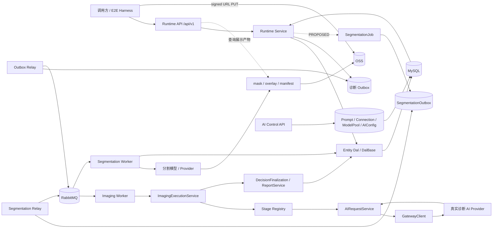
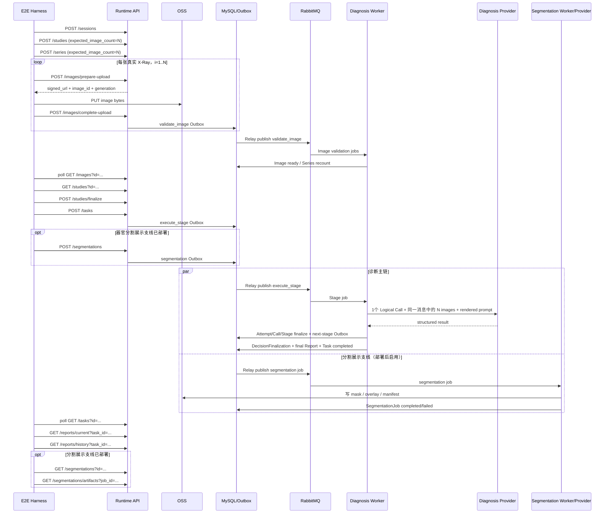

# MS-Image X-Ray 工程、Prompt、评测与可选分割完整开发路线图

> 文档版本：v3.3（最终执行路线与 Prompt 事实校正版）
> 更新日期：2026-08-30
> 当前阶段：先资格化猫/狗 × 2/3/4/5 图真实 Runtime 诊断主链；未通过前不进入医学 Prompt 优化
> 目标仓库：`/Users/mozhicheng/workspace/code/cy-code/ms-image`
> 参考旧仓库：`/Users/mozhicheng/workspace/code/py-project-v2/vet-platform-system/vet-platform`
> 参考旧链时间锚点：commit `6d1dd28bfb74143fb903503cdd08ced1f06a4d91`，2026-04-22

---

## 0. 最终执行摘要

### 0.1 当前到底完成了什么

当前已完成的是源码、接口、Prompt/Provider 计数和 Postman 的**静态合同校准**，不是当前环境下
2–5 图真实链的重新资格化：

| 维度 | 最终口径 | 当前状态 |
|---|---|---|
| 项目 HTTP 路由 | `81 = 77` 个版本化接口 `+ 4` 个根探针 | `STATIC_CONTRACT_QUALIFIED` |
| Runtime 主链直接支撑子集 | Runtime 29 + Runtime Admin 6 + AI Control 31 = 66 | 静态清单完整 |
| Evaluation Control | 11 个版本化接口 + 1 个根探针 | 含 health/readiness；当前 Fake scorer 为 0 Prompt/0 Provider |
| Postman | 98 个 Request = 81 个项目路由 + 5 个 OSS PUT + 12 个多图槽重复请求 | JSON/OpenAPI 静态通过，未运行真实 Runner |
| 历史 Runtime 证据 | 曾跑通过单图、真实多视图、Primary/Targeted 个别病例 | 不能替代 2/3/4/5 图完整矩阵 |
| 当前 2–5 图 Runtime | 服务端上限、Harness 和真实矩阵尚未闭合 | `RUNTIME_2_TO_5_IMAGE_E2E_NOT_RUN` |
| 医学准确率 | 没有可信 Gold、医学 Scorer、M1 和 Holdout | `MEDICAL_ACCURACY_UNKNOWN` |
| 器官分割 | 只有目标合同，没有 API/Job/Worker/Provider | `PROPOSED_NOT_IMPLEMENTED` |

canonical Postman 文件只有一个：

```text
/Users/mozhicheng/workspace/code/cy-code/ms-image/docs/postman/ms-image-xray-complete.postman_collection.json
```

旧会话中的 `66 个接口 / 91 个 Item / localhost:8000 / postman/...` 是 v3.1 口径，不能继续作为
项目总账或最终交付路径。`66` 只保留为病例工程链直接支撑的版本化接口子集。

### 0.2 当前 Runtime 实际需要几份 Prompt

当前 v2 Runtime 并不会逐个渲染 `prompts/xray/catalog.zh-CN.json` 中的 20 个模块。Worker 对每个
Logical Call 直接渲染 Task 所引用的 immutable AI Config 中冻结的一份 `prompt_content`：

```text
cat Task → xray_diagnose_cat → xray_cat_primary 的冻结正文
dog Task → xray_diagnose_dog → xray_dog_primary 的冻结正文
```

当前每个 Stage 的实际合同：

| Stage | 是否渲染医学 Prompt | Provider Logical Call | 说明 |
|---|---:|---:|---|
| `study_preparation` | 0 | 0 | 确定性输入准备 |
| `joint_primary_reader` | 1 | 1 | 一次携带全部 N 张图 |
| `family_routing` | 0 | 0 | 只校验候选与决定是否插入 Targeted |
| `targeted_review` | 条件性 1 | 条件性 1 | 仅 `xray_targeted_review_v2` 且有合法 candidate 时执行 |
| `decision_finalization` | 0 | 0 | 选择已有完整结果并持久化，不创造医学事实 |

因此单病例是：Primary `1 Prompt/1 Call`；Targeted profile 有合法 candidate 时总计
`2 Prompt/2 Calls`；N 张图在每次 Call 中联合发送，N 不增加 Prompt 次数。猫/狗 v4 可以由同一
物种的一份双模式正文通过是否提供 `PRIMARY_RESULT_JSON` 区分 Primary/Targeted；不需要给每个
确定性 Stage 创建 Prompt。

20 个 Catalog 模块只能称为本地模块资产/历史 v1 兼容库存，不能称为当前 v2 病例运行时会逐个
执行的 20 份 Prompt。

### 0.3 唯一下一阶段

下一阶段固定为：

```text
RUNTIME_2_TO_5_IMAGE_DETERMINISTIC_QUALIFICATION
```

执行顺序：

1. E0：冻结猫/狗 × 2/3/4/5 图病例 manifest；
2. E1：首个代码切片，补齐 X-Ray `2 <= N <= 5` 服务端门禁和 Provider 发送前绝对上限；
3. E2：启动唯一 API/Relay/Worker，核验 DB/Redis/RabbitMQ/OSS/Provider/active Config；
4. E3：只改现有 `scripts/dev/run_e2e_local.py`，支持同一 Study 的 2–5 图；
5. E4–E8：运行猫狗 8 个 Primary 病例矩阵并保存可复现 evidence。

本阶段立即禁止：

- 先改医学 Prompt 正文；
- 先做 Targeted 医学效果优化；
- 先实现器官分割；
- 用当前 Fake Evaluation scorer 做 M1 或 A/B；
- 把历史某次成功写成当前 2–5 图矩阵已通过。

### 0.4 E0–E8 通过后的医学阶段

用户的目标是工程链稳定后提高医学 Prompt 效果，因此 E0–E8 通过后的默认路线不是自动进入
器官分割，而是：

```text
R4A Evaluation 独立 DB / metadata / Alembic
→ R4B Dataset 与 image-sidecar pairing 治理
→ R4C Gold ontology + 医学 Scorer + Failure Bank
→ R4D Runtime 等价 Candidate Runner
→ M1 猫/狗分层医学基线
→ Primary Prompt 单变量优化
→ 冻结 Primary winner
→ Targeted candidate / routing / review 单变量优化
→ Regression + isolated Holdout
→ 医学发布门禁
```

器官分割 S0–S6 是独立可选产品支线。只有用户明确把展示能力提升为下一优先级时，才在 E0–E8
之后推进；它不能默认插到工程链与医学基线之间。

## 1. 执行结论

本项目当前第一优先级不是 Evaluation、医学准确率实验、Prompt A/B、Dataset、Gold、Scorer 或大范围重构，而是把 `ms-image` 已存在的真实 X-Ray Runtime 链路完整跑通，并留下可复现、可自动判断 PASS/FAIL 的证据。

目标产品可以在同一份冻结 Study Revision 上拥有两条独立支线，但当前必做链只有诊断主链：

```text
诊断主链：2–5 张原始 X-Ray → 多图联合诊断 → final Report
展示支线：同一批原始 X-Ray → 器官分割 → mask/彩色 overlay → UI 展示
```

两条支线可以并行启动，但只有诊断主链拥有医学结论和 `Task.current_report_id` 的写入权。器官分割仅用于可视化展示技术能力，不参与病灶识别，不作为 Primary/Targeted Prompt 输入，不改变报告内容，也不阻塞 final Report。

本阶段的唯一主目标是：

```text
一次自动执行
→ 创建 Session
→ 创建 Study / Series，实际影像数 N 为 2、3、4 或 5
→ 上传 N 张真实 X-Ray 至 OSS
→ N 张 Image 全部完成异步校验并进入 ready
→ Series 自动进入 ready
→ Study finalize 为 ready
→ 创建 diagnose Task，species=cat 或 dog
→ Outbox
→ Relay
→ RabbitMQ
→ Worker
→ Stage Pipeline
→ 冻结后的真实 Prompt / Config / ModelPool / Connection
→ 真实 Provider
→ Primary，或条件触发 Targeted Review
→ DecisionFinalization
→ Task completed
→ 生成首份 final Report
→ current / history 查询成功
→ 输出完整证据包和明确 PASS/FAIL
```

当用户另行批准器官分割产品支线后，Study ready 后还可以独立启动：

```text
创建 SegmentationJob
→ SegmentationOutbox
→ Relay / RabbitMQ
→ Segmentation Worker / Provider
→ 每张原始图生成 mask + overlay_preview + manifest
→ 查询状态与展示产物
```

分割支线失败、超时、重试、取消或 dead-letter 时，诊断 Task 仍必须能独立完成并生成 final Report。

### 1.1 影像数量硬合同

本节定义的是**目标验收合同**，不是对当前源码完成度的描述。当前
`StudyCreate.expected_image_count` 和 `SeriesCreate.expected_image_count` 还没有实现
X-Ray 专用 `2 <= N <= 5` 服务端硬门禁，现有确定性 E2E Harness 仍只资格化单图；这些缺口
必须在 E1/E3 关闭后，才能把 2–5 图写成已实现能力。本阶段不能继续把病例固定写死为 4 张图。

```text
N = 当前病例的真实影像数量
N ∈ {2, 3, 4, 5}
MAX_XRAY_IMAGES_PER_STUDY = 5
```

4 张是常见完整场景之一，5 张是本阶段业务上限；2 张、3 张、4 张和 5 张都必须是正式验收场景。

同一次病例执行中，下列值必须严格一致：

```text
Study.expected_image_count
= 各 Series.expected_image_count 之和
= ready Image 总数
= Study Manifest 内 Image 总数
= Task Snapshot 内 Image 总数
= Provider 请求实际 Image 数
= Provider receipt.image_count
= E2E 证据中的 image_count
= N
```

Report 的 `source_refs` 不要求简单地“刚好出现 N 次”，因为一个 Finding 可以引用多张图、不同 Finding 也可以重复引用同一图；但所有 `source_refs.image_id` 必须属于本次冻结输入，且报告级证据必须证明本次实际输入的 N 张图没有被静默丢弃、替换或混入其他 Study 的图片。

### 1.2 当前架构决策

采用：

```text
保留现有入口的内部工程补齐
existing-entry internal modular correction
```

继续复用：

```text
API → Service → CRUD(DalBase) → Model/MySQL

Task → Outbox → Relay → RabbitMQ → Worker
→ Stage Registry → AIRequestService → Gateway → Provider
→ DecisionFinalization → Report
```

禁止为“跑通链路”再创建第二套 Runtime、Repository、CRUDBase、DatabaseService、Pipeline、Scorer 或医学事实源。

架构范围比较：

| 方案 | 失败归属匹配 | 合同复用 | 增量验证 | 回滚 | 结论 |
|---|---|---|---|---|---|
| 局部修补 | 只能解决单图 Harness 或某一处上限校验，不能覆盖多图血缘、异步链和新增分割支线 | 强 | 强 | 强 | 对单点有效，但不足以承载完整产品路线 |
| 保留入口的内部模块化补齐 | 先修复 2–5 图门禁/E2E；医学治理和可选 Segmentation 均沿现有入口分阶段扩展 | 强 | 强，可按 E0–E8、R4A–R4D、S0–S6 分段 | 强，可回滚 Config/关闭可选能力 | **采用** |
| 全链重写 | 未发现现有入口、状态、Outbox、Provider、Report 合同全部失效的证据 | 弱 | 弱，变量过多 | 弱 | 否决；会重复事实源并扩大风险 |

决策置信度：诊断主链为源码直接证据；分割模块为基于现有分层与异步模式的目标设计。该决策不声称医学准确率提升，只提高工程闭环、可追溯性和产品展示能力。

### 1.3 当前完成度判断

| 维度 | 当前判断 | 含义 |
|---|---|---|
| 代码主链 | `CONFIRMED` | Session、Study、Image、Task、Outbox、Worker、Stage、Gateway、Report 的代码链已存在 |
| 动态 2–5 图 E2E | `GAP` | 现有 `run_e2e_local.py` 仍固定为 1 张图，尚未覆盖同 Study 的 2–5 图 |
| 5 图业务硬上限 | `GAP` | Study/Series schema 当前只校验 `ge=0`，没有 X-Ray 专用 `le=5` 约束 |
| 当前运行环境 | `UNKNOWN` | 本次核验时 Docker daemon、Runtime、Relay、Worker 未动态证明 ready |
| 真实 Provider | `UNKNOWN` | `.env.example` 中 Provider URL/key 为空，当前有效凭据未验证 |
| Active Config | `UNKNOWN` | 当前数据库内 cat/dog active Config、Prompt、ModelPool、Connection 未连接核验 |
| 体位来源 | `CONFIRMED` | 当前由调用方逐图提交 `projection` 并冻结；代码没有 AI 像素体位识别，也没有 DICOM `ViewPosition` 自动回填 |
| 多图分析方式 | `CONFIRMED` | 一个 Logical Call 的同一条 user message 携带全部 N 张图；Primary 1 次联合调用，Targeted 条件触发时再用全部 N 张图复核 |
| 全图实际评估证明 | `GAP` | receipt 能证明发送 N 张，但当前 Schema 未要求逐图 `image_assessments` 覆盖全部输入 |
| 器官分割执行链 | `GAP/PROPOSED` | 当前只有 `image_role=segmentation` 等存储底座，没有 Segmentation API、Job、Worker、Provider 或真实模型 |
| 首份 final Report | `CONFIRMED-CODE` | 第 1 版 Report 不依赖 supersede CAS，代码可进入 Task completed |
| Report 二次修订/发布/作废 | `KNOWN-RISK` | Report ORM 没有 `state_version`，但相关路径调用 CAS；不能宣称已完成 |
| 医学准确率 | `NOT-CLAIMED` | 工程链路成功不能替代医学准确率结论 |

### 1.4 三条必须冻结的产品语义

| 问题 | 最终答案 | 状态 |
|---|---|---|
| AI 是否会判断影像体位 | 当前不会从像素自动判断；体位由调用方声明。未来可增加独立 AI 体位质控，但只能提示冲突，不能静默覆盖冻结值 | 当前 `CONFIRMED`；质控为 `PROPOSED` |
| 多张影像如何分析 | 全部 N 张图按冻结顺序放入同一次 Provider 请求中联合分析；不是逐张调用后由 Python 汇总 | `CONFIRMED` |
| 器官分割是否参与诊断 | 不参与。只生成 mask/overlay 给前端展示；失败不影响诊断完成，不进入医学 Prompt，不改 Report | `PROPOSED` 硬隔离合同 |

---

## 2. 文档用途、事实标签与权威顺序

### 2.1 文档用途

本文档同时承担以下职责：

1. 第一阶段开发路线图；
2. 端到端接口调用手册；
3. Runtime 内部架构说明；
4. Prompt、Config、Provider 冻结合同；
5. 2–5 图自动化验收规范；
6. 失败、重试、幂等和停止条件；
7. 可直接交给 AI 开发代理执行的任务 Prompt。
8. 可选器官分割展示支线的接口、数据表、异步任务和验收规范。

本次证据基线：

```text
workspace: /Users/mozhicheng/workspace/code/cy-code/ms-image
branch: codex/prompt-runtime-ai-gateway
revision: 0a9aca4fb5c213799d70ab738ebc54c3dd7d76b9
document date: 2026-08-30
```

目标指标分层：

| 类型 | 本文目标 | 当前状态 |
|---|---|---|
| 工程有效性 | cat/dog × 2/3/4/5 真实链得到 final Report | 尚未动态跑完整矩阵 |
| 工程完整性 | 图像数、projection、hash、Prompt/Config/Provider/Report 全链可追溯 | 部分代码已确认，完整 E2E 待执行 |
| 展示能力 | 分割支线生成可追溯 mask/overlay，且不阻塞诊断 | 未实现 |
| 医学准确率 | Gold/Scorer/Holdout 指标 | `N/A` 于当前工程阶段，不作声明 |

### 2.2 事实标签

| 标签 | 含义 |
|---|---|
| `CONFIRMED` | 已由当前源码或实际文件直接确认 |
| `CONFIRMED-CODE` | 代码路径存在，但本次会话未动态运行证明 |
| `IMPLEMENTED` | HTTP 路由和主合同已实现，可纳入当前 Collection；是否动态通过仍以验收记录为准 |
| `IMPLEMENTED_NOT_QUALIFIED` | 路由存在，但依赖环境或完整执行资格尚未建立，不能作为当前主链成功条件 |
| `DEFERRED_BROKEN` | 路由存在，但已知合同缺陷会阻止可靠执行，默认不得调用 |
| `PROPOSED_NOT_IMPLEMENTED` | 仅为目标接口，当前 OpenAPI、Service 或执行链中不存在 |
| `INFERRED` | 根据多个源码事实推导，执行前应做小范围验证 |
| `PROPOSED` | 本文要求新增或调整的目标合同 |
| `GAP` | 当前代码或运行工具与目标之间存在缺口 |
| `UNKNOWN` | 必须连接当前环境、数据库或外部依赖后才能确认 |
| `N/A` | 本阶段不适用或明确延期 |

### 2.3 权威顺序

发生冲突时，按以下顺序判断：

1. 当前仓库实际源码；
2. 当前数据库中的冻结记录与运行证据；
3. 本文档；
4. 当前仓库其他设计文档；
5. 旧 Postman 集合；
6. 旧项目实现和历史说明。

旧项目仅用于理解“完整工程闭环”的目标，不复制其旧 API 路径、A/B/C 业务结构或内部实现。

---

## 3. 第一阶段范围

### 3.1 必须完成

- 真实 OSS 上传，不使用内存假图或 Mock URL；
- 同一个 Study 支持实际 N=2、3、4、5 张图；
- 每张图都经过真实 Image Validation 异步链；
- Study 只有在图像、计数和 Manifest 全部一致时才能 ready；
- Task 使用 `diagnose`，物种严格为 `cat` 或 `dog`；
- Task 必须冻结 active AI Config；
- 必须经过 Outbox、Relay、RabbitMQ 和 Worker；
- 必须调用真实 Provider；
- 必须生成首份 `status=final` 的 Report；
- 必须能通过 `/reports/current` 和 `/reports/history` 查询；
- 必须自动输出链路证据并判定 PASS/FAIL；
- 必须覆盖猫、狗以及 2/3/4/5 图矩阵；
- 真实失败必须保留错误状态和诊断信息，禁止伪造成功。

### 3.2 明确不作为第一阶段阻塞项

- Evaluation 全套接口；
- Dataset / Gold / Scorer；
- Failure Bank / Holdout；
- 医学 Prompt A/B 或模型 A/B；
- Race、Fallback、医学重试策略实验；
- 医学准确率、召回率或发布资格声明；
- Report 二次修订、publish、void 的完整治理；
- 大范围数据库重构；
- 新建平行 Repository、Pipeline 或微服务；
- 无当前消费者的新 API；
- 器官分割展示实现本身；它是可选产品支线，其未完成不得阻塞第一阶段 final Report；
- Mock Provider、Fake Report；
- 手工改数据库推动状态；
- 人工直接调用 Worker 绕过 Outbox；
- 仅以 Task accepted、queued 或 provider 200 作为成功。

### 3.3 本阶段成功的唯一终点

```text
Task.execution_status == "completed"
AND Task.current_report_id 非空
AND GET /reports/current?task_id=... 返回 status="final"
AND GET /reports/history?task_id=... 至少包含同一 Report
AND Provider egress receipt 证明真实发送了 N 张图
AND 所有输入、Manifest、Snapshot、Provider、Report 证据可追溯
```

---

## 4. 当前架构与目标架构

### 4.1 目标组件图



图中的实线诊断链是当前已有架构，虚线分割入口及 Segmentation 组件为目标设计。二者共享原始影像和冻结 Study Revision，不共享终态，不互相等待。

### 4.2 真实时序



关键时序规则：

- `Task completed + final Report` 不等待 `SegmentationJob completed`；
- 诊断 Provider 始终读取未叠加的原始影像；
- 分割产物只通过独立展示接口返回，不回写 `CompleteMedicalResult`；
- Primary 是一次全图联合请求；Targeted 被条件触发时，再进行一次全图联合复核。

### 4.3 分层不变量

```text
API → Service → CRUD(DalBase) → Model/MySQL
```

- API 只负责路由、请求、鉴权、依赖注入、统一响应和错误映射；
- Service 负责业务校验、状态流转、幂等和多 DAL 编排；
- CRUD 必须继承 `apps.backend.core.crud.DalBase`；
- Service、API、Worker 不得新增直接 SQL 路径；
- Schema 只定义请求、响应和边界校验；
- 不使用 `/{id}`，资源 ID 放 query 或 request body；
- 新表使用独立 opaque `VARCHAR(64)` 主键；
- 不新增 foreign key；
- 状态和类型优先 string/json/timestamp，不用数据库 enum。

---

## 5. 2–5 图数据与一致性合同

### 5.1 单 Series 验收模型

第一阶段用“一个 Study、一个 Series、N 张原始图”作为标准验收模型：

```text
Study.expected_image_count = N
Series.expected_image_count = N
Image.sequence_no = 1..N
Image.logical_image_key 在 Series 内唯一
N ∈ {2,3,4,5}
```

推荐输入病例 manifest：

```json
{
  "case_key": "dog-thorax-3-view-001",
  "species": "dog",
  "image_count": 3,
  "study": {
    "modality_type": "xray",
    "body_part": "thorax"
  },
  "series": [
    {
      "series_key": "series-1",
      "expected_image_count": 3,
      "images": [
        {"path": "/absolute/path/1.jpg", "sequence_no": 1, "projection": "vd"},
        {"path": "/absolute/path/2.jpg", "sequence_no": 2, "projection": "left_lateral"},
        {"path": "/absolute/path/3.jpg", "sequence_no": 3, "projection": "right_lateral"}
      ]
    }
  ]
}
```

### 5.2 多 Series 兼容合同

代码支持一个 Study 下多个 Series。若后续病例确实包含多个 Series：

```text
2 ≤ Study.expected_image_count ≤ 5
1 ≤ 每个 Series.expected_image_count ≤ 5
Σ Series.expected_image_count = Study.expected_image_count
Σ Series.actual_image_count = Study.expected_image_count
```

第一阶段自动验收先使用单 Series，不能把单 Series 假设写入核心 Service；Service 必须按所有 Series 汇总。

### 5.3 Study finalize 门禁

`StudyService.finalize_study()` 当前会检查：

- `state_version` 与 `revision_id`；
- `identity_status == confirmed`；
- 至少有一个 Series；
- 所有 Series 为 `ready`；
- 每个 Series 的 expected/actual count 一致；
- 没有仍在 uploading/validating 的 Image；
- Series Manifest 可解析且数量一致；
- Study 总 expected/actual count 一致；
- Study Manifest 可构建；
- completeness 为 complete。

证据：

- `apps/backend/services/runtime/service/study_service.py:219-325`
- `apps/backend/core/imaging/manifest.py:358-488`

### 5.4 当前 5 图限制缺口

当前源码：

```text
StudyCreate.expected_image_count: ge=0，无 le=5
SeriesCreate.expected_image_count: ge=0，无 le=5
AI Config budget_policy.max_input_images: 1..100
AIRequestService: 仅按冻结 Config 的 max_input_images 检查
```

证据：

- `apps/backend/schemas/study.py:25-99`
- `apps/backend/schemas/ai_control.py:125`
- `apps/backend/services/runtime/service/ai_request_service.py:338-346`

本阶段必须补齐的目标合同：

1. X-Ray Study 创建时拒绝 `expected_image_count < 2` 或 `> 5`；
2. X-Ray Series 数量之和不得超过 5；
3. 第 6 张 Image 的 prepare-upload 必须 fail-closed；
4. active cat/dog Config 的 `budget_policy.max_input_images` 必须等于 5；
5. 冻结 Model/Connection 能力必须声明至少支持 5 图；
6. Worker Provider 请求超过 5 图时必须在发送前失败；
7. 上限校验必须位于 Service/AIRequest 门禁，不能只依赖前端或 E2E 脚本。

建议不要把全局 `StudyCreate` schema 直接改成 `le=5`，除非该服务永远只承载 X-Ray；更稳妥的是在现有 `StudyService`、`ImageService` 和 Config 编译门禁中按 `modality_type=xray` 实施业务限制。

### 5.5 Manifest 与排序

- `sequence_no` 必须从 1 开始；
- 不能用文件名自然排序替代 `sequence_no`；
- Manifest 必须稳定排序并计算 SHA256；
- 同一输入重复执行时，内容一致不等于 ID 一致，但 Manifest 结构和输入 SHA 应可解释；
- Provider 图片顺序必须与冻结 Manifest 顺序一致；
- `projection` 是每张图自己的元数据，不能只在 Study 级提供一个 projection。

### 5.6 影像体位来源、AI 判断与冲突处理

#### 当前已实现事实

当前系统的权威体位来源是调用方在每张影像申请上传时提交的 `projection`：

```json
{
  "series_id": "...",
  "logical_image_key": "image-1",
  "sequence_no": 1,
  "projection": "vd"
}
```

当前实现只保证 `projection` 非空、trim 后长度不超过 64，并没有强制 VD、DV、left lateral、right lateral 等受控词表。新上传图的 provenance 会标记为 `caller_declared`；历史缺失体位会使用 `UNKNOWN + legacy_unspecified`，系统不会凭空猜测。

已确认的数据流：

```text
prepare-upload.projection
→ Image.projection
→ Series Manifest
→ Study Manifest
→ Task Snapshot.ordered_images
→ SAFE_STUDY_CONTEXT_JSON.view_positions / ordered_image_refs
→ Provider SourceRef 技术校验
```

当前 DICOM 读取逻辑只读取了 `PatientOrientation` 等字段，没有读取并回填 DICOM `ViewPosition`；当前也没有独立模型从图像像素自动分类体位。因此不得在文档、接口或 UI 中宣称“AI 已自动识别体位”。

源码证据：

- `apps/backend/schemas/image.py:156-172`
- `apps/backend/core/imaging/manifest.py:99-146`
- `apps/backend/models/image.py:141-145`
- `apps/backend/services/runtime/service/image_service.py:470-479`
- `apps/backend/core/imaging/object_store.py:650-665`
- `apps/backend/services/runtime/service/task_service.py:507-552`
- `apps/backend/services/runtime/stages/xray/prompt_commands.py:153-235`
- `apps/backend/core/ai/xray_result_contract.py:76-92`

#### 目标体位质控路线（PROPOSED，不阻塞 E0–E8）

体位应拆成“来源事实”和“质控观察”两个概念：

| 字段 | 含义 | 是否可覆盖冻结 projection |
|---|---|---:|
| `declared_projection` | 调用方声明 | 作为当前来源事实 |
| `dicom_view_position` | 可信 DICOM `ViewPosition` | 只能按明确优先级写入新影像，不追改历史 Snapshot |
| `observed_projection` | 独立 AI 体位质控模型观察 | 否 |
| `confidence` | AI 观察置信度 | 否 |
| `conflict_status` | `consistent/conflict/uncertain/not_assessed` | 否 |
| `review_required` | 是否需要人工确认 | 否 |

建议的新影像来源优先级：

```text
可信 DICOM ViewPosition
→ 调用方声明 projection
→ 缺失时 UNKNOWN
```

AI 体位质控只能输出冲突提示，不能静默改写 `Image.projection`、Manifest 或已冻结 Task Snapshot。若体位冲突需要阻止诊断，应由独立影像质量门禁根据受控状态决定；禁止在 Python 中根据像素或文本猜测医学事实。

#### 第一阶段验收要求

- 每个病例 manifest 必须逐图显式写 `projection`；
- E2E 必须核对上传请求、Image、Manifest、Snapshot、Prompt context、SourceRef 中的 projection 血缘；
- 模型返回的 SourceRef 不得把一张图的 projection 改成另一种体位；
- 当前阶段允许 `UNKNOWN`，但必须在 limitation/quality evidence 中可见，不能伪造体位；
- 自动体位识别属于后续 P1/P2 质控能力，不阻塞真实 2–5 图诊断主链。

---

## 6. Runtime 公共 HTTP 接口

### 6.1 通用规则

- 默认前缀：`/api/v1`；
- 业务接口需要配置的 imaging scope；
- 单对象响应：`GenericResponse[T]`；
- 分页响应：`PagedResponse[T]`；
- 所有资源 ID 使用 query 或 body；
- 所有 CAS 更新使用 `expected_state_version`；
- 任何错误都不能通过 200 + 假数据伪装成功。

Postman 命名规则：

- 接口技术合同以“HTTP 方法 + 路径”为准，不能为了名称通俗而改动真实路由；
- Postman Collection 按 `使用说明与资格边界`、`Runtime 主链`、`Runtime 辅助操作`、
  `Runtime Admin`、`AI Control`、`Evaluation Control`、`未实现目标接口说明` 分 Folder；
- Item 名称统一使用“业务对象 + 动作 + 结果”的中文表达，不直接用 endpoint 函数名；
- 主链 Item 额外使用两位步骤号，例如 `01. 检查 Runtime 是否就绪`、`02. 创建诊断会话`；
- N 张图相关请求写成 `04.1 申请第 1 张影像上传`、`04.2 申请第 2 张影像上传`，根据病例动态生成至 N，N 最大为 5；
- 下列各表的“Postman 展示名称”是后续生成或维护 Collection 时的唯一命名基线。

#### 6.1.1 非版本化服务根探针：4 个

这些探针不带 `/api/v1`，只证明对应 FastAPI 进程可以响应，不替代 `/health`、`/readiness`
或真实业务 E2E：

| 服务 | 方法 | 路径 | 用途 | 医学 Prompt | LLM Provider Call |
|---|---|---|---|---:|---:|
| Runtime | GET | `/` | Runtime 进程根提示 | 0 | 0 |
| Runtime Admin | GET | `/` | Admin 进程根提示 | 0 | 0 |
| AI Control | GET | `/` | AI Control 进程根提示 | 0 | 0 |
| Evaluation Control | GET | `/` | Evaluation Control 进程根提示 | 0 | 0 |

证据：

- `apps/backend/services/runtime/main.py:28-90`（同一模块中的 `app` 与 `admin_app`）
- `apps/backend/services/ai_control/main.py:33-38`
- `apps/backend/services/evaluation_control/main.py:33-38`

### 6.2 Runtime API 全量清单：29 个

#### 6.2.1 健康与版本：3 个

| Postman 展示名称 | 方法 | 路径 | 用途 | 本期使用 |
|---|---|---|---|---|
| 检查 Runtime 服务健康 | GET | `/api/v1/health` | 进程健康 | 是 |
| 查询 Runtime 服务版本 | GET | `/api/v1/version` | 版本信息 | 证据归档 |
| 检查 Runtime 依赖是否就绪 | GET | `/api/v1/readiness` | DB/依赖就绪 | 是，E2E 前置门禁 |

#### 6.2.2 Session：5 个

| Postman 展示名称 | 方法 | 路径 | 输入 | 输出/状态 | 本期角色 |
|---|---|---|---|---|---|
| 创建诊断会话 | POST | `/api/v1/sessions` | `SessionCreate` | 新 Session | 主链入口 |
| 查询诊断会话详情 | GET | `/api/v1/sessions?id=...` | query `id` | Session | 取状态/version |
| 标记诊断会话已完成 | POST | `/api/v1/sessions/complete` | `id`, `expected_state_version` | completed Session | 可在 Report 后完成 |
| 关闭诊断会话 | POST | `/api/v1/sessions/close` | `id`, `expected_state_version` | closed Session | 业务闭环可选 |
| 取消诊断会话 | POST | `/api/v1/sessions/cancel` | `id`, `expected_state_version`, `cancel_reason` | cancelled Session | 失败/取消场景 |

创建示例：

```json
{
  "source_system": "ms-image-e2e",
  "source_session_id": "{{run_id}}",
  "source_medical_record_id": "{{case_key}}",
  "subject_id": "{{subject_id}}",
  "request_id": "session-{{run_id}}",
  "started_at": "{{utc_iso_time}}"
}
```

证据：

- `apps/backend/services/runtime/api/api_v1/endpoints/sessions.py:21-103`
- `apps/backend/schemas/session.py:11-110`
- `apps/backend/services/runtime/service/session_service.py:43-96`

#### 6.2.3 Study 与 Series：4 个

| Postman 展示名称 | 方法 | 路径 | 输入 | 输出/状态 | 本期角色 |
|---|---|---|---|---|---|
| 创建 X-Ray 检查 | POST | `/api/v1/studies` | `StudyCreate` | Study | 必须 |
| 查询 X-Ray 检查详情与影像计数 | GET | `/api/v1/studies?id=...` | query `id` | Study + Series | 必须，用于 finalize 前读取版本和计数 |
| 确认 X-Ray 检查影像已齐全 | POST | `/api/v1/studies/finalize` | `StudyFinalizeRequest` | ready Study | 必须 |
| 创建 X-Ray 影像序列 | POST | `/api/v1/series` | `SeriesCreate` | Series | 必须 |

Study 创建示例：

```json
{
  "session_id": "{{session_id}}",
  "source_study_id": "{{case_key}}",
  "modality_type": "xray",
  "body_part": "{{body_part}}",
  "metadata_schema_version": "xray-study.v1",
  "expected_image_count": "{{image_count}}",
  "completeness_attested_by": "e2e-harness",
  "identity_status": "confirmed",
  "technical_metadata": {
    "case_key": "{{case_key}}"
  }
}
```

Series 创建示例：

```json
{
  "study_id": "{{study_id}}",
  "series_key": "{{series_key}}",
  "series_no": 1,
  "metadata_schema_version": "xray-series.v1",
  "expected_image_count": "{{series_image_count}}",
  "technical_metadata": {}
}
```

Finalize 示例：

```json
{
  "id": "{{study_id}}",
  "expected_state_version": "{{study_state_version}}",
  "current_revision_id": "{{study_revision_id}}"
}
```

注意：

- 没有公开的 Series finalize；
- Series ready 由 Image ready 后内部重算；
- 不应为了 E2E 新增 Series finalize API；
- `expected_image_count` 在实际 HTTP JSON 中应是整数，模板中的字符串占位符在发送前必须解析为整数。

证据：

- `apps/backend/services/runtime/api/api_v1/endpoints/studies.py:19-83`
- `apps/backend/schemas/study.py:25-150`
- `apps/backend/services/runtime/service/study_service.py:92-325`

#### 6.2.4 Image：10 个

| Postman 展示名称 | 方法 | 路径 | 用途 | 本期角色 |
|---|---|---|---|---|
| 申请单张影像上传地址 | POST | `/api/v1/images/prepare-upload` | 申请直接上传 ticket | 主链必须 |
| 替换单张原始影像 | POST | `/api/v1/images/replace` | 替换原图 | 非主链 |
| 准备分片替换影像 | POST | `/api/v1/images/replace-multipart` | 分片替换 | 本期不使用 |
| 准备影像分片上传 | POST | `/api/v1/images/prepare-multipart-upload` | 准备分片上传 | 本期不使用 |
| 获取影像分片上传地址 | POST | `/api/v1/images/prepare-upload-parts` | 获取分片 URL | 本期不使用 |
| 查询已上传的影像分片 | POST | `/api/v1/images/list-upload-parts` | 查询已上传分片 | 本期不使用 |
| 确认单张影像上传完成 | POST | `/api/v1/images/complete-upload` | 确认上传完成并产生 validation Outbox | 主链必须 |
| 查询单张影像处理状态 | GET | `/api/v1/images?id=...` | 查询单图状态 | 主链轮询 |
| 查询序列的影像列表 | GET | `/api/v1/images/page?series_id=...` | 按 `series_id` 分页查询 Image | 计数和诊断证据 |
| 终止影像上传 | POST | `/api/v1/images/abort-upload` | 终止上传 | 失败场景 |

Prepare-upload 示例，每张图执行一次：

```json
{
  "series_id": "{{series_id}}",
  "source_image_id": "{{case_key}}-{{sequence_no}}",
  "logical_image_key": "image-{{sequence_no}}",
  "sequence_no": "{{sequence_no}}",
  "image_role": "original",
  "image_kind": "xray",
  "metadata_schema_version": "xray-image.v1",
  "file_format": "jpeg",
  "expected_sha256": "{{file_sha256}}",
  "expected_size_bytes": "{{file_size}}",
  "declared_content_type": "image/jpeg",
  "projection": "{{projection}}",
  "technical_metadata": {}
}
```

服务返回：

```text
image.id
image.state_version
generation
signed_url
required_headers
expires_at
```

调用方必须把原始文件字节 PUT 到 `signed_url`，并带上返回的 `required_headers`。不能把 signed URL 当成普通 Runtime API 再 POST。

Complete-upload 示例：

```json
{
  "id": "{{image_id}}",
  "expected_state_version": "{{image_state_version}}",
  "generation": "{{generation}}",
  "trace_id": "image-validate-{{run_id}}-{{sequence_no}}"
}
```

`complete-upload` 成功不代表 Image 已 ready。它只完成上传确认并写入 `validate_image` Outbox；调用方必须轮询到 `status=ready`。

每张 Image 必须断言：

```text
id 与 prepare ticket 一致
series_id 与当前 Series 一致
sequence_no 与病例 manifest 一致
projection 与病例 manifest 一致
content_sha256 与本地文件 SHA256 一致
size_bytes 与本地文件长度一致
content_type 与声明一致
status == ready
validation_attempt_count >= 1
```

证据：

- `apps/backend/services/runtime/api/api_v1/endpoints/images.py:39-241`
- `apps/backend/schemas/image.py:156-445`
- `apps/backend/services/runtime/service/image_service.py:210-249`
- `apps/backend/services/runtime/service/image_service.py:1085-1101`
- `apps/backend/services/runtime/service/image_service.py:1515-1575`

#### 6.2.5 Task：4 个

| Postman 展示名称 | 方法 | 路径 | 用途 | 本期角色 |
|---|---|---|---|---|
| 提交 X-Ray 智能诊断任务 | POST | `/api/v1/tasks` | 创建诊断任务 | 必须 |
| 查询诊断任务进度与结果引用 | GET | `/api/v1/tasks?id=...` | 查询 Task 详情 | 必须轮询 |
| 分页查询诊断任务 | GET | `/api/v1/tasks/page?...` | 分页状态查询 | 运维/证据 |
| 取消诊断任务 | POST | `/api/v1/tasks/cancel` | 请求逻辑取消 | 失败场景 |

Task 创建示例：

```json
{
  "study_id": "{{study_id}}",
  "study_revision_id": "{{ready_study_revision_id}}",
  "request_id": "task-{{run_id}}",
  "task_type": "diagnose",
  "species": "{{species}}",
  "trace_id": "task-trace-{{run_id}}",
  "clinical_context": {
    "contract_version": "xray-clinical-context.v1",
    "source": {
      "system": "ms-image-postman",
      "recorded_at": "{{utc_iso_time}}",
      "temporal_scope": "available_at_request"
    },
    "chief_complaint": "{{chief_complaint}}",
    "study_reason": "{{study_reason}}"
  }
}
```

合同：

```text
species=cat → config_key=xray_diagnose_cat → prompt_key=xray_cat_primary
species=dog → config_key=xray_diagnose_dog → prompt_key=xray_dog_primary
```

Task 创建必须满足：

- Study 为 ready；
- `study_revision_id` 与当前 ready revision 一致；
- Task business key 幂等；
- active Config 存在且可分配；
- Config species、prompt_key 和 profile 均匹配；
- Config 冻结完整性通过；
- Study Snapshot 可冻结。

成功轮询终态：

```text
completed
failed
cancelled
dead_letter
```

只有 `completed` 可以继续按成功验收。

证据：

- `apps/backend/services/runtime/api/api_v1/endpoints/tasks.py:21-74`
- `apps/backend/schemas/task.py:84-158`
- `apps/backend/services/runtime/service/task_service.py:75-189`
- `apps/backend/services/runtime/service/task_service.py:209-418`

#### 6.2.6 Report：3 个

| Postman 展示名称 | 方法 | 路径 | 用途 | 本期角色 |
|---|---|---|---|---|
| 按报告 ID 查询诊断报告 | GET | `/api/v1/reports?id=...` | 按 Report ID 查询 | 可选交叉核验 |
| 查询任务的最终诊断报告 | GET | `/api/v1/reports/current?task_id=...` | 查询 Task 当前 Report | 必须 |
| 查询任务的诊断报告历史 | GET | `/api/v1/reports/history?task_id=...` | 查询历史版本 | 必须 |

Report 必须断言：

```text
report.id == task.current_report_id
report.task_id == task.id
report.revision_no == 1
report.status == final
report.source_stage_checkpoint_id 非空
report.source_call_id 非空（真实 Provider 成功场景）
report.content_sha256 为 64 位 SHA256
report.content_json 满足冻结 output schema
history 至少包含 current Report
```

证据：

- `apps/backend/services/runtime/api/api_v1/endpoints/reports.py:12-53`
- `apps/backend/services/runtime/service/report_service.py:100-184`
- `apps/backend/schemas/report.py:9-25`

### 6.3 Runtime Admin API：6 个

Runtime Admin 是独立进程、独立 base URL。默认本地 API base URL 为
`http://127.0.0.1:8001/api/v1`。不得把部署层 `root_path=/ms-image/admin` 误写成
ASGI 路由，也不得请求旧的 `/admin/...` 路径。

| Postman 展示名称 | 方法 | 路径 | 用途 | 第一阶段 |
|---|---|---|---|---|
| 检查 Runtime Admin 服务状态 | GET | `/api/v1/status` | 管理进程状态 | 环境检查 |
| 查询 Runtime Admin 服务信息 | GET | `/api/v1/info` | 管理信息 | 可选 |
| 检查 Runtime Admin 依赖是否就绪 | GET | `/api/v1/readiness` | 管理依赖就绪 | 环境检查 |
| 查询诊断链路运维快照 | GET | `/api/v1/operations/status` | Outbox/Task/Stage/Report 运维快照 | `IMPLEMENTED_NOT_QUALIFIED`：依赖 Evaluation DB 资格 |
| 发布诊断报告 | POST | `/api/v1/reports/publish` | 发布 Report | `DEFERRED_BROKEN`：Report CAS 合同未闭合 |
| 作废诊断报告 | POST | `/api/v1/reports/void` | 作废 Report | `DEFERRED_BROKEN`：Report CAS 合同未闭合 |

当前 Report 风险：

- `Report` 继承的 `ImagingRecordBase` 只有 `id/created_at/updated_at`；
- `ReportDal.cas_update()` 调用默认 `version_field=state_version`；
- 当前 `Report` ORM 没有 `state_version`；
- 当前 `ReportResponse` 也没有暴露 `state_version`，客户端无法获得可靠 CAS 版本；
- 因而已有 Report 的 supersede、publish、void 合同不完整；
- 第 1 份 Report 不进入 supersede 分支，仍可作为第一阶段终点。

证据：

- `apps/backend/models/imaging_base.py:12-40`
- `apps/backend/models/report.py:10-40`
- `apps/backend/crud/report.py:46-52`
- `apps/backend/core/crud.py:290-330`
- `apps/backend/services/runtime/service/report_service.py:100-130`
- `apps/backend/services/runtime/main.py:36-78`
- `apps/backend/services/runtime/admin_api/endpoints/admin.py:13-74`
- `apps/backend/services/runtime/admin_api/endpoints/operations.py:34-55`
- `apps/backend/services/runtime/admin_api/endpoints/reports.py:17-31`

### 6.4 AI Control API：31 个

AI Control API 不在每次病例 Runtime 调用中执行，但它负责准备和冻结 Runtime 必需的 Prompt、Connection、ModelPool 和 AIConfig。

#### 健康：2 个

| Postman 展示名称 | 方法 | 路径 | 用途 |
|---|---|---|---|
| 检查 AI Control 服务健康 | GET | `/api/v1/health` | AI Control 健康 |
| 检查 AI Control 依赖是否就绪 | GET | `/api/v1/readiness` | AI Control DB/依赖就绪 |

AI Control 与 Runtime 是不同进程时，虽然前缀相同，base URL 不同，E2E 配置中必须分开。

#### Prompt：7 个

| Postman 展示名称 | 方法 | 路径 | 用途 |
|---|---|---|---|
| 创建 Prompt 版本 | POST | `/api/v1/ai-prompts` | 创建不可变 Prompt 记录 |
| 更新 Prompt 状态与说明 | PUT | `/api/v1/ai-prompts` | 更新允许更新的 Prompt 状态/元数据 |
| 查询 Prompt 详情 | GET | `/api/v1/ai-prompts/detail?id=...` | Prompt 详情 |
| 分页查询 Prompt | GET | `/api/v1/ai-prompts/page?...` | Prompt 分页 |
| 校验 Prompt 是否可用 | POST | `/api/v1/ai-prompts/validate` | 验证 Prompt |
| 退役 Prompt | POST | `/api/v1/ai-prompts/retire` | 退役 Prompt |
| 从外部来源导入 Prompt | POST | `/api/v1/ai-prompts/import` | 从外部源导入 Prompt |

#### Connection：6 个

| Postman 展示名称 | 方法 | 路径 | 用途 |
|---|---|---|---|
| 创建 AI 服务连接 | POST | `/api/v1/ai-connections` | 创建 Connection |
| 更新 AI 服务连接 | PUT | `/api/v1/ai-connections` | 更新 Connection |
| 查询 AI 服务连接详情 | GET | `/api/v1/ai-connections/detail?id=...` | 详情 |
| 分页查询 AI 服务连接 | GET | `/api/v1/ai-connections/page?...` | 分页 |
| 校验 AI 服务连接合同 | POST | `/api/v1/ai-connections/validate` | 校验 endpoint/Connection SHA 并推进状态；当前 HTTP 实现不发送 Provider 请求 |
| 退役 AI 服务连接 | POST | `/api/v1/ai-connections/retire` | 退役 |

#### Model Pool：6 个

| Postman 展示名称 | 方法 | 路径 | 用途 |
|---|---|---|---|
| 创建 AI 模型池 | POST | `/api/v1/ai-model-pools` | 创建模型池 |
| 更新 AI 模型池 | PUT | `/api/v1/ai-model-pools` | 更新模型池 |
| 查询 AI 模型池详情 | GET | `/api/v1/ai-model-pools/detail?id=...` | 详情 |
| 分页查询 AI 模型池 | GET | `/api/v1/ai-model-pools/page?...` | 分页 |
| 验证 AI 模型池可用性 | POST | `/api/v1/ai-model-pools/validate` | 验证模型池 |
| 退役 AI 模型池 | POST | `/api/v1/ai-model-pools/retire` | 退役 |

#### AI Config：9 个

| Postman 展示名称 | 方法 | 路径 | 用途 |
|---|---|---|---|
| 预览并检查 AI 配置 | POST | `/api/v1/ai-configs/compile-preview` | 编译预览和门禁检查 |
| 创建冻结的 AI 配置 | POST | `/api/v1/ai-configs` | 创建冻结 Config |
| 查询 AI 配置详情 | GET | `/api/v1/ai-configs/detail?id=...` | Config 详情 |
| 分页查询 AI 配置 | GET | `/api/v1/ai-configs/page?...` | 分页 |
| 查询当前生效的 AI 配置 | GET | `/api/v1/ai-configs/active?...` | 查询 active slot |
| 验证 AI 配置完整性 | POST | `/api/v1/ai-configs/validate` | 验证 Config |
| 激活 AI 配置 | POST | `/api/v1/ai-configs/activate` | 激活 Config |
| 退役 AI 配置 | POST | `/api/v1/ai-configs/retire` | 退役 Config |
| 回滚到上一版 AI 配置 | POST | `/api/v1/ai-configs/rollback` | 回滚 active slot |

#### Audit：1 个

| Postman 展示名称 | 方法 | 路径 | 用途 |
|---|---|---|---|
| 查询 AI 控制面操作日志 | GET | `/api/v1/ai-control-audits/page?...` | 查询控制面审计日志 |

本阶段不需要新建 AI Control 接口；需要通过现有接口或数据库只读核验，证明 cat/dog 两个 active slot 已具备完整冻结资源。

证据：

- `apps/backend/services/ai_control/api/api_v1/endpoints/ai_prompt.py`
- `apps/backend/services/ai_control/api/api_v1/endpoints/ai_prompt_import.py`
- `apps/backend/services/ai_control/api/api_v1/endpoints/ai_connection.py`
- `apps/backend/services/ai_control/api/api_v1/endpoints/ai_model_pool.py`
- `apps/backend/services/ai_control/api/api_v1/endpoints/ai_config.py`
- `apps/backend/services/ai_control/api/api_v1/endpoints/ai_control_audit.py`

### 6.5 全接口用途、Prompt 与 Provider 调用矩阵

本节使用四个互不等价的计数口径：

1. **HTTP 接口数**：客户端实际请求的接口数量；
2. **Pipeline Stage 数**：Worker 内部执行的阶段数量；
3. **Prompt 资产数**：Catalog 中可组合、可冻结的 Prompt 模块数量；
4. **Provider Logical Call 数**：一次病例实际向 LLM Provider 发送的逻辑请求数量。

下表中的“Prompt”专指运行时医学 LLM Prompt 渲染，不把请求 JSON、SQL、配置模板、
分割模型参数或 Postman 脚本叫作 Prompt。“同步”指 HTTP handler 返回前；“异步”指该
接口成功后由 Outbox/Relay/Worker 继续触发的诊断链。

本项目当前共有 **81 个已实现项目 HTTP 路由**：77 个版本化 `/api/v1` 接口和 4 个非版本化
`GET /` 根探针。其中 Runtime 29、Runtime Admin 6、AI Control 31，共 66 个版本化接口直接
支撑病例工程链；Evaluation Control 另有 11 个版本化接口，属于离线评测治理边界，不是病例
Runtime E2E 必经链。为满足“项目所有接口有一个统一总账”的要求，本节与同一 Postman
Collection 都纳入 Evaluation Control，但必须放在独立 Folder、默认跳过，并明确当前
Evaluation Worker 使用 Fake scorer，不是 Runtime 等价的 Prompt/Gateway/Provider Runner。

#### 6.5.1 Runtime：29 个已实现接口

| 接口 | 用途 | 同步医学 Prompt | 后续异步医学 Prompt | LLM Provider Logical Call |
|---|---|---:|---:|---:|
| `GET /api/v1/health` | 检查 Runtime 进程健康 | 0 | 0 | 0 |
| `GET /api/v1/version` | 查询版本并归档运行证据 | 0 | 0 | 0 |
| `GET /api/v1/readiness` | 检查 DB/Redis/运行依赖门禁 | 0 | 0 | 0 |
| `POST /api/v1/sessions` | 创建一次诊断会话 | 0 | 0 | 0 |
| `GET /api/v1/sessions?id=` | 查询会话状态和 CAS version | 0 | 0 | 0 |
| `POST /api/v1/sessions/complete` | 标记会话业务完成 | 0 | 0 | 0 |
| `POST /api/v1/sessions/close` | 关闭已完成会话 | 0 | 0 | 0 |
| `POST /api/v1/sessions/cancel` | 取消会话并记录原因 | 0 | 0 | 0 |
| `POST /api/v1/studies` | 创建 X-Ray Study 并声明 expected image count；当前源码尚未硬限制 2–5 | 0 | 0 | 0 |
| `GET /api/v1/studies?id=` | 查询 Study、Series、计数和 revision | 0 | 0 | 0 |
| `POST /api/v1/studies/finalize` | 冻结 ready Study Revision | 0 | 0 | 0 |
| `POST /api/v1/series` | 创建 Study 下的影像序列 | 0 | 0 | 0 |
| `POST /api/v1/images/prepare-upload` | 创建 Image 并签发单文件上传地址 | 0 | 0 | 0 |
| `POST /api/v1/images/replace` | 为已有 Image 签发替换上传地址 | 0 | 0 | 0 |
| `POST /api/v1/images/replace-multipart` | 为已有 Image 准备分片替换 | 0 | 0 | 0 |
| `POST /api/v1/images/prepare-multipart-upload` | 创建 Image 并准备分片上传 | 0 | 0 | 0 |
| `POST /api/v1/images/prepare-upload-parts` | 签发指定分片上传地址 | 0 | 0 | 0 |
| `POST /api/v1/images/list-upload-parts` | 查询 OSS 已接收分片 | 0 | 0 | 0 |
| `POST /api/v1/images/complete-upload` | 完成上传并进入 Image Validation 异步链 | 0 | 0；只有技术校验 | 0 |
| `GET /api/v1/images?id=` | 查询单张 Image 状态、generation、version | 0 | 0 | 0 |
| `GET /api/v1/images/page` | 分页查询 Series 影像 | 0 | 0 | 0 |
| `POST /api/v1/images/abort-upload` | 终止未完成上传 | 0 | 0 | 0 |
| `POST /api/v1/tasks` | 创建 Task、首 Stage 和 Outbox；HTTP 内不调用模型 | 0 | `diagnose` 为 1；有合法 Targeted candidate 时再加 1；`replay` 为 0 | `diagnose` 为 1 或 2；`replay` 为 0 |
| `GET /api/v1/tasks?id=` | 查询 Task 状态、current_report_id 和错误 | 0 | 0 | 0 |
| `GET /api/v1/tasks/page` | 分页查询 Task 运行状态 | 0 | 0 | 0 |
| `POST /api/v1/tasks/cancel` | 请求逻辑取消 Task | 0 | 0 | 0 |
| `GET /api/v1/reports?id=` | 按 ID 查询报告 | 0 | 0 | 0 |
| `GET /api/v1/reports/current?task_id=` | 查询 Task 当前 final Report | 0 | 0 | 0 |
| `GET /api/v1/reports/history?task_id=` | 查询 Task 报告历史 | 0 | 0 | 0 |

结论：Runtime 29 个接口中，只有 `POST /api/v1/tasks` 会在 HTTP 返回后的异步链中
触发医学 Prompt。创建接口本身仍是 `0 Prompt / 0 Provider Call`。多图通过一次
GatewayRequest 联合发送，`N 张图` 不等于 `N 次模型调用`。

#### 6.5.2 Runtime Admin：6 个已实现接口

| 接口 | 用途 | 同步医学 Prompt | 后续异步医学 Prompt | LLM Provider Logical Call |
|---|---|---:|---:|---:|
| `GET /api/v1/status` | 检查 Admin 进程和鉴权 | 0 | 0 | 0 |
| `GET /api/v1/info` | 查询 Admin 服务信息 | 0 | 0 | 0 |
| `GET /api/v1/readiness` | 检查 Admin 依赖 | 0 | 0 | 0 |
| `GET /api/v1/operations/status` | 查询 Outbox/Task/Stage/Report 运维快照 | 0 | 0 | 0 |
| `POST /api/v1/reports/publish` | 发布已有 Report | 0 | 0 | 0 |
| `POST /api/v1/reports/void` | 作废已有 Report | 0 | 0 | 0 |

#### 6.5.3 AI Control：31 个已实现接口

| 接口 | 用途 | 同步医学 Prompt | 后续异步医学 Prompt | LLM Provider Logical Call |
|---|---|---:|---:|---:|
| `GET /api/v1/health` | 检查 AI Control 进程健康 | 0 | 0 | 0 |
| `GET /api/v1/readiness` | 检查控制面 DB/JWT/Nacos 依赖 | 0 | 0 | 0 |
| `POST /api/v1/ai-prompts` | 创建 Prompt 资产记录；不执行它 | 0 | 0 | 0 |
| `PUT /api/v1/ai-prompts` | 更新 draft Prompt 内容/元数据 | 0 | 0 | 0 |
| `GET /api/v1/ai-prompts/detail?id=` | 查询 Prompt 详情与 SHA | 0 | 0 | 0 |
| `GET /api/v1/ai-prompts/page` | 分页查询 Prompt 资产 | 0 | 0 | 0 |
| `POST /api/v1/ai-prompts/validate` | 校验 Prompt variables/message/SHA 合同 | 0 | 0 | 0 |
| `POST /api/v1/ai-prompts/retire` | 退役 Prompt 资产 | 0 | 0 | 0 |
| `POST /api/v1/ai-prompts/import` | 从外部来源导入 Prompt 资产 | 0 | 0 | 0 |
| `POST /api/v1/ai-connections` | 创建 Provider Connection 元数据 | 0 | 0 | 0 |
| `PUT /api/v1/ai-connections` | 更新 draft Connection 元数据 | 0 | 0 | 0 |
| `GET /api/v1/ai-connections/detail?id=` | 查询脱敏 Connection 详情 | 0 | 0 | 0 |
| `GET /api/v1/ai-connections/page` | 分页查询 Connection | 0 | 0 | 0 |
| `POST /api/v1/ai-connections/validate` | 校验 endpoint 与 Connection SHA，推进 validated | 0 | 0 | 0 |
| `POST /api/v1/ai-connections/retire` | 退役 Connection | 0 | 0 | 0 |
| `POST /api/v1/ai-model-pools` | 创建 ModelPool 与 lane 绑定 | 0 | 0 | 0 |
| `PUT /api/v1/ai-model-pools` | 更新 draft ModelPool | 0 | 0 | 0 |
| `GET /api/v1/ai-model-pools/detail?id=` | 查询 ModelPool 详情 | 0 | 0 | 0 |
| `GET /api/v1/ai-model-pools/page` | 分页查询 ModelPool | 0 | 0 | 0 |
| `POST /api/v1/ai-model-pools/validate` | 校验 lane 与已 validated Connection 绑定 | 0 | 0 | 0 |
| `POST /api/v1/ai-model-pools/retire` | 退役 ModelPool | 0 | 0 | 0 |
| `POST /api/v1/ai-configs/compile-preview` | 编译预览 Prompt/Pool/Pipeline 冻结合同 | 0 | 0 | 0 |
| `POST /api/v1/ai-configs` | 创建不可变 AIConfig | 0 | 0 | 0 |
| `GET /api/v1/ai-configs/detail?id=` | 查询 Config 详情和 release fingerprint | 0 | 0 | 0 |
| `GET /api/v1/ai-configs/page` | 分页查询 Config | 0 | 0 | 0 |
| `GET /api/v1/ai-configs/active` | 查询 Runtime 将分配的 active Config | 0 | 0 | 0 |
| `POST /api/v1/ai-configs/validate` | 校验 Config 冻结资源完整性 | 0 | 0 | 0 |
| `POST /api/v1/ai-configs/activate` | 激活指定 Config slot | 0 | 0 | 0 |
| `POST /api/v1/ai-configs/retire` | 退役 Config | 0 | 0 | 0 |
| `POST /api/v1/ai-configs/rollback` | 将 active slot 回滚到目标 Config | 0 | 0 | 0 |
| `GET /api/v1/ai-control-audits/page` | 查询控制面审计事实 | 0 | 0 | 0 |

注意：仓库中的 `apps/backend/core/ai/qualification.py` 提供 operator-side 一次性真实
Provider 图像资格验证辅助函数，但当前 31 个 AI Control HTTP 接口没有路由直接调用它。
因此不能把 `/ai-connections/validate` 写成“真实 Provider 可用性测试”，也不能在接口调用
矩阵中虚构 1 次 Provider Call。

#### 6.5.4 Evaluation Control：11 个已实现接口

| 接口 | 用途 | 同步医学 Prompt | 后续异步医学 Prompt | LLM Provider Logical Call |
|---|---|---:|---:|---:|
| `GET /api/v1/health` | 检查 Evaluation Control 进程健康 | 0 | 0 | 0 |
| `GET /api/v1/readiness` | 检查独立 Evaluation DB、schema revision 与控制面 JWT | 0 | 0 | 0 |
| `POST /api/v1/evaluation/jobs` | 使用已存在的输入/净化 Artifact 引用创建 Evaluation Job | 0 | 0 | 0 |
| `POST /api/v1/evaluation/jobs/export` | 从 Runtime 冻结 Task/Report 事实，导出 Artifact 并创建 Job | 0 | 0 | 0 |
| `GET /api/v1/evaluation/jobs?id=` | 查询 Evaluation Job 状态、版本和指纹 | 0 | 0 | 0 |
| `POST /api/v1/evaluation/jobs/cancel` | 以 CAS 方式逻辑取消 Evaluation Job | 0 | 0 | 0 |
| `POST /api/v1/evaluation/runs` | 为 Job 创建一次 Evaluation Run | 0 | 0 | 0 |
| `GET /api/v1/evaluation/runs?job_id=` | 查询 Job 下的 Run 列表 | 0 | 0 | 0 |
| `GET /api/v1/evaluation/runs/detail?id=` | 查询单个 Run 的状态与统计 | 0 | 0 | 0 |
| `GET /api/v1/evaluation/artifacts?job_id=` | 查询 Job 的评测 Artifact 列表 | 0 | 0 | 0 |
| `GET /api/v1/evaluation/artifacts/detail?id=` | 查询单个评测 Artifact 的对象引用与 provenance | 0 | 0 | 0 |

这些接口会创建、查询或取消 Evaluation Job/Run/Artifact，但当前执行实现调用
`FakeEvaluationScorer` 对冻结事实做确定性聚合，不加载候选 Prompt，不经过 Runtime
`AIRequestService`、Gateway 或 LLM Provider。因此 11 个接口以及它们触发的当前 Worker 路径均为
`0 医学 Prompt / 0 LLM Provider Logical Call`。这只证明评测状态机与 Artifact 流程存在，不能
用于宣称 M1、Prompt A/B、Provider A/B 或医学准确率已经可用。

证据：

- `apps/backend/services/evaluation_control/api/api_v1/endpoints/evaluation.py:68-216`
- `apps/backend/services/evaluation_control/service/evaluation_execution_service.py:1-40`
- `apps/backend/services/evaluation_control/service/evaluation_fake_scorer.py:1-40`

#### 6.5.5 器官分割展示：5 个目标接口，当前均未实现

| 目标接口 | 用途 | 同步医学 Prompt | 后续异步医学 Prompt | LLM Provider Logical Call | 状态 |
|---|---|---:|---:|---:|---|
| `POST /api/v1/segmentations` | 创建独立 SegmentationJob + Outbox | 0 | 0 | 0；分割推理调用数待 S0 冻结 | `PROPOSED_NOT_IMPLEMENTED` |
| `GET /api/v1/segmentations?id=` | 查询分割任务状态 | 0 | 0 | 0 | `PROPOSED_NOT_IMPLEMENTED` |
| `GET /api/v1/segmentations/artifacts?job_id=` | 查询 mask/overlay/manifest 列表 | 0 | 0 | 0 | `PROPOSED_NOT_IMPLEMENTED` |
| `GET /api/v1/segmentations/artifacts/detail?id=` | 查询单个 Artifact provenance 和临时地址 | 0 | 0 | 0 | `PROPOSED_NOT_IMPLEMENTED` |
| `POST /api/v1/segmentations/cancel` | 逻辑取消分割任务 | 0 | 0 | 0 | `PROPOSED_NOT_IMPLEMENTED` |

分割链使用视觉分割模型，而不是医学 LLM Prompt。无论未来采用每图一次推理还是 Provider
支持的 batch 推理，医学 Prompt 数始终为 0，产物也不得进入 Primary/Targeted 输入。

### 6.6 Prompt 数量的最终冻结结论

必须区分两类完全不同的资产：

1. 当前 v2 Runtime：每个 immutable AI Config 冻结一份完整 `prompt_content`，Worker 每个
   Logical Call 直接渲染该正文；
2. `prompts/xray/catalog.zh-CN.json`：20 个本地模块资产，包含 6 个 Primary scope、
   12 个 Targeted scope、1 个 online 技术血缘资产和 1 个 offline evaluation 资产。

当前 v2 Runtime 不会在病例执行时逐个加载或拼接这 20 个 Catalog 资产。`PromptCatalog` 与
`PromptCompiler` 只保留在 v1 provider-disabled 兼容路径。20 是资产库存数，不是当前 v2 单病例
的 Prompt 数，也不能用来证明 Nacos/active Config 已加载这些模块。

| 病例路径 | 实际医学 Prompt 渲染 | 实际 Provider Logical Call | 每次携带影像 |
|---|---:|---:|---|
| Primary profile | 1 | 1 | 全部 N 张 |
| Targeted profile，无合法 candidate | 1 | 1 | 全部 N 张 |
| Targeted profile，有合法 candidate | 2 | 2 | Primary、Targeted 各携带全部 N 张 |
| replay | 0 | 0 | 不调用 Provider |
| FamilyRouting | 0 | 0 | 不适用 |
| DecisionFinalization | 0 | 0 | 不适用 |
| 当前 Evaluation Fake scorer | 0 | 0 | 不执行 Runtime Prompt/Provider |
| 器官分割展示链 | 0 个医学 Prompt | 0 个 LLM 调用 | 使用同一冻结 Revision 的原始图 |

Targeted 的 `2/2` 只适用于 `xray_targeted_review_v2` experiment profile；
`xray_primary_v2` 固定是 3 Stage、`1 Prompt/1 Call`，不会因为模型正文中存在 Targeted 说明就
自动执行第二次调用。

### 6.7 Postman Collection 交付合同

本项目对应的 Postman Collection 固定交付到：

```text
/Users/mozhicheng/workspace/code/cy-code/ms-image/docs/postman/ms-image-xray-complete.postman_collection.json
```

Collection 使用四套独立服务的版本化 base URL，并另外保留四套不含 `/api/v1` 的 origin 供
`GET /` 根探针使用：

```text
runtime_base_url              = http://127.0.0.1:8010/api/v1
runtime_admin_base_url        = http://127.0.0.1:8001/api/v1
ai_control_base_url           = http://127.0.0.1:8002/api/v1
evaluation_control_base_url   = http://127.0.0.1:8003/api/v1
runtime_origin                = http://127.0.0.1:8010
runtime_admin_origin          = http://127.0.0.1:8001
ai_control_origin             = http://127.0.0.1:8002
evaluation_control_origin     = http://127.0.0.1:8003
```

它必须覆盖 81 个已实现项目路由：4 个根探针、Runtime 29、Runtime Admin 6、AI Control 31、
Evaluation Control 11；另把 5 个 `PROPOSED_NOT_IMPLEMENTED` 分割接口明确列为说明，不创建可发送
的虚构请求。AI Control 写接口默认通过 `enable_control_mutations=false` 跳过；Runtime Admin
写接口默认通过 `enable_admin_mutations=false` 跳过；Report publish/void 还必须受
`enable_broken_report_mutations=false` 二次门禁保护；Evaluation 全组默认通过
`enable_evaluation_requests=false` 跳过。Collection 不得携带真实 JWT、API key、OSS Secret、
真实影像或 Evaluation Artifact 内容。
`POST /api/v1/ai-configs/compile-preview` 是唯一需要特别说明的 POST 例外：它只返回编译预览，
不创建、更新、激活或退役控制面资源，因此不受 `enable_control_mutations` 跳过门禁。
单图 OSS PUT 使用 `noauth`，避免把 Runtime Bearer Token 带到签名 URL。动态轮询只在
Postman Collection Runner/Newman 中生效，手工 Send 时需自行重复查询。

Collection 条目计数必须按下列公式解释：

```text
98 个 Request
= 81 个唯一项目 HTTP 路由
+ 5 个 OSS signed URL PUT
+ 12 个为了 1–5 图槽位重复出现的项目 Request

93 个项目 Request 条目
= 98 个全部 Request - 5 个 OSS PUT
```

`93` 不是 93 个 Bearer Request。当前静态鉴权分布包含 Bearer 和按 OpenAPI 合同公开的 `noauth`
项目请求；“93/93 鉴权通过”只表示 93 个项目 Request 的鉴权配置与对应接口合同一致。

### 6.8 本轮源码复核发现并修正的问题

1. Runtime Admin 原路径误写为 `/admin/...`，已改为独立 `8001` base URL 下的 `/api/v1/...`；
2. `/ai-connections/validate` 误写成真实资格验证，已按源码改为 endpoint/SHA 合同校验；
3. 原文没有逐接口明确 Prompt/Provider 次数，已补全 81 个实现路由与 5 个目标接口矩阵；
4. 原文容易让人把 20 个 Prompt Catalog 资产理解为单病例 20 次调用，已明确实际为 1 或 2 次；
5. 原文未固定 Postman 绝对路径、四套服务 base/origin、默认跳过策略和 OSS `noauth`，现已冻结；
6. 原文的 Postman 路径、Runtime 端口、base URL 是否包含 `/api/v1` 以及写操作门禁变量名与实际 Collection 不一致，现已按当前项目和 Collection 修正；
7. `/images/page` 原 Collection 使用不存在的 `study_id` query，已按 `ImagePageQuery.series_id` 改为按 Series 分页；
8. Task 轮询原先直接覆盖 `report_id`，导致没有真实比较 `Task.current_report_id`、current Report 与 history 最新 Report，现已拆分变量并增加三方一致性断言；
9. 原文漏掉 Evaluation Control 接口和四个服务根探针，现已纳入 81 路由总账，同时明确 Fake scorer 不执行 Prompt/Provider；
10. Collection 预留 1–5 个上传槽，但当前服务端尚未完成“2–5 图最大数量硬门禁”，Python E2E Harness 也仍只资格化单图；2/3/4/5 只是目标验收矩阵；
11. 真实 Runtime/OSS/RabbitMQ/Worker/Provider 尚未在本次文档修订中执行，不能把静态合同校验写成 E2E PASS。
12. 原文把 Catalog 20 个模块写成当前 v2 Runtime 的权威渲染来源，现已按源码纠正：v2 Worker 直接渲染 immutable AI Config 中冻结的一份完整正文；Catalog 仅为本地模块库存和 v1 provider-disabled 兼容路径资产；
13. 原文误写 Task Snapshot 保存 Prompt ID/key/version/正文/variables/message contract，现已改为真实合同：完整 Prompt 快照在 immutable AI Config 行，Task Snapshot 只保存 Config identity、release/config/prompt/model/schema/pipeline SHA 等绑定事实。

---

## 7. 内部接口与异步链合同

### 7.1 Task 创建事务

`TaskService.create_task()` 必须在同一事务内完成：

1. 校验 requester 对 Session/Study 的所有权；
2. 校验 Study ready 和 revision；
3. 解析 species 对应 config key；
4. 获取 active Config；
5. 校验 Config profile、prompt、schema、capability；
6. 冻结 Study/Series/Image Snapshot；
7. 创建 Task；
8. 创建首个 `study_preparation` Stage checkpoint；
9. 创建唯一 `execute_stage` Outbox；
10. 提交事务。

禁止先提交 Task 再单独补 Outbox，否则会产生 accepted 但永远不执行的 Task。

证据：`apps/backend/services/runtime/service/task_service.py:111-301`。

### 7.2 Outbox 合同

Outbox payload 只允许包含：

```text
opaque resource ID
state/version/generation
trace 标识
必要路由字段
```

禁止把影像字节、signed URL、完整 Prompt、医学结果、truth 或 secret 放入 Outbox。

必须具备：

- 唯一 `event_key`；
- `pending/claimed/published/dead_letter` 等可解释状态；
- claim lease；
- 发布成功标记；
- 失败重试上限；
- broker 重复投递的消费幂等。

证据：

- `apps/backend/models/outbox.py:1-80`
- `apps/backend/crud/outbox.py:15-40`
- `apps/backend/core/messaging/outbox_relay.py:157-242`

### 7.3 Relay 与 RabbitMQ

```text
imaging-relay
→ claim pending Outbox
→ send_task 到 RabbitMQ
→ 成功后 mark published
→ 失败时保留 retry/dead-letter 事实
```

本期禁止：

- E2E 直接调用 Celery task；
- 手工把 Outbox 改为 published；
- RabbitMQ 未启动时把 Task accepted 当成功；
- 使用同步 API 内调用 Provider 绕过 Worker。

证据：

- `apps/backend/core/messaging/outbox_relay.py:157-242`
- `apps/backend/workers/imaging_worker/outbox_relay.py:22-41`

### 7.4 Worker 与 Stage Execution

Worker 收到消息后：

1. 解析 task/stage/version/generation；
2. 通过 `ImagingExecutionService` claim Stage；
3. 校验 lease、Task 状态和重复消息；
4. 从 Stage Registry 取得 handler；
5. 执行非 AI Stage，或准备 AI LogicalCall/Attempt；
6. AI 调用必须在数据库事务外发送；
7. 返回后持久化 Attempt/Call；
8. finalize Stage；
9. 为下一 Stage 创建 Outbox；
10. 最终调用 ReportService。

证据：

- `apps/backend/workers/imaging_worker/celery_app.py:124-163`
- `apps/backend/workers/imaging_worker/stage_execution.py:40-174`
- `apps/backend/services/runtime/service/imaging_execution_service.py:90-751`
- `apps/backend/services/runtime/stages/registry.py:28-49`

### 7.5 Pipeline Profile

Primary profile：

```text
study_preparation
→ joint_primary_reader
→ decision_finalization
```

合同：3 个 Stage，正常情况下 1 次 Provider Logical Call。

Targeted profile：

```text
study_preparation
→ joint_primary_reader
→ family_routing
→ [targeted_review，仅在存在合法候选时插入]
→ decision_finalization
```

合同：

- 无 Targeted candidate：4 个 Stage，1 次 Provider 调用；
- 有合法 candidate：5 个 Stage，2 次 Provider 调用；
- Targeted 调用失败：fail-closed；
- 不得在没有成功 Targeted 证据时伪装为 Targeted 结果；
- 当前只有 `XRAY_TARGETED_EXPERIMENT_SCOPE_KEY=full-chain-local-v1` 等明确实验 scope 才应选实验 Config；
- global 主链默认不应被实验 Config 静默替换。

证据：

- `apps/backend/core/pipeline.py:97-115`
- `apps/backend/services/runtime/stages/xray/family_routing.py:78-130`
- `apps/backend/services/runtime/stages/xray/targeted_review.py:25-71`
- `apps/backend/services/runtime/stages/common/decision_finalization.py:19-41`

### 7.6 幂等、重试与未知结果

| 层 | 幂等/重试事实 | 验收要求 |
|---|---|---|
| Task | business key 唯一 + state_version CAS | 重复同 request 不生成不同业务 Task |
| Stage | stage instance 唯一 + lease_generation + state_version | 重复消息 no-op 或安全续跑 |
| Outbox | event_key 唯一 | 不重复制造下游业务副作用 |
| Broker | at-least-once | Worker 必须消费幂等 |
| AI LogicalCall | 调用身份固定 | 不因 Worker 重投生成无限调用 |
| Attempt | 记录实际发送事实 | sent/unknown/succeeded/failed 可审计 |
| Gateway unknown | 不盲目重发 | 进入 bounded reconcile |
| Stage lease | 过期可重排 | 超限进入 dead_letter |
| Cancel | 逻辑取消 | 不能宣称能中断已发送 Provider 请求 |

当前没有“Primary 模型失败后自动换模型/Provider”的生产路径。`IMAGING_WORKER_MAX_ATTEMPTS=5` 是 Worker/Stage 级尝试边界，不能写成“模型会自动请求 5 次”。

证据：

- `apps/backend/crud/stage_checkpoint.py:38-100`
- `apps/backend/services/runtime/service/imaging_execution_service.py:53-187`
- `apps/backend/services/runtime/service/ai_attempt_reconcile_service.py:151-297`
- `apps/backend/services/runtime/service/task_service.py:692-742`

### 7.7 多张影像的实际模型调用方式

当前诊断不是“每张图分别调用一次模型，再由 Python 合并结论”。真实调用方式是：

```text
Task Snapshot 冻结全部 N 张图
→ 按 Series 和 sequence_no 稳定排序
→ AIRequestService 扁平化为 ordered_images
→ 创建一个 GatewayRequest
→ 最后一个 user message 包含：
   1 个 text part
   + N 个 image_url part
→ 一次 POST /chat/completions
→ 模型联合观察全部 N 张影像并返回一份结构化结果
```

实际调用次数：

| Pipeline | 条件 | Provider 调用次数 | 每次输入图像 |
|---|---|---:|---|
| Primary | 固定 | 1 | 全部 N 张 |
| Targeted | 无合法 candidate | 1 | Primary 使用全部 N 张 |
| Targeted | 有合法 candidate | 2 | Primary 和 Targeted 各自都使用全部 N 张 |

因此：

```text
N 张图 ≠ N 次模型调用
4 张图也不是 4 次诊断请求
5 张图仍是单次 Primary 全图联合请求
```

源码证据：

- `apps/backend/services/runtime/service/task_service.py:523-552`
- `apps/backend/services/runtime/service/ai_request_service.py:644-677`
- `apps/backend/services/runtime/service/ai_request_service.py:1233-1279`
- `apps/backend/services/runtime/service/ai_request_service.py:1684-1733`
- `apps/backend/core/ai/gateway_client.py:72-120`

### 7.8 “发送了全部图片”与“模型逐图评估”的证据边界

当前系统能够严格证明：

- Snapshot 冻结了 N 张图；
- Provider 请求构造了 N 个 image parts；
- receipt 中 `image_count=N`；
- 每张发送图的 image/series/projection/hash 可追溯；
- SourceRef 只能引用真实发送过的图，并且 projection/series/hash 不能漂移。

当前系统不能严格证明模型对每一张图都完成了单独评估。原因是 `source_refs` 当前只要求为冻结输入集合的子集，Schema 没有强制每张输入图都出现一条逐图 assessment。receipt 是本系统的发送证据，不是 Provider 对每张图的 decode/processed 回执。

目标工程合同建议在下一版输出 Schema 中增加：

```json
{
  "image_assessments": [
    {
      "image_id": "opaque-image-id",
      "series_id": "opaque-series-id",
      "sequence_no": 1,
      "projection": "vd",
      "assessment_status": "assessed",
      "quality_status": "diagnostic",
      "limitations": []
    }
  ]
}
```

强校验：

```text
set(image_assessments.image_id)
= set(Task Snapshot 全部 image_id)
```

其中：

- `assessment_status` 建议只允许 `assessed/not_assessable`；
- `quality_status` 建议使用 string 受控值，例如 `diagnostic/limited/non_diagnostic`；
- `not_assessable` 必须提供 limitation；
- 不能要求 `source_refs` 数量等于 N，因为一个 Finding 可引用多图，一张图也可被多个 Finding 复用；
- 该合同只能增强逐图工程可解释性，仍不能证明医学结论正确。

证据：

- `apps/backend/core/ai/xray_result_contract.py:65-109`
- `prompts/xray/complete_medical_result.v2.schema.json:32-129`
- `apps/backend/services/runtime/service/ai_request_service.py:1233-1273`

---

## 8. Prompt 全量合同

### 8.1 Runtime 实际 Prompt 绑定

Task 不是按“latest Prompt”在线读取，而是按 active AI Config 冻结：

```text
cat → config_key=xray_diagnose_cat → prompt_key=xray_cat_primary
dog → config_key=xray_diagnose_dog → prompt_key=xray_dog_primary
```

完整 Prompt 冻结事实位于 Task 所引用的 immutable `AIConfigRecord`：

- Prompt Template ID/key/version；
- Prompt 完整 `prompt_content`；
- `prompt_content_sha256`；
- variables contract；
- message contract；
- output schema 与 SHA；
- ModelPool/Connection 展开快照与 SHA；
- gateway profile、compiled pipeline、budget policy；
- Config SHA 与 release fingerprint。

Task Snapshot 不复制 Prompt 正文、Prompt key/version、variables 或 message contract。v3 Snapshot
只保存并校验以下绑定事实：

```text
ai_config_id / config_key / config_version
config_sha256 / release_fingerprint / profile_key / compiled_profile
prompt_content_sha256 / model_snapshot_sha256
output_schema_sha256 / compiled_pipeline_sha256
stage_registry_contract_version
```

Worker 按 `task.ai_config_id` 回读不可变 Config，并将这些 Snapshot 字段与 Config 行逐项对账；
它不会根据当前 species 重新选择 Prompt，也不会读取当前 active/latest Nacos 内容。

证据：

- `apps/backend/models/ai_config_record.py:72-140`
- `apps/backend/services/runtime/service/task_service.py:339-418`

### 8.2 Prompt 输入变量

Primary 必需输入：

```text
SAFE_STUDY_CONTEXT_JSON
N 张按冻结 Manifest 排序的真实影像
```

Targeted 必需输入：

```text
SAFE_STUDY_CONTEXT_JSON
PRIMARY_RESULT_JSON
N 张按冻结 Manifest 排序的真实影像
Targeted route/focus/strategy 编译后的指令
```

兼容变量：

```text
base_info / study_context 可作为 SAFE_STUDY_CONTEXT_JSON 的历史兼容名
previous_answer 可作为 PRIMARY_RESULT_JSON 的历史兼容名
```

新 Prompt 不应继续扩大兼容别名；冻结 Config 应明确声明唯一 variables contract。

证据：

- `apps/backend/services/runtime/service/ai_request_service.py:1810-1832`
- `apps/backend/core/ai/prompting/message_contract.py:1-60`
- `apps/backend/core/ai/prompting/compiler.py:173-197`

### 8.3 影像输入合同

- Prompt 文本中不要硬编码“共有 4 张图”；
- 应使用运行时实际 N；
- Provider message 内的 image part 数必须为 N；
- 图片顺序必须与冻结 Study/Series Manifest 一致；
- 每张图的 `image_id`、`sequence_no`、`projection` 必须进入安全上下文或可追溯输入结构；
- Prompt 不得指导模型假设缺失视图存在；
- 图像不足、质量不足或投照不完整时，模型必须允许输出 limitation/non-diagnostic/review_required；
- `PRIMARY_RESULT_JSON` 是待复核结果，不是真值。

### 8.4 输出 Schema

当前主输出合同：

```text
prompts/xray/complete_medical_result.v2.schema.json
```

Provider 返回必须先通过冻结 schema 验证，再允许 `accepted`。

至少应包含可追溯结构：

```text
medical_status
findings
normal_evidence / negative evidence
impression / conclusion
limitations
coverage
source_refs
```

禁止在 Python 中根据关键词二次改写医学判断。Python 只负责 schema、状态、来源、数量、SHA、预算和技术门禁。

### 8.5 SourceRef 合同

每个来源引用必须：

- 使用本次 Task Snapshot 中存在的 `image_id`；
- 不引用其他 Study/Revision；
- 可携带 projection、series_id、sequence_no 等技术定位；
- 不能只用自然语言“第 1 张”而缺少稳定 ID；
- Provider 返回后必须做 truth-preserving 技术校验；
- 不能由 Python 自动补造模型没有给出的医学证据。

### 8.6 本地 Catalog 模块资产：20 个（非当前 v2 Runtime 渲染来源）

权威目录：`prompts/xray/`，Catalog：`prompts/xray/catalog.zh-CN.json`。

本表是本地模块库存与历史 v1 PromptCompiler 的输入目录，不是当前 v2 Runtime 每次病例动态拼接
的执行清单。当前 v2 Config 只冻结并渲染一份完整正文。任何模块是否进入 v2 正文，必须以
Config 的 `prompt_content` 与 SHA 为证据，不能仅凭 Catalog 中存在该 key 推断。

| Prompt key | 角色 | 输入范围 | 资格 |
|---|---|---|---|
| `joint_primary.base` | Primary 基础规则 | primary | primary |
| `joint_primary.module.thoracic` | 胸部模块 | primary | primary |
| `joint_primary.module.abdominal` | 腹部模块 | primary | primary |
| `joint_primary.module.appendicular_orthopedic` | 四肢骨科模块 | primary | primary |
| `joint_primary.module.axial_orthopedic` | 中轴骨科模块 | primary | primary |
| `joint_primary.module.head_neck` | 头颈模块 | primary | primary |
| `targeted_focus.base` | Targeted 基础复核 | targeted | targeted_experimental |
| `targeted_focus.thoracic.lung_pattern` | 肺纹理复核 | targeted | targeted_experimental |
| `targeted_focus.thoracic.cardiovascular_contour` | 心血管轮廓复核 | targeted | targeted_experimental |
| `targeted_focus.abdominal.gi_obstruction` | 胃肠梗阻复核 | targeted | targeted_experimental |
| `targeted_focus.abdominal.urinary_mineralization` | 泌尿矿化复核 | targeted | targeted_experimental |
| `targeted_focus.appendicular.fracture_dislocation` | 骨折脱位复核 | targeted | targeted_experimental |
| `targeted_focus.axial.alignment` | 中轴排列复核 | targeted | targeted_experimental |
| `review_strategy.high_recall` | 高召回策略 | targeted | targeted_experimental |
| `review_strategy.normal_closure` | 正常闭环策略 | targeted | targeted_experimental |
| `review_strategy.key_finding_confirmation` | 关键发现确认 | targeted | targeted_experimental |
| `review_strategy.conflict_resolution` | 冲突消解 | targeted | targeted_experimental |
| `review_strategy.difficult_case_review` | 疑难复核 | targeted | targeted_experimental |
| `technical_evidence.source_lineage` | 来源血缘技术规则 | online | online |
| `offline_evaluation.failure_analysis` | 离线失败分析 | offline | offline，不进入 Runtime 主链 |

所有 Catalog 资产当前声明 `output_contract=complete_medical_result`，其精确 SHA 以 `catalog.zh-CN.json` 为准，不能从本文复制后手工猜测。

### 8.7 Nacos、本地历史与候选 Prompt 资产

当前目录保留以下面向导入、历史兼容或候选设计的 Prompt：

```text
prompts/xray/nacos/primary/cat/zh-CN/ms-image.x-ray.primary.cat.zh-CN.v3.0.0.md
prompts/xray/nacos/primary/cat/zh-CN/ms-image.x-ray.primary.cat.zh-CN.v4.0.0.md
prompts/xray/nacos/primary/dog/zh-CN/ms-image.x-ray.primary.dog.zh-CN.v3.0.0.md
prompts/xray/nacos/primary/dog/zh-CN/ms-image.x-ray.primary.dog.zh-CN.v4.0.0.md
prompts/xray/nacos/primary/common/zh-CN/ms-image.x-ray.primary.common.zh-CN.v1.0.0.txt
prompts/xray/nacos/primary/common/zh-CN/ms-image.x-ray.primary.common.zh-CN.v2.0.0.txt
prompts/xray/nacos/targeted-review/common/zh-CN/ms-image.x-ray.targeted-review.common.zh-CN.v1.0.0.txt
prompts/xray/nacos/targeted-review/common/zh-CN/ms-image.x-ray.targeted-review.common.zh-CN.v2.0.0.txt
```

当前 `prompt_source.py` 的 X-Ray exact mapping 只支持：

```text
xray_primary     → primary/common
xray_cat_primary → primary/cat
xray_dog_primary → primary/dog
```

因此 `nacos/targeted-review/common` 下的两个文件当前不是 AI Control importer 可达的
`xray_targeted_review` 身份，只能标记为本地历史/候选资产，不能写成当前 Targeted Runtime 已导入
或会自动选择的 Prompt。

cat/dog v4 是同一物种的双模式正文：不提供 `PRIMARY_RESULT_JSON` 时作为 Primary，提供该变量时
作为 Targeted。当前 Targeted Config 仍绑定 `xray_cat_primary` 或 `xray_dog_primary`，并不切换到
`targeted-review/common`。

运行时权威不是目录里“版本号最大”的文件，而是 Task 引用的 immutable Config 中的 Prompt
identity/content/SHA。Nacos 只参与控制面导入/发布，Worker 不在病例执行时在线读取 latest Nacos。

### 8.8 Prompt 本期开发要求

本阶段默认不修改医学 Prompt 内容。只有以下情况才允许进入 Prompt 修订：

1. 当前 Prompt 明确硬编码 1 张或 4 张，导致 2–5 图无法渲染；
2. variables/message contract 不支持动态 N；
3. schema 与实际 Provider 输出完全不兼容；
4. source_refs 无法表达多图来源；
5. 修订被单独记录为工程兼容修订，而不是医学优化。

如果需要修订：

- cat、dog 分开形成新不可变版本；
- 同一物种的 Primary/Targeted 可以继续使用一份双模式冻结正文，不要求为每个 Stage 新建 Prompt key；
- 除非先版本化扩展 Prompt Source 与 Config 合同，否则不得让 `targeted-review/common` 替代当前猫狗 Prompt 身份；
- 旧版本不覆盖；
- 重新计算 content SHA；
- 重新 validate；
- 重新编译 Config；
- 重新激活明确 slot；
- E2E 必须传入期望的 config key 和 prompt SHA，检测漂移。

### 8.9 Prompt 与非 Prompt 能力边界

| 能力 | 是否使用医学 Prompt | 输入 | 输出 | 是否影响 Report |
|---|---:|---|---|---:|
| JointPrimaryReader | 是 | 全部 N 张原图 + SAFE_STUDY_CONTEXT_JSON | CompleteMedicalResult | 是，Primary 医学结果所有者 |
| TargetedReview | 是 | 全部 N 张原图 + Primary 结果 + route/focus | 完整 Targeted 结果 | 条件触发时是最终医学结果候选 |
| FamilyRouting | 否，当前为本地确定性 Stage | Primary 结构化结果 | candidate/route/focus | 只决定是否进入 Targeted |
| DecisionFinalization | 否 | 已接受的完整结果 | final Report | 是，但不创造新医学事实 |
| 影像体位质控 | 当前不存在；若使用多模态模型，必须使用独立非诊断 Prompt | 单图或全部 N 图 + declared projection | 体位观察与冲突状态 | 否 |
| 器官分割 | 原则上不使用 LLM 医学 Prompt | 原始像素 + label set/model config | mask/overlay/manifest | 否 |

若后续选择用多模态模型实现体位质控，建议新增独立 Prompt key：

```text
xray_projection_qc
```

该 Prompt 只能要求模型输出技术元数据，禁止输出病灶、诊断或治疗建议。建议输出合同：

```json
{
  "contract_version": "xray-projection-qc.v1",
  "image_assessments": [
    {
      "image_id": "opaque-image-id",
      "declared_projection": "vd",
      "observed_projection": "vd",
      "confidence": 0.98,
      "conflict_status": "consistent",
      "review_required": false,
      "technical_notes": []
    }
  ]
}
```

`xray_projection_qc` 的冻结规则与医学 Prompt 相同：不可变版本、content SHA、variables/message/output contract、Config 绑定和 receipt 可追溯；但其结果不能回写医学 Prompt 输入中的冻结 projection，只能作为影像质量提示。

器官分割应优先使用受版本管理的分割模型和结构化 Provider 请求，而不是自然语言 Prompt。若第三方分割 Provider 必须接收文本指令，该文本只能是版本化的技术请求模板，例如“按 label_set_version 输出像素级 mask”，并记录模板 SHA；它仍不属于医学诊断 Prompt，也不得被拼接进 JointPrimaryReader/TargetedReview。

---

## 9. AI Config、ModelPool、Connection 与 Provider 合同

### 9.1 Active Config 前置条件

至少需要两个 global active slot：

```text
xray_diagnose_cat + modality=xray + task_type=diagnose
xray_diagnose_dog + modality=xray + task_type=diagnose
```

Targeted 实验若启用，必须使用明确 experiment scope，例如：

```text
activation_scope=experiment
scope_key=full-chain-local-v1
```

不能用实验 Config 静默替换 global active Config。

### 9.2 Config 冻结要求

每个 active Config 必须冻结并通过 integrity 校验：

```text
Prompt content + SHA256
Prompt variables contract
Prompt message contract
Output schema + SHA256
ModelPool snapshot + SHA256
Connection/Model identity
Gateway profile
Compiled pipeline + SHA256
Budget policy
Capability manifest
Config SHA256
Release fingerprint
```

### 9.3 5 图预算要求

```text
budget_policy.max_input_images = 5
Model capability.max_input_images >= 5
Connection qualification 可处理至少 5 张图
Provider 单请求实际支持至少 5 个 image parts
```

设置为 5 是业务上限，不代表 Provider 可以收到 5 张以外的图片。

### 9.4 Provider 前置门禁

发送前必须同时满足：

- `AI_PLATFORM_OPENAI_BASE_URL` 与 `AI_PLATFORM_API_KEY` 成对存在；
- frozen gateway profile 的 `provider_enabled=true`；
- Connection `qualification_status=qualified`；
- allowed actual model 非空；
- Config frozen integrity 通过；
- image count 不超过 5；
- prompt chars、context、attempt、deadline 不超预算。

真实网络调用：

```text
GatewayClient.chat_completions()
→ {AI_PLATFORM_OPENAI_BASE_URL}/chat/completions
```

证据：

- `apps/backend/core/config.py:280-310`
- `apps/backend/services/runtime/service/ai_request_service.py:923-1002`
- `apps/backend/core/ai/gateway_client.py:25-118`
- `apps/backend/services/runtime/service/ai_request_service.py:1206-1279`

### 9.5 当前 Connection 与进程环境风险

当前冻结 Connection/ModelPool 是审计和选择身份，但 Worker 的实际网络目标仍来自进程级：

```text
AI_PLATFORM_OPENAI_BASE_URL
AI_PLATFORM_API_KEY
```

因此 E2E 前必须同时核对：

1. frozen Connection 中声明的 provider/base URL 身份；
2. Worker 进程实际环境变量；
3. 实际 Provider receipt 中的 model/provider 事实。

当前代码不能被描述为“已强制逐 Connection 解析 URL/credential”。这是已知架构风险，不是本期随意重构理由。

---

## 10. 部署与运行依赖

### 10.1 必需组件

```text
Runtime API
MySQL
Redis
RabbitMQ
imaging-relay
imaging-worker
OSS
真实 AI Provider
可选：AI Control API（准备/核验 Config 时）
```

### 10.2 Compose 事实

RabbitMQ、imaging-relay 和 imaging-worker 位于 `broker` profile。只启动默认 compose 服务不会跑通异步主链。

推荐启动模型：

```bash
docker compose --profile broker up -d
```

实际服务名和环境文件必须以当前部署环境为准，不得在脚本中静默使用另一套 compose project。

证据：

- `docker-compose.yml:28-52`
- `docker-compose.yml:129-161`
- `docker-compose.yml:216-237`
- `docker-compose.yml:303-318`

### 10.3 Readiness 门禁

E2E 开始前至少检查：

| 组件 | 必须证明 |
|---|---|
| Runtime | `/api/v1/readiness` 成功 |
| MySQL | schema 可读写，必要表存在 |
| Redis | Runtime 依赖检查成功 |
| RabbitMQ | diagnostics ping 成功 |
| Relay | heartbeat 新鲜且能 claim Outbox |
| Worker | Celery ping 成功，订阅正确 queue |
| OSS | Runtime 可签发 URL，调用方可 PUT，Worker 可 GET |
| Provider | URL/key 成对，qualification 有效，真实请求可达 |
| Config | cat/dog active slot 均可查询且 SHA 完整 |

任一前置不满足时，E2E 应输出 `BLOCKED`，不能进入假运行。

### 10.4 当前环境 UNKNOWN

本次文档核验期间：

- Docker daemon 未证明可连接；
- 未发现已运行的 Runtime/Relay/Worker；
- `.env.example` 的 `AI_PLATFORM_*` 为空；
- 未连接当前 MySQL；
- 未动态验证 RabbitMQ、OSS 或 Provider。

所以本文只能确认代码链和开发任务，不能宣称“当前环境已跑通”。

---

## 11. 自动 E2E Harness 设计

### 11.1 复用现有脚本

现有脚本：

```text
scripts/dev/run_e2e_local.py
```

已具备：

- 使用公开 Runtime API；
- 创建 Session/Study/Series/Image/Task；
- 轮询 Image 和 Task；
- 校验冻结 Config/Prompt 指纹；
- 校验 final Report、source refs 和证据哈希。

当前缺口：

- Study/Series `expected_image_count` 固定为 1；
- 只读取并上传一个 `--image`；
- `actual_image_count == 1` 写死；
- snapshot/report 校验只接收一个 image；
- `--repeat` 是重复病例执行，不是同一 Study 多图；
- 尚未强制最大 5 图。

证据：

- `scripts/dev/run_e2e_local.py:251-273`
- `scripts/dev/run_e2e_local.py:303-521`
- `scripts/dev/run_e2e_local.py:523-633`
- `scripts/dev/run_e2e_local.py:671-772`

### 11.2 目标 CLI

推荐支持病例 manifest：

```bash
python scripts/dev/run_e2e_local.py \
  --case-manifest /absolute/path/dog-thorax-3-view-001.json \
  --base-url http://127.0.0.1:8010/api/v1 \
  --species dog \
  --expected-config-key xray_diagnose_dog \
  --expected-prompt-sha256 <qualified-sha256> \
  --evidence-dir /absolute/path/evidence
```

也可支持重复参数：

```bash
--image /path/1.jpg --projection vd \
--image /path/2.jpg --projection left_lateral \
--image /path/3.jpg --projection right_lateral
```

但病例 manifest 更适合保存 sequence、projection、species、body part 和预期数量，推荐作为唯一主入口。

### 11.3 Harness 执行算法

```text
1. 读取 case manifest
2. 校验 N=len(images)，且 2≤N≤5
3. 校验 sequence_no 唯一且连续 1..N
4. 校验每个文件存在、非空、格式合格
5. 计算每张文件 size + SHA256
6. 调 Runtime readiness
7. 创建 Session
8. 创建 Study(expected=N)
9. 创建 Series(expected=N)
10. 对 N 张图执行 prepare-upload
11. 对 N 张图执行真实 OSS PUT
12. 对 N 张图执行 complete-upload
13. 并发或轮询等待 N 张图全部 ready
14. 查询 Study Detail，断言 Series actual=N、manifest_sha256 有效
15. finalize Study
16. 断言 Study ready、resolved_manifest_sha256 有效
17. 创建 diagnose Task
18. 轮询 Task 直到终态
19. 若非 completed，输出失败证据并退出非 0
20. 校验 Task Snapshot 中图像集合、顺序、SHA、projection、N
21. 校验 Prompt/Config/Model/Connection/Profile 指纹
22. 校验 Provider receipt.image_count=N
23. 查询 current Report
24. 查询 history Report
25. 校验 schema、source_refs 和 current pointer
26. 输出 evidence.json + summary.md
27. PASS 时退出 0；FAIL/BLOCKED 时退出非 0
```

### 11.4 并发定义

“4 图并发自动化”不能只是在 Postman Collection 中排列 4 个顺序请求。

本阶段建议：

- prepare-upload 可以顺序，保证 ticket 易追踪；
- OSS PUT 可使用有界并发，最大并发数 5；
- complete-upload 可并发，但每个 Image 使用自己的 version/generation；
- Image validation 由 RabbitMQ/Worker 自然异步；
- E2E 等待应按全部 N 张图聚合，而非固定 sleep；
- 并发失败必须保留每一张图的独立结果。

### 11.5 轮询合同

禁止单次 GET 后打印日志就称为轮询。

推荐：

```text
poll_interval = 1–2 秒
image_timeout = 120 秒（环境可配置）
task_timeout = 300–600 秒（真实 Provider 可配置）
指数退避可选，但上限应固定
```

轮询遇到终态失败立即停止；超时必须输出最后状态、state_version、stage、outbox、attempt 和 trace ID。

### 11.6 证据包

每次执行应写入独立目录：

```text
evidence/<utc-timestamp>-<case-key>/
├── input-manifest.json
├── local-file-hashes.json
├── runtime-responses.json
├── task-snapshot.json
├── provider-receipt.json
├── report-current.json
├── report-history.json
├── operational-snapshot.json
├── summary.md
└── verdict.json
```

`verdict.json` 示例：

```json
{
  "status": "PASS",
  "case_key": "dog-thorax-3-view-001",
  "species": "dog",
  "image_count": 3,
  "task_status": "completed",
  "report_status": "final",
  "provider_called": true,
  "provider_image_count": 3,
  "checks": []
}
```

### 11.7 Postman/Newman 处理

旧集合：

```text
/Users/mozhicheng/Desktop/X-Ray 智能诊断完整流程验证 (4图并发自动化版).postman_collection.json
```

只可作为旧业务步骤参考，不能作为当前自动验收基线，因为：

- 路径是旧项目 `/ai/api/v1.0/...`；
- 4 个上传 Item 实际顺序执行；
- 没有 `pm.sendRequest`/Promise 并发；
- 没有自动轮询控制；
- 没有 `pm.test`/`pm.expect`；
- 最终结果没有严格断言；
- 不理解当前 Outbox/Worker/Report 合同。
- 含旧环境认证材料的 Collection 变量不能复制到新文档或新集合，必须改为环境变量/Secret 注入并脱敏。

旧集合“创建会话、上传第 N 张图、轮询状态、生成报告、查询最终结果”的业务语言值得保留，但不能继续使用已经不存在或语义不一致的旧接口名。当前链路的 Postman 主 Folder 建议命名为：

```text
01 Runtime - X-Ray 2至5图诊断主链
02 Runtime - 会话与任务辅助操作
03 Runtime Admin - 运维与报告治理
04 AI Control - Prompt与模型配置
```

其中 `01 Runtime - X-Ray 2至5图诊断主链` 的 Item 名称和顺序必须固定为：

| 步骤 | Postman Item 展示名称 | 方法与路径 | 关键结果 |
|---|---|---|---|
| 00 | 检查 Runtime 是否就绪 | `GET /api/v1/readiness` | 依赖 ready |
| 01 | 创建诊断会话 | `POST /api/v1/sessions` | 保存 `session_id` |
| 02 | 创建 X-Ray 检查 | `POST /api/v1/studies` | `expected_image_count=N`，保存 `study_id` |
| 03 | 创建 X-Ray 影像序列 | `POST /api/v1/series` | `expected_image_count=N`，保存 `series_id` |
| 04.1–04.N | 申请第 N 张影像上传地址 | `POST /api/v1/images/prepare-upload` | 每张保存 `image_id/generation/signed_url` |
| 05.1–05.N | 上传第 N 张真实影像到对象存储 | `PUT {{signed_url_N}}` | 原始字节上传成功 |
| 06.1–06.N | 确认第 N 张影像上传完成 | `POST /api/v1/images/complete-upload` | 写入 validation Outbox |
| 07.1–07.N | 等待第 N 张影像处理完成 | `GET /api/v1/images?id={{image_id_N}}` | 每张 `status=ready` |
| 08 | 核对检查影像是否齐全 | `GET /api/v1/studies?id={{study_id}}` | ready 数、expected 数均等于 N |
| 09 | 确认 X-Ray 检查影像已齐全 | `POST /api/v1/studies/finalize` | Study `status=ready` |
| 10A | 提交 X-Ray 智能诊断任务 | `POST /api/v1/tasks` | 保存 `task_id` |
| 10B | 提交器官分割展示任务 | `POST /api/v1/segmentations` | 可选产品支线；保存 `segmentation_job_id`，不阻塞 10A |
| 11A | 等待智能诊断完成 | `GET /api/v1/tasks?id={{task_id}}` | `execution_status=completed` |
| 11B | 查询器官分割任务状态 | `GET /api/v1/segmentations?id={{segmentation_job_id}}` | 可选产品支线；独立终态 |
| 12A | 查询最终诊断报告 | `GET /api/v1/reports/current?task_id={{task_id}}` | Report `status=final` |
| 12B | 查询器官分割展示产物 | `GET /api/v1/segmentations/artifacts?job_id={{segmentation_job_id}}` | 可选产品支线；mask/overlay/manifest |
| 13A | 核对诊断报告历史 | `GET /api/v1/reports/history?task_id={{task_id}}` | history 包含 current Report |
| 13B | 查看单个器官分割产物 | `GET /api/v1/segmentations/artifacts/detail?id={{artifact_id}}` | 可选产品支线；短期展示地址与来源 |
| 14 | 标记诊断会话已完成 | `POST /api/v1/sessions/complete` | 可选业务闭环；不等待分割终态 |

命名约束：

- 表格中的 `N` 是变量，不是固定第 4 张；实际 Collection 运行时只生成本病例的 2、3、4 或 5 组影像请求；
- 最大只允许出现 `04.5/05.5/06.5/07.5`，不得生成或接受第 6 张；
- `10A–13A` 是诊断主链，`10B–13B` 是可选分割展示支线；两组可并行，但报告成功只取决于 A 链；
- 分割接口未实现前，Collection 应跳过 B 链并明确标记 `NOT_IMPLEMENTED`，不能请求旧项目的分割接口；
- 新 Collection 不得保留“用分割结果生成报告”步骤；
- Item 名称可以附加英文技术名作为括号说明，但中文业务名称必须放在前面；
- 禁止使用只有开发者才能理解的名字，例如 `task-create`、`get-detail`、`do-finalize`；
- Runtime 与 AI Control 的 `/api/v1/health`、`/api/v1/readiness` 路径相同，名称中必须明确写出服务名，且使用不同 `base_url`；
- Collection 变量名与本文请求字段保持一致，不使用旧集合的 `medical_record_id` 代替当前 `session_id/study_id/task_id/report_id`；
- Postman 名称只改善可读性，不改变接口路径、请求结构、状态机或幂等合同。

Python E2E harness 仍是确定性工程资格化基线；本版已按用户明确要求交付与当前 API 合同一致的
Postman Collection，用于人工联调、Collection Runner/Newman 主链演示和全接口目录。Postman 不替代
Python harness，也不得仅凭静态 Collection 或单次手工 Send 宣称 2–5 图矩阵 E2E 已通过。

---

## 12. 状态机与成功判定

### 12.1 Image 状态

```text
prepared/uploading
→ complete-upload
→ validating
→ ready
```

失败分支必须保留 error code，可按已有策略重试或终止；不能把上传完成当 ready。

### 12.2 Series 状态

```text
collecting
→ 当全部 expected Images ready 且计数/Manifest 一致
→ ready
```

Series 没有公开 finalize API。

### 12.3 Study 状态

```text
collecting
→ POST /studies/finalize
→ ready
```

finalize 是强一致门禁，不应自动忽略 count 或 manifest mismatch。

### 12.4 Task 状态

```text
accepted/queued/running
→ completed
| failed
| cancelled
| dead_letter
```

`accepted` 只代表 API 已受理，绝不是全链成功。

### 12.5 Stage 状态

```text
pending/queued
→ running（带 lease）
→ completed
| failed
| dead_letter
```

重复 broker delivery 必须根据 stage identity/version/generation 安全 no-op。

### 12.6 AI Call / Attempt 状态

必须区分：

```text
prepared
sent
unknown
succeeded
failed
reconciled
```

HTTP 超时不等于 Provider 未收到请求；进入 unknown 后不能立即盲发。

### 12.7 Report 状态

第一阶段：

```text
无 Report
→ final revision 1
```

后续治理：

```text
final → published
final/published → superseded
final/published → void
```

后续治理当前受 `state_version` 缺口影响，单独修复，不混入首份 Report 主链。

---

## 13. 可选器官分割与彩色叠加展示支线（PROPOSED）

### 13.1 产品定位与硬隔离

器官分割的产品目的，是给用户展示系统对解剖结构的像素级定位和可视化能力。它不是当前 X-Ray 诊断模型的前处理，也不是病灶识别依据。

必须冻结以下规则：

```text
同一 Study Revision
├── 诊断主链：原始影像 → 多图联合分析 → final Report
└── 分割支线：原始影像 → organ mask → overlay preview → UI 展示
```

- 分割不加入现有诊断 `StageCheckpoint` Pipeline；
- 分割不成为 Study finalize、Task completed 或 Report final 的门禁；
- 分割失败、超时、重试、取消或 dead-letter 不改变诊断状态；
- 分割结果不写入 `CompleteMedicalResult`；
- 分割不写 `medical_status`、`Task.current_report_id` 或 Report 医学正文；
- Primary/Targeted Provider 始终读取原始影像，不读取 overlay；
- mask/overlay 不得替换 `image_role=original` 的原图；
- 分割不能成为第二个医学 final owner；
- 前端必须显示：“AI 辅助可视化，仅供展示，不代表病灶诊断”。

### 13.2 当前代码基础与真实缺口

当前可以复用的底座：

| 能力 | 当前事实 | 复用方式 |
|---|---|---|
| 派生影像角色 | `Image.image_role` 已支持 `segmentation` | 可保存派生图或作为兼容索引 |
| 派生来源 | 派生 Image 要求 `source_manifest` | 记录原图来源和变换链 |
| OSS 上传/校验 | Image API、OSS、hash、version 链已存在 | 存储 mask/overlay 时复用对象存储和校验模式 |
| Report render manifest | `Report.render_manifest_json` 可承载展示引用 | 只建议保存非医学展示链接摘要，不作为分割状态 owner |
| 异步 Job 模式 | Evaluation 有 Job/Artifact/Outbox/Relay 范式 | 复用架构模式，不复用 Evaluation 业务实体 |

当前不存在：

- Segmentation 公共 API；
- Segmentation Service/DAL/Model；
- 分割 Job 状态机；
- 分割 Outbox/Relay/Worker；
- 分割模型或 Provider 合同；
- mask、overlay、manifest 生成器；
- 前端展示查询接口；
- PyTorch、MONAI、ONNX Runtime、OpenCV 等已接线推理依赖。

`.env.example` 中出现的 `ORGAN_SEG_ENABLED`、`ORGAN_SEG_REDIS_TTL`、`ORGAN_SEG_CROP_UPLOAD_OSS` 等变量没有被当前 `apps/backend/core/config.py` 消费，不能据此宣称功能已实现。

源码证据：

- `apps/backend/models/image.py:65-75`
- `apps/backend/schemas/image.py:15-24`
- `apps/backend/schemas/image.py:135-147`
- `apps/backend/services/runtime/api/api_v1/endpoints/images.py:43-241`
- `apps/backend/models/report.py:18-29`
- `apps/backend/models/evaluation.py`
- `apps/backend/crud/evaluation.py`
- `apps/backend/services/evaluation_control/service/evaluation_service.py`
- `apps/backend/core/messaging/outbox_relay.py`

### 13.3 目标模块与文件布局

继续遵循现有分层，不创建第二套数据库服务：

```text
apps/backend/models/segmentation.py
apps/backend/schemas/segmentation.py
apps/backend/crud/segmentation.py
apps/backend/services/runtime/service/segmentation_service.py
apps/backend/services/runtime/api/api_v1/endpoints/segmentations.py
apps/backend/workers/segmentation_worker/
apps/backend/core/messaging/segmentation_outbox_relay.py
```

调用链：

```text
Runtime API
→ SegmentationService
→ SegmentationJobDal / SegmentationArtifactDal / SegmentationOutboxDal
→ DalBase
→ MySQL

SegmentationOutbox
→ Relay
→ RabbitMQ
→ Segmentation Worker
→ Segmentation Provider / 本地模型
→ OSS Artifact
→ DAL 更新 Job/Artifact
```

如果现有通用 Relay 可以通过 `event_type` 安全承载新任务，应优先扩展现有 Relay；只有运行隔离、队列、重试语义确有差异时才增加专用 Relay 进程。无论哪种方式，都不能复用诊断 `StageCheckpoint` 伪装分割 Stage。

### 13.4 公共 API：5 个

以下全部为目标接口，当前未实现。资源 ID 只放 query/body，禁止 `/{id}`。

| Postman 展示名称 | 方法 | 路径 | 用途 | 是否阻塞诊断 |
|---|---|---|---|---:|
| 提交器官分割展示任务 | POST | `/api/v1/segmentations` | 针对冻结 Study Revision 创建异步 Job | 否 |
| 查询器官分割任务状态 | GET | `/api/v1/segmentations?id={{segmentation_job_id}}` | 查询状态、进度、错误和汇总 | 否 |
| 查询器官分割展示产物 | GET | `/api/v1/segmentations/artifacts?job_id={{segmentation_job_id}}` | 返回 mask/overlay/manifest 列表 | 否 |
| 查询单个分割产物详情 | GET | `/api/v1/segmentations/artifacts/detail?id={{artifact_id}}` | 返回 provenance 和短期下载/展示地址 | 否 |
| 取消器官分割展示任务 | POST | `/api/v1/segmentations/cancel` | 对 queued/running Job 发出逻辑取消 | 否 |

#### 13.4.1 提交器官分割展示任务

```http
POST /api/v1/segmentations
```

请求：

```json
{
  "study_id": "opaque-study-id",
  "study_revision_id": "opaque-study-revision-id",
  "image_ids": ["image-1", "image-2", "image-3"],
  "label_set_key": "xray-organ-display",
  "label_set_version": "1.0.0",
  "output_types": ["mask", "overlay_preview", "manifest"],
  "request_key": "caller-stable-idempotency-key"
}
```

Service 校验：

1. requester 对 Session/Study 有权限；
2. Study 和 revision 存在且 ready；
3. `image_ids` 非空、数量 2–5，且集合必须属于该冻结 revision；
4. 只允许原始影像作为输入；
5. label set 和 model profile 已发布且可用；
6. 同一 requester + study revision + request key 幂等；
7. 创建 Job 与首个 Outbox 必须同事务提交。

响应：

```json
{
  "success": true,
  "message": "器官分割展示任务已提交",
  "data": {
    "id": "seg-job-id",
    "status": "queued",
    "study_id": "opaque-study-id",
    "study_revision_id": "opaque-study-revision-id",
    "image_count": 3,
    "progress": 0,
    "created_at": "2026-08-30T00:00:00Z"
  }
}
```

#### 13.4.2 查询任务状态

```http
GET /api/v1/segmentations?id={{segmentation_job_id}}
```

至少返回：

```text
id/status/progress
study_id/study_revision_id
input_image_count/completed_image_count/failed_image_count
model_profile_key/model_version/model_fingerprint
label_set_key/label_set_version
attempt_count/next_retry_at
error_code/error_message
created_at/started_at/finished_at
```

`error_message` 必须脱敏，不能包含 signed URL、credential 或完整 Provider 响应。

#### 13.4.3 查询展示产物列表

```http
GET /api/v1/segmentations/artifacts?job_id={{segmentation_job_id}}
```

返回按 `source_sequence_no + artifact_type + label_key` 稳定排序的列表。列表响应使用 `GenericResponse[list[SegmentationArtifactResponse]]`；若未来需要分页，再使用统一 `PagedResponse`，不要为当前最多 5 图过早增加第二套分页语义。

#### 13.4.4 查询单个展示产物详情

```http
GET /api/v1/segmentations/artifacts/detail?id={{artifact_id}}
```

只在查询时生成短期 signed URL。数据库持久化对象存储 bucket/key/hash，不持久化 signed URL。

#### 13.4.5 取消任务

```http
POST /api/v1/segmentations/cancel
```

请求：

```json
{
  "id": "seg-job-id",
  "expected_state_version": 2,
  "reason": "用户不再需要展示结果"
}
```

取消是逻辑取消：已发送给外部 Provider 的请求可能无法物理中断。Worker 返回后必须根据 generation/state_version 丢弃过期写入，不能把 cancelled Job 改回 completed。

### 13.5 数据模型

所有新表都必须：

- 独立、非空 opaque `VARCHAR(64)` 单列主键 `id`；
- 不使用 foreign key；
- 不使用数据库 enum；
- 状态/类型使用 string，并在 SQLAlchemy `comment` 写候选值和中文含义；
- 业务 ID 全局唯一；
- 时间使用可审计 timestamp；
- 所有更新使用 `state_version` CAS。

#### 13.5.1 `segmentation_job`

| 字段 | 建议类型 | 说明 |
|---|---|---|
| `id` | `VARCHAR(64)` | opaque 主键 |
| `requester_id` | `VARCHAR(64)` | 调用方身份快照 |
| `session_id` | `VARCHAR(64)` | 会话 ID，不设 FK |
| `study_id` | `VARCHAR(64)` | Study ID，不设 FK |
| `study_revision_id` | `VARCHAR(64)` | 冻结 revision |
| `request_key` | `VARCHAR(128)` | 调用方幂等键 |
| `status` | `VARCHAR(32)` | queued/running/completed/retry_wait/failed/cancelled/dead_letter |
| `state_version` | `BIGINT` | CAS 版本 |
| `lease_owner` | `VARCHAR(128)` | Worker lease owner |
| `lease_generation` | `BIGINT` | lease 世代 |
| `lease_expires_at` | `DATETIME` | lease 过期时间 |
| `input_manifest_json` | `JSON` | 冻结输入图、顺序、projection、hash |
| `input_manifest_sha256` | `CHAR(64)` | 输入清单 SHA |
| `input_image_count` | `INT` | 2–5 |
| `completed_image_count` | `INT` | 已完成图片数 |
| `failed_image_count` | `INT` | 失败图片数 |
| `progress` | `INT` | 0–100 展示进度 |
| `label_set_key` | `VARCHAR(128)` | 标签集合键 |
| `label_set_version` | `VARCHAR(64)` | 标签集合版本 |
| `model_profile_key` | `VARCHAR(128)` | 分割模型配置键 |
| `model_version` | `VARCHAR(128)` | 实际模型版本 |
| `model_fingerprint` | `CHAR(64)` | 模型/配置指纹 |
| `attempt_count` | `INT` | 尝试次数 |
| `next_retry_at` | `DATETIME` | 下次重试时间 |
| `error_code` | `VARCHAR(128)` | 脱敏错误码 |
| `error_message` | `VARCHAR(1024)` | 脱敏错误摘要 |
| `created_at/updated_at` | `DATETIME` | 审计时间 |
| `started_at/finished_at` | `DATETIME` | 执行时间 |

建议唯一约束：

```text
(requester_id, study_revision_id, request_key)
```

它是业务幂等约束，不替代 `id` 主键。

#### 13.5.2 `segmentation_artifact`

| 字段 | 建议类型 | 说明 |
|---|---|---|
| `id` | `VARCHAR(64)` | opaque 主键 |
| `job_id` | `VARCHAR(64)` | Job ID，不设 FK |
| `study_id/study_revision_id` | `VARCHAR(64)` | 来源 Study/Revision |
| `source_image_id` | `VARCHAR(64)` | 原始图 ID |
| `source_series_id` | `VARCHAR(64)` | 原始 Series ID |
| `source_sequence_no` | `INT` | 原图顺序 |
| `source_projection` | `VARCHAR(64)` | 冻结声明体位 |
| `source_image_version` | `BIGINT` | 原图版本 |
| `source_image_sha256` | `CHAR(64)` | 原图 SHA |
| `artifact_type` | `VARCHAR(32)` | mask/overlay_preview/manifest |
| `label_key` | `VARCHAR(128)` | 器官标签 |
| `label_display_name` | `VARCHAR(128)` | 展示名称 |
| `label_set_version` | `VARCHAR(64)` | 标签集合版本 |
| `format` | `VARCHAR(32)` | png/webp/json/npy 等 |
| `width/height` | `INT` | 输出尺寸 |
| `coordinate_system` | `VARCHAR(64)` | pixel_xy 等 |
| `object_bucket` | `VARCHAR(255)` | OSS bucket |
| `object_key` | `VARCHAR(1024)` | OSS key |
| `artifact_sha256` | `CHAR(64)` | 产物 SHA |
| `size_bytes` | `BIGINT` | 产物大小 |
| `provenance_json` | `JSON` | 模型、配置、变换、阈值、颜色等 |
| `created_at` | `DATETIME` | 创建时间 |

#### 13.5.3 `segmentation_outbox`

字段和语义复用现有 Outbox 模式：

```text
id/event_key/event_type/status
aggregate_id/aggregate_version/generation
payload_json/attempt_count/next_retry_at
lease_owner/lease_expires_at
last_error_code/created_at/updated_at/published_at
```

Outbox payload 只放 ID、version、generation、trace 和必要路由字段，不放图像字节、signed URL、mask、Prompt、secret 或医学结果。

### 13.6 输入与产物合同

Job 冻结输入清单示例：

```json
{
  "contract_version": "segmentation-input-manifest.v1",
  "study_id": "study-id",
  "study_revision_id": "revision-id",
  "ordered_images": [
    {
      "image_id": "image-1",
      "series_id": "series-1",
      "sequence_no": 1,
      "projection": "vd",
      "image_version": 3,
      "sha256": "...",
      "content_type": "image/jpeg"
    }
  ]
}
```

分割 Provider 输出必须先转换为内部 manifest：

```json
{
  "contract_version": "segmentation-result.v1",
  "job_id": "seg-job-id",
  "model": {
    "profile_key": "organ-seg-display",
    "version": "1.0.0",
    "fingerprint": "sha256"
  },
  "images": [
    {
      "image_id": "image-1",
      "width": 2048,
      "height": 2048,
      "coordinate_system": "pixel_xy",
      "segments": [
        {
          "label_key": "heart",
          "label_display_name": "心脏",
          "mask_artifact_id": "artifact-mask-id",
          "overlay_artifact_id": "artifact-overlay-id",
          "display_color": "#FF4D4F",
          "confidence": 0.92
        }
      ],
      "limitations": []
    }
  ]
}
```

`confidence` 仅代表分割模型的技术输出，不得在 UI 中等同于疾病概率。overlay 必须保持与原图相同像素坐标或保存确定性变换矩阵，避免缩放、裁切或旋转后错位。

### 13.7 Worker、Provider 与产物生成

Worker 推荐按每个 Job 内的 2–5 张图顺序处理，并允许受控并发。无论 Provider 是逐图推理还是 batch 推理，对外 Job 仍是同一 Study Revision 的一个聚合任务。

处理步骤：

```text
claim Job lease
→ 回读并校验冻结 input manifest SHA
→ 获取原始 OSS 对象
→ 校验 bytes SHA 与尺寸
→ 调用已冻结 segmentation model/provider
→ 验证 label set、尺寸、坐标系、mask shape
→ 生成透明 mask 和彩色 overlay_preview
→ 计算 artifact SHA
→ 写 OSS
→ 创建 Artifact 记录
→ 汇总 manifest
→ Job completed
```

失败规则：

- 输入 SHA 不一致：fail-closed；
- Provider 返回未知 label：fail-closed 或按版本合同拒绝；
- mask 尺寸不匹配：不得自动拉伸迁就；
- overlay 生成失败：可对该图重试，但不能影响诊断 Task；
- 外部调用结果 unknown：不能立即盲重发，按发送事实 reconcile；
- 超过最大尝试进入 `dead_letter`；
- partial success 是否展示必须由产品合同明确，默认只展示已通过完整校验的 Artifact，并在 Job 中显示不完整状态。

### 13.8 状态机与终态

```text
queued
→ running
→ completed
| retry_wait → queued
| failed
| cancelled
| dead_letter
```

终态：

```text
completed / failed / cancelled / dead_letter
```

`completed` 要求：

- 输入全部属于同一冻结 Study Revision；
- 请求的全部 output type 已生成；
- Artifact hash、尺寸、来源和 provenance 完整；
- manifest 能覆盖全部成功图；
- 数据库状态与 OSS 对象一致。

分割状态不得映射到 `Task.execution_status`、`medical_status` 或 Report status。

### 13.9 前端展示合同

前端查询原始图和 overlay 后，应支持：

- 原图/叠加图切换；
- overlay 透明度调节；
- 按器官 label 开关颜色层；
- 显示原图体位、sequence 和来源；
- 显示模型版本、label set 版本和生成时间；
- 分割失败时显示“可视化暂不可用”，仍正常展示诊断报告；
- 不将颜色区域描述为病灶；
- 不根据分割面积、形状或 confidence 自动生成疾病结论。

如需要在 Report 页面聚合展示，可在 `render_manifest_json` 记录 `segmentation_job_id` 和 artifact lookup hint，但权威状态仍在 SegmentationJob/Artifact 表，不能把 Report JSON 变成第二事实源。

### 13.10 Postman 并行流程

Study finalize ready 后，Collection 可以并行执行：

```text
A. 10A 提交 X-Ray 智能诊断任务
B. 10B 提交器官分割展示任务
```

后续：

```text
A. 11A 等待智能诊断完成
   → 12A 查询最终诊断报告
   → 13A 核对诊断报告历史

B. 11B 查询器官分割任务状态
   → 12B 查询器官分割展示产物
   → 13B 查询单个分割产物详情
```

如果 B 链失败，A 链继续并按诊断合同给出 PASS/FAIL；整体产品验收结果应拆分为：

```json
{
  "diagnosis_verdict": "PASS",
  "segmentation_verdict": "FAIL",
  "overall_runtime_verdict": "PARTIAL",
  "report_available": true,
  "segmentation_available": false
}
```

禁止把旧 Collection 中“用分割结果生成报告”的步骤带入新链路。

### 13.11 分割实施路线 S0–S6

分割不是默认第二阶段，不得抢占 E0–E8 的诊断全链 P0。只有用户在 E0–E8 后明确优先展示能力，
才按以下顺序实施；否则默认先进入 R4A–R4D、M1 与 Prompt 医学优化：

| 阶段 | 目标 | 完成门禁 |
|---|---|---|
| S0 | 冻结产品语义、label set、输入输出格式和非诊断声明 | 评审通过，不允许分割影响 Report |
| S1 | 设计 Model/Schema/DAL/Service/API，明确迁移 write set/rollback | 获得用户迁移授权后才创建表 |
| S2 | 实现 Job + Outbox 原子创建、状态查询、取消 | API/Service/CRUD 分层与幂等通过 |
| S3 | 接入 Relay/Worker/Provider，生成 mask/overlay/manifest | 真实模型最小 2 图 Job 完成 |
| S4 | 接入 OSS Artifact、signed URL 查询与 provenance | hash/尺寸/坐标系/来源一致 |
| S5 | 前端展示原图/overlay、透明度和标签开关 | 分割失败不影响 Report 页面 |
| S6 | 执行 cat/dog × 2/3/4/5 展示矩阵与故障隔离验收 | 诊断 PASS 与分割状态可独立判断 |

### 13.12 分割 Definition of Done

- [ ] 公共 API 使用通俗中文 Postman 名称；
- [ ] 所有 ID 在 query/body，无 `/{id}`；
- [ ] API → Service → CRUD(DalBase) → Model；
- [ ] 3 张新表均有独立 `VARCHAR(64)` 主键；
- [ ] 不使用 FK 和 DB enum；
- [ ] Job 与首个 Outbox 同事务提交；
- [ ] 输入固定为同一 Study Revision 的 2–5 张原始图；
- [ ] 每个 Artifact 可追溯到 source image/version/hash；
- [ ] mask 与原图坐标一致；
- [ ] signed URL 不持久化；
- [ ] 分割不进入诊断 Prompt；
- [ ] 分割不写 Report 医学内容；
- [ ] 分割失败不阻塞 Task completed/final Report；
- [ ] UI 显示非诊断声明；
- [ ] cat/dog × 2/3/4/5 分割展示矩阵有独立证据；
- [ ] 真实模型、真实 OSS、真实 Worker 的执行证据完整；
- [ ] 未用 Mock/Fake 结果冒充生产链路完成。

---

## 14. 失败矩阵

| 失败点 | 期望状态 | 禁止行为 | 证据 |
|---|---|---|---|
| N<2 或 N>5 | API/Harness fail-fast | 继续上传或截断为 5 | 明确 count error |
| 第 6 张 prepare-upload | 业务拒绝 | 静默接受后由 Provider 截断 | Service 错误码 |
| 文件 SHA 不匹配 | Image failed/not ready | 更新 expected SHA 迁就文件 | Image validation 证据 |
| OSS PUT 失败 | 单图失败，Study 不可 finalize | 跳过该图 | PUT 状态和 Image 状态 |
| complete-upload 重复 | 幂等或明确 conflict | 生成多个 Image | generation/version 证据 |
| Image validation 失败 | Image 非 ready | 手工改 ready | error code/attempt |
| Series count mismatch | Series/Study 非 ready | 忽略 expected count | Study detail |
| Manifest mismatch | finalize 失败 | 重算客户端期望来迁就服务端 | SHA 对比 |
| projection 缺失/漂移 | fail-closed 或明确 UNKNOWN | 根据像素/文件名在 Python 中猜体位 | Image→Manifest→Snapshot→Prompt→SourceRef 血缘 |
| AI 体位观察与声明冲突 | 标记 conflict/review_required | 静默覆盖冻结 projection | 独立 projection QC 结果 |
| Study identity 未确认 | finalize 失败 | E2E 改库 | API error |
| active Config 缺失 | Task 创建失败 | 使用任意 latest Prompt | config lookup 证据 |
| Prompt SHA 漂移 | E2E FAIL | 只打印 warning | expected/actual SHA |
| RabbitMQ 不可用 | Task 不完成/前置 BLOCKED | 把 accepted 当成功 | readiness/outbox |
| Relay 不工作 | Outbox pending | 手工触发 Worker | relay heartbeat |
| Worker 不工作 | 消息不消费 | API 进程同步执行 | worker ping |
| Provider 凭据缺失 | 前置 BLOCKED | 使用 Mock Provider | config error |
| Provider 4xx/5xx | Attempt failed | 生成 Fake Report | Attempt receipt |
| Provider timeout/unknown | bounded reconcile | 立即无限重发 | Attempt timeline |
| Provider 实际图片数≠N | Task/Call FAIL | 接受部分图结果 | egress receipt |
| `image_assessments` 未覆盖全部 N 图 | 新合同下 Call rejected | 用 source_refs 数量冒充逐图覆盖 | 输入/assessment 集合对比 |
| Schema 校验失败 | Call rejected/Stage failed | Python 修补医学 JSON | validation error |
| Targeted 失败 | fail-closed | 无证据回退并标 Targeted 成功 | Stage output |
| Task cancel | cancelled 或完成后按竞态解释 | 宣称中断已发送请求 | timestamps |
| Report current pointer 缺失 | E2E FAIL | 只查询 history 算成功 | Task/Report 对比 |
| Segmentation Provider 失败 | SegmentationJob failed/retry/dead_letter | 阻塞或回滚已完成诊断 | 分割 Job/Attempt 时间线 |
| mask 尺寸或坐标不一致 | Artifact rejected | 自动拉伸后继续展示 | 原图/Artifact 尺寸与 transform |
| overlay OSS 写入失败 | 分割支线失败或重试 | 写入 Report 医学错误 | Artifact/Job 错误码 |

---

## 15. 第一阶段开发任务与顺序

### E0：冻结运行输入和验收病例

目标：准备 2、3、4、5 图真实病例，不让脚本靠目录猜图。

任务：

1. 定义 `xray-e2e-case.v1` manifest；
2. 每个病例明确 species、body_part、Series、sequence、projection；
3. 所有文件使用绝对路径或基于 manifest 的明确相对路径；
4. 计算本地 SHA256；
5. 猫、狗分别至少准备 2/3/4/5 图病例；
6. 不在 manifest 中存 Provider secret；
7. 不把病例医学标签作为 Runtime 成功条件。

projection 必须来自可审计来源；当前标准病例使用调用方显式声明，不把文件名或模型猜测作为权威值。

完成标准：至少 8 个病例 manifest 可被稳定读取。

### E1：补齐 X-Ray 最大 5 图业务门禁

目标：服务端而非仅测试脚本强制 2≤N≤5。

建议修改范围：

```text
apps/backend/services/runtime/service/study_service.py
apps/backend/services/runtime/service/image_service.py
apps/backend/services/ai_control/service/config_compiler.py（如需限制 X-Ray Config）
apps/backend/services/runtime/service/ai_request_service.py（发送前最终门禁）
相关现有 schema/config 常量文件
```

规则：

- 不创建新 Repository；
- 不在 endpoint 写复杂判断；
- Service 错误映射到明确 API 错误；
- 多 Series 汇总后仍不得超过 5；
- Provider 发送前必须再次确认 `image_count≤5`；
- 本阶段未特别授权时不生成迁移脚本。

完成标准：N=2..5 接受，N=0/1/6 拒绝；第 6 张不能进入 Provider。

### E2：运行依赖 Ready

目标：真实异步链所有组件可达。

任务：

1. 启动 broker profile；
2. Runtime readiness 通过；
3. RabbitMQ ping 通过；
4. Relay heartbeat 通过；
5. Worker ping 通过；
6. OSS 上传/读取自检通过；
7. Provider URL/key 成对；
8. cat/dog active Config 可查询；
9. Provider Connection qualified；
10. Config `max_input_images=5`。

完成标准：输出 environment readiness evidence，不运行病例也能判断环境是否可跑。

### E3：将现有 E2E Harness 参数化为 2–5 图

目标：复用 `scripts/dev/run_e2e_local.py`，不再固定单图。

任务：

1. 支持 case manifest；
2. 校验 N=2..5；
3. 为每图计算 SHA/size/content-type；
4. Study/Series expected count 使用 N；
5. 上传 N 张图；
6. 聚合等待全部 Image ready；
7. 校验 Series actual count=N；
8. Snapshot 校验接收 images list；
9. Provider receipt 校验 image_count=N；
10. Report source refs 校验只能引用冻结输入；
11. 逐图校验 projection 在上传、Manifest、Snapshot、Prompt context、SourceRef 之间不漂移；
12. 若启用新 `image_assessments` 合同，校验其 image_id 集合完整覆盖 N 张输入；
13. evidence 输出包含每张图；
14. 任一子步骤失败时退出非 0。

完成标准：同一个脚本不改代码即可运行 2、3、4、5 图病例。

### E4：真实上传与 Study Ready

目标：证明 OSS、Validation、Series recount 和 Study finalize 全部真实工作。

必须观察：

```text
N 个 prepare ticket
N 次真实 OSS PUT
N 个 complete-upload
N 个 validate_image Outbox
N 张 Image ready
Series actual_image_count=N
Series manifest_sha256 有效
Study resolved_manifest_sha256 有效
Study status=ready
```

完成标准：2/3/4/5 图四个数量场景全部可 finalize。

### E5：Task、Outbox、Relay、Worker、Provider 跑通

目标：证明 Task 不是停在 accepted。

必须观察：

```text
Task frozen snapshot
首 Stage checkpoint
execute_stage Outbox
Relay published
RabbitMQ delivery
Worker claim
Stage transitions
AI LogicalCall/Attempt
真实 Provider receipt
Provider image_count=N
Primary 单次 Logical Call 携带全部 N 图
Targeted 若触发则第二次调用仍携带全部 N 图
DecisionFinalization
```

完成标准：Task 进入 completed，且不是人工推动。

### E6：首份 final Report 与查询闭环

目标：完成 Runtime 对外可消费的最终结果。

任务：

1. 校验 `current_report_id`；
2. `/reports/current` 返回 final；
3. `/reports/history` 包含 revision 1；
4. `/reports?id=` 交叉核验；
5. 校验 content SHA、schema、source call/stage；
6. 校验 source_refs 只引用冻结图像；
7. 校验 Report 不包含 segmentation mask/overlay 生成的医学结论；
8. 不执行 publish/void 作为主链要求。

完成标准：Report 查询闭环自动 PASS。

### E7：猫/狗 × 2/3/4/5 图 × Profile 验收

最低 Primary 矩阵：

| Species | 2 图 | 3 图 | 4 图 | 5 图 |
|---|---:|---:|---:|---:|
| cat | 必须 PASS | 必须 PASS | 必须 PASS | 必须 PASS |
| dog | 必须 PASS | 必须 PASS | 必须 PASS | 必须 PASS |

若 Targeted experiment 在本阶段启用，再执行：

| Species | 2 图 | 3 图 | 4 图 | 5 图 |
|---|---:|---:|---:|---:|
| cat targeted | PASS 或有证据的 fail-closed | 同左 | 同左 | 同左 |
| dog targeted | PASS 或有证据的 fail-closed | 同左 | 同左 | 同左 |

Targeted 必须至少覆盖：

- 一个无 candidate 场景：1 次 Provider 调用；
- 一个有 candidate 场景：2 次 Provider 调用；
- 一个 Targeted 调用失败场景：链路 fail-closed。

### E8：证据归档与停止条件

目标：任何人能根据 evidence 判断结果，不依赖执行者口头说明。

任务：

- 每次运行保存 commit、环境、Config/Prompt SHA；
- 保存输入文件 SHA；
- 保存 API 响应和状态时间线；
- 保存 Provider receipt，不保存 secret；
- 保存 final Report；
- 生成 PASS/FAIL/BLOCKED；
- 失败不得删除现场。

E0–E8 只关闭诊断主链。完成后的默认下一阶段是 R4A–R4D Evaluation 基础、M1 医学基线和
Primary Prompt 单变量优化。S0–S6 分割展示仅在用户明确优先该产品能力时执行；最终产品运行时
两条链可以并行，但分割不得成为诊断或医学实验的前置依赖。

### E0–E8 通过后的医学效果路线

工程全链通过后，也不能直接凭少量病例肉眼修改 Prompt。医学效果阶段必须先补齐能够执行
同一冻结 Runtime candidate 的评测基础：

| 阶段 | 目标 | 完成门禁 | 失败/停止条件 |
|---|---|---|---|
| R4A | Evaluation 独立 DB、metadata、Alembic 与 readiness | 空库 replay、既有库 upgrade、API/Worker 连接同一评测库 | 仍依赖主库混合 metadata 或无法重建时停止 |
| R4B | Dataset pairing、病例去重、split、标签来源/时点/泄漏审计 | 每个 image-sidecar pairing 不可变且病例级 split 无交叉 | 来源不明、文件名 `ABN/NOR` 被当 Gold 或分母漂移时停止 |
| R4C | Gold ontology、双盲/仲裁、医学 Scorer、Failure Bank | 猫/狗分层指标、missing row 和技术失败政策冻结 | 继续使用 Fake scorer 或无医学仲裁时停止 |
| R4D | Runtime 等价 Candidate Runner | 冻结 Prompt/Config/Pipeline/ModelPool/Connection/Schema/receipt 并真实执行 Provider | Runner 不经过真实 Prompt/Gateway/Provider 时停止 |
| M1 | 当前 cat/dog Prompt 的医学基线 | 固定 development/regression 分母并保存完整 fingerprint | 工程失败、missing row 或 Gold 泄漏未闭合时不得出基线 |
| P-Primary | Primary Prompt 单变量优化 | 同病例、模型、Schema、预算、Scorer；只改变一个 Prompt 变量 | 无统计/病例级增益或 unsafe flips 超门禁则回滚 |
| P-Targeted | Targeted candidate/routing/review 分开优化 | 复用已冻结 Primary winner；每轮只改 candidate、routing 或 review 之一 | 使用不同 Primary SHA 比较 Targeted 时实验作废 |
| Holdout | 隔离 Holdout 与发布裁决 | 只对冻结 winner 运行一次，工程与医学门禁均通过 | Holdout 回退、技术失败率超限或证据不完整则 NO-GO |

医学 Prompt 优化必须保持：

```text
Python 只校验结构、技术来源和状态
模型拥有 Findings / Impression / CompleteMedicalResult 医学事实
不投票、不拼接、不补写、不按关键词改判
每次实验只改变一个主要变量
```

第一轮 Prompt 优化只处理 `joint_primary_reader` 使用的冻结正文。只有 Primary winner 冻结并通过
regression 后，才允许独立优化 Targeted candidate、FamilyRouting 门禁和 TargetedReview。确定性
Stage 仍不新增 Prompt。

---

## 16. 当前距离全链路跑通还缺什么

### 16.1 P0 必须完成的接口/能力缺口

| 缺口 | 类型 | 是否需要新公共 API | 结论 |
|---|---|---:|---|
| 2–5 图 Harness | 工具能力 | 否 | 修改现有 `run_e2e_local.py` |
| X-Ray 最大 5 图服务端门禁 | Service/Config | 否 | 在现有 Service/AIRequest 路径补齐 |
| 当前环境 readiness | 部署 | 否 | 启动并验证现有组件 |
| cat/dog active Config | 控制面数据 | 否 | 使用现有 AI Control API/只读查询核验 |
| Provider URL/key | 环境配置 | 否 | 配置 Worker 环境 |
| OSS 写入和 Worker 读取 | 外部依赖 | 否 | 真实凭据和权限核验 |
| RabbitMQ/Relay/Worker | 部署 | 否 | 启用 broker profile |
| Provider image_count=N 证据 | E2E 断言 | 否 | 读取现有 receipt/Attempt 证据 |
| 多图单 Logical Call 证据 | E2E 断言 | 否 | 校验 Call/Attempt 数量与每次 image_count |
| 全部输入逐图 assessment | 输出合同 | 否 | 建议新增 Schema 字段；不是首份 Report 的硬阻断 |
| projection 来源与血缘 | 数据合同 | 否 | 当前调用方声明；逐层核验，不声称 AI 自动识别 |
| DICOM ViewPosition 提取 | 影像元数据 | 否 | 后续增加可信来源优先级，不阻塞 E0–E8 |
| AI 体位质控 | 独立可选能力 | 可能复用任务接口或新增专用接口 | 只提示冲突，不能改写冻结 projection |
| final Report 自动断言 | E2E 断言 | 否 | 扩展现有校验 |
| 2/3/4/5 矩阵 | 验收执行 | 否 | 准备真实病例并运行 |
| 器官分割展示链 | 新产品支线 | 是，5 个 | S0–S6 实现；不阻塞诊断主链 |

### 16.2 不缺、不要新建的接口

以下动作已经有正确内部归属，不能为了“看起来完整”新增 HTTP 接口：

| 动作 | 当前实现 | 是否新增 API |
|---|---|---:|
| Session prepare | `POST /sessions` 即入口 | 否 |
| Study prepare | `POST /studies` 即入口 | 否 |
| Series finalize | Image ready 后自动重算 | 否 |
| Image validation | Outbox/Relay/Worker 内部链 | 否 |
| Task execute | Outbox/Relay/Worker 内部链 | 否 |
| Stage execute | Worker 内部接口 | 否 |
| Provider call | AIRequestService/Gateway 内部接口 | 否 |
| Report finalize | DecisionFinalization/ReportService | 否 |

### 16.3 P1 后续问题，不阻塞首份 final Report

1. 给 Report 增加完整的 `state_version` CAS 合同，修复 supersede/publish/void；
2. 完成 Report revision 2 的自动验收；
3. 增强按 Connection 解析实际 endpoint/credential 的强一致合同；
4. 增加 `image_assessments` 全图覆盖合同；
5. 增加 DICOM `ViewPosition` 提取和独立 AI 体位质控；
6. 建设 R4A–R4D Evaluation 等价执行基础并冻结 M1；
7. 按单变量原则先优化 Primary，再优化 Targeted；
8. 按产品优先级决定是否推进 S0–S6 非诊断器官分割展示；
9. 增加更完整的运行监控、告警和发布治理。

### 16.4 分割支线需要新增的接口与任务

| 项目 | 当前状态 | 目标 |
|---|---|---|
| `POST /segmentations` | 不存在 | 创建 Job + Outbox 原子事务 |
| `GET /segmentations?id=` | 不存在 | 查询独立状态机 |
| `GET /segmentations/artifacts?job_id=` | 不存在 | 查询展示产物列表 |
| `GET /segmentations/artifacts/detail?id=` | 不存在 | 查询 provenance + 临时地址 |
| `POST /segmentations/cancel` | 不存在 | 逻辑取消与 CAS |
| 3 张数据表 | 不存在 | Job/Artifact/Outbox，无 FK/enum |
| Worker/Provider | 不存在 | 真实分割推理、mask/overlay 生成 |
| OSS Artifact | 不存在 | hash、尺寸、坐标、来源、签名查询 |
| UI 展示 | 不存在 | 原图/overlay 切换、透明度、label 开关 |
| 故障隔离 | 未实现 | 分割失败不影响诊断 Report |

---

## 17. 验收清单与 Definition of Done

### 17.1 单病例 DoD

- [ ] 输入 manifest 声明 N，且 N=2/3/4/5；
- [ ] 本地读取到 N 个不同的真实文件；
- [ ] 每张图的 SHA/size/projection 已冻结；
- [ ] projection 来源被记录为 caller_declared/DICOM/legacy_unspecified 等可审计 provenance；
- [ ] Session 创建成功；
- [ ] Study expected count=N；
- [ ] Series expected count=N；
- [ ] N 个 Image ticket 创建成功；
- [ ] N 次 OSS PUT 成功；
- [ ] N 个 complete-upload 成功；
- [ ] N 张图全部 ready；
- [ ] Series actual count=N；
- [ ] Series Manifest SHA 有效；
- [ ] Study finalize ready；
- [ ] Study resolved Manifest SHA 有效；
- [ ] Task 创建成功并冻结正确 Config；
- [ ] Outbox 被 Relay 发布；
- [ ] Worker 消费并执行正确 profile；
- [ ] Provider 被真实调用；
- [ ] Provider receipt image_count=N；
- [ ] Primary 为 1 次携带全部 N 图的 Logical Call；
- [ ] Targeted 若触发，其调用也携带全部 N 图；
- [ ] Provider actual model/provider 可追溯；
- [ ] Task completed；
- [ ] Task current_report_id 非空；
- [ ] current Report status=final；
- [ ] history 包含 current Report；
- [ ] Report schema 通过；
- [ ] source_refs 未引用冻结输入外的图片；
- [ ] source_refs 中的 projection/series/hash 未漂移；
- [ ] 若启用 `image_assessments`，其 image_id 集合覆盖全部 N 张图；
- [ ] 证据目录完整；
- [ ] verdict=PASS，进程退出码 0。

### 17.2 全阶段 DoD

- [ ] cat 2 图 PASS；
- [ ] cat 3 图 PASS；
- [ ] cat 4 图 PASS；
- [ ] cat 5 图 PASS；
- [ ] dog 2 图 PASS；
- [ ] dog 3 图 PASS；
- [ ] dog 4 图 PASS；
- [ ] dog 5 图 PASS；
- [ ] E1 实施后，N=6 被服务端拒绝；当前源码尚无此硬门禁；
- [ ] Image validation 失败不会进入 Study ready；
- [ ] RabbitMQ/Relay/Worker 不可用时不会误判成功；
- [ ] Prompt SHA 漂移会失败；
- [ ] Provider 未调用或图片数不一致会失败；
- [ ] 没有人工改库或人工触发 Worker；
- [ ] 没有使用 Mock/Fake Report；
- [ ] 工程结论没有越界声明医学准确率。
- [ ] 分割未实现或失败时，诊断矩阵仍可独立 PASS；
- [ ] 分割实现后，其 verdict 与 diagnosis verdict 分开记录。

### 17.3 Gate

| Gate | 条件 | 失败后动作 |
|---|---|---|
| G0 输入 | manifest 合法，2≤N≤5 | 停止，不调用 API |
| G1 环境 | Runtime/DB/MQ/Relay/Worker/OSS/Provider ready | BLOCKED |
| G2 Config | cat/dog active Config 与 SHA 合格 | BLOCKED |
| G3 上传 | N 张 Image 全 ready | FAIL |
| G4 Study | Count/Manifest/finalize ready | FAIL |
| G5 异步链 | Outbox→Relay→MQ→Worker 完整 | FAIL |
| G6 Provider | 真实调用且 image_count=N | FAIL |
| G7 Report | Task completed + final Report | FAIL |
| G8 矩阵 | cat/dog × 2/3/4/5 全部通过 | 阶段未完成 |
| S0 分割语义 | 非诊断、非阻塞、label set/模型合同冻结 | 分割阶段 BLOCKED，不影响 G0–G8 |
| S1 分割基础 | API/Service/CRUD/Model/Outbox 合同与迁移授权 | 分割阶段 BLOCKED |
| S2 分割执行 | 真实 Worker/Provider/OSS Artifact 完成 | 分割 FAIL，不回滚 Report |
| S3 分割矩阵 | cat/dog × 2/3/4/5 展示和故障隔离通过 | 分割阶段未完成 |

---

## 18. 监控与排障顺序

遇到 Task 长时间不完成时，按以下顺序排查：

```text
1. GET /tasks?id=...
2. Runtime Admin GET /api/v1/operations/status
3. Task 对应 StageCheckpoint
4. execute_stage Outbox 状态
5. Relay heartbeat 和日志
6. RabbitMQ queue depth / unacked
7. Worker ping 和日志
8. AI LogicalCall / Attempt 状态
9. Gateway/Provider receipt
10. 下一 Stage Outbox
11. DecisionFinalization 输出
12. Report 记录和 Task current_report_id
```

遇到 Study finalize 失败时：

```text
1. GET /studies?id=...
2. 对比 Study expected=N
3. 对比每个 Series expected/actual
4. GET /images/page 按 Series 查询
5. 检查是否有 uploading/validating/failed
6. 检查 sequence/projection/SHA
7. 检查 Series manifest
8. 检查 Study resolved manifest
9. 检查 identity_status
10. 使用最新 state_version/revision_id 重试 finalize
```

遇到器官分割长时间不完成时，只排查分割支线：

```text
1. GET /segmentations?id=...
2. SegmentationOutbox 状态
3. Relay heartbeat / queue route
4. Segmentation Worker lease 和日志
5. Provider request/attempt 发送事实
6. 原图 OSS 读取与 SHA
7. mask 尺寸/label/coordinate 校验
8. Artifact OSS 写入和 SHA
9. Job state_version/generation
10. dead_letter / retry_wait 原因
```

排查分割时禁止修改诊断 Task、Stage、AI Call 或 Report 来“配合”分割完成。

---

## 19. 安全、隐私与合规边界

- evidence 不保存 Provider API key、OSS secret、Authorization token；
- signed URL 属于短期敏感信息，默认脱敏或不落盘；
- 分割 Artifact 只持久化 bucket/key/hash，signed URL 查询时临时生成；
- Outbox 不携带影像或 Prompt 全文；
- 日志不打印完整医学隐私上下文；
- 对外错误不暴露内部 credential；
- 真实病例若含可识别信息，应先做授权和去标识化；
- Report 仅是系统输出，不在工程 E2E 阶段声明可直接用于临床决策；
- 器官分割 overlay 必须标注“AI 辅助可视化，仅供展示，不代表病灶诊断”；
- 分割 confidence 不得展示为疾病概率；
- mask/overlay 应继承原始病例的访问控制、留存、删除和审计策略；
- 医学准确率、临床发布和监管要求进入独立阶段。

---

## 20. 停止、回滚与非目标扩张控制

### 20.1 必须停止并报告 BLOCKED

- 无真实 Provider 凭据；
- 无 OSS 权限；
- 当前数据库 schema 不完整；
- cat/dog active Config 不存在；
- Connection 未 qualified；
- RabbitMQ、Relay 或 Worker 无法运行；
- 没有可合法使用的真实病例影像；
- 需要新增迁移但用户未授权；
- 需要改变医学 Prompt 内容但没有版本和审核决定。

分割支线自己的 BLOCKED 条件包括：没有迁移授权、没有可执行分割模型、label set 未冻结、Artifact OSS 无权限。它们只阻断 S0–S6，不得反向阻断已经具备条件的 E0–E8 诊断主链。

### 20.2 允许的安全回滚

- 回滚 active Config 到已知合格版本；
- 停止实验 scope，恢复 global Primary；
- 停止 E2E，不删除失败证据；
- 暂停/取消分割 Job，不删除原始影像或诊断 Report；
- 关闭分割 feature flag 后继续保留诊断主链；
- 清理由本次 E2E 创建且可明确定位的临时 OSS 对象，前提是有明确授权和可恢复性；
- 不使用 `git reset --hard`、不清理整个工作区、不覆盖用户改动。

### 20.3 防止范围漂移

如果开发过程中出现以下提议，默认放入后续 backlog：

- 新建 Evaluation 服务；
- 新建 Repository；
- 重写 Runtime；
- 新建另一套 E2E 框架；
- 为了单个错误重构所有 Prompt；
- 为了首份 Report 先做 publish/void；
- 用医学关键词规则在 Python 中修结果；
- 先做前端页面再证明后端链路。
- 把分割结果喂回诊断 Prompt；
- 为分割另建 Repository/DatabaseService；
- 把分割塞入现有诊断 Stage 让 Task 等待；
- 用 overlay 替换 Provider 输入原图。

---

## 21. 当前 UNKNOWN 与执行前确认项

| UNKNOWN | 如何确认 | 阻塞级别 |
|---|---|---|
| 当前 MySQL schema 是否完整 | readiness + 表/列只读核验 | P0 |
| Report 表是否已有未映射 state_version | `SHOW COLUMNS` 只读核验 | P1，首份 Report 非阻塞 |
| cat active Config | AI Control `/active` 或 DAL 只读查询 | P0 |
| dog active Config | 同上 | P0 |
| Prompt 实际 SHA | Config detail + Prompt detail | P0 |
| Config max_input_images | Config detail | P0 |
| Connection qualification | Connection detail | P0 |
| Worker 实际 Provider URL | 进程环境/部署配置，只显示脱敏值 | P0 |
| OSS 写/读权限 | 真实 prepare→PUT→validation | P0 |
| RabbitMQ queue 路由 | compose/config + worker inspection | P0 |
| 真实 2/3/4/5 图病例 | 病例 manifest 清单 | P0 |
| Targeted 是否本期启用 | experiment scope 配置 | P1/可选 |
| 真实病例 projection 来源是否可信 | 逐病例检查调用方/DICOM/历史 provenance | P0，影响体位血缘但不允许猜测 |
| Provider 是否对每张图都完成评估 | 新 `image_assessments` 合同或 Provider 逐图回执 | P1；当前仅能证明发送 N 图 |
| DICOM `ViewPosition` 可用率 | 对真实 DICOM 样本只读统计 | P1 |
| 分割目标器官 label set | 产品/模型联合冻结并版本化 | S0 |
| 分割模型和运行方式 | 本地推理或外部 Provider 资格化 | S0/S3 |
| mask/overlay 输出格式与坐标系 | 最小真实样本验证 | S0/S3 |
| 是否允许 partial segmentation 展示 | 产品决策 | S0 |
| 分割新表迁移授权 | 提交 write set/rollback 后由用户批准 | S1 |

---

## 22. 可直接交给 AI 开发代理的执行 Prompt

```text
你正在维护仓库：
/Users/mozhicheng/workspace/code/cy-code/ms-image

你的唯一第一阶段目标是：把真实 X-Ray Runtime 工程全链路跑通，并产生自动 PASS/FAIL 证据。不要先做 Evaluation、Dataset、Gold、Scorer、医学 A/B、前端或无消费者的新接口。

开始前必须完整阅读：
1. AGENTS.md
2. AGENT_HANDOFF.md
3. .agent-handoff/snapshot.md
4. .agent-handoff/risks.md
5. .agent-handoff/backlog.md
6. docs/ms-image-xray-complete-development-architecture-roadmap.md
7. 本任务直接涉及的源码

架构硬约束：
- API → Service → CRUD(DalBase) → Model/MySQL；
- 不新增第二套 CRUDBase、Repository、DatabaseService、Runtime 或 Pipeline；
- ID 放 query/body，不设计 /{id}；
- 不在 endpoint 写复杂业务；
- 不在 Service/API/Worker 直接写 SQLAlchemy SQL；
- 不用 Python 医学关键词规则修改模型医学结论；
- 未经明确授权不生成迁移脚本或新的测试脚本；
- 优先扩展现有 scripts/dev/run_e2e_local.py。

影像数量合同：
- N 是每个病例真实影像数；
- 本期正式支持并验收 N=2、3、4、5；
- 最大 5 张；
- 不能固定写死 4 张；
- Study expected、Series 汇总 expected、ready Image 数、Manifest、Task Snapshot、Provider image_count 和 E2E evidence 必须逐例等于 N；
- 第 6 张必须在服务端 fail-closed，不能只由脚本拦截。

体位合同：
- 当前 projection 来自每张图上传时的调用方声明，并沿 Image→Manifest→Snapshot→Prompt→SourceRef 冻结；
- 当前没有 AI 像素体位识别，也没有 DICOM ViewPosition 自动回填，不得写成已经实现；
- legacy 缺失值保持 UNKNOWN，不从文件名、像素或模型输出猜测；
- 后续如实现 xray_projection_qc，只能输出 observed_projection/confidence/conflict_status/review_required，不能静默覆盖冻结 projection。

多图分析合同：
- 不是每张图单独调用模型；
- Primary 的一个 Logical Call 必须在同一 user message 中携带全部 N 张原图；
- Targeted 若有合法 candidate，第二个 Logical Call 仍携带全部 N 张原图；
- N 张图不等于 N 次模型调用；
- receipt.image_count=N 只能证明发送事实；若实现 image_assessments，新 Schema 必须要求其 image_id 集合覆盖全部冻结输入。

必须完成的真实链：
Session
→ Study/Series(expected=N)
→ N 次 prepare-upload
→ N 次真实 OSS PUT
→ N 次 complete-upload
→ validate_image Outbox
→ Relay
→ RabbitMQ
→ Worker
→ N 张 Image ready
→ Series ready
→ Study finalize ready
→ diagnose Task(species=cat|dog)
→ execute_stage Outbox
→ Relay/RabbitMQ/Worker
→ Stage Pipeline
→ frozen Prompt/Config/ModelPool/Connection
→ 真实 Provider
→ DecisionFinalization
→ Task completed
→ 首份 final Report
→ reports/current 与 reports/history
→ evidence + PASS/FAIL。

器官分割展示是可选产品支线；用户明确启用后必须遵守：
- 与诊断共享同一冻结 Study Revision，但使用独立 SegmentationJob/Artifact/Outbox/Worker；
- 只生成 mask、overlay_preview、manifest 给用户展示；
- 不加入诊断 Stage Pipeline，不作为识别前处理，不进入 Primary/Targeted Prompt；
- 不修改 CompleteMedicalResult、medical_status、Task.current_report_id 或 Report 医学正文；
- 分割失败、超时、取消、重试、dead_letter 不得阻塞 Task completed/final Report；
- 诊断 Provider 始终读取原始影像，不读取 overlay；
- UI 明确标注“AI 辅助可视化，仅供展示，不代表病灶诊断”。

分割目标接口：
POST /api/v1/segmentations
GET /api/v1/segmentations?id=...
GET /api/v1/segmentations/artifacts?job_id=...
GET /api/v1/segmentations/artifacts/detail?id=...
POST /api/v1/segmentations/cancel

这些接口当前未实现。新增时必须 API→Service→CRUD(DalBase)→Model；ID 只放 query/body；新表使用独立 opaque VARCHAR(64) 主键，不用 FK，不用 DB enum。未经用户授权不得生成迁移脚本。

当前已知事实：
- Runtime API 前缀是 /api/v1；
- cat 使用 xray_diagnose_cat / xray_cat_primary；
- dog 使用 xray_diagnose_dog / xray_dog_primary；
- broker profile 才会启动 RabbitMQ、imaging-relay、imaging-worker；
- 当前 run_e2e_local.py 固定单图，需要改为 2–5 图；
- 当前 Study/Series schema 没有 5 图业务上限，需要在现有 Service/AIRequest/Config 门禁中补齐；
- Image complete-upload 不是 ready，必须等异步 validation；
- Series 不需要新增 finalize API；
- 当前多图是一次请求携带全部 N 张图联合分析；
- 当前体位是 caller_declared，不是 AI 自动识别；
- 当前没有真正的器官分割执行链，只有可复用的 Image/OSS/异步架构底座；
- Report 第 1 revision 是本期终点；Report publish/void/supersede 当前存在 state_version 合同风险，放 P1，不要让它阻塞首份 final Report。

当前工程阶段执行顺序：
E0 冻结猫/狗 × 2/3/4/5 图病例 manifest；
E1 补齐 X-Ray 最大 5 图服务端门禁；
E2 启动并验证 Runtime/MySQL/Redis/RabbitMQ/Relay/Worker/OSS/Provider；
E3 参数化现有 run_e2e_local.py；
E4 跑通 N 图上传、validation、Series/Study ready；
E5 跑通 Task/Outbox/Relay/Worker/真实 Provider；
E6 跑通 final Report/current/history；
E7 执行 cat/dog × 2/3/4/5 Primary 矩阵；
E8 输出证据、失败矩阵和剩余风险。

只有 E0–E8 完成后，默认进入：
R4A Evaluation 独立 DB/metadata/Alembic；
R4B Dataset pairing、去重、split 与泄漏审计；
R4C Gold ontology、医学 Scorer 和 Failure Bank；
R4D Runtime 等价 Candidate Runner；
M1 当前猫狗 Prompt 医学基线；
P-Primary Primary Prompt 单变量优化；
P-Targeted Targeted candidate/routing/review 分阶段单变量优化；
Holdout 冻结 winner 的隔离验收与发布门禁。

只有用户明确优先展示能力时，才改走可选 S0–S6 分割路线；分割不得进入诊断 Prompt 或成为
医学基线的前置依赖。

开发时先核验再修改。所有关键判断提供 file:line。不要覆盖 dirty worktree 中无关改动。每完成一段都运行与风险成比例的验证。若外部依赖或凭据缺失，输出 BLOCKED 和缺失项，不得改成 Mock/Fake。

最终交付必须包含：
1. 修改文件列表；
2. 架构和接口变化；
3. 每个 Prompt/Config 的实际 ID、版本和 SHA；
4. cat/dog × 2/3/4/5 运行矩阵；
5. 每次运行的 evidence 绝对路径；
6. PASS/FAIL/BLOCKED；
7. 未运行或未通过的检查；
8. 剩余 P1 风险；
9. 明确声明是否真实调用 Provider、实际发送几张图、是否生成 final Report。
10. 明确 projection 的实际来源以及是否运行了体位质控；
11. 明确 Primary/Targeted 的 Logical Call 次数和每次 image_count；
12. 分割阶段交付 Job/Artifact/Outbox 证据、真实模型指纹和 OSS Artifact 路径；
13. 分别给出 diagnosis_verdict 与 segmentation_verdict，禁止用一个结果掩盖另一条支线。
```

---

## 23. 源码证据索引

### Runtime API

- `apps/backend/services/runtime/api/api_v1/api.py`
- `apps/backend/services/runtime/api/api_v1/endpoints/health.py`
- `apps/backend/services/runtime/api/api_v1/endpoints/sessions.py`
- `apps/backend/services/runtime/api/api_v1/endpoints/studies.py`
- `apps/backend/services/runtime/api/api_v1/endpoints/images.py`
- `apps/backend/services/runtime/api/api_v1/endpoints/tasks.py`
- `apps/backend/services/runtime/api/api_v1/endpoints/reports.py`

### Service / CRUD / Model

- `apps/backend/services/runtime/service/session_service.py`
- `apps/backend/services/runtime/service/study_service.py`
- `apps/backend/services/runtime/service/image_service.py`
- `apps/backend/services/runtime/service/task_service.py`
- `apps/backend/services/runtime/service/imaging_execution_service.py`
- `apps/backend/services/runtime/service/ai_request_service.py`
- `apps/backend/services/runtime/service/report_service.py`
- `apps/backend/core/crud.py`
- `apps/backend/crud/outbox.py`
- `apps/backend/crud/stage_checkpoint.py`
- `apps/backend/crud/report.py`
- `apps/backend/models/report.py`
- `apps/backend/models/ai_config_record.py`
- `apps/backend/models/image.py`
- `apps/backend/schemas/image.py`
- `apps/backend/core/imaging/manifest.py`
- `apps/backend/core/imaging/object_store.py`

### Messaging / Worker / Pipeline

- `apps/backend/core/messaging/outbox_relay.py`
- `apps/backend/workers/imaging_worker/outbox_relay.py`
- `apps/backend/workers/imaging_worker/celery_app.py`
- `apps/backend/workers/imaging_worker/stage_execution.py`
- `apps/backend/core/pipeline.py`
- `apps/backend/services/runtime/stages/registry.py`
- `apps/backend/services/runtime/stages/xray/joint_primary_reader.py`
- `apps/backend/services/runtime/stages/xray/family_routing.py`
- `apps/backend/services/runtime/stages/xray/targeted_review.py`
- `apps/backend/services/runtime/stages/common/decision_finalization.py`
- `apps/backend/services/runtime/stages/xray/prompt_commands.py`

### Prompt / Gateway / Control Plane

- `prompts/xray/catalog.zh-CN.json`
- `prompts/xray/complete_medical_result.v2.schema.json`
- `prompts/xray/nacos/`
- `apps/backend/core/ai/prompting/`
- `apps/backend/core/ai/gateway_client.py`
- `apps/backend/core/ai/xray_result_contract.py`
- `apps/backend/services/ai_control/api/api_v1/endpoints/`
- `apps/backend/services/ai_control/service/config_compiler.py`

### E2E / 部署

- `scripts/dev/run_e2e_local.py`
- `docker-compose.yml`
- `.env.example`

### 器官分割可复用底座与目标文件

当前可复用：

- `apps/backend/models/image.py`
- `apps/backend/services/runtime/api/api_v1/endpoints/images.py`
- `apps/backend/models/report.py`
- `apps/backend/models/evaluation.py`
- `apps/backend/crud/evaluation.py`
- `apps/backend/services/evaluation_control/service/evaluation_service.py`
- `apps/backend/core/messaging/outbox_relay.py`

目标新增（当前不存在）：

- `apps/backend/models/segmentation.py`
- `apps/backend/schemas/segmentation.py`
- `apps/backend/crud/segmentation.py`
- `apps/backend/services/runtime/service/segmentation_service.py`
- `apps/backend/services/runtime/api/api_v1/endpoints/segmentations.py`
- `apps/backend/workers/segmentation_worker/`

---

## 24. 最终结论

当前项目不是缺少一套新的 X-Ray 架构，而是缺少对现有架构的最后一段工程闭环验证：

```text
动态 2–5 图输入
+ 服务端最大 5 图门禁
+ 真实运行依赖
+ cat/dog active Config
+ 现有 E2E harness 多图化
+ 真实 OSS/Validation
+ Outbox/Relay/RabbitMQ/Worker
+ 真实 Provider
+ 首份 final Report
+ 自动证据矩阵
```

最终冻结的链路是：

```text
调用方逐图声明 projection
→ 同一 Study 冻结 2–5 张原始 X-Ray
→ Primary 一次携带全部 N 图联合分析
→ Targeted 若触发，再一次携带全部 N 图复核
→ DecisionFinalization
→ final Report

同时可独立并行：
Study Revision
→ SegmentationJob
→ mask/overlay/manifest
→ 用户可视化展示
```

当前 AI 不会自动判定并回写体位；未来体位质控只能提示冲突。当前系统能证明全部 N 张图被发送，但要证明模型逐图完成评估，还需新增 `image_assessments` 全输入覆盖合同。

实施顺序必须是：

1. 先按 E0–E8 跑通 cat/dog × 2/3/4/5 真实诊断主链；
2. 再按 R4A–R4D 建立可信 Evaluation 执行与 Gold/Scorer，冻结 M1；
3. 先做 Primary Prompt 单变量优化，再做 Targeted 单变量优化，最后运行 isolated Holdout；
4. S0–S6 非诊断器官分割是独立可选支线，只在用户明确提升其优先级时实施。

只要还没有拿到真实 final Report 与可复现证据包，就不能宣称诊断全链已完成；只要没有真实 Segmentation Worker/Provider 和可追溯 Artifact，就不能宣称器官分割已实现。任何工程 PASS 都不能替代医学准确率证明。
