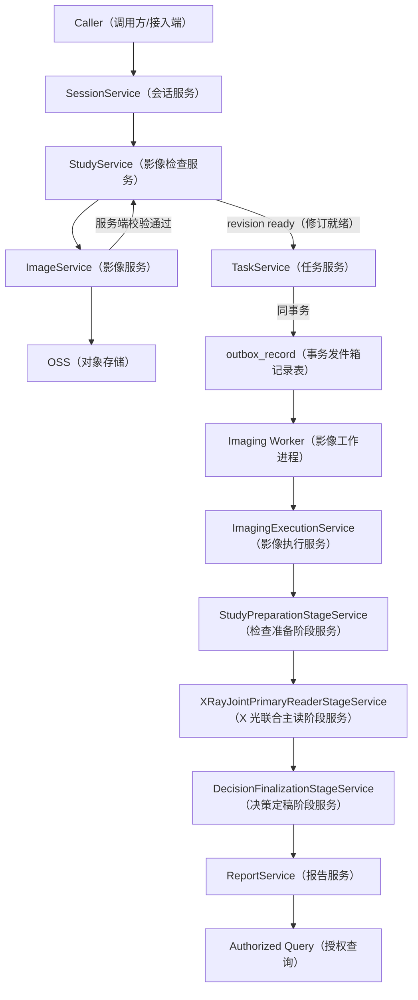
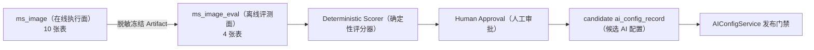

# MS-Image 项目概览与业务链路

状态：`CURRENT_REFACTOR_VIEW / P1_CODE_IMPLEMENTED / P2_PLUS_DESIGNED`（当前重构视图/P1 代码已实现/P2 及后续已设计）
精确设计依据：[设计母文](../ms-image-final-architecture-and-database-design.md)

XRay（X 光）的上传、异步执行、医学分支、失败恢复、表和事务落点集中见
[XRay 详细链路与开发流程图](10-xray-detailed-flow.md)。

## 1. 项目要解决什么

`ms-image`（影像服务）负责兽医影像从会话开始、检查接入、OSS（对象存储）上传、异步 AI（人工智能）分析到不可变报告发布的完整闭环。XRay（X 光）是首个闭环模态，不是数据库表前缀；CT（计算机断层成像）、MRI（磁共振成像）、超声、视频和 WSI（全切片影像）以后复用公共资源与执行底座，但必须分别验证自己的医学链路。

项目的首期目标不是“堆更多模型调用”，而是建立可证明的最短链：

- 输入影像没有丢失、替换或顺序漂移。
- 每次 Provider（AI 服务提供方）调用的 Prompt、Schema、模型和实际发送图像可追溯。
- 重复消息、Worker（异步工作进程）崩溃和结果未知不会产生第二逻辑调用或第二最终报告。
- 正常、异常、AI 无法确定和医学不可诊断都能被准确表达。
- 新链和旧链可以在同病例上做可信 Paired A/B（配对对照实验）。

## 2. 服务边界

`ms-image` 自己拥有：

- Session（影像诊疗会话）、Study（影像检查）、Series（影像序列）和 Image（影像记录）。
- Task（业务任务）、Stage（执行阶段）、Outbox（事务发件箱）和 AI Call（AI 调用）。
- AI Config（AI 配置）和 Report（报告）。
- 自己生成的 OSS 对象引用、执行状态和医学结果来源。

`ms-image` 只保存 opaque ID（不透明标识），不复制：

- 用户、宠物、病历正文、处方、订单、支付、额度和组织等公共业务表。
- 旧 `vet-platform` 的 Shadow/Gray/Active（影子/灰度/正式）路由状态和旧 V2 fallback（降级）结果；目标 Task 的 Active Profile（生效流程配置）与发布选择由 `ControlPlane`（控制面）拥有。
- 旧 V2 fallback（降级）医学结果。

## 3. 目标在线完整主链

下图定义完整目标链路。当前已实现到 P1 的 Session/Study/Series/Image、API、OSS 校验与 Image Outbox/Relay/Worker；Task、Stage、AI、Report 和评测节点尚未实现，目标数据表尚未迁移或做真实运行验证。



链路含义：

1. `SessionService`（会话服务）记录一次影像诊疗业务从何时开始、处理到何时关闭。
2. `StudyService`（检查服务）组织一次检查及其 Series、revision（修订版本）和完整性。
3. `ImageService`（影像服务）签发上传、接收上传完成通知（`complete_upload`）并触发服务端校验；这不是报告交付 callback/ack（回调/确认），且客户端声明或 OSS HEAD 不能直接使影像 ready（就绪）。
4. `TaskService`（任务服务）冻结 Study revision、请求快照、AI Config 和预算，并与首 Stage/Outbox 同事务创建。
5. Outbox Relay（发件箱中继）至少一次发布，Worker 依靠 Stage CAS/lease（阶段比较并设置/租约）幂等执行。
6. Stage Pipeline（阶段流水线）输出唯一医学 owner（所有者）。
7. `ReportService`（报告服务）原子创建不可变报告、切换 Task 当前报告指针并提供授权查询。

## 4. XRay（X 光）最短医学链

默认生产候选 `xray_primary_v1`：

```text
StudyPreparation（检查准备）
-> JointPrimaryReader（联合主读）
-> DecisionFinalization（决策定稿）
-> Report（报告）
```

每一层为什么存在：

| 阶段 | 作用 | 为什么不能删除 | 为什么不继续拆 |
|---|---|---|---|
| StudyPreparation（检查准备） | 冻结原图和 revision，校验完整性、Provider 能力、预算和泄漏 | 不做准备就无法证明模型看到了完整病例 | 组装、工程门禁和 Provider preflight 都依赖同一冻结输入，首期合并可减少无效节点 |
| JointPrimaryReader（联合主读） | 一次读取完整检查，输出完整病例结构化结果 | 它是首期唯一医学判断来源 | 器官或系统分类是输出结构与评测 strata（分层），不是默认多次模型调用 |
| DecisionFinalization（决策定稿） | 校验唯一 owner、Schema、来源和终态，并选择 Primary 为 Final | 分支链需要一个不改判的唯一收口点 | 不调用模型、不做阈值、不渲染报告，防止形成第二医学判断者 |
| Report（报告） | 保存不可变规范结果并控制发布/作废 | Task 状态不能替代完整报告生命周期 | 报告是业务 Service，不伪装成医学 Stage |

## 5. 专项家族应该怎么用

Clinical Family（临床专项家族）不是默认调用数量，也不是数据库分表方式。建议作为：

- Primary 输出中的结构化报告分区。
- 失败样本库和指标的分层维度。
- 候选 TargetedReview（专项复核）的单一问题域。

候选 `xray_targeted_review_v1`：

```text
StudyPreparation
-> JointPrimaryReader
-> FamilyRouting（确定性路由，不调用模型）
-> [证据充分：Primary 直接成为 Final]
   [疑点/冲突/高风险：最多一次 TargetedReview]
-> DecisionFinalization
-> Report
```

它不是默认生产链。只有相对 Primary-only（仅主读）的冻结同病例配对实验同时改善预注册主指标、没有增加异常漏诊、正常误报或覆盖损失，才能申请 Shadow/Gray（影子/灰度）资格。

## 6. 结果语义

| 结果 | 中文含义 | 是否报告终态 |
|---|---|---:|
| `normal` | 未发现要求范围内的异常 | 是 |
| `abnormal` | 发现异常 | 是 |
| `review_required` | AI 无法确定 | 是；首期不自动创建人工复核 |
| `non_diagnostic` | 影像医学上不可诊断 | 是 |
| `not_produced` | 因工程失败没有产生医学结果 | 否；不能伪装成不可诊断 |
| `not_applicable` | 非医学任务不适用医学状态 | 视任务合同 |

## 7. 多模态扩展原则

公共层只统一：

```text
Session -> Study -> Series -> Image
Task -> Stage -> Outbox -> AI Call -> Report
AI Config -> Registry/Profile -> Provider Adapter
```

不统一成 XRay 最低公分母的部分：

- CT/MRI 的 volume、slice、Series/Instance 完整性和 fan-out/fan-in（扇出/汇合）。
- 视频的 frame sampling（帧采样）与时间一致性。
- WSI 的 tile（瓦片）、金字塔层和区域汇合。
- 每个模态的 Prompt、Schema、医学 Stage 和 Holdout（隔离留出集）。

新模态必须先证明公共表可以表达真实样本，再注册自己的 Stage；不得通过往公共表不断追加模态专用列来“兼容”。

## 8. 在线面与评测面



评测面可以运行 paired A/B、Calibration（校准）、Topology/OOD（拓扑/分布外分析）和可选 Harness（离线研究框架），但不能修改线上 Task、Report、Gold（可信金标准）或 Active Config（激活配置）。
