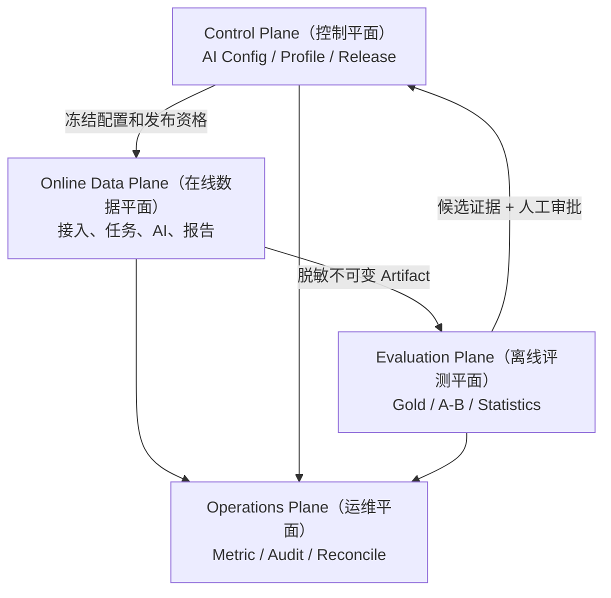

# MS-Image 目标架构

状态：`TARGET_ARCHITECTURE / P1_PARTIALLY_IMPLEMENTED / P2_PLUS_DESIGNED`（目标架构/P1 部分代码已实现/P2 及后续已设计）
精确设计依据：[设计母文第 3、4、8、15 章](../ms-image-final-architecture-and-database-design.md)

## 1. 重构级别

采用 Existing-entry Internal Modular Refactor（保留入口的内部模块化重构）：

- 用户已明确授权代码可以完全重构；现有 `xray_accuracy` 目录、类、内部接口和 Worker 实现都可替换。
- 保留 FastAPI（Web 接口框架）、现有 `app/` 分层、`DalBase`（数据访问基类）、OSS、Provider adapter（服务适配器）、Celery/Broker（异步执行/消息代理）和 Outbox 可靠性思想。
- 重做 XRay 专属 ORM（对象关系映射）、通用领域模型、Stage 合同和医学最短链。
- 不建立第二套 Repository（仓储层）、DatabaseService（数据库服务）、CRUDBase 或工作流运行时。
- 完全重构表示内部实现自由，不表示可以跳过外部兼容、数据迁移、回滚、分阶段验证或唯一事实 owner。

## 2. 四个平面



| 平面 | 拥有的事实 | 不允许拥有 |
|---|---|---|
| Control Plane（控制平面） | 配置 revision、Profile、资格、Active Slot 和发布指纹 | 单次 Task 医学结果 |
| Online Data Plane（在线数据平面） | 资源、任务、阶段、调用和报告 | Gold、Holdout 标签和实验胜负 |
| Evaluation Plane（评测平面） | 冻结数据集、Gold、运行、指标和实验 Artifact | Active Config、线上 Task/Report |
| Operations Plane（运维平面） | 日志、指标、追加审计、对账和删除证明 | 医学 verdict（结论） |

## 3. 分层架构

```text
API -> Service -> Entity DAL(DalBase) -> Model/MySQL
Worker -> Service -> Entity DAL(DalBase) -> Model/MySQL
Service -> Core Gateway -> OSS/Broker/Provider（事务外）
ImagingExecutionService -> StageRegistry -> Stage Service
```

边界规则：

- API（接口层）只做路由、参数、依赖注入、鉴权和响应包装。
- Service（业务服务层）拥有业务校验、状态机、事务和多 DAL 编排。
- CRUD/DAL（数据访问层）继承 `app.core.crud.DalBase`，不拥有 HTTP 语义。
- Model（模型层）只定义 ORM、字段、索引和约束。
- Schema（结构层）只定义请求、响应和边界校验。
- Worker 只调用 Service，不直接拼 SQLAlchemy 查询。
- 外部 OSS/Broker/Provider I/O 不得发生在数据库事务内。

## 4. 目标代码结构

```text
app/
├── api/
│   ├── api_v1/endpoints/
│   │   ├── sessions.py
│   │   ├── studies.py
│   │   ├── images.py
│   │   ├── tasks.py
│   │   └── reports.py
│   └── admin_v1/endpoints/
│       ├── ai_configs.py
│       ├── reports.py
│       └── evaluations.py
├── models/       一张目标表一个 ORM
├── schemas/      Create/Update/Query/Response
├── crud/         一张核心实体一个 XxxDal
├── service/
│   ├── *_service.py
│   └── stages/
│       ├── base.py
│       ├── registry.py
│       ├── common/
│       └── xray/
└── core/
    ├── imaging/
    ├── ai/
    └── messaging/
workers/
├── imaging_worker/
├── outbox_relay/
└── evaluation_worker/
```

这只是目标模块映射，不表示这些文件已经存在。当前代码仍主要位于 `app/models/xray_accuracy/`、`app/crud/xray_accuracy/`、`app/service/xray_accuracy/` 和 `workers/xray_accuracy_worker/`。

## 5. 模块与表不需要同名

Service 名称表示业务能力，表名称表示持久化事实，二者不应机械一一对应。例如：

- `StudyService`（检查服务）编排 `study_record`、`series_record` 和部分 `image_record`。
- `ImagingExecutionService`（影像执行服务）编排 `task_record`、`stage_checkpoint_record`、`outbox_record`、`ai_call_record` 和 `report_record`。
- `ReportService`（报告服务）写 `report_record`，同时以事务更新 `task_record.current_report_id`。

强行让“一个 Service 对应一张表”会把跨实体业务事务拆散；反过来，一个万能 Service 会让状态 owner 模糊。边界按业务用例和事务决定。

## 6. 事务边界

必须同事务：

- Task + 首 Stage + 首 Outbox 创建。
- Image `uploading -> validating` + 校验 Outbox 创建。
- Stage 成功 + accepted Call + 下一 Stage/Outbox 推进。
- DecisionFinalization + Report 创建 + Task 终态/current pointer。
- Report 作废 + Task current pointer 清空或切换。

必须拆成多个短事务：

```text
claim/prepare transaction
-> commit
-> OSS/Broker/Provider network I/O
-> result CAS transaction
```

任何 Service 在事务内等待外部网络，都可能扩大锁、重复调用或迟到覆盖风险。

## 7. 可靠异步模型

| 对象 | 唯一拥有的状态 | 恢复方式 |
|---|---|---|
| Task（任务） | 整体工程和医学状态 | `state_version` CAS |
| Stage（阶段） | 单节点执行、lease 和结果 | owner + generation + version |
| Outbox（事务发件箱） | DB 到 Broker 发布状态 | relay lease、重试、publisher confirm |
| AI Call（AI 调用） | Provider 请求和结果不确定性 | logical key、idempotency key、unknown reconcile |
| Report（报告） | 规范结果版本和发布/作废状态 | revision + current pointer CAS |

Broker 至少一次投递，不承诺 exactly-once（恰好一次）。幂等事实在数据库，不在消息系统。

## 8. Stage（阶段）架构

`StageRegistry`（阶段注册表）精确解析 `handler_key + handler_version`；`PipelineProfileValidator`（流水线配置校验器）只校验代码内置固定 Profile（配置档案），并生成规范执行图摘要。

首期禁止：

- 数据库存 Python import path（导入路径）。
- `latest`（最新）版本解析。
- 任意用户拖拽 DAG。
- Stage 自行 commit、发 Outbox 或决定任意下一节点。
- 运行中 Task 热切换 Config 或 handler。

只有两个以上已资格化生产 Profile 确实需要不同拓扑时，才重新评审通用 DAG Compiler（流水线编译器）。

## 9. 安全与访问

- 目标表不设计 `tenant_id`（租户标识）；资源 ID 全局唯一。
- 删除目标表的 `tenant_id` 不等于删除认证：旧 tenant claim 暂作兼容访问范围；目标 owner 由可信 subject/service identity、scope 和资源归属共同校验，请求参数不得覆盖。
- 用户、服务、管理和评测身份使用不同 scope（权限作用域）。
- 资源归属在 Service/DAL 查询中校验；越权查询应使用稳定“不存在”语义，避免枚举。
- Secret（密钥）只保存 Secret Manager 引用；不能进入 DB JSON、日志、Task、Call 或 Artifact。
- signed URL（签名地址）只短期生成，不落库。
- 新 OSS key 使用领域 owner/image/version；旧 tenant 派生 key 只在现有网关内兼容读取，不新建第二套网关或盲目改写对象。
- DICOM 标签、Prompt 输入和 Artifact 必须使用白名单脱敏。

## 10. 当前不是目标架构的内容

- 现有 10 张 `xray_accuracy_*` 隔离表不是目标在线十表。
- 现有 5 张 AI runtime（AI 运行配置）旧表不是目标 `ai_config_record`。
- 当前 `TechnicalExecutor` 只支持 `request_gate`，不代表 Stage Registry 已实现。
- 当前 TraceEvent（追踪事件）在外部 AuditSink 验证前不能删除。
- 当前 Provider qualification（服务资格验证）仍有阻断，不代表真实医学链可上线。
