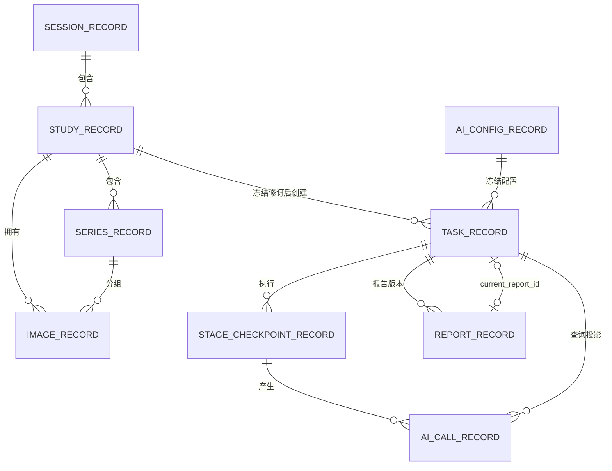
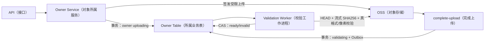
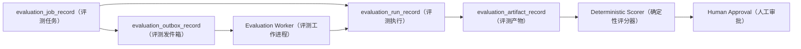

# MS-Image 数据库与 OSS 设计导航

状态：`PROPOSED_SCHEMA`（候选结构，尚未建表）
目标在线数据库：`ms_image`（影像在线数据库）
目标评测数据库：`ms_image_eval`（影像评测数据库）
精确字段依据：[设计母文第 5、6、14 章](../ms-image-final-architecture-and-database-design.md)

本文解释表为什么存在、如何关联和 OSS（对象存储）放在哪里。建模或实现时必须回到设计母文逐字段核对，不能只按本文摘要生成 ORM 或 DDL（数据定义语句）。

## 1. 通用建表规则

- 每张物理 MySQL 表都有独立、非空、服务端生成的 `id VARCHAR(64)` 单列主键。
- 业务 ID、请求 ID、版本号、hash（摘要）和联合 `UNIQUE`（唯一约束）不能替代主键。
- 不声明 Foreign Key（数据库外键）；Service/DAL（业务服务/数据访问层）校验逻辑关联。
- 不使用数据库 Enum（枚举）；状态和类型使用带中文候选值注释的 `VARCHAR`。
- 目标表不设计 `tenant_id`（租户标识）。
- `tenant_id` 不落目标表，但认证与资源授权必须保留；旧 tenant claim 仅作兼容访问范围，目标 owner 由可信 identity/scope/资源归属校验。
- 所有 ORM 字段 `comment` 同时写 SQL 类型和中文用途。
- 时间统一 UTC，使用 `DATETIME(6)`。
- JSON 只保存经过版本化 Schema（结构合同）验证的内容，不充当无限 metadata（元数据）桶。

## 2. 在线 10 表

| 表 | 中文用途 | 唯一拥有的事实 | 主要逻辑关联 |
|---|---|---|---|
| `session_record` | 会话记录表 | 一次影像诊疗会话的生命周期 | 1:N Study |
| `study_record` | 影像检查记录表 | 一次检查、模态、当前 revision 和完整性 | N:1 Session，1:N Series/Task |
| `series_record` | 影像序列记录表 | Study 内分组和当前影像清单摘要 | N:1 Study，1:N Image |
| `image_record` | 影像记录表 | 原始/派生影像的版本、OSS ObjectRef 和技术状态 | N:1 Study/Series |
| `task_record` | 任务记录表 | 冻结请求、预算、整体工程状态、AI 医学状态和当前报告指针 | N:1 Study，1:N Stage/Report |
| `stage_checkpoint_record` | 阶段检查点记录表 | 单个 Stage 的执行、lease、输入输出和 accepted Call | N:1 Task，1:N AI Call |
| `outbox_record` | 事务发件箱记录表 | 业务事实到 Broker 的可靠发布 | polymorphic aggregate（多态聚合） |
| `ai_config_record` | AI 配置记录表 | 不可变 Prompt/Schema/model/provider/pipeline Release | 1:N Task |
| `ai_call_record` | AI 调用记录表 | 一次逻辑 Provider 请求及实际发送/回执/结果 | N:1 Stage/Task |
| `report_record` | 报告记录表 | 不可变报告 revision、医学内容、来源和发布状态 | N:1 Task |

## 3. 在线表关系图



图中是逻辑关系，不生成 Foreign Key。Outbox 使用 `aggregate_type + aggregate_id + aggregate_version` 指向 Image、Stage 或 Call，因此不画成固定外键边。

## 4. 每张表为什么不能随意合并

| 候选合并 | 为什么不合并 |
|---|---|
| Session + Study | 会话可包含多次检查，开始/关闭和检查完整性不是同一生命周期 |
| Study + Series + Image | CT/MRI 多序列、XRay 补图和 Image 版本链需要独立查询与 CAS |
| Task + Stage | Task 表示整体业务状态，Stage 表示可恢复节点；一个 Task 有多个 Stage |
| Stage + AI Call | 准备、路由、定稿 Stage 不调用模型；模型 Stage 又可能有 transport retry/repair |
| Task + Outbox | Broker 发布租约和重试不属于业务任务状态 |
| AI Config + AI Call | Config 是不可变发布包，Call 是一次运行事实 |
| Task + Report | 工程/医学状态与报告 revision/发布/作废生命周期正交 |

反面条件：如果实施后某表没有独立生命周期、独立查询、独立状态或事务意义，应带真实证据重新评审合并，不能因为“文档写了 10 张”永久保留。

## 5. 精确字段合同入口

| 表 | 精确字段、索引和状态章节 |
|---|---|
| `session_record`（会话记录表） | [母文 6.1](../ms-image-final-architecture-and-database-design.md#61-session_record会话记录) |
| `study_record`（影像检查记录表） | [母文 6.2](../ms-image-final-architecture-and-database-design.md#62-study_record影像检查记录) |
| `series_record`（影像序列记录表） | [母文 6.3](../ms-image-final-architecture-and-database-design.md#63-series_record影像序列记录) |
| `image_record`（影像记录表） | [母文 6.4](../ms-image-final-architecture-and-database-design.md#64-image_record影像记录) |
| `task_record`（任务记录表） | [母文 6.5](../ms-image-final-architecture-and-database-design.md#65-task_record任务记录) |
| `stage_checkpoint_record`（阶段检查点记录表） | [母文 6.6](../ms-image-final-architecture-and-database-design.md#66-stage_checkpoint_record阶段检查点记录) |
| `outbox_record`（事务发件箱记录表） | [母文 6.7](../ms-image-final-architecture-and-database-design.md#67-outbox_record事务发件箱记录) |
| `ai_config_record`（AI 配置记录表） | [母文 6.8](../ms-image-final-architecture-and-database-design.md#68-ai_config_recordai-配置记录) |
| `ai_call_record`（AI 调用记录表） | [母文 6.9](../ms-image-final-architecture-and-database-design.md#69-ai_call_recordai-调用记录) |
| `report_record`（报告记录表） | [母文 6.10](../ms-image-final-architecture-and-database-design.md#610-report_record报告记录) |
| 字段删除与保留理由 | [母文 6.0 字段最小化](../ms-image-final-architecture-and-database-design.md#60-字段最小化结论) |

实现者必须逐表确认：主键、非空、默认值、唯一约束、查询索引、状态候选、ObjectRef 完整组、CAS/lease 字段和 exactly-one（严格二选一）合同。

## 6. 状态唯一所有权

```text
task_record.execution_status       = 整体工程执行状态
task_record.ai_medical_status      = 最终 AI 医学状态
stage_checkpoint_record.status     = 单阶段技术执行状态
outbox_record.publish_status       = Broker 发布状态
ai_call_record.status              = Provider 调用状态
report_record.status               = 报告持久化/发布/作废状态
```

禁止推导错误：

- Outbox `published` 不等于 Stage 完成。
- Stage `completed` 不等于 Task 已发布报告。
- AI Call `succeeded` 不等于其结果已被接受。
- Task `completed` 不等于 Report 一定 `published`，要结合 `report_required` 和 current pointer。
- 技术失败必须使医学状态为 `not_produced`，不能写成模型 `non_diagnostic`。

## 7. OSS（对象存储）设计

### 7.1 为什么没有 file_asset（文件资产表）

公共文件表会把“谁拥有对象、谁能删除、保留多久、对象缺失时谁失败”集中成万能抽象，反而让业务事实不清楚。当前规则：

- 原始和派生影像：`image_record`（影像记录表）拥有。
- Task 大请求快照：`task_record`（任务记录表）拥有。
- Stage 大输入/输出：`stage_checkpoint_record`（阶段检查点记录表）拥有。
- Provider 大响应或解析结果：`ai_call_record`（AI 调用记录表）拥有。
- 报告渲染产物：`report_record`（报告记录表）拥有。
- 评测数据集、Gold 和结果：`evaluation_artifact_record`（评测产物记录表）拥有。

### 7.2 ObjectRef（对象引用）完整组

```text
storage_profile（存储配置标识）
object_key（对象键）
object_version_id（对象版本，可空）
sha256（内容摘要）
size_bytes（字节数）
content_type（MIME 类型）
kms_key_version（加密密钥版本，可空）
```

只保存 `object_key` 或 URL 不构成完整对象引用。signed URL 只能按权限短期生成，不能持久化。

### 7.3 对象链路



客户端 SHA、OSS ETag 或 HEAD 单独都不能使 Image ready。原 DICOM（医学影像格式）应保留；发送给 Provider 的 PNG/JPG 派生字节使用独立 sent hash，并保留 source-to-sent lineage（来源到发送链）。

### 7.4 删除与对账

```text
DB owner -> OSS：对象是否存在、version/size/hash 是否一致
OSS -> DB owner：inventory 中是否存在无 owner 的孤儿对象
```

删除前检查 retention（保留期）、legal hold（法律保留）、非拥有引用和 current Report/Task 依赖；删除证明写入外部 AuditSink（审计接收端）。未验证 AuditSink 时禁止不可恢复删除。

## 8. 隔离评测 4 表

| 表 | 中文用途 | 不应承载 |
|---|---|---|
| `evaluation_job_record` | 评测任务记录表；预注册假设、数据、指标、审批和租约 | 单次执行输出明细 |
| `evaluation_outbox_record` | 评测事务发件箱记录表 | Job 或 Run 状态 |
| `evaluation_run_record` | 评测执行记录表；control/candidate/scorer/calibration/topology/harness 一次执行 | 实验最终胜负 |
| `evaluation_artifact_record` | 评测产物记录表；数据集、Gold、病例结果、指标和模型等不可变对象索引 | 在线 Task/Report |

精确字段见[母文 14.1](../ms-image-final-architecture-and-database-design.md#141-评测控制面表结构独立-ms_image_eval)。



## 9. 表演进策略：允许按必要性新增

在线 10 表和评测 4 表是当前候选基线，不是硬上限。新增表不需要等待“表数量不够”，而需要证明
现有 owner（所有者）无法稳定承载新事实。满足下列任一实质条件即可发起拆表或增表评审：

- 出现独立业务 owner、创建/关闭命令或生命周期。
- 出现独立状态机、lease/CAS、重试或恢复边界。
- 出现高频独立查询、索引或分页需求，继续放在 JSON 会导致扫描和权限问题。
- 必须与其他事实独立提交、独立回滚或保持不可变历史。
- 出现独立访问控制、数据保留、legal hold（法律保留）或法规逐行审计。
- 同一事实被多个表重复保存，拆出唯一 owner 能消除双写。

新增表必须同时说明表名、中文用途、主键、owner、写入者、读取者、状态、事务、索引、保留策略、
与现有表的逻辑关系、迁移和回滚。仅以“以后可能需要”“字段看起来很多”或“一张表对应一个 Service”
为理由，不足以新增。

| 触发证据 | 才评审增加 |
|---|---|
| 每次 Worker Attempt（工作进程尝试）必须独立长期查询 | `task_attempt_record`（任务尝试记录表） |
| 无 Task 的历史 Study revision 也必须长期查询 | `study_revision_record`（检查修订记录表） |
| Finding（影像发现）需要跨报告检索、标注和统计 | `finding_record`（影像发现记录表） |
| 法规要求所有状态 append-only（仅追加） | `event_record`（事件记录表）或已资格化外部 AuditSink |
| 形成真实人工领取、SLA、裁决和回写业务 | 单独人审 ADR（架构决策）重新推导，不在现表预留 |
| Prompt/Schema/Provider Connection（提示词/结构/服务连接）形成独立审批、复用和发布生命周期 | 拆分 AI 配置治理表 |
| 专家标注形成多人领取、逐病例编辑、分歧仲裁和法规逐行审计 | 在 `ms_image_eval` 增加 annotation/expert-read（标注/专家读片）专用表 |
| Evaluation Artifact（评测产物）无法满足逐病例高频检索、权限或交互性能 | 增加 case-result/index（病例结果/索引）专用表 |

这些只是触发示例，不是预先承诺的未来表清单。满足必要性时可以增加一张或多张表；同样，真实实现
证明某张基线表没有独立事实时也允许合并。

## 10. 建模评审清单

- [ ] 每张表确有独立 owner、生命周期和查询。
- [ ] 所有关系由 Service/DAL 校验且无 Foreign Key。
- [ ] 无 Enum、无 `tenant_id`、无公共 `file_asset`。
- [ ] 去掉 `tenant_id` 后未削弱认证；新 OSS key 不再 tenant 派生，旧 key 仅由现有网关兼容读取。
- [ ] 状态只在唯一 owner 表保存一次。
- [ ] JSON/对象二选一，不保存两份内容。
- [ ] 所有 ObjectRef 字段组完整。
- [ ] 不迁明文 Secret、URL、raw Prompt 或未脱敏响应。
- [ ] 新字段能说明写入者、读取者、不可推导性、索引和删除策略。
- [ ] 所有目标表仍标注 `NOT IMPLEMENTED`，直到真实 schema Artifact 证明落地。
