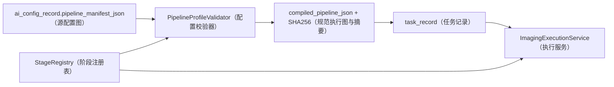
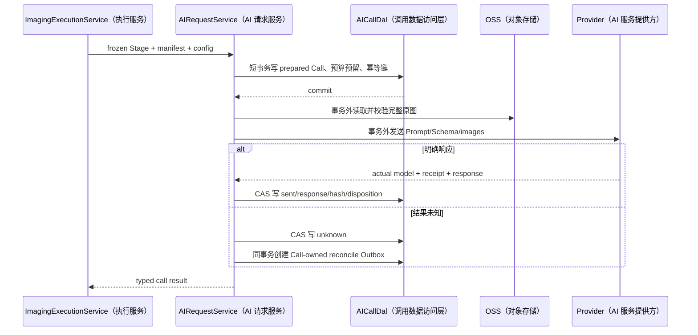

# MS-Image Service 与 Stage 设计

状态：`PROPOSED_SERVICE_CONTRACT`（候选服务合同，尚未实现）
精确设计依据：[设计母文第 4、8、15 章](../ms-image-final-architecture-and-database-design.md)

各 Service（业务服务）在 XRay（X 光）端到端流程中的顺序、事务和失败分支集中见
[XRay 详细链路与开发流程图](10-xray-detailed-flow.md)。

## 1. Service 和 Stage 的区别

- Service（业务服务）围绕业务用例、状态机和事务编排，可调用多个 DAL。
- Stage Service（阶段服务）是 `ImagingExecutionService` 内部的版本化计算节点，只接收冻结上下文并返回类型化结果。
- Registry/Gateway/Relay（注册表/网关/中继）是基础组件，不应为了名称统一扩成业务 Service。
- 首期 Stage 都在同一代码库、同一 Service 层中运行，不默认拆成网络微服务。

## 2. 在线 8 个业务 Service

| Service（业务服务） | 中文用途 | 为什么存在 | 主要表 |
|---|---|---|---|
| `SessionService` | 会话服务 | 会话开始、关闭、取消、幂等和 CAS 有独立业务生命周期 | `session_record` |
| `StudyService` | 影像检查服务 | 管理 Study/Series/revision、完整性和 ready 门禁 | `study_record`、`series_record`、`image_record` |
| `ImageService` | 影像服务 | OSS 上传、校验、版本替换、对象对账和隔离需要统一 owner | `image_record`、`outbox_record` |
| `TaskService` | 任务服务 | 冻结请求、Config、预算、运行模式和首执行事务 | `task_record`、`stage_checkpoint_record`、`outbox_record` |
| `ImagingExecutionService` | 影像执行服务 | 统一 Stage claim/lease/CAS、路由、恢复、取消和最终原子完成 | Task/Stage/Outbox/Call/Report |
| `AIConfigService` | AI 配置服务 | 校验不可变 Release、唯一 Active Slot、激活和回滚 | `ai_config_record` |
| `AIRequestService` | AI 请求服务 | 渲染 Prompt/Schema、预算、Provider 调用、receipt 和 unknown reconcile | `ai_call_record`、Stage/Outbox |
| `ReportService` | 报告服务 | 创建不可变报告、切换 current pointer、发布/作废和授权查询 | `report_record`、`task_record` |

## 3. 每个 Service 的输入、输出和失败边界

### 3.1 SessionService（会话服务）

- 输入：可信身份、上游病历 opaque ID、幂等键和开始命令。
- 输出：Session ID、状态和版本。
- 校验：资源归属、重复请求一致性、关闭后禁止新增 Study。
- 不负责：宠物/病历正文、影像上传和诊断。

### 3.2 StudyService（影像检查服务）

- 输入：Session ID、模态、Series 计划、完成/修订命令。
- 输出：Study revision、完整性状态和冻结 manifest 摘要。
- 校验：所有必需 Series ready、影像数量/顺序/UID/manifest 一致。
- 失败关闭：任一必需影像 invalid/missing 时 Study 不得 ready。

### 3.3 ImageService（影像服务）

- 输入：Study/Series、逻辑影像键、上传方式、对象声明。
- 输出：上传凭证、Image 状态、完整 ObjectRef 和新 revision 触发。
- 校验：权限、object namespace、大小、MIME、真实格式、像素、SHA256 和版本。
- 不负责：从影像内容推断医学结论。

### 3.4 TaskService（任务服务）

- 输入：ready Study revision、task type、幂等键、受信 run mode。
- 输出：冻结 Task、首 Stage 和 Outbox。
- 原子性：三者同事务；Config、请求快照和预算创建后不可变。
- 不负责：同步调用 Provider 或生成报告。

### 3.5 ImagingExecutionService（影像执行服务）

- 输入：版本化 Worker message、Stage ID 和 lease owner。
- 输出：Stage 结果、下一 Stage/Outbox 或最终 Task/Report。
- 校验：Task 非终态、handler 可精确解析、输入 hash、lease generation、预算和 route signal。
- 失败关闭：迟到、租约丢失、Targeted 调用失败或 source 不一致不能静默回退。

### 3.6 AIConfigService（AI 配置服务）

- 输入：Prompt/Schema/model/provider/pipeline bundle（配置包）、资格 Artifact 和发布命令。
- 输出：draft/validated/active/retired（草稿/已校验/已激活/已退役）Config revision。
- 校验：固定 Profile、精确 handler、Schema binding、强制门禁、唯一 Final owner、预算和 Secret ref。
- 激活：旧 Active 与新候选双边 CAS，同槽最多一个 Active。

### 3.7 AIRequestService（AI 请求服务）

- 输入：冻结 Stage、AI Config、图像 manifest 和逻辑调用键。
- 输出：prepared/sent/succeeded/unknown/failed（已准备/已发送/成功/未知/失败）的 AI Call。
- 外部 I/O：所有 Provider 调用必须在 DB 事务外。
- 重试：transport 可有界重放原逻辑 Call；医学结果“不满意”不能自动重试。

### 3.8 ReportService（报告服务）

- 输入：唯一 selected owner（选定所有者）的 accepted Stage/Call 和规范内容。
- 输出：不可变 Report revision、current pointer 和授权查询结果。
- 校验：Task 医学状态、decision、source Stage/Call、content hash 和 revision 一致。
- 不负责：修改模型结论或启动人工复核。

## 4. 5 个目标 Stage Service

| Stage Service（阶段服务） | 分类 | 模型调用 | 中文用途 |
|---|---|---:|---|
| `StudyPreparationStageService` | 公共 | 否 | 加载冻结 Study revision/原图并执行完整性、能力、预算和泄漏预检 |
| `XRayJointPrimaryReaderStageService` | XRay 专项 | 是 | 基于完整检查生成 X 光主读完整候选结果 |
| `XRayFamilyRoutingStageService` | XRay 专项实验 | 否 | 根据冻结规则选择 Primary 直接定稿或一次专项复核 |
| `XRayTargetedReviewStageService` | XRay 专项实验 | 是 | 对一个选定临床家族执行一次补充读片并输出完整病例结果 |
| `DecisionFinalizationStageService` | 公共 | 否 | 选择并校验唯一医学 owner；不调用模型、不改判、不 commit |

默认 `xray_primary_v1` 只执行第 1、2、5 个。第 3、4 个只成对存在于 `xray_targeted_review_v1`，在 paired gate（配对门禁）前仅允许 validation-only/shadow。

## 5. Stage 最小合同

```text
StageDefinition（阶段定义）
  handler_key / handler_version
  input_schema_version / output_schema_version
  modality / task_type / max_ai_calls / timeout_budget

StageContext（阶段上下文）
  task/study/config frozen refs
  exact input hash
  lease owner/generation/state version
  allowed services and budget

StageResult（阶段结果）
  result_code
  typed output or ObjectRef
  output hash
  accepted_call_id（可空）
  whitelist route_signal（白名单路由信号）
```

Stage Service 禁止：

- 直接 commit/rollback 数据库事务。
- 直接推进 Task 终态或创建 Report。
- 返回任意代码路径作为下一节点。
- 读取 Gold、Failure Bank、历史标签或未授权资源。
- 用 Python 阈值、投票或 fallback 改写 normal/abnormal。

## 6. StageRegistry 与 Profile Validator



Config 激活前校验：handler 精确存在、版本兼容、输入输出 Schema 对接、无环、无孤儿节点、所有路径到终点、强制门禁不被绕过、恰好一个候选 Final owner、调用和 deadline 预算不超限。

## 7. Service 与表访问矩阵

| Service | 主写表 | 只读/辅助表 | 外部依赖 |
|---|---|---|---|
| SessionService | Session | 无 | AuditSink |
| StudyService | Study、Series | Image、Session | AuditSink |
| ImageService | Image、Outbox | Study、Series | ObjectStorageGateway、AuditSink |
| TaskService | Task、Stage、Outbox | Study、Series、Image、AI Config | AuditSink |
| ImagingExecutionService | Task、Stage、Outbox、Report | AI Call、Config、Study/Image | StageRegistry、AuditSink |
| AIConfigService | AI Config | Evaluation approval refs | Validator、Provider Registry、Secret Manager |
| AIRequestService | AI Call、Outbox | Stage、Task、Config、Image | Provider Client、OSS、AuditSink |
| ReportService | Report、Task current pointer | Stage、AI Call | OSS render、AuditSink |

所有实体写入都必须经对应 XxxDal（实体数据访问层）和 `DalBase`；矩阵不是授权 Service 直接操作 ORM session。

## 8. 一次 Provider 调用的详细顺序



## 9. 家族分类的正确位置

家族不是数据库表族，也不应默认等于一次模型调用。建议 Primary Schema 输出：

```text
clinical_family（临床家族）
anatomy/region（解剖部位）
observation（观察）
normality（正常性）
confidence_raw（原始置信信息，不当作校准概率）
limitations（限制）
source_image_refs（来源影像引用）
```

家族用于报告组织、失败归因、分层评测和候选专项复核。犬/猫、器官系统和任务类型应是正交字段，不再拼接成不可治理的长配置名称。

## 10. 何时才拆网络微服务

默认不拆。只有经过测量出现以下证据才评审：

- 独立 GPU/运行时/依赖隔离。
- 明确独立扩缩容曲线。
- 不同安全域或数据驻留要求。
- 独立 SLA、部署节奏和故障隔离确有收益。

拆分后仍复用同一 Stage 合同、版本和幂等语义；网络服务不能获得新的医学 owner 或数据库直写权限。
