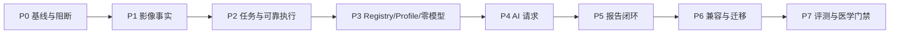

# MS-Image 重构、迁移与验证计划

状态：`PROPOSED_PLAN`（候选计划，未授权执行迁移）
本文不创建迁移脚本、测试脚本，不修改数据库。

## 1. 当前事实与目标

| 范围 | 当前已确认 | 目标 | 处理 |
|---|---|---|---|
| ORM | 5 张旧 AI 配置表 + 10 张 `xray_accuracy_*` 表 | 当前基线为在线 10 表 + 评测 4 表；必要时按准入证据增表 | 语义重建，不逐表照搬 |
| 业务根 | XRaySession/XRayRun | Session/Study/Task，XRay 仅为模态 | 重构 |
| Stage | `TechnicalExecutor` 只支持 `request_gate` | 5 个注册 Stage Service | 分阶段实现 |
| Provider | 已有 adapter、receipt、hash 和资格骨架 | 完整 requested/sent/unknown/budget 合同 | 保留并补齐 |
| 异步 | Outbox、lease、CAS 骨架存在 | 通用 Image/Stage/Call 恢复链 | 复用语义 |
| Report | 目标闭环未实现 | 不可变 Report + current pointer | 新增 |
| 评测 | 无统一 4 表控制面 | Job/Outbox/Run/Artifact | 独立实现 |
| 医学链 | 真实准确率未闭环 | Primary-only 基线，Targeted 仅实验 | 先建立基线 |

## 2. 推荐顺序

用户允许完全重构代码，因此每个 Phase（阶段）可以替换现有模块而不是在旧类上打补丁；但仍按阶段
交付和验证，不能一次同时改变数据库、执行拓扑、Provider、Prompt 和报告后再整体排错。



### P0 基线与阻断

关闭 Secret、事务、认证、Broker、进程边界和证据新鲜度阻断。禁止先重写所有代码再回头补可靠性。

完成证据：

- 干净可追溯代码基线和依赖锁。
- API/Admin/Worker 启动与 readiness（就绪）边界。
- Secret 外置和旧 Key 轮换/泄漏扫描。
- 外部 I/O 不在数据库事务内。
- Broker/Worker 重启演练和稳定 Artifact 签名。

### P1 影像事实

P1 按依赖顺序拆成三个可核验子切片：

```text
P1A Session/Study/Series/Image Model + Schema + DAL + Service
P1B API + dependency injection + route registration
P1C ObjectStorageGateway + Image validate Outbox/Relay/Worker + reconcile/revision
```

P1C 不是 P2 的提前实现，而是 Image 生命周期闭环所需的最小可靠执行边界：
`Image uploading -> validating` 与 `outbox_record(validate_image)` 同事务；OSS HEAD、流式 hash、真实格式
校验在事务外；通过后才 ready，失败进入 quarantined。只完成 P1A 不得宣称模块已闭环。

使用真实 XRay 样本验证补图、替换、revision 和 DICOM/PNG/JPG；没有真实样本授权时只能标记未验证。

门禁：对象缺失、hash 漂移、孤儿、回调丢失和 revision 冲突都能 fail closed（失败关闭）。

### P2 任务与可靠执行

复用 P1C 的同一 Outbox/Relay 实现并扩展到 Task/Stage/Call；实现 Task + first Stage + Outbox 同事务、
relay 发布、Stage claim/heartbeat/recovery 和取消。不得为任务执行新建第二套中继、队列或事实源。

门禁：重复消息、发布确认空窗、relay/Worker 崩溃、lease 过期和迟到结果不会产生第二 Final。

### P1 无外部授权时的状态口径

本轮授权不包含迁移脚本、新建测试脚本、真实数据库操作或真实样本故障演练时，P1 最多只能结束为：

```text
CODE_IMPLEMENTED（代码已实现）
NOT_MIGRATED（未迁移）
NOT_RUNTIME_VALIDATED（未做真实运行验证）
```

静态检查、已有测试或 mock/replay 通过不能把 G4 OSS/revision 标为通过；只有真实对象、服务端流式
hash/格式校验、替换/补图和失败恢复演练完成后，才能提升对应运行门禁。

### P3 Registry/Profile 与零模型链

实现 StageDefinition/Context/Result、显式 StageRegistry、固定 Profile Validator 和 `xray_primary_v1` 零模型 Stub/Replay。

门禁：同 Config/handler/input 得到相同 Stage 顺序和 hash；旧 Task 引用的精确版本仍可解析。

### P4 AI 请求

实现不可变 AI Config、prepared Call、预算、requested/sent/ack、actual model、Schema、unknown reconcile。

门禁：结果未知不会新建第二逻辑请求，真实发送集合与报告来源可追溯。

### P5 报告闭环

实现 Primary -> DecisionFinalization -> immutable Report -> Task current pointer 原子完成。

门禁：normal/abnormal/review_required/non_diagnostic 和 technical failure 完全区分，唯一 Final owner 可证明。

### P6 兼容与迁移

旧 API 作为 Compatibility Adapter（兼容适配器），不拥有新事实。先 shadow read（影子读取）和语义核对，再申请受控数据迁移。

禁止：

- 直接 rename/drop 旧表。
- copy-all 迁移所有旧字段。
- 迁入 `tenant_id`、Secret、URL、raw Prompt、旧 fallback 结果。
- 未审批生产双写。

### P7 评测与医学门禁

实现隔离 4 表、数据集/Gold/split Artifact、paired control/candidate、deterministic scorer、两个分母、统计和人工审批。

Targeted Review、校准、拓扑和 Harness 在此阶段作为独立实验，不阻塞 Primary-only 工程闭环。

## 3. 旧表语义归宿

| 当前/历史事实 | 目标归宿 | 迁移原则 |
|---|---|---|
| XRay session/run | Session/Study/Task | 按业务语义拆分，不保留 XRay 前缀 |
| request/study snapshot | Task request snapshot + Study revision manifest | 规范化并重新算 hash |
| image asset | Image | 校验真实 OSS 对象后迁移；URL 不迁 |
| stage checkpoint | Stage checkpoint | 映射稳定状态和版本，清除重复字段 |
| model call | AI Call | 只迁安全事实/hash，不迁 Secret 和未脱敏原文 |
| outbox | Outbox | 只迁仍需恢复的有效事件；历史发布日志归档 |
| trace event | AuditSink 或条件 event_record | 外部审计未验收前保留旧事实 |
| 旧 AI 五表 | AI Config | 重建不可变配置包，Secret 仅引用 |
| 分片 report content | Report content_json | 聚合成不可变完整 revision |
| 公共用户/宠物/病历 | 不迁 | 只保存上游 opaque ID |

## 4. 迁移前必须产出的设计物

- 源表逐字段 profile（数据分布、空值、重复、状态和敏感性）。
- 旧状态到新字符串状态的逐值映射。
- 主体 ID、逻辑关系和全局唯一策略。
- OSS 对象 inventory、hash、版本和 owner 对账。
- 数据清洗、拒绝、隔离和不可迁移规则。
- 双读/影子校验方案；只有批准后才讨论双写。
- 回切边界、兼容期限和旧表只读/归档/删除条件。
- 每批迁移 manifest 和 digest，不按“脚本没报错”验收。

## 5. 工程验证矩阵

| Gate（门禁） | 必须证明 | 失败动作 |
|---|---|---|
| G0 基线 | Secret、事务、身份、进程和证据可追溯 | 不接真实 Provider |
| G1 表边界 | 当前批准的全部表（基线 10+4）有独立 owner/主键，无 FK/Enum/tenant、中文注释和 ObjectRef 完整；新增表有准入证据 | 停止实现 |
| G2 状态 owner | Task/Stage/Outbox/Call/Report 无双写 | 回到模型评审 |
| G3 多模态资源 | XRay/CT/MRI 真实样本可由 Study/Series/Image 表达 | 不为模态另建数据库 |
| G4 OSS/revision | 对象、hash、order、UID、revision 可对账 | Study 不得 ready |
| G5 投递 | DB/Broker 空窗和重复发布可恢复 | 不接真实 Worker |
| G6 Stage 恢复 | lease、迟到、unknown 不产生第二 Call/Final | 不接真实 Provider |
| G7 Profile | 精确 handler、Schema、终点、唯一 owner 和预算 | Config 不得 active |
| G8 零模型 replay | 同输入同图和 hash，旧版本可解析 | 不接真实 Provider |
| G9 AI lineage | Prompt/Schema/model/images/request/response 可追溯 | 不交付 |
| G10 报告 | Final owner、Task 状态和 current Report 一致 | 不发布 |
| G11 医学 | trusted Gold、paired A/B、独立 Holdout 和审批 | 不灰度 |

## 6. 医学准确率验证

工程调用成功率不能代替医学准确率。每个候选至少冻结：

```text
same case + same image manifest + same truth
same scorer + same schedule + same engineering denominator
only one intended variable
```

必须同时报告：

- 异常病例漏诊和 unsafe flip（不安全翻转）。
- 正常病例误报。
- `review_required/non_diagnostic` 和自动覆盖损失。
- missing/technical failure/over-budget。
- 延迟、成本和 Provider 实际模型漂移。
- 总体和物种、部位、临床家族、设备/机构/时间等预注册分层。

Primary-only 是 control（对照）；`FamilyRouting + TargetedReview` 是一个整体 candidate（候选），不能拆开挑局部指标。

## 7. 发布与回滚

```text
旧 V2 active
-> ms-image validation-only
-> shadow
-> trusted paired A/B
-> isolated Holdout
-> canary/gray
-> single active owner
```

回滚只改变上游 release routing（发布路由），不删除或重解释历史 Task/Stage/Call/Report。旧 V2 fallback 结果不能复制进新库。出现新增异常漏诊、正常误报/不确定超门槛、实际模型漂移、队列 SLA 失守或数据污染时立即 No-Go（禁止放行）。

## 8. 本轮明确不做

- 不生成 Alembic 迁移或数据迁移脚本。
- 不生成临时测试脚本。
- 不修改真实数据库。
- 不接入人工复核。
- 不启用在线 Evidence Graph、RiskGate、Topology 或 Harness。
- 不提前实现 CT/MRI/WSI 医学链。
