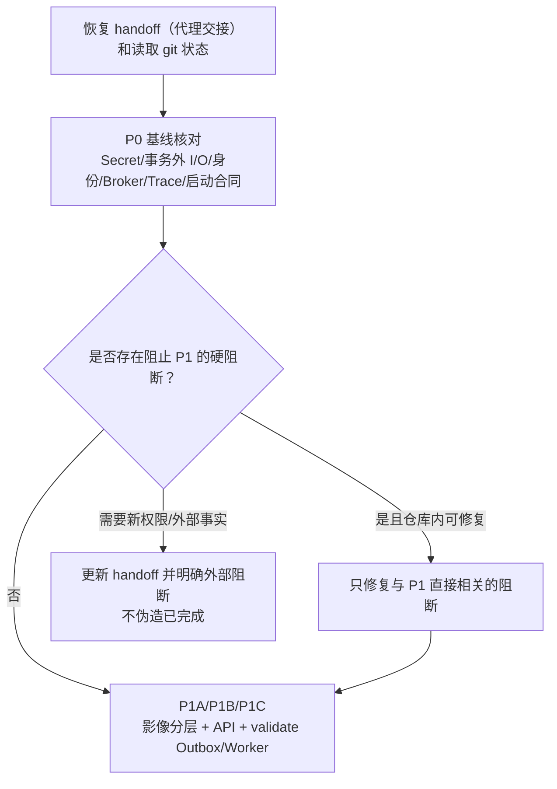

# MS-Image 新重构会话交接

状态：`READY_FOR_NEXT_SESSION`（已准备供新会话读取）
用途：让新会话不依赖历史聊天，先恢复目标、事实、风险和实施顺序。

## 1. 新会话最小读取顺序

1. 根目录 `AGENTS.md`（项目规则，系统通常自动加载，但仍需确认适用范围）。
2. 根目录 `AGENT_HANDOFF.md`（代理交接入口）。
3. `.agent-handoff/snapshot.md`（当前状态）。
4. `.agent-handoff/risks.md`（风险与未知项）。
5. `.agent-handoff/backlog.md`（下一步待办）。
6. [重构文档包入口](README.md)。
7. P1 实现读取[目标架构](02-target-architecture.md)、[数据库与 OSS 设计](03-database-and-storage-design.md)、[开发指南](05-development-guide.md)和[重构计划](06-refactor-migration-and-validation-plan.md)。
8. 实现 XRay（X 光）时读取 [XRay 详细链路与开发流程图](10-xray-detailed-flow.md)。
9. 评审或实现图中节点职责时读取 [Canonical XRay Chain 逐层目的与责任合同](12-canonical-xray-layer-responsibility-contract.md)。
10. 开始内部代码替换前读取[重构基线决策](13-refactor-base-decision.md)，按 preserve/replace（保留/替换）边界执行。
11. 读取设计母文中与当前 Phase（阶段）直接相关的精确字段、状态、事务和不变量章节。
12. 即将修改的确切代码，必须亲自完整阅读。

若本轮不是按既定设计实现，而是要改变架构、字段、Service（业务服务）或 Stage（阶段）决策，才额外读取：

- [决策、风险与待确认项](07-decisions-risks-and-open-questions.md)。
- [历史演进与冲突索引](../history/README.md)，只用于理解旧方案，不作为合同。
- [设计母文](../ms-image-final-architecture-and-database-design.md) 中受影响的全部合同，并同步更新权威设计；不能只改实施视图。

## 2. 当前恢复摘要

- 当前仓库代码是 XRay validation-only（仅验证）骨架，目标通用影像架构尚未实现。
- 用户允许完全重构代码；旧 `xray_accuracy` 内部模块、目录和类可以替换，但外部兼容、数据迁移和事实 owner 必须受控。
- 目标在线 `ms_image` 当前为 10 表候选，隔离 `ms_image_eval` 当前为 4 表候选；10+4 不是数量上限，必要时按独立事实证据增表。
- 目标在线业务 Service 为 8 个，注册 Stage Service 为 5 个。
- Canonical XRay Chain（X 光权威主链）已冻结：`xray_primary_v1` 为 StudyPreparation -> JointPrimaryReader -> DecisionFinalization -> Report。
- `xray_targeted_review_v1` 才在 Primary 后进入 FamilyRouting，并选择 `primary_final` 直接定稿或最多一次 TargetedReview；Targeted 技术失败不得静默回退 Primary。
- 人工复核当前不考虑；`review_required` 是可发布 AI 无法确定终态。
- OSS 保存 bytes；不建设 `file_asset`（文件资产）表，各 owner 表保存完整 ObjectRef。
- 当前医学准确率是 `UNKNOWN`，发布状态是 `PARTIAL / NO-GO`。
- 当前 `HEAD` 就是 `9a45209a`；重构基线选择“当前未提交工作树作为资产基线 + 保留入口的内部模块化替换”，不是 reset 后全量重写，也不是继续零散修补。开始大范围代码替换前必须先排除 `.env`/Secret 并建立用户认可的可恢复 checkpoint。

## 3. 第一轮实现前必须做什么

新会话不要把 10+4 当成固定数量，也不要直接大批生成全部表。先完成：

1. 读取当前 git 状态，保护所有用户未提交改动。
   固定先运行 `git status --short`、`git diff --name-status`、`git diff --stat`；修改重叠文件前完整阅读并合并，禁止 reset、checkout、覆盖或批量删除。
2. 用当前代码重新核对 P0 阻断是否仍然存在，特别是 Secret、事务内外部 I/O、身份、Broker、Trace/Audit 和启动合同；StageRegistry 缺失是 P3 的预期差距，不阻止 P1。
3. 代码内部完全重构已经得到用户授权，不需要再次询问；迁移脚本、新建测试脚本、真实数据库操作和生产发布仍未授权。
4. P0 只核对会阻止 P1 的真实工程边界，不无限扩展成纯审计；无硬阻断时在同一会话直接进入 P1。
5. 将 P1 按 P1A/P1B/P1C 顺序闭环，不因只完成 ORM/Schema 就宣称模块完成。
6. 将目标、文件、风险和完成定义写入 `.agent-handoff/snapshot.md`。

### 3.1 第一轮执行判定



## 4. 推荐首个开发切片

用户已经授权内部代码重构。推荐第一个切片：

```text
P1A Session/Study/Series/Image 目标 Model + Schema + DAL + Service
P1B API + dependency injection + route registration
P1C ObjectStorageGateway + Image validate Outbox/Relay/Worker + reconcile/revision
-> 不创建迁移脚本（除非另行授权）
-> 不接医学 Provider
```

原因：它先建立所有模态共享的影像事实，不依赖 Prompt/模型准确率；Task、Stage 和 AI 只有在冻结的 Study revision 上才有可靠输入。Image 完成上传不能同步执行大对象校验，因此 `validate_image` 的最小 Outbox/Relay/Worker 属于 P1C，而不是留到 P2。

第二个切片：

```text
Task + first Stage + Outbox atomic transaction
-> 将 P1C 的同一 Outbox/Relay 扩展到 Task/Stage/Call
-> zero-model replay
```

第三个切片才是 AI Config/Call、Primary Reader 和 Report。

### 4.1 P1 最小切片的完成定义

- Model/Schema/DAL/Service 使用同一实体语义，不复制旧 XRay 专项字段。
- DAL 全部复用 `app.core.crud.DalBase`；API、Service 和 Worker 不直接拼 SQLAlchemy。
- Session/Study/Series/Image 的 owner、状态、revision 和 ObjectRef（对象引用）合同能闭环。
- `Image uploading -> validating + Outbox(validate_image)` 同事务；Broker 由 relay 在提交后发布。
- prepare/upload/complete/validate/revision 中所有 OSS（对象存储）外部 I/O 均在数据库事务外；完整校验由 Worker 执行，不阻塞 API 长请求。
- ready 只能来自服务端流式 hash/size/格式校验；失败进入 quarantined，不信任客户端 hash、OSS ETag 或 HEAD 单独结论。
- 替换影像必须创建新版本；新版本 ready 且 Study revision CAS 成功后，旧版本才能 superseded。
- required Series/Image 未完整前 Study 不得 ready；相同幂等键但 payload 不同必须冲突。
- 不生成 Alembic（数据库迁移）脚本，不新建测试脚本，不操作真实数据库，不接医学 Provider。
- 可以运行已有的非破坏性检查；运行、失败和未运行项全部写入 validation（验证记录）。
- 无迁移和真实运行授权时，结束状态只能是 `CODE_IMPLEMENTED / NOT_MIGRATED / NOT_RUNTIME_VALIDATED`，不能把 G4 标为通过。
- 目标表不保存 `tenant_id`，但不能因此删除认证：旧 tenant claim 暂作兼容访问范围；目标 owner 使用可信 subject/service identity + scope + 资源归属，请求体不得覆盖 owner。
- 新 OSS key 不再按 tenant 派生；旧 key 由现有网关内的兼容适配器只读，不新建第二套 OSS Gateway，不盲目重写旧对象。
- 新实现、仍为设计和尚未验证的部分在文档和 handoff 中明确区分。

## 5. 新会话禁止事项

- 不把目标文档写成已实现。
- 不一表一表复制 `xray_accuracy_*`。
- 不恢复 `tenant_id`、公共 `file_asset`、固定 FinalReader 或人工复核占位字段。
- 不在 API/Service/Worker 直接拼 SQL。
- 不新增 Repository、第二套 CRUDBase 或 DatabaseService。
- 不在数据库事务内调用 OSS/Broker/Provider。
- 不使用 `/{id}` 路由。
- 未经用户特别授权不生成迁移脚本和测试脚本。
- 不修改或删除用户已有未提交改动。
- P1 不删除旧 XRay API/表，不开启生产双写；旧入口保持原状，直到 P6 Compatibility Adapter 获得明确授权。
- 不让 Python 阈值、投票或 fallback 产生医学结论。
- 不读取 isolated Holdout（隔离留出集）调 Prompt 或阈值。

## 6. 每轮会话结束前

- 更新 `.agent-handoff/snapshot.md`：状态、下一步、活动文件和阻断。
- 将长期取舍写入 `.agent-handoff/decisions.md`，不要塞进 snapshot。
- 将验证命令、结果和未运行项写入 `.agent-handoff/validation.md`。
- 将风险和 UNKNOWN 写入 `.agent-handoff/risks.md`。
- 更新 backlog，只保留可执行未完成项。
- 运行 handoff maintenance（交接维护）检查。
- 明确哪些代码已实现、哪些只设计、哪些未验证。

## 7. 可直接用于新会话的启动提示

直接使用根目录 [AGENT_SESSION_PROMPTS.md](../../AGENT_SESSION_PROMPTS.md) 中“开启新的重构会话”的完整提示词。
该提示词是唯一维护版本，本文不再复制第二份以避免授权范围、读取顺序和 P1 完成定义漂移。

## 8. 新会话能否正确恢复的验收问题

新会话读完最小集后，应能回答：

1. 当前代码与目标架构的差距是什么？
2. 下一步最小实现切片是什么？
3. 哪些表、Service 和 Stage 属于目标但尚未实现？
4. 哪些医学能力默认关闭，为什么？
5. 当前有哪些阻断和 UNKNOWN？
6. 本轮可以修改哪些文件，哪些动作未被授权？
7. 如何验证本轮没有破坏唯一 owner、事务和医学边界？
