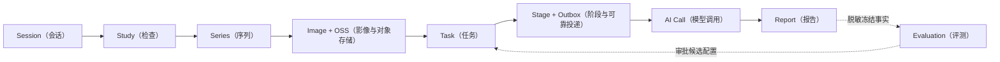
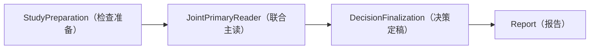

# MS-Image 团队介绍稿

状态：`CURRENT_BRIEFING`（当前团队讲解稿）
建议时长：15-25 分钟。

## 1. 30 秒介绍

`ms-image`（影像服务）是兽医多模态影像的接入、AI 诊断执行和报告平台。首期先闭环 XRay（X 光），但数据库和可靠执行底座同时支持未来 CT（计算机断层成像）、MRI（磁共振成像）、超声、视频和 WSI（全切片影像）。核心目标不是增加模型调用，而是让每个病例的输入、配置、调用、结果、报告和评测都可追溯、可恢复、可回滚。

## 2. 为什么要重构

当前代码已经有 XRay validation-only（仅验证）的 Session/Run、Outbox、Stage checkpoint、Provider adapter 和 Worker 骨架，但存在三类结构问题：

1. 领域模型仍以 XRay 专项表为中心，不能自然扩展其他影像。
2. 旧方案曾混合 6/8/10/12 表、固定二次 Reader、人工复核和在线实验节点，事实 owner 不够稳定。
3. 工程链可运行不等于医学准确率可信，缺少统一的 Gold、paired A/B 和隔离 Holdout 控制面。

因此不是推倒所有基础设施，而是保留入口和可靠性骨架，内部重建通用领域模型和最短医学链。
代码层面允许完全重构：旧 XRay 专项目录、类和内部实现不需要保留；保留的是经验证有价值的分层、
可靠性合同、外部兼容和可回滚事实，而不是旧代码本身。

## 3. 一张图讲清项目



这张图的重点：影像事实、业务任务、节点执行、消息投递、模型调用和报告分别拥有自己的状态，不能压在一张“session_record”或“run_record”里。

## 4. 在线 10 表和评测 4 表

10+4 是当前候选起点，不是表数量上限。新事实具有独立 owner、状态机、查询、事务/恢复或权限/保留
要求时可以增表；某张表被实现证明没有独立事实时也可以合并。

在线 `ms_image`：

```text
session_record / study_record / series_record / image_record
task_record / stage_checkpoint_record / outbox_record
ai_config_record / ai_call_record / report_record
```

隔离 `ms_image_eval`：

```text
evaluation_job_record / evaluation_outbox_record
evaluation_run_record / evaluation_artifact_record
```

为什么评测必须隔离：Gold（可信金标准）、Holdout 标签、失败样本角色和 scorer（评分器）不能进入线上 Prompt、Task 或报告，否则会产生答案泄漏和错误发布。

## 5. XRay 最核心链路



- Preparation 证明完整原图、revision、能力和预算正确。
- Primary 一次读取完整 Study，输出完整病例结果。
- Finalization 只选择和校验唯一 owner，不调用模型、不改判。
- Report 保存不可变结果和发布状态。

这条链比旧的“每个器官/系统调用一次再固定终审”更短，但保留了可靠性和证据链。复杂度只在有实验收益时增加。

## 6. 家族是什么

Clinical Family（临床专项家族）是结构化报告和评测维度，例如骨骼、心血管、呼吸、消化、泌尿生殖等。它不是默认独立服务、独立表或独立模型调用。

候选专项链只有在 Primary 结果出现预注册疑点时：

```text
FamilyRouting（确定性）
-> 最多选择一个家族
-> TargetedReview（一次视觉调用）
```

整个策略必须相对 Primary-only 做冻结同病例 paired A/B，不能因为局部看起来更详细就上线。

## 7. OSS 到底怎么存

- OSS 保存 bytes（文件字节）。
- `image_record` 保存原始/派生影像的完整 ObjectRef。
- Task/Stage/Call/Report/Evaluation 各自在自己的 owner 行保存大型对象引用。
- 没有公共 `file_asset`（文件资产）表。
- signed URL 临时生成，不落库。
- 对象必须有 key、version、SHA256、size、content type 和加密引用，服务端校验后才能 ready。

## 8. 8 个业务 Service

```text
SessionService / StudyService / ImageService / TaskService
ImagingExecutionService / AIConfigService / AIRequestService / ReportService
```

Registry、Validator、Gateway、Relay 和 AuditSink 是组件，不为了“看起来完整”再扩成业务 Service。每个识别阶段是现有 Service 层中的版本化 Stage Service，也不默认拆成网络微服务。

## 9. 准确率如何提高

数据库设计不会直接提高医学准确率，它提供可信实验能力。实际路线：

1. 审计病例、重复、投照和标签，建立 trusted Gold。
2. 固定 Primary-only 基线。
3. Prompt、模型或链路每次只改变一个预注册变量。
4. 同病例 paired A/B，同时看正常误报、异常漏诊、不确定率、覆盖、工程失败、成本和延迟。
5. 候选通过独立 Holdout 和人工审批后才进入 Shadow/Gray。

数学、统计、拓扑和 Harness 用于离线分析、校准和发现数据覆盖空洞，不能替代医学真值或直接修改线上 verdict。

## 10. 团队分工边界

| 角色 | 主要责任 |
|---|---|
| 上游业务开发 | 用户/宠物/病历 owner、调用身份、Study 业务关联和发布路由 |
| ms-image 后端 | 在线 10 表、Service/DAL、OSS、异步可靠性、报告和权限 |
| AI 工程 | Prompt/Schema、Provider adapter、Stage 医学合同和输入 lineage |
| 数据/评测 | 数据集、Gold、split、paired scorer、统计和 Holdout |
| 运维/安全 | Secret、OSS/KMS、Broker、指标、审计、灾备和删除证明 |
| 产品/医学 | 任务范围、报告语义、Gold 仲裁和发布风险审批 |

## 11. 需要团队确认的事项

- 生产身份、scope 和上游资源归属合同。
- CT/MRI 的真实 Study/Series/Instance 完整信号。
- OSS region/KMS/retention/legal hold。
- Provider 真实 model ID、图像/JSON/receipt 和数据保留能力。
- Gold 和独立 Holdout 可用规模。
- 旧 API 兼容期限和旧表归档策略。
- 人工复核未来是否形成独立业务；当前不实现。

## 12. 讲解结束后的统一结论

```text
当前：XRay validation-only 工程骨架，PARTIAL / NO-GO
目标：通用影像在线 10 表 + 隔离评测 4 表
首链：Preparation -> Primary -> Finalization -> Report
原则：单一事实 owner、外部 I/O 事务外、可恢复、可评测
边界：人审/图推理/拓扑/Harness 不进入首期在线链
```
