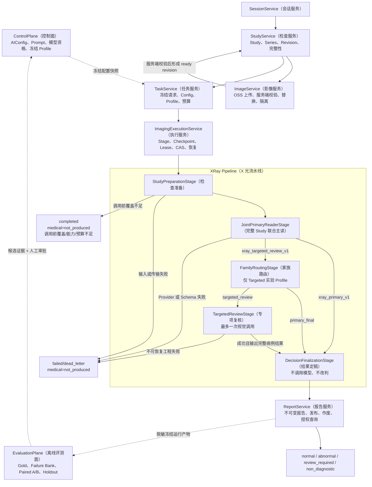
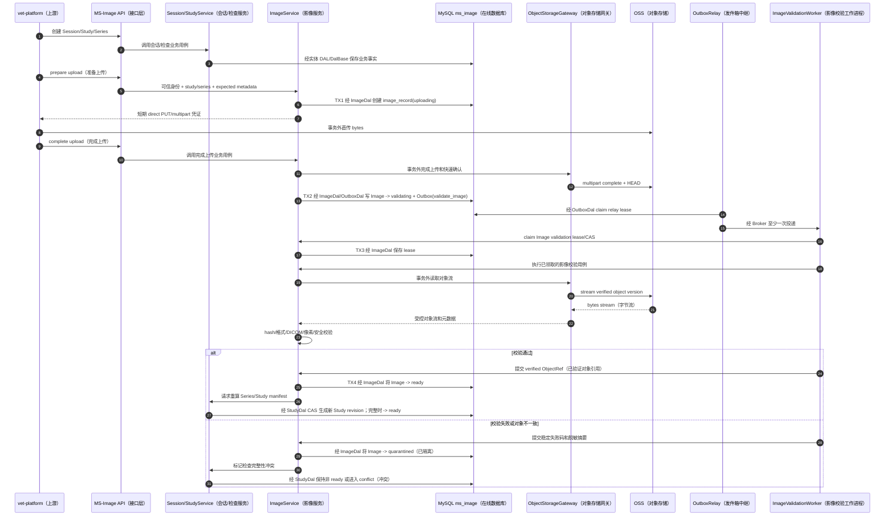
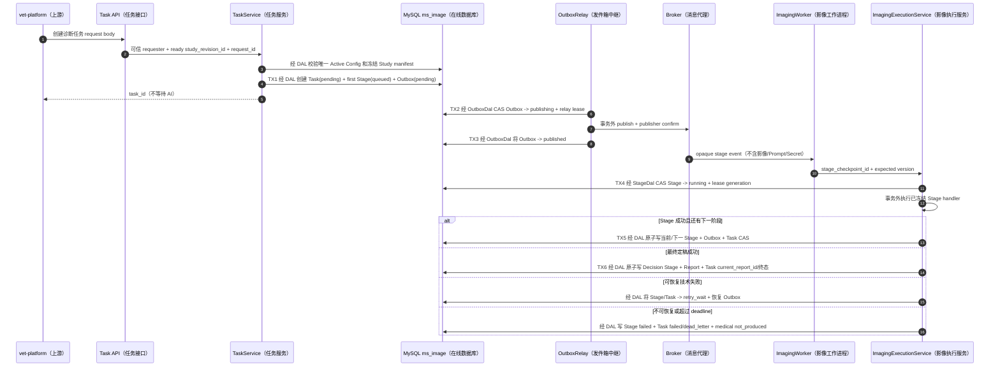
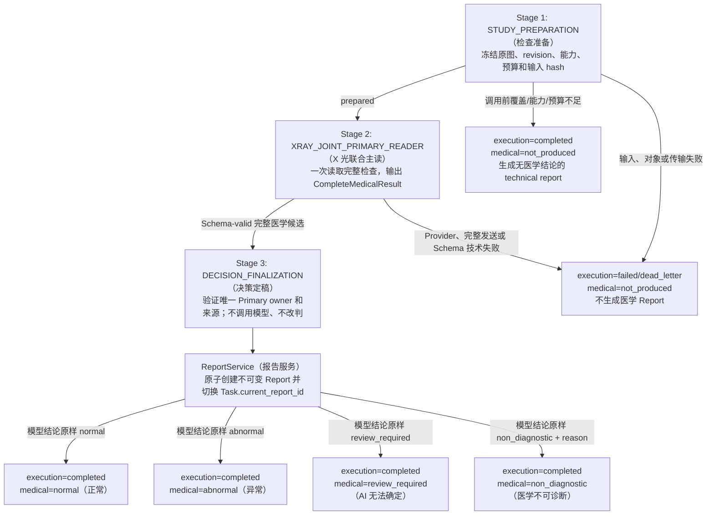
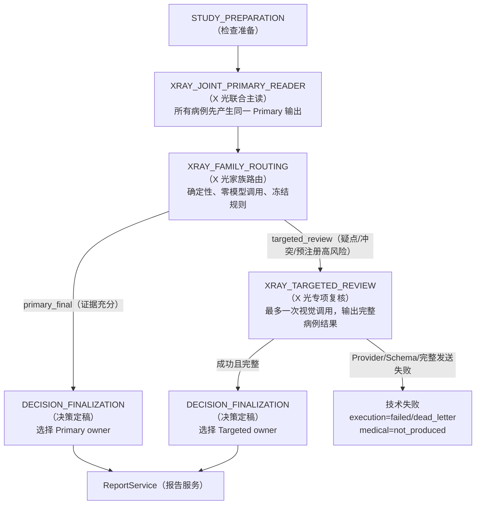
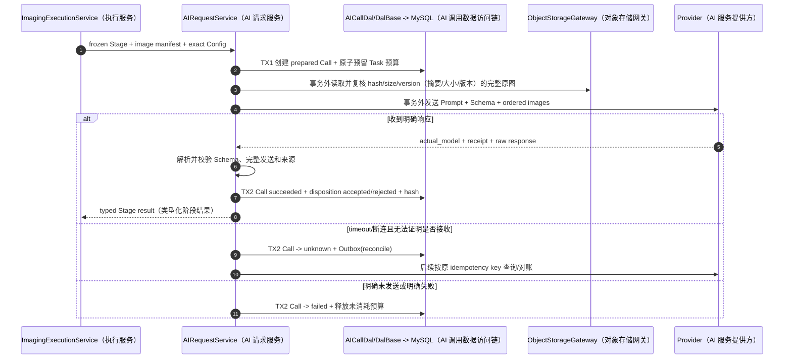
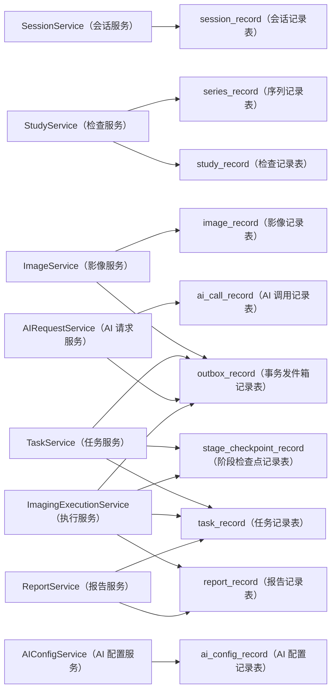
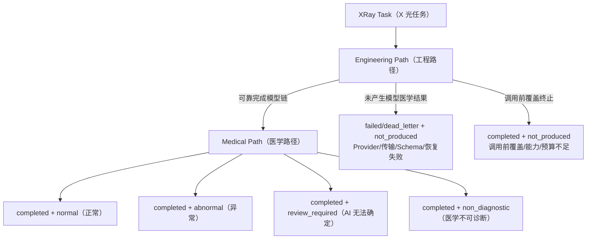
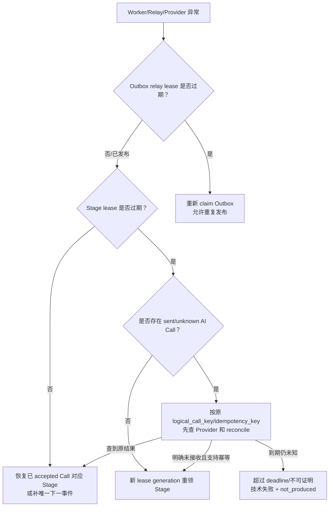
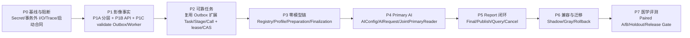

# MS-Image XRay（X 光）详细链路与开发流程图

状态：`CURRENT_REFACTOR_VIEW / DESIGNED_NOT_IMPLEMENTED`（当前重构视图/已设计尚未实现）
更新日期：2026-08-18
适用范围：XRay（X 光）首期重构、代码评审、联调、故障定位和团队讲解。
精确字段、状态候选值和不变量以[设计母文第 6、8、15、16 章](../ms-image-final-architecture-and-database-design.md)为准。

本文把分散在设计母文中的 XRay（X 光）链路集中成开发视图，不建立第二套字段权威。图中的目标
Service（业务服务）、Stage Service（阶段服务）和目标表当前尚未完整实现；不能把 `PROPOSED`（候选设计）
写成线上运行事实。

## 1. 先给结论

首期默认生产候选只有一条最短医学链：

```text
StudyPreparation（检查准备）
-> XRayJointPrimaryReader（X 光联合主读，一次视觉调用）
-> DecisionFinalization（决策定稿，不调用模型、不改判）
-> Report（报告）
```

`FamilyRouting + TargetedReview`（家族路由 + 专项复核）是完整的实验候选，不是默认生产步骤。
它只有在冻结同病例 Paired A/B（配对对照实验）通过后，才允许从 `validation_only/shadow`
（仅验证/影子运行）申请 Gray/Active（灰度/正式激活）。人工复核当前不在链路中。

采用 `existing-entry internal modular refactor`（保留入口的内部模块化重构）：内部代码、目录、类和
Worker（异步工作进程）
可以完全替换，但保留或受控迁移外部入口、唯一事实 owner（所有者）、Outbox（事务发件箱）、CAS
（比较并设置）、lease（租约）、可回滚发布和配对评测合同。完全重写内部实现不等于同时建设第二套
API（应用程序接口）、
Runner（执行器）、数据库事实源或评分器。

## 2. Canonical XRay Chain（X 光权威端到端总链）



本图是当前 Canonical Chain（权威主链）。后文流程图只能展开它的上传、事务、调用和恢复细节，不能改变两个 Profile 的分支、Final owner（最终结果所有者）或失败语义。

图中每个节点的目的、存在理由、输入、处理逻辑、输出、落表、失败语义、禁止职责和删除影响，集中见[Canonical XRay Chain 逐层目的与责任合同](12-canonical-xray-layer-responsibility-contract.md)。

这张图包含四个不同责任面，不能合并成一个“大 Service”：

| 责任面 | 解决的问题 | 为什么必须独立 |
|---|---|---|
| Control Plane（控制面） | 哪个 Prompt、Schema、模型和固定 Profile 有资格执行 | 只接收 Evaluation Plane 的候选证据，必须经人工审批；发布选择不能由普通诊断请求或 Worker 临时决定 |
| Imaging Ingress（影像接入面） | 模型实际看到了哪些可信原图和哪个 Study revision | OSS 上传成功不等于影像完整、格式可信或检查可诊断 |
| Reliable Execution（可靠执行面） | 重复消息、崩溃、租约过期和结果未知如何恢复 | 工程完成与医学正确是两类状态，不能靠一次同步 API 调用混在一起 |
| Medical Pipeline（医学流水线） | 哪个模型输出拥有医学结论，如何生成唯一 Report | Python 路由、持久化和渲染不得成为第二医学判断者 |

## 3. 影像上传到 Study 就绪



开发约束：

- MySQL 只保存对象引用、hash、大小、版本和状态，不保存影像 bytes，也不建设 `file_asset`（公共文件资产）表。
- 客户端声明和单次 OSS `HEAD` 都不能直接把 Image 推进为 `ready`（就绪）。
- 替换影像必须创建新 `image_record` 版本；新版本 ready 且 Study CAS 成功前，旧版本不能提前失效。
- 只有 Study revision 的必需 Series/Image 全部完整时，才允许创建诊断 Task（任务）。

## 4. Task 创建与可靠异步执行



`Outbox published`（发件箱已发布）只证明 Broker 接收过事件，不证明 Stage、Task 或 Report 已完成。
Broker 允许重复投递；真正的幂等边界是 aggregate version、Stage CAS、lease generation 和逻辑 AI Call 幂等键。

## 5. 默认 XRay 医学主链 `xray_primary_v1`



### 5.1 三个 Stage 为什么存在

| Stage Service（阶段服务） | 输入 | 输出 | 医学 owner | 不能删除的理由 | 首期不继续拆分的理由 |
|---|---|---|---:|---|---|
| `StudyPreparationStageService`（检查准备阶段服务） | 冻结 Study revision、原图、Config、Provider 能力和预算 | 规范输入或稳定技术终态 | 否 | 不存在时无法证明模型看到的是完整、确定且允许发送的病例 | 影像组装、完整性、preflight 和预算都依赖同一冻结输入，拆开只增加恢复状态 |
| `XRayJointPrimaryReaderStageService`（X 光联合主读阶段服务） | 完整检查原图、最小临床上下文、冻结 Prompt/Schema | 完整病例 `CompleteMedicalResult`（完整医学结果） | 条件拥有；默认链中即 Final owner | 这是首期唯一医学判断来源 | 器官/系统/犬猫是输出维度和评测分层，不应默认变成多次相互相关的模型调用 |
| `DecisionFinalizationStageService`（决策定稿阶段服务） | 已 accepted（已接受）的唯一 Primary Stage/Call | `decision_finalized` 和来源选择 | 否 | 为默认链和候选分支提供同一唯一收口与事务不变量 | 它只校验和选择，不做医学规则、投票、阈值或报告渲染 |

`ReportService`（报告服务）是业务 Service，不是医学 Stage。它保存、发布、作废和授权查询 Report，
但不得增加、删除、合并或改写模型 Finding（影像发现）。

## 6. 实验性专项链 `xray_targeted_review_v1`



这条候选链必须同时遵守：

1. Family（家族）是报告结构、失败归因和评测 strata（分层），不是一张表或默认一次模型调用。
2. `FamilyRouting`（家族路由）只能输出白名单 `primary_final/targeted_review`，不能修改 normal/abnormal。
3. 每个病例最多选择一个家族进行一次 TargetedReview（专项复核），不能按器官并行多次投票。
4. TargetedReview 必须输出完整病例结果，不能把 Primary 与 Targeted 的有利片段拼接成 Final。
5. 已进入 TargetedReview 后若发生技术失败，必须以 `not_produced` 关闭；不能静默回退 Primary，避免选择性报告。
6. Router 规则、Targeted Prompt、模型、预算和 Schema 都是候选变量的一部分，评测前必须冻结。

## 7. 一次 XRay Provider 调用



一个模型 Stage 可以产生 transport retry（传输重试）、format repair（格式修复）或 fallback（降级调用），
但每个逻辑 Provider 请求分别拥有 `ai_call_record`；最终只有一个满足冻结合同的 Call 可以成为 Stage 的
`accepted_call_id`。不能因为模型结论“不满意”而自动重问直到得到想要的答案。

## 8. 表与事务落点



| 原子边界 | 同一事务必须完成 | 事务外动作 | 失败时的事实 |
|---|---|---|---|
| 上传完成 | Image `validating` + `validate_image` Outbox | OSS multipart complete/HEAD | 可重试完成或隔离，不猜测 ready |
| Task 创建 | Task + first Stage + execute Outbox | 不调用 Broker/Provider | 三行全有或全无 |
| Outbox 投递 | claim 和结果分别使用短事务 | Broker publish + confirm | 允许重复发布，由消费端 CAS 去重 |
| Stage 领取 | Stage running + owner/lease generation | Stage 计算和外部 I/O | 旧 generation 永远不能回写新 owner |
| AI 调用准备 | Call prepared + Task 预算预留 | OSS 读取 + Provider 调用 | sent 后未知必须 reconcile，不新建调用掩盖 |
| Stage 推进 | 当前 Stage/Call + 下一 Stage + Outbox + Task CAS | 无 | 崩溃后从最后 completed Stage 恢复 |
| 最终完成 | Decision Stage + Report + Task 医学/工程状态/current pointer | Report 展示产物可后置 | 三者任一失败则全部回滚 |

所有实体写入仍必须经过 `XxxDal -> DalBase`（实体数据访问层 -> 数据访问基类），表访问图不授权
Service、API 或 Worker 直接拼 SQLAlchemy 查询。

## 9. 结果与失败必须分开表达



| 场景 | `execution_status`（工程状态） | `ai_medical_status`（AI 医学状态） | Report（报告） |
|---|---|---|---|
| AI 正常完成 | `completed` | `normal/abnormal/non_diagnostic` | AI Report；`non_diagnostic` 必须有模型原因 |
| AI 无法确定 | `completed` | `review_required` | AI Report；当前不创建人审任务 |
| 调用前覆盖不足 | `completed` | `not_produced` | 无医学结论的 technical report（技术报告） |
| Provider/Targeted 技术失败 | `failed/dead_letter` | `not_produced` | 不生成医学 Report |
| 用户取消 | `cancelled` | `not_produced` | 不生成新的医学 Report |

以下等式全部错误：

```text
Outbox published != Stage completed
Stage completed != AI Call succeeded
AI Call succeeded != Schema passed
Schema passed != 医学准确
execution completed != medical normal
review_required != 人工已经复核
non_diagnostic != technical failure
Report final != Report published
```

## 10. 崩溃与恢复链



恢复永远从数据库事实开始，不从 Worker 内存、Celery 是否显示成功或“模型大概没收到”开始。Task 已终态后
Provider 才返回的结果只记为 `late/ignored`（迟到/忽略），不能覆盖已发布 Report。

## 11. 默认链与候选链的公平比较

| 比较项 | Control：`xray_primary_v1` | Candidate：`xray_targeted_review_v1` |
|---|---|---|
| Study/图像/顺序 | 冻结相同 | 冻结相同 |
| Primary Prompt/Schema/模型/Provider | 冻结相同 | 冻结相同 |
| Primary 输出 | 保存 | 必须复用同一病例 Primary 输出合同 |
| 新增变量 | 无 | 冻结 Router + 最多一次 TargetedReview 的完整策略 |
| Final owner | Primary | 未路由时 Primary；路由且成功时 Targeted |
| Targeted 技术失败 | N/A（不适用） | 技术失败，不静默回退 Primary |
| 运行资格 | Control baseline（对照基线） | `validation_only/shadow`，通过门禁前不可生产 |

候选必须作为 `chain-only candidate`（仅链路候选）整体评测。不能运行后修改路由阈值、挑选有利病例、
更换 Primary 模型或更换 scorer（评分器），否则实验不是单变量，无法证明新增链路提高准确率。

## 12. 开发实现顺序



默认第一个代码阶段按 P1A -> P1B -> P1C 实现公共影像事实、API 和 OSS 异步校验合同，不同时接入
医学 Provider。`Image uploading -> validating + Outbox(validate_image)` 属于 P1C；P2 复用同一
Outbox/Relay 扩展任务执行。每个 Phase（阶段）通过自己的工程门禁后再进入下一阶段。没有迁移、
真实数据库和真实对象演练时，P1 只能标记
`CODE_IMPLEMENTED / NOT_MIGRATED / NOT_RUNTIME_VALIDATED`；业务测试、迁移脚本和真实数据库操作仍需分别授权。

## 13. 开发验收清单

### 13.1 影像输入

- [ ] Task 冻结的 Study revision、Image 顺序、对象版本、hash 和实际发送清单一致。
- [ ] OSS 外部 I/O 不在数据库事务中执行。
- [ ] Image 未经服务端流式校验不能进入 `ready`。
- [ ] 补图或替换只产生新 revision 和新 Task，不覆盖旧执行事实。

### 13.2 可靠执行

- [ ] Task + first Stage + Outbox 同事务创建。
- [ ] Relay 和 Worker 可处理至少一次重复消息。
- [ ] Stage claim、heartbeat 和完成均校验 owner、lease generation 和 state version。
- [ ] sent/unknown Call 先 reconcile，不能用新调用掩盖未知结果。

### 13.3 医学边界

- [ ] 默认 Profile 只有一次视觉调用。
- [ ] Primary 输出覆盖正常、异常、AI 无法确定和医学不可诊断，且 Finding 可追溯到源图。
- [ ] DecisionFinalization 和 Report 不修改医学结论。
- [ ] 技术失败、覆盖不足和医学不可诊断没有混用。
- [ ] FamilyRouting/TargetedReview 默认关闭，只在冻结实验中启用。

### 13.4 报告与发布

- [ ] selected Stage/Call、Report 内容和 Task 医学状态在一个事务中保持一致。
- [ ] `final`（已定稿）与 `published`（已发布）权限语义不同。
- [ ] `review_required` 是合法 AI 终态，不自动创建人工复核。
- [ ] 旧 V2 fallback 结果不复制为新服务医学事实。

## 14. 本文没有决定什么

- 不复制十张在线表和四张评测表的完整字段；字段只以设计母文为准。
- 不宣称 GPT-5.6 Sol、Gemini 3.7 Flash 或任何模型已经通过医学准确率门禁。
- 不宣称 TargetedReview 比 Primary-only 更准确；它仍是待证伪/证实的实验假设。
- 不授权生成 Alembic（数据库迁移）、测试脚本或操作真实数据库。
- 不引入人工复核、任意可拖拽 DAG（有向无环图）或每 Stage 网络微服务化。
