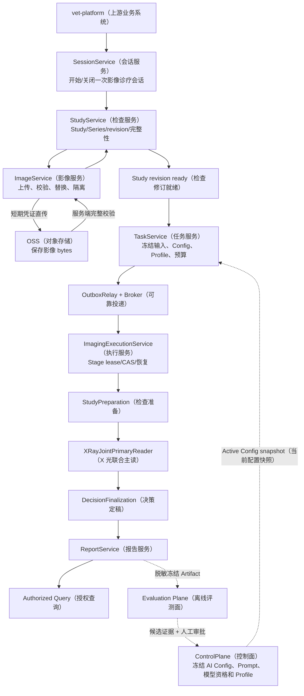
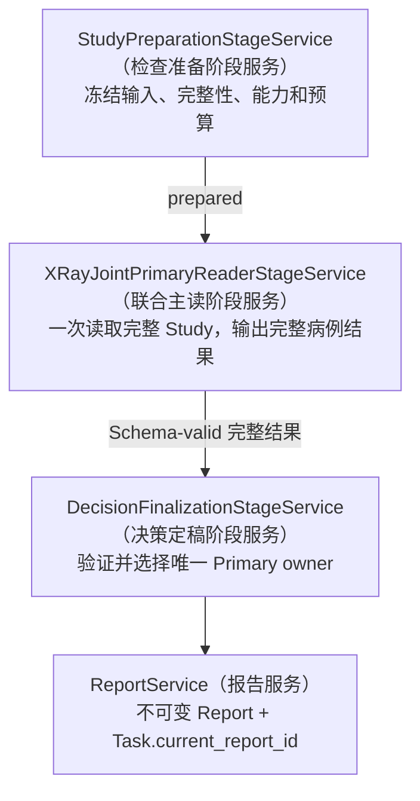
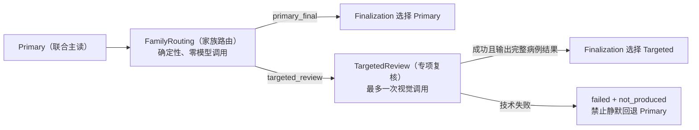

# MS-Image XRay（X 光）核心链路开发沟通文档

状态：`CURRENT_BRIEFING / DESIGNED_NOT_IMPLEMENTED`（当前沟通稿/已设计尚未实现）
更新日期：2026-08-18
建议沟通时长：20-30 分钟
适用对象：首次参与 `ms-image` 的后端、AI、测试、数据评测、运维和上游开发
精确字段依据：[设计母文](../ms-image-final-architecture-and-database-design.md)
完整开发流程：[XRay 详细链路与开发流程图](10-xray-detailed-flow.md)

逐层责任：[Canonical XRay Chain 逐层目的与责任合同](12-canonical-xray-layer-responsibility-contract.md)

本文用于让新开发快速建立同一幅系统图，不建立第二套数据库字段或状态权威。当前代码仍是
XRay validation-only（X 光仅验证）工程骨架；本文描述的是目标链路，不能据此宣称目标表、Stage、
真实 Provider（AI 服务提供方）或医学准确率已经完成。

建议讲解顺序：先用第 1-3 节统一系统图和当前状态，再用第 4-6 节说明在线链与实验链，最后按第 8-11 节
分配代码、数据库和联调责任。若时间只有 5 分钟，只讲第 1、3、5、12 节。

## 1. 先记住三个结论

1. XRay 的核心不是“按器官调用很多次模型”，而是“可信完整输入 -> 一次完整检查主读 -> 唯一结果定稿 -> 不可变报告”。
2. 工程成功与医学结论是两条正交状态：消息发布成功、Stage 完成、模型返回成功都不等于医学准确。
3. Clinical Family（临床专项家族）首先是报告结构和评测分层；`FamilyRouting + TargetedReview` 只是待验证实验链，不是默认步骤。

默认医学主链固定为：

```text
StudyPreparation（检查准备）
-> XRayJointPrimaryReader（X 光联合主读，一次视觉调用）
-> DecisionFinalization（决策定稿，零模型调用、不改判）
-> Report（不可变报告）
```

## 2. 当前状态与目标不要混淆

| 范围 | 当前可确认状态 | 目标状态 |
|---|---|---|
| 代码 | 旧 `xray_accuracy` validation-only 骨架 | 通用影像分层和 XRay 最短主链 |
| 数据库 | 隔离环境中的旧 XRay 临时表 | `ms_image` 在线候选 10 表；数量按事实必要性调整 |
| Stage | 当前执行器主要支持技术 `request_gate` | 5 个版本化 Stage Service，默认链只运行其中 3 个 |
| Provider | 资格和真实影像能力仍有阻断 | 冻结 Config、完整原图、receipt、Schema 和 unknown reconcile 闭环 |
| 医学准确率 | `UNKNOWN`（未知） | trusted Gold + paired A/B + isolated Holdout 通过后才能判断 |
| 发布 | `PARTIAL / NO-GO`（部分完成/禁止放行） | validation-only -> shadow -> gray -> single active owner |

当前实现事实以源码和绑定时间/环境的 Artifact（证据产物）为准；目标合同以设计母文为准；医学效果只由
冻结 Gold、配对实验、确定性 scorer（评分器）和隔离 Holdout（留出集）证明，三者不能互相替代。

## 3. 一张图讲清 XRay 端到端核心链路



这条链不是一个大 Service。它由五个责任面组成：

| 责任面 | 解决的问题 | 不能越界做什么 |
|---|---|---|
| Control Plane（控制面） | 哪个 Config、Prompt、Schema、模型和固定 Profile 有资格被新 Task 使用 | 不能热切换已启动 Task，不能用普通 Worker 临时决定发布配置 |
| Imaging Ingress（影像接入面） | 模型实际看到哪些可信原图、顺序和 Study revision | 不能根据图像内容作医学判断 |
| Reliable Execution（可靠执行面） | 重复消息、崩溃、租约过期、结果未知如何恢复 | 不能把消息成功当医学成功 |
| Medical Pipeline（医学流水线） | 哪一个模型输出拥有医学结论 | Python、Router、Renderer 不能改写 normal/abnormal |
| Evaluation Plane（离线评测面） | 候选是否真的提高准确率且没有安全退化 | 不能修改线上 Task、Report、Gold 或 Active Config |

### 3.1 全链输入输出交接表

这张表用于开发拆分和联调。每一行的输出必须满足下一行的输入前置条件；不能用“当前最新值”、客户端声明或
Worker 内存替代冻结对象。

| 层 | 接收什么 | 成功输出什么 | 主要失败边界 | 下游 |
|---|---|---|---|---|
| `ControlPlane`（控制面） | 候选 Config、Provider 资格证据、评测证据和人工审批 | `FrozenAIConfigSnapshot`（冻结 AI 配置快照） | 资格、Profile、审批或 Active Slot CAS 失败 | `TaskService` |
| `SessionService`（会话服务） | 可信身份、业务引用和幂等键 | `SessionView(open)`（已开启会话视图） | 越权、幂等冲突、非法状态迁移 | `StudyService` |
| `StudyService`（检查服务） | Session、检查/Series 计划和已验证 Image 事实 | ready `StudyRevision`（就绪检查版本）+ 有序 manifest（清单） | 必需影像缺失、版本冲突、revision CAS 冲突 | `TaskService`、Preparation |
| `ImageService`（影像服务） | Study/Series、上传命令、OSS 对象流和校验事件 | verified `ObjectRef`（已验证对象引用）、`ready/quarantined`（就绪/隔离）状态和 generation（代次） | 对象缺失、hash/格式/像素/owner 不一致 | `StudyService` |
| `TaskService`（任务服务） | ready revision、诊断类型、Active Config、预算和幂等键 | `TaskAccepted`（任务已受理）+ first Stage（首阶段）+ Outbox（事务发件箱） | Study 非 ready、配置不可用、预算或幂等冲突 | Relay、Execution |
| `ImagingExecutionService`（执行服务） | Stage event（阶段事件）、冻结 Task/Stage/Config 和数据库版本 | 下一 Stage/Outbox、`retry/reconcile`（重试/对账）或 Task 终态 | lease/CAS、deadline、迟到结果、unknown Call（未知调用） | Stage、Report |
| `StudyPreparationStage`（检查准备） | Task snapshot（任务快照）、ready revision、有序 manifest、能力和预算 | `PreparedStudy`（已准备检查） | 输入/对象不可信 -> TF；调用前覆盖不足 -> CF | Primary |
| `JointPrimaryReaderStage`（联合主读） | 完整 `PreparedStudy`、最小临床上下文和冻结 Primary Config | 完整 `CompleteMedicalResult` + Call receipt（调用回执） | Provider/传输/完整发送/Schema 失败 -> TF | Finalization 或实验 Router |
| `FamilyRoutingStage`（家族路由，仅实验） | Primary 完整结果、冻结家族目录和确定性规则 | `primary_final` 或单一 `targeted_review` 决定 | 规则或输入合同失败 -> 候选链 TF | Finalization 或 Targeted |
| `TargetedReviewStage`（专项复核，仅实验） | 完整原图、Primary 完整结果、单一家族问题和 Targeted Config（专项配置） | 新的完整 `CompleteMedicalResult` | 触发后技术失败 -> TF，禁止回退 Primary | Finalization |
| `DecisionFinalizationStage`（决策定稿） | 冻结 Profile/route（流程配置/路由）、唯一 accepted Stage/Call（已接受阶段/调用）和完整结果 | `FinalizedDecision`（已定稿决定） | owner 不唯一、来源断裂、分支不匹配 -> TF | `ReportService` |
| `ReportService`（报告服务） | FinalizedDecision 和 selected（已选择）完整结果 | 不可变 `ReportView` + Task current pointer（任务当前报告指针） | 最终事务任一写入失败则整体回滚 | 查询 API、Artifact exporter（产物导出器） |
| `EvaluationPlane`（离线评测面） | 脱敏冻结 Artifact、Gold、paired experiment spec（配对实验规格）和 scorer（评分器） | `EvaluationDecisionEvidence`（评测决策证据） | 样本/分母/指纹不一致 -> `not_interpretable/no_go`（不可解释/禁止放行） | 人工审批、ControlPlane |

`TF`（工程失败）=`failed/dead_letter + medical=not_produced`；`CF`（调用前覆盖终态）=
`completed + medical=not_produced`；只有 Report 中的 OUT 才是 `normal/abnormal/review_required/non_diagnostic`。

## 4. 从上传到报告的逐步链路

### 4.1 建立会话和检查

```text
SessionService（会话服务）
-> StudyService（影像检查服务）
-> Series（影像序列）计划
```

- `SessionService` 记录一次业务会话何时开始、关闭或取消。
- `StudyService` 表达一次影像检查、模态、Series、当前 revision 和完整性。
- 上游用户、宠物和病历正文不复制进 `ms_image`，只保存受控 opaque ID（不透明标识）。

### 4.2 上传和服务端校验影像

```text
Image uploading
-> 客户端直传 OSS
-> Image validating + Outbox(validate_image) 同事务
-> ImageValidationWorker 事务外流式校验
-> ready 或 quarantined
-> 重算 Series manifest 和 Study revision
```

为什么不能上传后直接 ready：客户端 hash、OSS ETag 或单次 HEAD 都不能证明真实 bytes、格式、对象版本和
逻辑 owner 一致。服务端必须流式计算 SHA256，校验大小、MIME、DICOM/像素和安全边界。

关键不变量：

- OSS 保存 bytes；MySQL 保存完整 ObjectRef（对象引用），不建设公共 `file_asset` 表。
- `Image uploading -> validating` 与 `Outbox(validate_image)` 必须同事务。
- OSS/Broker 外部 I/O 必须在数据库事务外。
- 校验失败进入 `quarantined`，Study 保持非 ready 或进入 conflict。
- 替换影像创建新版本；新版本 ready 且 Study revision CAS 成功后，旧版本才能 superseded。
- 必需 Series/Image 未完整前不能创建诊断 Task。

### 4.3 创建诊断 Task 并可靠投递

```text
ready Study revision
-> Task + first Stage + Outbox 同事务
-> OutboxRelay 事务外发布 Broker
-> ImagingWorker
-> ImagingExecutionService claim Stage lease
```

`TaskService` 冻结以下内容，创建后不能热切换：

- Study revision、Image manifest 和顺序。
- AI Config、Prompt、Schema、model、Provider 和固定 Profile。
- 请求快照、预算、deadline、run mode 和 release fingerprint。

Broker 是至少一次投递，不是 exactly-once（恰好一次）。真正幂等依靠数据库 aggregate version、Stage CAS、
lease generation 和逻辑 AI Call 幂等键。

### 4.4 执行默认医学主链



| 层 | 为什么存在 | 输入 | 输出 | 是否医学 owner | 明确禁止 |
|---|---|---|---|---:|---|
| `StudyPreparationStageService`（检查准备阶段服务） | 证明模型收到完整、确定、允许发送的病例 | 冻结 Study revision、原图、Config、预算 | 规范输入或稳定技术终态 | 否 | 不诊断、不按 Python 规则判 normal/abnormal |
| `XRayJointPrimaryReaderStageService`（联合主读阶段服务） | 首期唯一医学判断来源 | 完整原图、最小临床上下文、冻结 Prompt/Schema | `CompleteMedicalResult`（完整医学结果） | 是；默认链中即 Final owner | 不按器官拆成多次相关投票，不因结果“不满意”反复重问 |
| `DecisionFinalizationStageService`（决策定稿阶段服务） | 为默认链和候选链提供同一唯一收口 | accepted Primary Stage/Call | owner/source 校验结果 | 否 | 不调用模型、不投票、不阈值改判、不渲染报告 |
| `ReportService`（报告服务） | 保存不可变结果并控制发布、作废和查询 | 唯一 selected owner 的规范结果 | Report revision 和 current pointer | 否 | 不增加、删除、拼接或改写 Finding（影像发现） |

### 4.5 Provider 调用边界

```text
TX1: prepared AI Call + budget reserve
-> commit
-> 事务外读取并复核完整原图
-> 事务外调用 Provider
-> TX2: succeeded / failed / unknown + receipt/hash/disposition
```

- 每个逻辑请求先持久化 `prepared` Call，再允许发送。
- timeout/断连且无法证明 Provider 是否收到时，状态为 `unknown`，必须使用原幂等键 reconcile（对账）。
- 不能新建第二次调用掩盖 unknown，也不能因为医学结果不满意自动重问。
- actual model、Prompt/Schema hash、requested/sent image manifest、receipt 和响应来源必须可追溯。

### 4.6 结果定稿与报告

最终完成必须在同一短事务中保持一致：

```text
DecisionFinalization Stage completed
+ selected accepted Stage/Call
+ immutable report_record
+ task_record.execution_status / ai_medical_status / current_report_id
```

任何一个写入失败，整组回滚。报告展示或导出产物可以异步生成，但不能反向修改规范医学结果。

## 5. 结果与失败语义

| 场景 | 工程状态 `execution_status` | 医学状态 `ai_medical_status` | 医学报告 |
|---|---|---|---|
| 正常结论 | `completed` | `normal` | 有 |
| 异常结论 | `completed` | `abnormal` | 有 |
| AI 无法确定 | `completed` | `review_required` | 有；首期不创建人工复核 |
| 模型判断影像不可诊断 | `completed` | `non_diagnostic` | 有，必须带模型原因 |
| 调用前覆盖/能力/预算不足 | `completed` | `not_produced` | 只有无医学结论的 technical report |
| Provider/传输/Schema/恢复失败 | `failed/dead_letter` | `not_produced` | 无医学报告 |
| 用户取消 | `cancelled` | `not_produced` | 不生成新医学报告 |

开发中最容易混淆的关系：

```text
Outbox published != Stage completed
Stage completed != AI Call succeeded
AI Call succeeded != Schema passed
Schema passed != 医学准确
execution completed != medical normal
review_required != 人工已经复核
non_diagnostic != technical failure
Report final != Report published
```

## 6. 家族分类和实验链放在哪里

Clinical Family（临床专项家族）用于：

- Primary 输出中的结构化报告分区。
- Failure Bank（失败样本库）和指标的预注册分层。
- 候选 TargetedReview（专项复核）选择的一个问题域。

骨骼、心血管、呼吸、消化、泌尿生殖等不是独立数据库表，也不默认各调用一次模型。犬/猫、解剖部位、
临床家族和任务类型应作为正交字段，不再拼成不可治理的长配置名称。

实验链 `xray_targeted_review_v1`：



该候选必须整体做 `chain-only` paired A/B。Primary 的病例、原图、Prompt、Schema、模型和 Provider 必须相同；
新增变量只能是冻结 Router + 最多一次 TargetedReview 的完整策略。通过门禁前只允许
`validation_only/shadow`，不能默认进入生产。

## 7. 公共能力与 XRay 专项能力

| 类型 | 能力 | 后续 CT/MRI 是否复用 |
|---|---|---:|
| 公共业务 Service | Session、Study、Image、Task、ImagingExecution、AIConfig、AIRequest、Report | 是 |
| 公共 Stage | StudyPreparation、DecisionFinalization | 复用合同，按模态资格化实现 |
| XRay 专项 Stage | JointPrimaryReader | 否；其他模态注册自己的医学 Stage |
| XRay 实验 Stage | FamilyRouting、TargetedReview | 否；不能自动推广 |
| 公共组件 | StageRegistry、ProfileValidator、ObjectStorageGateway、OutboxRelay、ProviderClientRegistry、AuditSink | 是 |
| 离线评测 | Dataset/Gold/Paired Scorer/Statistics/Holdout | 复用治理合同，指标按模态定义 |

Stage Service 首期仍位于同一代码库和现有 `app/service/` 层，不默认拆成网络微服务。只有独立运行时、扩缩容、
安全域、SLA 或故障隔离的测量证据出现后才评审拆分。

## 8. Service 与数据库事实落点

| Service（业务服务） | 主写事实 | 核心职责 |
|---|---|---|
| `SessionService`（会话服务） | `session_record` | 会话生命周期和幂等 |
| `StudyService`（检查服务） | `study_record`、`series_record` | revision、manifest 和完整性门禁 |
| `ImageService`（影像服务） | `image_record`、Image-owned `outbox_record` | 上传、服务端校验、替换、隔离和对象对账 |
| `TaskService`（任务服务） | `task_record`、首 `stage_checkpoint_record`、`outbox_record` | 冻结任务并原子启动 |
| `ImagingExecutionService`（执行服务） | Task/Stage/Outbox/Report | claim、lease、CAS、路由、恢复和最终原子完成 |
| `AIConfigService`（AI 配置服务） | `ai_config_record` | 不可变 Config、资格、激活和回滚 |
| `AIRequestService`（AI 请求服务） | `ai_call_record`、Call-owned Outbox | Provider 调用、预算、receipt 和 unknown reconcile |
| `ReportService`（报告服务） | `report_record`、Task current pointer | 不可变报告、发布、作废和授权查询 |

模块名表达业务能力，表名表达持久化事实，不要求机械同名。所有写入必须走
`API/Worker -> Service -> XxxDal(DalBase) -> Model/DB`；该矩阵不授权 Service 或 Worker 直接操作 ORM session。

### 8.1 当前代码的 Preserve/Replace（保留/替换）边界

当前工作树是重构资产基线，不是目标实现。新开发不能把“允许完全重构”理解为重写所有公共基础能力，也不能
把“保留当前工作树”理解为继续沿用 `xray_accuracy` 领域模型。

| 当前代码位置 | 处理原则 | 目标方向 |
|---|---|---|
| `app/api/deps.py` | 保留 JWT、issuer/audience、subject 和 scope 校验语义 | 抽离 tenant/XRay 专项依赖，建立资源 owner 授权 |
| `app/core/readiness.py` | 保留 DB、Broker、Provider transport/receipt 分层就绪语义 | 改接通用 AIConfig/Provider 合同 |
| `app/core/imaging/object_store.py` | 保留对象键校验、大小/MIME/DICOM/像素校验能力 | 收敛为唯一 ObjectStorageGateway，替换 tenant/XRay 新 key 规则 |
| `app/core/ai/qualification.py` | 保留资格 Artifact 签名、指纹和新鲜度语义 | 与通用 Config revision 和 Provider 能力绑定 |
| `app/core/crud.py` | 原样复用唯一 `DalBase` 合同 | 所有目标实体只新增对应 `XxxDal` |
| `app/models/xray_accuracy/`、`app/schemas/xray_accuracy/`、`app/crud/xray_accuracy/`、`app/service/xray_accuracy/` | 作为待替换专项领域，不作为目标命名或继承模板 | 分阶段替换为 Session/Study/Series/Image/Task/Stage/Call/Report |
| `workers/xray_accuracy_worker/` | 保留 `acks_late`、worker lost reject 等至少一次投递语义 | Worker 只做入口，状态机移入 ImagingExecutionService 并逐步通用化 |
| `docs/`、`.agent-handoff/` | 保留事实等级和决策理由 | 实现后同步状态，不能把设计提前写成已上线 |

详细的重构基线评分和 Stop/Rollback 条件见[重构基线决策](13-refactor-base-decision.md)。

## 9. 新开发必须守住的边界

1. API 只做路由、Schema、鉴权、依赖注入和响应包装；资源 ID 使用 query/body，不使用 `/{id}`。
2. Service 拥有业务状态机、短事务和多 DAL 编排；DAL 统一继承 `app.core.crud.DalBase`。
3. 数据库不使用 Foreign Key、数据库 Enum、联合主键或 `tenant_id`；每表使用独立 `id VARCHAR(64)` 单列主键。
4. 去掉目标表 `tenant_id` 不等于取消认证；owner 由可信 identity、scope 和资源归属校验。
5. OSS、Broker、Provider 外部 I/O 不得放在数据库事务中。
6. bytes、Secret、长期 signed URL、Gold、Holdout 标签和旧 V2 fallback 结果不得进入目标在线事实。
7. Python 只做路由、校验、持久化和恢复，不作医学投票、阈值改判或“更好结果”选择。
8. Task 冻结 Config/handler/input 后不能热切换；版本变化只影响新 Task。
9. 人工复核当前为 `N/A`；`review_required` 只是 AI 无法确定的合法终态。
10. 当前目标链为 `DESIGNED_NOT_IMPLEMENTED`；工程通过不能写成医学准确率提高。

## 10. 开发顺序和阶段完成口径

```text
P0 基线阻断
-> P1A 影像 Model/Schema/DAL/Service
-> P1B API/依赖注入/路由
-> P1C Image validate Outbox/Relay/Worker + OSS/revision
-> P2 Task/Stage/Call 可靠执行
-> P3 Registry/Profile/零模型 replay
-> P4 AI Config/Call + JointPrimaryReader
-> P5 Finalization/Report 闭环
-> P6 Compatibility/迁移/灰度/回滚
-> P7 paired A/B/Holdout/医学发布门禁
```

只完成 P1A 不能宣称影像模块闭环。没有迁移、真实数据库和真实对象故障演练授权时，P1 最高只能标记：

```text
CODE_IMPLEMENTED（代码已实现）
NOT_MIGRATED（未迁移）
NOT_RUNTIME_VALIDATED（未做真实运行验证）
```

## 11. 联调时按什么顺序定位问题

1. 先确认 Study revision、Image manifest、对象 version/hash/order 是否与 Task 冻结输入一致。
2. 再确认 Outbox aggregate/version、Broker publisher confirm 和消费消息版本。
3. 再确认 Stage owner、lease generation、state version 和 handler version。
4. 再确认 AI Call 的 requested/sent images、actual model、receipt、Schema 和 disposition。
5. 最后确认 selected owner、Report source refs、Task 医学状态和 current pointer 是否同事务一致。

不要从“Celery 显示成功”或“Provider 大概没收到”开始猜。恢复和定位始终从数据库冻结事实和 ObjectRef 开始。

## 12. 开发沟通结束后的统一口径

```text
当前状态：XRay validation-only 骨架，目标链 DESIGNED_NOT_IMPLEMENTED，医学准确率 UNKNOWN
输入主链：Session -> Study -> Series -> Image/OSS -> ready Study revision
执行主链：Task + Stage + Outbox -> Worker -> AI Call -> Report
医学主链：Preparation -> JointPrimaryReader -> Finalization -> Report
唯一医学 owner：默认 Primary；Targeted 只在实验 Profile 命中且成功时成为 owner
家族定位：报告结构 + 失败归因 + 评测分层，不等于表或默认模型调用
可靠性原则：短事务、外部 I/O 事务外、至少一次投递、数据库 CAS/lease 幂等
医学原则：工程完成不等于医学准确，Python/Router/Renderer 不改判
首期边界：不做人工复核、不启用通用 DAG、不按 Stage 拆网络微服务
```

## 13. 新开发首次参与前应能回答

1. 为什么 Image 上传完成后不能直接 ready？
2. 为什么 `validate_image` Outbox 属于 P1，而 Task/Stage Outbox 扩展属于 P2？
3. 为什么 JointPrimaryReader 是默认唯一医学 owner？
4. DecisionFinalization 与 Report 分别负责什么，为什么都不能改判？
5. `review_required`、`non_diagnostic` 和 `not_produced` 有什么区别？
6. Family 为什么不是默认多模型调用或数据库分表？
7. sent/unknown Provider Call 为什么不能直接新建第二调用？
8. 哪些事实必须同事务写，哪些外部动作必须在事务外？
9. 当前哪些内容只是目标设计，哪些已有工程证据？
10. 什么证据才能说明新链医学准确率真的提高？
