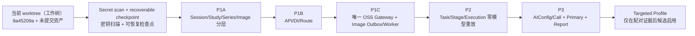

# MS-Image（影像服务）重构基线决策

状态：`CURRENT DECISION / P1_CODE_IMPLEMENTED / P2_PLUS_NOT_STARTED`（当前决策/P1 代码已实现/P2 及后续尚未开始）

更新日期：2026-08-19

决策对象：比较“回到 `9a45209a` 后重写”“直接在当前工作树继续修补”和“以当前工作树为资产基线做保留入口的内部模块化替换”。

## 1. 执行结论

推荐选择：

```text
以当前工作树作为资产基线，先建立不含 Secret（密钥）的可恢复 checkpoint（检查点），
再执行 existing-entry internal modular refactor（保留入口的内部模块化重构）。
```

实施进度更新（2026-08-19）：该决策已指导完成 P1（Session/Study/Series/Image、API、`ObjectStorageGateway`、Image Outbox/Relay/Worker、校验、替换与 finalize）代码，并在 `6dfd8d1`（`chore: close P1 imaging implementation`）收口。P1 仍是 `NOT_MIGRATED / NOT_RUNTIME_VALIDATED`（未迁移/未做真实运行验证）；P2+ 尚未开始，不能把本决策的“实现尚未开始”历史状态继续当作当前事实。

这不是“保留当前 `xray_accuracy` 设计继续修”，也不是“把所有文件推倒重写”。准确含义是：

1. 保留当前已经形成且仍适用于目标架构的公共入口和可靠性语义。
2. 按 P1A -> P1B -> P1C -> P2 的依赖顺序，新建通用影像领域合同并逐段替换 XRay 专项内部实现。
3. 同一时刻每类事实只有一个 owner（所有者），不建立第二套 API、Runner（执行器）、Outbox（事务发件箱）或数据库事实源。
4. 旧入口只在明确兼容期内做 Adapter（适配），不能拥有新事实。
5. 每个阶段独立通过工程门禁后才进入下一阶段；医学链必须另做 paired A/B（配对实验）和 isolated Holdout（隔离留出集）。

置信度：`DIRECT FOR GIT FACTS / INFERRED FOR REFACTOR CHOICE`（Git 事实为直接证据/重构选择为基于证据的判断）。

## 2. 先消除“两个版本”的误解

2026-08-18 初始重构基线核对结果（历史快照）：

| 事实 | 结果 | 结论 |
|---|---|---|
| 初始 `HEAD` | `9a45209ac9fce07ca5c7c209728d186ad411ae14` | 当时提交点就是用户指定节点 |
| 作者 | `zhichengmo <13410092+zhichengmo@user.noreply.gitee.com>` | 与用户给出的作者一致 |
| 提交时间 | `2026-08-08T12:04:08+08:00` | 与用户给出的时间一致 |
| 提交说明 | `Initial commit`（初始提交） | 该节点是仓库提交基线 |
| `9a45209a..HEAD` 提交数 | `0` | 仅在初始快照时成立；不能用于描述当前分支 |
| 已跟踪修改 | 27 个文件，约 `+1448/-1477` | 当前能力主要存在于未提交工作树；数字会随本轮文档校准继续变化 |
| 未跟踪文件 | 149 个实际文件 | 包含源码、文档、Worker、评测与 handoff（交接）等；数字会随新增文档变化 |
| 暂存区 | 空 | 当前没有可直接视为已审核 checkpoint 的 staged change（暂存修改） |
| 本地 `.env`（初始快照） | 当时未跟踪且未被 Git ignore（忽略）规则命中；含 15 个赋值，其中 3 个变量名属于 Secret/key/token（密钥/令牌）类别，未读取或记录其值 | 当时建立 checkpoint 前必须先阻止其进入版本控制；当前状态以 handoff 快照为准 |

初始决策时实际比较不是“旧 commit 对新 commit”，而是：

```text
A = 9a45209a 初始提交
B/C 的输入 = 9a45209a + 当前未提交工作树
```

当前分支已包含 P1 的提交；执行 `git reset --hard 9a45209a` 会同时丢失 P1 代码和当时未提交资产。本文禁止把这类破坏性操作当作重构起点；未跟踪 `.env` 也禁止进入 checkpoint。

## 3. 当前工作树中应该保留的资产

以下是“复用合同或语义”，不等于原文件必须原样不动：

| 资产 | 当前源码证据 | 为什么保留 | 目标归宿 |
|---|---|---|---|
| JWT（令牌）强校验和 scope（作用域） | `app/api/deps.py:36-67,108-131` 校验 issuer/audience/exp/sub 并执行 scope | 目标表去掉 `tenant_id` 不等于取消认证；可信 identity 是资源授权前提 | 保留认证入口，重构 tenant 专项 dependency（依赖）为 subject/service identity + resource owner 校验 |
| 分层 Readiness（就绪检查） | `app/core/readiness.py:32-96,99-104` 区分 Provider transport/receipt、Broker 状态 | 防止“API 能启动”被误当作“Worker/Provider 可运行” | 保留分层语义，改为目标通用 AIConfig/Provider 合同 |
| Provider qualification Artifact（服务提供方资格产物）签名 | `app/core/ai/qualification.py:186-207` 对 qualified 产物强制签名 | ControlPlane 激活配置需要可验证资格证据 | 保留签名、指纹、新鲜度和配置绑定语义 |
| OSS Object Key（对象键）与内容校验 | `app/core/imaging/object_store.py:39-44,84-104,133-248` 校验路径、大小、MIME、DICOM 和像素 | Image ready 必须来自服务端 bytes 校验 | 收敛为唯一 ObjectStorageGateway；替换 tenant/XRay key 规则，保留校验能力 |
| Celery 至少一次投递基础 | `workers/xray_accuracy_worker/celery_app.py:26-31` 使用 `acks_late`、`reject_on_worker_lost` | 与 Outbox/Lease/CAS 配合可支撑崩溃恢复 | 保留投递语义，Worker 只做入口，状态机移入 ImagingExecutionService |
| FastAPI + Service + DAL + Schema 分层 | `AGENTS.md` 和现有 `app/core/crud.py` 的 `DalBase` 合同 | 目标实现无需创造第二套 Repository/DatabaseService | 所有新领域模块统一走 API -> Service -> DAL -> Model/DB |
| 当前文档、资格证据与 handoff | `docs/`、`.agent-handoff/`、`AGENT_HANDOFF.md` | 保存设计理由、未决风险和开发恢复入口 | 继续作为分轴权威，不把设计写成已实现 |

保留资产的标准不是“代码写了很多”，而是它拥有仍然成立的安全、可靠性或外部合同，并且可以在新领域模型中单独验证。

## 4. 当前工作树中必须替换的专项债务

| 债务 | 当前源码证据 | 问题 | 处理方式 |
|---|---|---|---|
| `xray_accuracy_*` 专项表/类 | `app/models/xray_accuracy/run.py:8-24` 等 | 把通用影像执行事实绑定到 XRay accuracy 专题 | 用 Session/Study/Series/Image/Task/Stage/Call/Report 通用领域模型分阶段替换 |
| 目标表中的 `tenant_id` | `app/models/xray_accuracy/run.py:11-24` 有 tenant 索引、联合约束和字段 | 与全局资源 ID + owner 授权的目标合同冲突 | 目标表不保存 tenant；旧 claim 只作兼容访问范围，不能写回目标模型 |
| validation-only（仅验证）硬编码 | `app/schemas/xray_accuracy/run.py:22-36` 强制 `Literal[True]` | 只能证明当前工程骨架，不能承载目标医学 Profile | 由冻结 Task/Profile/run_mode 合同替代；资格门禁仍独立保留 |
| XRay Run 过载字段 | `app/models/xray_accuracy/run.py:46-88` 混合 operation、发布指纹、工程资格、交付和执行模式 | 多个 owner/状态维度塞进一表，易形成重复事实 | 分回 Task、Config、Stage/Call 和 Report 各自 owner；首期无 callback/ack 就不保留 delivery 生命周期 |
| `TechnicalExecutor/XRayLifecycleService` | `app/service/xray_accuracy/technical_executor.py`、`lifecycle_service.py` | XRay 专项执行、生命周期和数据库协调耦合 | 用业务 Service + ImagingExecutionService + 注册 Stage 替换 |
| `LegacyCompatService`（旧兼容服务）拥有过多编排 | `app/service/xray_accuracy/legacy_compat_service.py:97-520` | 兼容层可能成为第二事实源 | 最终只允许无状态请求/响应适配和旧 ID 查询映射，不创建新医学事实 |
| tenant/XRay 派生 OSS key | `app/core/imaging/object_store.py:59-82` | 公共影像底座被租户和 XRay 命名污染 | 新 key 使用领域 owner namespace + 全局 image ID + generation；旧 key 只读适配 |

“代码可以完全重构”授权适用于这些内部债务；它不要求丢弃已经验证的公共安全语义，也不允许跳过迁移、回滚和证据门禁。

## 5. 三种方案的证据评分

等级：`Strong`（强）、`Moderate`（中）、`Weak`（弱）、`Unknown`（未知）。复杂度项表示“复杂度是否与收益相称”。

| 维度 | A：reset 到 9a45209a 后全量重写 | B：当前工作树继续局部修补 | C：当前资产基线 + 内部模块化替换 |
|---|---|---|---|
| Failure fit（故障归属匹配） | Moderate：能重画领域，但会同时重做无问题基础设施 | Weak：专项模型、执行和报告跨边界，局部修补会转移问题 | Strong：直接替换错误领域边界并保留有效基础能力 |
| Causal isolation（因果隔离） | Weak：一次改变认证、存储、执行、领域和医学链 | Weak：旧新语义混杂，难判断哪次补丁改变结果 | Strong：P1/P2/医学 Profile 分阶段，各阶段有独立门禁 |
| Contract reuse（合同复用） | Weak：丢弃 auth/readiness/OSS/qualification/worker 语义 | Moderate：复用多，但旧专项合同继续渗透 | Strong：明确列出 preserve/replace 边界 |
| Source-of-truth count（事实源数量） | Moderate：最终可单一，但迁移期容易另起一套 | Weak：兼容服务、Run 和目标模型容易并存 | Strong：新事实逐 owner 替换，禁止第二套 Runner/Outbox/DB owner |
| Compatibility（兼容性） | Weak：公共入口和历史调用容易一次性断裂 | Moderate：表面兼容强，内部语义不稳定 | Strong：入口保留、内部替换、适配层有退出门禁 |
| Incremental proof（增量证明） | Weak：到全链完成前难形成可信检查点 | Moderate：可测局部，但无法清楚冻结目标边界 | Strong：P1A/B/C、P2、Primary、Targeted 各自独立验收 |
| Rollback（回滚） | Weak：没有已知迁移/回滚基线 | Moderate：可回文件，但数据解释会继续纠缠 | Strong：Profile/阶段开关 + checkpoint + 单 owner 切换 |
| Complexity（复杂度合理性） | Weak：重复建设成本高 | Weak：长期兼容债务持续增长 | Strong：只保留有独立 owner/事务/失败语义的层 |
| Unknowns（关键未知项控制） | Weak：会同时放大生产、迁移、Provider 和数据未知 | Weak：容易被补丁掩盖 | Moderate：仍有外部 UNKNOWN，但能在进入对应阶段前阻断 |

结论：C 是满足 failure fit（故障匹配）、causal isolation（因果隔离）和 incremental proof（增量证明）的最小方案。

## 6. 为什么不选择另外两种方案

### 6.1 不选择 A：回退后全量重写

- `HEAD` 已经是 `9a45209a`，reset 只会删除未提交资产，不会获得更合适的历史版本。
- 认证、OSS 校验、资格签名和可靠投递不是当前领域错误的主要 owner，重写它们扩大了回归面。
- 真实数据库迁移、对象兼容和旧 API 退出合同仍是 `UNKNOWN`；在这些未知下全量重写没有安全切换路径。
- 医学准确率问题尚未与工程失败完全分离；一次改变整条链会让 paired experiment（配对实验）不可解释。

### 6.2 不选择 B：在现状上继续零散修补

- 当前问题跨 Model（模型）、Service（业务服务）、Worker（工作进程）、AI Call（AI 调用）和 Report（报告）边界，已经超过单点修正。
- `xray_accuracy`、`tenant_id`、validation-only 和 LegacyCompat 会继续向目标表/接口泄漏。
- 逐文件改名不能建立唯一医学 owner、冻结 Task、Study revision 和 Stage/Call 恢复合同。
- 它最容易形成“旧 Run + 新 Task”“旧 OSS Gateway + 新 Gateway”之类双事实源。

### 6.3 为什么 C 不是折中妥协

C 对专项领域代码允许完全替换，只对有证据的公共合同做复用。它同时满足：领域边界可以重建、外部风险可控、
每个阶段可验证、医学实验可归因。因此它是范围最小的充分重构，不是为了少改代码。

## 7. 推荐实施边界



### 7.1 P0/P1：已完成的代码阶段与剩余门禁

1. 初始 checkpoint、Secret、事务外 I/O、身份、Broker、Trace/Audit 和启动合同核对已支撑 P1 实施；继续保护 `.env` 和任何真实 Secret，不得 reset/clean 或批量覆盖当前文件。
2. P1 已完成代码提交，但不能标成目标 schema 已实现或真实环境通过。
3. 真实 MySQL/OSS/RabbitMQ 演练、迁移设计与执行仍需单独授权；它们是 P1 运行门禁而不是代码重写理由。

### 7.2 P1/P2：先闭环通用影像和零模型执行

- P1A（已完成代码）：Session/Study/Series/Image 的 Model -> Schema -> DAL(DalBase) -> Service。
- P1B（已完成代码）：API、dependency injection（依赖注入）、route registration（路由注册）；ID 只用 query/body。
- P1C（已完成代码）：唯一 ObjectStorageGateway + Image `validating`/Outbox/Relay/Worker/reconcile/revision。
- P2（尚未开始）：复用同一 Outbox/Relay，实现 Task + first Stage 原子创建、Lease/CAS 和 zero-model replay（零模型重放）。
- P1/P2 不接医学 Provider，不生成未授权迁移或测试脚本，不操作真实数据库。

### 7.3 P3 以后：医学链按实验变量推进

1. 先实现 `xray_primary_v1`，冻结模型、Prompt、Schema、完整 Study 输入和 scorer（评分器）。
2. Primary 工程与医学基线通过后，才实现 `xray_targeted_review_v1` 候选。
3. FamilyRouting + TargetedReview 必须成对作为一个候选 Profile；不得混入默认链。
4. 用相同病例、原图、Primary 配置、scorer 和计划做 paired A/B；最后才使用 isolated Holdout。

## 8. Preserve/Replace（保留/替换）文件级原则

| 类别 | 原则 |
|---|---|
| `app/api/deps.py`、`app/core/readiness.py` | 保留安全语义，逐步抽离 tenant/XRay 专项命名；修改前完整阅读 |
| `app/core/imaging/object_store.py` | 保留校验实现，收敛为唯一 Gateway；替换新对象 key 规则，旧 key 只读兼容 |
| `app/core/ai/qualification.py` | 保留签名和指纹资格语义，改为通用 Config/Provider 引用 |
| `app/core/crud.py` | 保留唯一 `DalBase`；不得另建 Repository 或 CRUDBase |
| `app/models/xray_accuracy`、`app/schemas/xray_accuracy`、`app/crud/xray_accuracy`、`app/service/xray_accuracy` | 视为待替换专项领域，不作为目标表/类命名模板 |
| `workers/xray_accuracy_worker` | 保留投递/ACK 语义，逐步把业务状态机移入 ImagingExecutionService 并改通用命名 |
| `docs/`、`.agent-handoff/` | 保留并同步事实等级；历史正文不作为实施合同 |

## 9. Stop（停止）与 Rollback（回滚）条件

| 触发条件 | 立即动作 | 回滚/恢复 |
|---|---|---|
| 当前工作树无法建立不含 Secret 的可恢复 checkpoint | 停止大范围代码替换 | 只做只读核对和文档修正，等待用户确认基线方式 |
| 新模块要求第二套 Outbox/OSS Gateway/Runner/数据库事实源 | 停止该设计 | 回到同一基础设施扩展方案 |
| P1 出现 owner 越权、Image 未完整校验即可 ready、revision 被覆盖 | P1 No-Go（禁止进入下一阶段） | 关闭新入口，保留旧只读路径，修复后重验 |
| P2 出现重复 Provider 调用、旧 lease 覆盖或事务内外部 I/O | P2 No-Go | 禁止接 Provider，回到 zero-model replay 修复 |
| Targeted 触发后通过回退 Primary 隐藏失败 | 候选立即禁用 | 回滚到 `xray_primary_v1` |
| paired A/B 不可解释、正常误报或异常漏诊越过护栏 | 医学候选 No-Go | 保持 Primary 基线，不能用工程成功率放行 |
| Holdout 泄漏或 Gold/分母被候选修改 | 整次评测作废 | 重新冻结未污染数据和预注册合同 |

## 10. 尚未确认的事实

- 生产 API/Admin/Worker 启动和资源合同。
- 新 owner authorization（资源归属授权）与旧 tenant claim 的精确退出门禁。
- 新 OSS namespace、bucket/region/KMS/retention（保留策略）和历史对象只读期限。
- 真实数据库 schema、旧数据量、兼容 API 使用量和可接受停机/双读窗口。
- 候选 Provider 的真实 model ID、图像/Schema/receipt 能力及保留政策。
- 冻结 Gold、病例级 split、Failure Bank 和 isolated Holdout 的规模与质量。

这些 UNKNOWN（未知项）不改变 P1 已完成代码的事实，但会分别阻止 P1 真实迁移/运行验证、真实 Provider、医学发布和旧链退出。

## 11. 对新会话的最终指令

```text
不要 reset/clean 到 9a45209a；当前分支已包含 P1 提交。
先读取当前 `HEAD`、P1 已提交源码与 handoff，保护 .env/Secret 和所有未提交资产。
保留 auth/readiness/OSS validation/provider qualification/outbox-worker 的有效语义，
不要重写 P1；后续仅按当前授权进入真实 P1 演练或 P2 内部模块化替换 xray_accuracy/tenant/validation-only 专项领域。
同类事实只允许一个 owner；未通过零模型可靠执行前不接医学 Provider。
```
