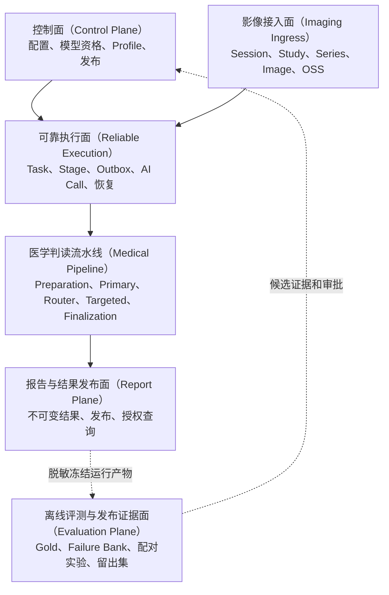
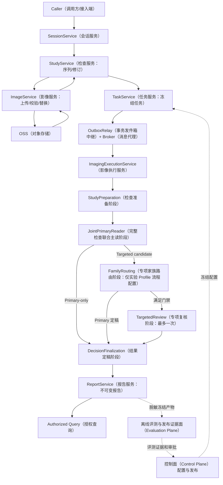
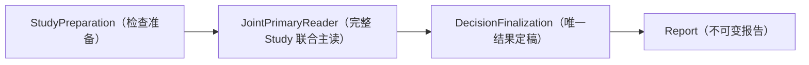
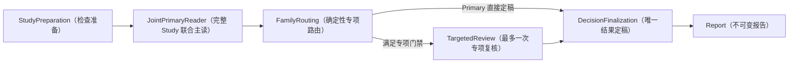
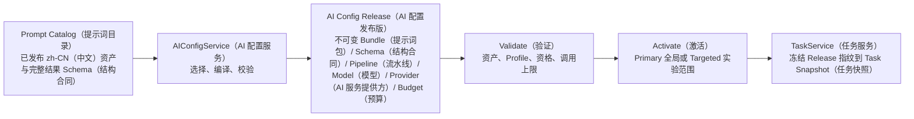
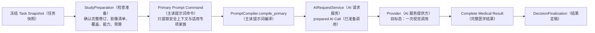
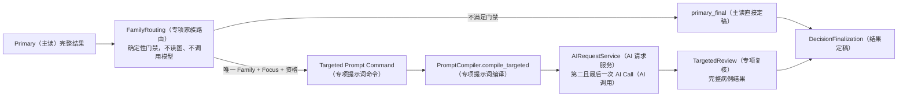
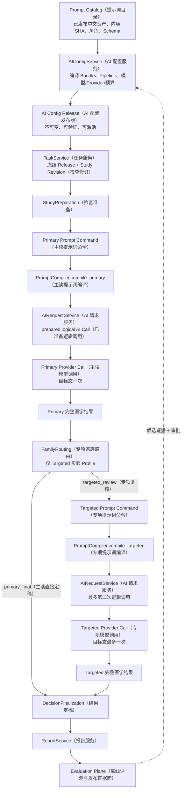

# MS-Image XRay（X 光）完整核心架构与专项设计

状态：`CURRENT_CONSOLIDATED_ARCHITECTURE / PROVIDER_DISABLED_FULL_CHAIN_PASSED / RUNTIME_NOT_VALIDATED / MEDICAL_RELEASE_NO_GO`（当前统一架构/Provider 关闭模式全链已通过/真实运行未验证/医学发布禁止放行）

更新日期：2026-08-20

适用范围：MS-Image 总体边界、数据库事实、业务模块、XRay 完整链路、逐层责任、专项体系、医学主链、条件专项复核、控制面、评测面、报告边界和架构取舍。

本文是一份自包含的 XRay 架构交付文档。读者不需要跳转其他设计文档即可理解总体架构、完整流程、逐层输入输出和专项设计。本文不展开类、函数、字段清单或实现代码。

术语标注规则：所有业务英文概念按“英文（中文）”标注；表名、状态键、配置键等代码标识保留英文，但在同一行的中文用途、状态说明或表格列中标明含义。

### 0.0 核心术语中英对照

| 英文术语 | 中文含义 |
|---|---|
| Session | 影像诊疗会话 |
| Study | 影像检查 |
| Series | 影像序列 |
| Image | 影像对象 |
| Task | 诊断或分析任务 |
| Stage | 执行阶段 |
| Outbox | 事务发件箱 |
| AI Config | AI 配置 |
| AI Call | AI 调用 |
| Report | 报告 |
| Evaluation | 离线评测 |
| Job | 评测任务 |
| Run | 评测运行 |
| Artifact | 评测产物 |
| Prompt | 提示词 |
| Schema | 结构合同 |
| Profile | 流程配置 |
| Provider | AI 服务提供方 |
| Model | AI 模型 |
| Finding | 影像发现 |
| Family | 临床专项家族 |
| Focus | 专项关注点 |
| Strategy | 复核策略 |
| Owner | 医学结果所有者 |
| Prepared Study | 已准备检查 |
| Complete Medical Result | 完整医学结果 |
| Primary | 主读结果或主读阶段 |
| Targeted Review | 专项复核 |
| Control Plane | 控制面 |
| Imaging Ingress | 影像接入面 |
| Reliable Execution | 可靠执行面 |
| Medical Pipeline | 医学判读流水线 |
| Report Plane | 报告与结果发布面 |
| Evaluation Plane | 离线评测与发布证据面 |
| CAS | 比较并设置 |
| lease | 租约 |
| deadline | 截止时间 |
| unknown | 调用结果未知、等待对账 |
| review_required | AI 无法确定 |
| non_diagnostic | 医学上不可判读 |
| not_produced | 未产生医学结论 |

## 0. 总体集成架构

### 0.1 当前实施状态

截至 2026-08-19，当前代码已经完成 Provider（AI 服务提供方）关闭模式下从在线影像链、Task（任务）/Stage（阶段）、报告到 Evaluation（离线评测）的组合验收，证明主要工程合同可以在不调用真实医学模型的情况下闭环。

当前可以确认：

- 影像接入、任务执行、报告和评测代码链已经形成；
- Provider（AI 服务提供方）关闭模式的完整工程链已经通过组合验收；
- Evaluation（离线评测）与在线 Task（任务）、Report（报告）、Config（配置）保持隔离；
- 重复消息、取消、迟到写回、Artifact（评测产物）漂移、Stage（阶段）/Evaluation（离线评测） lease（租约）和动态 Targeted（专项复核）上限已经进行 fake（模拟）验收；
- 实际数据库结构尚未应用到真实环境；
- 真实 MySQL、OSS、RabbitMQ 和 Provider 尚未演练；
- 真实模型资格和 AI 测试尚未开始；
- 医学准确率仍为 UNKNOWN；
- 医学发布仍为 NO-GO。

因此，本文中的医学链和专项设计仍是待真实模型、真实数据和医学评测验证的架构合同，不能因工程链通过而写成医学能力已经完成。

### 0.2 系统目标和边界

MS-Image 负责兽医影像从业务会话开始，到影像检查接入、对象存储、AI 执行、结果定稿、报告查询和离线评测的闭环。

MS-Image 自己拥有：

- Session（影像诊疗会话）；
- Study（影像检查）；
- Series（影像序列）；
- Image（影像对象）；
- Task（诊断或分析任务）；
- Stage（执行阶段）；
- Outbox（事务发件箱）；
- AI Config（AI 配置）；
- AI Call（AI 调用）；
- Report（报告）；
- Evaluation Job、Run 和 Artifact（评测任务、运行和产物）。

MS-Image 不拥有用户、宠物、病历正文、订单、支付、额度和组织等公共业务主数据，只保存完成影像任务所需的不透明业务引用和受信身份。

### 0.3 总体责任面

讲解和文档统一使用以下中文名称：

| 英文名称 | 统一中文名称 | 一句话职责 |
|---|---|---|
| Control Plane | 控制面 | 决定新任务允许使用哪套配置、模型和发布版本 |
| Imaging Ingress | 影像接入面 | 将上传对象变成可信、可版本化的 Study 输入 |
| Reliable Execution | 可靠执行面 | 保证异步任务、调用、重试、恢复和终态事实可靠 |
| Medical Pipeline | 医学判读流水线 | 产生并选择唯一完整医学结果 |
| Report Plane | 报告与结果发布面 | 固化、发布和授权查询被选医学结果 |
| Evaluation Plane | 离线评测与发布证据面 | 用冻结数据判断候选是否值得进入发布配置 |



| 责任面 | 核心职责 | 明确不负责 |
|---|---|---|
| 控制面（Control Plane） | 冻结模型、Prompt、Schema、专项目录、预算和发布配置 | 不运行病例诊断，不直接修改报告 |
| 影像接入面（Imaging Ingress） | 保证图像、顺序、版本、投照和检查修订可信 | 不判断医学正常或异常 |
| 可靠执行面（Reliable Execution） | 保证幂等、恢复、租约、超时和唯一调用事实 | 不根据医学结果好坏重试 |
| 医学判读流水线（Medical Pipeline） | 产生和选择唯一完整医学结果 | 不管理上传、对象存储或发布权限 |
| 报告与结果发布面（Report Plane） | 持久化、展示和授权查询被选医学结果 | 不补充、删除或改写 Finding |
| 离线评测与发布证据面（Evaluation Plane） | 判断候选是否真正改善准确率和安全护栏 | 不直接激活配置，不参与在线医学判断 |

### 0.4 数据库事实架构

目标在线数据库以十类核心事实组成：

| 表 | 中文用途 | 唯一事实所有权 |
|---|---|---|
| `session_record` | 会话记录 | 一次影像业务生命周期、幂等和关闭/取消 |
| `study_record` | 检查记录 | 检查修订、完整性、当前影像集合和就绪状态 |
| `series_record` | 序列记录 | 检查内影像分组和序列清单 |
| `image_record` | 影像记录 | 对象存储引用、版本、校验、替换和隔离 |
| `task_record` | 任务记录 | 一次冻结的业务执行请求和双状态终点 |
| `stage_checkpoint_record` | 阶段检查点 | 单个 Stage 的状态、租约、输入输出和恢复 |
| `outbox_record` | 事务发件箱 | 数据库事实提交后的可靠事件发布 |
| `ai_config_record` | AI 配置 | Pipeline、Prompt、Schema、模型、Provider、预算和发布版本 |
| `ai_call_record` | AI 调用 | 每个逻辑 Provider 请求、发送清单、回执、结果和处置 |
| `report_record` | 报告记录 | 不可变医学结果、来源和发布/作废生命周期 |

隔离评测数据库以四类事实组成：

| 表 | 中文用途 | 唯一事实所有权 |
|---|---|---|
| `evaluation_job_record` | 评测任务 | 预注册输入、指标、审批、状态和租约 |
| `evaluation_outbox_record` | 评测发件箱 | 评测任务的可靠发布 |
| `evaluation_run_record` | 评测运行 | 冻结配置和单次执行结果 |
| `evaluation_artifact_record` | 评测产物 | Dataset、Gold、病例结果、指标、失败分析和审批证据 |

设计原则：

- 不使用数据库 Foreign Key；逻辑关系由 Service 在事务中验证；
- 不使用数据库 Enum；状态和类型使用可演进字符串；
- 每张表使用独立、非空、服务端生成的单列主键；
- 不建设公共文件资产表；OSS 保存字节，领域表保存完整 ObjectRef；
- 同一事实只由一个表拥有，其他表只保存冻结引用；
- Family、Focus、Strategy 和 Prompt 角色属于版本化 Config，不按专项拆表。

### 0.5 模块和 Service（业务服务）架构

在线核心业务 Service：

| Service（业务服务） | 中文职责 | 主要事实 |
|---|---|---|
| SessionService（会话服务） | 会话生命周期和幂等 | Session（会话） |
| StudyService（检查服务） | Study（检查）/Series（序列）、修订、清单和完整性 | Study（检查）、Series（序列） |
| ImageService（影像服务） | 上传、校验、替换、隔离和对象对账 | Image（影像）、Image Outbox（影像发件箱） |
| TaskService（任务服务） | 冻结 Study（检查）、Config（配置）、Profile（流程配置）、预算并启动任务 | Task（任务）、首 Stage（阶段）、Outbox（事务发件箱） |
| ImagingExecutionService（影像执行服务） | Stage（阶段） claim（领取）、lease（租约）、CAS（比较并设置）、路由、恢复、取消和完成 | Task（任务）、Stage（阶段）、Outbox（事务发件箱）、Call（调用）、Report（报告）协调事务 |
| AIConfigService（AI 配置服务） | 不可变配置、资格、激活和回滚 | AI Config（AI 配置） |
| AIRequestService（AI 请求服务） | Prompt（提示词）/Schema（结构合同）组装、Provider（AI 服务提供方）调用、预算、回执和 unknown（未知结果）对账 | AI Call（AI 调用）、Call Outbox（调用发件箱） |
| ReportService（报告服务） | 不可变报告、当前报告指针、发布、作废和查询 | Report（报告）、Task（任务）当前报告 |

目标 Stage：

| Stage（阶段） | 类型 | 是否调用模型 | 核心职责 |
|---|---|---:|---|
| StudyPreparation（检查准备阶段） | 公共阶段 | 否 | 组装冻结 Study（检查），校验输入、覆盖、能力和预算 |
| JointPrimaryReader（完整检查联合主读阶段） | XRay 医学阶段 | 是 | 一次读取完整 Study（检查），输出完整病例结果 |
| FamilyRouting（专项家族路由阶段） | XRay 实验阶段 | 否 | 验证是否满足一次专项复核门禁 |
| TargetedReview（专项复核阶段） | XRay 实验医学阶段 | 是 | 围绕一个 Focus（关注点）重新读取完整 Study（检查）并输出完整病例结果 |
| DecisionFinalization（结果定稿阶段） | 公共阶段 | 否 | 校验并选择唯一医学结果所有者 |

公共组件：

- ObjectStorageGateway（对象存储网关）：对象存储上传、读取和完整性校验；
- StageRegistry（阶段注册表）：按精确版本解析 Stage（阶段）；
- PipelineProfileValidator（流程配置校验器）：校验固定 Profile（流程配置）、顺序、调用上限和强制门禁；
- OutboxRelay（事务发件箱中继）：数据库提交后可靠发布消息；
- ProviderClientRegistry（AI 服务提供方客户端注册表）：解析已经资格化的 Provider（AI 服务提供方）客户端；
- AuditSink（审计接收器）：承载仅追加审计事实。

业务调用统一遵循 API（接口）/Worker（异步工作进程） -> Service（业务服务） -> DAL（数据访问层） -> Model（数据模型）/DB（数据库）。外部 I/O（输入输出）不在数据库事务中执行。

### 0.6 XRay 完整主链



### 0.7 影像上传到 Study 就绪

1. 调用端创建 Session、Study 和 Series。
2. ImageService（影像服务）创建上传中的影像事实并签发短期上传授权。
3. 调用端在数据库事务外上传对象到 OSS。
4. 上传完成后，ImageService（影像服务）在短事务中把影像推进到校验中，并创建校验 Outbox（事务发件箱）。
5. Relay 在事务提交后发布校验消息。
6. Worker 领取 Image 校验租约，在事务外读取对象并检查版本、大小、摘要、格式和安全边界。
7. 校验成功后，Image、Series 清单和 Study 修订在同一终态事务中推进；失败进入隔离。
8. 只有必需影像完整、身份一致且清单无冲突时，Study 才能就绪。

上传成功不等于影像就绪；单次 HEAD、ETag 或调用端声明不能单独成为最终真相。

### 0.8 Task 创建和可靠执行

1. TaskService（任务服务）只接受就绪的 Study（检查）修订。
2. Task 创建时冻结图像清单、AI Config、Profile、Prompt、Schema、模型计划、预算和截止时间。
3. Task、首 Stage 和首执行 Outbox 在同一事务中创建。
4. Relay 事务外发布消息，Worker 通过 Stage lease 和状态版本领取执行权。
5. Stage 外部动作在事务外完成；结果在新短事务中写回并创建下一事件。
6. 重复消息、租约过期和 Worker 崩溃由数据库状态、CAS 和 reconcile 吸收。
7. Task 终态后返回的结果只能标记迟到或忽略，不能覆盖当前报告。

### 0.9 Provider 调用边界

1. 每个逻辑调用在发送前先持久化准备事实。
2. 完整图像发送清单、Prompt、Schema、模型和配置摘要可追溯。
3. Provider 调用在事务外执行。
4. 明确未发送的传输失败可以在预算内重试。
5. Provider 是否接收不可证明时进入 unknown，并使用原幂等身份对账。
6. 医学结果不满意不能成为重试理由。
7. actual model、Schema、回执或完整发送不满足时，结果不能成为医学所有者。

### 0.10 结果定稿、报告与离线评测

1. DecisionFinalization（结果定稿阶段）校验当前 Profile（流程配置）、路由和唯一 accepted（已接受）医学结果。
2. 结果定稿 Stage（阶段）、不可变 Report（报告）、Task（任务）医学/工程状态和当前报告指针在同一事务中完成。
3. ReportRenderer（报告渲染器）只能排序、翻译和格式化，不能修改 Finding（影像发现）。
4. 报告发布和作废只推进 Report（报告）生命周期，不重写医学内容。
5. 离线评测与发布证据面（Evaluation Plane）只读取脱敏冻结产物，不能修改在线 Task（任务）、Report（报告）或 Active Config（已激活配置）。
6. 评测候选必须经过审批，控制面（Control Plane）才能激活新的配置修订。

### 0.11 逐层责任、输入、输出和数据落点

| 层 | 目的 | 主要输入 | 主要输出 | 失败语义 | 事实落点 |
|---|---|---|---|---|---|
| 控制面（Control Plane） | 决定新 Task（任务）可使用的配置 | 候选配置、资格和评测证据、审批 | 冻结 Active Config（已激活配置）/Profile（流程配置） | 拒绝激活，不影响运行中 Task（任务） | AI Config（AI 配置）、审计 |
| SessionService（会话服务） | 建立业务生命周期根 | 受信身份、业务引用、幂等键 | Session（会话）状态与版本 | 越权、幂等或状态冲突 | Session（会话） |
| StudyService（检查服务） | 组织检查、序列和修订 | Session（会话）、检查计划、已验证 Image（影像） | 就绪 Study（检查）修订和有序清单 | 不完整、身份或修订冲突 | Study（检查）、Series（序列） |
| ImageService（影像服务） | 保证对象真实、完整且归属正确 | 上传命令、OSS（对象存储）对象和校验事件 | 已验证影像引用或隔离状态 | 对象、摘要、格式、归属错误 | Image（影像）、Outbox（事务发件箱） |
| TaskService（任务服务） | 冻结一次可重放请求 | 就绪 Study（检查）、Active Config（已激活配置）、任务类型和预算 | Task（任务）、首 Stage（阶段）、Outbox（事务发件箱） | Study（检查）/配置/预算不满足则不启动 | Task（任务）、Stage（阶段）、Outbox（事务发件箱） |
| ImagingExecutionService（影像执行服务） | 推进、恢复和结束 Stage（阶段） | 事件、Task（任务）/Stage（阶段）冻结事实、租约 | 下一 Stage（阶段）、重试、对账或终态 | 租约、CAS（比较并设置）、截止时间或恢复失败 | Task（任务）、Stage（阶段）、Outbox（事务发件箱）、Call（调用）、Report（报告） |
| StudyPreparation（检查准备阶段） | 形成允许模型调用的规范输入 | Task（任务）快照、Study（检查）修订、图像、能力和预算 | Prepared Study（已准备检查）或调用前终止 | 输入不可信为工程失败；覆盖/能力不足为不产生医学结果 | Stage（阶段）输出 |
| JointPrimaryReader（完整检查联合主读阶段） | 产生完整病例医学结果 | 完整 Study（检查）、最小临床上下文、冻结配置 | 完整医学结果和可选专项候选 | Provider（AI 服务提供方）、发送、Schema（结构合同）失败为工程失败 | Stage（阶段）输出、AI Call（AI 调用） |
| FamilyRouting（专项家族路由阶段） | 判断是否允许一次专项复核 | Primary（主读）完整结果、覆盖、专项目录、预算 | Primary（主读）定稿或专项复核决定 | 配置合同破坏为工程失败；普通不满足则 Primary（主读）定稿 | Stage（阶段）输出 |
| TargetedReview（专项复核阶段） | 对一个 Focus（关注点）进行完整病例复核 | 完整 Study（检查）、Primary（主读）结果、唯一 Family（专项家族）/Focus（关注点） | 新的完整医学结果 | 技术失败不静默回退 | Stage（阶段）输出、AI Call（AI 调用） |
| DecisionFinalization（结果定稿阶段） | 选择唯一医学所有者 | Profile（流程配置）、路由、accepted（已接受）Stage（阶段）/Call（调用） | 最终结果选择 | 来源不一致或结果不完整为工程失败 | Stage（阶段）输出 |
| ReportService（报告服务） | 持久化和发布不可变报告 | 最终结果和来源 | Report（报告）revision（修订）、当前指针和查询结果 | 最终事务失败整体回滚 | Report（报告）、Task（任务）当前报告 |
| 离线评测与发布证据面（Evaluation Plane） | 评测候选并产生发布证据 | 冻结病例、Gold（可信金标准）、实验和 scorer（评分器） | 指标、失败分析和候选证据 | 比较变量或分母不一致则不可解释 | Evaluation Job/Run/Artifact（评测任务/运行/产物） |

### 0.12 状态和失败语义

Task 必须把工程状态和医学状态分开：

| 场景 | 工程状态 | 医学状态 | 报告 |
|---|---|---|---|
| 模型判断正常 | 已完成 | normal | 医学报告 |
| 模型判断异常 | 已完成 | abnormal | 医学报告 |
| 模型无法确定 | 已完成 | review_required | 医学报告，明确不确定原因 |
| 模型判断影像不可诊断 | 已完成 | non_diagnostic | 医学报告，明确不可判读原因 |
| 调用前覆盖、能力或预算不足 | 已完成 | not_produced | 可生成无医学结论的技术说明 |
| Provider、发送、Schema 或恢复失败 | 失败或死信 | not_produced | 不生成医学报告 |
| 用户取消 | 已取消 | not_produced | 不生成新的医学报告 |

必须牢记：消息发布成功不等于 Stage 完成，Stage 完成不等于模型成功，模型成功不等于 Schema 通过，Schema 通过不等于医学准确，工程完成也不等于医学正常。

## 1. 执行结论

推荐采用“完整 Study 联合主读 + 条件专项复核”的分层架构，但分两个阶段放行：

1. 首期生产候选只使用完整 Study 联合主读。
2. 专项首先用于报告结构、失败归因和评测分层。
3. 专项复核只作为实验 Profile，不能默认进入所有病例。
4. 每个病例最多触发一个专项复核，专项复核仍必须重新输出完整病例结果。
5. Python、Router、报告渲染和多数票都不能修改医学结论。
6. 是否启用专项复核，只能由同病例配对实验和独立留出集决定。

首期主链：



实验候选链：



## 2. 项目真正要解决的问题

XRay 准确率问题不能简单归因于“模型不够强”或“调用次数不够多”。完整链路至少同时面对五类问题：

| 问题 | 如果处理不好会发生什么 |
|---|---|
| 输入完整性 | 模型没有看到完整病例，却被当成医学判断失败 |
| 影像覆盖 | 缺失投照或部位不完整，被错误解释为正常 |
| 医学主读 | 模型遗漏异常、误报正常结构或过度输出不确定 |
| 可靠执行 | 重复消息、超时和结果未知产生第二次调用或错误报告 |
| 评测治理 | 不同图像、Prompt、模型和分母混在一起，无法证明哪项改动有效 |

因此架构目标不是“把 XRay 拆成尽可能多的专项”，而是：

- 保证模型看到可信且完整的 Study；
- 保证医学结论只有一个所有者；
- 保证每次改动都能被公平比较；
- 保证失败不会被伪装成正常或医学不可诊断；
- 保证专项增加的复杂度可以被单独证伪。

## 3. 四种可选架构的辩证比较

| 方案 | 优点 | 主要缺陷 | 结论 |
|---|---|---|---|
| 每个系统或器官默认独立调用 | 专项 Prompt 可以很细，便于定位局部失败 | 调用数高；输出高度相关；容易产生冲突、投票和报告拼接；正常误报可能累积 | 不作为默认链 |
| 单次完整 Study 联合主读 | 最短、低成本、病例关系完整、医学所有者清晰 | Prompt 负载大；模型可能对局部专项关注不足；无法自动补救静默漏诊 | 首期生产基线 |
| 联合主读 + 条件专项复核 | 保留完整病例上下文，同时对少数可解释问题增加一次复核 | Router 依赖 Primary 候选；配置和评测复杂；技术失败处理困难 | 推荐为实验候选 |
| 多 Reader、多 Agent 辩论或多数票 | 表面上能增加不同视角 | 同源模型并非独立证据；成本、延迟和不可重复性高；最终医学所有者模糊 | 当前不采用 |

推荐方案不是理论上最复杂的方案，而是最容易建立清晰对照、回滚和责任边界的方案。

## 4. 专项链在六个责任面中的约束

- 控制面只决定哪个专项目录、Prompt、模型和 Profile 可以被新 Task 使用。
- 影像接入面只提供可信 Study、投照和覆盖事实，不根据图像内容决定专项医学结论。
- 可靠执行面只保证 Targeted 最多一次、幂等、预算、超时和恢复，不根据结果好坏重问。
- 医学流水线只允许 Primary 或成功的 Targeted 成为唯一结果所有者。
- 报告面只展示被选完整结果，不能拼接 Primary 与 Targeted 的局部内容。
- 评测面只验证专项策略的净收益，不能在在线请求中修改路由或结论。

## 5. 专项是什么

专项是完整 Study 上的临床评估包，需要同时满足：

- 有明确的临床问题边界；
- 有明确的影像覆盖和投照要求；
- 有稳定的报告子域；
- 有可以独立统计的评测分母；
- 有可以被证伪的专项关注点；
- 不依赖一张局部图或一个技术坐标直接产生医学结论。

专项不是：

- 模态；
- 物种；
- 解剖部位；
- 器官名称；
- 裁剪或分割任务；
- Prompt 文件；
- 一张数据库表；
- 默认额外模型调用。

## 6. 十个必须正交的轴

| 轴 | 作用 | 示例 |
|---|---|---|
| 影像模态 | 定义技术输入合同 | XRay、CT、MRI |
| 物种上下文 | 当前写入冻结 Prompt（提示词）上下文；未来可用于选择物种专用知识模块 | 犬、猫 |
| 解剖区域 | 当前写入冻结 Prompt 上下文和覆盖事实；它是区域元数据，不是裁剪图；专项选择仍由独立专项家族键决定 | 胸腔、腹腔、脊柱、前肢 |
| 投照与覆盖 | 判断某专项能否被评估 | 侧位、VD、单视图、覆盖充分 |
| 临床专项 | 组织完整临床评估包 | 胸腔、腹腔、四肢骨关节 |
| 报告子域 | 组织同一专项内的 Findings | 呼吸、心血管、泌尿生殖 |
| 专项关注点 | 表达一次专项复核的唯一问题 | 肺野模式、泌尿矿化、骨折/脱位 |
| 复核策略 | 表达如何复核一个关注点 | 高召回、正常闭环、冲突处理 |
| 技术证据 | 提供定位、质量或派生图 | 分割、裁剪、标志点 |
| 流水线配置 | 决定是否执行专项复核 | Primary-only、Targeted candidate |

这些轴可以组合，但不能相互替代。例如犬和猫可以使用不同知识上下文，但不能变成两套专项服务；单视图可以成为覆盖限制，但不能成为一个医学专项。

### 6.1 物种和解剖区域当前到底在哪里使用

当前 Prompt（提示词）实现中，物种和解剖区域的作用是“冻结并传入模型上下文”，而不是直接决定医学结果：

| 信息 | 当前已实现用途 | 当前未实现用途 |
|---|---|---|
| 物种（species） | 从 Task（任务）快照进入安全 Prompt 上下文，随编译后的 Prompt 摘要冻结和追溯 | 尚未按犬/猫自动选择不同 Prompt 资产；当前 Catalog（目录）资产仍使用通用物种范围 |
| 解剖区域（anatomy regions） | 从 Task 快照进入安全 Prompt 上下文和覆盖事实，帮助模型理解完整 Study（检查）覆盖哪些区域；它不携带裁剪图或局部像素 | 尚未由解剖区域自动推导适用专项家族；当前专项模块选择依赖独立冻结的 `applicable_family_keys`（适用专项家族键） |
| 适用专项家族（applicable family keys） | 决定哪些 Primary（主读）专项模块被编译进一次完整 Study Prompt | 尚未形成由投照、侧别、区域和覆盖自动计算的最终目录选择器 |

因此，当前真实关系是：

```text
物种 / 解剖区域
-> 进入冻结 Prompt 上下文

裁剪 / 分割 / 标志点
-> 独立技术证据
-> 只能辅助完整原图

适用专项家族
-> 决定哪些专项 Prompt 模块进入 Primary
```

解剖区域只是一组结构化区域标签，例如“胸腔、腹腔、脊柱、前肢”。它不保存任何局部图像、裁剪坐标或像素内容；完整原图仍由 Study revision（检查修订）中的有序 Image（影像）集合提供。

如果未来生成裁剪图，它必须作为独立的技术证据对象保存，并同时保留源图引用、生成方式和完整性摘要。Primary（主读）和 TargetedReview（专项复核）仍必须读取完整 Study，不能只依赖裁剪图。

这意味着“物种定义知识上下文”目前只完成了上下文注入，尚未完成物种专用 Prompt 选择；“解剖区域定义专项范围”目前只完成了上下文和覆盖表达，尚未完成自动专项推导。两项都是 P3/P4 需要补齐并单独验证的设计缺口。

## 7. 首期五个 Clinical Family（临床专项家族）

| 专项 | 主要覆盖 | 报告子域 | 候选关注点 |
|---|---|---|---|
| 胸腔专项 | 胸腔投照 | 呼吸、心血管、纵隔/胸膜、胸壁 | 心血管轮廓、肺野模式、胸膜纵隔、胸壁 |
| 腹腔专项 | 腹腔投照 | 消化、肝胆/脾、泌尿生殖 | 胃肠异物/梗阻、泌尿矿化、腹腔矿化点、软组织肿块 |
| 四肢骨关节专项 | 前肢或后肢 | 长骨、关节、排列、软组织 | 骨折/脱位、长骨关节、排列、髌骨膝关节 |
| 轴骨骼专项 | 脊柱或骨盆/髋 | 颈胸腰椎、骨盆/髋、排列 | 骨折/脱位、排列、骨盆髋部 |
| 头颈专项 | 头部或颈部 | 头颅、鼻腔/口腔、颈部软组织 | 首期只做报告组织，专项关注点需评测后再开放 |

边界约定：

- 颈椎属于轴骨骼专项；
- 心血管和呼吸属于胸腔专项的报告子域；
- 消化和泌尿生殖属于腹腔专项的报告子域；
- 前肢和后肢是区域，不是两个专项；
- 全身只表示多区域覆盖或跨专项 Finding，不是第六个专项。

## 8. Family、Focus 与 Strategy 的关系

Family 回答“属于哪个临床评估包”；Focus 回答“本次专项复核具体检查什么”；Strategy 回答“用什么方式复核这个 Focus”。

有效组合必须具有：

- 唯一 Family；
- 唯一 Focus；
- 零个或一个 Strategy；
- 一个或多个来源 Finding；
- 充分的影像覆盖；
- 冻结的模型、Prompt、Schema、预算和截止时间。

Strategy 不能脱离 Focus 独立触发。例如“胸腔 + 高召回”不够明确，必须进一步明确是复核肺野模式、心血管轮廓还是胸膜纵隔问题。

## 9. 专项关注点

### 9.1 胸腔专项

| 关注点 | 主要问题 | 可选策略 |
|---|---|---|
| 心血管轮廓 | 心影、血管轮廓及其与肺野关系 | 安全检查、关键发现确认、正常闭环 |
| 肺野模式 | 肺野模式、位置和分布 | 高召回、困难病例复核、正常闭环 |
| 胸膜纵隔 | 胸膜腔、纵隔和膈肌相关征象 | 安全检查、高召回、关键发现确认 |
| 胸壁 | 肋骨、胸骨和胸壁软组织 | 困难病例复核、关键发现确认 |

### 9.2 腹腔专项

| 关注点 | 主要问题 | 可选策略 |
|---|---|---|
| 胃肠异物/梗阻 | 胃肠位置、形态、分布和梗阻征象 | 关键发现确认 |
| 泌尿矿化 | 矿化影位置及与泌尿结构关系 | 关键发现确认 |
| 腹腔矿化点 | 无法立即归属具体系统的矿化点 | 困难病例复核 |
| 软组织肿块 | 软组织轮廓、占位和邻近结构关系 | 困难病例复核、正常闭环 |

### 9.3 四肢骨关节专项

| 关注点 | 主要问题 | 可选策略 |
|---|---|---|
| 骨折/脱位 | 骨皮质连续性和关节对应 | 关键发现确认 |
| 长骨/关节 | 完整长骨、相邻关节和多投照一致性 | 困难病例复核 |
| 排列 | 同一肢体的排列一致性 | 冲突处理 |
| 髌骨/膝关节 | 髌骨、膝关节对应和投照限制 | 关键发现确认 |

### 9.4 轴骨骼专项

| 关注点 | 主要问题 | 可选策略 |
|---|---|---|
| 骨折/脱位 | 脊柱或骨盆连续性和关节对应 | 关键发现确认 |
| 排列 | 脊柱节段或骨盆排列 | 冲突处理 |
| 骨盆/髋部 | 骨盆对称性、髋部对应和投照限制 | 困难病例复核 |

### 9.5 头颈专项

首期只建立报告结构和评测分层，不开放 Targeted Focus。原因是输入覆盖、具体 Focus、可信 Gold 和失败样本分层尚未闭环。过早开放会把不清晰的范围转化为不可解释的调用和不稳定结果。

## 10. Review Strategy（复核策略）

| 策略 | 目标 | 主要风险 |
|---|---|---|
| 安全检查 | 检查可能遗漏的重要征象，同时寻找反证 | 正常误报和 review 膨胀 |
| 高召回 | 在一个明确 Focus 内扩大搜索敏感度 | 弱证据被异常化 |
| 困难病例复核 | 重新评估边界不清或表现复杂的证据 | 延迟、成本和过度保守 |
| 硬阳性复核 | 验证强阳性候选的支持与反证 | 正常误报和同源偏差 |
| 正常闭环 | 要求充分正常反证，同时复核异常候选 | 异常漏诊 |
| 漏诊搜索 | 针对预注册失败类型检查遗漏 | 正常误报和 review 率 |
| 冲突处理 | 处理同一专项、同一关注点内的冲突 | 错误投票和跨专项混合 |
| 关键发现确认 | 对唯一来源 Finding 进行确认 | 形成第二医学所有者 |

策略只是 Prompt 的复核方法，不是独立 Stage，不产生独立医学结果。

## 11. 技术证据边界

质量检查、解剖定位、分割、裁剪、标志点和单视图限制都属于技术证据。

它们可以：

- 描述图像是否可用；
- 描述结构位置和区域；
- 生成辅助局部图；
- 表达投照和覆盖限制；
- 帮助模型定位需要检查的位置。

它们不能：

- 判断正常或异常；
- 直接产生 TargetedCandidate；
- 根据坐标或角度阈值修改医学结论；
- 替代完整 Study 输入；
- 被当成独立医学证据进行投票。

如果轮廓结果只包含几何坐标，它仍是技术证据；只有 Primary 已经产生有医学语义的来源 Finding，才能进入对应临床关注点。

## 12. JointPrimaryReader（联合主读）

联合主读不是一份没有专项知识的大型通用 Prompt，而是一次调用中的模块化病例阅读：

- 完整 Study 阅读顺序；
- 物种上下文；
- 实际覆盖和投照限制；
- 本次检查适用的专项模块；
- 正常反证和安全检查；
- 完整结果结构；
- Finding 与来源图像的追溯要求。

为什么只调用一次：

- 保留不同系统和结构之间的病例关系；
- 避免每个专项分别输出互相冲突的结论；
- 形成唯一医学所有者；
- 降低成本和延迟；
- 为后续专项实验提供稳定对照。

潜在缺陷：

- Prompt 内容可能过大；
- 模型可能降低对局部专项的关注；
- 如果 Primary 完全没有发现某个异常，基于 Primary 候选的 Router 也无法触发专项。

这些缺陷必须通过模块化 Prompt、失败样本回归和离线审计处理，不能仅靠增加在线调用次数掩盖。

## 13. FamilyRouting（家族路由）

FamilyRouting 是确定性控制节点，不读取图像、不调用模型、不读取 Gold、不修改医学结论。

它只验证：

- 当前 Task 是否允许专项复核；
- Primary 是否给出唯一 Family 和 Focus；
- 是否存在可追溯的来源 Finding；
- 图像覆盖和投照是否充分；
- Focus 与 Strategy 是否在冻结目录中允许；
- Targeted Prompt、Schema、模型和 Provider 是否已经资格化；
- 整条候选链的预算和截止时间是否已经预留。

Router 只能产生两种决定：

- Primary 直接定稿；
- 进入一次专项复核。

多个专项候选、没有具体 Focus、覆盖不足、配置不完整或预算不足，都不能动态扩展为多专项调用。

## 14. TargetedReview（专项复核）

TargetedReview 的输入包括：

- 完整且有序的 Study；
- Primary 完整结果；
- 唯一 Family；
- 唯一 Focus；
- 零个或一个 Strategy；
- 来源 Finding；
- 冻结的 Prompt、Schema、模型、Provider、预算和截止时间。

TargetedReview 仍然必须输出完整病例结果，而不是：

- 一个器官的 yes/no；
- 一条证据增量；
- 一个置信度；
- 对 Primary 的局部修补；
- Primary 与 Targeted 的有利片段拼接。

Targeted 成功时，Targeted 完整结果成为该分支唯一医学所有者。

## 15. Targeted 的触发门禁

必须同时满足：

1. Task 使用专项实验 Profile。
2. Primary 只给出一个专项候选。
3. 候选包含唯一 Family、唯一 Focus 和来源 Finding。
4. 对应专项影像覆盖充分。
5. Focus 和可选 Strategy 属于冻结目录。
6. 对应 Prompt、Schema、模型和 Provider 已通过资格验证。
7. 整条候选链预算和截止时间已经预留。
8. 该 Focus 有预注册失败类型和配对评测计划。

任何一项不满足，都不能调用 Targeted。

## 16. 医学所有权

医学所有权必须唯一：

| 场景 | 医学结果所有者 |
|---|---|
| 默认主链 | Primary |
| 专项 Profile 未触发 Targeted | Primary |
| Targeted 成功且输出完整结果 | Targeted |
| Targeted 技术失败 | 不产生候选链医学结果 |
| DecisionFinalization（结果定稿阶段） | 无医学所有权，只验证和选择 |
| ReportRenderer | 无医学所有权，只展示 |

DecisionFinalization（结果定稿阶段）不比较哪个结果“看起来更好”，不投票、不融合、不修改判断。

## 17. Targeted 失败是否回退 Primary

这是当前方案中最需要辩证看待的边界。

### 17.1 不回退的优点

- 保持候选链定义一致；
- 防止只有 Targeted 有利时才采用 Targeted；
- 避免隐藏 Provider 和工程失败；
- 保证配对实验的因果解释。

### 17.2 不回退的缺点

- Primary 已经存在可用结果，但候选 Task 仍可能没有医学输出；
- 正式服务可用性下降；
- Provider 短暂故障会扩大为报告不可用；
- 用户体验可能弱于 Primary-only。

### 17.3 推荐处理

- 在 validation-only 和 shadow 阶段，候选任务保持失败关闭，Primary 基线任务继续独立产生用户可见结果。
- Targeted 进入正式发布前，必须证明技术失败率足够低。
- 如果未来确实需要“Targeted 技术失败后使用 Primary”，它必须成为新的、显式命名的 Profile，并把回退规则作为实验变量整体评测；不能在运行时静默发生。

因此“不回退”不是永远正确的医学原则，而是当前实验因果完整性优先的阶段性设计。

## 18. 数据和模块边界

专项不新增独立数据库表。专项目录、关注点、策略和 Prompt 组合属于不可变 AI Config/Profile。

在线事实仍由以下领域拥有：

| 领域 | 核心事实 |
|---|---|
| 影像事实 | Session、Study、Series、Image 和检查修订 |
| 执行事实 | Task、Stage、Outbox 和 AI Call |
| 配置事实 | Family、Focus、Strategy、Prompt、Schema、模型、Provider 和 Profile |
| 医学结果 | Primary 或 Targeted 的完整 Stage 输出与 accepted Call |
| 报告事实 | 不可变 Report 和当前报告指针 |
| 评测事实 | Dataset、Gold、Run、Artifact、指标和审批 |

专项服务通过现有执行与 AI 请求能力运行，不建立平行业务数据库服务，也不直接操作 Task、报告或 Gold。

## 19. Prompt 组织原则

Primary Prompt 由以下部分组成：

- 病例级阅读和总体结论要求；
- 物种上下文；
- 覆盖和投照限制；
- 适用专项模块；
- 正常反证与安全规则；
- 完整医学结果结构；
- 来源图像追溯规则。

Targeted Prompt 由以下部分组成：

- 专项复核基础规则；
- 唯一专项模块；
- 唯一关注点；
- 可选复核策略；
- 完整 Study；
- Primary 完整结果；
- 完整医学结果结构。

规则优先级为：医学输出和安全不变量，高于专项和策略模块；专项和策略不能覆盖完整结果、来源追溯和不确定性要求。

### 19.1 Prompt（提示词）完整链路：先发布配置，再运行病例

Prompt（提示词）不是一份在 Worker（异步工作进程）启动时随意读取的文本，也不是一个独立的医学 Stage（阶段）。它是一条受版本冻结、输入白名单、调用审计和离线评测共同约束的配置链。

必须区分以下六个互不替代的事实：

| 事实 | 中文用途 | 产生时机 | 是否可被运行中 Task（任务）改变 |
|---|---|---|---:|
| Prompt Catalog（提示词目录）与 Prompt Asset（提示词资产） | 开发期维护已发布的中文片段、角色、适用条件和内容摘要 | 配置编译前 | 否；它不是运行时的“最新版本”来源 |
| AI Config Release（AI 配置发布版） | 冻结一个 Profile（流程配置）所需的 Prompt Bundle（提示词包）、Schema（结构合同）、模型、Provider（AI 服务提供方）和预算 | 配置验证并激活前 | 否；新内容只能形成新 Release（发布版） |
| Task Snapshot（任务快照） | 把具体 Study（检查）、AI Config Release（AI 配置发布版）、图像清单、专项范围、预算和截止时间绑定为一次可重放请求 | Task 创建时 | 否 |
| Prompt Command（提示词命令） | 由当前医学 Stage（阶段）从冻结 Task/Stage（任务/阶段）事实中提取允许进入 Prompt 的上下文和选择条件 | Stage 执行时 | 只能读取冻结事实 |
| Compiled Prompt（已编译提示词） | 将已冻结资产和安全病例上下文按固定顺序组合为本次调用真正看到的内容 | 每个逻辑 AI Call（AI 调用）准备时 | 不可被人工或 Worker 临时补写 |
| AI Call Record（AI 调用记录） | 记录一次逻辑调用所使用的 Config、渲染 Prompt、Schema 和影像清单摘要，以及发送/回执/结果处置 | 调用前及调用后 | 仅追加状态推进，不替换已使用的版本 |

其中，Prompt Catalog（提示词目录）解决“开发者能维护哪些经发布资产”；AI Config Release（AI 配置发布版）解决“这个 Task（任务）到底允许使用哪一组资产”；Compiled Prompt（已编译提示词）解决“这一次模型实际看到了什么”。三者不能合并，也不能互相替代。

### 19.2 配置发布链：从 Prompt Asset（提示词资产）到可冻结 Release（发布版）



该链的输入、输出和硬约束如下：

| 节点 | 接收什么 | 输出什么 | 必须拒绝什么 |
|---|---|---|---|
| Prompt Catalog（提示词目录） | 已审定的中文 Prompt Asset（提示词资产）、内容 SHA、角色、Family（专项家族）/Focus（关注点）/Strategy（复核策略）适用条件和 `complete_medical_result` Schema（完整医学结果结构合同） | 可被配置编译器精确引用的发布资产 | 未发布资产、重复键、内容 SHA 不一致、语言不一致或无输出合同的资产 |
| AIConfigService（AI 配置服务） | 目录修订、固定 Profile、资产选择规则、模型/Provider/预算策略 | 含完整资产内容和 SHA 的 Prompt Bundle（提示词包）、Schema Bundle（结构合同包）、Pipeline（流水线）摘要、Config SHA 和 Release Fingerprint（发布指纹） | 原始 Prompt 文本直接进入 Config API（配置接口）、超过 Profile 调用上限、无资格 Provider 或 Targeted（专项复核）在非实验范围启用 |
| Validate/Activate（验证/激活） | Draft（草稿）Release、资产/Schema/调用预算/资格校验结果 | 可供新 Task 使用的 Active Config（已激活配置） | 覆盖已激活 Release 正文；激活不会改变已经运行或已完成的 Task |
| TaskService（任务服务） | ready Study Revision（就绪检查修订）、Active Config（已激活配置）、请求预算和业务类型 | Task Snapshot（任务快照）中的 `ai_config_id`、Config/Release/Bundle 指纹、Profile、图像清单、`applicable_family_keys`（适用专项家族键）和 deadline（截止时间） | 用“当前目录最新文件”替代 Task 已冻结的 Release；就绪前的 Study 或不合格配置启动 Task |

运行时不能重新从文件系统或“最新 Catalog（目录）”选择 Prompt（提示词）。即使目录随后新增、修改或下线资产，已经创建的 Task（任务）仍必须从其冻结 Bundle（提示词包）重建相同的 Prompt（提示词）。任何 Prompt、Schema、模型、Provider、Profile 或预算的实质变化都必须创建新的 AI Config Release（AI 配置发布版），并只影响新 Task。

### 19.3 Primary（主读）病例运行链：一次完整 Study（检查）读取



Primary Prompt（主读提示词）固定按以下顺序编译，顺序本身属于 Release（发布版）合同：

1. `joint_primary_base`（联合主读基础片段）：完整病例阅读、安全边界、正常反证和总体输出要求。
2. `joint_primary_module`（联合主读专项模块）：仅加入冻结 `applicable_family_keys`（适用专项家族键）所允许的 0 至 5 个模块，并以固定 Family（专项家族）顺序排列。
3. `technical_evidence`（技术证据片段）：仅在该 Config（配置）允许且当前 Task（任务）已冻结可用技术证据时加入；它只能解释来源、派生图或使用限制，不能输出医学结论。
4. `complete_medical_result`（完整医学结果结构合同）：强制模型输出统一的医学状态、Findings（影像发现）、正常反证、覆盖、限制和来源图像引用。
5. `SAFE_STUDY_CONTEXT_JSON`（安全检查上下文）：只允许包含冻结的物种、解剖区域、投照、覆盖、技术限制、白名单临床上下文和有序影像引用摘要。

Primary Prompt Command（主读提示词命令）不根据图像像素做判断，也不从病例文本中接受可改变系统规则的指令。它只把 `species（物种）`、`anatomy_regions（解剖区域）` 等信息作为安全上下文注入；真正决定哪些专项模块被装载的是 Task Snapshot（任务快照）中的 `applicable_family_keys`（适用专项家族键）。`anatomy_regions`（解剖区域）不是裁剪图，也不会自动触发新的模型调用。

PromptCompiler（提示词编译器）必须在发起调用前完成以下检查：资产已发布且摘要匹配、Family（专项家族）选择合法且无重复、技术证据已获配置许可、上下文白名单与泄漏检查通过、Prompt 长度不超过冻结上限、输出 Schema（结构合同）与 Bundle（提示词包）完全一致。任一项失败都必须在 Provider（AI 服务提供方）调用前失败关闭，医学状态为 `not_produced`（未产生医学结论）；不得静默删减片段、截断上下文或通过增加额外调用来规避长度限制。

AIRequestService（AI 请求服务）准备 AI Call（AI 调用）时，将 Config SHA、Release Fingerprint（发布指纹）、渲染 Prompt SHA、Schema SHA、影像清单 SHA、模型策略 SHA 和逻辑幂等键一起持久化。当前已实现的 provider-disabled（Provider 关闭）模式会真实编译上述 Prompt/Schema 并写入摘要，但不会发送图像或 Prompt 到 Provider；它会以 `provider_disabled` 结束且医学状态为 `not_produced`。真实 Provider（AI 服务提供方）链仍属于未资格化的目标态，不能据此宣称已得到医学结果。

### 19.4 TargetedReview（专项复核）病例运行链：最多一次、唯一 Focus（关注点）



只有 Targeted 实验 Profile（专项复核实验流程配置）中，并且 FamilyRouting（专项家族路由）已经确认“唯一 Family（专项家族）+ 唯一 Focus（关注点）+ 可选唯一 Strategy（复核策略）+ 来源 Finding（影像发现）+ 覆盖证据 + 资格 + 预算 + deadline（截止时间）”时，才构造 Targeted Prompt Command（专项提示词命令）。普通 Primary（主读）结果、多个候选、缺失来源、覆盖不足、未资格化资产或超出预算，都应走 `primary_final`（主读直接定稿），而非继续增加调用。

Targeted Prompt（专项复核提示词）固定按以下顺序编译：

1. `targeted_focus.base`（专项复核基础片段）：声明这是一次完整病例复核，不能只回答局部 yes/no。
2. 唯一 `targeted_focus`（专项关注点片段）：将本次复核限定为一个 Family（专项家族）中的一个 Focus（关注点）。
3. 零或一个 `review_strategy`（复核策略片段）：约束高召回、正常闭环、关键发现确认等复核方式，不能改变最终输出结构。
4. 可选 `technical_evidence`（技术证据片段）：只说明派生技术证据的来源和边界。
5. `complete_medical_result`（完整医学结果结构合同）。
6. `PRIMARY_COMPLETE_RESULT_JSON`（Primary 完整结果）：仅作为待复核的上游候选与来源线索，不是已经被证明的医学事实。
7. `SAFE_STUDY_CONTEXT_JSON`（安全检查上下文）：仍指向同一冻结、完整、有序的 Study（检查）原图集合。

这里有一个不能被忽略的风险：向 TargetedReview（专项复核）提供 Primary（主读）结果可能形成锚定偏差，使模型机械确认上游候选。专项 Prompt（提示词）必须明确要求模型重新检查完整原图、同时寻找支持和反证，并允许推翻 Primary 的局部判断；离线评测还必须比较“含 Primary 结果”与“无 Primary 结果”的消融影响。即使未来确认需要不含上游结果的专项方案，它也必须作为新 Release（发布版）和独立实验变量，不能在同一实验中混用。

TargetedReview（专项复核）成功时必须输出完整病例结果，成为该实验分支的唯一医学结果所有者；DecisionFinalization（结果定稿）只校验 Profile（流程配置）和路由合同，不按 Finding（影像发现）数量、模型自报 confidence（置信度）或结果“看起来更好”来选择 Primary 或 Targeted。Targeted 技术失败目前不允许静默回退 Primary；若未来需要回退，必须设计、命名并独立评测一个新的 Profile（流程配置）。

### 19.5 从调用结果到评测发布：Prompt（提示词）不能绕过医学与治理边界

| 环节 | 接收什么 | 输出什么 | Prompt（提示词）相关约束 |
|---|---|---|---|
| Provider response（Provider 响应）与 Schema validation（结构校验） | 请求实际发送/回执、原始响应、冻结 Schema | 通过校验的 Complete Medical Result（完整医学结果），或工程失败 | 实际模型、影像发送清单、回执或 Schema 不匹配时，结果不能成为医学所有者 |
| DecisionFinalization（结果定稿） | 当前 Profile、路由决定、已接受的完整结果 | 唯一医学结果所有者 | 不重写 Prompt 输出，不融合 Primary/Targeted 片段，不以医学内容挑选“赢家” |
| ReportService（报告服务） | 已选完整医学结果及其来源 | 不可变 Report（报告） | 报告只格式化和发布；不补写、删除或改判 Prompt 产生的 Finding |
| Evaluation Plane（离线评测与发布证据面） | 脱敏冻结病例产物、Config/Release/Bundle/Prompt/Schema 指纹、Gold（可信金标准）和预注册比较计划 | 病例级结果、指标、失败分析和候选发布证据 | Prompt 变更必须可定位；配对 A/B（同病例配对实验）一次只改变一个主要变量，不能把 Prompt、模型、Schema 和路由同时改变后声称准确率来自 Prompt |
| Control Plane（控制面） | 评测证据、资格和审批 | 新 AI Config Release 的激活或拒绝 | Evaluation（离线评测）不能直接改 Active Config（已激活配置），在线 Task 也不会随评测结果被改写 |

Prompt（提示词）内容、完整病例上下文、签名地址、Secret（密钥）、Gold（可信金标准）、Holdout（独立留出集）标签和原始评测答案都不得进入普通 API 响应、日志或无授权的评测产物。运行可追溯性默认依赖不可变版本、选择结果和 SHA；只有经授权的受控审计路径才可读取完整 Prompt（提示词）正文。

### 19.6 一张完整的 Prompt（提示词）链路图



这张图中唯一允许在线发送医学模型请求的节点是 Primary Provider Call（主读模型调用）和 Targeted Provider Call（专项模型调用）。所有 Prompt Asset（提示词资产）、Family（专项家族）、Focus（关注点）、Strategy（复核策略）、Schema（结构合同）与技术证据都只是在这两次调用之前受控编译的输入，不是额外的模型调用、Stage（阶段）、数据库表或并行服务。

## 20. 可靠执行边界

可靠执行必须保证：

- 每次模型调用在发送前已有持久化事实；
- 同一逻辑调用重试时复用同一幂等身份；
- 结果未知时先对账，不能新建第二次调用；
- 重试只能针对传输和受控结构错误，不能因为医学结果不满意重问；
- Task 取消后返回的结果不能覆盖报告；
- 重复消息不能产生第二医学结果；
- Targeted Profile 的第二次调用预算在 Primary 前已经预留；
- 运行中缺失资格或预算事实属于工程失败，不能静默回退 Primary。

## 21. 影像输入边界

Primary 与 Targeted 必须使用同一个冻结 Study 修订和原图集合。

要求：

- 图像顺序稳定；
- 图像版本和内容摘要稳定；
- 投照、侧别和区域信息可追溯；
- 重复图不增加证据权重；
- 派生图明确关联源图；
- 裁剪、分割和标志点只能辅助，不能替代原图；
- Provider 能力不足时调用前终止，不能静默少发图片。

## 22. 安全和隐私边界

进入 Prompt 的上下文必须最小化并经过白名单处理。

禁止进入 Prompt 或日志的内容包括：

- Secret 和 Provider 凭证；
- 数据库或对象存储连接信息；
- 与影像诊断无关的用户和业务正文；
- Gold、留出集标签和评测角色；
- 未经过白名单处理的 DICOM 标签；
- 调用方提供的指令性文本；
- 长期签名地址和图像字节。

调用方备注和影像元数据都只能作为数据，不能改变系统规则、专项目录、模型或医学输出结构。

## 23. 报告架构

报告按照实际覆盖的专项和报告子域组织：

- 病例总体结论；
- 已评估专项；
- 各专项内的报告子域；
- Findings 和来源图像；
- 正常反证；
- 未评估专项；
- 覆盖限制和医学限制；
- 模型、配置和结果来源标识。

报告必须区分“正常”和“未评估”。

专项关注点和复核策略主要用于内部追踪与评测，是否展示给普通用户由产品合同决定。报告渲染只能排序、翻译和格式化，不能改变医学事实。

## 24. 可观测性

每个 Task 必须能够回答：

- 使用了哪个检查修订和图片集合；
- 使用了哪个配置、Prompt、Schema、模型和 Provider；
- 为什么进入或没有进入专项复核；
- 选择了哪个 Family、Focus 和 Strategy；
- 来源 Finding 是什么；
- Provider 是否实际接收；
- 哪个 Stage/Call 成为最终结果所有者；
- 报告由哪个结果生成。

需要分别观察工程指标和医学评测指标，不能用成功调用率替代准确率。

## 25. 评测架构

评测至少分为：

- 开发集；
- 固定失败样本库；
- 回归集；
- 独立留出集。

Primary 模块实验应尽量只改变一个变量。Targeted 实验的变量是完整策略，包括路由、专项资格、Prompt、模型、预算和失败行为。

必须报告：

- 总体和逐专项/关注点的异常召回；
- 正常准确和异常误报；
- review_required 和 non_diagnostic；
- 不安全翻转；
- 技术失败、缺失结果和超预算；
- 延迟和成本；
- Primary 到 Targeted 的病例级变化。

不能只报告被路由病例，也不能在运行后选择最有利指标。

## 26. 当前方案的主要优点

| 优点 | 原因 |
|---|---|
| 医学所有者清晰 | 默认 Primary，专项成功时由完整 Targeted 取代，不拼接 |
| 病例上下文完整 | Primary 与 Targeted 都读取完整 Study |
| 成本和延迟可控 | 默认一次调用，实验最多两次 |
| 可回滚 | 关闭专项 Profile 即回到 Primary-only |
| 可评测 | 候选链相对 Primary 基线进行同病例比较 |
| 多模态底座可复用 | 专项位于模态医学层，不污染公共表 |
| 失败语义明确 | 工程失败、覆盖不足和医学不可诊断分开 |

## 27. 当前方案的关键缺陷

### 27.1 Primary 静默漏诊无法触发专项

Router 依赖 Primary 给出专项候选。如果 Primary 完全没有发现某个异常，也没有表达不确定性，Router 无法知道需要复核。

这是当前架构最重要的准确率限制。Targeted 更擅长解决“已发现但不确定、冲突或需要确认”的问题，不天然解决完全漏检。

可行缓解：

- 优先提高 Primary 本身的完整 Study 召回；
- 在 Primary Prompt 中加入高价值检查项和正常反证；
- 使用固定失败样本库回归；
- 使用离线独立审计发现静默漏诊；
- 只有证据证明必要时，再评审有限的独立 Sentinel 候选，而不是默认增加第二 Reader。

### 27.2 Router 存在自我路由偏差

Primary 同时负责医学判断和提出专项候选，模型可能只对自己已经意识到的问题请求复核。不同模型或 Prompt 版本也可能改变路由率，导致候选策略难以比较。

缓解方式：冻结候选输出结构、Router 规则和路由率指标；实验中同时报告未路由病例和整体分母。

### 27.3 联合主读 Prompt 可能过载

五个专项的医学规则、正常反证、输出结构和来源要求放在一次调用中，可能降低模型注意力或导致结构遗漏。

缓解方式：按实际覆盖动态加载专项模块，减少无关内容；进行 Prompt 长度和模块消融实验；不通过增加默认调用数直接解决。

### 27.4 五个专项可能过粗或过细

胸腔和腹腔合并多个报告子域，有利于整体关系，但可能削弱某些系统的专项深度；继续细分又会增加重叠和调用复杂度。

缓解方式：保持 Family 稳定，优先在 Focus 和报告子域层扩展；只有评测证据证明 Family 边界不合理时才拆分。

### 27.5 多专项病例无法使用 Targeted

首期只允许一个专项候选。真正的多系统病例可能同时需要多个关注点，当前设计会保留 Primary，而不是多次复核。

这是为了控制调用数和实验变量的阶段性取舍。未来若考虑多 Focus，必须先证明单 Focus Targeted 有稳定收益，并重新设计预算、顺序和最终所有权。

### 27.6 失败关闭影响可用性

专项复核技术失败后不采用 Primary，有利于实验完整性，但可能降低用户可用性。该问题必须在正式发布前通过明确 Profile 和可用性实验解决。

### 27.7 专项目录缺少真实医学分母

当前五个专项和关注点是结构化候选，没有足够 Gold、病例分层和样本量证明每个边界最优。

因此目录可以指导设计，但不能直接作为生产医学本体。

### 27.8 配置治理复杂

Family、Focus、Strategy、Prompt、Schema、模型、Provider、预算和路由都需要版本化。治理不完整会导致无法重放、实验指纹漂移和错误发布。

缓解方式：首期只允许两个固定 Profile，不建设通用可拖拽流程；所有变化只影响新 Task。

## 28. 缺陷与取舍矩阵

| 争议点 | 正面价值 | 负面影响 | 当前取舍 | 重新评审条件 |
|---|---|---|---|---|
| 默认只调用一次 | 成本低、所有者清晰、容易评测 | 可能漏掉局部问题 | 作为首期基线 | Primary 召回无法通过 Prompt/模型改善 |
| 只允许一个 Targeted | 控制变量、成本和最终所有权 | 无法处理多个专项问题 | 实验阶段保留 | 单 Focus Targeted 已有稳定净收益 |
| Targeted 输出完整病例 | 避免拼接和双事实源 | Prompt 更重、成本更高 | 强制保留 | 有证据证明增量结果能安全合并 |
| Router 不读图 | 工程逻辑不作医学判断 | 无法独立发现 Primary 漏诊 | 强制保留 | 出现可独立资格化的医学 Sentinel |
| Targeted 失败不回退 | 实验因果清晰 | 可用性下降 | shadow 阶段保留 | 进入正式发布前必须重新评测 |
| 不建 Family 表 | 数据事实简洁、版本随 Config 冻结 | 在线查询目录不如独立表直观 | 保留 | 形成独立管理、检索或法规合同 |

## 29. 准确率杠杆与可证伪假设

| 杠杆 | 可能改善准确率的机制 | 主要受益指标 | 可能恶化的护栏 | 最小验证 |
|---|---|---|---|---|
| Primary 专项模块 | 提高完整 Study 中相关结构的检查覆盖 | 异常召回 | Prompt 过载、正常误报 | 固定失败样本库模块消融 |
| 正常反证 | 降低正常病例被弱征象误报 | 正常准确 | 异常漏诊 | 同病例正常/异常平衡 A/B |
| 高召回策略 | 对明确 Focus 扩大搜索敏感度 | Focus 异常召回 | 正常误报、review 率 | 指定 Focus 失败样本库 |
| 冲突处理 | 避免同一专项内互相矛盾的 Findings | strict accuracy | 过度保守 | 冲突病例配对 A/B |
| TargetedReview | 对已识别的困难 Focus 增加一次完整复核 | 特定 Focus 准确率 | 技术失败、成本、延迟、正常误报 | Primary-only 对完整 Targeted 策略 |
| 更强模型 | 提高视觉和病例级推理能力 | 总体召回和准确 | 成本、延迟、稳定性 | 同输入/Prompt/Schema 模型 A/B |

任何杠杆在实验前必须声明目标失败、预期机制、受益指标、护栏和停止条件。

## 30. 分阶段实施

| 阶段 | 目标 | 专项相关结果 |
|---|---|---|
| P1 | 影像事实和输入可靠性 | 已完成代码；未进行真实运行演练 |
| P2 | Task、Stage、Outbox 和零模型恢复 | 建立专项运行所需可靠执行底座 |
| P3 | Registry、Profile 和配置冻结 | 实现五个专项目录和两个固定 Profile |
| P4 | AI Config、AI Call 和 Primary | 实现 Primary-only 联合主读 |
| P5 | Finalization 和 Report | 完成不可变结果闭环 |
| P6 | 发布和回滚 | validation-only、shadow、gray 和 active |
| P7 | 评测与医学门禁 | Failure Bank、配对实验、留出集和审批 |

TargetedReview 的开发和启用必须晚于 Primary 基线建立，不能与 Primary 同时开发后直接比较完整新链和空白基线。

## 31. 发布门禁

### 31.1 Primary-only 门禁

- 输入清单和发送清单完全一致；
- 模型、Prompt 和 Schema 可追溯；
- 工程失败与医学结果分开；
- 正常和异常病例均有可信评测；
- 报告与唯一医学结果一致；
- 技术失败率、成本和延迟满足预注册要求。

### 31.2 Targeted 候选门禁

- Primary 基线已经冻结；
- Router、专项目录、Prompt、模型和失败行为全部冻结；
- 同病例比较只有候选专项链一个主要变化；
- 报告整体分母，而不是只报告被路由病例；
- 正常误报、异常漏诊、review、技术失败、成本和延迟均未越过护栏；
- 独立留出集通过；
- 经过明确审批。

## 32. 仍未确定的事项

以下内容不能仅靠架构推断，需要真实数据或业务确认：

- 每个专项的具体投照和覆盖要求；
- 每个 Focus 的可信 Gold 和样本规模；
- Primary 是否能稳定产生唯一专项候选；
- 不同模型的真实多图和结构化输出能力；
- Targeted 的技术失败率和额外延迟；
- 各项准确率和安全护栏的具体数值；
- 正式发布阶段是否允许显式 Primary 回退 Profile；
- 头颈专项何时具备足够证据开放 Targeted Focus；
- 调用方关注点是否允许影响 Primary Prompt 模块。

这些问题应保持 UNKNOWN（待确认），不能写成已确定合同。

## 33. 外部证据与辩证评审

### 33.1 影像检查边界

DICOM 标准将 Study 定义为为诊断目的而逻辑相关的一组 Series 和图像，Series 又属于一个 Study。这直接支持以 Study 而不是单图、单器官或单 Prompt 作为模型输入和任务冻结边界。

该证据支持：

- Session/Study/Series/Image 分层；
- 完整 Study 联合主读；
- 图像顺序、Series 和检查修订冻结；
- Targeted 仍读取完整 Study。

该证据不支持：

- 某个具体大模型已经能够可靠理解完整 Study；
- 五个专项目录就是最佳医学分类；
- 多图输入一定优于经过验证的其他输入策略。

### 33.2 兽医影像报告规范

ACVR/ECVDI 影像报告共识强调：诊断报告应记录所有异常和相关正常 Findings、形成综合 Impression、回答临床问题，并明确技术或医学限制。结构化报告有利于一致性和检索，但模板也可能遗漏未预期的 Findings。

该证据支持：

- Primary 和 Targeted 都必须输出完整病例结果；
- 报告同时包含异常 Findings、相关正常反证和 limitations；
- `review_required/non_diagnostic` 可以表达问题未得到可靠回答；
- ReportRenderer 不能只保留专项局部结论。

同时提醒：过度固定的五专项模板可能让模型忽略目录之外的异常，因此必须允许跨专项 Findings 和自由限制说明。

### 33.3 兽医影像 AI 的直接证据

2025 年一项 50 个犬猫影像检查、11 位专科影像医师与商业 AI 的比较研究显示，该 AI 在描述性 Findings 上总体表现接近较高水平影像医师，但更偏特异性、异常敏感性相对较弱，也不提供鉴别诊断。该研究规模较小，不能证明其他模型或当前架构具有相同表现。

2026 年一项犬腹部影像外部测试对 6 个商业 AI 平台进行了比较。结果显示总体表现差异较大，标签级敏感性偏低，小肠梗阻等关键问题仍经常漏检。该研究病例数有限，但直接说明开发环境表现不能替代来自实际临床来源的外部测试。

这些直接证据支持：

- 将静默漏诊视为首要风险；
- Primary 优先提高异常召回，同时监控正常误报；
- 腹腔专项必须有来自真实临床来源的独立评测；
- 不把“总体准确率”当成异常安全性；
- 不在证据不足时宣称 AI 能替代兽医影像医师。

这些证据不能直接证明：

- 当前五个 Family 的划分最优；
- TargetedReview 一定能提高异常敏感性；
- 通用视觉语言模型与商业专用算法具有相同行为。

### 33.4 通用视觉语言模型的放射影像证据

多项人类放射影像研究显示，通用视觉语言模型在影像解释中可能出现低检出率、虚构 Findings、解剖区域识别错误和结果重复性不足。至少一项研究发现模型自报置信度与实际准确性缺乏可靠相关性。

该证据支持：

- Router 不能使用模型 confidence 直接决定医学路由；
- 每个模型必须用真实图像、完整输入和目标 Schema 单独资格化；
- 临床上下文可以帮助模型，但上下文也可能压过图像证据，因此必须最小化和结构化；
- Prompt 输出需要来源图像引用、限制和可观测性；
- 模型产品名称不能代替模型版本和实际能力验证。

这些研究来自人类放射影像和特定模型，不能直接外推为犬猫 XRay 的准确率数值，但可以作为安全架构的风险信号。

### 33.5 第二读者与条件路由证据

人类乳腺筛查中的随机或配对研究表明，经过严格设计的 AI 支持流程可以降低阅读工作量，并在特定工作流中维持或改善检测表现。但不同研究也观察到 recall 等护栏变化，收益依赖具体模型、阈值、人类读者、病例分布和工作流。

这说明：

- “第二读者”不是天然有效或天然无效；
- 条件路由必须作为完整工作流评测，而不是只测单个 Prompt；
- 成功的人类筛查工作流不能直接证明一次模型自我复核对兽医 XRay 有效；
- Primary 与 Targeted 若使用同类模型和相同证据，错误可能高度相关。

因此当前把 TargetedReview 设为候选而非默认节点是合理的，但仍缺少直接证据。

### 33.6 自动化偏差与人机协作

人类放射影像研究显示，错误 AI 建议可能降低读者表现并产生自动化偏差；解释性呈现可能降低但不能消除这一问题。不同读者从 AI 辅助中获得的收益也高度不一致。

当前系统首期不实现人工复核，这可以缩小工程范围，但带来一个明确限制：

- 它可以作为自动化评测、validation-only 或影像决策支持候选；
- 在没有兽医专业人员监督的情况下，不能根据现有证据直接宣称适合自主临床最终诊断；
- 如果未来加入人工使用界面，必须单独评测自动化偏差、信息展示、警示和使用者培训。

### 33.7 兽医专业组织立场

ACVR/ECVDI 关于 AI 的立场强调良好机器学习实践、透明、错误报告、临床专家参与、安全数据处理、部署后监控和独立评估，并主张 AI 应增强而不是削弱兽医诊疗。

这与当前架构相符的部分：

- 控制面（Control Plane）与离线评测与发布证据面（Evaluation Plane）分离；
- 版本、模型、Prompt、Schema 和数据可追溯；
- Failure Bank、独立测试和持续监控；
- 明确 limitations 和错误状态；
- 不将工程成功率冒充医学准确率。

当前仍不充分的部分：

- 尚未形成兽医影像专家参与的 Gold 和专项目录评审机制；
- 尚未形成独立第三方测试；
- 尚未定义 AI 输出在实际兽医工作流中的角色；
- 尚未定义面向使用者的透明说明和替代诊断路径；
- 尚未形成部署后性能漂移监控数据。

### 33.8 医疗 AI 开发与报告规范

FDA/IMDRF 良好机器学习实践强调全生命周期风险管理、代表性数据、独立测试、目标使用场景、人机团队表现和持续监控。CLAIM 2024、STARD-AI、TRIPOD+AI、PROBAST+AI 和 DECIDE-AI 分别强调医学影像 AI 报告透明性、诊断准确率研究、预测模型报告、偏倚评估和早期临床评价。

该证据支持：

- 配置、数据和模型变更必须创建新评测指纹；
- 内部测试与外部测试必须分开报告；
- 样本选择、参考标准、缺失病例和失败调用必须透明；
- 不能只报告成功返回的病例；
- 开发集、失败样本库、回归集和独立留出集必须隔离；
- 上线后还需要持续监控，而不是一次测试永久放行。

### 33.9 外部证据的适用范围

| 证据来源 | 对当前架构的适用程度 | 可以支持 | 不能支持 |
|---|---|---|---|
| DICOM 标准 | 直接适用 | Study/Series/Image 边界和完整输入 | 模型医学准确率 |
| 兽医影像报告共识 | 高度适用 | 完整报告、相关正常 Findings、限制和临床问题 | 自动化模型性能 |
| 兽医影像 AI 研究 | 直接但样本有限 | 异常敏感性、外部测试和监督风险 | 当前模型与全部病种的数值性能 |
| 兽医 AI 专业立场 | 高度适用 | 透明、专家参与、独立评价和监控 | 具体 Family/Focus 目录 |
| 人类视觉语言模型研究 | 间接适用 | 幻觉、置信度、上下文依赖等风险 | 犬猫 XRay 的准确率数值 |
| 人类第二读者研究 | 间接适用 | 工作流级评测和条件路由思想 | 模型自我复核的直接收益 |
| FDA/IMDRF 与报告指南 | 原则适用 | 全生命周期、偏倚、透明和外部测试 | 具体兽医临床放行标准 |

## 34. 架构可行性结论

### 34.1 工程可行性

结论：可行。

原因：

- Study/Series/Image 边界符合影像信息模型；
- Task/Stage/Outbox/Call 能表达可靠异步执行；
- Primary-only 与 Targeted candidate 可以通过固定 Profile 隔离；
- 唯一医学所有者和不可变报告可以避免结果拼接；
- 配置、模型和评测可以通过控制面冻结和回滚。

主要前提：P2 的可靠执行、P3 的固定 Profile、P4 的 Provider 资格和 P5 的报告事务必须先闭环。

### 34.2 医学研究可行性

结论：有条件可行。

原因：

- Primary-only 提供清晰对照；
- 专项目录可以用于失败分层；
- Targeted 策略可以作为完整候选进行同病例比较；
- 失败关闭和唯一 owner 有利于避免选择性结果。

主要前提：必须建立可信参考标准、病例级拆分、外部测试和专项护栏。

### 34.3 决策支持产品可行性

结论：有条件可行，但尚未得到证明。

需要：

- 明确 AI 的目标使用者和工作流位置；
- 报告 limitations、模型身份和适用范围；
- 独立外部评测；
- 使用者培训和错误反馈机制；
- 持续性能监控；
- 专业兽医参与目录、Gold 和发布审批。

### 34.4 完全自主临床报告可行性

结论：当前证据不足，不建议把架构直接定位为完全自主最终诊断。

原因：

- 兽医专业组织强调兽医参与和独立验证；
- 直接兽医研究仍显示异常敏感性和外部泛化问题；
- 通用视觉语言模型仍存在幻觉和低影像检出风险；
- 当前没有人工监督、外部测试和真实临床监控闭环；
- Targeted 无法补救 Primary 完全没有意识到的静默漏诊。

因此当前最合理定位是：先作为严格验证的 AI 影像分析和决策支持候选，逐阶段建立临床证据，而不是提前宣称替代兽医影像医师。

## 35. 基于辩证评审的调整建议

1. 把 Primary-only 设为真正的医学基线，不同时开发复杂专项链后再与空白版本比较。
2. 五个专项先用于报告结构和评测分层，只为有明确失败证据的 Focus 开放 Targeted。
3. 将静默漏诊设为首要风险指标；Router route rate 不能当作覆盖静默漏诊的证据。
4. 不使用模型 confidence 作为 Targeted 的核心触发条件。
5. 为 Primary 增加模块消融实验，判断 Prompt 过载是否真实存在。
6. 腹腔专项优先使用来自实际临床来源的外部病例做测试，尤其关注梗阻、矿化和软组织 Findings。
7. 将兽医影像专家参与纳入 Gold、Family/Focus 目录和发布审批；即使首期不开发人工复核系统，也不能取消专家治理。
8. 将人工监督缺失明确写成产品限制；不得把 validation-only 结果描述为自主临床能力。
9. Targeted 失败回退策略继续保持为独立决策，进入正式发布前必须重新评测可用性和选择偏差。
10. 按 CLAIM、STARD-AI、TRIPOD+AI、PROBAST+AI 和 DECIDE-AI 的思想建立评测和报告清单。
11. 除独立留出集外，再增加来自不同机构、设备和时间段的外部测试。
12. 发布后持续监控 Family/Focus 分层性能、输入分布漂移、失败率和错误反馈。

## 36. 参考资料

以下资料用于架构与风险分析，不代表其研究对象与犬猫 XRay 完全等价：

1. DICOM Standard，Current Edition，PS3.3 Information Object Definitions。
2. Appleby RB 等，ACVR/ECVDI Position Statement on Artificial Intelligence，JAVMA，2025，DOI: 10.2460/javma.25.01.0027。
3. Scrivani PV 等，ACVR/ECVDI Consensus Statement on Imaging Report Foundations，Veterinary Radiology & Ultrasound，2025，DOI: 10.1111/vru.13471。
4. Ndiaye YS 等，犬猫放射影像 AI 与专科影像医师比较，Frontiers in Veterinary Science，2025，DOI: 10.3389/fvets.2025.1502790。
5. Ma D 等，犬腹部放射影像商业 AI 外部测试，JAVMA，2026，DOI: 10.2460/javma.25.10.0691。
6. Huppertz MS 等，GPT-4V 放射影像解释能力与风险，2024，PMID: 39422726。
7. Evaluating GPT-4V on Detection of Radiologic Findings on Chest Radiographs，Radiology，2024，PMID: 38713028。
8. Lång K 等，MASAI 随机对照试验，Lancet Oncology，2023，DOI: 10.1016/S1470-2045(23)00298-X。
9. Pesapane F 等，AI 辅助乳腺影像中的自动化和锚定偏差，European Radiology，2026，DOI: 10.1007/s00330-026-12666-6。
10. FDA/IMDRF，Good Machine Learning Practice for Medical Device Development，2025。
11. FDA/MHRA/Health Canada，Transparency for Machine Learning-Enabled Medical Devices。
12. IMDRF，Software as a Medical Device: Clinical Evaluation，IMDRF/SaMD WG/N41FINAL:2017。
13. CLAIM 2024 Update，Radiology: Artificial Intelligence，DOI: 10.1148/ryai.240300。
14. STARD-AI，Nature Medicine，2025，DOI: 10.1038/s41591-025-03953-8。
15. TRIPOD+AI Statement，BMJ，2024，DOI: 10.1136/bmj-2023-078378。
16. PROBAST+AI，BMJ，2025，DOI: 10.1136/bmj-2024-082505。
17. DECIDE-AI，Nature Medicine，2022，DOI: 10.1038/s41591-022-01772-9。
18. Brady AP 等，多学会放射影像 AI 开发、采购、实施与监控声明，2024，DOI: 10.1186/s13244-023-01541-3。

## 37. 最终建议

1. 先把 Primary-only 做成可信、可追溯、可评测的完整基线。
2. 五个专项用于报告和评测，不立即转化为五次模型调用。
3. Targeted 只解决一个明确 Focus，不承担修复所有 Primary 漏诊的责任。
4. 对静默漏诊，优先改善 Primary 和离线审计；不要假设 Router 能发现 Primary 没有意识到的问题。
5. Targeted 失败不回退 Primary 是实验阶段的取舍，正式发布前必须重新评审可用性。
6. 任何新增专项、Focus、Strategy 或模型调用，都必须用配对实验证明边际价值。
7. 如果复杂度不能带来可测量收益，就保持 Primary-only。

## 38. 最终统一口径

专项架构的核心不是增加多少节点，而是建立清晰的医学问题边界、唯一结果所有者和可证伪实验。

首期以一次完整 Study 联合主读为生产基线；专项用于报告结构、失败归因和评测分层。只有一个明确 Focus、充分覆盖、冻结配置和实验资格全部满足时，才允许一次专项复核。

当前方案具有简洁、可回滚和可评测的优点，但也存在静默漏诊无法触发专项、Primary 自我路由偏差、Prompt 过载、多专项病例受限和失败关闭影响可用性等缺陷。这些缺陷必须通过实验和阶段门禁处理，而不能被文档措辞掩盖。
