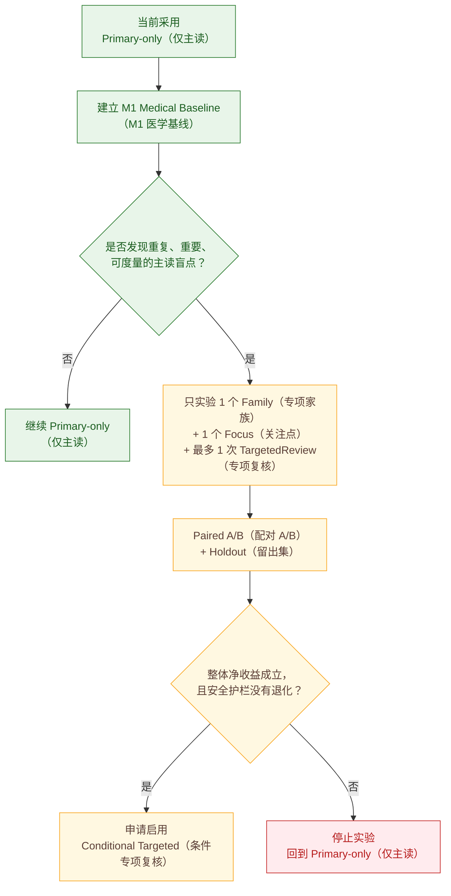
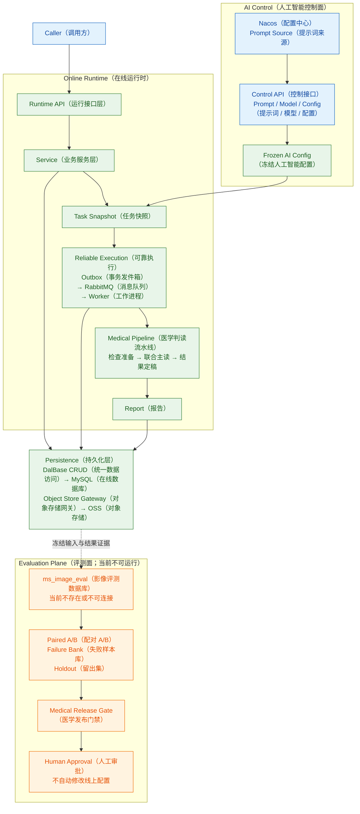
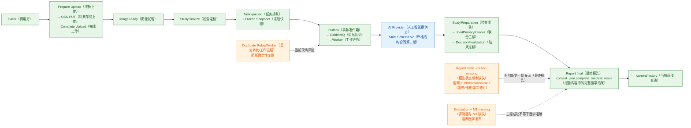
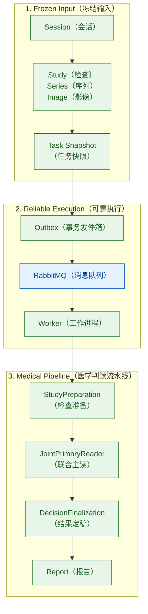
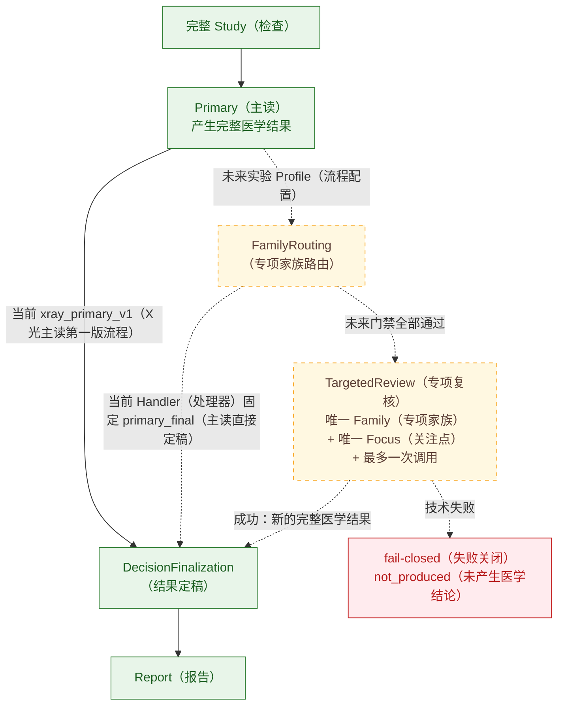
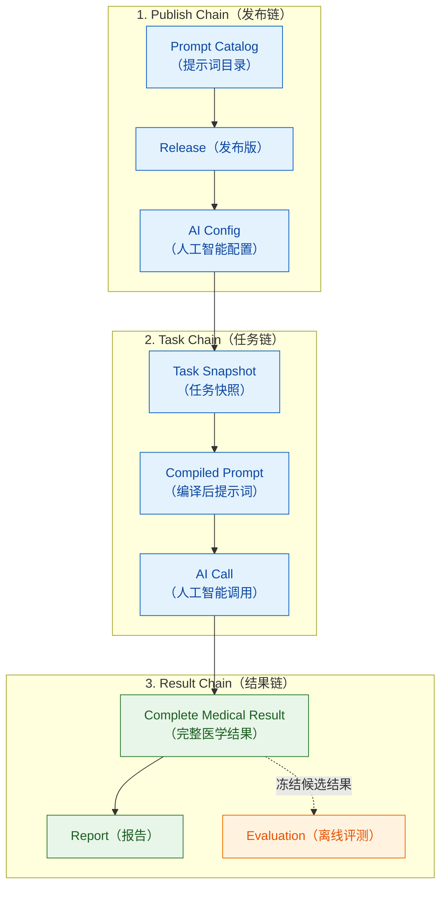

# MS-Image（影像服务）XRay（X 光）架构选择与专项设计

状态：`MINIMUM_IMAGE_TO_FINAL_REPORT_CHAIN_PROVEN（最小影像到最终报告链已实证）` / `C2_ENGINEERING_QUALIFIED（C2 工程资格已通过）` / `DETERMINISTIC_LOCAL_REPLAY_NOT_QUALIFIED（本地确定性复跑未资格化）` / `MEDICAL_ACCURACY_UNKNOWN（医学准确性未知）` / `MEDICAL_RELEASE_NO-GO（医学发布禁止放行）`

更新日期：2026-08-28

适用读者：第一次接触本项目的产品、研发、测试、算法和医学同事。

标注规则：正文中的英文术语统一写成 `English（中文含义）`；为了能在代码中精确检索，文件路径和代码标识保留原样，但会在首次出现处或相邻说明中给出中文含义。

本文只回答三件事：

1. 现在四种 XRay（X 光）方案中哪个更合适；
2. 当前项目到底已经完成了什么、还缺什么；
3. 未来怎样用证据决定是否增加 TargetedReview（专项复核），而不是凭感觉增加模型调用。

> 一句话结论：当前采用 `Primary-only（仅主读）` 作为运行和医学评测基线；`Primary + Conditional Targeted（主读 + 条件专项复核）` 只作为未来实验候选，必须证明整体净收益后才能启用。

---

## 1. 给小白的 30 秒结论

把一次 X 光检查想成“一位医生完整看完这一套片子”。

- `Primary（主读）`：第一次完整阅读整套片子，是每个病例都要走的基础步骤。
- `TargetedReview（专项复核）`：发现一个明确、值得复查的问题后，再围绕这个问题完整看一次整套片子。
- 当前项目已经真实跑通一条单图 `Primary-only（仅主读）` 工程链：选择并上传已有 X 光影像、调用 AI（人工智能）、生成第一份 `final Report（最终报告）`，再通过 `current/history（当前/历史）` 接口读取。
- `C2 CompleteMedicalResult v2（C2 完整医学结果第二版）` 已完成工程资格化；`summary（摘要）`、`impression（印象）`、`findings（影像发现）`、`limitations（局限）` 等结果保存在 `Report.content_json.complete_medical_result（报告内容中的完整医学结果）`，不是报告表的顶层列。
- 项目虽然已经有 `TargetedReview（专项复核）` 相关的流程骨架，但当前路由固定走 `primary_final（主读直接定稿）`，所以专项复核实际上不会被触发。
- 真实单图和两视图工程验收都已有成功证据，但它们只说明“图片送对了、模型调用成功、结果存下来了”，不说明“诊断正确”。
- 当前本地同时存在 2 个 `Outbox Relay（事务发件箱转发进程）` 和 3 个 `Celery Worker（Celery 工作进程）`；因此只能说“链路曾跑通”，不能说“当前环境可安全、确定性地随时复跑”。
- 当前没有可信 `M1 Medical Baseline（M1 医学基线）`，不能声称医学准确率已经验证，也不能医学发布。

因此，当前最好的方案不是重写架构或增加更多调用，而是做 `local correction（局部修正）`：先消除重复进程、增强已有一键验收工具、补齐报告状态版本，再把一次完整主读变成可信、可复现、可评测的基线。只有某一类真实医学失败被证据证明后，才实验一次受控的专项复核。

---

## 2. 四种方案哪个更好

这里的“更好”要分成两个时间点：现在能稳定落地的方案，以及未来可能提高医学效果的方案。

| 方案 | 人话解释 | 可能优点 | 主要问题 | 当前结论 |
|---|---|---|---|---|
| `Primary-only（仅主读）` | 每例只进行一次完整检查主读 | 成本、延迟、结果来源和失败原因最清楚 | 单次主读可能存在稳定盲点 | **当前最佳基线，立即保留** |
| `Organ-by-organ Calls（按器官默认多次调用）` | 胸腔、腹腔、骨骼等分别调用，再拼结果 | 每次提示词看起来更聚焦 | 容易冲突、重复、误报；成本和延迟线性增加；谁负责最终结论不清楚 | **当前不采用** |
| `Primary + Conditional Targeted（主读 + 条件专项复核）` | 先完整主读，只有满足严格条件时最多再复核一次 | 可能修复某个已经证实的主读盲点 | 路由本身可能漏掉问题；复核也可能制造新误报 | **未来唯一保留的实验候选** |
| `Multi-reader Debate（多读者辩论）` | 多个模型结果互相讨论或投票 | 理论上可能暴露分歧 | 调用最多、逻辑最复杂；同源模型不等于独立医学证据；结果所有者模糊 | **当前不采用** |

### 2.1 为什么当前选 `Primary-only（仅主读）`

当前项目需要先回答最基本的问题：同一套冻结影像、同一套 `Prompt（提示词）`、同一模型和同一 `Schema（结构合同）`，能否稳定得到可追溯结果。

`Primary-only（仅主读）` 的优势是：

- 每例只有一个医学结果来源，容易审计；
- 不需要解决多结果投票、合并或覆盖规则；
- 延迟和费用最低，也最容易计算；
- 出现错误时，可以明确归因到输入、提示词、模型、结构合同或运行链；
- 最适合作为之后所有 `Paired A/B（同病例配对 A/B 实验）` 的对照组。

### 2.2 为什么未来只保留“条件专项复核”

如果 `M1 Medical Baseline（M1 医学基线）` 证明主读在某个明确问题上反复失败，例如某类肺野模式容易漏掉，那么可以只针对这个问题实验一次 `TargetedReview（专项复核）`。

它不是默认多调用，也不是把所有器官再看一遍。它必须满足：

- 只有一个 `Family（专项家族）`；
- 只有一个 `Focus（专项关注点）`；
- 最多一个 `Strategy（复核策略）`；
- 有清楚的来源 `Finding（影像发现）` 和影像覆盖证据；
- 模型、提示词、结构合同、预算和截止时间已经冻结；
- 最多追加一次模型调用；
- 在同病例实验和独立 `Holdout（留出集）` 上证明整体净收益。

### 2.3 方案选型图

这张图适合在讲解开头使用：先建立主读基线，再由证据决定要不要实验专项复核。



---

## 3. 先分清三种“成功”

这是整份文档最重要的认知边界。

| 层次 | 它回答的问题 | 当前状态 | 它不能证明什么 |
|---|---|---|---|
| `Engineering Success（工程成功）` | 系统能否把正确图片送给模型，并可靠保存结果 | 真实单图与两视图主链均已有成功证据；本地确定性复跑仍未资格化 | 不能证明诊断正确 |
| `Provider Success（模型提供方调用成功）` | 外部模型是否收到请求并返回合规内容 | 已有真实调用成功、严格 Schema v2（结构合同第二版）通过的证据 | 不能证明内容符合医学事实 |
| `Medical Validation（医学验证）` | 与可信标注相比，诊断质量是否达到放行标准 | `UNKNOWN（未知）` | 尚不能医学发布 |

可以用一句话记住：

> 系统跑完，不等于 AI（人工智能）看懂了；AI（人工智能）有回答，也不等于回答在医学上正确。

当前真实 `VD（腹背位）+ Lateral（侧位）` 两视图任务已经完成：

- `Task（任务）`：`baef4d8619494a75aac7c2c7ef805c87`
- `Report（报告）`：`dfeeb929e1e145fbb20466ca999d26e8`
- 影像顺序、`SHA-256（哈希摘要）`、`projection（投照位）` 和 `provenance（来源信息）` 一致。

该任务得到 `abnormal（异常）`，这里只能说明模型返回了一个合法医学状态，不能把它当作 `Gold（可信金标准）`，也不能由此计算准确率。

2026-08-28 又核对了一条更贴近“先把最小产品链跑通”目标的真实单图任务：

- `Task（任务）`：`4b692c564eca4074a6113dbd92feb193`
- `Report（报告）`：`efd9977002a84e839304843af3626f9c`
- 工程终态：`Task.execution_status=completed（任务执行完成）`、3 个 `Stage（执行阶段）` 全部完成、`Attempt/Call=succeeded（尝试/调用成功）`、`Report.status=final（报告最终态）`。
- 医学状态：`review_required（需要复核）`，不是工程错误。
- 查询结果：`GET /reports/current?task_id=...（查询当前报告）` 返回成功，`history（历史报告）` 也已有成功证据。
- C2 v2 结果位置：`Report.content_json.complete_medical_result（报告内容中的完整医学结果）`，其中有 `result_schema_version（结果结构版本）`、`summary（摘要）`、`impression（印象）`、`findings（影像发现）`、`source_refs（来源引用）` 和 `limitations（局限）`。

这条证据支持的准确表述是：`minimum image-to-final-report chain proven（最小影像到最终报告链已实证）`。它不支持“医学准确率已通过”，也不支持“当前启动环境可以无条件重复运行”。

---

## 4. 先认识系统里的基本对象

### 4.1 一套片子不是一张图片

```text
Session（影像诊疗会话）
└── Study（影像检查）
    └── Series（影像序列）
        └── Image（影像对象）
```

- `Session（影像诊疗会话）`：一次业务流程的外层容器。
- `Study（影像检查）`：同一次诊断目的下要一起看的整套影像，不是一张片子。
- `Series（影像序列）`：检查内按采集方式或投照方式组织的一组影像。
- `Image（影像对象）`：一张实际影像及其摘要、投照位和来源信息。

### 4.2 `Task（任务）` 像封存的工作单

创建 `Task（任务）` 时，要把以下内容冻结：

- 使用哪一个 `Study Revision（检查修订版）`；
- 有哪些有序 `Image（影像对象）`；
- 使用哪个 `AI Config（人工智能配置）`；
- 使用哪个 `Profile（流程配置）`；
- 使用哪个 `Prompt（提示词）`、模型和输出 `Schema（结构合同）`；
- 预算、截止时间和安全上下文。

冻结之后，旧任务不能因为配置中心出现新提示词而悄悄改变。否则同一个病例以后无法重放，也无法解释结果来自哪一版配置。

### 4.3 `Service（业务服务）` 和 `Stage（执行阶段）` 不一样

- `Service（业务服务）` 像长期负责某件事的部门，例如任务服务、报告服务。
- `Stage（执行阶段）` 像某张工作单经过的一道工序，例如检查准备、主读、定稿。

不要把它们混为一谈：一个服务可以支持多个阶段，一个阶段也可能调用多个已有业务能力。

---

## 5. 当前真正可达的运行链

### 5.1 系统总体架构图

图中实线表示当前已经存在的主链关系；连接 `Evaluation Plane（评测面）` 的虚线表示离线证据方向，但评测数据库当前尚未就绪，不能运行医学基线。



这张图同时保留了项目强制分层：同步接口必须走 `API（接口层） → Service（业务服务层） → DalBase CRUD（统一数据访问层） → MySQL（数据库）`；异步模型任务则由 `Outbox（事务发件箱） → RabbitMQ（消息队列） → Worker（工作进程）` 继续执行。

`Medical Release Gate（医学发布门禁）` 只产生是否值得发布的证据，不会自动修改线上配置；仍需 `Human Approval（人工审批）` 后由控制面创建新的冻结配置。

### 5.2 当前第一目标：上传影像到查询报告的全链架构图

这张图专门回答当前最优先的问题：一张已有 X 光影像怎样从调用方进入系统，经过 AI（人工智能）识别，最后变成调用方能读到的第一份最终报告。

> “生成上传图”在当前工程里应理解为“准备并上传已有真实或隔离测试 X 光影像”。当前仓库不负责用生成式 AI（人工智能）合成医学 X 光图；合成影像也不能替代真实病例的医学验证。



绿色主线已有真实成功病例证明；橙色旁支是“已经发现但尚未关闭”的缺口。最容易讲错的是 `Report.state_version（报告状态版本）`：它不阻断第一份 `final Report（最终报告）` 和当前/历史查询，但会阻断 `publish（发布）`、`void（作废）` 和第二份报告替换旧报告时的 `CAS（比较并设置）`。

### 5.3 当前主读执行链图

当前生产代码中，`xray_primary_v1（X 光主读第一版流程）` 的静态路径是：



对应的阶段只有：

1. `study_preparation（检查准备）`
2. `joint_primary_reader（联合主读）`
3. `decision_finalization（结果定稿）`

### 5.4 当前阶段的真实边界

| 阶段 | 当前代码真正做了什么 | 仍未做到什么 |
|---|---|---|
| `StudyPreparation（检查准备）` | 检查 `study_revision_id（检查修订标识）` 和 `manifest_sha256（清单摘要）` 是否为字符串 | 还没有执行旧设计所描述的完整覆盖、模型能力和预算门禁 |
| `JointPrimaryReader（联合主读）` | 将冻结的完整检查交给模型，并接收结构化结果 | 医学准确率仍未建立基线 |
| `DecisionFinalization（结果定稿）` | 主要透传上一步已接受结果，并记录来源 | 还没有完整验证流程、路由和唯一结果所有者的全部不变量 |

这意味着目标设计里的规则不能写成“已经实现”。文档必须把 `Current Implementation（当前实现）` 和 `Target Design（目标设计）` 分开。

---

## 6. 当前项目状态：哪些完成了，哪些没有

### 6.1 已有证据的部分

| 能力 | 当前状态 | 小白解释 |
|---|---|---|
| 最小主链 | `PROVEN（已实证）` | 已有真实单图任务完成“上传 → AI 识别 → 第一份最终报告 → 当前/历史查询” |
| 多视图接入 | `ENGINEERING_QUALIFIED（工程资格已通过）` | 真实 `VD（腹背位）+ Lateral（侧位）` 的顺序、投照位、摘要和来源能够对账 |
| `C1.1 Medical State Boundary（C1.1 医学状态边界）` | `COMPLETED（已完成）` | 非法 `availability/result（可用性/结果）` 组合会明确失败；Report 写入前会核对列状态与内容状态一致 |
| `P1-A Automatic Reconcile（P1-A 自动对账恢复）` | `COMPLETED（已完成）` | 未知模型调用已有自动调度与领取、查询、恢复路径 |
| `P1-B Bounded Unknown Termination（P1-B 未知结果有界终止）` | `COMPLETED（已完成）` | `unknown（结果未知）` 不会无限等待，达到次数或时间上限后进入明确终态 |
| `D1 Multi-view Evidence（D1 多视图证据）` | `COMPLETED（已完成）` | 影像顺序、投照位和实际发送回执可追溯 |
| `D2 Clinical Context v1（D2 临床上下文第一版）` | `COMPLETED（已完成）` | 上下文字段有来源审计、白名单、冻结策略和摘要；剩余是上游传入真实数据 |
| `C2 CompleteMedicalResult v2（C2 完整医学结果第二版）` | `ENGINEERING_QUALIFIED（工程资格已通过）` | v2 Schema（结构合同）必含版本、摘要、印象、发现和来源引用，真实报告已保存该结构 |
| 测试记录 | `178 passed, 38 warnings（178 项通过，38 条警告）` | 这是 2026-08-28 最新已有的全量验证记录；本轮文档复核没有重新执行全量测试 |

当前主库按 `ORM（对象关系映射）` 模型注册了 20 张物理表。当前 XRay（X 光）正式主读 `Prompt identity（提示词身份）` 仍是 `xray_primary/common（X 光主读/通用变体）`；`species（物种）` 和 `clinical context（临床上下文）` 是任务冻结数据，不是猫狗各建一套提示词身份。

### 6.2 仍未完成的部分

| 缺口 | 影响边界 | 是否阻断第一份最终报告 |
|---|---|---|
| 单 `owner（所有者）` 稳定启动 | 当前有 2 个 Relay（转发进程）和 3 个 Worker（工作进程），不同版本进程可能竞争同一队列 | **不推翻已有成功证据，但阻断确定性复跑资格** |
| E2E harness parameterization（端到端验收工具参数化） | 现有脚本硬编码外部图片、`dog（狗）`、`UNKNOWN（未知投照位）`，只查询 history（历史）且证据摘要不完整 | **不阻断手工成功，但阻断产品级一键验收** |
| `Report.state_version（报告状态版本）` | `publish（发布）`、`void（作废）`、第二 `revision（修订版）` 替换旧报告的 CAS（比较并设置）不可用 | **否**；第一份 final（最终）和 current/history（当前/历史）仍可用 |
| `ms-ai-fast（上游业务服务）` 接线 | 尚未完成 `pet_type（宠物类型） → species（物种） → POST /tasks（创建任务）` | **不阻断 ms-image 独立演示，阻断业务产品全链** |
| `Evaluation Plane（评测面）` | 独立 `ms_image_eval（影像评测数据库）`、评测就绪检查和 M1 医学基线未闭环 | **不阻断工程报告，阻断医学发布** |
| `P1-C Production Security（P1-C 生产安全）` | Runtime/Admin JWT（运行时/管理端令牌）、Artifact signing（评测产物签名）和 Secret 最小权限未资格化 | **不阻断本地工程演示，阻断生产发布** |
| 医学准确率 | 没有可信 Gold（医学金标准）、Scorer（评分器）、分母和 Holdout（留出集） | **不阻断工程报告，医学发布仍 NO-GO（禁止放行）** |

### 6.3 DeepSeek 输出逐项裁决

| DeepSeek 说法 | 裁决 | 准确口径 |
|---|---|---|
| Task `4b692c...` 全链成功 | **正确** | 真实单图链已到 `Task completed（任务完成）`、`Report final（最终报告）`，当前报告 API 也能读取 |
| C2 已实现 | **正确** | C2 是工程资格通过，不等于医学准确率通过 |
| 报告含完整 v2 结果 | **正确，但需补充位置** | 结果在 `Report.content_json.complete_medical_result（报告内容中的完整医学结果）` |
| v1 Schema（结构合同第一版）缺摘要只是小清理，可同步 v2 | **错误** | v1 是冻结历史合同，必须保持不变；v2 用独立 Schema/Profile/Config（结构合同/流程配置/人工智能配置）演进 |
| 当前进程可随时复跑 | **错误** | 当前 2 个 Relay（转发进程）+ 3 个 Worker（工作进程），只能确认曾跑通，不能确认确定性复跑 |
| 178 项测试通过 | **最新已有记录正确** | 本轮没有重新跑全量测试，会议上不要说成“刚刚重跑” |
| 立即把 129 个改动一次提交 | **不建议** | 当前 `git status（版本状态）` 是 130 条，应先按能力切片整理，不要把所有脏工作树混成一次提交 |
| 工程主链全部完成 | **表述过大** | “第一份 final 报告链跑通”正确；稳定部署、报告状态治理、上游业务接线、医学评测和生产安全仍未完成 |

---

## 7. 为什么不采用“每个器官默认调用一次”

按器官拆分看起来更专业，但会马上引入五类问题。

### 7.1 多个结果可能互相冲突

例如胸腔调用说“未见明显异常”，心血管调用却说“心影异常”。系统必须决定谁覆盖谁。简单投票、取并集或让程序拼接，都可能改变医学含义。

### 7.2 调用次数增加不等于证据增加

如果多个调用来自同一个基础模型，它们是相关意见，不是多个独立医生的证据。相同盲点可能被重复放大。

### 7.3 误报会累积

每个专项都追求发现更多可疑点时，合并后的整体误报通常会上升。局部召回提高，可能换来整个病例层面的质量下降。

### 7.4 成本和延迟更难控制

五个专项默认调用意味着每例都增加模型费用、网络延迟、超时和失败概率。

### 7.5 实验因果不清楚

一次同时改变五个提示词、五次调用和结果合并规则，即使分数变化，也很难知道是哪一个改变造成的。

所以，五个专项当前用于组织报告和评测分层，不等于五次模型调用。

---

## 8. 未来候选：条件专项复核

### 8.1 目标流程

图中绿色实线是当前 `Primary-only（仅主读）` 路径；黄色虚线是未来实验路径。当前代码不会进入黄色分支。



当前代码中的 `FamilyRouting（专项家族路由）` 固定返回 `primary_final（主读直接定稿）`。因此，上图右侧只是目标设计，不是当前已上线能力。

### 8.2 专项复核不是“局部补丁”

`TargetedReview（专项复核）` 必须继续读取完整 `Study（检查）`，并产生新的 `Complete Medical Result（完整医学结果）`。它不能只返回一句“肺部可能异常”再拼进主读结果。

原因是医学发现之间存在关系：一个局部判断可能依赖其他投照位、邻近结构、全身状态或正常反证。

### 8.3 谁拥有最终医学结果

系统在任何时刻只能有一个 `medical owner（医学结果所有者）`：

- 没有专项复核时，`Primary（主读）` 是结果所有者；
- 专项复核成功且被接受时，`TargetedReview（专项复核）` 的完整结果替代主读，成为唯一结果所有者；
- `DecisionFinalization（结果定稿）` 只选择和记录结果，不创造新发现；
- `Report（报告）` 只固化已选结果，不投票、不拼接、不补写医学结论。

### 8.4 为什么专项技术失败不能偷偷退回主读

在资格化实验中，如果已经决定进入专项复核，但模型超时或返回非法结构，再静默使用主读结果，会掩盖专项方案的真实失败率。

因此，实验合同应使用 `fail-closed（失败关闭）`：记录 `not_produced（未产生医学结论）` 或明确失败，并进入人工处理或受控恢复。以后是否允许某类降级，必须经过单独的产品、运行和医学审批。

---

## 9. 五个 `Family（专项家族）` 是候选词汇，不是永久医学分类

`Family（专项家族）` 是一个完整临床评估包；它不是数据库表、不是裁剪图、不是额外服务，也不天然代表一次模型调用。

第一版候选目录如下：

| `Family（专项家族）` | 主要覆盖 | 候选 `Focus（关注点）` |
|---|---|---|
| 胸腔专项 | 胸腔投照 | 心血管轮廓、肺野模式、胸膜纵隔、胸壁 |
| 腹腔专项 | 腹腔投照 | 胃肠异物或梗阻、泌尿矿化、腹腔矿化点、软组织肿块 |
| 四肢骨关节专项 | 前肢或后肢 | 骨折或脱位、长骨关节、排列、髌骨膝关节 |
| 轴骨骼专项 | 脊柱或骨盆髋部 | 骨折或脱位、排列、骨盆髋部 |
| 头颈专项 | 头部或颈部 | 第一版只用于报告组织和评测分层，暂不开放专项关注点 |

边界约定：

- 颈椎属于轴骨骼专项；
- 心血管和呼吸属于胸腔专项的报告子域；
- 消化和泌尿生殖属于腹腔专项的报告子域；
- 前肢和后肢是影像区域，不是两个独立专项；
- 全身表示多区域覆盖，不是第六个专项。

### 9.1 `Family（专项家族）`、`Focus（关注点）`、`Strategy（策略）` 的区别

可以把它们理解为“科室、具体问题、检查方法”：

- `Family（专项家族）`：属于哪一类完整评估包，例如胸腔专项；
- `Focus（专项关注点）`：这次具体再查什么，例如肺野模式；
- `Strategy（复核策略）`：采用什么复核方法，例如高召回或关键发现确认。

有效复核必须是“一个专项家族 + 一个关注点 + 最多一个策略”。“胸腔 + 高召回”仍然不够明确，因为它没有说清到底复核肺野、心血管还是胸膜纵隔。

这些边界必须由医学评测证据调整，不能因为第一版文档这样分，就声称它们是最优医学本体。

---

## 10. `Prompt（提示词）` 为什么必须冻结

### 10.1 当前唯一正式身份

当前 XRay（X 光）运行时只接受：

```text
xray_primary/common（X 光主读/通用变体）
```

`cat（猫）`、`dog（狗）` 或 `default（默认）` 不能作为 XRay（X 光）提示词变体自动回退。`species（物种）` 只作为冻结的安全上下文进入任务。

### 10.2 冻结链



- `Prompt Catalog（提示词目录）`：可维护的提示词资产清单。
- `Release（发布版）`：获准使用的一组冻结提示词、模型、结构合同和预算。
- `AI Config（人工智能配置）`：任务要使用的完整人工智能配置记录。
- `Task Snapshot（任务快照）`：创建任务时封存的输入和配置证据。
- `Compiled Prompt（编译后提示词）`：某一次调用实际发送给模型的文本。
- `AI Call（人工智能调用）`：一次可追踪的模型请求事实。

任何旧任务都必须使用自己快照中的版本。不能拿“配置中心最新文件”覆盖旧病例，否则复现、审计和实验比较都会失效。

### 10.3 为什么 v1 不能“顺手同步”成 v2

`prompts/xray/complete_medical_result.schema.json（完整医学结果第一版结构合同）` 没有 `summary（摘要）` 和 `impression（印象）`，不是当前主链的小缺口，而是历史 v1 合同的既有形态。

- v1 必须保持冻结，让历史 Config/Task（配置/任务）能够按原合同重放；
- v2 使用独立的 `complete_medical_result.v2.schema.json（完整医学结果第二版结构合同）`、Profile（流程配置）、Handler（处理器）和 Config hash（配置摘要）演进；
- 当前代码只对 v2 执行新的来源一致性检查，对非 v2 合同明确保持原行为；
- 如果把 v1 文件补成 v2 字段，旧任务会在“文件名没变”的情况下改变含义，破坏冻结、审计和重放。

因此正确动作是：`freeze v1, evolve v2 independently（冻结第一版，独立演进第二版）`。不要为了字段看起来整齐而修改 v1。

---

## 11. 工程状态和医学状态必须分开

### 11.1 工程状态

工程状态描述系统有没有可靠执行，例如：

- `queued（排队中）`
- `running（运行中）`
- `completed（已完成）`
- `failed（技术失败）`
- `cancelled（已取消）`
- `unknown（调用结果未知）`

### 11.2 医学状态

医学状态描述有没有形成怎样的医学结果，例如：

- `normal（未见异常）`
- `abnormal（发现异常）`
- `review_required（需要复核）`
- `non_diagnostic（医学上不可判读）`
- `not_produced（未产生医学结论）`

“未评估”不能当作“正常”；“工程完成”也不能自动当作“医学正常”。

### 11.3 `C1.1（医学状态边界加固）` 已完成

当前代码已经把这条边界从“目标行为”变成工程合同：

- 只有合法的 `availability/result（可用性/结果）` 组合才能投影为持久医学状态；
- 非法或冲突组合会明确失败，不再静默改成 `not_produced（未产生医学结论）`；
- `ReportService（报告业务服务）` 在调用 DAL（数据访问层）之前，会核对报告列中的医学状态与 `content_json（内容）` 顶层医学状态一致；
- Python（编程语言）只验证合同、路由和保存结果，不补写、推断或纠正医学发现。

仍然必须保留“工程状态与医学状态分开”的原则。C1.1 完成只说明状态边界正确，不说明医学判断正确。

---

## 12. 当前 20 张表怎么理解

不要再用旧文档里的“10 张核心表 + 4 张评测表”代表完整物理库。当前 `ORM（对象关系映射）` 模型注册的是 20 张表，可以按职责理解。

| 分组 | 模型表 | 小白解释 |
|---|---|---|
| 影像接入 | `Session（会话）`、`Study（检查）`、`Series（序列）`、`Image（影像）`、`ObjectReconcileCursor（对象对账游标）` | 管理一套影像怎样上传、组织、版本化和对账 |
| 可靠执行 | `Task（任务）`、`StageCheckpoint（阶段检查点）`、`Outbox（事务发件箱）` | 管理异步任务怎样排队、执行、恢复和落终态 |
| 人工智能调用 | `AICall（人工智能调用）`、`AICallAttempt（人工智能调用尝试）` | 保存每次模型调用及其尝试、结果和来源 |
| 控制面 | `AIAPIConnection（人工智能接口连接）`、`AIModelPool（人工智能模型池）`、`AIPromptTemplate（人工智能提示词模板）`、`AIConfigRecord（人工智能配置记录）`、`AIControlAuditRecord（人工智能控制审计记录）` | 管理可用模型、提示词、配置和审计 |
| 报告 | `Report（报告）` | 固化被选中的完整医学结果 |
| 离线评测 | `EvaluationJob（评测任务）`、`EvaluationRun（评测运行）`、`EvaluationArtifact（评测产物）`、`EvaluationOutbox（评测事务发件箱）` | 运行离线实验并保存证据，不改在线结果 |

表已经存在或模型已经注册，只能说明数据结构具备基础。它不等于完整运行时已资格化，也不等于评测系统现在可运行。

---

## 13. 三个容易被误报为“已完成”的边界

### 13.1 完整 `Worker Runtime（工作进程运行时）`

`P1-A Automatic Reconcile（P1-A 自动对账恢复）` 和 `P1-B Bounded Unknown Termination（P1-B 未知结果有界终止）` 已完成代码与既有验证，因此不能再列为缺失能力。

当前真正未资格化的是本地启动现场：同一队列同时有 2 个 `Outbox Relay（事务发件箱转发进程）` 和 3 个 `Celery Worker（Celery 工作进程）`。这会让任务由哪个代码版本领取变得不确定。`P1-C Production Security（P1-C 生产安全）` 的令牌、签名和 Secret（密钥）最小权限仍按用户决定延期，不应和 P1-A/P1-B 混为一项。

### 13.2 `Report publish/void（报告发布/作废）`

当前代码里已经有发布和作废的接口、服务和数据访问方法，但 `Report（报告）` 模型与响应缺少 `state_version（状态版本）`，而服务又要求使用它做 `CAS（比较并设置）`。

所以正确口径是“代码存在、运行不可用”，不能对同事说“报告发布和作废已经完成”。作废还需要补充原因、操作者和审计治理。

### 13.3 `Evaluation Plane（评测面）`

评测代码、模型和接口骨架存在，但独立 `ms_image_eval（影像评测数据库）` 当前不可用，评测面还没有形成可运行闭环。

在线 `readiness（就绪检查）` 刻意与评测面隔离，所以在线服务就绪也不能证明离线评测已经就绪。

---

## 14. 怎样证明专项复核真的更好

### 14.1 先建立 `M1 Medical Baseline（M1 医学基线）`

在增加专项复核前，先用冻结的主读方案回答：

- 哪些病例读对了；
- 哪些异常漏掉了；
- 哪些正常病例被误报了；
- 哪些病例应该进入人工复核；
- 哪些输入医学上不可判读；
- 不同物种、部位、投照位和病例难度表现怎样。

前提包括：

- `Gold（可信金标准）` 由获准的医学流程产生；
- `Scorer（评分器）`、分母和排除规则先冻结；
- `Failure Bank（失败样本库）` 记录可重复的失败类型；
- `Regression Set（回归集）` 防止修好一个问题又破坏旧能力；
- `Holdout（留出集）` 在方案冻结前不用于调参。

### 14.2 只针对一个已证实问题做实验

每轮实验只改变一个主要因素，例如：

- 一个 `Focus（专项关注点）`；
- 一版 `Prompt（提示词）`；
- 一个模型版本；
- 一条路由门禁。

不要同时改提示词、模型、结构合同、路由和结果合并规则，否则结果无法归因。

### 14.3 使用同病例配对比较

同一批病例同时运行：

```text
A 组：Primary-only（仅主读）
B 组：Primary + Conditional Targeted（主读 + 条件专项复核）
```

重点比较：

- `Recall（召回率）`：应发现的异常找到了多少；
- `Specificity（特异度）`：正常病例有多少没有被误报；
- `Precision（精确率）`：报告的异常中有多少是真的；
- `Review Burden（人工复核负担）`：需要人工处理的病例是否失控；
- `Non-diagnostic Safety（不可判读安全性）`：输入不足时是否诚实停止；
- `Latency（延迟）` 和 `Cost（成本）`：增加一次复核带来的代价；
- `Technical Failure Rate（技术失败率）`：专项调用是否引入更多无法交付的病例。

### 14.4 看整体净收益，不只看专项子集

不能只展示“成功触发专项的病例”。必须用所有符合条件的病例作为分母，包括：

- 应该触发但没有触发的病例；
- 错误触发的正常病例；
- 专项调用技术失败的病例；
- 专项修正成功的病例；
- 专项把原本正确结果改错的病例。

只有整体净收益达到预先冻结的门槛，并在独立 `Holdout（留出集）` 上复现，才允许讨论启用。

### 14.5 停止条件

出现以下任一情况，应停止扩大专项方案：

- 没有可信医学金标准；
- 整体误报或人工复核负担明显上升；
- 关键异常召回下降；
- 路由漏掉大部分真正需要复核的病例；
- 技术失败、成本或延迟超过冻结预算；
- 收益只存在于开发集，留出集不能复现；
- 无法指出唯一结果所有者或无法重放结果来源。

---

## 15. 推荐实施顺序

当前架构不需要推倒重写。推荐决策是 `local correction（局部修正）`：保留 `API（接口层） → Service（业务服务层） → DalBase CRUD（统一数据访问层） → Model/DB（模型/数据库）` 和现有异步链，只修当前能够明确定位的合同与验收缺口。

### P0-1：先恢复单一进程所有者

- 演示环境只保留 1 个 Runtime API（运行接口进程）、1 个 Outbox Relay（事务发件箱转发进程）和 1 个 Celery Worker（Celery 工作进程）。
- 停止现有重复进程会改变本地运行状态，必须先获得操作者授权；本文只记录风险，不自行停止。
- 启动前核对 Broker（消息队列）、OSS（对象存储）、AI Platform（人工智能平台）、active Config（活动配置）和 Connection URL（连接地址）一致。

### P0-2：增强已有启动器，不新增平行脚本

- 在现有 `scripts/dev/run_local_chain.sh（本地全链启动脚本）` 中检查已有 API、Relay、Worker 和 Beat（调度进程），发现重复时 `fail-closed（失败关闭）`。
- 保持 `${PYTHONPATH:-}` 的兼容写法；不要再创建第二套启动器。
- 启动摘要只显示非敏感状态，不输出 Token/Secret（令牌/密钥）。

### P0-3：参数化已有 E2E harness（端到端验收工具）

- 修改现有 `scripts/dev/run_e2e_local.py（本地端到端脚本）`，支持传入图片路径、`species（物种）`、`projection（投照位）` 和允许的 `clinical context（临床上下文）`。
- 移除仓库外绝对图片路径和固定 `dog（狗）`；默认不从文件名或像素猜测投照位。
- 同时核验 `current（当前报告）` 与 `history（历史报告）`，并输出 Image/Study/Task/Attempt/Call/Stage/Report（影像/检查/任务/尝试/调用/阶段/报告）的非敏感边界证据。

### P0-4：连续复跑并冻结第一阶段完成定义

- 在单一进程所有者环境，用同一固定影像连续运行 2～3 次。
- 每次都必须达到：上传成功、Image ready（影像就绪）、Study finalized（检查已定稿）、Task completed（任务完成）、Attempt/Call succeeded（尝试/调用成功）、3 个 Stage completed（阶段完成）、Report final（最终报告）、current/history（当前/历史）可读取。
- 核对 `Report.content_json.complete_medical_result（报告内容中的完整医学结果）` 确实为 v2；结果缺失、Schema（结构合同）失败或来源引用不一致时立即停止，不把技术失败算作成功。

### P0-5：整理 Git（版本控制）改动，不立即整包提交

- 当前工作树有 130 条状态记录，先按能力切片形成清单：Runtime/Worker（运行时/工作进程）、C1.1/D1/D2/C2 合同、P1-A/P1-B、E2E/launcher（端到端/启动器）、文档与 handoff（交接记忆）。
- 不把 `.env（环境变量文件）`、密钥、运行产物或不相关改动带入提交。
- 只有范围、验证和回滚说明清楚后，再由用户决定如何提交。

### P1：经授权补 `Report.state_version（报告状态版本）`

- 增加模型字段、响应字段和数据库迁移，关闭 `publish/void/revision CAS（发布/作废/修订比较并设置）` 缺口。
- 该步骤涉及表字段和迁移，本轮未实施；实施前还要确认 `void reason/actor/audit（作废原因/操作者/审计）` 的最小范围。

### P2：接通 `ms-ai-fast（上游业务服务）`

- 将 `pet_type=1/2（宠物类型：猫/狗）` 明确映射为 `species=cat|dog（物种：猫或狗）`，再创建 ms-image 的 Session/Study/Image/Task（会话/检查/影像/任务）并查询报告。
- 上游传入真实 `clinical context（临床上下文）`；Worker（工作进程）不回读会变化的宠物档案来改写冻结任务。

### P3：让评测面可运行，再建立医学基线

- 创建并迁移独立 `ms_image_eval（影像评测数据库）`，增加 Evaluation readiness（评测就绪检查）。
- 冻结 Gold（医学金标准）、Scorer（评分器）、分母、Failure Bank（失败样本库）、Regression Set（回归集）和 Holdout（留出集），运行 `M1 Medical Baseline（M1 医学基线）`。
- 只有 M1 发现可重复、重要、可度量的主读盲点，才进入条件专项复核实验。

### P4：生产安全与发布工件资格化

- 关闭 Runtime/Admin JWT（运行时/管理端令牌）、Artifact signing（评测产物签名）、Secret（密钥）最小权限和发布工件冻结问题。
- 只有医学、工程、安全、成本和运行指标全部达标，才讨论 `MEDICAL_RELEASE=GO（医学发布允许放行）`。

---

## 16. 常见误解

### 误解一：“多看几次一定更准”

不一定。多次同源模型调用可能重复相同盲点，还会累积误报、失败、费用和延迟。

### 误解二：“两视图工程通过，说明模型理解了两个投照位”

不对。当前证据只证明两张不同投照位影像被正确冻结、发送、追踪和保存。模型是否真正利用多视图，需要医学评测。

### 误解三：“五个专项就是五个模型”

不对。五个专项目前是报告组织和评测分层词汇，不是五个服务、五张表或五次调用。

### 误解四：“路由能发现主读完全没看到的问题”

不能默认这样认为。当前候选路由主要依赖主读结果和冻结上下文；如果主读完全没有暴露某个问题，路由也可能没有触发依据。

### 误解五：“报告可以把两次结果智能合并”

不应该。报告不是第二位医生，只能固化唯一已接受的完整医学结果。

### 误解六：“代码存在就代表功能可用”

不对。报告发布作废和评测面都是典型例子：代码骨架存在，但运行合同尚未闭环。

---

## 17. 和同事讲解时可直接使用的 10 分钟话术

建议按下面的顺序展示架构图：

1. 第 5.2 节“上传影像到查询报告的全链架构图”：先讲当前最关心的产品链；
2. 第 2.3 节“方案选型图”：解释为什么当前选仅主读；
3. 第 5.1 节“系统总体架构图”：再讲控制面、在线运行时、持久化层和评测面；
4. 第 5.3 节“当前主读执行链图”：说明当前代码真正会走哪些节点；
5. 第 8.1 节“目标流程”和第 10.2 节“冻结链”：区分当前能力、未来候选与历史重放。

### 第 1 分钟：先说结论

“我们已经证明一条真实病例可以完成上传、调用模型、生成第一份最终报告并被查询。当前仍采用一次完整主读作为基线，不做每个器官默认多调用。”

### 第 2～3 分钟：解释为什么

“调用更多不天然代表更准确。多结果会有冲突、误报、费用、延迟和结果归属问题。一次主读最容易形成可信基线，也最容易知道问题来自哪里。”

### 第 4～5 分钟：讲当前真实链路

“系统先准备上传地址，把影像传到对象存储并校验；检查定稿后创建冻结任务，经事务发件箱、消息队列和工作进程调用模型，再经过检查准备、联合主读和结果定稿，最后写入报告。单图最小链和腹背位加侧位的两视图工程链都已有成功证据。”

### 第 6 分钟：主动划清证据边界

“工程链跑通不证明医学准确率。C2 第二版完整结果已经落到报告里，但它只是结构和来源合同通过。当前本地还有重复工作进程，所以今天应说‘链路跑通过’，不应说‘环境已经稳定可重复部署’；医学验证仍是未知，医学发布仍禁止。”

### 第 7～8 分钟：讲未来专项复核

“如果医学基线证明某个明确问题反复失败，我们才针对一个专项家族里的一个关注点，最多追加一次完整复核。复核仍看整套片子，并输出一份新的完整结果，不是往原结果打补丁。”

### 第 9 分钟：讲如何判断是否上线

“同一批病例做仅主读和条件专项复核的配对比较，既看召回，也看误报、人工复核负担、失败率、成本和延迟；最后还要在独立留出集复现。”

### 第 10 分钟：收尾

“所以下一步先恢复单一进程所有者，增强现有一键验收工具并连续复跑；再经授权补报告状态版本、接上游业务；之后才启动评测面和医学基线。当前选择局部修正，不需要推倒重写，也不会把工程成功包装成医学成功。”

---

## 18. 中英术语表

| 英文术语 | 中文含义 | 一句话解释 |
|---|---|---|
| `XRay` | X 光 | 本文讨论的影像模态 |
| `Session` | 影像诊疗会话 | 一次业务流程的外层容器 |
| `Study` | 影像检查 | 同一诊断目的下要一起看的整套影像 |
| `Series` | 影像序列 | 检查内的一组同类采集影像 |
| `Image` | 影像对象 | 一张影像及其元数据和来源 |
| `Revision` | 修订版 | 某次检查输入的不可变版本 |
| `Manifest` | 清单 | 有序影像列表及其摘要和元数据 |
| `Task` | 任务 | 一次冻结后可重放的分析请求 |
| `Snapshot` | 快照 | 任务创建时封存的输入和配置 |
| `Service` | 业务服务 | 长期负责某类业务规则的模块 |
| `Stage` | 执行阶段 | 一次任务中的可恢复步骤 |
| `Outbox` | 事务发件箱 | 保证数据库事实与消息投递可对账的记录 |
| `Outbox Relay` | 事务发件箱转发进程 | 把数据库里的待投递事件发送到消息队列的进程 |
| `Worker` | 工作进程 | 从队列领取并执行任务的进程 |
| `Provider` | 模型提供方 | 真正接收请求并生成结果的外部服务 |
| `Model` | 模型 | 执行影像分析的人工智能模型 |
| `Prompt` | 提示词 | 告诉模型任务、规则和输出要求的文本 |
| `Schema` | 结构合同 | 模型输出必须遵守的数据结构 |
| `Profile` | 流程配置 | 决定任务经过哪些阶段 |
| `Primary` | 主读 | 对完整检查进行的第一次完整判读 |
| `JointPrimaryReader` | 联合主读 | 同时读取一套检查内全部冻结影像的主读阶段 |
| `TargetedReview` | 专项复核 | 围绕一个明确问题再次完整判读整套影像 |
| `Family` | 专项家族 | 一类完整临床评估包 |
| `Focus` | 专项关注点 | 本次复核要解决的具体问题 |
| `Strategy` | 复核策略 | 复核这个问题时使用的方法 |
| `Finding` | 影像发现 | 可追溯的医学观察 |
| `Complete Medical Result` | 完整医学结果 | 能独立覆盖整个病例的结果，不是局部补丁 |
| `CompleteMedicalResult v2` | 完整医学结果第二版 | 必含版本、摘要、印象、发现和来源引用的当前结果合同 |
| `medical owner` | 医学结果所有者 | 唯一有资格成为报告来源的结果 |
| `Report` | 报告 | 被选医学结果的不可变呈现 |
| `Control Plane` | 控制面 | 决定新任务能使用哪些冻结配置 |
| `Runtime` | 运行时 | 在线任务实际执行的环境和能力 |
| `Evaluation Plane` | 评测面 | 离线比较候选方案、生成发布证据的独立区域 |
| `Gold` | 可信金标准 | 经批准的医学真值或参考标准 |
| `Scorer` | 评分器 | 按冻结规则比较结果与金标准的工具 |
| `Failure Bank` | 失败样本库 | 按失败原因归类的病例集合 |
| `Regression Set` | 回归集 | 检查修改是否破坏已有能力的数据集 |
| `Holdout` | 留出集 | 方案冻结前不参与调参的独立验证集 |
| `Paired A/B` | 同病例配对 A/B 实验 | 同一病例分别运行基线和候选方案 |
| `CAS` | 比较并设置 | 只有版本仍符合预期时才允许更新 |
| `state_version` | 状态版本 | CAS 更新时用来防止并发覆盖的整数版本号 |
| `E2E harness` | 端到端验收工具 | 从上传一直检查到报告查询的自动化验收入口 |
| `deterministic replay` | 确定性复跑 | 同一冻结输入在受控进程和配置下得到可解释、可对账执行结果 |
| `local correction` | 局部修正 | 保留主体架构，只修明确缺口和边界的改造级别 |
| `lease` | 租约 | 防止任务被多个工作进程同时长期占用的时限 |
| `deadline` | 截止时间 | 任务允许继续执行的最晚时间 |
| `provenance` | 来源信息 | 证明输入或结果从哪里产生的证据 |
| `readiness` | 就绪检查 | 判断某个服务是否具备接收工作的条件 |
| `fail-closed` | 失败关闭 | 条件不满足时明确停止，不猜测或偷偷降级 |

---

## 19. 代码与证据索引

以下位置用于核对本文结论，不要求小白阅读全部源码：

| 结论 | 主要证据 |
|---|---|
| 当前主读路径只有准备、联合主读、定稿 | `apps/backend/core/pipeline.py` 中的 `compile_profile_contract（编译流程合同）` |
| 当前专项家族路由固定主读定稿 | `apps/backend/services/runtime/stages/xray/family_routing.py` 中的 `XRayFamilyRoutingStageHandler（X 光专项家族路由处理器）` |
| 检查准备当前只验证修订标识和清单摘要 | `apps/backend/services/runtime/stages/common/study_preparation.py` 中的 `StudyPreparationStageHandler（检查准备处理器）` |
| 定稿阶段当前主要透传结果 | `apps/backend/services/runtime/stages/common/decision_finalization.py` 中的 `DecisionFinalizationStageHandler（结果定稿处理器）` |
| 当前唯一 XRay（X 光）主读提示词身份 | `apps/backend/services/ai_control/service/prompt_source.py` 中的 `NACOS_PROMPT_KEY_MAP（配置中心提示词键映射）` 和 `NACOS_XRAY_PROMPT_VARIANT_MAP（配置中心 X 光提示词变体映射）` |
| 当前注册 20 个模型表 | `apps/backend/models/__init__.py` |
| 报告缺少状态版本 | `apps/backend/models/report.py` 和 `apps/backend/schemas/report.py` |
| C1.1 非法医学状态组合明确失败 | `apps/backend/services/runtime/medical_status_contract.py` 中的 `project_persisted_medical_status（投影持久医学状态）`，以及 `apps/backend/services/runtime/service/report_service.py` 中报告写入前校验 |
| P1-A/P1-B 自动对账与未知有界终止 | `apps/backend/services/runtime/service/ai_attempt_reconcile_service.py`、`apps/backend/workers/imaging_worker/ai_attempt_reconcile.py` 和 `apps/backend/workers/imaging_worker/celery_app.py` |
| D2 临床上下文冻结 | `apps/backend/schemas/task.py` 中的 `TaskClinicalContext（任务临床上下文）`、`apps/backend/core/ai/clinical_context.py` 中的 `freeze_clinical_context（冻结临床上下文）` |
| C2 v2 独立结构合同与配置切换 | `prompts/xray/complete_medical_result.v2.schema.json`、`apps/backend/core/ai/xray_result_contract.py`、`apps/backend/core/pipeline.py` 和 `apps/backend/services/ai_control/service/config_compiler.py` |
| v2 结果写入报告的嵌套路径 | `apps/backend/services/runtime/stages/xray/joint_primary_reader.py` → `decision_finalization.py` → `imaging_execution_service.py` → `report_service.py` |
| 本地 E2E 和启动器当前缺口 | `scripts/dev/run_e2e_local.py` 与 `scripts/dev/run_local_chain.sh` |
| 真实单图最小链验收 | Task `4b692c564eca4074a6113dbd92feb193`、Report `efd9977002a84e839304843af3626f9c`，以及 `.agent-handoff/validation.md` 中相应记录 |
| 真实两视图工程验收 | `.agent-handoff/validation.md` 中“真实 E1-MV（第一阶段多视图工程验证）”记录 |
| 当前阻断项和禁止误报口径 | `.agent-handoff/snapshot.md` 与 `.agent-handoff/risks.md` |

---

## 20. 最终决策

### 现在

采用 `Primary-only（仅主读）`：一次读取完整 `Study（检查）`，作为唯一运行和医学评测基线。架构改造级别选择 `local correction（局部修正）`，保留现有 API/Service/DalBase/Model（接口/业务服务/统一数据访问/模型）分层和异步主链。

第一阶段只追求一个清楚、可验收的工程目标：上传已有 X 光影像 → AI（人工智能）识别 → 第一份 `final Report（最终报告）` → `current/history（当前/历史）` 查询。该链已有一次真实成功证据，下一步是让它在单一进程所有者环境中连续、确定性复跑。

### 以后

只保留 `Primary + Conditional Targeted（主读 + 条件专项复核）` 这一种增益候选。必须先完成可信 `M1 Medical Baseline（M1 医学基线）`，再围绕一个有失败证据的 `Focus（专项关注点）` 做受控实验。

### 不做

- 不按器官默认多次调用；
- 不做多模型投票或结果拼接；
- 不让报告层创造医学结论；
- 不用 Python（编程语言）规则补写、推断或修改医学结果；
- 不把工程链成功当作医学准确率提升；
- 不在没有独立留出集证据时启用专项复核。

> 对同事的最终统一口径：**现在先把一次完整主读做成可信基线；以后只有证据证明某个明确盲点值得复核，才最多增加一次受控专项复核。**
