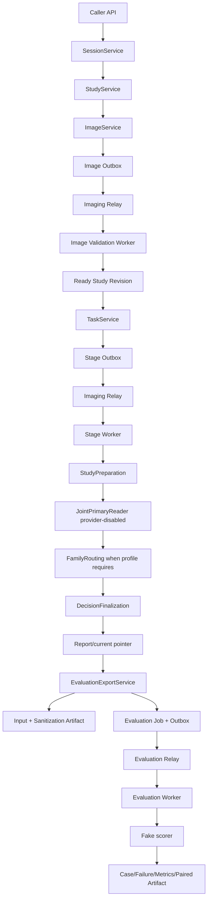
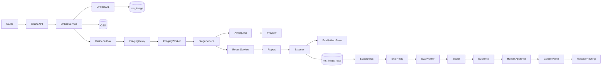

# MS-Image 全链路缺口分析与分阶段执行计划

状态：`CURRENT_EXECUTION_PLAN / PROVIDER_DISABLED_FULL_CHAIN_PASSED / NOT_RUNTIME_VALIDATED`

日期：2026-08-19

代码基线：`836e72efacdf75af15c6be7dcc5f1af07d96ba01`

工作区：`/Users/mozhicheng/workspace/code/cy-code/ms-image`

> 本文是“当前代码已经做到哪里、完整链路还缺什么、接下来按什么顺序执行”的实施文档。
> 它不表示数据库已经迁移、真实基础设施已经通过、Provider 已资格化或医学准确率已经提高。
> 未经单独授权，本文不生成或执行 Alembic/数据迁移脚本，不操作真实 MySQL、OSS、RabbitMQ 或生产环境。

---

## 1. 执行结论

### 1.1 推荐的重构级别

```text
Decision: existing-entry internal modular completion
Confidence: Direct
```

继续复用现有：

```text
API -> Service -> DalBase -> Model/DB
Worker -> Service -> DalBase -> Model/DB
Service -> ObjectStorageGateway/Broker/Provider（数据库事务外）
```

当前不建议全链重写，原因是：

1. 在线入口、Task/Stage 状态、Report 结果合同和 Evaluation 四类事实已经存在。
2. Image、Stage、Evaluation 都已有 Outbox/lease/CAS 可靠性语义。
3. 当前主要问题是“尚未组合验收和真实资格化”，不是缺少第三套执行框架。
4. 重写会复制 API、Runner、Scorer、数据库和状态 owner，并失去现有可增量验证路径。

局部修补也不足，因为剩余问题跨越在线 DB、Evaluation DB、OSS、Broker、Provider、Gold、统计和发布控制面。

### 1.2 当前直接阻断

| 阻断 | 状态 | 后果 |
|---|---|---|
| provider-disabled 在线链与 Evaluation 链组合 fake 已通过 | `CONFIRMED` | 只解除代码组合阻断，不代表真实运行或医学门禁通过 |
| `ms_image`、`ms_image_eval` 没有目标迁移版本 | `CONFIRMED` | 真实数据库启动会 schema mismatch |
| Evaluation readiness 未纳入总 readiness | `CONFIRMED` | API 可能显示 ready，但 Evaluation DB/Worker 不可用 |
| Dataset/Truth/Experiment/HumanApproval 未实现 | `CONFIRMED` | fake expected status 不能升级为 trusted Gold |
| 六种 Prompt role 与真实 Provider bundle 未实现 | `CONFIRMED` | 只能运行 provider-disabled 工程链 |
| 真实 MySQL/OSS/RabbitMQ/Provider 演练未运行 | `CONFIRMED` | 不能标记 runtime/provider qualified |
| Development A/B、isolated Holdout 和发布审批未运行 | `CONFIRMED` | 医学发布保持 `NO-GO` |

### 1.3 当前综合完成度

| 维度 | 当前完成度 | 说明 |
|---|---:|---|
| 核心功能代码 | 约 85% | 在线链、Report、Exporter、Evaluation Worker/Scorer 已实现 |
| 跨模块工程集成 | 约 85% | provider-disabled 组合 fake、双 DB/双 queue readiness、Operational Status 与 Evaluation read/write scope 已通过，告警和真实环境仍缺 |
| 真实运行资格 | 约 35% | 未迁移、未连接真实 DB/OSS/Broker |
| 医学发布资格 | 约 15% | 无 trusted Gold、真实 Provider、Holdout 与审批 |
| 综合完成度 | 约 72% | 组合链、运行状态聚合和基础 scope 矩阵通过后按工程、运行和医学门禁重新加权 |

---

## 2. 权威、范围与事实等级

### 2.1 权威顺序

| 问题 | 首要权威 |
|---|---|
| 修改授权和工程规则 | `AGENTS.md`、当前用户明确指令 |
| 当前实现事实 | 当前 worktree 源码和实时 Git SHA |
| 目标架构与表合同 | `docs/ms-image-final-architecture-and-database-design.md` |
| 分阶段实施与门禁 | `docs/refactor/06-refactor-migration-and-validation-plan.md` |
| XRay 分层职责 | `docs/refactor/12-canonical-xray-layer-responsibility-contract.md` |
| 当前状态 | `.agent-handoff/snapshot.md`、`backlog.md`、`risks.md` |
| 医学效果 | 冻结 Gold、paired A/B、isolated Holdout、审批 Artifact |

目标评测控制面由设计母文第 14 节定义，独立 `ms_image_eval` 从
`docs/ms-image-final-architecture-and-database-design.md:2819` 开始，四表结构从 `:2880` 开始；
实施门禁从 `:3141` 开始；医学门禁 G11 位于 `:3319`。

### 2.2 事实等级

- `CONFIRMED`：当前源码或命令已证明。
- `INFERRED`：由已确认事实推导，但未真实运行。
- `PROPOSED`：本文规定的后续动作。
- `UNKNOWN`：需要真实环境、Artifact 或业务 owner 确认。
- `N/A`：当前阶段明确不适用。

### 2.3 本文包含

- 在线影像、Task/Stage、AI Call、Report、Exporter、Evaluation、Scorer、paired A/B、迁移、真实运行和医学发布。
- 失败、重试、取消、lease、late writeback、ObjectRef、分母、统计、回滚和停止条件。
- 每个阶段的输入、输出、验证、通过标准和下一阶段准入。

### 2.4 本文不包含

- 人工复核执行系统。
- 在线 Evidence Graph、RiskGate、Topology/OOD 或 Harness。
- 任意可拖拽 DAG。
- CT/MRI/WSI 医学执行链。
- 未授权的真实数据库变更或生产发布。

---

## 3. 当前证据基线

| 能力 | 当前证据 | 工程状态 | 医学状态 | 事实等级 |
|---|---|---|---|---|
| Session/Study/Series/Image | Model/Schema/DAL/Service/API/Worker | 代码完成，未迁移 | N/A | `CONFIRMED` |
| ObjectStorageGateway | direct/multipart/hash/format/reconcile 代码 | 代码完成，真实 OSS 未验收 | N/A | `CONFIRMED` |
| Task + first Stage + Outbox | `TaskService.create_task` | 代码完成，真实 DB/Broker 未验收 | N/A | `CONFIRMED` |
| Stage lease/recovery | StageCheckpoint + Worker | 代码完成，真实时钟/并发未验收 | N/A | `CONFIRMED` |
| Provider-disabled Call | `AIRequestService.prepare_provider_disabled_call` | 代码完成 | `not_produced` | `CONFIRMED` |
| DecisionFinalization/Report | Report/current pointer/publish/void | 代码完成 | 无真实诊断 | `CONFIRMED` |
| Evaluation DB 隔离 | 独立 engine/session | 代码隔离完成，未迁移 | N/A | `CONFIRMED` |
| Evaluation Exporter | online DB -> OSS -> eval DB | inline fake 通过 | expected status 非 trusted Gold | `CONFIRMED` |
| Evaluation Job/Outbox/Worker | lease/retry/dead-letter/reconcile | 组件 fake 通过 | N/A | `CONFIRMED` |
| fake scorer | case/failure/metrics/双分母 | deterministic fake 通过 | 不作医学判断 | `CONFIRMED` |
| paired A/B | invalid comparison/McNemar/bootstrap | fake 行为通过 | 无真实病例 | `CONFIRMED` |
| 数据库迁移 | 无版本文件 | 未开始 | N/A | `CONFIRMED` |
| Provider qualification | 仅 provider-disabled | 未开始 | `UNKNOWN` | `CONFIRMED` |
| Development/Failure Bank | 无冻结运行 | 未开始 | `UNKNOWN` | `CONFIRMED` |
| isolated Holdout | 无冻结运行 | 未开始 | `UNKNOWN` | `CONFIRMED` |
| Production release | 无完整证据门禁 | `NO-GO` | `UNKNOWN` | `CONFIRMED` |

### 3.1 当前版本指纹

```text
branch: codex/ms-image-refactor
HEAD: a1ac869cc0bc150cb1d0210f8d5462614554bba8
remote: 与本地一致
```

### 3.2 当前医学指标

```text
accuracy: UNKNOWN
normal false-positive rate: UNKNOWN
abnormal miss rate: UNKNOWN
review_required rate: UNKNOWN
non_diagnostic rate: UNKNOWN
unsafe flips: UNKNOWN
```

原因：没有 trusted Gold、真实 Provider、冻结病例、病例级 split 和 isolated Holdout。

---

## 4. 当前实际全链路



### 4.1 Caller 与 Task

- Task API 使用 query/body ID：`app/api/api_v1/endpoints/tasks.py:18-36`。
- Task 创建入口：`app/service/task_service.py:70`；`diagnose` Active Config/Profile 选择见 `:73-120`。
- Task 查询与取消：`app/service/task_service.py:152`、`:160`。
- Task/Stage/Outbox 原子创建已存在，但尚未在真实 MySQL/Broker 上演练。

### 4.2 Stage 执行

- Stage Worker 入口：`workers/imaging_worker/stage_execution.py:8-12`。
- Stage 状态、state version 和 lease 字段：`app/models/stage_checkpoint.py:27-31`。
- 当前 Worker 只在 provider-disabled 路径执行；真实 Provider 状态机尚未接入目标链。

### 4.3 AI Call

- provider-disabled Call 入口：`app/service/ai_request_service.py:30`。
- 当前 Config 强制 `provider_disabled=True`、`enabled=False`：`app/service/ai_config_service.py:42`。
- AI Call 模型具备 prepared/sent/succeeded/failed/unknown：`app/models/ai_call.py:41-42`。
- 真实 requested/sent/receipt/unknown reconcile 代码资格尚未形成生产目标链。

### 4.4 Report

- Report 原子定稿：`app/service/report_service.py:37`。
- current 查询：`:65`。
- Caller 查询/历史：`:76`、`:85`。
- publish/void：`:91`、`:103`。
- Report 状态为 final/published/superseded/void：`app/models/report.py:25`。

### 4.5 Evaluation Exporter

- Exporter 主入口：`app/service/evaluation_export_service.py:44`。
- online DB、OSS、Evaluation DB 分段由该 Service 拥有。
- Export API 位于 `app/api/admin_v1/endpoints/evaluation.py:82-105`。
- Exporter 只导出 case-row 白名单，不复制 Report content。

### 4.6 Evaluation Job/Worker

- Evaluation Job API：`app/api/admin_v1/endpoints/evaluation.py:64-203`。
- Job 创建：`app/service/evaluation_service.py:47`。
- Execution claim/complete/retry/fail/reconcile：
  `app/service/evaluation_execution_service.py:76`、`:218`、`:305`、`:326`、`:364`。
- Evaluation Worker：`workers/evaluation_worker/execution.py:32-44`。
- Evaluation DB engine/session：`app/core/async_db.py:15-28`、`:51`、`:89`、`:155`。

### 4.7 Scorer 与 paired A/B

- fake scorer：`app/service/evaluation_fake_scorer.py:42`。
- 医学条件分母和 population 分母：`:146`、`:150`。
- paired A/B：`app/service/evaluation_paired_ab.py:23`。
- invalid comparison：`:80`、`:102`。

---

## 5. Provider-disabled 与真实 Provider 变体比较

| 维度 | provider-disabled 当前链 | 真实 Provider 目标链 | 差距 |
|---|---|---|---|
| Study/Image manifest | 冻结 hash | 同一冻结 hash | 已有合同，真实发送未验收 |
| Config/Profile | 固定 Profile | 不可变 Prompt/Schema/model/Provider bundle | Prompt bundle 未实现 |
| Provider 调用 | 创建 Call 后失败为 provider_disabled | prepared -> sent -> receipt -> succeeded/unknown | 目标传输未接 |
| actual model | 无 | 必须校验 | 未实现真实证据 |
| image receipt | not_applicable | complete/incomplete/unsupported | 未资格化 |
| 医学输出 | not_produced | normal/abnormal/review_required/non_diagnostic | 医学效果未知 |
| Evaluation | 工程行和双分母 | 同病例真实医学行 | 缺 Gold/真实结果 |
| paired A/B | fake 可计算 | 冻结 Provider 调用计划 | 未运行 |
| Holdout | 无 | 冻结候选一次评估 | 未运行 |

当前 provider-disabled 验收属于 `chain-only engineering validation`，不是医学实验。

---

## 6. 完整缺口清单

### 6.1 跨模块工程缺口

| 缺口 | 当前状态 | 所有者 | 必须补齐 |
|---|---|---|---|
| 在线链 + Evaluation 组合验收 | 未完成 | Full-chain validation | 同一 fixture 从 Caller 走到 Artifact |
| 线上事实不可变验证 | 未完成 | Exporter/Report/Task | 导出前后 hash 和状态不变 |
| 双 DB 组合故障验证 | 未完成 | API/Exporter | online commit、OSS、eval commit 分别失败 |
| Report 并发生命周期 | 未完成 | Report/Exporter | supersede/publish/void 与导出竞争 |
| Targeted 动态唯一性 | 未组合验证 | Stage/Registry | max_instances=1、失败关闭 |
| Worker crash/late result | 未组合验证 | Stage/Evaluation Worker | lease stolen/expired/late writeback |

### 6.2 Readiness 与可观测性缺口

Evaluation readiness 基础已在提交 `1a0646d` 完成：

- 主 DB 与 Evaluation DB 分开探测。
- Imaging queue/consumer 与 Evaluation queue/consumer 分开探测。
- `online_engineering_ready`、`evaluation_engineering_ready`、`medical_provider_ready` 正交输出。
- 工程 readiness 不再被真实 Provider qualification 错误绑死。
- `/health` 和 `/version` 已改为 MS-Image 文案。

已完成的运行指标：

- `/api/v1/operations/status`：在线 Outbox、Stage、AI Call、Report、Evaluation Job/Outbox/Run 的聚合 counts、expired lease 和 oldest active age。
- Evaluation metrics 聚合：missing row、coverage loss、technical failure、invalid comparison、Artifact drift。
- readiness 中的 Imaging/Evaluation queue message depth、DLQ depth 和 consumer count。
- RabbitMQ AMQP 不支持可靠 oldest-message age 时显式输出 `oldest_message_age_supported=false`，不伪造数值。

仍缺：

- 指标平台/告警规则（Prometheus/OpenTelemetry 或现有平台）。
- Relay lease age/stuck Job 的阈值与告警路由。
- missing/invalid/Artifact drift 的阈值、通知和 Runbook。
- Evaluation Worker graceful shutdown、并发和滚动升级 readiness。

### 6.3 API 与权限缺口

- Evaluation 有写 scope，但生产 identity/scope matrix 未冻结。
- Exporter 可读取任意线上 Task；真实使用前需明确 evaluation service identity 是否允许全局读取。
- Artifact detail 只返回 ObjectRef 索引，没有下载授权/短期凭证合同。
- Admin、Evaluation 和发布审批尚未做到职责分离。
- 越权时“不存在”语义尚未跨主 DB/Evaluation DB 回归。

### 6.4 Dataset/Truth/Experiment 治理缺口

仓库没有以下 Service 实现：

```text
DatasetGovernanceService
TruthGovernanceService
ExperimentService
HumanApproval
```

因此缺少：

- dataset revision 与病例重复组。
- split 冻结和 leakage 检查。
- 双专家盲读、分歧仲裁和 Gold revision。
- Failure Bank 管理。
- 实验预注册和单变量约束。
- evidence expiry。
- 人工审批和 candidate Config binding。

当前 Exporter 的 `expected_status` 仅为 Evaluation scope 输入，不能称为 trusted Gold。

### 6.5 Prompt 与真实 Provider 缺口

仓库没有完整实现：

```text
joint_primary_base
joint_primary_module
targeted_focus
review_strategy
technical_evidence
offline_evaluation
prompt_bundle_json
```

当前 `AIConfigService` 只允许 provider-disabled，见
`app/service/ai_config_service.py:42`。

还需：

- Prompt Manifest 编译器和优先级。
- Schema binding。
- requested/actual model 资格。
- full-sent 与逐图 receipt。
- timeout/rate-limit/cost。
- sent/unknown reconcile。
- SecretRef 解析与轮换。
- response ObjectRef/hash。

### 6.6 Migration 缺口

仓库有 Alembic 框架，但没有版本文件：

```text
alembic_migrations/env.py
alembic_migrations/script.py.mako
```

`alembic_migrations/versions/` 当前不存在。

现有 `env.py` 只配置主 `MYSQL_DB`，没有独立 `ms_image_eval` migration context。

需要分别设计：

```text
online migration context -> ms_image
Evaluation migration context -> ms_image_eval
```

迁移仍需单独授权。

### 6.7 真实基础设施缺口

#### MySQL

- CAS/unique race。
- deadlock/rollback。
- repeatable-read 并发可见性。
- DB 时钟与 lease。
- online/evaluation 账号权限隔离。
- backup/RPO/RTO。

#### OSS

- direct/multipart。
- ObjectRef version/KMS。
- JSON Artifact profile。
- retention/legal hold。
- 对象成功、DB 失败的孤儿 reconcile。
- deletion proof。

#### RabbitMQ

- publisher confirm。
- duplicate delivery。
- Relay/Worker crash。
- retry/DLQ。
- consumer readiness。
- Evaluation 与 Imaging queue 隔离。

### 6.8 医学证据与发布缺口

- Qualification cases。
- trusted Gold。
- Development/Failure Bank A/B。
- isolated Holdout。
- actual model/receipt 完整性。
- normal FP、abnormal miss、unsafe flip 门槛。
- security/rollback gate。
- validation-only -> shadow -> gray -> production。

---

## 7. 失败到责任层矩阵

| 失败类型 | 示例 | 唯一 owner | 不允许的错误处理 |
|---|---|---|---|
| 数据/参考 | Gold 漂移、split 泄漏 | Truth/Dataset Governance | 修改标签迎合候选 |
| 对象/传输 | OSS 缺失、hash/version 漂移 | Image/Artifact Store | 写成 non_diagnostic |
| Broker | confirm 空窗、重复消息 | Outbox Relay | 创建第二事件掩盖 |
| Stage 执行 | lease 过期、迟到写回 | ImagingExecutionService | 旧 owner 覆盖新 owner |
| Provider | timeout/rate limit/unknown | AIRequestService | unknown 时创建第二 Call |
| Schema | 响应结构无效 | AI Call/Stage | 生成 Final Report |
| Routing | Targeted 多实例/错误回退 | FamilyRouting/Profile | 选择性回退 Primary |
| Report | current pointer 漂移 | ReportService | 覆盖历史 Report |
| Export | Report/Task 不一致 | EvaluationExportService | 导出浮动当前事实 |
| Scoring | missing row 被删除 | Fake/Deterministic Scorer | 缩小 population 分母 |
| Pairing | schedule/Gold 不一致 | PairedABAggregator | 静默丢弃 invalid pair |
| Approval | evidence 过期 | HumanApproval/ControlPlane | Evaluation 自动激活 Config |

---

## 8. 重构范围决策

| 方案 | Failure fit | 合同复用 | 增量验证 | 回滚 | 主要问题 | 结论 |
|---|---|---|---|---|---|---|
| 局部修补 | 弱 | 强 | 中 | 强 | 无法解决跨 DB/Provider/Gold/发布 | 不足 |
| 现有入口内部模块化收口 | 强 | 强 | 强 | 强 | 需要严格阶段门禁 | 推荐 |
| 全链重写 | 中 | 弱 | 弱 | 弱 | 重复 API/Runner/Scorer/DB，迁移未知 | 否决 |

### 8.1 保留的合同

- Caller API 和 query/body ID。
- Session/Study/Series/Image。
- Task/Stage/Outbox/AI Call/Report。
- ObjectStorageGateway。
- StageRegistry 和固定 Profile。
- Evaluation Job/Outbox/Run/Artifact。
- GenericResponse/PagedResponse。

### 8.2 需要新增或补齐的边界

- Full-chain validation fixture。
- Evaluation readiness/metrics。
- Dataset/Truth/Experiment/HumanApproval。
- Prompt bundle 和真实 Provider adapter。
- 双 Alembic migration context。
- Release evidence gate。

---

## 9. 目标完整链路



### 9.1 关键不变量

1. 在线 DB 和 Evaluation DB 不共用数据库名。
2. OSS/Broker/Provider I/O 不在数据库事务中。
3. Task/Stage/Outbox、Job/Input Artifact/Outbox 必须各自原子创建。
4. Report/current pointer 原子一致。
5. Exporter 只能读取冻结 current Report；不能修改在线事实。
6. Gold/Holdout 不进入在线 Task/Report。
7. fake scorer 不作医学判断。
8. 所有 missing/failure row 保留在 population 分母。
9. invalid comparison 不静默删除。
10. Evaluation/HumanApproval 不直接修改 Active Config。
11. 回滚只切 release routing，不重解释历史事实。

---

## 10. 指标与改进杠杆计划

| Evidence-backed problem | Exact boundary | Change | Causal metric mechanism | Guardrail | Validation gate | Stop/rollback | Status |
|---|---|---|---|---|---|---|---|
| 子链分别通过但组合未知 | 全链边界 | 运行 frozen provider-disabled fixture | 发现跨 DB/queue/state 漂移 | 在线事实 hash 不变 | Phase 1 全链 fake | 任一双写/迟到覆盖即停止 | `CONFIRMED_PASSED` |
| readiness 不含 Evaluation | readiness | 增加 eval DB/queue/worker 组件 | 减少假 ready 和静默积压 | API-only 模式语义不变 | 故障注入返回 503 | 主 readiness 误报即回滚 | `CONFIRMED_PASSED` |
| expected status 非 trusted Gold | Truth boundary | Dataset/Truth Governance | 防止标签泄漏和不可信分母 | 双盲/仲裁 provenance | Gold Artifact hash | 候选可见 Gold 即停止 | `PROPOSED` |
| Prompt/Provider 未资格化 | AI boundary | 冻结 bundle + qualification | 产生可追溯真实结果 | actual model/receipt/full-sent | Provider gate | 任一漂移保持 disabled | `PROPOSED` |
| schema 未迁移 | DB boundary | 双 migration context | 使目标代码可真实运行 | rollback/batch digest | MySQL gate | 任一回滚失败停止 | `PROPOSED` |
| 医学效果未知 | Evaluation | paired dev + Holdout | 区分候选净收益 | normal FP/abnormal miss/unsafe flip | G11 | 护栏退化 No-Go | `PROPOSED` |

---

## 11. 分阶段执行顺序

## Phase 1：provider-disabled 跨模块全链验收

目标：只证明工程合同，不改变医学行为。

### Step 1.1 冻结 fixture

包含：

- Caller identity/scope。
- Session/Study/Series/Image IDs。
- Study revision/manifest SHA。
- Active provider-disabled Config/Profile。
- Task/Stage/Call/Report 预期状态。
- Evaluation export 请求和 fingerprints。
- 预期 case/failure/metric Artifact hash。

### Step 1.2 正向链

```text
Caller -> Study/Image -> Task -> Stage -> disabled Call -> Report
-> Exporter -> Evaluation Job -> Relay -> Worker -> Artifact
```

### Step 1.3 不变量快照

导出前后比较：

- Task state/version/request SHA。
- Report ID/revision/status/content SHA。
- AI Config ID/version/pipeline SHA。
- Study revision/manifest SHA。

Evaluation 只能新增 Evaluation DB/Artifact 事实。

### Step 1.4 故障矩阵

- duplicate Outbox。
- Broker accepted / DB confirm conflict。
- Stage lease expired。
- Evaluation lease expired。
- cancel before claim / during execution。
- Worker crash after object write / before DB writeback。
- Artifact hash drift。
- late Worker result。
- Report superseded/voided before export。
- dynamic TargetedReview duplicate creation。

### Phase 1 通过条件

- 正向链产生 Job/Run/case/failure/metric Artifact。
- 所有在线事实 hash 不变。
- 重复消息不产生第二 Report/Run/Artifact kind。
- 失败行不丢失。
- 不出现跨 DB session 误用。

### Phase 1 停止条件

- Evaluation 写入在线表。
- 技术失败变成医学结论。
- 旧 lease 覆盖新 owner。
- Report current pointer 漂移。
- Targeted 失败后回退 Primary。

通过后状态才可更新为：

```text
PROVIDER_DISABLED_FULL_CHAIN_PASSED
```

### Phase 1 实际执行结果（2026-08-19）

| Step | 结果 | 证据 |
|---|---|---|
| 1.1 冻结 fixture | `PASSED` | Session/Study/Image/Task/Stage/Call/Report/Config 与 Evaluation fingerprints 已冻结 |
| 1.2 正向链 | `PASSED` | 实际 `TaskService -> ImagingExecutionService -> disabled Call -> Report` 通过；Exporter/Relay/Worker/Scorer/Artifact 组合通过 |
| 1.3 在线事实不变量 | `PASSED` | Evaluation 前后 Session/Study/Image/Task/Stage/Call/Report/Config 快照完全一致 |
| 1.4 duplicate/cancel/late/hash drift/retry | `PASSED` | 重复消息吸收、取消前 ACK、late writeback 拒绝、对象漂移失败关闭、commit crash 后对象复用通过 |
| 1.4 Report/Targeted/lease | `PASSED` | superseded/void/non-current Report 拒绝；Targeted `max_instances=1`；Stage/Evaluation expired lease reconcile 通过 |
| Caller 诊断入口 | `PASSED` | `TaskService` 已新增 `diagnose -> xray_diagnose Active Config -> xray_primary/targeted Profile`，提交 `fc5f52d` |

Phase 1 只证明 provider-disabled 工程闭环，不证明真实 Provider 或医学准确率。

## Phase 2：Readiness、Observability 与权限收口

1. 增加 Evaluation DB readiness。
2. 增加 Evaluation queue/consumer readiness。
3. 增加 Relay/Job lease age、DLQ、missing row、Artifact drift 指标。
4. 修正 health/version 的 MS Scaffold 文案。
5. 冻结 user/service/admin/evaluation scope matrix。
6. Artifact 下载使用短期授权，不暴露永久 URL。

通过条件：依赖不可用时对应服务返回 503，API-only 与 Worker-ready 状态不混淆。

### Phase 2 当前执行结果（2026-08-19）

| Step | 结果 | 证据 |
|---|---|---|
| 主/Evaluation DB readiness | `PASSED` | 分别探测并输出组件状态 |
| Imaging/Evaluation consumer readiness | `PASSED` | 使用目标 topology 分别检查 consumer count |
| 工程/医学 readiness 正交 | `PASSED` | Provider 未资格化时工程链可 ready，`medical_provider_ready=false` |
| API-only 语义 | `PASSED` | Broker disabled 时 `service_mode=api_only` 且 top-level worker ready=false |
| health/version 文案 | `PASSED` | 已改为 MS-Image |
| Operational Status 聚合 | `PASSED` | `d4082ad`：counts、lease、run metrics、Artifact drift |
| Broker queue/DLQ/consumer depth | `PASSED` | `c8e9ad2`：AMQP depth；oldest age 明确不支持 |
| Evaluation read/write scope | `PASSED` | `836e72e`：read 或 write 可读、仅 write 可变更、Admin operations 独立 |
| 告警出口与阈值 | `PENDING` | 需要接入指标平台/Runbook |
| 越权“不存在”跨 DB 回归 | `PENDING` | Phase 2 后续切片 |
| Worker graceful shutdown/rolling upgrade | `PENDING` | Phase 2 后续切片 |

提交：`1a0646d80a39989beb8f82edde51ffc3bd823d80`、`d4082adbe4aafdff9030ba0005678c645de1167b`、`c8e9ad222314696a19923dde5088fbe66bbf1770`、`836e72efacdf75af15c6be7dcc5f1af07d96ba01`。

## Phase 3：Dataset、Truth、Experiment 与 Approval

1. `DatasetGovernanceService`。
2. `TruthGovernanceService`。
3. `ExperimentService`。
4. `HumanApproval`。
5. Dataset/Gold/split/failure-bank/holdout Artifact Schema。
6. evidence expiry 和 candidate Config binding。

通过条件：候选模型输出不可影响 Gold；Holdout 不可用于调参。

## Phase 4：Prompt bundle 与真实 Provider

1. 六种 Prompt role。
2. Prompt Manifest/Schema binding。
3. prepared Call 和预算预留。
4. sent/full-sent/receipt。
5. actual model。
6. response ObjectRef/hash。
7. timeout/rate-limit/unknown reconcile。
8. SecretRef/rotation/egress proof。

通过条件：Provider qualification 全项通过，否则保持 provider-disabled。

## Phase 5：迁移设计与执行（需单独授权）

1. 在线和 Evaluation 两套 Alembic context。
2. 源字段 profile。
3. 状态映射。
4. OSS inventory。
5. batch manifest/digest。
6. rollback 和双读验证。

禁止 copy-all、生产 rename/drop 和未审批双写。

## Phase 6：真实运行资格

### MySQL

CAS、unique race、deadlock、rollback、lease clock、账号隔离。

### OSS

direct/multipart、ObjectRef、version/KMS、Artifact、孤儿 reconcile。

### RabbitMQ

confirm、duplicate、retry、DLQ、Relay/Worker crash、consumer readiness。

任一失败：

```text
STOP
NOT_RUNTIME_VALIDATED
PROVIDER_QUALIFICATION_FORBIDDEN
```

## Phase 7：医学评测与发布

1. Qualification cases。
2. Development/Failure Bank paired A/B。
3. 冻结候选。
4. isolated Holdout。
5. HumanApproval。
6. validation-only。
7. shadow。
8. gray。
9. production。

发布必须同时满足：

```text
PROVIDER_DISABLED_FULL_CHAIN_PASSED
RUNTIME_QUALIFIED
PROVIDER_QUALIFIED
DEVELOPMENT_AB_PASSED
HOLDOUT_PASSED
SECURITY_GATE_PASSED
ROLLBACK_GATE_PASSED
```

---

## 12. 验证策略

### 12.1 指纹

每次运行必须冻结：

- code/commit。
- dataset/gold/scorer/experiment。
- Study revision/manifest。
- Config/Profile/Prompt/Schema/model。
- Provider/connection/schedule。
- budget/deadline。

### 12.2 分母

- `medical_conditional_denominator`：技术完成病例。
- `end_to_end_population_denominator`：所有预注册病例/行。
- missing、technical failure、over-budget、partial sent 不删除。
- review_required/non_diagnostic 进入医学分母并计 coverage loss。

### 12.3 paired 资格

以下必须一致：

```text
case_id
study_revision_id
study_manifest_sha256
dataset/gold/scorer
split
provider/connection/schedule
除预注册变量外的 Config/Profile/Prompt/model
```

不一致必须输出 `invalid_comparison`。

### 12.4 统计

- paired count/missing pair。
- normal FP。
- abnormal miss。
- unsafe flip。
- McNemar。
- cluster bootstrap 95% CI。
- cost/latency/receipt completeness。

### 12.5 证据等级

- inline fake：只证明合同。
- isolated test DB：证明数据库语义。
- real infra qualification：证明对应环境。
- development A/B：用于选择候选。
- isolated Holdout：最终医学门禁。

---

## 13. 风险与回滚

| 风险 | 预防 | 检测 | 停止 | 回滚 |
|---|---|---|---|---|
| 在线/Evaluation 双写污染 | 独立 session/Service | 表级写入快照 | 任一在线 hash 改变 | 禁用 Export API |
| Artifact 漂移 | stable key + SHA | hash/version 校验 | drift | 隔离对象，保持 Job 未创建 |
| 重复 Provider 调用 | logical key + prepared Call | Call 唯一键 | 第二逻辑 Call | provider-disabled/暂停 Worker |
| lease 迟到覆盖 | owner/generation/version CAS | late conflict 指标 | 覆盖成功 | 停止消费者 |
| Report 导出浮动 | current pointer + content SHA | 导出前快照 | supersede/void 竞争异常 | 拒绝导出 |
| Gold 泄漏 | Truth Governance | visibility/audit | 候选可见 Holdout | 作废实验 |
| 多变量污染 | preregistration | fingerprint compare | invalid comparison | 回到单变量 |
| Provider 漂移 | actual model/receipt | qualification Artifact | model/receipt 不符 | 保持 disabled |
| 迁移失败 | batch digest/rollback | 双读/计数/hash | 任一不一致 | 回切旧库 |
| 医学护栏退化 | normal FP/miss/unsafe flip | paired + Holdout | 超门槛 | 回滚 release routing |

---

## 14. UNKNOWN 与需要的后续授权

| UNKNOWN | 解决证据 | 阻断阶段 |
|---|---|---|
| Evaluation DB 生产账号/TLS/备份 | DBA 配置与连接演练 | Phase 5/6 |
| OSS KMS/retention/legal hold | OSS policy + 对象演练 | Phase 6 |
| RabbitMQ queue policy/DLQ retention | Broker 配置 + crash 演练 | Phase 6 |
| Provider model/receipt/retention | qualification Artifact | Phase 4/6 |
| trusted Gold 规模与 owner | Gold manifest/审批 | Phase 3/7 |
| Holdout 规模与隔离 owner | Holdout manifest | Phase 7 |
| 发布审批人与回滚 owner | 权限矩阵/Runbook | Phase 7 |

当前不需要新的架构授权。Phase 1 已完成；下一项按顺序执行 Phase 2 Evaluation readiness、observability 与权限收口。
迁移和真实基础设施仍需后续单独授权。

---

## 15. 执行跟踪表

| 阶段 | 状态 | 当前提交/证据 | 下一动作 |
|---|---|---|---|
| Phase 1 全链 fake | `PASSED` | 组合 fixture、实际 Task/Stage/Call/Report 服务链、故障矩阵；`fc5f52d` | 进入 Phase 2 |
| Phase 2 readiness/权限 | `IN_PROGRESS` | readiness、Operational Status、Broker depth、read/write scope 已通过；`d4082ad/c8e9ad2/836e72e` | 告警、越权不存在回归、Worker lifecycle |
| Phase 3 治理 | `PENDING` | 无实现 | Dataset/Truth/Experiment/Approval |
| Phase 4 Provider | `PENDING` | provider-disabled | Prompt bundle/qualification |
| Phase 5 迁移 | `BLOCKED_BY_AUTHORIZATION` | Alembic 无 versions | 单独授权 |
| Phase 6 真实运行 | `BLOCKED_BY_PHASE_5` | 未运行 | MySQL/OSS/RabbitMQ |
| Phase 7 医学发布 | `BLOCKED_BY_EVIDENCE` | 指标 UNKNOWN | A/B/Holdout/审批 |
