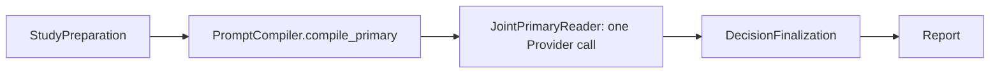
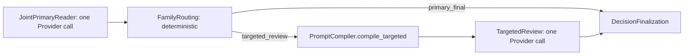

# MS-Image Prompt 运行合同与最小 Provider 链路调整方案

状态：`CURRENT_PROMPT_DECISION / PROVIDER_DISABLED_PLACEHOLDER_PRESENT / NOT_IMPLEMENTED`

日期：2026-08-20

适用范围：XRay Primary/Targeted Prompt、AI Config、AI Call、Provider qualification、Evaluation Prompt 审计。

关联文档：

- [15-full-chain-gap-analysis-and-execution-plan.md](15-full-chain-gap-analysis-and-execution-plan.md)：全链执行门禁。
- [16-qj-reference-and-modular-convergence-plan.md](16-qj-reference-and-modular-convergence-plan.md)：公共 AI 调用层和 XRay 专项 Stage 的模块边界。
- [14-xray-specialty-design.md](14-xray-specialty-design.md)：Family/Focus/Strategy、Primary/Targeted 医学边界。
- [设计母文](../ms-image-final-architecture-and-database-design.md)：`ai_config_record` 的目标字段合同。

> 本文冻结 Prompt 链的最小化设计，不实施真实 Provider，不生成迁移脚本，不改变医学结果或评测分母。实际代码实施必须先满足本文的编译、版本、泄漏与调用数合同。

---

## 1. 执行结论

### 1.1 唯一目标

Prompt 不得成为第二套流水线、第二套配置中心或额外模型调用来源。

目标在线医学调用只允许：

```text
Primary-only Profile:
  JointPrimaryReader × 1

Targeted candidate Profile:
  JointPrimaryReader × 1
  + TargetedReview × 0..1
```

任何病例的在线医学 Provider 调用数：

```text
最少 1 次
最多 2 次
```

### 1.2 不允许的冗余

首期明确不实现：

```text
每 Family 一次模型调用
每器官一次模型调用
每 Focus 一次模型调用
每 Strategy 一次模型调用
normal checker / confirmer / conflict resolver 独立调用
多 Reader 投票
Prompt 独立 Stage
Prompt 独立数据库表
Worker 读取 latest Prompt
```

### 1.3 推荐的收敛决策

```text
Decision: existing-entry internal modular completion
Confidence: Direct
```

保留：

```text
AIConfigService -> immutable Config release
AIRequestService -> physical Provider Call
ImagingExecutionService -> lease/CAS/persist/schedule
XRay Stage -> choose Prompt/Schema/Family/Focus/Strategy
```

新增：

```text
app/core/ai/prompting/ PromptCatalog + PromptCompiler
```

不新增业务 Service、Prompt 表、第二 AI Request Service 或第二 Worker。

---

## 2. 当前代码审计

### 2.1 当前 Prompt 事实源混杂

当前存在三类来源：

| 来源 | 当前作用 | 问题 | 处理 |
|---|---|---|---|
| `ImagingExecutionService` 硬编码 SHA | provider-disabled Call 的 Prompt/Schema SHA | SHA 来自标签字符串，不来自真实内容 | 移除占位语义 |
| `XRayPromptRegistry` 文件 Prompt | legacy request gate、qualification | 只含 `xray.request_gate.v1`，不是目标 Primary/Targeted | 保留 legacy/qualification |
| 旧 AI runtime 五表 | 旧 AIGovernance Prompt/model/connection | 分散、可含明文 key、与目标 Config 重叠 | 隔离 legacy |

当前硬编码位置：

```text
app/service/imaging_execution_service.py:82-86
app/service/imaging_execution_service.py:106-110
```

当前占位符：

```text
joint-primary-disabled.v1
primary-candidate.v1
targeted-review-disabled.v1
targeted-candidate.v1
```

它们只是对标签字符串计算 SHA，不能证明 Prompt/Schema 内容：

```text
sha256(b"joint-primary-disabled.v1")
sha256(b"primary-candidate.v1")
```

### 2.2 当前目标 AI Config 缺口

当前 `AIConfigCreate` 只接收：

```text
profile_key
capability_manifest
provider_plan
budget_policy
```

见：

```text
app/schemas/ai_config.py:9-18
app/service/ai_config_service.py:41-48
```

当前 `ai_config_record` 缺少设计母文要求的：

```text
pipeline_manifest_json
prompt_bundle_json
schema_bundle_json
model_policy_json
release_fingerprint
config_sha256
published_by_id
validated_at
activated_at
retired_at
```

设计母文目标字段见：

```text
docs/ms-image-final-architecture-and-database-design.md:1532-1568
```

### 2.3 当前 Provider-disabled 的正确定位

当前 provider-disabled 链是工程闭环，不是真实医学调用：

```text
AICall prepared
-> status=failed
-> error_code=provider_disabled
-> medical_status=not_produced
```

见：

```text
app/service/ai_request_service.py:30-64
```

后续不能继续用假 Prompt SHA。provider-disabled 应编译真实冻结 Prompt/Schema，但禁止发送 Provider。

---

## 3. 唯一版本模型

Prompt 链只允许四类版本/指纹，职责必须互斥。

| 层 | 运行时意义 | 是否可变 | 事实 owner |
|---|---|---:|---|
| Config Release | 本 Task 使用哪套整体 Prompt/Schema/model/provider/profile | 不可变 | `ai_config_record` |
| Prompt Bundle SHA | Primary/Targeted 素材组合是什么 | 不可变 | `ai_config_record` |
| Schema SHA | 完整医学结果合同是什么 | 不可变 | `ai_config_record` |
| Rendered Prompt SHA | 本次具体调用实际看到的内容 | 每次 Call 派生 | `ai_call_record` |

### 3.1 Config Release 是唯一运行版本中心

例如：

```text
config_key = xray_diagnose
version = 2026-08-20.1
release_fingerprint = sha256(...)
config_sha256 = sha256(...)
```

Task 冻结：

```text
ai_config_id
release_fingerprint
compiled_pipeline_sha256
assignment_sha256
```

Worker 只从冻结 Config 读取 Bundle，不读取最新 Catalog、文件路径或旧表。

### 3.2 Prompt Catalog 不是运行时版本中心

Catalog 只服务开发和 Config 编译。推荐文件名不再用运行语义 `*.v1`：

```text
prompts/xray/
├── catalog.json
├── joint_primary_base.txt
├── joint_primary_module_thoracic.txt
├── joint_primary_module_abdominal.txt
├── targeted_focus_base.txt
├── targeted_focus_thoracic_lung_pattern.txt
└── review_strategy_high_recall.txt
```

Catalog 记录：

```text
catalog_revision
prompt_key
prompt_role
content_sha256
language
eligibility
```

内容变化：

```text
content SHA 变化
-> Bundle SHA 变化
-> 新 Config Release
```

不创建：

```text
latest
final
v1/v2 文件作为运行时选择依据
```

### 3.3 Primary/Targeted 共用一个最终 Schema

统一：

```text
schema_key = complete_medical_result
schema_version = 1
schema_sha256 = ...
```

Primary 与 Targeted 都必须输出：

```text
medical_status
findings
normal_basis
coverage
families_not_assessed
limitations
review_reason
source_refs
```

Primary 可额外输出可选：

```text
targeted_candidate
```

不保留：

```text
primary-candidate.v1
targeted-candidate.v1
```

两套重复最终 Schema。

---

## 4. 最小 Prompt 运行链

### 4.1 Primary-only



Primary 编译顺序固定：

```text
1. joint_primary_base × 1
2. applicable joint_primary_module × 0..5
3. technical_evidence × 0..1
4. CompleteMedicalResult output contract × 1
5. SAFE_STUDY_CONTEXT_JSON × 1
```

五个 Family 模块按固定顺序：

```text
thoracic
abdominal
appendicular_orthopedic
axial_orthopedic
head_neck
```

Family 只决定同一 Prompt 内是否加载片段，不增加 Provider 调用。

### 4.2 Targeted candidate



Targeted 编译顺序：

```text
1. targeted_focus base × 1
2. selected targeted_focus × 1
3. review_strategy × 0..1
4. technical_evidence × 0..1
5. CompleteMedicalResult output contract × 1
6. PRIMARY_COMPLETE_RESULT_JSON × 1
7. SAFE_STUDY_CONTEXT_JSON × 1
```

`targeted_focus` 使用同一 role 表示两类片段：

```text
focus_key = null       -> Targeted 通用规则
focus_key = <focus>    -> 唯一具体 Focus
```

不新增第七种 `targeted_base` role。

---

## 5. 六种 Prompt role 的边界

| Role | 在线 Provider 调用 | 正确职责 | 禁止职责 |
|---|---:|---|---|
| `joint_primary_base` | 否 | 一次完整病例阅读的共同安全/输出规则 | Family-specific 医学调用 |
| `joint_primary_module` | 否 | 覆盖适用 Family 的医学检查模块 | 独立 Stage/调用 |
| `targeted_focus` | 否 | Targeted 基础规则和唯一 Focus | 多 Focus 并发 |
| `review_strategy` | 否 | 对唯一 Focus 的可选复核方式 | 独立触发/覆盖结果合同 |
| `technical_evidence` | 否 | 来源、派生图、crop/mask 使用边界 | 直接医学 verdict |
| `offline_evaluation` | 永不在线 | 离线 Prompt 审计/失败分析 | 写 Task/Report/Gold |

结论：

```text
六种 role ≠ 六次调用
六种 role ≠ 六个 Stage
六种 role ≠ 六张表
```

---

## 6. Prompt Bundle 合同

`ai_config_record.prompt_bundle_json` 使用：

```json
{
  "bundle_version": "xray-prompt-bundle.v1",
  "catalog_revision": "2026-08-20.1",
  "language": "en",
  "primary": {
    "base": {},
    "modules": [],
    "technical_evidence": null
  },
  "targeted": {
    "base": {},
    "focuses": [],
    "strategies": [],
    "technical_evidence": null
  },
  "offline_evaluation": [],
  "bundle_sha256": "..."
}
```

每个 Manifest 条目至少包含：

```text
prompt_key
prompt_role
language
content
content_sha256
family_key
report_domain_keys
focus_key
strategy_key
species
input_scope
output_contract
eligibility
status
```

运行规则：

- Config 激活后 Bundle 不可修改。
- Config API 不接受任意 raw Prompt 文本。
- Admin 只能提交 Catalog revision 和选择规则。
- Compiler 将完整内容、SHA、选择结果写入 Config Release。
- 普通 API 响应只返回 key/version/SHA，不返回完整 Prompt content。

---

## 7. Prompt Compiler 合同

新增组件，不新增业务 Service：

```text
app/core/ai/prompting/
├── contracts.py
├── catalog.py
├── compiler.py
└── leakage.py
```

类型：

```text
PromptAsset
PromptManifest
PromptBundle
SchemaBundle
PromptSelection
CompiledPrompt
```

`CompiledPrompt` 必须包含：

```text
rendered_text
rendered_sha256
context_sha256
schema_sha256
selected_prompt_keys
selected_family_keys
selected_focus_key
selected_strategy_key
estimated_tokens
```

### 7.1 长度与预算

冻结：

```text
max_prompt_chars
max_context_chars
max_input_tokens
max_output_tokens
max_images
max_calls
deadline
cost_limit
```

禁止静默截断。

顺序：

```text
仅加载实际覆盖 Family
-> 不加载无关 technical evidence
-> 若仍超限，Preparation/PromptCompiler fail closed
-> prompt_budget_exceeded
-> medical_status=not_produced
```

不允许以“拆成多个模型调用”解决长度问题。

### 7.2 泄漏检查

Primary 禁止：

```text
Gold
truth
annotation
failure_bank
score
expected_status
holdout
signed_url
API key
base URL
filesystem path
previous model output
```

Targeted 额外允许：

```text
冻结 Primary 完整结果
selected family/focus/strategy
source finding IDs
coverage proof
route reason codes
```

泄漏命中：

```text
leakage_invalid
不发送 Provider
不生成医学结果
```

---

## 8. provider-disabled 正确行为

provider-disabled 不再使用：

```text
sha256(b"joint-primary-disabled.v1")
sha256(b"primary-candidate.v1")
```

正确流程：

```text
冻结 AI Config
-> 编译真实 Primary/Targeted Prompt Bundle
-> 编译真实 CompleteMedicalResult Schema
-> 写 prepared AICall
-> 写真实 rendered_prompt_sha256/schema_sha256
-> 不发送 Provider
-> status=failed
-> error_code=provider_disabled
-> medical_status=not_produced
```

因此 provider-disabled 链能够验证：

```text
Prompt 是否能编译
Schema 是否可绑定
Bundle 是否冻结
调用 fingerprint 是否可重放
Task/Call/Report/Evaluation 是否正确连通
```

但不产生真实医学结果。

---

## 9. AI Config 与 AI Request 的职责

### AIConfigService

负责：

```text
Catalog resolve
-> Prompt bundle compile
-> Schema bundle compile
-> Profile compile
-> Provider/model/budget validation
-> release_fingerprint/config_sha256
-> immutable Config revision
```

不负责：

```text
病例输入
运行 Prompt render
Task/Report 写入
Gold/Holdout
```

### XRay Stage

负责：

```text
选择 Primary 或 Targeted 编译入口
提供 Study/coverage/species/Family/Focus/Strategy 上下文
构造 AIRequestCommand
```

不负责：

```text
commit
Outbox
Provider transport
Call retry
Gold
Report final state
```

### AIRequestService

负责：

```text
prepare_call
send_call
receipt/full-sent
unknown reconcile
transport retry
schema acceptance
budget settlement
```

不负责：

```text
选择 Family
选择 Focus
选择 Strategy
读取 Gold
决定医学所有者
```

---

## 10. 需要补齐的 AI Config 字段

在未来授权迁移前，目标 Model/Schema 需要设计并补齐：

```text
pipeline_manifest_json
prompt_bundle_json
schema_bundle_json
model_policy_json
release_fingerprint
config_sha256
published_by_id
validated_at
activated_at
retired_at
```

不新增：

```text
prompt_record
schema_record
family_record
focus_record
strategy_record
model_pool_record
connection_record
```

首期全部作为 Config Release 内不可变 JSON/指纹存在。

---

## 11. 实施顺序

### P4.0：合同冻结

- 六种 role。
- Catalog Manifest。
- Bundle Schema。
- CompleteMedicalResult Schema。
- 编译顺序。
- context allowlist。
- 长度/预算规则。

只写代码与 provider-disabled inline fake，不发送真实 Provider。

### P4.1：Catalog 与 Compiler

- 创建 target `prompts/xray/` Catalog。
- 实现 checksum/language/status 校验。
- 实现 Primary/Targeted deterministic compile。
- 实现 leakage 检查。
- 实现 token/char preflight。

### P4.2：Config Release 收口

- 扩展 AIConfig Model/Schema/DAL/Service。
- Catalog selection 编译进 Bundle。
- Config validate/activate 校验 Bundle/Schema/model/provider/budget。
- target Config API 不接 raw Prompt 内容。

### P4.3：provider-disabled 真 Bundle 验证

- 删除四个硬编码 placeholder SHA。
- provider-disabled 编译真实 Bundle/Schema。
- AICall 保存实际 rendered Prompt SHA。
- 验证 Task/Call/Report/Exporter/Evaluation fingerprints。

### P4.4：真实 Primary Provider

- `prepare_call/send_call/reconcile_unknown`。
- full-sent、receipt、actual model。
- response ObjectRef/hash。
- CompleteMedicalResult Schema。

仅 qualification/development，不发布。

### P4.5：Primary 模块消融

比较：

```text
base only
base + applicable modules
base + applicable modules + technical evidence
```

固定：

```text
same cases
same images
same schema
same model
same provider schedule
same scorer
```

### P4.6：Targeted 候选

只有 Primary baseline 冻结后：

```text
Router -> unique Family/Focus -> optional Strategy -> one Targeted Call
```

Targeted 只能 validation-only/shadow。

---

## 12. 验收与停止条件

### Catalog/Compiler

- duplicate key/SHA 拒绝。
- checksum mismatch 拒绝。
- inactive/draft asset 拒绝。
- language fallback 禁止。
- 相同输入产生相同 Prompt SHA。
- Primary 不超过 1 次调用。
- Targeted 不超过 2 次总调用。
- 超预算 fail closed。

### Config

- Prompt/Schema/model/provider 任一变化创建新 Config Release。
- Active Config 正文不可覆盖。
- target Config 不读取旧 AI 五表。
- Secret 不进入 DB/API/log/Artifact。

### AI Call

- Call 发送前 prepared。
- retry 不创建第二逻辑 Call。
- unknown 先 reconcile。
- actual model mismatch 失败。
- full-sent/receipt 不完整不得医学完成。
- Schema invalid 不生成 Report。

### 立即停止

```text
Worker 读取 latest Prompt
默认链出现多个医学调用
每 Family/Strategy 独立调用模型
Prompt 静默截断
Gold/Holdout 进入在线 Prompt
Targeted 技术失败静默回退 Primary
Prompt/model/schema 同时改变却进行 A/B
```

---

## 13. 当前固定决策

- Prompt 语言首期固定 `en`。
- Report 本地化不增加医学调用。
- Prompt Catalog 使用代码资产，不新增 Prompt 表。
- 运行时唯一版本中心是 AI Config Release。
- Fragment 只用于编译，不是独立运行版本/表/Stage/调用。
- Primary 和 Targeted 共用 `complete_medical_result` Schema。
- provider-disabled 也必须编译真实 Prompt/Schema。
- 默认链 Primary-only。
- Targeted 最多一次，只处理唯一 Focus。
- 旧 `XRayPromptRegistry` 与旧 AI 五表只留在 legacy/qualification，不能成为目标 Prompt 事实源。
- 迁移与真实 Provider 仍需对应阶段授权和门禁。
