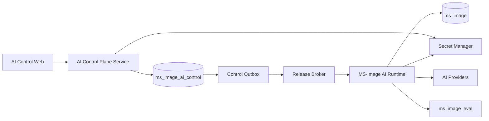
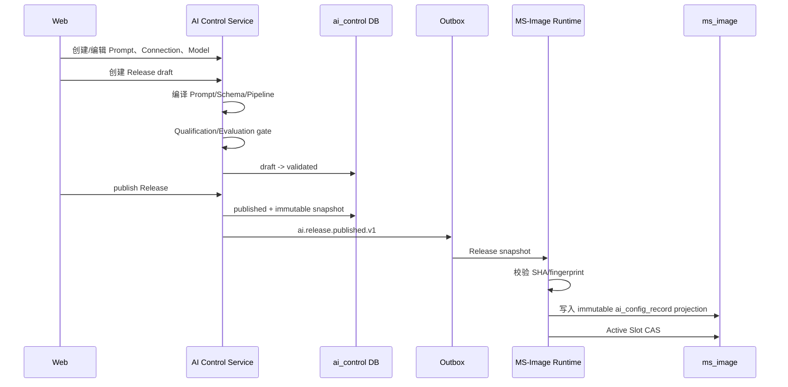

# MS-Image AI / Prompt Web 控制面与运行时完整架构方案

状态：`CURRENT_AI_CONTROL_PLANE_DESIGN / TARGET_ONLY_CODEBASE / NOT_IMPLEMENTED`

日期：2026-08-20

适用范围：AI 连接、模型目录、中文 Prompt、Schema、AI Release、模型竞速、真实 Provider 请求、Web 管理后台、Qualification、Evaluation 与发布回滚。

当前代码基线：`6ea95ba5b0f95d1144dce0af266e746bf6891b18`

工作区：`/Users/mozhicheng/workspace/code/cy-code/ms-image`

> 本文供新的开发会话直接实施 AI 请求与 Prompt 管理链。本文不授权当前会话创建迁移、连接真实 Provider 或操作真实生产数据库。实施前仍需实时核对 Git、handoff 和用户授权。

关联文档：

- [15-full-chain-gap-analysis-and-execution-plan.md](15-full-chain-gap-analysis-and-execution-plan.md)：全链阶段、运行与医学门禁。
- [16-qj-reference-and-modular-convergence-plan.md](16-qj-reference-and-modular-convergence-plan.md)：公共/专项 Service、Worker 与外部商业控制面边界。
- [17-prompt-runtime-contract-and-minimal-provider-plan.md](17-prompt-runtime-contract-and-minimal-provider-plan.md)：zh-CN Prompt、Config Release、Primary/Targeted 最小调用合同。
- [14-xray-specialty-design.md](14-xray-specialty-design.md)：XRay Family/Focus/Strategy 医学边界。

---

## 1. 当前背景与事实

### 1.1 当前代码已经完成

MS-Image 当前已实现：

```text
Session / Study / Series / Image
Task / StageCheckpoint / Outbox
AIConfigRecord / AICall
Report
Evaluation Job / Outbox / Run / Artifact
```

Prompt P4.0-P4.3 已实现：

```text
zh-CN Prompt Catalog
Primary/Targeted PromptCompiler
CompleteMedicalResult Schema
Prompt leakage / budget fail closed
prompt_bundle_json
schema_bundle_json
model_policy_json
config_sha256
release_fingerprint
provider-disabled 真 Prompt/Schema SHA
Targeted experiment-only gate
```

当前未实现：

```text
真实 Provider send
AI connection 管理
模型目录
AI Call Attempt / race winner
Web Prompt 编辑与审批
Release publish event
真实 Provider qualification
真实模型 paired A/B
```

### 1.2 Legacy 已从当前代码库删除

当前代码、API、Worker 和 ORM metadata 已移除：

```text
旧 ai_config / gpt_config / ai_prompt_template / ai_model_pool / ai_api_connection ORM
旧 xray_accuracy 十表 ORM/CRUD/Service/API/Worker
旧 XRayPromptRegistry
旧 AIGovernanceService
旧 xray relay/worker
MongoEngine CRUDBase
```

当前目标 metadata 只包含在线核心、cursor 和 Evaluation 表。

历史物理 `ms_image` 数据库仍可能存在旧表，但当前代码不会读写。物理 archive/drop 需单独授权。

---

## 2. 新系统要解决的问题

Web 控制面需要支持：

1. 管理多个 Provider endpoint 和 API key 引用；
2. 管理一个 Provider 下的多个模型；
3. 频繁切换 active 模型；
4. 配置单模型或模型竞速；
5. 编辑 zh-CN Prompt；
6. 维护 Prompt revision、review、publish、archive；
7. 维护 JSON Schema revision；
8. 组合 Prompt、Schema、Model、Connection、Profile、预算为 Release；
9. validation-only、shadow、gray、production 发布；
10. 查看真实调用、各 lane、winner、错误、成本和延迟；
11. 保证 Secret 不进入数据库、日志、Artifact 或浏览器；
12. 保证运行中 Task 永远使用冻结 Release。

---

## 3. 总体服务架构

推荐两个可独立部署的后端服务，不继续拆更多微服务：

```text
AI Control Plane Service
AI Runtime Service
```

Evaluation 继续使用现有 `ms_image_eval`，不新建第四个 AI 服务。



### 3.1 AI Control Plane Service

负责：

```text
Connection metadata
Model catalog
Prompt/Schema revision
Release composition
Validation
Approval
Publish/retire/rollback
Release Outbox
Audit
```

不负责：

```text
病例输入
Task/Stage 状态
Provider 网络调用
AI Call lease
Report
医学最终 owner
```

### 3.2 AI Runtime Service

当前可以继续位于 MS-Image 服务内部，未来按负载单独部署进程。

负责：

```text
接收 immutable Release snapshot
Task 冻结 AI Config projection
Prompt render
AICall logical aggregate
AICallAttempt physical lane
Provider send / receipt / unknown reconcile
Winner CAS
Stage result
```

不负责：

```text
Prompt 编辑
Connection 编辑
Release 审批
Gold/Holdout
客户 API Key/计费
```

---

## 4. 数据库边界

### 4.1 `ms_image_ai_control`

Web 控制面拥有以下表：

```text
ai_connection_record
ai_model_record
ai_prompt_record
ai_prompt_revision_record
ai_schema_record
ai_schema_revision_record
ai_release_record
ai_control_outbox_record
ai_control_audit_record
```

共 9 张控制面表。

### 4.2 `ms_image`

运行时保留：

```text
ai_config_record
ai_call_record
ai_call_attempt_record
```

其中 `ai_config_record` 是已发布 Release 的不可变运行投影，不是控制面编辑源。

### 4.3 `ms_image_eval`

继续使用：

```text
evaluation_job_record
evaluation_outbox_record
evaluation_run_record
evaluation_artifact_record
```

保存：

```text
Dataset
Gold
Failure Bank
paired A/B
Holdout
统计
审批证据
```

---

## 5. AI Connection 表

## `ai_connection_record`

一行是一条不可变 Provider connection revision。

```text
id VARCHAR(64) PK
connection_key VARCHAR(128)
version VARCHAR(64)
provider_kind VARCHAR(64)
api_format VARCHAR(40)
base_url VARCHAR(512)
secret_ref VARCHAR(256)
region VARCHAR(64) NULL
capability_json JSON
connection_sha256 CHAR(64)
status VARCHAR(32)
state_version BIGINT
created_at DATETIME(6)
updated_at DATETIME(6)
```

约束：

```text
UNIQUE(connection_key, version)
UNIQUE(connection_sha256)
```

状态：

```text
draft -> validated -> active -> retired
```

数据库保存 `base_url` 和 `secret_ref`，但不保存 `api_key`。

`secret_ref` 示例：

```text
secret://ms-image/providers/openai-cn-primary
env://MS_IMAGE_PROVIDER_OPENAI_CN_PRIMARY_API_KEY
```

浏览器永远看不到 Secret 值。

---

## 6. AI Model 表

## `ai_model_record`

模型有独立能力、qualification、上下文上限和状态，因此作为独立控制面表。

```text
id VARCHAR(64) PK
model_key VARCHAR(128)
version VARCHAR(64)
connection_id VARCHAR(64)
requested_model VARCHAR(160)
display_name VARCHAR(160)
capability_json JSON
model_policy_json JSON
qualification_artifact_ref JSON NULL
model_sha256 CHAR(64)
status VARCHAR(32)
state_version BIGINT
created_at DATETIME(6)
updated_at DATETIME(6)
```

约束：

```text
UNIQUE(model_key, version)
UNIQUE(model_sha256)
```

模型切换只创建新 Release；不修改运行中 Task。

---

## 7. Prompt 表

因为需要 Web 编辑、revision、review、publish 和 rollback，Prompt 现在具备独立生命周期，值得拆表。

## `ai_prompt_record`

Prompt 稳定身份：

```text
id
prompt_key
prompt_role
name
module_key
family_key NULL
focus_key NULL
strategy_key NULL
input_scope
output_contract
status
created_at
updated_at
```

## `ai_prompt_revision_record`

不可变内容版本：

```text
id
prompt_id
revision
language
content MEDIUMTEXT
content_sha256 CHAR(64)
variables_json JSON
eligibility_json JSON
status
reviewed_by_id NULL
reviewed_at NULL
published_at NULL
created_at
updated_at
```

状态：

```text
draft -> review -> published -> archived
```

首期语言固定：

```text
zh-CN
```

无英文 fallback。

---

## 8. Schema 表

## `ai_schema_record`

```text
id
schema_key
name
output_contract
status
created_at
updated_at
```

## `ai_schema_revision_record`

```text
id
schema_id
revision
schema_json JSON
schema_sha256 CHAR(64)
status
reviewed_by_id NULL
published_at NULL
created_at
updated_at
```

Primary 与 Targeted 共享：

```text
complete_medical_result
```

JSON key 保持英文稳定，字段内容由 Prompt 要求中文输出。

---

## 9. AI Release 表

## `ai_release_record`

一行是一套可以发布的完整 AI 配置。

```text
id
release_key
version
activation_scope
scope_key
profile_key
modality_type
task_type

prompt_bundle_json
schema_bundle_json
model_execution_policy_json
provider_policy_json
budget_policy_json
capability_manifest_json

compiled_pipeline_json
compiled_pipeline_sha256
config_sha256
release_fingerprint

status
state_version
validated_at NULL
published_at NULL
retired_at NULL
created_at
updated_at
```

状态：

```text
draft
-> validating
-> validated
-> published
-> retired
-> rejected
```

Release 保存 Prompt/Schema/Model/Connection 的精确 revision ID 与 SHA。

---

## 10. 模型竞速配置

Release 中：

```json
{
  "execution_mode": "race",
  "race_policy": {
    "max_parallel": 2,
    "winner_policy": "first_technically_valid",
    "cancel_pending_losers": true,
    "deadline_ms": 30000
  },
  "lanes": [
    {
      "lane_key": "gpt-primary",
      "model_id": "model_gpt",
      "connection_id": "conn_gpt",
      "priority": 1
    },
    {
      "lane_key": "gemini-primary",
      "model_id": "model_gemini",
      "connection_id": "conn_gemini",
      "priority": 2
    }
  ]
}
```

第一版限制：

```text
Primary single/race
Primary race lanes <= 2
Targeted single only
每 lane transport attempts <= 2
每病例 physical Provider attempts <= 3
```

Winner 只按技术有效性：

```text
actual model 合格
full-sent
receipt 合格
Schema 合格
response hash 合格
deadline 内
```

禁止按医学内容、Finding 数量或 confidence 选 Winner。

---

## 11. Release 发布链



跨服务发布必须使用控制面 Outbox，不能由 Web 请求直接跨 DB 写 `ms_image`。

---

## 12. 控制面 Outbox

## `ai_control_outbox_record`

```text
id
release_id
release_version
event_key
event_type
destination_key
message_version
message_json
message_sha256
publish_status
relay_owner_id
relay_lease_expires_at
attempt_count
next_retry_at
broker_message_id
published_at
error_code
created_at
updated_at
```

事件：

```text
ai.release.published.v1
ai.release.retired.v1
```

消息只含：

```text
release_id
release_fingerprint
snapshot_object_ref 或有界 snapshot
trace_id
```

不含 Secret。

---

## 13. Runtime AI Config 投影

控制面发布后，Runtime 在 `ms_image.ai_config_record` 保存不可变投影：

```text
control_release_id
control_release_version
prompt_bundle_json
schema_bundle_json
model_policy_json
provider_plan_json
compiled_pipeline_json
config_sha256
release_fingerprint
status
```

Runtime 不允许编辑这些字段，只允许 Active Slot CAS。

同一 `release_fingerprint` 重复发布必须幂等。

---

## 14. AI Call 与 Attempt

## `ai_call_record`

一次逻辑医学调用：

```text
id
task_id
stage_checkpoint_id
ai_config_id
logical_call_key
idempotency_key
config_sha256
rendered_prompt_sha256
schema_sha256
image_manifest_sha256
execution_mode
status
state_version
winner_attempt_id NULL
result_disposition
parsed_result_json
response_object_ref_json
response_sha256
budget_reservation_json
error_code
next_reconcile_at
prepared_at
finished_at
```

## `ai_call_attempt_record`

一次真实 Provider lane：

```text
id
ai_call_id
lane_key
attempt_no
ai_connection_id
connection_sha256
model_id
requested_model
actual_model
provider_request_id
request_sha256
requested_image_manifest_sha256
sent_image_manifest_sha256
image_count_requested
image_count_sent
image_receipt_json
status
state_version
result_disposition
response_object_ref_json
parsed_result_json
response_sha256
input_tokens
output_tokens
cost
latency_ms
error_code
next_reconcile_at
prepared_at
sent_at
finished_at
```

唯一约束：

```text
UNIQUE(ai_call_id, lane_key, attempt_no)
UNIQUE(idempotency_key)
```

---

## 15. Runtime 竞速链

```text
Stage 构造一个 Prompt
-> AIRequestService 创建一个 AICall
-> 同事务创建 N 个 Attempt(prepared)
-> 提交
-> 事务外并发请求 N 个 lane
-> 每个 Attempt 独立写回
-> 第一个技术合格 Attempt CAS 成为 Winner
-> loser/late 不得推进 Stage
-> Winner 结果推进 Finalization/Report
```

如果全部 failed：

```text
AICall.failed
medical_status=not_produced
```

如果无 Winner 且至少一个 unknown：

```text
AICall.unknown
先 reconcile
禁止创建第二逻辑 AICall
```

---

## 16. Prompt Web 功能

### 页面 1：Prompt 列表

- Prompt key/role/name/status；
- 当前 published revision；
- Family/Focus/Strategy；
- 搜索和过滤。

### 页面 2：Prompt 编辑

- zh-CN 内容编辑；
- variables/eligibility；
- checksum；
- leakage preflight；
- diff；
- 提交 review；
- publish/archive。

### 页面 3：Schema 管理

- JSON Schema 编辑；
- schema validation；
- diff；
- publish/archive。

### 页面 4：Connection 管理

- base URL；
- SecretRef；
- Provider kind/API format；
- region/capabilities；
- validate/activate/retire；
- 绝不显示 API key。

### 页面 5：Model 管理

- connection；
- requested model；
- capability；
- token/image limits；
- qualification status。

### 页面 6：Release Builder

- Profile；
- Prompt revisions；
- Schema revision；
- single/race；
- lane models/connections；
- budget/deadline；
- compile preview；
- validation errors；
- release fingerprint。

### 页面 7：发布与回滚

- validation-only；
- shadow；
- gray；
- production；
- active slot；
- publish/retire/rollback；
- evidence/approval。

### 页面 8：运行监控

- logical Calls；
- Attempts；
- winner/loser/late；
- model/connection；
- latency/cost/error；
- unknown reconcile；
- receipt/full-sent。

---

## 17. 控制面 API

全部 ID 使用 query/body，不使用 `/{id}`。

### Connection

```text
POST /ai-connections
GET  /ai-connections?id=
POST /ai-connections/validate
POST /ai-connections/activate
POST /ai-connections/retire
```

### Model

```text
POST /ai-models
GET  /ai-models?id=
POST /ai-models/validate
POST /ai-models/retire
```

### Prompt

```text
POST /ai-prompts
GET  /ai-prompts?id=
POST /ai-prompts/revisions
POST /ai-prompts/reviews
POST /ai-prompts/publish
POST /ai-prompts/archive
```

### Schema

```text
POST /ai-schemas
GET  /ai-schemas?id=
POST /ai-schemas/revisions
POST /ai-schemas/publish
POST /ai-schemas/archive
```

### Release

```text
POST /ai-releases
GET  /ai-releases?id=
POST /ai-releases/compile
POST /ai-releases/validate
POST /ai-releases/publish
POST /ai-releases/retire
POST /ai-releases/rollback
```

---

## 18. Web 权限

控制面角色：

```text
ai_viewer
ai_editor
ai_reviewer
ai_publisher
ai_operator
```

| 权限 | Viewer | Editor | Reviewer | Publisher | Operator |
|---|---:|---:|---:|---:|---:|
| 查看配置 | 是 | 是 | 是 | 是 | 是 |
| 编辑 Prompt/Schema | 否 | 是 | 否 | 否 | 否 |
| Review | 否 | 否 | 是 | 否 | 否 |
| Publish Release | 否 | 否 | 否 | 是 | 否 |
| Connection/SecretRef | 否 | 部分 | 否 | 部分 | 是 |
| 运行监控/reconcile | 否 | 否 | 否 | 否 | 是 |

Secret 值对所有 Web 用户不可见。

---

## 19. Qualification 与发布门禁

Connection validation：

```text
endpoint 可达
认证有效
api format 有效
TLS
模型列表/指定模型
```

Model qualification：

```text
视觉输入
JSON Schema
actual model
full-sent/receipt
timeout/rate-limit
cost
response ObjectRef/hash
```

Release 发布前：

```text
Connection active/qualified
Model active/qualified
Prompt published
Schema published
Profile valid
Budget valid
Primary-only gate
Evaluation evidence
HumanApproval
```

Targeted Release 只能 experiment/validation-only/shadow，直到 paired A/B 与 Holdout 通过。

---

## 20. Secret 边界

数据库只保存：

```text
secret_ref
```

生产：

```text
Secret Manager
```

开发：

```text
本地忽略的 .env-01
```

禁止：

```text
API key 写数据库
API key 返回 Web
API key 写日志
API key 写 Artifact
API key 写 Error message
API key 写 Release snapshot
```

`base_url` 可保存在控制面 DB，但只允许 Admin/Operator 查看，不进入普通 Runtime API 响应。

---

## 21. 历史数据处理

旧物理 `ms_image` 约 8.57GB，包含历史：

```text
ai_request_log
Prompt/Revision
AI Config/Connection/Model Pool
影像/报告/任务/会话
```

建议：

```text
ms_image_ai_archive_20260820
```

归档：

- 历史 AI request metadata/hash；
- 经授权的 Prompt/response 正文；
- Prompt revision 与治理日志；
- 不含 api_key 的连接元信息。

不直接迁入新 `ai_call_record` 或 `ai_connection_record`。

旧 `ai_api_connection.api_key` 必须 scrub/轮换，不进入新控制面。

---

## 22. 分阶段实施

### Phase A：控制面基础

- 新 `ms_image_ai_control` DB/session；
- Connection/Model/Prompt/Schema Model/DAL/Service/API；
- RBAC；
- Web 基础页面；
- SecretRef，不接真实 Provider。

### Phase B：Release Compiler

- Release Builder；
- Prompt/Schema/Profile/Model/Race plan compile；
- deterministic fingerprints；
- validation errors；
- Audit。

### Phase C：Release 发布同步

- Control Outbox；
- Broker event；
- Runtime immutable `ai_config_record` projection；
- Active Slot CAS；
- idempotent publish/retire/rollback。

### Phase D：Runtime Single Model

- `ai_connection_record` projection/lookup；
- real Provider single lane；
- AICall/AICallAttempt；
- receipt/actual model/unknown reconcile；
- Primary-only qualification。

### Phase E：Primary Race

- 最多 2 lanes；
- first technically valid；
- Winner CAS；
- loser/late/unknown；
- 全成本计费；
- Evaluation 单变量 A/B。

### Phase F：Targeted

- Targeted single lane；
- unique Focus/Strategy；
- fail closed；
- paired A/B；
- Holdout；
- shadow/gray。

---

## 23. 验证策略

### 控制面

- revision 不覆盖；
- checksum/fingerprint；
- Prompt zh-CN 无 fallback；
- Schema 校验；
- Secret 不泄漏；
- RBAC；
- Release publish idempotency。

### Runtime

- prepared before network；
- no DB transaction during Provider I/O；
- duplicate message；
- unknown reconcile；
- Winner CAS；
- late loser 不推进 Stage；
- actual model/full-sent/receipt；
- budget reserve/settle；
- graceful shutdown/lease recovery。

### 医学与 Evaluation

- same case/images/Prompt/Schema；
- single vs race 只改变 race plan；
- normal FP；
- abnormal miss；
- unsafe flip；
- missing/technical failure；
- cost/latency/receipt；
- isolated Holdout。

---

## 24. 明确不建设

首期不建设：

```text
任意 DAG Builder
多轮 Stage Plan/Round 表
三模型以上 race
Targeted race
按医学内容选 Winner
AI 自动修改 Prompt
AI 自动发布 Release
客户 Project/API Key/Wallet/Billing
Prompt 与 Runtime 共库直接编辑
Secret 明文管理页面
```

---

## 25. 新会话启动提示

```text
请在以下工作区继续设计和实现 MS-Image AI / Prompt Web 控制面与 Runtime：

/Users/mozhicheng/workspace/code/cy-code/ms-image

开始前完整读取：

1. AGENTS.md
2. AGENT_HANDOFF.md
3. .agent-handoff/snapshot.md
4. .agent-handoff/risks.md
5. .agent-handoff/backlog.md
6. docs/refactor/15-full-chain-gap-analysis-and-execution-plan.md
7. docs/refactor/16-qj-reference-and-modular-convergence-plan.md
8. docs/refactor/17-prompt-runtime-contract-and-minimal-provider-plan.md
9. docs/refactor/19-ai-prompt-control-plane-web-and-runtime-architecture.md
10. 当前 AIConfig/AIRequest/PromptCompiler/AICall/Task/Stage/Report/Evaluation 源码

当前目标：

- 构建可由 Web 管理的 AI Connection、Model、Prompt、Schema、Release 控制面；
- Runtime 继续保持 Task/Stage/AICall/Report 唯一事实 owner；
- 支持单模型和 Primary 最多 2 lane 模型竞速；
- Targeted 首期只允许单 lane；
- Winner 只能按技术有效性选择；
- Secret 不进入数据库、日志、Artifact 或浏览器；
- 不恢复旧 AI 五表或 xray_accuracy 运行链。

必须保持：

API -> Service -> DalBase -> Model/DB
Worker -> Service -> DalBase -> Model/DB

资源 ID 只使用 query/body，不使用 /{id}。
目标 MySQL 表不使用 FK/Enum/tenant/联合主键。
每张表使用独立 id VARCHAR(64) 单列主键。

不要直接复制旧 ai_config/ai_prompt/ai_model_pool/ai_api_connection 结构。
不要把 QJ Project/API Key/Kong/Wallet/Billing 复制进 MS-Image。
不要在没有用户明确迁移授权时生成迁移脚本或修改真实数据库。

先实时核对 Git HEAD/remote/dirty state，再输出：

1. 当前代码与本文目标的差距；
2. Phase A 最小切片；
3. 表/API/事件合同；
4. 验证、停止和回滚条件；
5. 需要用户再次确认的迁移/真实 Provider 权限。
```

---

## 26. 最终统一口径

```text
AI Control Plane
= 管 Connection / Model / Prompt / Schema / Release / Approval

AI Runtime
= 管 Task / Stage / Logical Call / Physical Attempt / Winner / Report

Prompt
= 控制面编辑 revision，Release 发布后 Runtime 只读不可变 Bundle

模型竞速
= 一个逻辑医学 Call + 多个物理 Attempt + 一个技术 Winner

Evaluation
= 判断候选是否值得发布，不直接修改 Active Release
```

Web 控制面可以拆成独立服务，但不能创建第二套 Task/Stage/Report/医学事实源。
