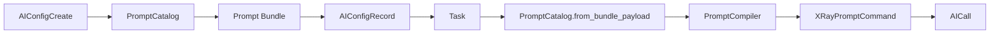
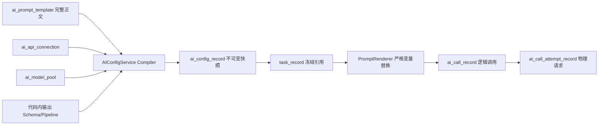

# MS-Image AI Prompt 简化控制面与运行时后续开发方案

> **当前事实边界（2026-08-25）**：本文是控制面与运行时的架构/历史实施参考，不是当前运行事实入口。尤其是 Config（配置）状态限制、Provider（模型提供方）接线和环境开关会随 v2 源码演进；例如 v2 Task（任务）冻结快照路径允许已冻结的 `active（激活）` 或 `retired（已退役）` Config（配置）继续运行。修改 Prompt/Config/Runtime 前，先读取 [24-current-runtime-audit-and-next-development-guide.md](24-current-runtime-audit-and-next-development-guide.md)，再核验相关源码和测试。

状态：`IMPLEMENTED_FOUNDATION / D5_RUNTIME_QUALIFICATION_PENDING / MEDICAL_ACCURACY_UNKNOWN`

日期：2026-08-24

代码基线：`492a249c98175bf818ce092451585db766d73e76`

工作区：`/Users/mozhicheng/workspace/code/cy-code/ms-image`

适用范围：Prompt 编辑、AI 连接、模型池、不可变 AI Config、Task 冻结、逻辑 AI Call、物理 Provider Attempt、Web 控制面、运行审计和后续真实 Provider 接入。

> 本文最初是实施级设计，当前工作树已经完成 Prompt/Connection/Pool/Config 控制面、Task 冻结、Logical Call/Physical Attempt 和 OpenAI-compatible Gateway Transport 的主体实现。当前实施状态、D5 缺口和新会话开发顺序以 [20-monorepo-refactor-new-session-prompt.md](20-monorepo-refactor-new-session-prompt.md) 为准。分段工程验证不代表完整 Worker Runtime 或医学准确率已经资格化。

关联文档：

- [15-full-chain-gap-analysis-and-execution-plan.md](15-full-chain-gap-analysis-and-execution-plan.md)：全链阶段与发布门禁。
- [16-qj-reference-and-modular-convergence-plan.md](16-qj-reference-and-modular-convergence-plan.md)：Backend Monorepo、Service、Worker 和模块边界。
- [17-prompt-runtime-contract-and-minimal-provider-plan.md](17-prompt-runtime-contract-and-minimal-provider-plan.md)：当前 Prompt Catalog/Compiler 与 provider-disabled 合同；其中多 Prompt 组合部分将被本文目标方案替代。
- [14-xray-specialty-design.md](14-xray-specialty-design.md)：XRay 医学业务边界；不是 Prompt 表拆分依据。

---

## 1. 最终结论

### 1.1 推荐的重构级别

```text
Decision: existing-entry internal modular refactor
Confidence: Direct
```

不回退当前 Runtime、Task、Stage、Outbox、Worker 和 `AIConfigRecord` 已经形成的稳定边界；只对 AI 控制面和 Prompt 编译链做内部收敛。

不采用两种极端方案：

1. 不让运行时直接读取“最新 Prompt 正文”；否则 Task 执行不可复现。
2. 不建设 Prompt 主档/Revision/Role/Schema/Release/Model/Lane 等大量拆表；当前需求没有证明这些表的独立生命周期价值。

### 1.2 最终业务链

```text
ai_prompt_template       一条完整 Prompt 正文
          +
ai_api_connection        Provider 连接元数据与 Secret 引用
          +
ai_model_pool            一个或少量有序模型 lane
          |
          v
ai_config_record         编译并冻结可运行配置
          |
          v
task_record              创建时冻结 ai_config_id 与各类 SHA
          |
          v
ai_call_record           一次逻辑 AI 调用
          |
          v
ai_call_attempt_record   一次真实 Provider 物理请求
```

只有 `ai_config_record` 是运行版本中心。Prompt、Connection 和 Model Pool 是控制面可编辑来源；Task 和 Runtime 不读取它们的“最新值”。

### 1.3 最终核心表集合

| 表 | 定位 | 本轮结论 |
|---|---|---|
| `ai_prompt_template` | 单正文 Prompt 的版本行 | 必要，新建目标模型 |
| `ai_api_connection` | Provider endpoint、协议、Secret 引用 | 必要，新建目标模型 |
| `ai_model_pool` | 可复用的单 lane 或最多双 lane 模型执行集合 | 必要，新建目标模型 |
| `ai_config_record` | Prompt、模型、连接、Schema、Pipeline、预算的不可变运行快照 | 必要，改造现有表 |
| `ai_control_audit_record` | 控制面只追加审计 | 必要，新建目标模型 |
| `ai_call_record` | Task/Stage 下的一次逻辑调用 | 必要，改造现有表 |
| `ai_call_attempt_record` | 一次真实 Provider 请求 | 真实 Provider 阶段必要，届时新建 |

最终是 **7 张 AI 核心表**，但不是一次性全部创建：Provider 保持 disabled 时，不提前创建没有真实执行事实的 Attempt 数据。

### 1.4 明确删除或不建设

不建设以下结构：

- 旧式 `gpt_config` 和 `gpt_config_item` 杂项配置桶；
- 平行于 `ai_config_record` 的第二张 AI Config 表；
- Prompt 主表加 Prompt Revision 双表；
- Prompt 角色、Family、Focus、Strategy 等正文分片表；
- 独立 Schema 主表和 Schema Revision 表；
- 独立 Model 主档表；
- 独立 Model Pool Lane 表；
- 独立 AI Release 表；
- Model Pool Override 表；
- 首期独立控制面数据库；
- 首期控制面 Outbox；
- 明文 Secret 字段；
- 运行时“读取最新 Prompt/Pool/Connection”的行为。

---

## 2. 权威范围、已知事实与未知项

### 2.1 权威范围

| 项 | 当前事实 |
|---|---|
| 工作区 | `/Users/mozhicheng/workspace/code/cy-code/ms-image` |
| 分支 | `codex/monorepo-runtime-foundation` |
| 基线提交 | `492a249c98175bf818ce092451585db766d73e76` |
| 后端布局 | `apps/backend` 共享 Model/Schema/CRUD/Core，三个独立 Service 入口 |
| 唯一数据库访问基类 | `apps.backend.core.crud.DalBase` |
| 在线数据库边界 | 继续使用既有 `ms_image` 边界，不新增 AI 专用数据库 |
| Provider 状态 | `PROVIDER_NOT_QUALIFIED` |
| 医学准确率 | `UNKNOWN`，本文不声称提升 |
| 本文授权 | 只修改设计文档，不生成迁移/测试脚本，不接真实基础设施 |

### 2.2 当前代码证据

| 事实 | 代码证据 | 判断 |
|---|---|---|
| `AIConfigRecord` 已存在且承担运行快照 | `apps/backend/models/ai_config_record.py:7-105` | 保留并改造，不另建 Release 表 |
| 当前 Config 冻结复杂 Prompt Bundle | `apps/backend/models/ai_config_record.py:60-78` | 目标改为单正文快照、模型快照、Schema 快照 |
| 当前创建合同接收 Prompt Catalog/Policy | `apps/backend/schemas/ai_config.py:10-75` | 目标改为只接收 Prompt ID、Pool ID 和必要配置元数据 |
| 当前 Config 编译依赖 `PromptCatalog`/`PromptCompiler` | `apps/backend/services/ai_control/service/ai_config_service.py:82-152` | 目标用单正文 Renderer 替代多资产编译 |
| 当前 Runtime 从 Bundle 重建 Catalog | `apps/backend/services/runtime/service/ai_request_service.py:44-66` | 目标直接读取 Config 中冻结正文 |
| 当前 Prompt Command 持有多种选择字段 | `apps/backend/services/runtime/stages/xray/prompt_commands.py:12-47` | 目标只构造安全运行变量，不再选择正文片段 |
| Task 已冻结 `ai_config_id` 和 Pipeline SHA | `apps/backend/models/task.py:25-29` | 正确边界，继续保留 |
| TaskService 已写入 Config 指纹摘要 | `apps/backend/services/runtime/service/task_service.py:133-139` | 将 Bundle SHA 替换为正文/模型/Schema SHA |
| 当前 AICall 混合逻辑调用和物理请求字段 | `apps/backend/models/ai_call.py:10-51` | 接真实 Provider 时拆出 Attempt |

### 2.3 历史只读证据

历史参考库曾存在：

```text
ai_prompt_template  375 行
ai_api_connection    96 行
ai_model_pool        19 行
ai_model_pool_lane   84 行
ai_config            640 行
```

证据位于：

- `docs/artifacts/reference-db-schema-summary.md`
- `docs/artifacts/reference-db-readonly-live.json`

历史数据证明旧链有业务使用基础，但不能直接复制旧结构：旧连接持久化过敏感值，旧 Pool 使用分隔字符串，旧 Prompt 缺少稳定 checksum/publish 合同。本文只复用直观业务链，不复用旧风险。

### 2.4 当前未知项

| UNKNOWN | 影响 | 解决门禁 |
|---|---|---|
| 生产 Secret Manager 类型和引用格式 | Connection 校验与 Provider 启动 | Phase D 前由基础设施 owner 冻结 |
| 首个真实 Provider 的 API 格式和幂等能力 | Attempt、unknown reconcile | Phase D qualification |
| 是否确有双模型竞速收益 | 是否启用 race | Phase E paired A/B 前保持关闭 |
| Prompt Web 的最终前端技术栈与页面仓库 | 页面实现位置 | 后端 API 合同稳定后确认 |
| 旧物理 AI 表是否仍需归档 | 迁移/清理策略 | 单独数据 owner 授权 |

---

## 3. 为什么 Prompt 一个表就够，但不能只靠 Prompt 表运行

### 3.1 Prompt 确实只需要一个表

用户对 Prompt 的核心判断是正确的：Prompt 的产品事实就是“一段完整正文”。

目标 `ai_prompt_template` 的一行代表：

```text
一个 prompt_key
+ 一个 version
+ 一段完整 content
+ 允许的变量合同
+ content_sha256
+ 生命周期状态
```

正文不再拆成基础段、医学模块段、技术证据段、Targeted Focus 段或 Strategy 段。Primary 和 Targeted 如果确实需要不同指令，就各自使用一条完整 Prompt 版本，而不是在运行时拼装多个角色。

### 3.2 为什么运行时不能直接读 Prompt 表的最新正文

仅执行：

```text
Task -> 读取 ai_prompt_template 最新 active 行 -> 调模型
```

会产生四个问题：

1. Task 创建后 Prompt 被修改，重试得到不同输入；
2. 同一 Task 的不同 Stage/Attempt 可能使用不同正文；
3. 无法证明历史报告使用了哪套模型、连接、预算和 Schema；
4. 只冻结 Prompt 仍不能冻结模型、Provider、Pipeline 和输出合同。

所以正确的简化不是删除所有 Config，而是：

```text
Prompt 编辑只保留一个表；
运行时只读取已经冻结的 AI Config。
```

### 3.3 为什么删除 `gpt_config`，保留 `ai_config_record`

两者职责不同：

| 名称 | 旧问题/目标职责 | 结论 |
|---|---|---|
| `gpt_config` / `gpt_config_item` | 零散参数、横向杂项、运行时再拼装 | 删除 |
| `ai_config_record` | 一次发布所需全部事实的不可变快照 | 保留 |

`temperature`、`max_output_tokens`、timeout 等模型执行参数进入 Model Pool lane 或 Config 的预算快照，不再需要一张通用键值配置表。

### 3.4 版本中心只有一个

Prompt、Connection 和 Pool 可以有多个 `validated` 版本，但它们不直接决定线上行为。

只有下面的激活动作改变新 Task 的运行版本：

```text
activate ai_config_record
```

已经创建的 Task 继续引用原来的 `ai_config_id`，即使该 Config 后续被 retired，也不能切换到新 Config。

---

## 4. 当前链路与目标链路差异

### 4.1 当前链路



当前实现已经具备正确的 Config/Task 冻结意识，但 Prompt 层过度模块化：

- `prompt_catalog_revision`
- `prompt_policy`
- `PRIMARY_FAMILY_ORDER`
- 多类 Prompt asset
- 运行时 Prompt 选择字段
- `prompt_bundle_json`

### 4.2 目标链路



### 4.3 已完成的运行一致性修正

当前 v2 `AIRequestService（AI 请求服务）` 已按下列规则执行：Task 创建后，即使 Config（配置）被切换为 `retired（已退役）`，旧 Task 仍可凭冻结快照继续执行；运行时不会重新选择当前 active Config（已激活配置）。

当前规则：

```text
Task 创建时：Config 必须 active。
Task 执行时：Config 可以 active 或 retired，但 id/hash/fingerprint 必须与 Task 冻结快照一致。
Task 执行时：禁止重新查询当前 active Config。
```

实现边界：v2 structured Prompt（结构化提示词）路径接受 `active（已激活）` 或 `retired（已退役）`，并校验 Task 冻结的 ID、SHA 和 fingerprint（指纹）；v1 legacy（旧版兼容）路径仍要求 `active`，在历史非终态 Task 清零前不得直接删除该兼容分支。

---

## 5. 方案比较与最终取舍

| 方案 | 优点 | 关键问题 | 结论 |
|---|---|---|---|
| A. Runtime 直接读取 Prompt 最新正文 | 表最少、实现直观 | Task 不可复现；模型/连接/Schema 无法同时冻结 | 拒绝 |
| B. Prompt/Revision/Role/Schema/Release/Model/Lane 全拆表 | 治理粒度极细 | 当前没有独立生命周期证据；Web 和运行链复杂；重复 source of truth | 拒绝 |
| C. Prompt/Connection/Pool 三个来源表 + 唯一 AI Config | 链路直观；保留版本冻结；可渐进替换当前代码 | 需要一次内部重构和兼容窗口 | 推荐 |
| D. 所有来源直接塞入 AI Config，不保留 Pool/Connection | 表更少 | Web 重复配置、连接/模型复用差、偏离已验证旧业务链 | 不推荐 |

为什么不是局部只删字段：当前 Catalog、Compiler、Schema、Config Create、Runtime Command 同时依赖多 Prompt 选择语义，单点删除会把不一致推到其他层。

为什么不是全链重写：Task、Stage、Runtime Service、Worker、DAL、Config 冻结、Call 幂等的主边界仍有价值；只需在现有入口内部替换 Prompt/配置实现。

---

## 6. 总体边界和数据所有权

### 6.1 服务边界

继续使用现有 Backend Monorepo：

```text
apps/backend/
├── core/
├── models/
├── schemas/
├── crud/
└── services/
    ├── ai_control/
    └── runtime/
```

职责：

```text
AI Control Service
  -> 管 Prompt/Connection/Pool
  -> 编译、验证、激活、回滚 AI Config
  -> 写控制面 Audit

Runtime Service
  -> 创建 Task 时解析 active AI Config
  -> 执行时只按 task.ai_config_id 读取冻结 Config
  -> 创建逻辑 Call 和物理 Attempt
```

不新建平行 Repository、DatabaseService、第二套 CRUDBase 或第二个 Service 根包。

### 6.2 数据库边界

首期所有 AI 控制面和 Runtime AI 表继续位于当前 `ms_image` 数据库边界。

理由：

1. 当前 `AIConfigRecord`、Task、Call 已在同一持久化链；
2. Runtime 需要低复杂度、强一致地读取不可变 Config；
3. 当前没有独立 AI Control 数据库的容量、权限或组织强制证据；
4. 拆库会立即引入发布事件、Outbox、投影延迟和双 source of truth。

只有未来明确满足以下条件时，才重新评估独立数据库和 Outbox：

- AI Control 有独立团队与独立变更窗口；
- 需要独立扩缩容、合规域或故障域；
- 已定义 Runtime projection、事件幂等、回放和一致性 SLA；
- 分库收益大于新增同步复杂度。

### 6.3 逻辑引用，不使用数据库外键

表之间使用 opaque ID 做逻辑引用，Service 在写入和状态转换时校验存在性、版本和状态。

例如：

```text
ai_model_pool.lane_plan_json[].connection_id
ai_config_record.prompt_template_id
ai_config_record.model_pool_id
task_record.ai_config_id
ai_call_record.ai_config_id
ai_call_attempt_record.ai_call_id
```

数据库不声明外键约束；删除使用生命周期状态，不物理删除被引用的已发布事实。

---

## 7. 数据库通用规则

所有目标新表遵循：

1. 独立 `id VARCHAR(64) NOT NULL` 单列主键；ID 使用服务端生成的 opaque ID。
2. 不使用联合主键。
3. 不使用数据库外键。
4. 状态和类型字段使用 `VARCHAR`，不使用数据库枚举类型。
5. 不增加租户分区字段；资源 ID 全局唯一。
6. JSON 字段有明确合同版本，不能成为无约束杂项桶。
7. SHA256 使用 64 位十六进制字符串。
8. 时间统一使用 `DATETIME(6)`。
9. 所有状态修改使用 `state_version BIGINT` 做 CAS。
10. 已 validated/active 的业务正文和执行快照不可原地修改。
11. 不在数据库保存 Secret 明文、Authorization、原始响应正文或原始影像内容。
12. 每个 SQLAlchemy 字段 `comment` 同时写类型候选和中文解释。

统一规范化规则：

```text
JSON: UTF-8、key 排序、紧凑分隔符、稳定数字/布尔/null 表达
Prompt: 去除 UTF-8 BOM，换行统一为 LF；不自动 trim 正文首尾
SHA: 对规范化后的真实内容计算，不对展示摘要计算
```

### 7.1 默认值、时间和写入所有权

文档中的“默认”是目标 ORM/Service 合同，不能依赖调用方自行补齐：

| 字段类别 | 默认/写入方式 | 约束 |
|---|---|---|
| `id` | Service/ORM 使用 `new_opaque_id()` 生成 | 数据库不生成业务 ID，不接受客户端指定 |
| `created_at` | MySQL `UTC_TIMESTAMP(6)` | 创建后不可修改 |
| `updated_at` | MySQL `UTC_TIMESTAMP(6)`，更新时刷新 | 只反映当前行最后更新时间 |
| `state_version` | `0` | 每次成功 CAS 加 1，调用方必须提交期望版本 |
| Prompt/Connection/Pool `status` | `draft` | 只有 draft 的可编辑字段允许修改 |
| Config `status` | `draft` | Config 是 Compiler 产物，快照字段从插入起不可修改 |
| Call `status` | `prepared` | 必须先持久化再进入实际执行 |
| Attempt `status` | `prepared` | 必须在网络发送前提交 |
| `attempt_count` | `0` | 创建 Attempt 成功后由 Call CAS 增加 |
| `is_winner` | `0` | 只能由 Winner CAS 事务改为 1 |
| Call/Attempt `result_disposition` | `pending` | 只能按 Winner/终态规则变更 |
| `image_count_sent` | `0` | send/receipt 写回时更新为真实数量 |
| `activation_slot` / Winner 引用 / 结果字段 | `NULL` | 只在对应 active/Winner/结果状态迁移时写入 |
| 必填 JSON | Service 写入符合版本合同的完整对象 | 不使用数据库 `{}` 默认掩盖缺失数据 |
| 可空结果/错误/完成时间 | `NULL` | 只在对应状态迁移时写入 |

所有时间均为 UTC `DATETIME(6)`。API 不接受客户端提交 `created_at`、`updated_at`、状态时间、`state_version` 初始值或任何服务端计算 SHA。

### 7.2 字段可变性

| 资源 | 可修改字段 | 不可修改字段 |
|---|---|---|
| Prompt draft | `name/description/language/content/variables_json` | `id/prompt_key/version/created_by_id/created_at` |
| Connection draft | `name/provider_type/api_format/base_url/secret_ref/region/capability_json` | `id/connection_key/version/created_by_id/created_at` |
| Model Pool draft | `name/description/execution_mode/winner_policy/lane_count/lane_plan_json` | `id/pool_key/version/created_by_id/created_at` |
| validated 来源资源 | 仅允许 retire 生命周期命令 | 正文、连接、lane 和 SHA 全部不可原地修改 |
| retired 来源资源 | 无 | 整行只读；如需恢复业务用途必须创建新 version |
| AI Config draft | 仅允许 validate/retire | 所有业务来源、快照、Schema、Pipeline、预算和 fingerprint |
| AI Config validated | 仅允许 activate/retire | 所有业务快照字段 |
| AI Config active | 仅允许 retire 或被同槽新激活原子替换 | 所有业务快照字段 |
| AI Config retired | 仅允许 rollback + revalidate | 所有业务快照字段 |
| Call/Attempt | 仅允许状态机明确列出的 CAS 写入 | 身份、冻结输入、请求 SHA 和来源快照 |
| Control Audit | 无 | 整行只追加，不更新、不删除 |

Config 需要调整时，先使用 `compile-preview` 修正输入；一旦创建 Config 行，即使仍是 draft，也必须创建新版本而不是修改快照。

### 7.3 JSON 字段合同注册表

| 字段 | 合同 | 写入 owner |
|---|---|---|
| `ai_prompt_template.variables_json` / `ai_config_record.prompt_variables_json` | `prompt-variables.v1` | Prompt Service / Config Compiler |
| `ai_api_connection.capability_json` | `connection-capability.v1` | Connection Service；Phase A 仅声明能力 |
| `ai_model_pool.lane_plan_json` | `ai-model-pool-lanes.v1` | Model Pool Service |
| `ai_config_record.model_snapshot_json` | `ai-model-snapshot.v1` | Config Compiler |
| `ai_config_record.output_schema_json` | 冻结 JSON Schema，必须包含稳定业务 schema 版本 | Config Compiler 从代码合同生成 |
| `ai_config_record.compiled_pipeline_json` | 当前 Stage Registry/Profile 编译合同 | Config Compiler 从代码合同生成 |
| `ai_config_record.capability_manifest_json` | `ai-capability-manifest.v1` | Config Compiler 计算 |
| `ai_config_record.budget_policy_json` | `ai-budget-policy.v1` | Config Compiler 校验并冻结 |
| `ai_control_audit_record.changed_fields_json` | `ai-control-change-set.v1` | Control Audit Service |
| `ai_call_record.budget_reservation_json` | `ai-budget-reservation.v1` | `AIRequestService` 的内部预算协作器；不新增平行数据库服务 |
| Call/Attempt `response_object_ref_json` | `encrypted-object-ref.v1` | Provider/Artifact Gateway |
| Attempt `image_receipt_json` | `ai-image-receipt.v1` | Provider Adapter 脱敏构建 |
| Call/Attempt `parsed_result_json` | 必须通过 Config 冻结的 `output_schema_json` | Provider Response Validator |

任何 JSON 字段都不得接受未声明 key。合同新增字段必须先升级 `contract_version` 或业务 schema 版本，并明确向后兼容规则。

---

## 8. 表一：`ai_prompt_template`

### 8.1 职责

保存一条完整 Prompt 正文的版本行。一个 Config 只引用一个 Prompt Template 版本。

不是：

- Prompt 片段库；
- 多角色拼装目录；
- Family/Focus/Strategy 映射；
- 运行时最新值注册表。

### 8.2 字段

| 字段 | 推荐类型 | NULL | SQLAlchemy comment 建议 | 说明 |
|---|---:|:---:|---|---|
| `id` | `VARCHAR(64)` | 否 | `VARCHAR(64): Prompt 模板版本 opaque ID` | 单列主键 |
| `prompt_key` | `VARCHAR(128)` | 否 | `VARCHAR(128): 稳定 Prompt 业务键` | 如 `xray.primary.zh_cn` |
| `version` | `VARCHAR(64)` | 否 | `VARCHAR(64): Prompt 不可变版本` | 由控制面生成或校验 |
| `name` | `VARCHAR(160)` | 否 | `VARCHAR(160): Prompt 中文显示名称` | Web 展示 |
| `description` | `VARCHAR(500)` | 是 | `VARCHAR(500)|NULL: Prompt 用途说明` | 不参与正文 |
| `language` | `VARCHAR(16)` | 否 | `VARCHAR(16): Prompt 语言，如 zh-CN` | 首期只允许 `zh-CN` |
| `content` | `MEDIUMTEXT` | 否 | `MEDIUMTEXT: 完整 Prompt 正文` | 唯一正文事实 |
| `variables_json` | `JSON` | 否 | `JSON: prompt-variables.v1 允许变量合同` | 只定义变量，不存正文分片 |
| `content_sha256` | `CHAR(64)` | 否 | `CHAR(64): 规范化 Prompt 正文 SHA256` | 版本与审计 |
| `status` | `VARCHAR(32)` | 否 | `VARCHAR(32): Prompt 状态，候选 draft/validated/retired` | 不是线上 active 中心 |
| `state_version` | `BIGINT` | 否 | `BIGINT: Prompt 状态与草稿更新 CAS 版本` | 默认 0 |
| `validated_at` | `DATETIME(6)` | 是 | `DATETIME(6)|NULL: Prompt 验证通过时间` | validated 时写入 |
| `retired_at` | `DATETIME(6)` | 是 | `DATETIME(6)|NULL: Prompt 退役时间` | retired 时写入 |
| `created_by_id` | `VARCHAR(128)` | 否 | `VARCHAR(128): 创建者可信身份 ID` | 来源于认证上下文 |
| `updated_by_id` | `VARCHAR(128)` | 否 | `VARCHAR(128): 最近操作者可信身份 ID` | 不接受 body 冒充 |
| `created_at` | `DATETIME(6)` | 否 | `DATETIME(6): 创建时间` | 通用审计 |
| `updated_at` | `DATETIME(6)` | 否 | `DATETIME(6): 更新时间` | 通用审计 |

### 8.3 约束和索引

```text
PRIMARY KEY (id)
UNIQUE (prompt_key, version)
INDEX (prompt_key, status, created_at)
INDEX (content_sha256)
```

不对 `content_sha256` 做全局唯一：两个业务 Prompt 可以暂时拥有相同正文，SHA 用于识别，不替代业务键。

### 8.4 `variables_json` 合同

示例：

```json
{
  "contract_version": "prompt-variables.v1",
  "required": [
    "SAFE_STUDY_CONTEXT_JSON",
    "OUTPUT_SCHEMA_JSON"
  ],
  "optional": [
    "PRIMARY_RESULT_JSON"
  ]
}
```

约束：

- 变量名来自服务端 allowlist；
- 不允许任意 Jinja/Python 表达式；
- Renderer 只做严格 token 替换；
- 缺少必需变量、出现未知变量或渲染后仍有占位符时 fail closed；
- 变量 JSON 和正文最终一起冻结进 AI Config。

### 8.5 生命周期

```text
draft -> validated
  |          |
  +--------> retired
```

- 只有 draft 可以修改正文；
- draft 可直接 retire，用于废弃不再继续编辑/验证的草稿；
- validated 后正文、变量和 SHA 不可修改；
- Config Builder 只能引用 validated Prompt；
- retired Prompt 不用于创建新 Config；
- 已有 Config 内的正文快照不受 Prompt retired 影响；
- 修改正文必须创建新 version 行。

---

## 9. 表二：`ai_api_connection`

### 9.1 职责

保存非敏感 Provider 连接元数据和外部 Secret 引用。

一条 Connection 代表：

```text
Provider 类型 + API 格式 + Base URL + Secret 引用 + 能力声明
```

模型名不固定在 Connection 表中；同一连接可以在不同 Pool lane 请求不同模型。

### 9.2 字段

| 字段 | 推荐类型 | NULL | SQLAlchemy comment 建议 | 说明 |
|---|---:|:---:|---|---|
| `id` | `VARCHAR(64)` | 否 | `VARCHAR(64): AI 连接版本 opaque ID` | 单列主键 |
| `connection_key` | `VARCHAR(128)` | 否 | `VARCHAR(128): 稳定连接业务键` | 全局稳定 |
| `version` | `VARCHAR(64)` | 否 | `VARCHAR(64): 连接不可变版本` | endpoint/Secret 引用变更即新版本 |
| `name` | `VARCHAR(160)` | 否 | `VARCHAR(160): 连接中文显示名称` | Web 展示 |
| `provider_type` | `VARCHAR(64)` | 否 | `VARCHAR(64): Provider adapter 类型` | 如 openai_compatible |
| `api_format` | `VARCHAR(64)` | 否 | `VARCHAR(64): 请求协议格式` | 如 responses/chat_completions |
| `base_url` | `VARCHAR(500)` | 否 | `VARCHAR(500): Provider 基础地址，不含 Secret` | 规范化后不得含 query secret |
| `secret_ref` | `VARCHAR(500)` | 否 | `VARCHAR(500): 外部 Secret Manager 引用` | 不是 Secret 值 |
| `region` | `VARCHAR(64)` | 是 | `VARCHAR(64)|NULL: Provider 区域标识` | 路由和合规元数据 |
| `capability_json` | `JSON` | 否 | `JSON: connection-capability.v1 非敏感能力声明` | 图片、Schema、上下文等能力 |
| `connection_sha256` | `CHAR(64)` | 否 | `CHAR(64): 规范化连接元数据 SHA256` | 不对 Secret 值计算 |
| `status` | `VARCHAR(32)` | 否 | `VARCHAR(32): 连接状态，候选 draft/validated/retired` | 只表示配置生命周期 |
| `state_version` | `BIGINT` | 否 | `BIGINT: Connection CAS 版本` | 默认 0 |
| `validated_at` | `DATETIME(6)` | 是 | `DATETIME(6)|NULL: 结构或连接验证通过时间` | Phase A 只做结构验证 |
| `retired_at` | `DATETIME(6)` | 是 | `DATETIME(6)|NULL: 连接退役时间` | 不影响旧 Config 快照 |
| `created_by_id` | `VARCHAR(128)` | 否 | `VARCHAR(128): 创建者可信身份 ID` | 审计 |
| `updated_by_id` | `VARCHAR(128)` | 否 | `VARCHAR(128): 最近操作者可信身份 ID` | 审计 |
| `created_at` | `DATETIME(6)` | 否 | `DATETIME(6): 创建时间` | 通用审计 |
| `updated_at` | `DATETIME(6)` | 否 | `DATETIME(6): 更新时间` | 通用审计 |

### 9.3 约束和索引

```text
PRIMARY KEY (id)
UNIQUE (connection_key, version)
INDEX (provider_type, status)
INDEX (connection_sha256)
```

### 9.4 Secret 边界

严格禁止：

- 数据库列保存 Secret 原文；
- JSON 中保存 Authorization Header；
- API 响应回显 Secret；
- 日志、Audit、Artifact、错误信息记录 Secret；
- 将历史敏感字段原样迁入。

`secret_ref` 必须引用外部 Secret Manager。Config 快照可以冻结 `secret_ref` 和 Connection SHA，但所有 Web/API 响应默认脱敏，只返回引用类型和指纹摘要，不返回完整内部路径。

### 9.5 生命周期

```text
draft -> validated
  |          |
  +--------> retired
```

- draft 可修改，也可直接 retire 废弃；
- validated 后连接元数据不可原地修改；
- endpoint、协议、Secret 引用变化时创建新版本；
- Config Builder 只能引用 validated Connection；
- 旧 Config 已冻结连接快照，Connection retired 不影响旧 Task。

### 9.6 `capability_json` 合同

最小结构：

```json
{
  "contract_version": "connection-capability.v1",
  "supports_images": true,
  "supports_json_schema": true,
  "supports_idempotency_key": false,
  "supports_request_lookup": false,
  "max_input_images": 20,
  "max_context_tokens": 128000,
  "declared_regions": ["provider-region"]
}
```

这些字段是非敏感能力声明，不等于 Provider 已通过真实资格化。Phase D 的网络、模型、receipt、retention 和 actual-model 证据继续由不可变 Qualification Artifact 持有；Config 激活到真实 Provider 前必须验证 Artifact fingerprint 与冻结 Connection/Model 快照匹配。

---

## 10. 表三：`ai_model_pool`

### 10.1 为什么保留 Pool

Pool 不是必须拆成多张表，但作为一张可复用执行集合表有明确价值：

1. 旧业务链已经存在 Pool 概念；
2. 一个 Prompt/Config 可以稳定复用一套连接和模型参数；
3. 模型切换只需新建 Pool/Config 版本，不重复编辑 Connection；
4. 后续 race 可以在不改变 Config/Call 主结构的前提下增加第二条 lane。

如果只有一个模型，Pool 仍使用：

```text
execution_mode=single
lane_count=1
```

不建设独立 Model 表和 Lane 表。模型名、lane 顺序和参数放入受版本控制的 `lane_plan_json`。

### 10.2 字段

| 字段 | 推荐类型 | NULL | SQLAlchemy comment 建议 | 说明 |
|---|---:|:---:|---|---|
| `id` | `VARCHAR(64)` | 否 | `VARCHAR(64): 模型池版本 opaque ID` | 单列主键 |
| `pool_key` | `VARCHAR(128)` | 否 | `VARCHAR(128): 稳定模型池业务键` | 全局稳定 |
| `version` | `VARCHAR(64)` | 否 | `VARCHAR(64): 模型池不可变版本` | lane 变化即新版本 |
| `name` | `VARCHAR(160)` | 否 | `VARCHAR(160): 模型池中文显示名称` | Web 展示 |
| `description` | `VARCHAR(500)` | 是 | `VARCHAR(500)|NULL: 模型池用途说明` | 非执行正文 |
| `execution_mode` | `VARCHAR(32)` | 否 | `VARCHAR(32): 模型池执行模式，候选 single/race` | 首期只允许 single |
| `winner_policy` | `VARCHAR(64)` | 否 | `VARCHAR(64): 模型池胜出策略，候选 single/first_technically_valid` | 首期固定 single |
| `lane_count` | `SMALLINT` | 否 | `SMALLINT: 冻结 lane 数量` | 首期 1，race 最多 2 |
| `lane_plan_json` | `JSON` | 否 | `JSON: ai-model-pool-lanes.v1 有序 lane 计划` | 连接、模型和生成参数 |
| `pool_sha256` | `CHAR(64)` | 否 | `CHAR(64): 规范化模型池内容 SHA256` | Config 编译校验 |
| `status` | `VARCHAR(32)` | 否 | `VARCHAR(32): 模型池状态，候选 draft/validated/retired` | 配置生命周期 |
| `state_version` | `BIGINT` | 否 | `BIGINT: Model Pool CAS 版本` | 默认 0 |
| `validated_at` | `DATETIME(6)` | 是 | `DATETIME(6)|NULL: 模型池验证通过时间` | validated 时写入 |
| `retired_at` | `DATETIME(6)` | 是 | `DATETIME(6)|NULL: 模型池退役时间` | retired 时写入 |
| `created_by_id` | `VARCHAR(128)` | 否 | `VARCHAR(128): 创建者可信身份 ID` | 审计 |
| `updated_by_id` | `VARCHAR(128)` | 否 | `VARCHAR(128): 最近操作者可信身份 ID` | 审计 |
| `created_at` | `DATETIME(6)` | 否 | `DATETIME(6): 创建时间` | 通用审计 |
| `updated_at` | `DATETIME(6)` | 否 | `DATETIME(6): 更新时间` | 通用审计 |

### 10.3 约束和索引

```text
PRIMARY KEY (id)
UNIQUE (pool_key, version)
INDEX (execution_mode, status)
INDEX (pool_sha256)
```

### 10.4 `lane_plan_json` 合同

单 lane 示例：

```json
{
  "contract_version": "ai-model-pool-lanes.v1",
  "lanes": [
    {
      "lane_key": "primary",
      "priority": 1,
      "connection_id": "opaque_connection_id",
      "connection_sha256": "64_hex_chars",
      "requested_model": "provider-model-name",
      "timeout_ms": 60000,
      "max_attempts": 1,
      "generation_params": {
        "temperature": 0.1,
        "top_p": 1.0,
        "max_output_tokens": 4096
      }
    }
  ]
}
```

约束：

- `lanes` 有序且 `lane_key` 唯一；
- `priority` 从 1 开始连续；
- Connection 必须存在、为 validated、SHA 匹配；
- `requested_model` 非空；
- timeout、token、重试次数必须在服务端上限内；
- 首期 `execution_mode=single` 且只能一条 lane；
- race 阶段最多两条 lane；
- 禁止横杠拼接 Connection ID；
- 禁止运行时 Pool Override；
- `generation_params` 使用明确 allowlist，不接受任意 Provider 参数。

### 10.5 生命周期

```text
draft -> validated
  |          |
  +--------> retired
```

draft 可直接 retire 废弃。validated 后 `lane_plan_json` 和 `pool_sha256` 不可修改。更换模型、Connection、timeout 或生成参数必须创建新 Pool version，并由新的 AI Config 引用。

---

## 11. 表四：`ai_config_record`

### 11.1 职责

`ai_config_record` 是唯一可运行 Release，不再另建 `ai_release_record`。

它必须自包含：

```text
Prompt 来源引用 + Prompt 完整正文快照
Model Pool 来源引用 + 展开的模型/连接快照
输出 Schema 快照
Pipeline 编译结果
能力与预算策略
完整 fingerprint
```

Config 一旦创建成功，业务快照字段不可原地更新；validate/activate/retire 只改变生命周期字段。

### 11.2 字段

| 字段 | 推荐类型 | NULL | SQLAlchemy comment 建议 | 说明 |
|---|---:|:---:|---|---|
| `id` | `VARCHAR(64)` | 否 | `VARCHAR(64): AI 配置 opaque ID` | 单列主键 |
| `config_key` | `VARCHAR(128)` | 否 | `VARCHAR(128): 稳定 AI Config 业务键` | 如 xray.primary |
| `version` | `VARCHAR(64)` | 否 | `VARCHAR(64): AI Config 不可变版本` | 每次发布新行 |
| `name` | `VARCHAR(160)` | 否 | `VARCHAR(160): AI Config 中文显示名称` | Web 展示 |
| `config_contract_version` | `VARCHAR(64)` | 否 | `VARCHAR(64): AI Config 数据合同版本` | 新结构使用 `ai-config.v2` |
| `modality_type` | `VARCHAR(32)` | 否 | `VARCHAR(32): 适用影像模态` | 如 xray |
| `task_type` | `VARCHAR(48)` | 否 | `VARCHAR(48): 适用 Task 类型` | 与 Task 合同校验 |
| `profile_key` | `VARCHAR(64)` | 否 | `VARCHAR(64): 固定 Pipeline Profile 键` | 当前应从 JSON 提升为可查询字段 |
| `activation_scope` | `VARCHAR(32)` | 否 | `VARCHAR(32): AI 配置激活范围，候选 global/experiment` | 不使用数据库枚举 |
| `scope_key` | `VARCHAR(128)` | 否 | `VARCHAR(128): 激活范围键` | global 或受信实验键 |
| `activation_slot` | `CHAR(64)` | 是 | `CHAR(64)|NULL: Active Config 作用域唯一槽 SHA256` | 只有 active 行非空，服务端派生 |
| `prompt_template_id` | `VARCHAR(64)` | 否 | `VARCHAR(64): 来源 Prompt 模板版本 ID` | 逻辑引用，用于追溯 |
| `prompt_key` | `VARCHAR(128)` | 否 | `VARCHAR(128): 冻结 Prompt 业务键` | 来源快照 |
| `prompt_version` | `VARCHAR(64)` | 否 | `VARCHAR(64): 冻结 Prompt 版本` | 来源快照 |
| `prompt_content` | `MEDIUMTEXT` | 否 | `MEDIUMTEXT: 冻结完整 Prompt 正文` | Runtime 真正读取 |
| `prompt_variables_json` | `JSON` | 否 | `JSON: 冻结 prompt-variables.v1 合同` | Runtime 变量校验 |
| `prompt_content_sha256` | `CHAR(64)` | 否 | `CHAR(64): 冻结 Prompt 正文 SHA256` | Task/Call fingerprint |
| `model_pool_id` | `VARCHAR(64)` | 否 | `VARCHAR(64): 来源 Model Pool 版本 ID` | 逻辑引用 |
| `model_pool_key` | `VARCHAR(128)` | 否 | `VARCHAR(128): 冻结 Model Pool 业务键` | 来源快照 |
| `model_pool_version` | `VARCHAR(64)` | 否 | `VARCHAR(64): 冻结 Model Pool 版本` | 来源快照 |
| `model_snapshot_json` | `JSON` | 否 | `JSON: ai-model-snapshot.v1 展开后的模型与连接快照` | Runtime 只读此快照 |
| `model_snapshot_sha256` | `CHAR(64)` | 否 | `CHAR(64): 模型与连接快照 SHA256` | Task/Call fingerprint |
| `output_schema_json` | `JSON` | 否 | `JSON: 冻结输出 JSON Schema` | 首期由代码合同生成 |
| `output_schema_sha256` | `CHAR(64)` | 否 | `CHAR(64): 冻结输出 Schema SHA256` | 响应验证 |
| `compiled_pipeline_json` | `JSON` | 否 | `JSON: 冻结 Profile 编译结果` | 延续当前正确设计 |
| `compiled_pipeline_sha256` | `CHAR(64)` | 否 | `CHAR(64): 编译后 Pipeline SHA256` | Task 冻结 |
| `stage_registry_contract_version` | `VARCHAR(64)` | 否 | `VARCHAR(64): Stage Registry 合同版本` | Runtime 兼容门禁 |
| `capability_manifest_json` | `JSON` | 否 | `JSON: ai-capability-manifest.v1 计算后能力清单` | 服务端生成，不接受任意覆盖 |
| `budget_policy_json` | `JSON` | 否 | `JSON: ai-budget-policy.v1 Task/Call 预算策略` | prompt/image/token/deadline 上限 |
| `config_sha256` | `CHAR(64)` | 否 | `CHAR(64): 规范化 AI Config 冻结正文 SHA256` | 完整配置完整性 |
| `release_fingerprint` | `CHAR(64)` | 否 | `CHAR(64): 行为相关 Prompt/模型/Schema/Pipeline 联合指纹` | 评测和运行追踪 |
| `status` | `VARCHAR(32)` | 否 | `VARCHAR(32): AI 配置状态，候选 draft/validated/active/retired` | 唯一运行激活中心 |
| `state_version` | `BIGINT` | 否 | `BIGINT: AI Config CAS 版本` | 默认 0 |
| `error_code` | `VARCHAR(80)` | 是 | `VARCHAR(80)|NULL: 最近稳定验证错误码` | 不存敏感错误正文 |
| `validated_at` | `DATETIME(6)` | 是 | `DATETIME(6)|NULL: Config 验证通过时间` | 生命周期 |
| `activated_at` | `DATETIME(6)` | 是 | `DATETIME(6)|NULL: Config 最近激活时间` | 生命周期 |
| `retired_at` | `DATETIME(6)` | 是 | `DATETIME(6)|NULL: Config 最近退役时间` | 生命周期 |
| `created_by_id` | `VARCHAR(128)` | 否 | `VARCHAR(128): 创建者可信身份 ID` | 审计 |
| `updated_by_id` | `VARCHAR(128)` | 否 | `VARCHAR(128): 最近操作者可信身份 ID` | 审计 |
| `created_at` | `DATETIME(6)` | 否 | `DATETIME(6): 创建时间` | 通用审计 |
| `updated_at` | `DATETIME(6)` | 否 | `DATETIME(6): 更新时间` | 通用审计 |

### 11.3 约束和索引

```text
PRIMARY KEY (id)
UNIQUE (config_key, version)
UNIQUE (activation_slot)
INDEX (activation_scope, scope_key, status)
INDEX (release_fingerprint)
INDEX (prompt_template_id)
INDEX (model_pool_id)
```

`release_fingerprint` 建议使用普通索引而非全局唯一约束。两个不同业务 key/scope 可以合法地发布相同运行行为；Fingerprint 用于比较行为，不替代 Config 业务身份。

`activation_slot` 不接受客户端提交，按规范化 JSON 的 SHA256 派生：

```text
activation_slot = SHA256([
  config_key, modality_type, task_type, activation_scope, scope_key
])
```

其中 `activation_scope=global` 时 `scope_key` 必须为 `global`；`activation_scope=experiment` 时 `scope_key` 必须为非 `global` 的受信实验键。非 active 行的 `activation_slot` 必须为 `NULL`，利用 MySQL 对多个 `NULL` 的唯一约束语义，仅限制同一槽的 active 行。

### 11.4 `model_snapshot_json` 合同

Config 编译时必须展开 Pool 和 Connection，不能让 Runtime 再去读取 Pool/Connection 当前值。

示例：

```json
{
  "contract_version": "ai-model-snapshot.v1",
  "execution_mode": "single",
  "winner_policy": "single",
  "lanes": [
    {
      "lane_key": "primary",
      "priority": 1,
      "connection_id": "opaque_connection_id",
      "connection_key": "primary_provider",
      "connection_version": "v3",
      "connection_sha256": "64_hex_chars",
      "provider_type": "openai_compatible",
      "api_format": "responses",
      "base_url": "https://provider.example/v1",
      "secret_ref": "secret-manager-reference",
      "requested_model": "provider-model-name",
      "timeout_ms": 60000,
      "max_attempts": 1,
      "generation_params": {
        "temperature": 0.1,
        "top_p": 1.0,
        "max_output_tokens": 4096
      }
    }
  ]
}
```

`secret_ref` 不是 Secret 值；API 展示必须脱敏。Runtime 用冻结引用解析 Secret，不从 Web payload、Task 消息或日志接收 Secret。

### 11.5 `budget_policy_json` 合同

建议首版明确以下字段：

```json
{
  "contract_version": "ai-budget-policy.v1",
  "max_prompt_chars": 30000,
  "max_input_images": 20,
  "max_total_calls": 1,
  "max_total_attempts": 1,
  "task_deadline_ms": 120000,
  "reserve_before_send": true
}
```

Pool 控制单 lane 的模型、timeout、生成参数；Config Budget 控制整个 Task 的调用与 Attempt 总预算。两者职责不重叠。

Compiler 必须同时校验：

- `sum(lane.max_attempts) <= max_total_attempts`；
- `max_total_calls >= 1`，且固定 Pipeline 中可能创建的 AI 逻辑调用数不能超过该值；
- 每条 lane 的 `timeout_ms <= task_deadline_ms`；
- `max_input_images` 不超过所有候选 Connection 声明能力和服务端硬上限；
- 单次生成参数 token 上限不超过 Connection/模型能力和 Config 总预算；
- race 开启时在任何网络发送前按最坏情况一次性预留全部并发 Attempt 额度。

### 11.6 Config Builder 输入

新 `AIConfigCreate` 不接受：

```text
raw Prompt
Prompt Catalog revision
Prompt 选择策略
调用方自带输出 Schema
调用方自带 Provider plan
调用方自带 capability manifest
任意模型参数字典
```

只接受：

```text
config_key
version
name
modality_type
task_type
profile_key
activation_scope
scope_key
prompt_template_id
model_pool_id
budget_policy_json（受严格 schema 约束）
```

Service 读取 Prompt/Pool/Connection validated 版本，加载代码内输出 Schema 和 Pipeline Profile，生成所有快照与 SHA。

### 11.7 Fingerprint 规则

```text
config_sha256 = SHA256(
  config_contract_version
  + config identity/scope
  + prompt snapshot
  + model snapshot
  + output schema snapshot
  + compiled pipeline
  + capability manifest
  + budget policy
)

release_fingerprint = SHA256(
  prompt_content_sha256
  + model_snapshot_sha256
  + output_schema_sha256
  + compiled_pipeline_sha256
  + stage_registry_contract_version
  + behavior-relevant capability/budget SHA
)
```

`release_fingerprint` 不包含数据库 ID、显示名称、创建人、时间和生命周期状态。

### 11.8 生命周期和回滚

```text
draft -> validated
 draft -> retired
 validated -> active
 validated -> retired
 active -> retired
 retired -> active    # 仅 rollback + revalidate
```

规则：

- 创建 Config 时一次性编译完整快照；
- Config draft 也是不可变 Compiler 产物，修正输入必须创建新版本；
- 业务快照创建后不可原地编辑；
- validate 重算所有 SHA 并校验来源、Schema、Pipeline 和预算；失败时保持 draft、写稳定 `error_code`、递增 `state_version` 并记录 rejected Audit，成功时清空 `error_code`、写 `validated_at`；
- draft/validated/active 均可通过 retire 命令进入 retired；active retire 必须清空 `activation_slot`；
- activate 使用 `state_version` CAS；
- 同一 `activation_slot` 只能有一条 active Config；
- 激活新 Config 时，在同一事务中先 CAS retire 旧 active Config、清空旧 `activation_slot`，再 CAS 激活新 Config；
- rollback 不是复制旧记录，而是对历史 Config 的冻结快照重新执行当前 Runtime 兼容、Secret 可解析性和 Provider 资格校验后原 ID 激活；来源 Prompt/Pool/Connection 已 retired 本身不能阻断 rollback，但来源行必须仍存在且 ID/SHA 与 Config 冻结引用一致；成功时重写 `activated_at`、清空 `retired_at` 并写 rollback Audit；
- rollback 请求必须同时携带目标 Config 和当前 active Config 的期望 `state_version`，防止覆盖并发发布；首次激活且槽内确实没有 active 行时，`expected_current_active_id` 与 `expected_current_active_state_version` 必须同时为 `NULL`；其余情况必须同时非空；
- 已创建 Task 永远不切换 Config。

---

## 12. 表五：`ai_control_audit_record`

### 12.1 为什么必要

Prompt、Connection、Pool 和 Config 都属于高影响控制面资源。只依赖 `updated_at/updated_by_id` 无法回答：

- 谁把哪个版本从 draft 变成 validated；
- 谁激活或回滚了哪套 Config；
- 变更前后指纹是什么；
- 哪次请求导致状态改变；
- 为什么 retired 或回滚。

因此保留一张通用只追加审计表，不为每个资源分别建日志表。

### 12.2 字段

| 字段 | 推荐类型 | NULL | SQLAlchemy comment 建议 | 说明 |
|---|---:|:---:|---|---|
| `id` | `VARCHAR(64)` | 否 | `VARCHAR(64): 控制面审计事件 opaque ID` | 单列主键 |
| `resource_type` | `VARCHAR(64)` | 否 | `VARCHAR(64): 控制面资源类型，候选 prompt/connection/model_pool/ai_config` | 字符串类型 |
| `resource_id` | `VARCHAR(64)` | 否 | `VARCHAR(64): 被操作资源 opaque ID` | 逻辑引用 |
| `resource_key` | `VARCHAR(128)` | 否 | `VARCHAR(128): 被操作资源稳定业务键` | 快速查询 |
| `action_type` | `VARCHAR(64)` | 否 | `VARCHAR(64): 控制面动作类型，候选 create/update/validate/activate/retire/rollback` | 字符串动作 |
| `before_sha256` | `CHAR(64)` | 是 | `CHAR(64)|NULL: 操作前资源摘要` | create 时可空 |
| `after_sha256` | `CHAR(64)` | 是 | `CHAR(64)|NULL: 操作后资源摘要` | 失败事件可空 |
| `changed_fields_json` | `JSON` | 否 | `JSON: ai-control-change-set.v1 变更字段与脱敏摘要` | 不存 Prompt 正文和 Secret |
| `reason` | `VARCHAR(500)` | 是 | `VARCHAR(500)|NULL: 操作原因或回滚原因` | 人工高风险操作必填 |
| `request_id` | `VARCHAR(128)` | 否 | `VARCHAR(128): 控制面命令幂等与追踪 ID` | 重试同一命令必须复用 |
| `actor_type` | `VARCHAR(32)` | 否 | `VARCHAR(32): 操作者类型，候选 user/service` | 字符串类型 |
| `actor_id` | `VARCHAR(128)` | 否 | `VARCHAR(128): 可信操作者身份 ID` | 来自认证上下文 |
| `result_type` | `VARCHAR(32)` | 否 | `VARCHAR(32): 审计结果类型，候选 succeeded/rejected/failed` | 审计结果 |
| `error_code` | `VARCHAR(80)` | 是 | `VARCHAR(80)|NULL: 稳定错误码` | 不存敏感堆栈 |
| `created_at` | `DATETIME(6)` | 否 | `DATETIME(6): 审计事件创建时间` | 只追加 |

### 12.3 约束和索引

```text
PRIMARY KEY (id)
INDEX (resource_type, resource_id, created_at)
INDEX (resource_key, created_at)
INDEX (actor_id, created_at)
UNIQUE (request_id, resource_type, action_type)
```

审计表只追加，不提供 Update/Delete Service 方法。`changed_fields_json` 只保存字段名、状态、SHA 和脱敏摘要。

`request_id` 是控制面命令幂等键，不只是日志 trace。相同 `request_id/resource_type/action_type` 的重复命令必须返回第一次已提交结果，不重复修改业务状态；新的业务命令必须使用新的 `request_id`。Create 命令进入 Service 后先分配 `resource_id`，再执行校验和事务写入，因此成功、拒绝或失败的 Audit 都有稳定资源身份。业务行与 succeeded Audit 必须在同一事务提交；并发重复命令触发唯一约束时，失败事务回滚后读取第一次已提交 Audit/资源结果。

---

## 13. 表六：`ai_call_record`

### 13.1 最终职责

代表一次逻辑 AI 调用，而不是某一家 Provider 的一次 HTTP 请求。

一个逻辑 Call 可以有：

```text
single 模式：1 个或少量串行 retry Attempt
race 模式：最多 2 条 lane，每条可有受限 retry Attempt
```

当前表已经存在，但混合了 Provider 字段。接真实 Provider 时应渐进拆分，而不是立即重建整条 Runtime。

### 13.2 最终字段

| 字段 | 推荐类型 | NULL | SQLAlchemy comment 建议 | 说明 |
|---|---:|:---:|---|---|
| `id` | `VARCHAR(64)` | 否 | `VARCHAR(64): 逻辑 AI Call opaque ID` | 单列主键 |
| `task_id` | `VARCHAR(64)` | 否 | `VARCHAR(64): 所属 Task opaque ID` | 逻辑引用 |
| `stage_checkpoint_id` | `VARCHAR(64)` | 否 | `VARCHAR(64): 所属 Stage checkpoint ID` | 逻辑引用 |
| `task_attempt_no` | `INT` | 否 | `INT: Task attempt 序号` | 保留当前语义 |
| `stage_attempt_no` | `INT` | 否 | `INT: Stage attempt 序号` | 保留当前语义 |
| `node_call_no` | `INT` | 否 | `INT: Stage attempt 内逻辑调用序号` | 保留当前语义 |
| `logical_call_key` | `VARCHAR(160)` | 否 | `VARCHAR(160): Task/Stage/input/config 逻辑幂等键` | 唯一 |
| `ai_config_id` | `VARCHAR(64)` | 否 | `VARCHAR(64): 冻结 AI Config ID` | 逻辑引用 |
| `config_sha256` | `CHAR(64)` | 否 | `CHAR(64): 冻结 Config SHA256` | Task 一致性 |
| `release_fingerprint` | `CHAR(64)` | 否 | `CHAR(64): 冻结 Release Fingerprint` | 评测与追踪 |
| `execution_mode` | `VARCHAR(32)` | 否 | `VARCHAR(32): 逻辑调用执行模式，候选 single/race` | 来自 Config 快照 |
| `request_sha256` | `CHAR(64)` | 否 | `CHAR(64): 逻辑请求规范化 SHA256` | 不存原始请求正文 |
| `rendered_prompt_sha256` | `CHAR(64)` | 否 | `CHAR(64): 本次渲染 Prompt SHA256` | 每次 Call 冻结 |
| `context_sha256` | `CHAR(64)` | 否 | `CHAR(64): 安全上下文 SHA256` | 与正文区分 |
| `schema_sha256` | `CHAR(64)` | 否 | `CHAR(64): 输出 Schema SHA256` | 响应校验 |
| `requested_image_manifest_sha256` | `CHAR(64)` | 否 | `CHAR(64): 请求影像清单 SHA256` | 完整性 |
| `image_count_requested` | `INT` | 否 | `INT: 请求影像数量` | 预算和审计 |
| `attempt_count` | `SMALLINT` | 否 | `SMALLINT: 已创建物理 Attempt 数量` | 默认 0 |
| `winner_attempt_id` | `VARCHAR(64)` | 是 | `VARCHAR(64)|NULL: 胜出 Attempt opaque ID` | 逻辑引用，不设外键 |
| `winner_lane_key` | `VARCHAR(64)` | 是 | `VARCHAR(64)|NULL: Winner lane 键` | race 追踪 |
| `budget_reservation_json` | `JSON` | 否 | `JSON: ai-budget-reservation.v1 逻辑调用原子预算预留` | Send 前写入 |
| `status` | `VARCHAR(32)` | 否 | `VARCHAR(32): 逻辑调用状态，候选 prepared/running/succeeded/failed/unknown/cancelled` | 逻辑状态 |
| `state_version` | `BIGINT` | 否 | `BIGINT: 逻辑 AI Call CAS 版本` | Winner CAS |
| `result_disposition` | `VARCHAR(32)` | 否 | `VARCHAR(32): 逻辑调用结果处置，候选 pending/accepted/rejected/failed/cancelled` | 逻辑 Call 最终处置 |
| `response_object_ref_json` | `JSON` | 是 | `JSON|NULL: encrypted-object-ref.v1 Winner 原始响应加密对象引用` | 不存正文 |
| `parsed_result_json` | `JSON` | 是 | `JSON|NULL: 通过冻结 output_schema_json 的 Winner 结构化结果` | Runtime 消费 |
| `response_sha256` | `CHAR(64)` | 是 | `CHAR(64)|NULL: Winner 响应 SHA256` | 完整性 |
| `error_code` | `VARCHAR(80)` | 是 | `VARCHAR(80)|NULL: 逻辑调用稳定错误码` | 失败归类 |
| `next_reconcile_at` | `DATETIME(6)` | 是 | `DATETIME(6)|NULL: unknown Call 对账时间` | 对账调度 |
| `prepared_at` | `DATETIME(6)` | 否 | `DATETIME(6): prepared 时间` | 生命周期 |
| `started_at` | `DATETIME(6)` | 是 | `DATETIME(6)|NULL: 首个 Attempt 开始时间` | 生命周期 |
| `finished_at` | `DATETIME(6)` | 是 | `DATETIME(6)|NULL: 逻辑终态时间` | 生命周期 |
| `created_at` | `DATETIME(6)` | 否 | `DATETIME(6): 创建时间` | 通用审计 |
| `updated_at` | `DATETIME(6)` | 否 | `DATETIME(6): 更新时间` | 通用审计 |

### 13.3 约束和索引

```text
PRIMARY KEY (id)
UNIQUE (logical_call_key)
INDEX (task_id, created_at)
INDEX (stage_checkpoint_id, status)
INDEX (status, next_reconcile_at)
INDEX (release_fingerprint)
```

Provider 类型、Provider Request ID、requested/actual model、Provider 幂等键和具体发送 receipt 应从逻辑 Call 移入 Attempt。

### 13.4 `budget_reservation_json` 合同

最小结构：

```json
{
  "contract_version": "ai-budget-reservation.v1",
  "budget_policy_sha256": "64_hex_chars",
  "reserved_call_units": 1,
  "reserved_attempts": 1,
  "prompt_chars": 12000,
  "image_count": 8,
  "deadline_at": "UTC-DATETIME(6)",
  "reservation_status": "reserved"
}
```

原子预算规则：

- `max_total_calls/max_total_attempts` 作用域都是所属 Task，不由各 Worker 自行解释；
- Logical Call prepare 通过 `TaskDal` 的实体级锁/CAS 方法串行化同一 Task 的预算检查，汇总既有 Call reservation 后再插入 Call；Service 不直接拼 SQL，也不新增 Budget Repository/数据库服务；
- 每个 Call 在创建时按 lane 计划预留最坏情况 Attempt 数，race 不允许边发送边补预算；
- Attempt prepare 只在该 Call 的 `attempt_count < reserved_attempts` 时 CAS 创建，并与 `attempt_count + 1` 同事务提交；
- `deadline_at` 由 Task 创建时间与冻结 `task_deadline_ms` 服务端计算，不接受客户端时间；
- reservation 一旦被 Attempt 使用不得回写缩小；Task 终态后仅作为审计事实保留。

---

## 14. 表七：`ai_call_attempt_record`

### 14.1 创建时机

只有进入真实 Provider single-lane 阶段时才创建此表和对应代码。Provider-disabled 阶段只需保留现有 AICall 的失败事实，不伪造物理 Attempt。

### 14.2 职责

一行代表一次真实 Provider 请求，包括：

```text
某个 logical call
+ 某条 lane
+ 某次 retry
+ 某个冻结 Connection/Model
+ Provider ack/unknown/response
```

### 14.3 字段

| 字段 | 推荐类型 | NULL | SQLAlchemy comment 建议 | 说明 |
|---|---:|:---:|---|---|
| `id` | `VARCHAR(64)` | 否 | `VARCHAR(64): Provider 尝试 opaque ID` | 单列主键 |
| `ai_call_id` | `VARCHAR(64)` | 否 | `VARCHAR(64): 所属逻辑 AI Call ID` | 逻辑引用 |
| `lane_key` | `VARCHAR(64)` | 否 | `VARCHAR(64): 冻结模型 lane 键` | single 使用 primary |
| `lane_no` | `SMALLINT` | 否 | `SMALLINT: lane 顺序号` | 从 1 开始 |
| `retry_no` | `SMALLINT` | 否 | `SMALLINT: lane 内重试序号` | 从 1 开始 |
| `idempotency_key` | `VARCHAR(160)` | 否 | `VARCHAR(160): Provider 请求幂等键` | 每个 Attempt 唯一 |
| `connection_id` | `VARCHAR(64)` | 否 | `VARCHAR(64): 冻结 Connection ID` | 来源于 Config 快照 |
| `connection_sha256` | `CHAR(64)` | 否 | `CHAR(64): 冻结 Connection SHA256` | 防止漂移 |
| `provider_type` | `VARCHAR(64)` | 否 | `VARCHAR(64): Provider adapter 类型` | 物理请求事实 |
| `api_format` | `VARCHAR(64)` | 否 | `VARCHAR(64): Provider API 格式` | adapter 选择 |
| `requested_model` | `VARCHAR(128)` | 否 | `VARCHAR(128): 请求模型名` | 物理请求事实 |
| `actual_model` | `VARCHAR(128)` | 是 | `VARCHAR(128)|NULL: Provider 确认实际模型` | 防模型偷换 |
| `provider_request_id` | `VARCHAR(160)` | 是 | `VARCHAR(160)|NULL: Provider 请求 ID` | ack 后写入 |
| `request_sha256` | `CHAR(64)` | 否 | `CHAR(64): 实际发送请求 SHA256` | 不存原始请求正文 |
| `sent_image_manifest_sha256` | `CHAR(64)` | 是 | `CHAR(64)|NULL: 实际发送影像清单 SHA256` | 发送完整性 |
| `image_count_sent` | `INT` | 否 | `INT: 实际发送影像数量` | 默认 0 |
| `image_receipt_json` | `JSON` | 是 | `JSON|NULL: ai-image-receipt.v1 Provider 逐图 receipt 脱敏摘要` | 不存原始影像 |
| `status` | `VARCHAR(32)` | 否 | `VARCHAR(32): Provider 尝试状态，候选 prepared/sending/sent/succeeded/failed/unknown/cancelled` | 物理状态 |
| `state_version` | `BIGINT` | 否 | `BIGINT: Attempt CAS 版本` | 默认 0 |
| `is_winner` | `TINYINT(1)` | 否 | `TINYINT(1): 是否成为逻辑 Call Winner` | 默认 0 |
| `result_disposition` | `VARCHAR(32)` | 否 | `VARCHAR(32): Provider 尝试结果处置，候选 pending/accepted/rejected/failed/late/ignored/cancelled` | 物理 Attempt 处置 |
| `response_object_ref_json` | `JSON` | 是 | `JSON|NULL: encrypted-object-ref.v1 原始响应加密对象引用` | 不存正文 |
| `parsed_result_json` | `JSON` | 是 | `JSON|NULL: 通过冻结 output_schema_json 的结构化结果` | Winner CAS 前使用 |
| `response_sha256` | `CHAR(64)` | 是 | `CHAR(64)|NULL: Provider 响应 SHA256` | 完整性 |
| `input_tokens` | `INT` | 是 | `INT|NULL: Provider 报告输入 token 数` | 计量 |
| `output_tokens` | `INT` | 是 | `INT|NULL: Provider 报告输出 token 数` | 计量 |
| `total_tokens` | `INT` | 是 | `INT|NULL: Provider 报告总 token 数` | 计量 |
| `cost_amount` | `DECIMAL(20,8)` | 是 | `DECIMAL(20,8)|NULL: Provider 计费金额` | 只存可信计量 |
| `cost_currency` | `VARCHAR(16)` | 是 | `VARCHAR(16)|NULL: 计费币种` | 如 USD |
| `duration_ms` | `BIGINT` | 是 | `BIGINT|NULL: Attempt 端到端耗时毫秒` | 性能 |
| `error_code` | `VARCHAR(80)` | 是 | `VARCHAR(80)|NULL: 稳定 Provider 错误码` | 失败归类 |
| `error_summary` | `VARCHAR(500)` | 是 | `VARCHAR(500)|NULL: 脱敏错误摘要` | 不存响应正文/Secret |
| `next_reconcile_at` | `DATETIME(6)` | 是 | `DATETIME(6)|NULL: unknown Attempt 对账时间` | 对账 |
| `prepared_at` | `DATETIME(6)` | 否 | `DATETIME(6): Attempt prepared 时间` | 生命周期 |
| `sent_at` | `DATETIME(6)` | 是 | `DATETIME(6)|NULL: Provider send/ack 时间` | 生命周期 |
| `finished_at` | `DATETIME(6)` | 是 | `DATETIME(6)|NULL: Attempt 终态时间` | 生命周期 |
| `created_at` | `DATETIME(6)` | 否 | `DATETIME(6): 创建时间` | 通用审计 |
| `updated_at` | `DATETIME(6)` | 否 | `DATETIME(6): 更新时间` | 通用审计 |

### 14.4 约束和索引

```text
PRIMARY KEY (id)
UNIQUE (idempotency_key)
UNIQUE (ai_call_id, lane_key, retry_no)
INDEX (ai_call_id, status)
INDEX (status, next_reconcile_at)
INDEX (provider_request_id)
INDEX (connection_id, requested_model, created_at)
```

### 14.5 Winner 规则

首期 single：

```text
唯一成功且技术校验通过的 Attempt -> Winner
```

后续 race：

```text
最多 2 lane
first_technically_valid
通过 Schema、影像 receipt、actual model、预算和安全检查
对 ai_call_record.state_version 做 Winner CAS
晚到结果标记 late/ignored，不覆盖 Winner
```

“最快响应”不等于 Winner；必须先通过技术有效性校验。医学质量比较属于 Evaluation，不在在线 CAS 中即时投票。

`is_winner` 不能依赖 MySQL 部分唯一索引；唯一 Winner 由 `ai_call_record.winner_attempt_id` 的 CAS 事务保证。事务成功时同时写入：

```text
Attempt.is_winner = 1
Attempt.result_disposition = accepted
Call.winner_attempt_id / winner_lane_key
Call.status = succeeded
Call.result_disposition = accepted
Call Winner response/result/SHA
```

其他已经成功但未赢得 CAS 的 Attempt 保持 `status=succeeded`，并写 `result_disposition=late` 或 `ignored`，不得改写 Call Winner。

### 14.6 Call/Attempt 状态机

```text
Logical Call:
prepared -> running -> succeeded
                   -> failed
                   -> unknown -> running/succeeded/failed/cancelled
                   -> cancelled

Physical Attempt:
prepared -> sending -> sent -> succeeded
                           -> failed
                           -> unknown -> succeeded/failed/cancelled
             -> failed
             -> unknown
             -> cancelled
```

状态规则：

- `prepared` 必须先持久化；网络 I/O 期间不持有数据库事务；
- 只有成功 CAS `prepared -> sending` 的 Worker 才能执行 Provider send；其他并发 Worker 必须读取既有 Attempt 状态并退出，不得重复发送；
- Call 的 `running` 表示至少一个 Attempt 已取得执行权；
- Attempt `succeeded` 只表示技术响应和 Schema 校验成功，不自动表示 Winner；
- `unknown` 只用于无法判断 Provider 是否受理的情况，必须设置 `next_reconcile_at`；
- terminal 状态为 `succeeded/failed/cancelled`，除 unknown reconcile 或 Winner disposition 外不得回退；
- Cancel 先 CAS Call；仅 `prepared` Attempt 可直接 CAS 为 cancelled。`sending/sent/unknown` Attempt 不新增取消意图字段，而是以父 Call 的 cancelled 状态表示取消意图；只有 Provider 明确确认取消时才把 Attempt 写为 cancelled，否则继续记录真实失败、成功或 late 事实；
- retry 创建新 Attempt 行并增加 `retry_no`，禁止把失败 Attempt 重置为 prepared；
- 同一 lane 存在 `unknown` Attempt 时，必须先 reconcile 为明确失败/取消，或达到受控终止策略，才能创建下一次 retry；禁止用立即重试掩盖受理事实不明；
- Call 的 `attempt_count`、Attempt 创建和预算确认必须在同一数据库事务内完成。

Call 聚合终态规则：

- 只有 Winner CAS 成功后，Call 才能进入 `succeeded/accepted`；
- 所有允许的 lane/retry 都已终态、没有 accepted Winner、也没有 unknown 时，Call 进入 `failed`：至少得到过可判定但技术合同不通过的响应时 disposition 为 `rejected`；全部是网络、Provider、预算或调度失败且没有可判定响应时 disposition 为 `failed`；
- 没有 accepted Winner，且至少一个已发送 Attempt 的受理事实仍无法确认、当前也没有可继续执行的 Attempt 时，Call 进入 `unknown/pending` 并设置 `next_reconcile_at`；
- 仍有 prepared/sending/sent Attempt，或仍有预算内可调度 retry 时，Call 保持 `running/pending`；
- Call 取消成功后写 `cancelled/cancelled`；迟到 Attempt 仍按真实结果落库，但不能改变 Call 终态。

Attempt `result_disposition` 语义：

| disposition | 精确定义 |
|---|---|
| `pending` | 尚未完成 Winner 资格与最终处置 |
| `accepted` | 技术有效且赢得 Call Winner CAS |
| `rejected` | 已得到可判定响应，但 Schema、receipt、actual model 或响应安全合同不通过 |
| `failed` | 网络、Provider、adapter 或发送后处理失败，未形成可进入 Winner 校验的结果 |
| `late` | Call 已有 accepted Winner 或已终态后才完成的真实 Provider 结果 |
| `ignored` | 重复回放、lane 已失去资格或调度器已明确排除，因而不再参与 Winner 的 Attempt |
| `cancelled` | Attempt 在允许取消的状态完成取消；已发送请求若随后返回，改记真实 terminal status，并使用 `late` |

---

## 15. 不需要的表及删除理由

| 不建设项 | 为什么不需要 | 事实归宿 |
|---|---|---|
| 旧式 GPT 参数表 | 参数零散，运行时容易拼装漂移 | Pool lane + Config budget 快照 |
| Prompt 主表 + Revision 表 | 当前 Prompt 只需完整正文版本；双表增加 join/状态同步 | `ai_prompt_template` 同表版本行 |
| Prompt 角色/模块表 | 用户不需要正文分片；现有选择链过重 | 每个 Config 一个完整 Prompt |
| Schema 主表/Revision 表 | 当前输出 Schema 是代码合同，历史参考表也没有有效记录 | Config 冻结 `output_schema_json` |
| Model 主档表 | 模型名没有独立生命周期需求 | Pool lane 的 `requested_model` |
| Pool Lane 表 | 首期 1 lane、后续最多 2 lane；独立表收益不足 | 有合同的 `lane_plan_json` |
| AI Release 表 | 与不可变 AI Config 生命周期重复 | `ai_config_record` 即 Release |
| Control Outbox | 首期同库直接读取不可变 Config，无投影同步需求 | 未来拆库时再评估 |
| Control Plane 独立 DB | 当前会制造跨库发布、投影和一致性问题 | 继续使用 `ms_image` |
| Pool Override | 破坏已发布 Config 的模型可复现性 | 新建 Pool/Config version |

---

## 16. Prompt Renderer 目标合同

### 16.1 新职责

新增一个小而严格的 Renderer，例如：

```text
apps/backend/core/ai/prompting/renderer.py
```

它只负责：

```text
冻结 Prompt 正文
+ 服务端构建的安全变量
-> 最终 rendered_text
-> rendered_prompt_sha256
-> context_sha256
```

它不负责：

- 查询数据库；
- 选择 Prompt role；
- 按医学 Family 拼接片段；
- 选择模型；
- 发送 Provider；
- 判断医学结论；
- 静默裁剪正文。

### 16.2 渲染规则

1. 输入正文必须来自 `ai_config_record.prompt_content`；
2. 变量 allowlist 来自 `prompt_variables_json`；
3. Runtime 只提供结构化安全上下文；
4. 输出 Schema 使用冻结 `output_schema_json`；
5. Targeted 场景可额外提供前序结构化结果，但不能选择另一组正文片段；
6. 未知/缺失/未替换变量 fail closed；
7. 超出 `max_prompt_chars` fail closed，不静默截断；
8. 最终 SHA 写入 `ai_call_record`；
9. 默认不把完整 rendered Prompt 写入日志或数据库。

### 16.3 Primary 与 Targeted

如果保留两种 Profile：

```text
xray_primary_v1         -> 引用一条完整 Primary Prompt
xray_targeted_review_v1 -> 引用一条完整 Targeted Prompt
```

Targeted 的医学路由字段可以继续作为 Task/Stage 安全上下文，但不再决定从 Prompt 表中选择哪些正文片段。

---

## 17. Config、Task、Call、Attempt 冻结合同

### 17.1 Config 冻结

Config 创建时冻结：

```text
prompt_template_id/key/version/content/content_sha256
model_pool_id/key/version
每条 lane 的 connection/model/generation params
output_schema_json/output_schema_sha256
compiled_pipeline_json/compiled_pipeline_sha256
stage_registry_contract_version
capability_manifest_json
budget_policy_json
config_sha256/release_fingerprint
```

### 17.2 Task 冻结

Task 创建时：

```text
task_record.ai_config_id = active_config.id
```

并在 `request_snapshot_json` 中至少保存：

```json
{
  "snapshot_contract_version": "task-request-snapshot.v2",
  "ai_config_id": "opaque_config_id",
  "config_key": "xray.primary",
  "config_version": "immutable_version",
  "config_contract_version": "ai-config.v2",
  "config_sha256": "64_hex_chars",
  "release_fingerprint": "64_hex_chars",
  "prompt_content_sha256": "64_hex_chars",
  "model_snapshot_sha256": "64_hex_chars",
  "output_schema_sha256": "64_hex_chars",
  "compiled_pipeline_sha256": "64_hex_chars",
  "stage_registry_contract_version": "stage-registry-version"
}
```

这些字段与 Task 的显式 `ai_config_id`、`compiled_pipeline_sha256` 和 `stage_registry_contract_version` 必须一致；不一致时在任何 Prompt 渲染或 Provider 发送前 fail closed。

现有：

```text
prompt_bundle_sha256
schema_bundle_sha256
```

改为以上单正文和单 Schema SHA，不再使用 Bundle 命名。

### 17.3 Call 冻结

Call 创建时冻结本次实际渲染事实：

```text
config_sha256
release_fingerprint
rendered_prompt_sha256
context_sha256
schema_sha256
requested_image_manifest_sha256
request_sha256
execution_mode
```

### 17.4 Attempt 冻结

Attempt 发送前冻结：

```text
connection_id/connection_sha256
provider_type/api_format
requested_model
generation params（已包含在 request_sha256）
sent image manifest
idempotency key
```

预算预留由所属 `ai_call_record.budget_reservation_json` 单独持有，Attempt 不重复复制。Attempt 从 prepared 进入 sending 前，必须在同一事务中确认 Call 预算已经持久化且尚有可用 Attempt 配额。

Provider 返回后记录 `actual_model`。实际模型不等于请求模型时，必须按 Config 能力合同 fail closed 或进入明确的兼容分支，禁止静默接受模型偷换。

### 17.5 事务与网络边界

| 边界 | 必须同一事务完成 | 事务外行为 |
|---|---|---|
| Prompt/Connection/Pool 控制面命令 | 业务行 Create/Update/CAS 与 succeeded Audit | 无网络调用；无业务行变更的 rejected/failed Audit 使用独立短事务记录 |
| Config create/validate/retire | Config Insert/CAS 与对应 Audit | 编译所需源码/来源读取在事务外完成，提交前重验来源版本与 SHA |
| Config activate/rollback | 旧 active retire、目标 active、activation slot、Audit | 无网络调用 |
| Task create | Task、初始 Stage、冻结 Config/请求 SHA、Outbox | 提交后由 Relay 发布 |
| Logical Call prepare | Call、原子预算预留 | Provider-disabled 可直接 CAS failed |
| Attempt prepare | Attempt、Call attempt_count、预算/配额确认 | 提交后才允许网络 send |
| Provider send | 无长事务 | 只使用已冻结 Attempt 请求 |
| Provider result | Attempt 结果、receipt、actual model、SHA；必要时 Winner CAS | 大对象正文先写加密对象存储，再写引用 |
| unknown reconcile | Attempt/Call CAS 和下一次对账时间 | Provider lookup/probe 在事务外执行 |

任何网络、Secret Manager、OSS 或 Provider 调用都不得在持有数据库事务时执行。

### 17.6 完整运行链

```text
1. Prompt/Connection/Pool draft 创建并 validate
2. Config compile-preview
3. 创建不可变 Config v2
4. validate Config
5. CAS activate Config，并 retire 同槽旧 Config
6. Task 创建时解析一次 active Config 并冻结 ID/SHA/fingerprint
7. Worker 按 Task.ai_config_id 读取 active 或 retired 的同一 Config
8. 校验 Task snapshot、Pipeline 和 Registry 合同
9. PromptRenderer 用冻结正文和安全变量生成 rendered SHA
10. 持久化 Logical Call 和预算预留
11a. Provider disabled：Call -> `failed/failed(provider_disabled)`，不创建 Attempt
11b. Provider enabled：prepared Attempt + attempt_count 提交后发送网络
12. Provider ack/response/unknown 写回 Attempt
13. 技术有效结果通过 Winner CAS 投影到 Call
14. Stage 只消费 accepted Call 的 parsed result
15. Stage/Task/Report 按既有状态机继续完成
```

失败归属：

- Config/Task/Pipeline/变量校验失败发生在 Call 前，写 Stage 稳定错误码，不伪造 Provider Call；
- Call 已 prepared 后的预算、取消或调度失败写 Call 终态；
- Provider 发送后的失败、unknown、receipt 和 late 事实写 Attempt；
- 没有 accepted Winner 时，Stage 不得读取任何 `parsed_result_json`；
- retry 只新增 Attempt，不重新选择最新 Prompt、Pool、Connection 或 Config；
- Task 重试继续使用 Task 已冻结 Config，除非业务显式创建新 Task。

---

## 18. 控制面 API 设计

### 18.1 通用规则

- 路由 ID 放 query 参数或 request body；
- 不把资源 ID 设计成 path segment；
- 所有写操作经过 Service；
- 所有实体访问经过对应 DAL；
- 单对象返回 `GenericResponse[T]`；
- 分页返回 `PagedResponse[T]`；
- `expected_state_version` 用于 CAS；
- 所有写命令携带调用方稳定 `request_id`，Service 按 `request_id/resource_type/action_type` 保证命令幂等，Audit 记录该 ID；
- actor_id 从认证上下文获取，不从客户端 body 信任；
- detail/page 接口默认不返回完整 Secret 引用；
- Prompt detail 可按权限返回正文，列表只返回摘要和 SHA。

### 18.2 Prompt API

```text
POST /api/v1/ai-prompts
PUT  /api/v1/ai-prompts
GET  /api/v1/ai-prompts/detail?id=
GET  /api/v1/ai-prompts/page?prompt_key=&status=&page=&page_size=
POST /api/v1/ai-prompts/validate
POST /api/v1/ai-prompts/retire
```

关键 body：

```text
create: prompt_key/version/name/description/language/content/variables_json/request_id
update: id/expected_state_version/name/description/language/content/variables_json/request_id
validate: id/expected_state_version/request_id
retire: id/expected_state_version/reason/request_id
```

只允许更新 draft。

### 18.3 Connection API

```text
POST /api/v1/ai-connections
PUT  /api/v1/ai-connections
GET  /api/v1/ai-connections/detail?id=
GET  /api/v1/ai-connections/page?provider_type=&status=&page=&page_size=
POST /api/v1/ai-connections/validate
POST /api/v1/ai-connections/retire
```

Connection API 只接收 `secret_ref`，不接收 Secret 原文。

关键 body：

```text
create: connection_key/version/name/provider_type/api_format/base_url/secret_ref/region/capability_json/request_id
update: id/expected_state_version/name/provider_type/api_format/base_url/secret_ref/region/capability_json/request_id
validate: id/expected_state_version/request_id
retire: id/expected_state_version/reason/request_id
```

只允许更新 draft；`connection_key/version` 创建后不可修改。

### 18.4 Model Pool API

```text
POST /api/v1/ai-model-pools
PUT  /api/v1/ai-model-pools
GET  /api/v1/ai-model-pools/detail?id=
GET  /api/v1/ai-model-pools/page?execution_mode=&status=&page=&page_size=
POST /api/v1/ai-model-pools/validate
POST /api/v1/ai-model-pools/retire
```

关键 body：

```text
create: pool_key/version/name/description/execution_mode/winner_policy/lane_count/lane_plan_json/request_id
update: id/expected_state_version/name/description/execution_mode/winner_policy/lane_count/lane_plan_json/request_id
validate: id/expected_state_version/request_id
retire: id/expected_state_version/reason/request_id
```

首期 Service 拒绝：

```text
execution_mode != single
lane_count != 1
max_attempts > 1（若尚未实现 reconcile）
```

只允许更新 draft；`pool_key/version` 创建后不可修改。

### 18.5 AI Config API

```text
POST /api/v1/ai-configs/compile-preview
POST /api/v1/ai-configs
GET  /api/v1/ai-configs/detail?id=
GET  /api/v1/ai-configs/page?config_key=&status=&page=&page_size=
GET  /api/v1/ai-configs/active?config_key=&modality_type=&task_type=&activation_scope=&scope_key=
POST /api/v1/ai-configs/validate
POST /api/v1/ai-configs/activate
POST /api/v1/ai-configs/retire
POST /api/v1/ai-configs/rollback
```

关键 body：

```text
compile-preview/create:
  config_key/version/name/modality_type/task_type/profile_key/
  activation_scope/scope_key/prompt_template_id/model_pool_id/
  budget_policy_json/request_id

validate:
  id/expected_state_version/request_id

activate:
  id/expected_state_version/expected_current_active_id?/
  expected_current_active_state_version?/reason/request_id

retire:
  id/expected_state_version/reason/request_id

rollback:
  target_config_id/expected_target_state_version/
  expected_current_active_id/expected_current_active_state_version/
  reason/request_id
```

Activate 的两个 `expected_current_active_*` 字段只允许“同时为空”或“同时非空”：首次激活空槽时同时为空；槽内已有 active Config 时必须同时非空。Rollback 必须存在当前 active Config，因此两个字段必须非空。

`compile-preview` 返回：

```text
来源版本
编译后的快照摘要
所有 SHA/fingerprint
校验错误
```

但不持久化 Config，不发送 Provider。Create 与 Preview 使用同一 Compiler；Create 必须重新校验来源版本和 SHA，不能盲信客户端回传的 Preview 结果。

### 18.6 Audit/Runtime 只读 API

```text
GET /api/v1/ai-control-audits/page?resource_type=&resource_id=&actor_id=&page=&page_size=
GET /api/v1/ai-calls/detail?id=
GET /api/v1/ai-calls/page?task_id=&status=&page=&page_size=
GET /api/v1/ai-call-attempts/page?ai_call_id=&status=&page=&page_size=
```

Runtime Call/Attempt 不提供普通控制面任意修改接口。对账、取消、重试必须走专用 Service 命令和状态机。

---

## 19. Web 控制面页面

### 19.1 Prompt 页面

列表展示：

```text
prompt_key / version / name / language / status
content_sha256 / updated_by / updated_at
```

编辑页：

```text
完整正文编辑器
变量合同编辑/校验
正文字符数、SHA、未解析变量预览
validate/retire
```

不展示角色、模块拼装树或运行时选择策略。

### 19.2 Connection 页面

展示：

```text
connection_key / version / provider_type / api_format
脱敏 base_url / Secret 引用摘要 / status / capability
```

不展示 Secret 原文，不提供“查看密钥”功能。

### 19.3 Model Pool 页面

首期仅展示单 lane：

```text
connection version
requested model
timeout
max attempts
generation params
pool SHA
```

race 未授权前不显示可用开关，避免 UI 先于 Runtime 能力。

### 19.4 AI Config Builder

选择：

```text
一个 validated Prompt version
一个 validated Model Pool version
一个固定 Pipeline Profile
scope
总预算策略
```

预览：

```text
Prompt 完整正文 SHA
展开后的 Connection/Model snapshot
输出 Schema SHA
Pipeline SHA
Config SHA
Release fingerprint
```

创建后业务快照只读。

### 19.5 发布与回滚页面

展示：

```text
当前 activation slot
当前 active Config
候选 Config 与当前 Config 的 fingerprint diff
validate/activate/retire/rollback
操作原因和 Audit
```

### 19.6 运行监控页面

展示：

```text
Task -> Call -> Attempt
Config/fingerprint
lane/model/connection
状态、耗时、token、成本、错误码
winner/late/unknown/reconcile
```

默认不显示原始 Prompt、原始响应、Secret 或影像内容。

---

## 20. 代码分层与文件落点

所有新增和改造业务接口强制遵循既有分层：

```text
API -> Service -> CRUD -> Model/DB
```

Schema 作为接口边界与数据结构约束层；API 不直接访问 DAL，Service 不直接拼 SQL，CRUD 不承载 HTTP 语义。

### 20.1 Model

```text
apps/backend/models/ai_prompt_template.py
apps/backend/models/ai_api_connection.py
apps/backend/models/ai_model_pool.py
apps/backend/models/ai_config_record.py          # 改造现有
apps/backend/models/ai_control_audit.py
apps/backend/models/ai_call.py                   # 改造现有
apps/backend/models/ai_call_attempt.py           # Phase D 新增
```

### 20.2 Schema

```text
apps/backend/schemas/ai_prompt.py
apps/backend/schemas/ai_connection.py
apps/backend/schemas/ai_model_pool.py
apps/backend/schemas/ai_config.py                # 改造现有
apps/backend/schemas/ai_control_audit.py
apps/backend/schemas/ai_call.py                  # 补 Runtime/Admin 响应
```

每个实体分离：

```text
Create
Update
Response
Query
StateRequest
```

Update 字段默认可选；Response 启用 `from_attributes=True`。

### 20.3 CRUD

```text
apps/backend/crud/ai_prompt_template.py
apps/backend/crud/ai_api_connection.py
apps/backend/crud/ai_model_pool.py
apps/backend/crud/ai_config_record.py             # 扩展现有
apps/backend/crud/ai_control_audit.py
apps/backend/crud/ai_call.py                      # 扩展现有
apps/backend/crud/ai_call_attempt.py               # Phase D 新增
```

所有 DAL 继承：

```text
apps.backend.core.crud.DalBase
```

DAL 负责：

- 单实体查询；
- 分页/计数；
- create/update；
- CAS 条件更新；
- 按业务键/版本/状态查询；
- active slot 查询。

DAL 不负责编译 Config、渲染 Prompt、选择 Winner 或返回 HTTP 响应。

### 20.4 Service

```text
apps/backend/services/ai_control/service/ai_prompt_service.py
apps/backend/services/ai_control/service/ai_connection_service.py
apps/backend/services/ai_control/service/ai_model_pool_service.py
apps/backend/services/ai_control/service/ai_config_service.py
apps/backend/services/ai_control/service/ai_control_audit_service.py
apps/backend/services/runtime/service/ai_request_service.py
```

Service 负责：

- 生命周期校验；
- 多 DAL 编排；
- SHA/fingerprint；
- Config 编译；
- Task/Config 冻结一致性；
- Call/Attempt 状态机；
- Winner CAS；
- Audit 写入。

### 20.5 Endpoint

```text
apps/backend/services/ai_control/api/api_v1/endpoints/ai_prompt.py
apps/backend/services/ai_control/api/api_v1/endpoints/ai_connection.py
apps/backend/services/ai_control/api/api_v1/endpoints/ai_model_pool.py
apps/backend/services/ai_control/api/api_v1/endpoints/ai_config.py
apps/backend/services/ai_control/api/api_v1/endpoints/ai_control_audit.py
```

Endpoint 只负责路由、请求、鉴权依赖、Service 调用和统一响应包装。

---

## 21. 现有代码替换矩阵

| 当前组件/字段 | 目标处理 | 时机 |
|---|---|---|
| `PromptCatalog.target_xray()` | Config Builder 改为按 `prompt_template_id` 读取完整正文 | Phase B |
| `PromptCatalog.from_bundle_payload()` | Runtime 删除，直接使用 Config 冻结正文 | Phase C |
| `PromptCompiler.compile_primary()` | 用严格 `PromptRenderer.render()` 替代 | Phase C |
| `PromptCompiler.compile_targeted()` | 用另一条完整 Targeted Prompt + 同一 Renderer 替代 | Phase C/后续 |
| `PRIMARY_FAMILY_ORDER` 对 Prompt 的选择 | 从 Prompt 编译链删除 | Phase C |
| `prompt_catalog_revision` | 改为 `prompt_template_id` | Phase B |
| `prompt_policy` | 删除 | Phase B |
| `prompt_bundle_json` | 改为 prompt 来源列 + 正文/变量/SHA 快照 | Phase B/C |
| `schema_bundle_json` | 改为 `output_schema_json/output_schema_sha256` | Phase B/C |
| `model_policy_json` | 拆入 Pool lane 和 Config budget | Phase B |
| `provider_plan_json` | 改为 `model_snapshot_json` 展开快照 | Phase B |
| 调用方提交 `capability_manifest` | 删除；由服务端从 Pool/Connection 计算 | Phase B |
| `XRayPromptCommand` 的正文选择职责 | 收敛为安全上下文构造 | Phase C |
| `AIRequestService` 要求 Config 仍 active | 改为接受 Task 已冻结的 active/retired Config，并校验 SHA | Phase C |
| `AICall` 中的 Provider 物理字段 | 真实 Provider 阶段迁入 Attempt | Phase D |
| 当前 Prompt Catalog 文件资产 | 兼容期保留只读，v2 Config 全量切换后删除 | Phase F |

### 21.1 兼容策略

新增 `config_contract_version`：

```text
ai-config.v1 -> 当前 Prompt Bundle 合同
ai-config.v2 -> 本文单正文/模型快照合同
```

过渡期：

1. 新 Config 只创建 v2；
2. Runtime 暂时有 v1/v2 兼容读取分支；
3. 不对同一 Config 双写两套 Prompt 事实；
4. 等所有引用 v1 Config 的非终态 Task 完成或受控终止；
5. 再删除 v1 Catalog/Compiler 路径和旧列；
6. 每一步都能回滚到上一个已验证读取分支。

---

## 22. 详细开发阶段

### Phase 0：合同冻结与实施授权

目标：先把本文作为唯一后续实施基线。

完成条件：

- 表集合、字段和状态获得用户确认；
- 确认继续使用 `ms_image`；
- 确认不建设多 Prompt 角色和独立 Release；
- 确认 Provider 继续 disabled；
- 单独确认是否授权生成 Alembic 迁移；
- 单独确认是否授权新增/修改测试。

停止条件：

- 用户仍希望 Runtime 直接读取最新 Prompt；
- 数据 owner 要求独立控制面数据库；
- Secret Manager 边界无法确定。

### Phase A：Prompt、Connection、Model Pool 控制面

范围：

```text
Model -> Schema -> DAL -> Service -> API -> Router
Audit
RBAC
```

实现：

1. 新增三个来源表模型；
2. 新增控制面 Audit；
3. 完成 Create/Update/Detail/Page/Validate/Retire；
4. Prompt 验证完整正文、变量、字符预算和 SHA；
5. Connection 只做格式、协议、Secret 引用结构校验；
6. Pool 只允许 single/1 lane；
7. 所有状态修改走 CAS；
8. 所有写操作写 Audit；
9. 不改 Runtime Prompt 路径；
10. 不发送 Provider。

验收门禁：

- API 全部走 Service/DAL；
- 没有第二套数据库访问基类；
- 不存在 Secret 明文持久化/回显；
- validated 后业务字段不可更新；
- Pool 不接受分隔字符串和运行时 Override；
- Provider 仍 disabled。

回滚：关闭新控制面路由；当前 Runtime 继续使用 v1 Config，不受影响。

### Phase B：AI Config v2 Compiler

范围：

1. 扩展 `AIConfigRecord` v2 字段；
2. 改造 AI Config Schema/Service；
3. 新增 compile preview；
4. Config Builder 读取 validated Prompt/Pool/Connection；
5. 冻结 Prompt、模型连接、Schema、Pipeline、能力和预算；
6. 生成 Config SHA 与 Release Fingerprint；
7. 新 Config 只写 `ai-config.v2`；
8. Runtime 仍不切换到 v2。

验收门禁：

- 同一输入重复编译得到同一 SHA；
- Prompt/Pool/Connection 来源变化不会改变既有 Config；
- Schema/Pipeline 变化会改变 fingerprint；
- Config API 不接受 raw Prompt 或任意 Provider plan；
- 无真实 Provider 请求。

回滚：停止创建 v2 Config；v1 Runtime 保持不变。

### Phase C：Runtime 切换到单正文 Config

范围：

1. 新增严格 `PromptRenderer`；
2. TaskService 对 v2 Config 冻结新的 SHA 字段；
3. AIRequestService 按 Task 的 Config ID 读取 v2 冻结正文；
4. `XRayPromptCommand` 只构造安全上下文；
5. 删除 v2 路径中的多 Prompt asset 选择；
6. 修正“Config retired 导致旧 Task 失败”的问题；
7. Provider 继续 disabled；
8. AICall 记录真实 rendered Prompt SHA 和新的 Config 指纹。

验收门禁：

- v2 provider-disabled 请求不发送网络；
- 同一 Task 重试得到相同正文/Schema/模型快照 SHA；
- 激活新 Config 不影响已创建 Task；
- retire 旧 Config 不阻断引用它的在途 Task；
- 未解析变量、超预算、Schema 不匹配全部 fail closed；
- v1/v2 兼容分支边界明确。

回滚：停止向新 Task 分配 v2 Config，重新激活已验证 v1 Config；不修改历史 Task 引用。

### Phase D：真实 Provider Single Lane

前置：

- 非生产 Provider/Secret Manager 授权；
- Connection health/qualification 合同冻结；
- `ai_call_attempt_record` 迁移获得单独授权；
- timeout/idempotency/unknown reconcile 明确；
- 安全审查通过。

范围：

1. 新增 Attempt Model/Schema/DAL/Service；
2. 将物理 Provider 字段从 Call 迁入 Attempt；
3. single lane、单次受限请求；
4. send 前持久化 prepared Attempt 和预算；
5. ack 后记录 Provider Request ID；
6. 响应写加密对象存储引用与 SHA；
7. Schema 技术校验通过后提交 Winner；
8. timeout 后区分明确失败与 unknown；
9. unknown 使用受限 reconcile；
10. 不启用 race。

验收门禁：

- Provider 未 ack 前/后崩溃路径均可解释；
- 幂等键稳定；
- actual model 校验有效；
- 影像发送 receipt 可核对；
- Secret 不进入 DB/日志；
- 单 lane Qualification 通过；
- 工程成功不被误称为医学准确率提升。

回滚：禁用 Provider send，恢复 provider-disabled；保留 Call/Attempt 审计事实，不删除或改写。

### Phase E：可选 Primary 双 Lane Race

只有单 lane 稳定且实验表明 race 有价值时进入。

范围：

```text
execution_mode=race
lane_count <= 2
winner_policy=first_technically_valid
```

验收：

- Winner CAS 只有一个成功者；
- late 结果不覆盖 Winner；
- 预算先于并发请求预留；
- 一条 lane 失败不误判整个 Call；
- unknown lane 有明确对账上限；
- paired A/B 证明收益大于成本/延迟/错误风险。

停止/回滚：

- 无显著质量收益；
- unsafe flip 增加；
- 延迟或成本超过预注册阈值；
- unknown/reconcile 无法稳定收敛；
- 立即退回 single lane Pool/Config，不修改历史 Attempt。

### Phase F：清理 v1 Prompt Catalog

前置：

- 所有 v1 非终态 Task 清零；
- v2 Config/Task/Call 链已稳定；
- 回滚窗口结束；
- 删除旧列/文件获得授权。

清理：

- `PromptCatalog` 的运行时依赖；
- 多资产 Prompt Compiler；
- v1 Prompt policy/schema catalog 请求字段；
- v1 Bundle 列和兼容代码；
- 废弃 Prompt 文件目录。

不清理：

- 历史 Config/Task/Call 的必要 SHA 和审计；
- Evaluation 需要的 release fingerprint；
- 尚在合规保留期的加密 Artifact 引用。

---

## 23. 每阶段开发顺序

每个业务实体遵循：

```text
1. Model
2. Schema
3. DAL
4. Service
5. Endpoint
6. Router registration
7. 获授权后 Migration
8. 获授权后 Test changes
9. Static validation
10. Provider-disabled smoke validation
```

推荐具体提交顺序：

```text
Commit A1: Prompt/Connection/Pool/Audit Model + Schema
Commit A2: 对应 DAL + Service
Commit A3: 控制面 Endpoint + RBAC + Router
Commit B1: AI Config v2 Model/Schema 合同
Commit B2: Config compiler/preview/fingerprint
Commit C1: PromptRenderer + Task snapshot v2
Commit C2: AIRequestService v2 runtime + retired Config 修正
Commit D1: Logical Call/Physical Attempt 拆分
Commit D2: Single Provider adapter/reconcile
Commit E1: 可选 race
Commit F1: v1 兼容代码清理
```

迁移、测试和真实 Provider 必须按授权独立提交，不能混入纯结构重构提交。

---

## 24. 校验策略

### 24.1 文档/静态合同

- 表名、字段名、状态名唯一；
- 所有新表有独立 opaque ID 主键；
- 无外键、无数据库枚举、无租户字段；
- API 没有 path 资源 ID；
- 字段 comment 含类型候选和中文解释；
- 没有明文 Secret 列；
- 无第二套 CRUD/Repository。

### 24.2 Config 可复现性

同一个固定输入重复编译：

```text
prompt_content_sha256 相同
model_snapshot_sha256 相同
output_schema_sha256 相同
compiled_pipeline_sha256 相同
config_sha256 相同
release_fingerprint 相同
```

以下任一行为相关输入变化必须改变对应 SHA/fingerprint：

```text
Prompt 正文
变量合同
模型名
Connection 版本
生成参数
输出 Schema
Pipeline
预算策略
```

显示名称、操作者和时间变化不得改变 `release_fingerprint`。

### 24.3 Task 冻结

验证：

1. Task 创建只解析一次 active Config；
2. Config 切换后旧 Task 仍引用旧 ID；
3. 旧 Config retired 后在途 Task 仍能按冻结 SHA 执行；
4. Config 内容或 SHA 不匹配时 fail closed；
5. 不读取 Prompt/Pool/Connection 最新版本。

### 24.4 Provider-disabled

在 Phase A-C：

```text
不发送网络
不解析 Secret
不创建虚假成功响应
AICall 明确记录 provider_disabled
仍生成真实 rendered_prompt_sha256/schema_sha256/config fingerprint
```

### 24.5 Single Provider

Phase D 单独验证：

- prepared-before-send；
- 幂等；
- timeout/unknown/reconcile；
- actual model；
- image receipt；
- response Schema；
- token/cost/latency；
- crash/retry；
- Secret redaction。

### 24.6 医学与 Evaluation

本文结构重构不能证明医学准确率改善。

真实行为变更必须使用：

```text
相同病例
相同影像 manifest
相同 scorer
相同模型/连接/预算（若只测 Prompt）
相同 Prompt（若只测模型）
paired result
unsafe flips
missing rows
technical failures
isolated Holdout
```

工程门禁、开发集结果、Holdout 和生产 rollout 必须分开报告。

---

## 25. 风险、检测和回滚

| 风险 | 预防 | 检测 | 停止/回滚 |
|---|---|---|---|
| Prompt 表简化后丢失必要上下文 | 完整正文 + 严格变量合同 | Renderer 未解析变量/快照 diff | 停止激活候选 Config |
| Runtime 误读最新 Prompt | 只读取 Config 快照 | Task/Call SHA 对账 | 禁用 v2 分配，回到已验证 Config |
| Config retired 阻断旧 Task | 执行按 ID/hash，不要求仍 active | 在途 Task 状态监控 | 修复读取条件，不改 Task 引用 |
| Pool JSON 退化成杂项桶 | 固定 `ai-model-pool-lanes.v1` Pydantic Schema | extra=forbid/规范化 SHA | 拒绝 validate |
| Secret 泄漏 | 只存引用，响应脱敏 | 日志/DB/Artifact 扫描 | 立即停止、轮换、审计 |
| Config 与来源表漂移 | 创建时完整快照 | 编译重算 SHA | 拒绝 validate/activate |
| 双合同长期共存 | 新 Config 只写 v2，设清理门禁 | v1 非终态 Task 计数 | 未清零不删 v1；超过窗口停止新功能 |
| Call/Attempt 拆分破坏幂等 | 保留 logical key，Attempt 独立幂等键 | 重复 send/crash 验证 | Provider disabled 回滚 |
| Race 增加成本但无质量收益 | Phase E 可选且先做 paired A/B | 成本、延迟、unsafe flip | 退回 single Pool |
| 误把工程成功当医学提升 | 指标分层 | 报告审查 | 不允许医学发布 |

---

## 26. 开发验收清单

### 数据库

- [ ] 最终表集合与本文一致。
- [ ] 每张表单列 `id VARCHAR(64)` 主键。
- [ ] 无联合主键。
- [ ] 无数据库外键。
- [ ] 无数据库枚举类型。
- [ ] 无租户字段。
- [ ] 无明文 Secret。
- [ ] 状态/类型字段 comment 写候选值和中文含义。
- [ ] JSON 字段全部有合同版本和 Pydantic Schema。

### 分层

- [ ] API 只调用 Service。
- [ ] Service 只通过实体 DAL 访问数据库。
- [ ] DAL 全部继承唯一 `DalBase`。
- [ ] 没有 Repository/DatabaseService/第二套 CRUDBase。
- [ ] Worker 不直接拼 SQL。

### Prompt

- [ ] 一个 Prompt version 只有一段完整正文。
- [ ] 没有角色/模块正文拼装。
- [ ] 没有 Prompt Catalog 最新值运行依赖。
- [ ] Renderer 严格验证变量。
- [ ] Prompt 超预算 fail closed。

### Config

- [ ] Config 创建时完整冻结 Prompt/Pool/Connection/Schema/Pipeline/Budget。
- [ ] Config 业务快照不可变。
- [ ] Active slot 使用 CAS。
- [ ] Task 创建时要求 Config active。
- [ ] Task 执行时允许已冻结 Config retired。
- [ ] 激活新 Config 不改变旧 Task。

### Call/Attempt

- [ ] Logical Call 与 Physical Attempt 职责分离。
- [ ] Provider send 前已有 durable Attempt，网络 I/O 不持有数据库事务。
- [ ] Provider Request ID、actual model、receipt 可追踪。
- [ ] Winner 使用 Call CAS，并在同一事务写 Attempt accepted disposition。
- [ ] late/ignored 记录在 Attempt，不覆盖 Call accepted disposition。
- [ ] retry 新建 Attempt，不重置历史行。
- [ ] unknown 有受限 reconcile。
- [ ] 取消、预算和 attempt_count 的事务 owner 唯一。

### 安全和发布

- [ ] 控制面写操作有 RBAC 和 Audit。
- [ ] Secret 不进 body response/log/DB/Artifact。
- [ ] Provider-disabled 阶段在真实 Provider 之前通过。
- [ ] Single lane 在 race 之前通过。
- [ ] 工程验证、医学评测、Holdout、生产发布分开。

---

## 27. 下一次实际开发的建议起点

下一次获得实现授权后，不要直接改 Runtime 或接 Provider。建议从 Phase A 开始：

```text
1. 实时核对 Git status、HEAD 和 handoff；
2. 冻结四个 Model 合同：Prompt/Connection/Pool/Audit；
3. 按 Model -> Schema -> DAL -> Service -> API 完成控制面；
4. 保持现有 AIConfig/Runtime provider-disabled 链不变；
5. 做静态检查和现有回归；
6. 用户确认后再进入 AI Config v2 Compiler；
7. Migration/Test/Provider 分别取得明确授权。
```

第一阶段不应同时做：

- Prompt Runtime 切换；
- 真实 Provider；
- Call/Attempt 拆分；
- race；
- 旧表迁移；
- v1 Catalog 删除。

这样每一阶段只消除一个不确定性，并保留清晰回滚点。

---

## 28. 最终统一口径

1. **Prompt 一个表就够**：每个版本是一段完整正文，不再拆角色和模块。
2. **删除旧式 GPT 配置桶**：模型参数进入 Pool lane，整体预算进入 AI Config。
3. **保留唯一 `ai_config_record`**：它不是杂项配置表，而是 Task 可复现所必需的不可变运行快照。
4. **运行时不直接读取 Prompt 表最新正文**：Config 创建时复制并冻结正文，Task 再冻结 Config。
5. **保留 Connection 和 Model Pool**：用于安全复用连接、模型和执行参数；Pool 首期只有一个 lane。
6. **不建独立 Model、Schema、Release、Lane、Override 和 Control Outbox 表**：当前没有足够收益。
7. **`ai_call_record` 表示逻辑调用，`ai_call_attempt_record` 表示真实 Provider 请求**：只在真实 Provider 阶段拆分。
8. **当前 Runtime 重构不回退**：继续复用现有 Task/Stage/Service/DAL/Worker 主链。
9. **先 provider-disabled，再 single lane，再考虑双 lane race**。
10. **本文只完成后续开发设计**：迁移、测试脚本、真实基础设施和生产发布仍需单独授权。
