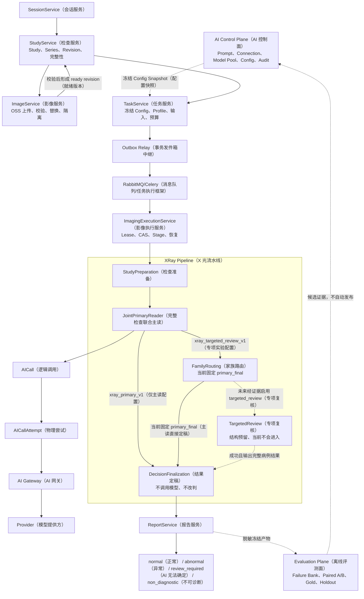
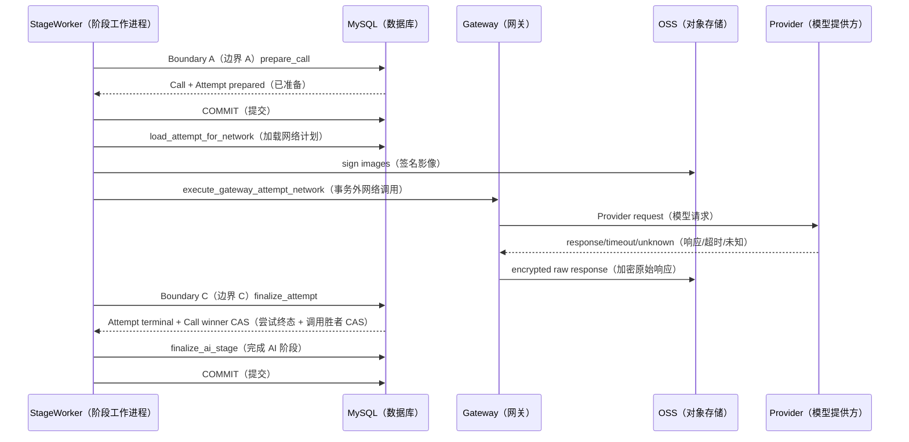
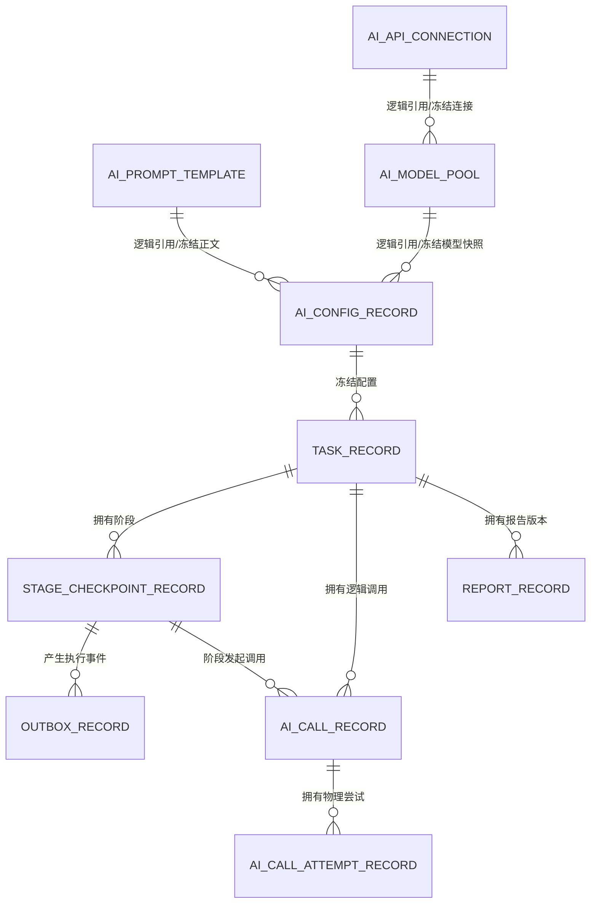
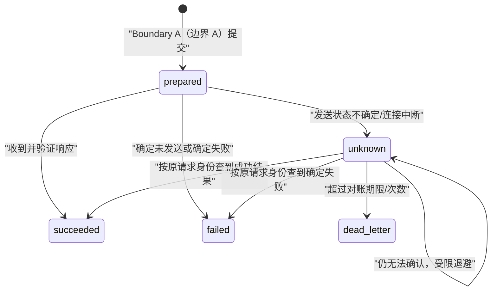

# MS-Image XRay AI Runtime（X 光 AI 运行时）下一阶段详细开发与新会话交接

> **历史入口提示（2026-08-25）**：本文记录 D5（仅主读运行时基础）阶段的代码审计和当时的新会话 Prompt。它不能作为当前启动入口，也不能覆盖之后已确认的核心 AI 网络实测。当前实现事实、下一开发顺序和可复制 Prompt 以 [24-current-runtime-audit-and-next-development-guide.md](24-current-runtime-audit-and-next-development-guide.md) 与仓库根目录 [AGENT_SESSION_PROMPTS.md](../../AGENT_SESSION_PROMPTS.md) 顶部“当前入口”为准。

状态：`CURRENT_CODE_AUDITED（当前代码已审计） / D5_DESIGN_READY（D5 设计就绪） / FULL_RUNTIME_NOT_QUALIFIED（完整运行时未资格化） / MEDICAL_RELEASE_NO_GO（医学发布禁止放行）`

更新日期：2026-08-24

工作区：`/Users/mozhicheng/workspace/code/cy-code/ms-image`

当前分支：`codex/prompt-runtime-ai-gateway`

当前 `HEAD（当前提交）`：`492a249c98175bf818ce092451585db766d73e76`

用途：说明改动后代码的真实状态，给出下一阶段 `Phase D5（D5 阶段）` 的详细开发合同、文件落点、验证门禁、停止条件，并提供一段可直接复制到新 Codex 会话的完整开发 Prompt（开发提示）。

> 本文以 2026-08-24 当前工作树源码为第一事实源。当前工作树包含大量未提交的 Prompt、AI Gateway（AI 网关）、Attempt（物理尝试）、测试、迁移和文档改动；新会话不得只依据 `HEAD（当前提交）` 判断实现状态，也不得清理、覆盖或回退这些改动。

---

## 1. 结论先行

### 1.1 推荐方案

推荐继续采用：

```text
Existing-entry Internal Modular Refactor（保留现有入口的内部模块化收口）
```

不进行全量重写，也不重新设计已经成立的 Prompt/Config/Task/Stage/Call/Attempt 主链。下一阶段应命名为：

```text
Phase D5：Primary-only Runtime Foundation
（D5：仅主读运行时基础闭环）
```

D5 的目标不是增加更多医学 Stage（阶段），而是把当前已经存在的执行骨架补成可在共享非生产环境真实、可恢复、可审计运行的一条 `Primary-only（仅主读）` 链。

### 1.2 当前真实状态

| 维度 | 当前结论 | 证据等级 |
|---|---|---|
| Nacos Prompt（Nacos 提示词）读取 | 已通过真实认证和读取验证 | `CONFIRMED（已确认）` |
| Prompt Import（提示词导入）与不可变 Config（配置）冻结 | 代码与离线测试已存在 | `CONFIRMED（已确认）` |
| Gateway Adapter（网关适配器）到真实 Platform/Provider（平台/模型提供方） | 已分段在线通过 | `CONFIRMED（已确认）` |
| Logical Call（逻辑调用）/Physical Attempt（物理尝试）持久化和三段事务 | 代码已实现 | `CONFIRMED（已确认）` |
| Outbox（事务发件箱）到 Celery Stage Worker（阶段工作进程） | 代码链已存在 | `CONFIRMED（已确认）` |
| 完整 XRay Worker Runtime（X 光工作进程运行时） | 真实依赖仍为 disabled，未整链资格化 | `NOT_QUALIFIED（未资格化）` |
| unknown reconcile（未知尝试对账恢复） | 只有候选查询和 unknown 状态，没有专用恢复 Worker | `MISSING（缺失）` |
| Targeted Review（专项复核） | 结构存在，但路由固定为 `primary_final` | `SCAFFOLD_ONLY（仅结构预留）` |
| 医学准确率 | 没有合格 Gold/Holdout（黄金集/留出集）证据 | `UNKNOWN（未知）` |
| 医学发布 | 不允许放行 | `NO-GO（禁止放行）` |

统一对外口径：

```text
ENGINEERING_SEGMENTS_PASSED（工程分段验证已通过）
FULL_RUNTIME_NOT_QUALIFIED（完整运行时未资格化）
MEDICAL_ACCURACY_UNKNOWN（医学准确率未知）
MEDICAL_RELEASE_NO_GO（医学发布禁止放行）
```

### 1.3 当前不需要重新设计数据库

D5 默认不新增业务表。当前表已经足以表达：

```text
Config（不可变运行配置）
-> Task（任务冻结）
-> StageCheckpoint（阶段检查点）
-> AICall（逻辑调用）
-> AICallAttempt（物理尝试）
-> Report（不可变报告）
```

真实 Secret（密钥）不进入数据库；短期 OSS Signed URL（对象存储签名地址）不进入数据库；原始 Provider Response（模型提供方原始响应）加密存入 OSS，数据库只保存对象引用和 SHA256。

---

## 2. 权威边界与开发纪律

### 2.1 事实源优先级

发生冲突时按下列顺序判断：

1. 当前工作树源码、现有测试和实时命令结果；
2. `AGENTS.md` 与 `AGENT_HANDOFF.md`；
3. `.agent-handoff/` 当前状态文件；
4. 本文；
5. `docs/refactor/19-ai-prompt-control-plane-web-and-runtime-architecture.md`；
6. 其他历史设计文档。

`docs/refactor/14-xray-specialty-design.md` 和 `docs/refactor/17-prompt-runtime-contract-and-minimal-provider-plan.md` 中与当前 v2 单正文 Prompt、Attempt 实现或 Provider transport（模型传输）现状冲突的内容，不得继续作为开发事实。

### 2.2 必须保持的工程分层

```text
API（接口层）
-> Service（业务服务层）
-> DalBase CRUD（统一数据访问层）
-> Model/DB（模型/数据库层）

Worker（工作进程）
-> Service（业务服务层）
-> DalBase CRUD（统一数据访问层）
-> Model/DB（模型/数据库层）
```

禁止：

- 新建第二套 `CRUDBase（数据访问基类）`、Repository（仓储层）或 DatabaseService（数据库服务）；
- API 或 Worker 直接拼 SQLAlchemy `select/update/delete`；
- Service 直接返回 HTTP 响应对象作为核心合同；
- 数据库 Foreign Key（外键）、数据库 Enum（枚举）、联合主键或 `tenant_id（租户字段）`；
- 设计 `/{id}` 路由；资源 ID 只能进入 Query（查询参数）或 Request Body（请求体）；
- 在数据库、普通日志、Audit（审计）或响应中保存 Secret 明文、Authorization Header（授权头）或短期签名 URL；
- 用 Python 规则修改、覆盖或“纠正”模型产生的医学结论；
- 把工程调用成功写成医学准确率提升。

### 2.3 当前脏工作树保护

新会话禁止执行：

```bash
git reset
git clean
git checkout
git restore
git stash
git add -A
```

若需要提交，只能显式列出本次开发实际修改的文件。

---

## 3. 当前端到端真实链路



这个图中只有 `Provider（模型提供方）` 之前的网关分段验证已经在线通过；从真实 Session/Study（会话/检查）输入，经消息队列和 Worker（工作进程），再到真实 OSS 签名、Provider 调用、加密响应存储、报告定稿的完整链仍未资格化。

---

## 4. Prompt/Config Control Chain（提示词/配置控制链）

### 4.1 当前链路

```text
Nacos Prompt（Nacos 提示词）
-> PromptImportService（提示词导入服务）
-> ai_prompt_template（提示词模板表）
-> AIConfigCompiler（AI 配置编译器）
-> ai_config_record（不可变 AI 配置表）
-> validate/activate（验证/激活）
-> Task request_snapshot_json（任务请求快照）
```

关键代码：

- `apps/backend/services/ai_control/service/prompt_import_service.py:49`：`PromptImportService（提示词导入服务）`；
- `apps/backend/services/ai_control/service/config_compiler.py:89`：`AIConfigCompiler（AI 配置编译器）`；
- `apps/backend/services/ai_control/service/config_compiler.py:524`：冻结完整性复验；
- `apps/backend/services/ai_control/service/ai_config_service.py:62`：`AIConfigService（AI 配置服务）`；
- `apps/backend/core/ai/prompting/renderer.py:55`：严格 token-only Renderer（仅标记替换渲染器）。

### 4.2 v2 Prompt（v2 提示词）合同

一个 v2 Config 只冻结一份完整 Prompt 正文。运行时不再按 Family/Focus/Strategy（家族/关注点/策略）选择正文片段。

允许的安全变量只有：

| 变量 | 中文含义 | Primary（主读） | Targeted（专项复核） |
|---|---|:---:|:---:|
| `SAFE_STUDY_CONTEXT_JSON` | 安全检查上下文 | 必需 | 必需 |
| `OUTPUT_SCHEMA_JSON` | 冻结输出结构合同 | 必需 | 必需 |
| `PRIMARY_RESULT_JSON` | 主读完整结果 | 不需要 | 必需 |

Family/Focus/Strategy 可以作为 Targeted 的上下文数据，但不能决定读取哪一段 Prompt 正文。

### 4.3 每一层输入输出

| 层 | 输入 | 核心逻辑 | 输出 | 为什么需要 |
|---|---|---|---|---|
| `PromptImportService（提示词导入服务）` | Nacos `data_id/version/label/namespace` | 认证读取、解析、变量合同校验、幂等 Audit | 不可变 Prompt 版本行 | 把外部可变来源变成受控内部版本 |
| `AIConfigCompiler（AI 配置编译器）` | validated Prompt、Connection、Model Pool、代码 Schema/Pipeline | 展开快照、规范化、计算 SHA/Fingerprint、验证能力与预算 | `ai-config.v2` 完整快照 | 冻结一次运行的全部行为事实 |
| `AIConfigService（AI 配置服务）` | Config 编译输入和状态命令 | preview/create/validate/activate/retire/rollback | 唯一激活槽中的 Config | 新 Task 只受 Config 激活影响 |
| `TaskService（任务服务）` | active Config + ready Study Revision | 冻结 Config ID、各类 SHA、Profile、预算、输入 manifest | `task_record` 和首个 Stage | 保证重试不读取“最新配置” |
| `PromptRenderer（提示词渲染器）` | Config 冻结正文 + 安全变量 | 严格白名单替换、Canonical JSON（规范 JSON）、长度门禁 | rendered messages + SHA | 防止运行时拼装漂移和变量注入 |

### 4.4 必须保持的不变量

- Task 创建时 Config 必须为 `active（已激活）`；
- Task 执行时 Config 可以为 `active（已激活）` 或 `retired（已退役）`，但 ID、SHA 和 fingerprint 必须与 Task 快照一致；
- Runtime 不重新查询当前 active Config；
- Prompt、Connection、Pool 退役不改变已创建 Task；
- Config 激活不能自动改变历史任务或历史报告；
- Nacos 是 Prompt 来源，不是 Runtime 实时事实源。

---

## 5. Task/Stage/Worker Execution Chain（任务/阶段/工作进程执行链）

### 5.1 当前真实调用

```text
POST /tasks
-> TaskService.create_task
-> task_record + stage_checkpoint_record + outbox_record
-> OutboxRelay（发件箱中继）
-> RabbitMQ/Celery（消息队列/任务执行框架）
-> StageExecutionWorker（阶段执行工作进程）
-> ImagingExecutionService.claim（领取 Lease）
-> resolve_stage_handler（解析冻结 Stage Handler）
-> StageExecutionPlan（阶段执行计划）
```

关键代码：

- `apps/backend/services/runtime/api/api_v1/endpoints/tasks.py:19`：Task API（任务接口）；
- `apps/backend/services/runtime/service/task_service.py:76`：创建 Task、首 Stage 和 Outbox；
- `apps/backend/workers/imaging_worker/outbox_relay.py:29`：发送 Celery 消息；
- `apps/backend/workers/imaging_worker/stage_execution.py:25`：`StageExecutionWorker（阶段执行工作进程）`；
- `apps/backend/services/runtime/service/imaging_execution_service.py:37`：Stage claim（阶段领取）；
- `apps/backend/services/runtime/stages/registry.py:24`：冻结 handler key/version（处理器键/版本）解析。

### 5.2 可靠性意义

| 机制 | 中文用途 | 必须解决的问题 |
|---|---|---|
| Outbox（事务发件箱） | 数据库提交后可靠发布事件 | 防止 Task 已创建但消息丢失 |
| Lease（租约） | 限时拥有 Stage 执行权 | 防止多个 Worker 同时执行 |
| CAS（比较并交换） | 按 `state_version` 原子更新 | 防止重复消息覆盖终态 |
| Checkpoint（检查点） | 每个 Stage 保存输入、输出和状态 | 支持恢复、审计和重放 |
| Reconcile（对账恢复） | 扫描未完成或不确定状态 | 处理 Worker 崩溃、Lease 过期和投递不确定 |
| Idempotency（幂等） | 相同业务请求复用同一事实 | 防止重复 Task、Call、Attempt |

### 5.3 Stage（阶段）注册事实

当前注册：

1. `study_preparation（检查准备）`；
2. `joint_primary_reader（完整检查联合主读）`；
3. `family_routing（家族路由）`；
4. `targeted_review（专项复核）`；
5. `decision_finalization（结果定稿）`。

`xray_primary_v1（仅主读配置）` 的静态路径是：

```text
StudyPreparation（检查准备）
-> JointPrimaryReader（完整检查联合主读）
-> DecisionFinalization（结果定稿）
```

`xray_targeted_review_v1（专项实验配置）` 的结构路径是：

```text
StudyPreparation（检查准备）
-> JointPrimaryReader（完整检查联合主读）
-> FamilyRouting（家族路由）
-> DecisionFinalization（结果定稿）

未来满足路由证据时才可能动态插入：
FamilyRouting（家族路由）
-> TargetedReview（专项复核）
-> DecisionFinalization（结果定稿）
```

---

## 6. XRay Medical Pipeline（X 光医学流水线）逐层合同

### 6.1 StudyPreparation（检查准备阶段）

**目的与意义**

在任何模型调用前证明本次任务引用的是已经封存的 Study Revision（检查版本）和不可变影像 manifest（清单）。它属于工程真实性门禁，不做医学判断。

**输入**

- `study_revision_id（检查版本 ID）`；
- `manifest_sha256（影像清单摘要）`；
- Task 冻结的 Study/Series/Image（检查/序列/影像）元数据。

**核心逻辑**

- 验证冻结 ID 和 SHA 存在；
- 后续 D5 应在调用前复验对象元数据、版本、大小、MIME、SHA 和顺序；
- 将“输入或传输失败”与“医学不可诊断”严格分开。

**输出**

```text
status=prepared（已准备）
study_revision_id
manifest_sha256
provider_called=false（未调用模型）
```

**失败语义**

- OSS 对象缺失、版本漂移、摘要不一致：`failed/dead_letter（失败/死信）`，`medical=not_produced（未产生医学结果）`；
- 影像张数或投照覆盖在调用前不足：可完成为 `medical=not_produced`，但不能伪装为模型判断的 `non_diagnostic（不可诊断）`。

### 6.2 JointPrimaryReader（完整检查联合主读阶段）

**目的与意义**

让一个模型调用直接看到完整 Study（完整检查）和结构化检查上下文，输出一个完整病例级医学结果。它是 D5 唯一医学判断所有者。

**输入**

- 冻结 Config 和完整 Prompt；
- `SAFE_STUDY_CONTEXT_JSON（安全检查上下文）`；
- 冻结 Study Image Manifest（检查影像清单）；
- `OUTPUT_SCHEMA_JSON（输出结构合同）`；
- 一次 Physical Attempt（物理尝试）允许的预算、模型和连接快照。

**核心逻辑**

- 构造 `StageAIRequest（阶段 AI 请求）`；
- 由 `AIRequestService（AI 请求服务）` 创建 Logical Call/Attempt；
- 事务外完成签名、密钥解析、Provider 请求和原始响应加密存储；
- 严格 Schema 校验；
- 不通过 Python 改写正常/异常结论。

**输出**

成功时：

```text
candidate_kind=primary（主读候选）
medical_status=produced（已产生医学结果）
complete_medical_result（完整医学结果）
source_call_id（来源逻辑调用 ID）
manifest_sha256（影像清单摘要）
```

失败时：

```text
medical_status=not_produced（未产生医学结果）
error_code（稳定错误码）
```

Provider disabled（模型调用关闭）属于工程完成但未产生医学结果，不得输出 normal/abnormal（正常/异常）。

### 6.3 FamilyRouting（家族路由阶段）

**当前事实**

`apps/backend/services/runtime/stages/xray/family_routing.py:25` 当前固定：

```text
route_signal=primary_final（主读直接定稿）
```

因此当前没有真实专项路由决策，也不会动态创建 TargetedReview（专项复核）。

**为什么保留结构**

它为未来“只有部分病例需要追加一次专项视觉调用”的可测实验保留确定性分支，不让专项直接侵入 Primary（主读）或 Report（报告）。

**D5 规则**

- 不实现医学 Family（家族）规则；
- 不按器官、系统、猫犬或 Prompt 名称自动路由；
- 固定 `primary_final`；
- 不增加模型调用；
- 不宣称专项链可用。

### 6.4 TargetedReview（专项复核阶段）

**目标定义**

在未来证据证明 Primary（主读）对某类高风险疑点存在稳定漏诊，且一次受限专项复核能够改善指标时，最多追加一次视觉调用，并重新输出完整病例结果，而不是只返回局部碎片。

**未来输入**

- `PRIMARY_RESULT_JSON（主读完整结果）`；
- 同一完整 Study Image Manifest（检查影像清单）；
- `selected_family_key（选中家族键）`、`selected_focus_key（选中关注点键）`、reason codes（原因码）和 coverage proof（覆盖证明）作为上下文数据；
- Targeted 专用的完整 Prompt Config（专项完整提示词配置）。

**未来输出**

```text
candidate_kind=targeted（专项候选）
complete_medical_result（完整病例结果）
source_call_id（来源逻辑调用 ID）
```

**硬边界**

- 最多一次视觉调用；
- 不能把 Family/Focus/Strategy 用作 Prompt 片段选择器；
- 不能只输出“局部补丁”再由 Python 拼接医学结论；
- 未完成 Primary 时不得进入；
- 未经 paired A/B（配对 A/B）和 Failure Bank（失败样本库）证据不得启用。

### 6.5 DecisionFinalization（结果定稿阶段）

**目的与意义**

从已经被接受的完整 Primary 或 Targeted 结果中选择唯一结果所有者，生成报告输入。它是确定性的工程投影层，不是第三次医学判断。

**输入**

- 上一阶段的 `complete_medical_result（完整医学结果）`；
- `candidate_kind（候选类型）`；
- 来源 Stage/Call ID（阶段/调用 ID）。

**核心逻辑**

- Primary 路径选择 `selected_owner=primary（主读）`；
- 未来 Targeted 成功路径选择 `selected_owner=targeted（专项）`；
- 不调用模型；
- 不改正常/异常判断；
- 不合并两个模型结论；
- 不创建“多数票”。

**输出**

```text
medical_status（医学结果状态）
selected_owner（选中结果所有者）
source_stage_id（来源阶段 ID）
source_call_id（来源逻辑调用 ID）
provider_called（是否产生模型结果）
complete_medical_result（完整医学结果，可选）
```

### 6.6 ReportService（报告服务）

**目的与意义**

把定稿后的完整结果保存为不可变 Report Revision（报告版本），维护 Task 的 current pointer（当前报告指针），并支持发布、作废和授权查询。

**输入**

- Task ID（任务 ID）；
- DecisionFinalization Stage ID（结果定稿阶段 ID）；
- source Call ID（来源调用 ID）；
- `medical_status（医学结果状态）`；
- 完整报告内容。

**输出与落表**

- 新的 `report_record（报告记录表）` revision；
- `content_sha256（内容摘要）`；
- Task `current_report_id（当前报告 ID）`；
- Task `execution_status=completed（执行完成）`；
- 发布后 `status=published（已发布）`。

报告服务不重新调用模型、不重算医学结论、不把技术失败渲染成 normal（正常）。

---

## 7. Logical Call / Physical Attempt（逻辑调用/物理尝试）

### 7.1 为什么必须分两层

`AICall（逻辑调用）` 表达“这个 Stage 需要一次医学 AI 决策”；`AICallAttempt（物理尝试）` 表达“一次真实网络投递”。两者不能合并，因为网络可能超时、投递结果未知、收到迟到响应或未来存在多个尝试。

### 7.2 当前三段事务



关键代码：

- `apps/backend/services/runtime/service/ai_request_service.py:91`：统一 `prepare_call（准备调用）`；
- `apps/backend/services/runtime/service/ai_request_service.py:652`：创建结构化 Call/Attempt；
- `apps/backend/services/runtime/service/ai_request_service.py:913`：加载网络计划；
- `apps/backend/services/runtime/service/ai_request_service.py:984`：事务外 Gateway 执行；
- `apps/backend/services/runtime/service/ai_request_service.py:1042`：成功终结；
- `apps/backend/services/runtime/service/ai_request_service.py:1126`：失败或 unknown 终结。

### 7.3 状态所有权

| 对象 | 典型状态 | 所有者 |
|---|---|---|
| `AICall（逻辑调用）` | `prepared/running/succeeded/failed/unknown/cancelled` | `AIRequestService（AI 请求服务）` |
| `AICallAttempt（物理尝试）` | `prepared/succeeded/failed/unknown/cancelled` | `AIRequestService（AI 请求服务）` 与未来 Reconcile Service（对账服务） |
| `StageCheckpoint（阶段检查点）` | `queued/running/completed/failed/dead_letter/cancelled` | `ImagingExecutionService（影像执行服务）` |
| `Task（任务）` | `queued/running/completed/failed/dead_letter/cancelled` | `TaskService/ImagingExecutionService/ReportService（任务/执行/报告服务）` |

### 7.4 幂等与迟到结果规则

- `logical_call_key（逻辑调用键）` 唯一，重复 Stage 消息不能创建第二个逻辑调用；
- `(ai_call_id, attempt_no)`、`physical_attempt_key（物理尝试键）` 和 `provider_idempotency_key（模型幂等键）` 唯一；
- Attempt 终态后重复 finalize 返回已存在事实，不重复改写；
- Logical Call 的 `winner_attempt_id（胜出尝试 ID）` 只能由 CAS 首次写入；
- Call/Task 已终态时，迟到 Attempt 不得覆盖最终医学结果；
- `unknown（未知）` 不是 `failed（失败）`，不能直接创建一个新 Provider 请求“重试”。

---

## 8. 当前数据库表与链路关系

### 8.1 AI 控制与执行核心表

| 表 | 中文用途 | 上游 | 下游 | D5 是否新增/改表 |
|---|---|---|---|---|
| `ai_prompt_template` | 提示词模板版本表 | Nacos Import/控制面编辑 | `ai_config_record` | 否 |
| `ai_api_connection` | AI 连接版本表，只存 Secret 引用 | 控制面 | Model Pool/Config | 否 |
| `ai_model_pool` | 模型执行池版本表 | Connection | Config | 否 |
| `ai_config_record` | 不可变 AI 运行配置表 | Prompt/Connection/Pool/代码合同 | Task/Call | 否 |
| `ai_control_audit_record` | AI 控制面只追加审计表 | 控制面命令 | 审计查询 | 否 |
| `task_record` | 诊断任务与请求快照表 | ready Study Revision + active Config | Stage/Report | 否 |
| `stage_checkpoint_record` | 阶段状态、Lease、输入输出表 | Task/Pipeline | Worker/下一 Stage | 否 |
| `outbox_record` | 可靠事件发件箱表 | Task/Stage 事务 | RabbitMQ/Celery | 否 |
| `ai_call_record` | 逻辑医学调用表 | AI Stage | Attempt/Stage | 否 |
| `ai_call_attempt_record` | 真实 Provider 物理尝试表 | Logical Call | Provider/Reconcile | 否 |
| `report_record` | 不可变报告版本表 | DecisionFinalization | 发布/查询/Evaluation | 否 |

### 8.2 关系图



这里全部是 Service 校验的逻辑引用，不使用数据库 Foreign Key（外键）。

### 8.3 OSS（对象存储）存什么

| 对象 | 是否存 OSS | 是否存数据库正文 |
|---|:---:|:---:|
| 原始影像 | 是 | 否，只存 object key/version/SHA/大小/MIME |
| 短期签名 URL | 否，按 Attempt 临时生成 | 否 |
| Provider 原始响应 | 是，必须加密 | 否，只存 `response_object_ref_json` 和 SHA |
| 结构化解析结果 | 可随 Artifact 冻结 | 是，存经过 Schema 校验的 JSON |
| Prompt 正文 | 否 | 是，冻结在 Prompt/Config |
| Secret 明文 | 否 | 否，只存 `secret_ref` |

不恢复 `file_asset（公共文件资产表）`。影像对象事实继续由 Image/Study Revision（影像/检查版本）链表达；AI 原始响应由 Attempt 的加密对象引用表达。

---

## 9. 当前阻断项与责任归属

| 阻断项 | 当前代码事实 | 责任组件 | 不解决的结果 |
|---|---|---|---|
| Secret Resolver（密钥解析器） | 默认 `DisabledSecretResolver` | Gateway Runtime Dependencies（网关运行时依赖） | Provider enabled 路径必然 fail closed |
| Attempt Image Signer（尝试影像签名器） | 默认 `DisabledAttemptImageSigner` | OSS/影像基础设施 | 模型拿不到受控图片 |
| Encrypted Response Store（加密响应存储器） | 默认 `DisabledEncryptedResponseStore` | OSS/安全基础设施 | 原始响应不能合规持久化 |
| Runtime Composition（运行时装配） | Worker 未注入真实三依赖 | Worker 启动装配 | 分段能力不能成为完整链 |
| Provider Qualification（模型提供方资格） | Adapter 分段在线通过，完整 profile 未冻结资格证据 | AI Control/Gateway | 不能安全激活 provider-enabled Config |
| unknown reconcile（未知对账） | DAL 有候选查询，无专用 Service/Worker | Runtime | 不确定投递会永久悬挂 |
| Shared MySQL/Broker（共享数据库/消息队列） | 本地和分段验证为主 | 部署/运维 | CAS、并发、重放未被证明 |
| Primary-only full run（仅主读整链） | 未完成 | Runtime + 基础设施 | 不能称完整业务运行时跑通 |

---

## 10. Phase D5（D5 阶段）详细开发范围

### 10.1 D5.0 Baseline Freeze（基线冻结）

**目标**：确认新会话看到的是当前脏工作树，不误删 Phase A-D 代码。

**动作**：

- 读取 AGENTS/Handoff；
- 输出 branch、HEAD、status；
- 运行现有离线验证确认基线；
- 记录现有迁移文件状态，但不自动执行共享数据库迁移。

**通过门禁**：现有 54 项 pytest、Ruff、compileall、diff-check 保持通过，或如实际结果变化则先解释变化原因。

### 10.2 D5.1 Runtime Dependency Composition（运行时依赖装配）

**目标**：建立唯一、显式、fail-closed 的 Gateway 运行时依赖装配入口。

**建议落点**：

- `apps/backend/core/ai/gateway/runtime_dependencies.py`；
- `apps/backend/core/config.py`；
- `apps/backend/workers/imaging_worker/stage_execution.py`；
- `apps/backend/workers/imaging_worker/celery_app.py`。

**输入**：经过验证的环境设置、OSS profile（对象存储配置）、Secret provider（密钥提供方）、运行环境标识。

**输出**：

```text
GatewayRuntimeDependencies（网关运行时依赖集合）
  - secret_resolver（密钥解析器）
  - image_signer（影像签名器）
  - response_store（响应存储器）
  - gateway_adapter（网关适配器）
```

**约束**：

- 生产/非生产显式选择；
- 缺少配置时启动失败或调用 fail closed；
- 不在 Stage Handler 内自行构造依赖；
- 不使用全局可变 singleton（单例）隐藏环境切换；
- 真实对象只能由 Worker composition root（工作进程装配根）创建。

### 10.3 D5.2 SecretResolver（密钥解析器）

**输入**：Config 冻结的 `secret_ref（密钥引用）`。

**逻辑**：

- 仅支持明确批准的 Secret Manager（密钥管理系统）引用格式；
- 获取短期或当前有效 token；
- 限制超时；
- 错误转换为稳定工程错误码；
- 日志只记录引用类型/指纹，不记录引用全文和 Secret 值。

**输出**：仅存在于内存中的 bearer token（承载令牌）。

**失败**：`secret_ref` 非法、权限不足、超时或空 Secret 均 fail closed，不发 Provider 请求。

### 10.4 D5.3 OSSAttemptImageSigner（OSS 尝试影像签名器）

**输入**：Attempt 冻结的影像对象事实和 TTL（有效期）。

**逻辑**：

- 逐图复验 storage profile/object key/version/SHA/size/MIME；
- 严格保持 manifest 顺序；
- 每个 Attempt 生成短期 HTTPS URL；
- TTL 必须覆盖 Provider timeout 加安全余量，但不能过长；
- 禁止把 URL 写入 DB、Audit、普通日志或错误信息。

**输出**：有序 `GatewayImageInput（网关影像输入）` 列表。

**失败**：任一对象事实不一致则整次 Attempt 不发送，不允许静默漏图。

### 10.5 D5.4 OSSEncryptedResponseStore（OSS 加密响应存储器）

**输入**：Attempt ID、原始响应 bytes（字节）、content type（内容类型）、response SHA。

**逻辑**：

- 使用批准的 OSS bucket/prefix（存储桶/前缀）；
- 服务端加密或等价受控加密；
- object key 不包含宠物名、用户信息或 Prompt 内容；
- put 后复验 metadata/SHA；
- 设置 retention（保留期）和访问权限；
- 失败时不得只保存结构化结果后假装完整审计成功。

**输出**：`encrypted-object-ref.v1（加密对象引用合同）`。

数据库只保存对象引用和 SHA，不保存原始响应正文。

### 10.6 D5.5 Single OpenAI-compatible Dispatch（单一 OpenAI 兼容分发）

D5 首期只支持当前已经存在并经过分段验证的 `OpenAICompatibleGatewayAdapter（OpenAI 兼容网关适配器）`。

不提前建设通用 `Provider Registry（模型提供方注册表）`。只有第二个协议行为明确不同且真实可用的 Adapter 出现后，才抽取 registry。

资格检查至少包括：

- frozen provider type/api format/base URL（冻结提供方类型/接口格式/地址）；
- requested model（请求模型）；
- `allowed_actual_models（允许的实际模型）`；
- image support（影像支持）；
- strict JSON Schema（严格 JSON 结构）；
- streaming mode（流式模式）；
- timeout/max tokens（超时/最大 token）；
- Provider request ID（模型请求 ID）；
- response SHA 和 usage（响应摘要和用量）。

### 10.7 D5.6 AIAttemptReconcileService（AI 尝试对账服务）

**建议落点**：

- `apps/backend/services/runtime/service/ai_attempt_reconcile_service.py`；
- `apps/backend/workers/imaging_worker/ai_attempt_reconcile.py`；
- 复用 `apps/backend/crud/ai_call_attempt.py`；
- 复用 `apps/backend/services/runtime/service/ai_request_service.py` 的终结合同。

**输入**：

- `status=unknown（状态未知）`；
- `next_reconcile_at <= now（已到对账时间）`；
- 原 `provider_idempotency_key（模型幂等键）`；
- 原 Provider request ID（如已知）；
- 冻结 Connection/Model/Attempt identity（连接/模型/尝试身份）。

**输出**：

- `succeeded（成功）`：回收原 Provider 结果，校验、存储、终结 Attempt/Call/Stage；
- `failed（确定失败）`：终结 Attempt/Call/Stage 为工程失败；
- `unknown（仍未知）`：增加受限 backoff（退避），更新 `next_reconcile_at`；
- `dead_letter（死信）`：超过时限或次数后人工运维处理，但仍不得产生医学结果。

---

## 11. unknown reconcile（未知尝试对账）状态机



### 11.1 领取和并发

- DAL 查询必须同时满足 `status=unknown` 和 `next_reconcile_at` 到期；当前 `page_reconcile_candidates()` 还需要在实施时核对是否真正加了时间条件；
- Service 领取时使用 `FOR UPDATE（行锁）` 或 CAS claim（比较并交换领取）避免多个 Worker 同时对账；
- 每次对账记录 attempt state_version（尝试状态版本）和 reconcile lease（对账租约）语义；若现有字段不能无歧义表达，再提出最小字段调整，不能先拍脑袋增表；
- 对账网络 I/O 继续位于数据库事务外。

### 11.2 Provider 不支持查询时

如果 Provider 不支持 request lookup（请求查询）或真正幂等重放，unknown 不能安全自动恢复为第二次请求。此时应：

```text
unknown
-> bounded reconcile（受限对账）
-> dead_letter（死信）
-> medical=not_produced（未产生医学结果）
```

不得为了“提高完成率”盲目重发，从而生成两次独立医学响应。

### 11.3 Stage 恢复

成功对账后必须复用现有 Call winner CAS（调用胜者比较并交换）和 `finalize_ai_stage（完成 AI 阶段）`，不能由 Reconcile Worker 直接写 Report 或 Task 医学状态。

---

## 12. 错误、取消、重试与结果语义

### 12.1 四类结果必须分开

| 类别 | 示例 | Task/Stage 语义 | 是否有医学结果 |
|---|---|---|:---:|
| 输入/传输工程失败 | OSS 缺失、SHA 漂移、Secret 解析失败 | `failed/dead_letter` | 否 |
| Provider/Schema 工程失败 | timeout、429、JSON Schema 失败 | `failed` 或 `unknown` | 否 |
| 调用前能力/覆盖不足 | 配置能力不足、影像覆盖不足 | `completed` + `medical=not_produced` | 否 |
| 模型医学终态 | normal/abnormal/review_required/non_diagnostic | `completed` | 是 |

`non_diagnostic（不可诊断）` 必须来自模型对影像可诊断性的医学判断；不能用它掩盖 OSS、网络、Schema 或配置错误。

### 12.2 取消

- Call 未发送前取消：Attempt 标记 cancelled，不发网络请求；
- Provider 请求已发送但状态未知：不能简单取消并重发，应进入 unknown reconcile；
- Task 已取消后收到迟到成功：保留 Attempt 技术事实，但不能自动恢复 Task 或发布报告；
- 取消不能删除审计、Call、Attempt 或加密原始响应。

### 12.3 重试

D5 当前 Config 编译器仍要求 `max_attempts == 1`。因此 D5 不实现多 Attempt 自动重试。先把 single lane（单通道）和 unknown reconcile 闭环，再设计多尝试预算、fencing（栅栏）、provider idempotency（提供方幂等）和 winner policy（胜出策略）。

---

## 13. 文件级实施地图

以下是预计写集，不是要求为了目录完整而创建所有文件。新会话必须先读取当前实现，再缩小到最小修改范围。

| 文件 | 中文职责 | 预计动作 |
|---|---|---|
| `apps/backend/core/config.py` | 运行配置 | 增加真实依赖所需的显式、可验证设置 |
| `apps/backend/core/ai/gateway/runtime_dependencies.py` | 网关运行时依赖装配 | 可能新增唯一 composition root（装配根） |
| `apps/backend/core/ai/gateway/secret_resolver.py` | 密钥解析边界 | 增加批准的真实实现，保留 disabled 默认 |
| `apps/backend/core/ai/gateway/image_signer.py` | Attempt 影像签名边界 | 增加 OSS 实现，禁止 URL 持久化 |
| `apps/backend/core/ai/gateway/response_store.py` | 原始响应加密存储边界 | 增加 OSS 加密实现和对象引用合同 |
| `apps/backend/workers/imaging_worker/stage_execution.py` | Stage 三段执行 | 注入依赖，不改变医学 Stage 语义 |
| `apps/backend/workers/imaging_worker/celery_app.py` | Worker 启动入口 | 构造和复用运行时依赖 |
| `apps/backend/services/runtime/service/ai_attempt_reconcile_service.py` | AI Attempt 对账编排 | 可能新增 Service |
| `apps/backend/workers/imaging_worker/ai_attempt_reconcile.py` | 对账 Worker | 可能新增定时/队列消费入口 |
| `apps/backend/crud/ai_call_attempt.py` | Attempt 数据访问 | 收紧到期候选、claim/CAS 查询 |
| `apps/backend/services/runtime/service/ai_request_service.py` | Call/Attempt 唯一业务所有者 | 提取可复用 reconcile finalize 合同 |
| 现有 `apps/backend/tests/` | 已有测试体系 | 只补必要测试文件，不新建测试框架/脚本 |

默认不修改：

- XRay Prompt 医学正文；
- FamilyRouting 医学规则；
- TargetedReview 启用状态；
- 报告医学内容结构；
- 生产数据库；
- `file_asset`；
- 多 Provider Registry；
- 双模型 race（竞速）。

---

## 14. 分阶段实施顺序与门禁

### Gate 1：Baseline（基线门禁）

通过条件：当前离线验证保持通过；dirty 文件清单已记录；没有误删用户改动。

### Gate 2：Dependency Unit Contracts（依赖单元合同）

通过条件：

- fake Secret Manager（伪密钥管理器）可解析但不泄密；
- fake OSS signer（伪对象签名器）保持顺序和 manifest；
- fake encrypted store（伪加密存储器）返回稳定 object ref；
- disabled 仍 fail closed；
- 日志检查无 Secret/URL/raw response（密钥/地址/原始响应）。

### Gate 3：Mock Provider Full Worker（模拟模型完整 Worker）

使用现有测试体系，验证：

```text
Task
-> Outbox
-> Worker
-> StudyPreparation
-> Primary Logical Call
-> Physical Attempt
-> Mock Provider
-> encrypted response ref
-> DecisionFinalization
-> Report
```

覆盖重复事件、Lease 过期、CAS 冲突、迟到响应、unknown/reconcile、Config retired 后旧 Task 继续执行。

### Gate 4：Shared Non-production Infrastructure（共享非生产基础设施）

在明确授权后：

- 审阅并应用现有 Alembic `20260824_01` 和 `20260824_02`；
- 验证 MySQL JSON、唯一约束、`FOR UPDATE`、CAS 和并发；
- 验证 RabbitMQ/Celery Outbox 完整消费；
- 验证 OSS 签名和加密对象生命周期；
- 不接生产数据和生产 Secret。

### Gate 5：Qualified Primary-only Provider Run（资格化仅主读真实模型演练）

条件：

- 使用 `xray_primary_v1（仅主读配置）`；
- single lane（单通道）、single case（单病例）；
- 冻结 requested/actual model allowlist（请求/实际模型白名单）；
- 完整保留 Config/Task/Call/Attempt/Report/Artifact 指纹；
- 所有工程错误均不生成医学结果；
- 不启用 Targeted。

通过只表示 `FULL_RUNTIME_ENGINEERING_QUALIFIED（完整运行时工程资格通过）`，不表示医学准确率通过。

### Gate 6：Medical Evaluation Entry（医学评测入口门禁）

只有 Gate 5 通过后，才能进入固定病例 Failure Bank、Prompt/Model paired A/B 和后续 Gold/Holdout。D5 本身不宣称医学指标提升。

---

## 15. 医学准确率后续路线

工程链闭环后，准确率优化顺序必须是：

1. Data Truth Gate（数据真值门）：标签、病例、影像 hash 和 Study 分组可信；
2. Image Assessability（影像可评估性）：投照覆盖、重复图、顺序、完整性；
3. Primary Recall（主读召回）：ABN→normal 漏诊是否由 Prompt/模型能力造成；
4. Normal Closure（正常闭环）：NOR→abnormal 假阳性是否过高；
5. Fusion/Conflict（融合/冲突）：仅当完整结果内部存在混合证据时定位；
6. Model A/B（模型配对实验）：相同病例、影像、Prompt、Schema、预算和评分器；
7. Targeted Candidate（专项候选）：只有固定失败家族证明追加一次调用有边际价值时才启用；
8. Holdout（留出集）：开发集冻结后进行隔离验证。

禁止：

- 用工程失败样本计算医学准确率；
- 修改标签或跳过难例；
- Python 把模型 normal/suspicious/abnormal 改判；
- 全局同时更换 Prompt、模型、图片选择和链路，再声称某一个变量有效；
- 因为链路更复杂就认为准确率会更高。

Targeted（专项复核）的第一个实验必须回答：

```text
Observed failure（观察到的失败）是什么？
Primary 为什么没有看到或没有正确解释证据？
一次额外调用能获得什么不同信息？
预期改善哪个指标？
可能伤害哪个正常样本指标？
最小 paired A/B 如何区分收益与噪声？
什么结果立即停止或回滚？
```

---

## 16. 方案比较

| 方案 | Failure fit（故障匹配） | Causal isolation（因果隔离） | 风险 | 结论 |
|---|---|---|---|---|
| 只做局部 signer/store（签名/存储）补丁 | 只能解决一部分依赖 | 中等 | unknown 和装配仍悬空 | 不足 |
| 保留入口的内部模块化收口 | 直接覆盖全部 D5 阻断 | 强 | 可按门禁逐步验证和回滚 | 推荐 |
| 全链重写 | 与当前故障所有者不匹配 | 弱 | 重复 Task/Stage/Call 真相，迁移风险高 | 拒绝 |

选择内部模块化收口的原因：当前 public entry（公共入口）、Task/Stage 状态、Config 冻结、Call/Attempt、Report 和 Evaluation 边界都仍有价值；问题集中在运行时依赖、unknown 对账和共享基础设施资格化，而不是主链不存在。

---

## 17. 风险、停止条件与回滚

| 风险 | 预防 | 检测 | 停止/回滚 |
|---|---|---|---|
| Secret 泄漏 | 只传引用、内存解析、日志脱敏 | 日志/错误快照检查 | 立即禁用 Provider gate，轮换 Secret |
| 签名 URL 泄漏 | Attempt 临时生成、不持久化 | DB/Audit/日志搜索 | 立即停止，吊销/缩短 URL |
| 重复 Provider 请求 | 唯一键、幂等键、unknown 不盲重发 | Provider request ID 和 Attempt 对账 | 禁用自动重试，进入 dead letter |
| 原始响应未加密 | response store fail closed | OSS metadata/权限检查 | 不 finalize 成功，不生成报告 |
| 迟到结果改写终态 | Call winner CAS + Task 终态检查 | 并发/迟到测试 | 保留技术事实，不恢复医学状态 |
| Config 漂移 | Task 冻结 ID/SHA/fingerprint | 运行时完整性复验 | fail closed |
| Targeted 提前启用 | D5 固定 primary_final | Profile/Stage 审计 | 关闭 experiment Config |
| 工程成功被误报为医学提升 | 分离门禁和指标 | 交付口径检查 | 医学发布保持 NO-GO |

出现下列任一情况必须停止当前切片：

- 需要在事务中执行 Provider/OSS/Broker 网络 I/O；
- 需要把 Secret、签名 URL 或 raw response 写入普通数据库列；
- 需要绕过 `AIRequestService（AI 请求服务）` 直接修改 Call/Attempt；
- 需要重新设计医学主链才能完成运行时依赖；
- 需要自动启用 Targeted 或多模型 race；
- 共享数据库 schema/baseline 不明确；
- 当前用户脏文件与目标修改发生无法安全避开的冲突。

---

## 18. 明确排除项

D5 不实施：

- Prompt 医学正文调优；
- Family 医学分类规则；
- Targeted Review（专项复核）启用；
- 双 lane race（双通道竞速）；
- 通用 Provider Registry（模型提供方注册表）；
- 人工复核工作流；
- 新 `file_asset（文件资产）` 表；
- 独立 AI Control 数据库；
- 生产迁移；
- 生产发布；
- 医学准确率结论。

---

## 19. 新会话推荐阅读顺序

1. `AGENTS.md`；
2. `AGENT_HANDOFF.md`；
3. `.agent-handoff/snapshot.md`；
4. `.agent-handoff/risks.md`；
5. `.agent-handoff/backlog.md`；
6. 本文；
7. `docs/refactor/19-ai-prompt-control-plane-web-and-runtime-architecture.md` 中当前仍有效的表和控制面合同；
8. 本文列出的直接相关源码；
9. 实施前再次执行 Git 和验证基线命令。

不要从旧 Monorepo MR-1F（单体仓库阶段）目标开始，也不要重新创建已经存在的 AI 控制面、Prompt v2、Call/Attempt 或 Gateway Adapter。

---

## 20. 可直接复制到新会话的完整 Prompt（开发提示）

```text
请在以下工作区继续 MS-Image 的 Phase D5：Primary-only Runtime Foundation（D5：仅主读运行时基础闭环）开发：

/Users/mozhicheng/workspace/code/cy-code/ms-image

请用中文沟通。所有组件英文名旁边标注中文，例如 SecretResolver（密钥解析器）。输出本地文件时使用完整绝对路径。

一、启动与事实核对

开始前必须完整读取：

1. /Users/mozhicheng/workspace/code/cy-code/ms-image/AGENTS.md
2. /Users/mozhicheng/workspace/code/cy-code/ms-image/AGENT_HANDOFF.md
3. /Users/mozhicheng/workspace/code/cy-code/ms-image/.agent-handoff/snapshot.md
4. /Users/mozhicheng/workspace/code/cy-code/ms-image/.agent-handoff/risks.md
5. /Users/mozhicheng/workspace/code/cy-code/ms-image/.agent-handoff/backlog.md
6. /Users/mozhicheng/workspace/code/cy-code/ms-image/docs/refactor/20-monorepo-refactor-new-session-prompt.md
7. 本轮准备修改的确切源码。

然后执行只读核对：

pwd
git branch --show-current
git rev-parse HEAD
git status --short --branch
git log -1 --format='%H%n%an <%ae>%n%ad%n%s' --date=iso-strict

当前已知分支为 codex/prompt-runtime-ai-gateway，HEAD 为 492a249c98175bf818ce092451585db766d73e76，但 Prompt/AI/Attempt/Gateway 的主要实现仍在未提交工作树中。必须以实时工作树为准。

禁止执行 git reset、git clean、git checkout、git restore、git stash、git add -A。不要覆盖或回退任何用户已有改动。

二、当前已经完成，不要重复建设

1. Nacos Prompt（Nacos 提示词）认证读取与 PromptImportService（提示词导入服务）。
2. ai_prompt_template、ai_api_connection、ai_model_pool、ai_config_record、ai_control_audit_record 控制面实体链。
3. ai-config.v2 单完整 Prompt 正文冻结；Runtime 不按 Family/Focus/Strategy 选择 Prompt 片段。
4. Task 创建时冻结 Config ID、Prompt/Model/Schema/Pipeline SHA 和 release fingerprint。
5. Outbox -> RabbitMQ/Celery -> StageExecutionWorker -> ImagingExecutionService 的代码链。
6. StudyPreparation、JointPrimaryReader、FamilyRouting、TargetedReview、DecisionFinalization 五个 Stage Handler。
7. AICall（逻辑调用）和 AICallAttempt（物理尝试）及三段事务：prepare+commit -> 网络 I/O -> finalize+commit。
8. OpenAICompatibleGatewayAdapter（OpenAI 兼容网关适配器）和分段在线 Provider 验证。
9. Report 不可变 revision/current pointer 链。

三、当前准确状态

ENGINEERING_SEGMENTS_PASSED（工程分段验证已通过）
FULL_RUNTIME_NOT_QUALIFIED（完整运行时未资格化）
MEDICAL_ACCURACY_UNKNOWN（医学准确率未知）
MEDICAL_RELEASE_NO_GO（医学发布禁止放行）

当前三个真实依赖仍默认 disabled：

- DisabledSecretResolver（禁用的密钥解析器）
- DisabledAttemptImageSigner（禁用的尝试影像签名器）
- DisabledEncryptedResponseStore（禁用的加密响应存储器）

FamilyRouting（家族路由）当前固定 route_signal=primary_final，因此 TargetedReview（专项复核）只是结构预留，当前不会执行。D5 必须保持 Targeted 关闭。

四、本会话目标

在不改变 XRay 医学判断、不启用 Targeted、不增加多模型 race、不新增业务表的前提下，完成 D5 的最小可验证切片：

1. 先做 Runtime Dependency Composition Readiness Audit（运行时依赖装配就绪审计）。
2. 设计并实现唯一 GatewayRuntimeDependencies（网关运行时依赖集合）装配入口。
3. 在保留 disabled 默认的前提下，实现批准的 SecretResolver（密钥解析器）、OSSAttemptImageSigner（OSS 尝试影像签名器）和 OSSEncryptedResponseStore（OSS 加密响应存储器）。
4. 将真实依赖注入 StageExecutionWorker（阶段执行工作进程），保持 Provider/OSS 网络 I/O 在数据库事务外。
5. 实现 AIAttemptReconcileService（AI 尝试对账服务）和对应 Worker，使 unknown Attempt 按原 provider_idempotency_key 或 Provider request ID 对账，禁止盲目新发请求。
6. 复用现有 API -> Service -> DalBase CRUD -> Model/DB 分层，不新增 Repository、第二 CRUDBase 或数据库服务。
7. 使用现有测试体系补齐最小必要验证；不要自建测试框架或独立测试脚本。

五、第一轮先输出只读审计，不立即大改

请先给出：

A. 当前 StageExecutionWorker 如何构造 AIRequestService 和 disabled 依赖；
B. Secret、OSS signer、response store 的接口和真实可接入点；
C. unknown Attempt 从创建到悬挂的精确代码链；
D. AICallAttemptDal.page_reconcile_candidates 是否真正按 next_reconcile_at 到期过滤；
E. 当前 Worker/Celery 中最合适的 reconcile 调度入口；
F. D5 第一最小切片的精确 write set（写入文件集合）、测试范围、风险和回滚；
G. 是否确实无需新增表/字段；若需要字段，必须先用代码证据证明现有状态无法无歧义表达。

审计结论必须区分 CONFIRMED（已确认）、INFERRED（推断）、PROPOSED（建议）、UNKNOWN（未知）。

六、实施硬规则

- 数据访问统一经 apps.backend.core.crud.DalBase 和实体 Dal；
- API/Worker 不直接写 SQL；
- MySQL 表不使用 Foreign Key、数据库 Enum、tenant_id、联合主键；每表独立 opaque VARCHAR(64) id；
- 禁止 /{id} 路由；
- Secret、Authorization、短期签名 URL、raw Provider response 不进入普通 DB/日志/Audit；
- raw response 必须加密存 OSS，DB 只存 object ref 和 SHA；
- unknown != failed，unknown 不得直接重发新请求；
- Python 不得修改模型的医学 normal/abnormal/review_required/non_diagnostic 判断；
- 工程成功不等于医学准确率提升；
- 不启用 Targeted，不修改 FamilyRouting 固定 primary_final，不修改 Prompt 医学正文；
- 不生成新的迁移脚本，除非我后续明确授权；
- 不操作生产 MySQL、OSS、RabbitMQ、Provider 或 Secret。

七、建议实施顺序

1. 基线验证；
2. Runtime dependencies 装配；
3. SecretResolver；
4. OSSAttemptImageSigner；
5. OSSEncryptedResponseStore；
6. 单一 OpenAI-compatible Adapter 分发；
7. unknown reconcile Service/Worker；
8. Mock Provider 完整 Worker 链；
9. 得到明确授权后再做共享非生产 MySQL/RabbitMQ/OSS；
10. 最后做 single-case、single-lane、xray_primary_v1 的真实非生产整链演练。

八、验证和交付

至少运行与本次改动相关的现有 pytest、Ruff、compileall 和 git diff --check。若环境允许，再运行 Mock Provider 完整 Worker 集成验证。不得伪造共享基础设施或医学验证结果。

最终回复必须包含：

1. 完成了什么；
2. 修改的绝对路径；
3. 每个组件输入、输出、失败和安全合同；
4. 验证命令和真实结果；
5. 未验证项；
6. 是否仍保持 FULL_RUNTIME_NOT_QUALIFIED / MEDICAL_ACCURACY_UNKNOWN / MEDICAL_RELEASE_NO_GO；
7. 下一最小切片；
8. 按 AGENT_HANDOFF 协议更新交接文件并运行 maintain_handoff.py。
```

---

## 21. 文档替代与最终统一口径

本文替代旧 20 号文档中以 Monorepo MR-1F（单体仓库阶段）为下一开发目标的内容。

`docs/refactor/19-ai-prompt-control-plane-web-and-runtime-architecture.md` 继续承担 AI 表、控制面和冻结合同的详细设计参考，并已同步为 `IMPLEMENTED_FOUNDATION / D5_RUNTIME_QUALIFICATION_PENDING（基础已实现/D5 运行资格待完成）`：Phase A-C 已完成，Phase D 已完成骨架和分段在线验证，当前缺口是 D5 的真实依赖装配、unknown reconcile 和共享非生产完整链资格化。

最终统一口径：

```text
Prompt/Config Control Plane（提示词/配置控制面）：已实现
Task/Stage/Outbox Runtime Skeleton（任务/阶段/发件箱运行骨架）：已实现
Logical Call/Physical Attempt（逻辑调用/物理尝试）：已实现
OpenAI-compatible Gateway Transport（OpenAI 兼容网关传输）：已实现并分段在线通过
Full Worker Runtime（完整工作进程运行时）：未资格化
unknown reconcile（未知尝试对账）：未闭环
Targeted Review（专项复核）：结构预留、默认关闭、当前不执行
Medical Accuracy（医学准确率）：UNKNOWN（未知）
Medical Release（医学发布）：NO-GO（禁止放行）
```
