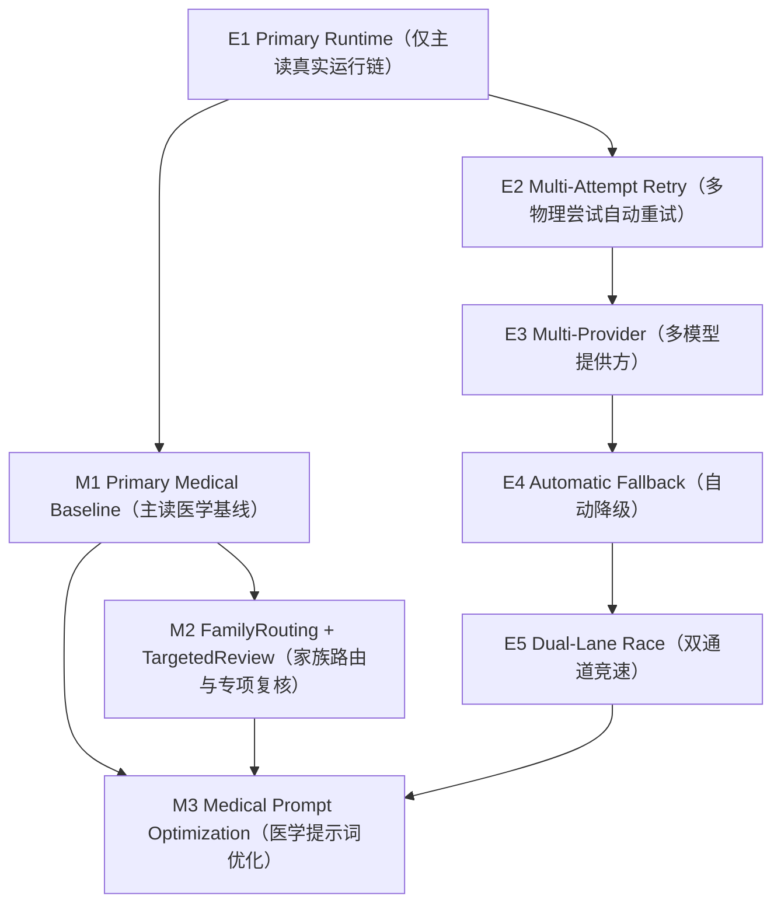
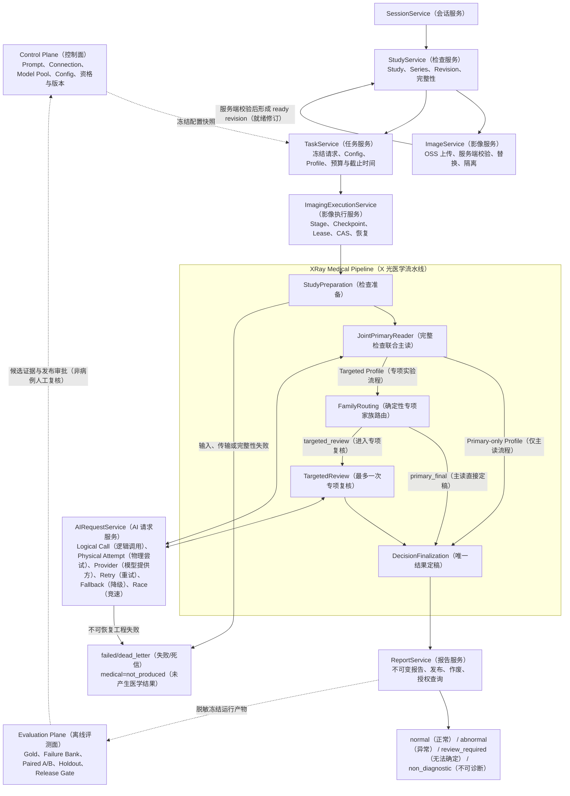
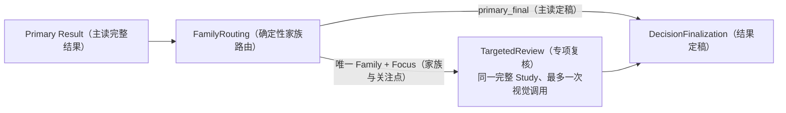
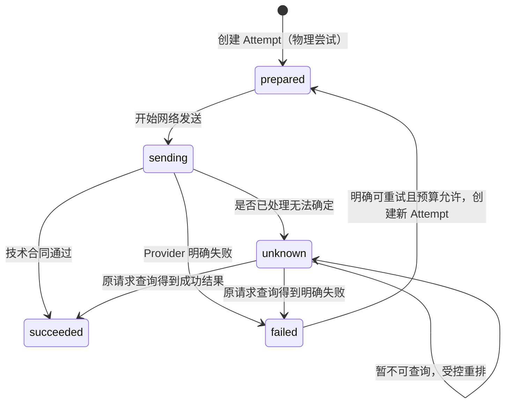
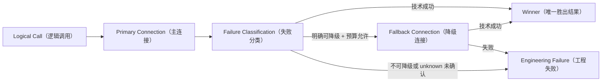
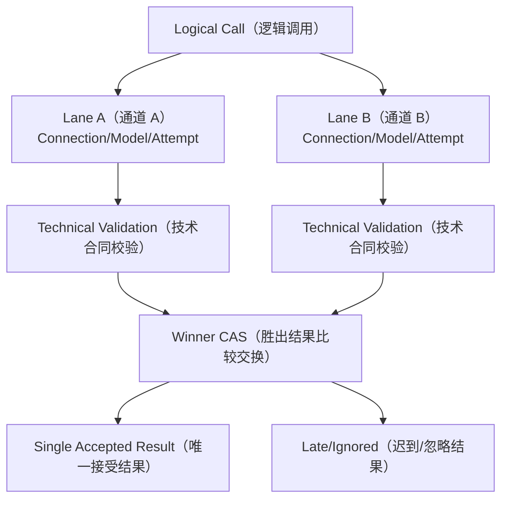

# MS-Image XRay（X 光）完整能力链路、分阶段实施合同与新会话 Prompt（提示词）

> **目标合同提示（2026-08-25）**：本文定义后续完整能力的范围、依赖和验收边界，不宣称任何能力已经在真实环境资格化。当前代码实现、环境开关、已通过的网络证据和下一最小切片以 [24-current-runtime-audit-and-next-development-guide.md](24-current-runtime-audit-and-next-development-guide.md)、当前源码、测试和 `.agent-handoff/`（代理交接目录）为准。

状态：`CURRENT_TARGET_CONTRACT（当前目标合同） / IMPLEMENTATION_PENDING（等待分阶段实施）`

更新日期：2026-08-25

适用工作区：`/Users/mozhicheng/workspace/code/cy-code/ms-image`

## 1. 文档定位

本文只解决一个问题：在当前 `ms-image（影像服务）` 代码基础上，怎样按照真实依赖顺序补齐以下完整能力，而不是把它们永久排除：

- `TargetedReview（专项复核）`；
- 真正的 `FamilyRouting（专项家族路由）`；
- 双 `lane（通道）`；
- 多 `Provider（模型提供方）`；
- 自动降级；
- 多 `Attempt（物理尝试）` 自动重试；
- 医学 `Prompt（提示词）` 逻辑优化。

这些能力均属于完整目标链路，但不能在同一个未验证改动中一次性打开。本文规定它们的依赖、输入、输出、状态、失败语义、验收门禁和停止条件，供新会话逐阶段开发。

本文不是重新发明一套架构，也不授权增加无关表、无关 Service（服务）、无关 Stage（阶段）、无关专项家族或新的医学规则。能够复用当前结构的必须复用；只有当前合同无法表达用户明确要求的能力时，才允许先报告证据，再做最小合同变更。

## 2. 事实来源与权威边界

判断优先级如下：

1. 当前工作树源码与现有测试；
2. `.agent-handoff/（代理交接目录）` 中的当前状态与验证记录；
3. 本文的阶段目标合同；
4. `docs/refactor/14-xray-specialty-design.md（X 光专项设计）` 中仍与当前源码一致的医学架构原则；
5. 其他历史文档只能提供背景，不得覆盖当前代码事实。

必须始终区分三类状态：

| 状态 | 中文含义 | 当前结论 |
|---|---|---|
| `CODE_IMPLEMENTED（代码已实现）` | 源码中已经存在对应结构或逻辑 | D5（仅主读运行时基础）代码骨架已完成 |
| `RUNTIME_QUALIFIED（运行时已资格化）` | 真实 MySQL、OSS、Broker、Worker、Provider 已完整跑通 | 未达到 |
| `MEDICALLY_VALIDATED（医学效果已验证）` | Gold、配对实验和 Holdout 证明准确率与安全护栏达标 | 未达到 |

截至 2026-08-25，当前项目本地 `.env（环境配置文件）` 已确认 `ALIYUN_OSS_ACCESS_KEY_ID（阿里云 OSS 访问密钥标识）`、`ALIYUN_OSS_ACCESS_KEY_SECRET（阿里云 OSS 访问密钥 Secret）`、`ALIYUN_OSS_ENDPOINT（阿里云 OSS 端点）`、`ALIYUN_OSS_BUCKET（阿里云 OSS 存储桶）` 四项均存在且非空。`apps/backend/core/config.py（运行配置）` 已将它们映射到现有 OSS Runtime（对象存储运行时）配置，因此 E1 不再把“准备 OSS 静态配置”列为待办；仍需验证真实 Bucket（存储桶）权限、上传/读取/签名、SSE（服务端加密）、对象键幂等和完整端到端运行链。配置存在不等于 `RUNTIME_QUALIFIED（运行时已资格化）`。

当前 `.env（环境配置文件）` 与最终 `Settings（运行配置）` 的非敏感核验结果如下；核验过程没有输出 Secret（密钥）、密码、完整 Endpoint（端点）或 Bucket（存储桶）原文：

| 配置域 | 当前事实 | 对 E1 的含义 |
|---|---|---|
| MySQL（关系数据库） | Host/User/Port/DB 已显式配置，Password（密码）为空 | 可能是本地免密，也可能无法连接；只通过真实连接验证，不擅自补密码 |
| OSS（对象存储） | 四项 `ALIYUN_OSS_*` 均显式配置且解析成功 | 不重复配置；继续做真实权限和 I/O（输入输出）验证 |
| RabbitMQ/Celery（消息队列/异步任务） | 当前 `.env` 未显式配置 RabbitMQ；`Settings` 可从默认值或受限参考配置得到非空字段，但 `BROKER_ENABLED（消息队列开关）= false` | 当前 Broker Runtime（消息队列运行时）未启用；默认值或参考回填不能冒充真实资格化 |
| AI Gateway（AI 网关） | 当前 `.env` 未显式配置网关门禁；最终解析为 `AI_GATEWAY_ENABLED=false`、`AI_GATEWAY_SECRET_RESOLVER_MODE=disabled`、`AI_GATEWAY_RESPONSE_ENCRYPTION=disabled` | 当前不会发送真实 Provider（模型提供方）流量；E1 开始前必须先给出最小门禁配置方案，不得直接改值或绕过 fail-closed（失败关闭） |
| Provider（模型提供方） | Endpoint/Model/Key/Timeout（端点/模型/密钥/超时）按当前架构属于数据库冻结 Connection/Config（连接/配置），不应重新塞进 `.env` | 继续复用现有控制面和 Secret Reference（密钥引用），不新增环境变量式模型配置链 |
| Redis（缓存） | Host/Port 已显式配置，Password（密码）为空 | 不属于当前 E1 的 RabbitMQ 主链判定依据，不因为存在 Redis 就宣称 Broker 已可用 |

当前统一状态：

```text
D5_CODE_FOUNDATION_COMPLETE（D5 代码基础完成）
ENGINEERING_SEGMENTS_PASSED（工程分段验证通过）
FULL_RUNTIME_NOT_QUALIFIED（完整运行时未资格化）
MEDICAL_ACCURACY_UNKNOWN（医学准确率未知）
MEDICAL_RELEASE_NO_GO（医学发布禁止放行）
```

## 3. 当前代码已经有什么

### 3.1 已存在的 XRay Stage（X 光阶段）

当前注册表已经包含：

```text
StudyPreparation（检查准备）
JointPrimaryReader（完整检查联合主读）
FamilyRouting（专项家族路由）
TargetedReview（专项复核）
DecisionFinalization（结果定稿）
```

当前实际行为：

- `xray_primary_v1（X 光仅主读流程 v1）`：

  ```text
  StudyPreparation（检查准备）
  -> JointPrimaryReader（完整检查联合主读）
  -> DecisionFinalization（结果定稿）
  ```

- `xray_targeted_review_v1（X 光专项复核流程 v1）`：

  ```text
  StudyPreparation（检查准备）
  -> JointPrimaryReader（完整检查联合主读）
  -> FamilyRouting（专项家族路由）
  -> DecisionFinalization（结果定稿）
  ```

- `FamilyRouting（专项家族路由）` 当前固定返回 `primary_final（主读直接定稿）`，所以不会进入 `TargetedReview（专项复核）`。
- `TargetedReview（专项复核）` Handler（处理器）已经能够构造 AI 请求并接收完整结构化结果，但缺少真实路由触发。

### 3.2 已存在的 AI 调用结构

当前已有：

- `ai_model_pool（AI 模型池表）`；
- `ai_call_record（逻辑 AI 调用表）`；
- `ai_call_attempt_record（物理 AI 尝试表）`；
- `AIRequestService（AI 请求服务）`；
- `AIAttemptReconcileService（AI 尝试对账服务）`；
- `AIAttemptReconcileWorker（AI 尝试对账工作进程）`；
- `OpenAICompatibleGatewayAdapter（OpenAI 兼容网关适配器）`。

现有结构已经能够表达：

- 一个 Logical Call（逻辑调用）对应多个 Physical Attempt（物理尝试）；
- `attempt_no（尝试序号）`；
- `physical_attempt_key（物理尝试唯一摘要键）`；
- `provider_idempotency_key（模型提供方幂等键）`；
- `winner_attempt_id（胜出物理尝试标识）`；
- requested/actual model（请求模型/实际模型）；
- Provider request ID（模型提供方请求标识）；
- `unknown（结果未知）` 对账与 Stage（阶段）恢复。

当前限制是代码有意施加的，不是需要重新建系统：

- `AIConfigCompiler（AI 配置编译器）` 强制 `execution_mode=single（单通道模式）`；
- 强制 `lane_count=1（通道数为 1）`；
- 强制每条 lane 的 `max_attempts=1（最多一次物理尝试）`；
- Runtime（运行时）当前固定预留一次 Attempt（物理尝试）；
- 当前只有一个 OpenAI-compatible（OpenAI 兼容）协议 Adapter（适配器）。

## 4. “基础链完成”与“完整能力完成”

基础链和完整能力不是同一件事。

| 完成层级 | 必须包含 | 是否包含用户要求的全部能力 |
|---|---|---|
| `Foundation（代码基础）` | Prompt/Config 冻结、Task、Stage、Call/Attempt、Gateway、恢复骨架 | 否 |
| `Primary Runtime（仅主读运行链）` | 真实基础设施下 Primary-only 从输入到报告闭环 | 否 |
| `Primary Medical Baseline（主读医学基线）` | 固定病例、Gold、正常/异常指标、Failure Bank、Holdout | 否 |
| `Targeted Medical Chain（专项医学链）` | 真正 FamilyRouting + 最多一次 TargetedReview | 部分 |
| `Resilient Provider Chain（高可靠模型链）` | 多 Attempt、多 Provider、自动降级、双 lane | 部分 |
| `Complete Target（完整目标）` | 上述全部通过门禁，并完成医学 Prompt 优化 | 是 |

因此：如果只跑通 Primary-only（仅主读），可以称“基础运行链完成”，不能称“用户要求的完整链路完成”。

## 5. 完整能力的依赖顺序



图中表示开发和验证依赖，不表示每个病例都会依次执行所有节点。

必须遵守：

- 未通过 E1，不进入真实医学实验；
- 未冻结 M1 基线，不启用 Targeted（专项复核）；
- 未完成 E2，不做跨 Provider 自动降级；
- 每个 Provider/Connection（模型提供方/连接）未独立资格化，不进入 E4/E5；
- 未完成 single lane（单通道）和 Winner CAS（胜出结果比较交换）验证，不启用双 lane；
- 医学 Prompt 优化每次只能改变一个主要变量。

## 6. 完整在线链路总图



## 7. E1：Primary Runtime（仅主读真实运行链）

### 7.1 目的与意义

先证明系统能把同一个完整 Study（检查）稳定送到模型，并把唯一结构化结果可靠写成报告。没有这一步，后续准确率问题无法区分是医学问题还是传输、幂等、签名、Schema、恢复问题。

### 7.2 输入、处理与输出

| 项目 | 合同 |
|---|---|
| 输入 | ready Study Revision（就绪检查修订）、冻结 Config、完整图像清单、预算、deadline（截止时间） |
| 处理 | StudyPreparation → JointPrimaryReader → DecisionFinalization → Report |
| 输出 | 唯一不可变报告，或明确的工程失败且 `medical=not_produced（未产生医学结果）` |
| 不允许 | Targeted、双 lane、多 Provider、医学 Prompt 同时改动 |

### 7.3 必须跑通的真实路径

```text
Outbox（事务发件箱）
-> RabbitMQ/Celery（消息队列/异步任务）
-> Stage Worker（阶段工作进程）
-> OSS Signed URL（对象存储签名地址）
-> Provider（模型提供方）
-> Encrypted Response Store（加密响应存储）
-> Attempt Finalize（物理尝试终态化）
-> Stage Finalize（阶段终态化）
-> DecisionFinalization（结果定稿）
-> Report（报告）
```

### 7.4 Gate（门禁）

- OSS（对象存储）四项本地静态配置已经存在，继续验证真实 Bucket 权限、上传、读取、签名、加密和对象键幂等；
- 共享非生产 MySQL、RabbitMQ/Celery、Provider 及包含 OSS 在内的真实全链通过；
- 重复消息不产生第二份医学结果；
- unknown Attempt（未知尝试）不会盲目重发；
- Provider/OSS 网络 I/O 不处于数据库事务中；
- 运行中 Task 使用冻结 Config，不读取“当前最新”配置；
- 完整链 Artifact（证据产物）可追溯。

## 8. M1：Primary Medical Baseline（主读医学基线）

### 8.1 目的与意义

建立所有后续改动的对照组。没有固定基线，就无法证明 Family（专项家族）、Targeted（专项复核）、双 lane 或 Prompt 修改是否真正提高正常和异常准确率。

### 8.2 输入、处理与输出

| 项目 | 合同 |
|---|---|
| 输入 | 固定病例版本、固定图像清单、Gold（可信金标准）、冻结 Prompt/模型/Schema/预算 |
| 处理 | 同病例逐例运行 Primary-only，并使用同一评分器计算结果 |
| 输出 | 整体指标、正常/异常分层指标、Failure Bank（失败样本库）、错误类型和置信区间 |

至少分别观察：

- abnormal → normal（异常误判正常）的漏诊；
- normal → abnormal（正常误判异常）的误报；
- `review_required（无法确定）` 和 `non_diagnostic（不可诊断）` 的占比与原因；
- 病例级、系统级、专项家族级指标；
- Provider/Schema/超时等工程失败率。

### 8.3 Gate（门禁）

- Dataset（数据集）、Gold、评分器、Prompt、模型、Schema、图片选择和预算全部冻结；
- Failure Bank 能回溯到病例、图像、调用和报告；
- Holdout（独立留出集）不参与 Prompt 开发；
- 得到可重复的 Primary 基线后，才能评测 Targeted。

## 9. M2：FamilyRouting + TargetedReview（专项家族路由与专项复核）

### 9.1 为什么需要 Family（专项家族）

Family 不是把病例拆成多次默认模型调用，也不是按器官创建独立数据库表。它只承担两件事：

1. 为报告、失败归因和评测提供稳定医学分层；
2. 在 Primary 结果出现有来源的疑点、冲突或高风险信号时，确定是否允许最多一次 TargetedReview。

FamilyRouting（专项家族路由）必须是确定性规则，不读取像素、不调用模型、不凭空创造 Finding（影像发现），否则它会变成第二个不可评测的医学判断器。

### 9.2 固定五个 Family（专项家族）

不增加新的家族：

| Family（专项家族） | 适用覆盖 | 内部医学子域 | 可评测 Focus（专项关注点） |
|---|---|---|---|
| 胸腔专项 | 胸腔投照 | 呼吸、心血管、纵隔/胸膜、胸壁 | 心血管轮廓、肺野模式、胸膜纵隔、胸壁 |
| 腹腔专项 | 腹腔投照 | 消化、肝胆/脾、泌尿生殖 | 胃肠异物/梗阻、泌尿矿化、腹腔矿化点、软组织肿块 |
| 四肢骨关节专项 | 前肢或后肢 | 长骨、关节、排列、软组织 | 骨折/脱位、长骨关节、排列、髌骨膝关节 |
| 轴骨骼专项 | 脊柱或骨盆/髋 | 颈胸腰椎、骨盆/髋、排列 | 骨折/脱位、排列、骨盆髋部 |
| 头颈专项 | 头部或颈部 | 头颅、鼻腔/口腔、颈部软组织 | 先保留为评测分层；具体 Targeted Focus 通过证据后再开放 |

“呼吸、心血管、消化、泌尿生殖”等是家族内部子域，不再分别升级为顶层 Family。这样既保留医学结构，又避免把旧式 Prompt 分类重新变成大量默认调用。

### 9.3 FamilyRouting（专项家族路由）输入与输出

输入必须全部来自冻结事实：

- Primary 的完整病例结果；
- Primary Finding ID（主读发现标识）；
- Finding 的来源图像引用；
- Study Coverage（检查覆盖）；
- 当前实验 Profile（流程配置）；
- Config 中已冻结的可用 Family/Focus/Strategy（专项家族/关注点/策略）；
- 调用预算和 deadline（截止时间）。

输出只能是二选一：

```text
primary_final（主读直接定稿）
```

或：

```text
targeted_review（进入专项复核）
+ selected_family_key（唯一专项家族）
+ selected_focus_key（唯一关注点）
+ selected_strategy_key（可选唯一策略）
+ source_finding_ids（来源发现标识）
+ route_reason_codes（路由原因码）
+ coverage_proof（覆盖证据）
```

### 9.4 路由门禁

只有同时满足以下条件才允许进入 TargetedReview：

1. 当前 Profile 明确启用 Targeted；
2. Primary 已成功输出完整病例结果；
3. 候选来自 Primary 中真实存在且可追溯的 Finding；
4. 只能选择一个 Family；
5. 只能选择一个 Focus；
6. Strategy 最多一个；
7. Study 覆盖满足该 Focus 所需投照；
8. 预算和 deadline 允许再进行一次视觉调用；
9. 该 Family/Focus 已通过离线资格门禁；
10. 本病例此前没有执行 TargetedReview。

任一条件不满足时返回 `primary_final（主读直接定稿）`，不得为了“多看一次可能更准”而调用模型。

### 9.5 TargetedReview（专项复核）合同



TargetedReview 接收：

- 与 Primary 完全相同的完整 Study 图像；
- Primary 完整结果；
- 唯一 Family、Focus 和可选 Strategy；
- 来源 Finding、路由原因和覆盖证据；
- 同一冻结完整 XRay Prompt（X 光提示词）的 Targeted mode（专项复核模式）、同一输出 Schema（结构合同）、冻结模型和预算。

TargetedReview 输出必须是新的完整病例结果，而不是局部补丁。

结果所有权：

- 未进入 Targeted：Primary 是唯一医学结果所有者；
- Targeted 成功且 Schema 完整：Targeted 是唯一医学结果所有者；
- 禁止把 Primary 和 Targeted 的 Findings 用 Python 拼接；
- 禁止多数票、规则打分或 Renderer（渲染器）改判 normal/abnormal；
- Targeted 技术失败不得伪装为正常，也不得静默使用一个无法说明来源的混合结果。

### 9.6 Gate（门禁）

Targeted Profile 必须与 Primary-only 做同病例 Paired A/B（配对 A/B）：

- 同病例；
- 同图像；
- 同一冻结 Prompt（提示词）的 Primary mode（主读模式）、同一模型、Schema（结构合同）和预算；
- 唯一差异是是否经过 FamilyRouting + TargetedReview；
- 在整体病例分母、正常分母、异常分母和各 Family 分层上评测；
- Holdout 通过后才允许扩大流量。

## 10. E2：Multi-Attempt Retry（多物理尝试自动重试）

### 10.1 目的与意义

处理明确可恢复的工程失败，不是因为“不满意医学结果”而重复问模型。

必须区分：

- Message Redelivery（消息重投）：重新消费同一个任务，不创建新 Attempt；
- Stage Recovery（阶段恢复）：恢复已有 Call/Attempt 状态，不创建新 Attempt；
- Physical Retry（物理重试）：创建新的 Attempt，使用新的物理尝试键和 Provider 幂等键。

### 10.2 状态图



### 10.3 允许创建新 Attempt 的条件

只允许以下情况：

- 已确定原 Attempt 尚未发送；
- Provider 明确返回可重试工程错误；
- unknown 已按原 `provider_idempotency_key（模型提供方幂等键）` 或 request ID 查询，并确认没有可复用结果；
- 冻结 `max_attempts（最大尝试次数）`、总预算和 deadline 仍允许。

禁止：

- 医学结果看起来不理想后自动重问；
- unknown 状态下直接换幂等键盲目新发；
- 重置或覆盖旧 Attempt；
- 超过冻结 max_attempts；
- 已产生 Winner 后继续创建新 Attempt；
- 迟到结果覆盖已接受 Winner。

### 10.4 数据与 Service（服务）落点

- 复用 `ai_call_record（逻辑 AI 调用表）`；
- 复用 `ai_call_attempt_record（物理 AI 尝试表）`；
- 复用 `AIRequestService（AI 请求服务）` 的 `prepare_retry_attempt（准备重试尝试）` 边界；
- 复用 `AIAttemptReconcileService（AI 尝试对账服务）`；
- 不新增 RetryService（重试服务）或第二套 Attempt 表。

当前已有多 Attempt 方法和字段，但预算仍固定为 1。实施重点是把冻结 lane 的 `max_attempts`、Task 总预算、错误分类和对账结果接入现有状态机。

## 11. E3：Multi-Provider（多模型提供方）

### 11.1 目的与意义

为自动降级和双 lane 提供多个经过独立资格化的执行候选，不代表所有病例都同时调用多个模型。

### 11.2 Provider（模型提供方）与 Connection（连接）的区别

- Provider 表示协议或服务类型；
- Connection 表示一个具体 endpoint（端点）、Secret 引用、能力清单和资格状态；
- 同一 Provider 可以存在多个 Connection；
- 不同模型名不自动等于不同 Provider Adapter（适配器）。

首期多 Provider 应优先使用当前 OpenAI-compatible Adapter 承载多个协议兼容 Connection。只有真实第二种协议无法由当前 Adapter 表达时，才报告证据并评审 Adapter Registry（适配器注册表）；不能提前为了“以后可能有”而新增 Registry。

### 11.3 每个候选的独立资格门禁

每个 Connection/模型组合必须独立验证：

- 实际模型与请求模型映射；
- 图像数量、大小、MIME 和格式能力；
- JSON Schema（JSON 结构合同）能力；
- 超时、限流、错误分类；
- idempotency（幂等）和原请求查询能力；
- 原始响应加密存储；
- 真实病例输出合同，但不在此阶段宣称医学更优。

输出是“已资格化执行候选清单”，不是自动降级策略本身。

## 12. E4：Automatic Fallback（自动降级）

### 12.1 目的与边界

自动降级只处理工程不可用，不处理医学判断不满意。



### 12.2 触发条件

允许：

- Connection 明确不可用；
- Provider 明确返回可降级工程错误；
- 能力预检发现当前候选不满足冻结要求，但后备候选满足；
- 原 Attempt 已明确终态，且预算/deadline 允许。

禁止：

- 因模型输出 normal、abnormal 或 review_required 而切换 Provider；
- unknown 未确认时直接切换并盲发；
- 运行时临时读取最新后备模型；
- Worker 自行决定未冻结的后备顺序；
- 用自动降级掩盖错误并把工程失败写成医学结果。

### 12.3 落点

后备顺序、每个 lane 的 Connection、模型、timeout、max_attempts 和总预算必须冻结在 `ai_model_pool.lane_plan_json（模型池通道计划）` 与 Config 快照中。

不新增 `fallback（降级）` 执行模式。完整目标中沿用现有两种 execution mode（执行模式）：

- `single（单并发执行）`：任一时刻只执行一个 lane（通道）；当冻结计划中存在第二个候选时，只能在主候选明确工程失败后按 priority（优先级）顺序进入后备候选；
- `race（并发竞速）`：最多两个 lane（通道）同时执行，由技术合同 Winner CAS（胜出结果比较交换）决定唯一结果。

优先由现有 `AIRequestService（AI 请求服务）` 选择下一个冻结候选并创建新 Attempt；不新增 FallbackService（降级服务）。

## 13. E5：Dual-Lane Race（双通道竞速）

### 13.1 目的与意义

双 lane 只用于已经通过离线证据证明值得付出双倍延迟/成本治理复杂度的场景。它不是默认准确率增强器，也不是在线医学投票器。

推荐合同：

```text
同一 Medical Stage（医学阶段）
-> 一个 Logical Call（逻辑调用）
-> 两条冻结 lane（通道）
-> 每条 lane 各自创建 Physical Attempt（物理尝试）
-> first_technically_valid（首个技术合同完整结果）通过 Winner CAS
-> 唯一结果被 Stage 消费
```



### 13.2 Winner（胜出结果）只能按技术合同决定

`first_technically_valid（首个技术合同完整结果）` 至少要求：

- Provider 请求成功；
- actual model 在冻结允许范围；
- 发送图像 receipt 与冻结清单一致；
- 响应通过冻结 JSON Schema；
- 原始响应已加密保存且 SHA 可复验；
- 预算、deadline、取消状态均有效；
- Call 尚无 Winner。

禁止：

- Python 比较两份医学 Findings 后选“看起来更合理”的一份；
- 多数票改变 normal/abnormal；
- 把两份结果拼接成第三份结果；
- 迟到 Attempt 覆盖 Winner；
- 为追求速度跳过 Schema、actual model 或图像 receipt 检查。

### 13.3 当前最小合同缺口

当前 `ai_call_attempt_record（物理 AI 尝试表）` 没有冻结 `lane_key（通道键）`。仅靠 attempt_no、Connection 或模型名无法在“同连接不同策略”或“每条 lane 多次重试”时可靠区分通道。

因此 E4 开始前必须先做一次最小 Schema Decision Gate（结构决策门）：

- 优先只为现有 Attempt 增加 `lane_key（通道键）`；
- 保留 `attempt_no（全局物理尝试序号）`；
- Winner 继续由现有 `winner_attempt_id（胜出尝试标识）` 表达，并可从 Winner Attempt 推导 lane；
- 不新增 Lane 表；
- 不新增第二套 Call/Attempt 表；
- 不增加 `is_winner（是否胜出）` 等可由 Call 唯一指针推导的冗余字段。

这是用户要求自动降级和双 lane 所必需的最小表达能力，不是扩展新业务。实际修改前，新会话必须再次用源码和迁移事实确认并先报告 write set（写入文件集合）。

## 14. M3：Medical Prompt Optimization（医学提示词优化）

### 14.1 Prompt（提示词）完整链路

```mermaid
flowchart LR
    SRC["Prompt Source（提示词来源）"]
    IMP["PromptImportService（提示词导入服务）"]
    VER["Immutable Prompt Version（不可变提示词版本）"]
    CFG["AIConfigCompiler（AI 配置编译器）<br/>冻结 Prompt/Schema/Model/Provider/Budget"]
    TASK["Task Snapshot（任务快照）"]
    CMD["Prompt Command（提示词命令）"]
    REN["PromptRenderer（提示词渲染器）"]
    CALL["AI Call/Attempt（AI 逻辑调用/物理尝试）"]
    ART["Evaluation Artifact（评测产物）"]
    AB["Paired A/B + Holdout（配对实验与留出集）"]
    REL["Release Decision（发布决定）"]

    SRC --> IMP --> VER --> CFG --> TASK --> CMD --> REN --> CALL --> ART --> AB --> REL
    REL -. "新版本，不覆盖旧版本" .-> VER
```



当前 v2 Prompt（第二版提示词合同）采用一份冻结完整 XRay（X 光）正文，不在 Runtime（运行时）根据 Family/Focus/Strategy（专项家族/关注点/策略）动态选择旧式 Prompt（提示词）片段。Primary（主读）与 Targeted（专项复核）不是两份运行时正文：

- 未提供 `PRIMARY_RESULT_JSON（主读结果）` 时，以 Primary mode（主读模式）执行；
- 提供 `PRIMARY_RESULT_JSON（主读结果）`、唯一专项路由证据和相同完整 Study 时，以 Targeted mode（专项复核模式）执行；
- 两种模式必须使用同一个冻结 Prompt 版本、同一个输出 Schema 和明确的模式判定规则，不能由 Worker 临时切换文件。

运行时安全变量限定为：

- `SAFE_STUDY_CONTEXT_JSON（安全检查上下文）`；
- `OUTPUT_SCHEMA_JSON（输出结构合同）`；
- `PRIMARY_RESULT_JSON（主读结果，仅 Targeted 使用）`。

Family、Focus、Strategy 是 Targeted 的冻结上下文数据，不是运行时选择 Prompt 文件的依据。

### 14.2 优化方法

每次 Prompt 实验必须：

1. 创建新的不可变 Prompt 版本；
2. 创建新的 Config 版本并冻结到新 Task；
3. 一次只改变一个主要变量；
4. 保持病例、图像、模型、Schema、预算和评分器相同；
5. 先在 Failure Bank 观察目标错误；
6. 再跑完整回归集；
7. 最后跑未参与开发的 Holdout；
8. 分别报告正常、异常、review_required 和 non_diagnostic；
9. 同一冻结 Prompt 的 Primary mode（主读模式）与 Targeted mode（专项复核模式）分别评测；
10. 未通过门禁的候选不得激活。

禁止：

- 同时修改 Prompt、模型、图像选择、Family 路由和双 lane，然后宣称 Prompt 有效；
- 把医学规则写进 Python 后处理改判；
- 根据当前病例临时补写 Prompt；
- 覆盖已经被历史 Task 使用的 Prompt 版本；
- 重新引入大量旧式器官/系统 Prompt 家族并默认多次调用。

## 15. Service（服务）复用矩阵

本目标不新增平行 Service 包。能力应落在当前职责内：

| 能力 | 现有落点 | 需要做什么 | 不应新增什么 |
|---|---|---|---|
| FamilyRouting（家族路由） | `FamilyRouting Stage（家族路由阶段）` | 把固定 primary_final 改成确定性门禁 | FamilyRouterService、医学规则微服务 |
| TargetedReview（专项复核） | `TargetedReview Stage（专项复核阶段）` + `AIRequestService` | 接入动态 Stage、完整 Study 和唯一完整结果 | 每个 Family 一个 Service |
| 多 Attempt（多物理尝试） | `AIRequestService` + `AIAttemptReconcileService` | 冻结预算、错误分类、新 Attempt、对账 | RetryService、新 Attempt 表 |
| 多 Provider（多模型提供方） | AI Control（AI 控制面）Connection/Pool/Config + Gateway Adapter | 多个已资格化 Connection | 无真实协议需求的 Registry |
| 自动降级 | `AIRequestService（AI 请求服务）` + 冻结 lane plan（通道计划） | 按冻结顺序选择下一个候选 | FallbackService（降级服务） |
| 双 lane（双通道） | `AIRequestService` + Worker + Call/Attempt CAS | 两 lane 并发、技术 Winner、迟到结果处置 | VoteService、医学仲裁服务 |
| Prompt 优化 | Prompt Import/Config/Renderer/Evaluation（导入/配置/渲染/评测） | 不可变版本与配对实验 | Runtime 动态 Prompt 选择服务 |

所有数据库访问继续遵循：

```text
API（接口） -> Service（服务） -> DalBase CRUD（数据访问） -> Model/DB（模型/数据库）
Worker（工作进程） -> Service（服务） -> DalBase CRUD（数据访问） -> Model/DB（模型/数据库）
```

## 16. 数据表复用与最小变更判断

| 表 | 当前作用 | 完整目标中的作用 | 判断 |
|---|---|---|---|
| `ai_prompt_template（AI 提示词模板表）` | 不可变 Prompt 版本 | 单一完整 XRay Prompt 候选版本及 Primary/Targeted 两种运行模式 | 复用 |
| `ai_api_connection（AI 接口连接表）` | Provider 连接与能力 | 多 Provider/Connection 资格 | 复用 |
| `ai_model_pool（AI 模型池表）` | 单 lane 冻结计划 | single（单并发顺序候选）/race（双通道竞速）的有序 lane 计划 | 复用，不建 Lane 表 |
| `ai_config_record（AI 配置记录表）` | 冻结 Prompt/Schema/模型/流程/预算 | 冻结完整实验与发布行为 | 复用 |
| `ai_call_record（逻辑 AI 调用表）` | 一次医学调用 | 多 Attempt、多 Provider、双 lane 的唯一逻辑调用与 Winner | 复用 |
| `ai_call_attempt_record（物理 AI 尝试表）` | 单次网络发送事实 | 每次 retry（重试）/fallback（降级）/race（竞速）的独立发送事实 | 复用；E4 前评审最小 lane_key（通道键）字段 |
| `stage_checkpoint_record（阶段检查点表）` | Stage 状态与恢复 | FamilyRouting/TargetedReview 动态阶段事实 | 复用 |
| `report_record（报告记录表）` | 不可变医学报告 | 唯一最终医学结果 | 复用 |
| Evaluation 四表（评测四表） | Dataset（数据集）/Run（运行）/Artifact（产物）/Release（发布）证据 | Prompt（提示词）/Targeted（专项复核）/lane（通道）配对实验 | 复用 |

当前不需要新增业务表。多 Attempt、Provider 和 Winner 均可复用现有 Call/Attempt 主结构。为了表达自动降级和双 lane，当前严格单 lane 合同需要按阶段做以下最小演进：

- E2：允许现有 lane 的 `max_attempts（最大尝试次数）` 大于 1，并按冻结预算真实预留 Attempt；
- E4：允许 `single（单并发执行）` 的冻结 lane plan（通道计划）包含最多两个有序候选，并给 Attempt（物理尝试）冻结 `lane_key（通道键）`；
- E5：允许 `race（并发竞速）` 同时启动最多两个 lane（通道），并启用 `first_technically_valid（首个技术合同完整结果）` Winner（胜出结果）策略。

这些是既有 `ai-model-pool-lanes.v1（AI 模型池通道合同 v1）` 的版本化合同演进，不新增 Lane 表、Call 表、Attempt 表或 Service。旧 v1 Config 和未完成 Task 仍按原冻结合同读取。

## 17. 各阶段验收、停止与回滚

| 阶段 | 完成标准 | 立即停止条件 | 回滚单位 |
|---|---|---|---|
| E1 | 真实 Primary-only 完整链可恢复、可审计 | 重复医学结果、Secret 泄漏、unknown 盲发 | Config/运行开关 |
| M1 | 可重复的正常/异常医学基线 | Gold（可信金标准）或分母不可信 | Dataset/Run（数据集/运行） |
| M2 | Targeted 相对 Primary 在整体与分层指标上通过 | 漏诊上升、安全护栏破坏、来源不可追溯 | Targeted Profile |
| E2 | 可重试错误产生受预算约束的新 Attempt | unknown 盲发、超过预算、Winner 被覆盖 | max_attempts=1 |
| E3 | 每个 Connection/模型独立资格化 | actual model 漂移、能力不满足 | 移除候选 Connection |
| E4 | 只在工程失败时按冻结顺序降级 | 医学结果触发降级、未冻结路由 | 恢复单候选 lane plan（通道计划） |
| E5 | 双 lane 技术 Winner 唯一、迟到结果不覆盖 | 医学投票、双 Winner、成本失控 | execution_mode=single |
| M3 | 配对实验与 Holdout 证明 Prompt 改进 | 同时改多变量、正常或异常护栏恶化 | 回滚 Active Config |

任何阶段失败，只回滚该阶段的 Config/Profile/开关，不重写历史 Task、Call、Attempt 或 Report。

## 18. 新会话实施顺序

新会话必须按以下顺序工作，一次只处理一个阶段：

1. 只读恢复当前 Git/worktree、handoff、源码和测试事实；
2. E1：先跑通真实 Primary-only 基础运行链；
3. M1：冻结并产出 Primary 医学基线；
4. M2：实现真正 FamilyRouting，再接入最多一次 TargetedReview；
5. E2：解除 max_attempts=1，但只允许明确工程错误重试；
6. E3：资格化多个 Provider/Connection；
7. E4：实现工程自动降级；
8. E5：实现双 lane 和技术 Winner；
9. M3：逐变量优化 Primary/Targeted Prompt（主读/专项复核提示词）；
10. 每阶段结束更新 handoff，并写清代码已实现、环境已验证、医学已验证三种状态。

不得为了“完整”而同时实现所有阶段。完整目标通过阶段累积得到，不通过一次大改得到。

## 19. 明确不增加的东西

除用户再次授权或当前合同经源码证明确实无法表达外，不增加：

- 新的顶层医学 Family；
- 每个器官或系统一个默认模型调用；
- 每个 Family 一个数据库表或 Service；
- 第二套 Repository/CRUDBase/DatabaseService；
- 独立 RetryService、FallbackService、VoteService；
- 没有第二种真实协议证据的 Provider Registry（模型提供方注册表）；
- Lane 物理表；
- Python 医学改判、拼接、投票或阈值覆盖；
- 人工复核流程；
- Web 管理页面；
- v1 兼容链删除；
- 与当前阶段无关的迁移脚本或测试脚本。

## 20. 可直接复制到新会话的最终 Prompt（提示词）

```text
请在以下工作区继续 MS-Image XRay（X 光）完整能力链路的分阶段重构：

/Users/mozhicheng/workspace/code/cy-code/ms-image

请始终使用中文沟通；文档和说明中的所有英文名称旁边都要标注中文，例如 SessionService（会话服务）、Physical Attempt（物理尝试）。

一、启动时必须先读

1. /Users/mozhicheng/workspace/code/cy-code/ms-image/AGENTS.md
2. /Users/mozhicheng/workspace/code/cy-code/ms-image/AGENT_HANDOFF.md
3. /Users/mozhicheng/workspace/code/cy-code/ms-image/.agent-handoff/snapshot.md
4. /Users/mozhicheng/workspace/code/cy-code/ms-image/.agent-handoff/risks.md
5. /Users/mozhicheng/workspace/code/cy-code/ms-image/.agent-handoff/backlog.md
6. /Users/mozhicheng/workspace/code/cy-code/ms-image/docs/refactor/21-xray-complete-capability-chain-and-session-prompt.md
7. 当前阶段直接相关的源码、现有测试和必要设计文档。

启动后先执行只读 Git/worktree 审计，以实时工作树为准。当前已知分支是 codex/prompt-runtime-ai-gateway，已知 HEAD 是 492a249c98175bf818ce092451585db766d73e76，但工作树包含大量未提交和未跟踪实现，不得只看 HEAD，不得覆盖或清理。

禁止执行 git reset、git clean、git checkout、git restore、git stash、git add -A。不得回退用户或其他会话的改动。

二、当前事实

当前统一状态为：

D5_CODE_FOUNDATION_COMPLETE（D5 代码基础完成）
ENGINEERING_SEGMENTS_PASSED（工程分段验证通过）
FULL_RUNTIME_NOT_QUALIFIED（完整运行时未资格化）
MEDICAL_ACCURACY_UNKNOWN（医学准确率未知）
MEDICAL_RELEASE_NO_GO（医学发布禁止放行）

当前已有 Prompt Import（提示词导入）、不可变 Config（配置）冻结、Session/Study/Image/Task/Stage/Outbox、Logical Call/Physical Attempt（逻辑调用/物理尝试）、OpenAI-compatible Gateway（OpenAI 兼容网关）、OSS 签名、Secret 解析、加密响应存储、unknown Attempt reconcile（未知尝试对账）以及五个 Stage Handler（阶段处理器）。当前项目本地 `.env（环境配置文件）` 中四项 `ALIYUN_OSS_*（阿里云对象存储配置）` 已确认存在且非空，现有 Settings（运行配置）也已完成名称映射；不要重复设计或新增 OSS 配置，但仍要验证真实 OSS 权限和端到端 I/O（输入输出）。

当前 `.env（环境配置文件）` 没有显式 RabbitMQ（消息队列）和 AI Gateway（AI 网关）门禁配置；最终解析状态为 `BROKER_ENABLED=false（消息队列关闭）`、`AI_GATEWAY_ENABLED=false（AI 网关关闭）`、`AI_GATEWAY_SECRET_RESOLVER_MODE=disabled（AI 密钥解析关闭）`、`AI_GATEWAY_RESPONSE_ENCRYPTION=disabled（AI 响应加密关闭）`。不要把代码默认值或旧配置受限回填当成真实运行证据，也不要把 Provider（模型提供方）的 Endpoint/Model/Key（端点/模型/密钥）重新设计成 `.env` 配置；它们继续由数据库冻结 Connection/Config（连接/配置）与 Secret Reference（密钥引用）表达。

FamilyRouting（专项家族路由）当前固定 primary_final（主读直接定稿）；TargetedReview（专项复核）已有结构但不会进入；AIConfigCompiler（AI 配置编译器）当前强制 single lane（单通道）、lane_count=1（通道数为 1）、max_attempts=1（最多一次物理尝试）。

三、完整目标

以下能力全部都要最终完成，不是永久排除项：

1. TargetedReview（专项复核）；
2. 真正的 FamilyRouting（专项家族路由）；
3. 双 lane（通道）；
4. 多 Provider（模型提供方）；
5. 自动降级；
6. 多 Attempt（物理尝试）自动重试；
7. 医学 Prompt（提示词）逻辑优化。

但必须按依赖顺序实施：

E1 Primary Runtime（仅主读真实运行链）
-> M1 Primary Medical Baseline（主读医学基线）
-> M2 FamilyRouting + TargetedReview（家族路由与专项复核）
-> E2 Multi-Attempt Retry（多物理尝试自动重试）
-> E3 Multi-Provider（多模型提供方）
-> E4 Automatic Fallback（自动降级）
-> E5 Dual-Lane Race（双通道竞速）
-> M3 Medical Prompt Optimization（医学提示词优化）

工程增强 E2 可以在 M2 评测期间准备，但一次只允许一个有明确验收边界的实施切片；当前阶段 Gate（门禁）未通过，不得宣称下一阶段完成。

四、架构与实现硬约束

1. API（接口） -> Service（服务） -> DalBase CRUD（数据访问） -> Model/DB（模型/数据库）；Worker（工作进程） -> Service（服务） -> DalBase CRUD（数据访问） -> Model/DB（模型/数据库）。
2. 不创建第二套 Repository（仓储层）、CRUDBase（数据访问基类）、DatabaseService（数据库服务）或平行 service（服务）包。
3. 优先复用 ai_model_pool、ai_config_record、ai_call_record、ai_call_attempt_record、stage_checkpoint_record 和现有 Evaluation（评测）表。
4. 不新增业务表、Service（服务）、Stage（阶段）、Provider Registry（模型提供方注册表）或医学 Family（专项家族），除非当前合同经源码证明确实无法表达用户明确要求的能力；发现后先报告证据、最小方案、write set（写入文件集合）、风险和回滚，未经确认不要扩展。
5. 自动降级阶段前重点核对 ai_call_attempt_record（物理 AI 尝试表）是否需要最小 lane_key（通道键）；不得新增 Lane（通道）表，不得增加可由 winner_attempt_id（胜出尝试标识）推导的冗余 Winner（胜出结果）字段。single（单并发执行）表示同一时刻只执行一个冻结候选，主候选明确工程失败后才能顺序进入第二候选；race（并发竞速）才允许两个 lane（通道）同时执行。
6. FamilyRouting（专项家族路由）必须确定性，不读图、不调用模型、不创造 Finding（影像发现）；只能输出 primary_final（主读直接定稿），或输出唯一 Family（专项家族）+ Focus（关注点）+ 可选 Strategy（策略）的 targeted_review（进入专项复核）。
7. 只使用五个 Family（专项家族）：胸腔、腹腔、四肢骨关节、轴骨骼、头颈；不要增加旧式系统/器官 Prompt（提示词）家族。
8. TargetedReview（专项复核）最多一次视觉调用，读取同一完整 Study（检查），输出新的完整病例结果；不与 Primary（主读）拼接，成功时成为唯一医学结果所有者。
9. 多 Attempt 只处理明确可恢复工程失败。unknown 未按原幂等身份确认前禁止盲发；医学结果不满意不能触发重试。
10. 自动降级只处理工程不可用，候选顺序、预算、timeout（超时时间）和 max_attempts（最大尝试次数）必须冻结在 Config（配置）/lane plan（通道计划）中；不新增 FallbackService（降级服务）。
11. 双 lane（通道）使用一个 Logical Call（逻辑调用）、多 lane Physical Attempt（多通道物理尝试）和 winner_attempt_id CAS（胜出尝试标识比较交换）；Winner（胜出结果）只能按 first_technically_valid（首个技术合同完整结果）确定，禁止医学投票、拼接或 Python（程序规则）改判。
12. 多 Provider（模型提供方）首先复用 OpenAI-compatible Adapter（OpenAI 兼容适配器）承载多个已资格化 Connection（连接）；只有第二种真实协议无法表达时才评审 Registry（注册表）。
13. Prompt（提示词）每次修改创建不可变版本和新 Config（配置）；同病例配对实验一次只改变一个主要变量。当前 v2 保持一份冻结完整 XRay Prompt（X 光提示词）正文：没有 PRIMARY_RESULT_JSON（主读结果）时执行 Primary mode（主读模式），有 PRIMARY_RESULT_JSON（主读结果）与唯一专项路由证据时执行 Targeted mode（专项复核模式）。运行时只使用 SAFE_STUDY_CONTEXT_JSON（安全检查上下文）、OUTPUT_SCHEMA_JSON（输出结构合同）、PRIMARY_RESULT_JSON（主读结果，仅 Targeted 使用）等已批准变量。
14. 不考虑人工复核；不处理 Web 管理页面；不删除 v1 兼容链。
15. 不自行创建独立测试脚本或迁移脚本。优先扩展现有测试；若阶段确实需要数据库字段或迁移，先报告并等待明确授权。
16. MySQL 不使用 foreign key（外键），状态和类型使用 string/json/timestamp，不使用数据库 enum；接口 ID 使用 query 或 request body，不使用 /{id}。

五、每个阶段开始前必须输出

1. 当前代码事实与证据位置；
2. 本阶段目的和为什么现在做；
3. 输入、输出、状态机和失败语义；
4. 幂等、事务边界、重试、unknown、取消、迟到结果和恢复策略；
5. 精确 write set（写入文件集合）；
6. 是否需要表字段、Service 或合同变化；若不需要明确写“不需要”；
7. 验证计划、Gate、停止条件和回滚单位；
8. 与上一阶段唯一变量差异。

六、当前开始方式

先只读审计并确认 E1 是否已经在共享非生产环境完成。不要重建 D5 已有代码，也不要重复增加 OSS（对象存储）配置；四项 `ALIYUN_OSS_*（阿里云对象存储配置）` 已存在且非空。当前 `BROKER_ENABLED（消息队列开关）` 和 `AI_GATEWAY_ENABLED（AI 网关开关）` 均为 false（关闭），AI 密钥解析和响应加密模式也均为 disabled（禁用）。先报告启用 E1 所需的最小配置集合、每项依据、安全边界、验证方法和回滚方式，不要直接修改 `.env`。随后验证真实 Bucket（存储桶）访问、上传、读取、签名和加密。如果没有真实 Outbox（事务发件箱） -> RabbitMQ/Celery（消息队列/异步任务） -> Worker（工作进程） -> OSS（对象存储） -> Provider（模型提供方） -> Attempt finalize（物理尝试终态化） -> DecisionFinalization（结果定稿） -> Report（报告）证据，则当前第一任务仍是 E1 资格化；只给出并执行最小可验证切片，不要提前启用 Targeted（专项复核）、重试、多 Provider（模型提供方）、自动降级、双 lane（通道）或修改医学 Prompt（提示词）。

若 E1 已有可核验证据，再进入 M1；不得跳级。

七、验证与交接

每个阶段结束时必须分别报告：

- CODE_IMPLEMENTED（代码已实现）；
- RUNTIME_QUALIFIED（运行时已资格化）；
- MEDICALLY_VALIDATED（医学效果已验证）。

至少运行与改动相关的现有 pytest、Ruff、compileall 和 git diff --check；不能运行的真实基础设施或医学验证必须明确写未运行，禁止用 Fake/Mock 结果冒充真实链或医学效果。

结束前按 AGENT_HANDOFF_PROTOCOL（代理交接协议）更新 .agent-handoff/snapshot.md、work-log.md、validation.md、decisions.md、backlog.md 和 risks.md，并运行 handoff maintenance（交接维护）。

所有判断必须按逻辑、代码证据和阶段依赖进行，不要为了显得完整而添加用户没有要求的新能力。
```

## 21. 最终结论

用户列出的七项能力都应进入完整目标，但正确方式不是把它们从“暂不启用”直接改成“同时开启”，而是：

```text
先证明 Primary 工程链真实可运行
-> 冻结 Primary 医学基线
-> 证明 FamilyRouting + TargetedReview 的净收益
-> 补齐受控多 Attempt
-> 资格化多 Provider
-> 只对工程失败自动降级
-> 用技术合同完成双 lane 唯一 Winner
-> 最后逐变量优化 Primary/Targeted Prompt（主读/专项复核提示词）
```

这条路线包含用户要求的全部能力，同时保持每次改动可解释、可验证、可停止和可回滚。
