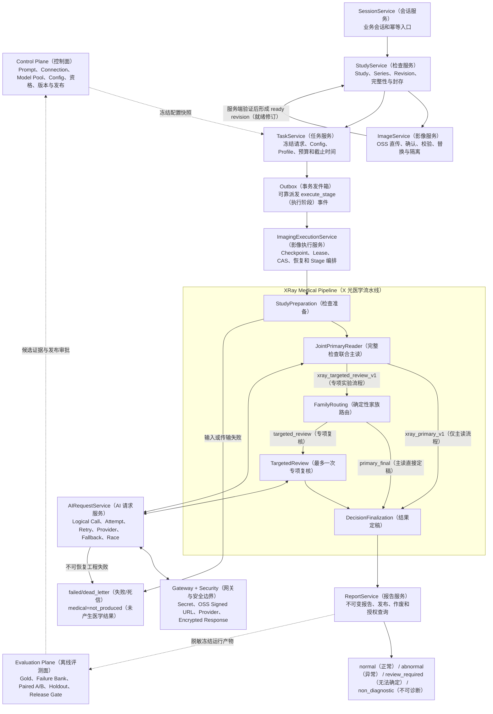
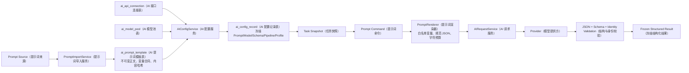
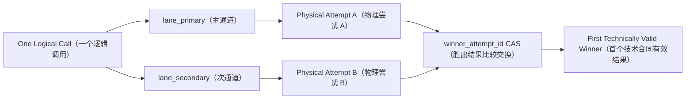
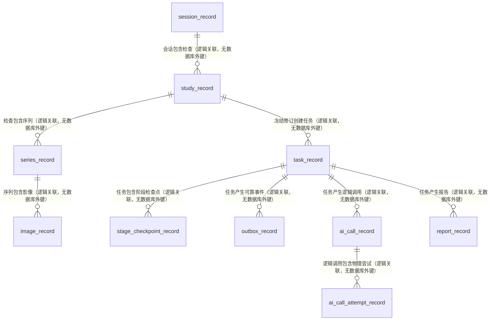
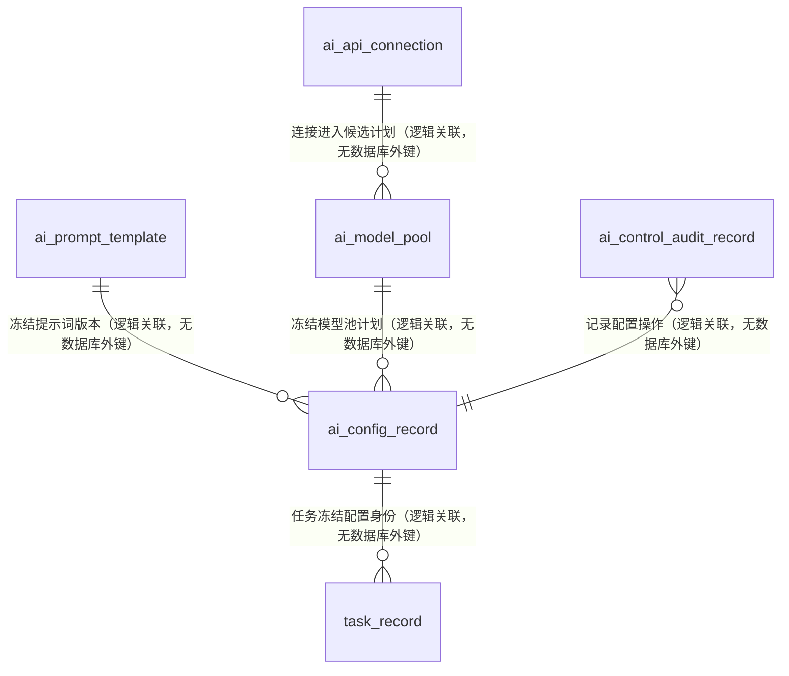
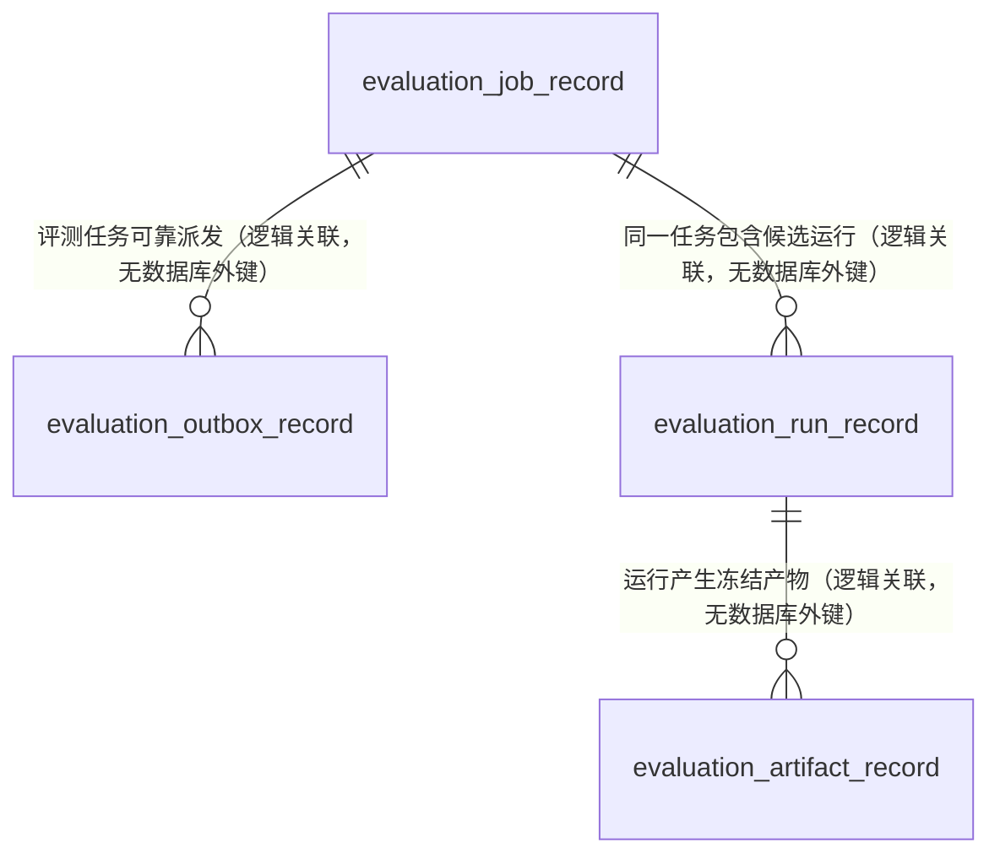

# MS-Image XRay（X 光）完整 AI（人工智能）与 Prompt（提示词）链路开发指南

状态：`ARCHITECTURE_REFERENCE（架构参考） / FULL_CHAIN_TARGET（完整链路目标） / HISTORICAL_IMPLEMENTATION_CONTEXT（历史实施上下文）`

更新日期：2026-08-25

适用工作区：`/Users/mozhicheng/workspace/code/cy-code/ms-image`

> **当前事实提示**：本文保留完整链路的逐层架构、输入输出和验收设计。当前运行事实、下一开发动作和新会话入口以 [24-current-runtime-audit-and-next-development-guide.md](24-current-runtime-audit-and-next-development-guide.md) 为准；本文内“以 23 号为准”等表述仅记录本文形成时的历史实施上下文，不能覆盖 24 号文档、当前源码、测试或经授权取得的运行证据。

## 1. 文档目的

本文用于指导后续会话把当前 `ms-image（影像服务）` 从“已有基础代码骨架”继续建设为“完整、可运行、可评测、可逐阶段优化的 XRay（X 光）AI 链路”。目标不止是创建 Session（会话）、Study（检查）、Task（任务）和 Report（报告），而是最终补齐：

- 真实 `Provider（模型提供方）` 调用；
- 完整 Study（检查）的 `JointPrimaryReader（联合主读）`；
- 确定性 `FamilyRouting（家族路由）`；
- 最多一次 `TargetedReview（专项复核）`；
- `Multi-Attempt Retry（多物理尝试重试）`；
- `Multi-Provider（多模型提供方）`；
- `Automatic Fallback（自动降级）`；
- `Dual-Lane Race（双通道竞速）`；
- `Prompt Lifecycle（提示词生命周期）`；
- `Evaluation Plane（离线评测面）` 与准确率发布门禁。

本文是 21 号完整能力合同的实施展开版。21 号文档说明“要完成什么以及阶段顺序”，本文进一步说明“每层为什么存在、接收什么、做什么、输出什么、记录到哪里、怎样失败、怎样验收”。当前后续实施、合同修正和新会话入口以 [24-current-runtime-audit-and-next-development-guide.md](24-current-runtime-audit-and-next-development-guide.md) 为准；本文与 24 号或当前源码在运行事实、Prompt（提示词）入口、实施顺序或完成定义上冲突时，以 24 号和当前源码为准。

## 2. 权威边界与事实分级

### 2.1 三类权威

- `Current Fact Authority（当前实现事实权威）`：当前工作树源码、模型、测试和时间绑定运行证据，只回答“现在实现了什么”；
- `Approved Target Contract（批准目标行为权威）`：用户批准后的架构合同和 23 号修正文档，回答“应该实现成什么”；
- `Medical Release Authority（医学发布权威）`：冻结 Gold、Paired A/B、Holdout 和发布审批，回答“是否提高准确率、能否发布”。

错误源码不能反向覆盖已批准目标合同；目标文档也不能把尚未实现的设计写成当前事实；工程证据不能替代医学发布证据。

### 2.2 必须分开的三种完成状态

| 状态 | 中文含义 | 当前结论 |
|---|---|---|
| `CODE_IMPLEMENTED（代码已实现）` | 源码已经存在结构或实现 | 基础骨架和部分真实网关实现存在 |
| `RUNTIME_QUALIFIED（运行时已资格化）` | 真实 MySQL（关系数据库）、OSS（对象存储）、Broker/Worker（消息代理/工作进程）、Secret（密钥）和 Provider（模型提供方）全链通过 | 未达到 |
| `MEDICALLY_VALIDATED（医学效果已验证）` | 冻结 Gold（可信金标准）、Paired A/B（配对 A/B）和 Holdout（留出集）证明效果达到门禁 | 未达到 |

当前统一状态为：

```text
D5_CODE_FOUNDATION_COMPLETE（D5 代码基础完成）
ENGINEERING_SEGMENTS_PASSED（工程分段检查通过）
FULL_RUNTIME_NOT_QUALIFIED（完整运行时未资格化）
MEDICAL_ACCURACY_UNKNOWN（医学准确率未知）
MEDICAL_RELEASE_NO_GO（医学发布禁止放行）
```

不得把 Adapter Test（适配器测试）、Fake/Mock（模拟运行）、provider-disabled（模型调用禁用）或单段网络验证描述成完整真实链已经跑通。

## 3. 当前代码事实与关键缺口

### 3.1 已存在的能力

- `SessionService（会话服务）`、`StudyService（检查服务）`、`ImageService（影像服务）`、`TaskService（任务服务）`、`ImagingExecutionService（影像执行服务）`、`AIRequestService（AI 请求服务）` 和 `ReportService（报告服务）` 已存在。
- 五个 Stage Handler（阶段处理器）已经注册：`StudyPreparation（检查准备）`、`JointPrimaryReader（联合主读）`、`FamilyRouting（家族路由）`、`TargetedReview（专项复核）`、`DecisionFinalization（结果定稿）`。
- `TaskService（任务服务）` 已能冻结 Config（配置）、Prompt（提示词）、Model（模型）、Schema（结构合同）和 Pipeline（流水线）指纹。
- `Outbox（事务发件箱） -> Celery Worker（异步工作进程） -> Stage（阶段）` 的代码链已经存在。
- `AIRequestService（AI 请求服务）` 已有 Logical Call（逻辑调用）、Physical Attempt（物理尝试）、外部网络边界、Attempt 终态化和 `winner_attempt_id CAS（胜出尝试标识比较交换）` 基础。
- `OpenAICompatibleGatewayAdapter（OpenAI 兼容网关适配器）`、`SecretResolver（密钥解析器）`、`OSSAttemptImageSigner（OSS 尝试影像签名器）` 和 `EncryptedResponseStore（加密响应存储器）` 接口已经存在。
- Prompt（提示词）安全变量白名单、严格渲染、结构化消息和输出 Schema 校验基础已经存在。

### 3.2 未完成的关键能力

- `FamilyRouting（家族路由）` 当前固定输出 `primary_final（主读直接定稿）`，因此 `TargetedReview（专项复核）` 实际不可达。
- `AIConfigCompiler（AI 配置编译器）` 当前只允许 `single（单并发）`、一个 lane（通道）和 `max_attempts=1（最大尝试次数为一）`。
- 多 Provider（模型提供方）资格化选择、自动降级和双通道计划尚未闭环。
- 真实 `SecretResolver（密钥解析器）`、影像签名和响应加密仍需按部署环境完成安全接线与资格验证。
- 当前主库存在旧 AI 表结构且 Alembic baseline（迁移基线）缺失；未应用迁移不能直接执行。
- `ms_image_eval（影像评测数据库）` 尚未完成可运行验证。
- 真实 Primary-only（仅主读）医学基线、Failure Bank（失败样本库）、Targeted（专项复核）配对实验和 Holdout（留出集）均未完成。

### 3.3 正确的重构类型

采用 `Existing-entry Internal Modular Refactor（保留入口的内部模块化重构）`：

- 保留现有 API（接口）、Service（服务）、DalBase（数据访问基类）、Model（模型）、Outbox（事务发件箱）和 Worker（工作进程）入口；
- 在现有 `apps/backend/services/runtime/` 与 `apps/backend/services/ai_control/` 内补齐能力；
- 不另建第二套 Runtime（运行时）、Repository（仓储层）、CRUDBase（数据访问基类）或公共 DatabaseService（数据库服务）；
- 不按每个专项创建表、Service（服务）或微服务；
- 只有当前数据合同无法表达目标能力时，才提出最小字段或迁移变更，并先等待授权。

## 4. 完整目标架构



## 5. 六个平面为什么存在

| 平面 | 中文职责 | 为什么不能合并 | 核心输出 |
|---|---|---|---|
| `Control Plane（控制面）` | 管理 Prompt、模型连接、模型池、冻结配置和发布资格 | 若运行时直接读取“最新配置”，历史结果不可复现 | 不可变 Config 快照与指纹 |
| `Imaging Ingress（影像接入面）` | 管理会话、检查、序列、影像、OSS 对象和修订封存 | OSS 对象存在不等于检查完整且可诊断 | ready Study Revision（就绪检查修订） |
| `Reliable Execution（可靠执行面）` | 管理任务、Outbox、Checkpoint、Lease、重试、恢复和幂等 | 网络调用和医学判断不能替代可靠状态机 | 唯一可恢复 Task/Stage 执行轨迹 |
| `Medical Pipeline（医学流水线）` | 完成准备、主读、路由、专项复核和定稿 | 医学阶段必须可独立评测和替换顺序 | 唯一完整病例医学结果 |
| `Report Plane（报告面）` | 持久化、发布、作废和查询不可变报告 | 运行中间产物不能直接当发布结果 | 版本化不可变 Report（报告） |
| `Evaluation Plane（评测面）` | 计算医学指标、失败归因和发布门禁 | 在线链成功不等于医学准确率提高 | 可复现评测证据和发布决定 |

## 6. Service（服务）详细合同

### 6.1 SessionService（会话服务）

| 项目 | 合同 |
|---|---|
| 目的 | 建立一次业务交互的稳定根标识，承载调用方、患者/宠物引用和幂等边界 |
| 输入 | caller scope（调用方范围）、client request key（客户端请求键）、业务上下文 |
| 核心处理 | 创建、查询、关闭会话；校验访问权限与幂等冲突 |
| 输出 | `session_id（会话标识）`、状态和审计时间 |
| 主要落表 | `session_record（会话记录表）` |
| 不负责 | OSS 上传、AI 调用、医学判断和报告发布 |

保留 `session_record（会话记录表）` 是必要的：它记录“交互何时开始以及属于谁”，而 Study（检查）记录的是一次影像检查，两者不是同一事实。

### 6.2 StudyService（检查服务）

| 项目 | 合同 |
|---|---|
| 目的 | 管理一次完整影像检查及其 Series（序列）、Revision（修订）和封存状态 |
| 输入 | session_id、modality（影像类型）、species（物种）、检查元数据、Series 规划 |
| 核心处理 | 创建 Study/Series、维护 Revision、检查影像集合是否可封存、生成 ready revision |
| 输出 | `study_id（检查标识）`、`study_revision（检查修订号）`、完整性状态 |
| 主要落表 | `study_record（检查记录表）`、`series_record（序列记录表）` |
| 不负责 | 直接写 OSS、直接调用 Provider 或生成报告 |

Study Revision（检查修订）必须冻结，因为替换或追加影像后，旧 Task（任务）仍应指向旧影像集合，不能悄悄改读最新对象。

### 6.3 ImageService（影像服务）

| 项目 | 合同 |
|---|---|
| 目的 | 管理 OSS 对象身份、上传确认、服务端校验、替换和隔离 |
| 输入 | study_id、series_id、object_key（对象键）、大小、哈希、媒体类型和上传确认信息 |
| 核心处理 | 生成上传合同、确认对象、校验对象存在/大小/哈希、标记 ready 或 quarantined（隔离） |
| 输出 | `image_id（影像标识）`、对象引用、校验状态和可用性 |
| 主要落表 | `image_record（影像记录表）`、必要时 `object_reconcile_cursor_record（对象对账游标记录表）` |
| OSS 存什么 | 原始影像、派生影像和受控响应对象；数据库只存 object_key、哈希、大小、状态和版本 |
| 不负责 | 建设公共 `file_asset（文件资产）` 表；OSS 凭证下发给 Provider；医学裁剪或改判 |

`image_record（影像记录表）` 是影像领域事实，不是公共文件资产表。对象键应稳定、可追溯、不可由外部输入覆盖其他资源。

### 6.4 TaskService（任务服务）

| 项目 | 合同 |
|---|---|
| 目的 | 把“对哪个冻结检查、使用哪个冻结 AI 配置执行哪条流程”固化为可恢复任务 |
| 输入 | ready study revision、pipeline profile（流水线配置档）、active AI config（已激活 AI 配置）、预算、deadline |
| 核心处理 | 冻结请求快照；创建首个 Stage Checkpoint（阶段检查点）；同事务写 Outbox 事件 |
| 输出 | `task_id（任务标识）`、request snapshot（请求快照）、首阶段和事件 |
| 主要落表 | `task_record（任务记录表）`、`stage_checkpoint_record（阶段检查点表）`、`outbox_record（事务发件箱表）` |
| 关键不变量 | Task 运行时只读取冻结 Config 身份和指纹，不重新选择“当前最新”配置 |

### 6.5 ImagingExecutionService（影像执行服务）

| 项目 | 合同 |
|---|---|
| 目的 | 让异步 Stage 在重复消息、进程退出、超时和迟到结果下仍能安全恢复 |
| 输入 | event_id、task_id、stage_checkpoint_id、expected_state_version、trace_id |
| 核心处理 | claim（领取）、lease（租约）、解析冻结 handler、执行 Stage、CAS 终态化、创建下一阶段事件 |
| 输出 | completed（完成）、retryable（可重试）、pending_reconcile（等待对账）或 failed/dead_letter（失败/死信） |
| 主要落表 | `stage_checkpoint_record（阶段检查点表）`、`outbox_record（事务发件箱表）`、`task_record（任务记录表）` |
| 关键边界 | 数据库事务内只做状态变更；OSS、Broker 和 Provider 网络 I/O 必须在事务外 |

### 6.6 AIConfigService（AI 配置服务）

AI 控制面由已有 `PromptTemplateService（提示词模板服务）`、`APIConnectionService（接口连接服务）`、`ModelPoolService（模型池服务）`、`AIConfigService（AI 配置服务）` 和 `AIControlAuditService（AI 控制审计服务）` 协作完成。

| 项目 | 合同 |
|---|---|
| 目的 | 把 Prompt、模型连接、模型池、输出 Schema、Pipeline 和预算编译为不可变发布单元 |
| 输入 | 已验证 Prompt、Connection、Pool、Schema、Profile 和资格信息 |
| 核心处理 | validate（校验）、compile preview（编译预览）、create（创建）、activate（激活）、retire（退役）、rollback（回滚） |
| 输出 | `ai_config_id（AI 配置标识）`、内容哈希、模型快照哈希、Schema 哈希和发布指纹 |
| 主要落表 | `ai_prompt_template（AI 提示词模板表）`、`ai_api_connection（AI 接口连接表）`、`ai_model_pool（AI 模型池表）`、`ai_config_record（AI 配置记录表）`、`ai_control_audit_record（AI 控制审计表）` |
| 关键不变量 | 已被 Task 冻结的 Config 即使后来 retired（退役），运行中任务仍使用原快照；不得读取 active latest（当前最新激活配置）替换 |

### 6.7 AIRequestService（AI 请求服务）

| 项目 | 合同 |
|---|---|
| 目的 | 把一次医学 Stage 的模型需求转换为可审计、可重试、可降级、可竞速且只有一个 Winner 的调用 |
| 输入 | 冻结 task/config、stage、prompt command（提示词命令）、完整影像清单、trace/request identity（追踪/请求身份） |
| 核心处理 | 渲染 Prompt；创建 Logical Call；选择冻结 lane/candidate；创建 Attempt；事务外调用 Provider；Schema 校验；加密保存响应；CAS 决定 Winner |
| 输出 | 唯一 technically valid（技术合同有效）结构化结果，或明确失败/unknown（未知）状态 |
| 主要落表 | `ai_call_record（AI 逻辑调用记录表）`、`ai_call_attempt_record（AI 物理尝试记录表）` |
| 不允许 | 对 normal/abnormal 做 Python 医学投票、拼接、覆盖或改判 |

### 6.8 ReportService（报告服务）

| 项目 | 合同 |
|---|---|
| 目的 | 把 DecisionFinalization（结果定稿）的唯一结果持久化为不可变发布事实 |
| 输入 | final medical result（最终医学结果）、来源 task/stage/call/attempt、Schema 版本和哈希 |
| 核心处理 | 创建不可变版本、发布、作废旧版本、授权查询、结果通知 |
| 输出 | `report_id（报告标识）`、发布状态和四类业务结果之一 |
| 主要落表 | `report_record（报告记录表）`、必要的 `outbox_record（事务发件箱表）` |
| 结果集合 | normal（正常）、abnormal（异常）、review_required（AI 无法确定）、non_diagnostic（影像不可诊断） |

工程失败不能伪装为 `review_required（AI 无法确定）`。工程链失败时必须是 `medical=not_produced（未产生医学结果）`。

### 6.9 Evaluation Plane（离线评测面）

| 项目 | 合同 |
|---|---|
| 目的 | 独立评估 Prompt、模型、Family 路由和 Targeted 的医学净收益 |
| 输入 | 脱敏且冻结的病例、图像哈希、Gold、Prompt/Config/Model/Schema 指纹和完整运行产物 |
| 核心处理 | label audit（标签审计）、Failure Bank、Paired A/B、置信区间、Holdout 和 Release Gate（发布门禁） |
| 输出 | 指标、病例级差异、失败归因、Go/No-Go（放行/不放行）建议 |
| 主要落表 | `evaluation_job_record（评测任务表）`、`evaluation_outbox_record（评测发件箱表）`、`evaluation_run_record（评测运行表）`、`evaluation_artifact_record（评测产物表）` |
| 边界 | 评测面不回写在线病例医学结果；发布决定回到控制面后必须人工审批配置版本 |

## 7. XRay Stage（X 光阶段）详细合同

### 7.1 StudyPreparation（检查准备）

**为什么存在**：在消耗模型费用前，先证明输入对象、检查修订和 Provider 能力合同完整。没有这一层，上传失败、影像缺失、URL 过期和模型不支持图像会被误判为医学错误。

**接收**（以下为目标路由合同，当前固定直达实现尚未具备全部字段）：

- frozen Study Revision（冻结检查修订）；
- Series/Image 清单；
- OSS object metadata（对象元数据）；
- modality/species/body coverage（影像类型/物种/身体覆盖范围）；
- frozen Config/Profile（冻结配置/流程档）；
- deadline/budget（截止时间/预算）。

**处理**：

1. 校验 Task 指向的 Study Revision 未漂移；
2. 校验每张影像存在、已确认、未隔离、哈希和大小匹配；
3. 构建完整 Study manifest（检查清单），不做医学裁剪改判；
4. 校验 Provider 的图像数量、大小、格式、上下文和预算能力；
5. 生成后续阶段只读的 canonical input（规范输入）。

**输出**：

- 成功：`prepared_study（已准备检查）`、影像清单、上下文哈希和能力预检结果；
- 调用前医学覆盖不足：Task 可 completed（完成），但 `medical=not_produced（未产生医学结果）`；
- OSS、传输或输入合同失败：execution_failed/dead_letter（执行失败/死信）。

### 7.2 JointPrimaryReader（完整检查联合主读）

**为什么存在**：模型必须同时看到同一 Study 的全部合格影像，先形成一份完整病例级结论，避免器官级子调用各自判断后再用程序拼接。

**接收**：

- prepared Study（已准备检查）；
- `SAFE_STUDY_CONTEXT_JSON（安全检查上下文）`；
- `OUTPUT_SCHEMA_JSON（输出结构合同）`；
- 冻结完整 XRay Prompt 正文；
- frozen lane plan（冻结通道计划）、预算和 deadline。

**处理**：

1. 由 PromptRenderer（提示词渲染器）只渲染白名单变量；
2. AIRequestService 创建一个 Logical Call；
3. 按当前阶段能力创建一个或多个 Physical Attempt；
4. Provider 返回后做传输、JSON、Schema、完整性和身份校验；
5. Winner 结果作为完整 Primary result（主读结果）。

**输出**：

- `complete_medical_result（完整医学结果）`；
- `medical_status（医学状态）`；
- findings/evidence/uncertainty（发现/证据/不确定性）；
- call/attempt/prompt/config/model/schema 指纹；
- 失败时只输出工程失败，不生成伪医学结果。

### 7.3 FamilyRouting（确定性家族路由）

**为什么存在**：只在 Primary 的证据表明确实需要额外聚焦时，决定是否调用一次 Targeted。它用于降低漏诊或冲突风险，不用于恢复旧式“每个系统都调用一次模型”。

**固定五个顶层 Family（专项家族）**：

| family_key（家族键） | 中文含义 | 内部报告子域示例 |
|---|---|---|
| `thoracic（胸腔专项）` | 胸腔、肺、气道、心影和胸膜 | respiratory（呼吸）、cardiovascular（心血管） |
| `abdominal（腹腔专项）` | 腹腔脏器、消化和泌尿生殖 | digestive（消化）、urogenital（泌尿生殖） |
| `appendicular_orthopedic（四肢骨关节专项）` | 四肢长骨、关节、髌骨和骨盆附肢关系 | long_bone（长骨）、joint（关节） |
| `axial_orthopedic（轴骨骼专项）` | 脊柱、肋骨、胸骨和轴骨骼 | spine（脊柱）、rib（肋骨） |
| `head_neck（头颈专项）` | 头颅、颌面、鼻腔和颈部 | skull（头颅）、neck（颈部） |

Family（家族）只用于评测分层、失败归因和一次专项路由，不表示每个 Family 一张表、一个 Service、一份 Prompt 或一次默认模型调用。

**接收**：

- 完整 `Primary result（主读结果）`；
- frozen profile（冻结流程档）；
- Study coverage（检查覆盖范围）；
- Primary（主读）输出中经过 Schema（结构合同）约束的 uncertainty/conflict/coverage/risk signals（不确定性/冲突/覆盖/风险信号）。

**确定性处理**：

1. `xray_primary_v1（仅主读流程）` 永远返回 `primary_final（主读直接定稿）`；
2. `xray_targeted_review_v1（专项实验流程）` 才允许评估路由；
3. 无充分路由证据时返回 `primary_final`；
4. 有且只有一个最高优先级 Family/Focus（家族/关注点）满足已版本化门禁时返回 `targeted_review`；
5. 多 Family 冲突、输入不完整、跨区域、无法唯一归族或路由证据不确定时统一回到 `primary_final（主读直接定稿）`；Router（路由器）不得输出或覆盖 `review_required（AI 无法确定）` 等医学状态；
6. 本阶段不调用模型、不修改 Primary 医学结论。

**输出**：

- `route_signal（路由信号）`：primary_final 或 targeted_review；
- `family_key（家族键）`：最多一个；
- `focus_keys（关注点键）`：受控列表；
- `route_reason_codes（路由原因码）`；
- `route_contract_version（路由合同版本）`；
- Primary result 和来源哈希原样向后传递。

路由阈值和原因码必须版本化、可审计，并由冻结 Schema/Profile 表达。禁止用病例标签、评测 Gold 或 Python 医学推断参与在线路由。

### 7.4 TargetedReview（专项复核）

**为什么存在**：当 Primary 已指出一个明确高风险、冲突或证据不足区域时，用一次受控聚焦复核检查其是否遗漏或误判；不是并行生成多个器官报告。

**接收**：

- 与 Primary 完全相同的完整 Study 影像；
- `PRIMARY_RESULT_JSON（主读结果）`；
- 唯一 family_key/focus_keys 和路由原因；
- 同一冻结 Prompt 正文、Targeted mode（专项复核模式）变量合同；
- 独立冻结预算、deadline 和 lane plan。

**处理**：

1. 明确告诉模型 Primary 的完整结果和需重点复核的唯一范围；
2. 仍要求重新检查完整 Study，避免只看局部后丢失病例整体一致性；
3. 最多执行一次视觉 Logical Call；
4. 输出新的完整病例结果，不输出 patch（补丁）或局部片段；
5. 通过与 Primary 相同的技术 Schema 校验。

**输出**：新的 `complete_medical_result（完整医学结果）`，成功时作为后续 Final 候选；工程失败时不得静默退回 Primary，是否允许回退必须在冻结 Profile 中明示，并单独评测其影响。

### 7.5 DecisionFinalization（结果定稿）

**为什么存在**：把“哪个上游结果已经根据冻结流程成为最终候选”转换为唯一可发布结果，避免 ReportService 再承担医学选择。

**接收**：Primary-only 路径的 Primary 完整结果，或 Targeted 路径成功产生的完整 Targeted 结果。

**处理**：

- 验证来源 Stage、call、attempt、Schema 和哈希；
- 确认结果完整且与冻结 Task/Profile 对应；
- 映射为统一四类状态；
- 不调用模型、不重新路由、不拼接、不投票、不改判。

**输出**：唯一 `final medical result（最终医学结果）` 和完整 provenance（来源证明）。

## 8. Prompt Lifecycle（提示词生命周期）完整链路



### 8.1 共享医学核心与两个冻结入口

当前目标合同为：

```text
Shared Medical Core（共享医学核心合同）
├── Primary Frozen Entry（主读冻结入口）
└── Targeted Frozen Entry（专项冻结入口）
```

初期两个入口可以共享同一冻结正文，以减少漂移；但这不是永久原则。是否长期拆成两个不可变模板必须由 Paired A/B（配对实验）决定。Family/Focus/Strategy（家族/关注点/策略）是安全上下文和路由证据，不得恢复旧式大量器官/系统 Prompt 家族。

### 8.2 Prompt 必须包含的医学任务合同

完整 Prompt 的正文至少应明确：

1. `Role（角色）`：执行兽医影像学分析，不替代临床诊疗；
2. `Study-level task（检查级任务）`：同时审阅全部影像，不按单图独立下结论；
3. `Image inventory（影像清单）`：投照、方向、数量、顺序和质量；
4. `Systematic reading order（系统化阅片顺序）`：保证正常结构和异常结构都被主动检查；
5. `Abnormal evidence（异常证据）`：位置、形态、范围、严重度和支持证据；
6. `Normal counterevidence（正常反证）`：对高风险但未见异常的区域给出可见性与正常证据，降低无依据阳性；
7. `Uncertainty（不确定性）`：区分“未见异常”“无法充分评估”和“影像不可诊断”；
8. `Cross-view consistency（多视图一致性）`：不同投照冲突时不得强行合并；
9. `Output Schema（输出结构合同）`：只输出可解析 JSON，不添加结构外文本；
10. `Targeted mode rules（专项复核模式规则）`：检查 Primary 证据与反证，但最终仍输出完整病例结果。

### 8.3 安全变量合同

运行时只允许经过合同批准的变量，例如：

- `SAFE_STUDY_CONTEXT_JSON（安全检查上下文）`；
- `OUTPUT_SCHEMA_JSON（输出结构合同）`；
- `PRIMARY_RESULT_JSON（主读结果，仅专项复核使用）`。

所有变量必须规范化为 canonical JSON（规范 JSON）并参与哈希。禁止把原始用户指令、Secret、未经净化的对象地址或可改变系统角色的文本直接插入 Prompt。

### 8.4 Prompt 完善方法

Prompt 完善不是一次性“写得更长”，而是以下闭环：

```text
冻结 Gold（可信金标准）和病例版本
-> 建立 Primary-only（仅主读）基线
-> 按 Failure Bank（失败样本库）定位主要失败层
-> 提出一个可证伪的 Prompt 假设
-> 创建不可变 Prompt + Config 新版本
-> 固定病例 Paired A/B（配对 A/B）
-> 完整回归
-> Holdout（留出集）
-> 达到门禁才发布，否则回滚 Config
```

每次实验只改变一个主要变量，例如只调整“正常反证要求”、只调整“某类高风险发现的检查指令”或只切换模型，不同时改变 Prompt、模型、Schema、图片集合和路由。

## 9. AI Runtime（AI 运行时）完整调用合同

### 9.1 Logical Call（逻辑调用）与 Physical Attempt（物理尝试）

- 一个医学 Stage 只创建一个 Logical Call，表示“这次医学问题”；
- Retry、Fallback 和 Race 只增加 Physical Attempt，不增加新的医学问题；
- 所有 Attempt 必须引用同一冻结 Prompt、输入影像、输出 Schema 和任务身份；
- `winner_attempt_id CAS（胜出尝试标识比较交换）` 保证最多一个 Winner；
- Winner 产生后不得再创建新 Attempt，迟到结果只能记录为 loser/late（未胜出/迟到），不能改写报告。

### 9.2 Multi-Attempt Retry（多物理尝试重试）

重试解决的是同一候选的临时工程失败，不解决医学结论不满意。

允许重试的例子：连接超时、明确可重试的限流、短暂 5xx、可确认未被 Provider 接收的传输失败。

禁止盲重试的例子：

- Provider 可能已经执行但本地不知道结果的 unknown Attempt；
- Schema 合同稳定失败；
- 不支持图像或模型能力不足；
- 预算或 deadline 已耗尽；
- 已经产生 Winner。

unknown Attempt 必须使用原 `provider_idempotency_key（模型提供方幂等键）` 对账，不得创建新身份重复发送。

### 9.3 Multi-Provider（多模型提供方）

Provider 不是模型名，Connection 也不是医学资格。每个候选需要独立冻结：

- provider_type（模型提供方类型）；
- endpoint（端点）；
- secret_ref（密钥引用）；
- actual_model（实际模型名）；
- 图像输入能力；
- structured output（结构化输出）能力；
- 超时、并发、速率限制和成本；
- 工程资格和医学资格状态。

优先复用 `OpenAICompatibleGatewayAdapter（OpenAI 兼容网关适配器）` 承载多个兼容 Connection。只有出现真实不兼容协议时，才增加最小 Adapter/Registry（适配器/注册表），不能为了“以后可能有”预建复杂抽象。

### 9.4 Automatic Fallback（自动降级）

Fallback 只由工程原因触发：当前候选明确失败且错误分类允许换候选。禁止因为模型输出 normal/abnormal 或“看起来不够好”触发另一个模型。

`single（单并发执行）` 可扩展为最多两个有序冻结候选：

```text
Primary Candidate（主候选）
-> 明确可降级工程失败
-> Fallback Candidate（后备候选）
```

自动降级不需要独立 `FallbackService（降级服务）`，应由 AIConfigCompiler 和 AIRequestService 在既有 lane/candidate/attempt 合同内完成。

### 9.5 Dual-Lane Race（双通道竞速）

双通道只在单通道、重试、候选资格和成本收益都已有证据后启用：



Winner 只能按 `first_technically_valid（首个技术合同有效结果）` 决定。不得比较两个医学结果后投票、合并、挑“更异常”的一个或用 Python 修改结果。

双通道主要优化可用性和尾延迟，不自动代表医学准确率提高；其医学影响仍需单独 Paired A/B 和 Holdout。

## 10. 数据表与链路映射

### 10.1 在线主链



### 10.2 控制面链路



### 10.3 评测链路



当前目标默认不新增 Family 表、Targeted 表、Fallback 表、Race 表或公共 `file_asset（文件资产）` 表。Family、Focus、lane、candidate、retry policy（重试策略）和 route contract（路由合同）优先作为冻结 Config/Profile/JSON 合同表达；Attempt 级可查询事实写入现有 `ai_call_attempt_record（AI 物理尝试记录表）`。若现有 Attempt 字段无法区分 lane，才提出最小 `lane_key（通道键）` 字段并等待迁移授权。

## 11. 状态、失败与结果语义

| 场景 | execution（执行） | medical（医学） | 是否生成报告 |
|---|---|---|---|
| Primary 或 Targeted 成功 | completed（完成） | normal/abnormal/review_required/non_diagnostic | 是 |
| 调用前图像覆盖或能力不足 | completed（完成） | not_produced（未产生） | 可生成明确的无医学结果终态，但不得伪装为诊断报告 |
| OSS、Broker、Provider 或 Schema 不可恢复失败 | failed/dead_letter（失败/死信） | not_produced | 否 |
| unknown Attempt 等待对账 | pending_reconcile（等待对账） | not_produced | 否 |
| 重复事件或迟到 loser | 保持原 Winner 终态 | 保持原医学结果 | 不生成第二份 |

必须把以下概念分开：

- `review_required（AI 无法确定）` 是有效医学输出；
- `non_diagnostic（影像不可诊断）` 是模型对影像可诊断性的医学判断；
- `medical=not_produced（未产生医学结果）` 是工程链或调用前资格未产生诊断；
- `failed/dead_letter（失败/死信）` 是执行状态，不是医学状态。

## 12. 医学准确率闭环

### 12.1 先建立可信数据门禁

评测前必须冻结并审计：病例 ID、Study Revision、影像哈希、ABN/NOR（异常/正常）标签、Gold 来源、排除原因和失败行。标签冲突、工程超时、429、解析失败和缺图病例不能混入医学准确率分母。

### 12.2 Failure Bank（失败样本库）

至少分开：

- ABN -> normal（异常漏为正常）；
- NOR -> abnormal（正常误为异常）；
- review_required（无法确定）；
- non_diagnostic（不可诊断）；
- parse/schema failure（解析/结构失败）；
- timeout/rate limit（超时/限流）；
- image grouping/coverage failure（影像分组/覆盖失败）。

每个失败只能先归因到一个主要层：数据真值、影像组装、Prompt、模型能力、Schema/解析、Provider 工程或最终评分。不能看到最终错误就直接增加 Stage。

### 12.3 指标与门禁

至少分别报告：

- ABN recall（异常召回率）；
- ABN not-normal rate（异常未判正常率）；
- NOR clean normal rate（正常干净判正常率）；
- NOR false-positive rate（正常误报率）；
- review_required rate（无法确定率）；
- non_diagnostic rate（不可诊断率）；
- parse failure、engineering failure、latency 和 cost（解析失败、工程失败、延迟和成本）；
- 置信区间以及 Family/species/view coverage（家族/物种/投照覆盖）分层。

FamilyRouting + TargetedReview 必须和 Primary-only 在同一病例、同一图像、同一 Gold、同一评分器下做 Paired A/B。Targeted 只有同时证明预期指标改善、正常误报不越界、工程失败与成本可接受、Holdout 不回退，才允许默认启用。

## 13. 修正后的实施依赖顺序

```text
P0 Contract Corrections（合同修正）
-> E1 Primary Runtime（真实单 Provider 主读工程链）
-> M1 Primary Medical Baseline（主读医学基线）
-> Primary Prompt A/B（主读提示词单变量实验）
-> Second Provider Minimal Qualification（第二模型最小资格化）
-> Model A/B（模型单变量对比）
-> M2 FamilyRouting + TargetedReview（家族路由与专项复核）
-> Retry Qualification（重试资格化）
-> Fallback Qualification（自动降级资格化）
-> Race Qualification（双通道竞速资格化）
```

Prompt（提示词）优化不能排在 Race（竞速）之后；第二 Provider（模型提供方）先只用于 Model A/B；Targeted（专项复核）由 Primary（主读）的残余失败证据触发；Retry/Fallback/Race（重试/降级/竞速）由真实错误率、SLA 和成本证据触发。逐阶段的当前实施卡以 24 号文档为准；本文保留本阶段的完整设计背景。

### 13.1 E1 Primary Runtime（主读真实运行链）

完成真实 `Outbox -> Broker/Worker -> OSS Signed URL -> Provider -> Encrypted Response -> Attempt/Stage Finalize -> DecisionFinalization -> Report`。此阶段不提前启用 Targeted、重试、降级或竞速，以隔离工程问题。

### 13.2 M1 Primary Medical Baseline（主读医学基线）

冻结病例和所有指纹，建立 Primary-only 指标与 Failure Bank。没有 M1，不允许宣称后续任何能力提高准确率。

### 13.3 M2 FamilyRouting + TargetedReview（家族路由与专项复核）

先版本化路由输入/输出合同，再让 FamilyRouting 从固定直达改为确定性路由，最后接通一次 Targeted 调用。只在实验 Profile 中启用，与 Primary-only 做配对比较。

### 13.4 E2 Multi-Attempt Retry（多物理尝试重试）

在单候选、单通道下先验证错误分类、预算、deadline、unknown 对账和 Winner 后禁止新 Attempt。

### 13.5 E3 Multi-Provider（多模型提供方）

独立资格化至少两个冻结 Connection/Model 候选。工程资格和医学资格分别记录，不能把“接口能返回 JSON”当作医学资格。

### 13.6 E4 Automatic Fallback（自动降级）

在 single 模式中支持最多两个有序候选，只对明确工程失败降级。验证主候选失败、后备成功、双方失败、预算耗尽和 unknown 阻断。

### 13.7 E5 Dual-Lane Race（双通道竞速）

最多两个通道并发；用 CAS 选择首个技术有效结果；验证同时成功、先后成功、迟到结果、取消、重复消息和成本上限。

### 13.8 M3 Medical Prompt Optimization（医学提示词优化）

以 Failure Bank 为入口，逐变量优化 Primary/Targeted 两种模式。每个候选 Prompt 都是不可变版本；Failure Bank、完整回归和 Holdout 未全部通过不得发布。

## 14. 每阶段开发前必须回答的问题

1. 当前代码事实和 `file:line（文件:行号）` 证据是什么？
2. 本阶段只解决哪个明确问题，为什么现在做？
3. 接收什么，输出什么，状态机和失败语义是什么？
4. 幂等、事务边界、重试、unknown、取消、迟到结果和恢复怎么处理？
5. 精确 write set（写入文件集合）是什么？
6. 是否真的需要新字段、新表或新 Service？若不需要，明确写“不需要”。
7. 工程 Gate、医学 Gate、停止条件和回滚单位是什么？
8. 相比上一阶段只改变了哪个主要变量？

## 15. 分层完成定义与长期全能力目标

不能以“文件存在”或“接口返回成功”判断完成，也不能要求所有可选能力完成后才承认核心链事实。完成状态拆为：

- `CORE_DIAGNOSTIC_CHAIN_COMPLETE（核心诊断链完成）`：真实单 Provider Primary（主读）到不可变 Report（报告）闭环；
- `MEDICAL_BASELINE_QUALIFIED（医学基线资格化）`：冻结 Gold、Failure Bank、Paired A/B 和 Holdout 形成可信 Primary 基线；
- `OPTIONAL_CAPABILITY_QUALIFIED（可选能力逐项资格化）`：Targeted、Retry、Multi-Provider、Fallback、Race 分别资格化。

以下清单描述长期全能力目标，不是核心链完成的单一门槛：

- Control Plane 能冻结可追溯 Prompt/Connection/Pool/Config；
- Study Revision 和 OSS 对象身份可复现；
- Outbox、Worker、Lease、CAS、unknown reconcile 和重复消息均有真实验证；
- Primary 真实调用和报告发布通过；
- FamilyRouting 可确定性进入或跳过 Targeted；
- Targeted 最多一次调用并输出完整病例结果；
- Retry、Multi-Provider、Fallback 和 Race 均按预算、deadline 和技术 Winner 合同工作；
- 工程失败不产生伪医学结果；
- Prompt/模型/Schema/病例/Gold 指纹全部冻结；
- Primary-only、Targeted、Prompt 和模型候选都有 Paired A/B 与 Holdout 证据；
- 正常、异常、无法确定、不可诊断、工程失败、成本和延迟指标均达到已批准门禁；
- `CODE_IMPLEMENTED`、`RUNTIME_QUALIFIED`、`MEDICALLY_VALIDATED` 三项分别有证据，不能互相替代。

## 16. 明确不做的错误设计

- 不恢复旧系统的大量器官/系统 Prompt 家族；
- 不让每个 Family 默认调用一次模型；
- 不为 Family、Targeted、Fallback 或 Race 各建一套表和 Service；
- 不用 Python 对医学结果投票、拼接、覆盖或改判；
- 不用评测标签参与在线路由；
- 不把工程失败映射为 review_required；
- 不把 OSS 文件再复制到公共 `file_asset（文件资产）` 表；
- 不在数据库事务中调用 OSS、Broker 或 Provider；
- 不使用数据库 foreign key（外键）或 enum（枚举类型）；
- 不新增平行 Repository、CRUDBase 或 DatabaseService；
- 不使用 `/{id}` 形式的资源接口；
- 不在没有迁移授权时直接修改生产/共享数据库结构；
- 不用 Fake/Mock、静态检查或小样本开发集宣称医学放行。

## 17. 历史 Prompt（提示词，不再作为当前入口）

> 本节保留用于追溯 22 号文档形成时的实施口径。当前可复制 Prompt（提示词）位于 `AGENT_SESSION_PROMPTS.md` 的“开启当前 XRay Runtime、Nacos Prompt 与完整能力开发会话（当前入口）”章节，并以 24 号文档为准；禁止用本节旧顺序覆盖当前合同。

```text
你现在需要继续开发 `/Users/mozhicheng/workspace/code/cy-code/ms-image` 的完整 XRay（X 光）AI（人工智能）与 Prompt（提示词）链路。目标不是只完成基础框架，而是按依赖顺序最终完成：真实 Primary（主读）运行、Primary 医学基线、FamilyRouting（家族路由）、TargetedReview（专项复核）、Multi-Attempt Retry（多物理尝试重试）、Multi-Provider（多模型提供方）、Automatic Fallback（自动降级）、Dual-Lane Race（双通道竞速）、Prompt 优化、Evaluation（评测）和发布门禁。

一、启动与权威文档

1. 工作区只能是 `/Users/mozhicheng/workspace/code/cy-code/ms-image`。
2. 先完整阅读 `AGENTS.md`、`AGENT_HANDOFF.md`、`.agent-handoff/snapshot.md`、`.agent-handoff/risks.md`、`.agent-handoff/backlog.md`。
3. 再完整阅读：
   - `docs/refactor/22-xray-full-ai-prompt-chain-development-guide.md`；
   - `docs/refactor/21-xray-complete-capability-chain-and-session-prompt.md`；
   - 当前阶段直接相关源码和测试。
4. 当前工作树有其他用户/会话的未提交改动。禁止 reset、clean、checkout、restore、stash、覆盖整文件或 `git add -A`。
5. 先运行 `git status --short`、`git diff --name-status`、`git diff --stat`，确认 HEAD、dirty state（脏工作树状态）和本阶段 write set（写入文件集合）。

二、当前统一状态

当前基线是：

`D5_CODE_FOUNDATION_COMPLETE（D5 代码基础完成） / ENGINEERING_SEGMENTS_PASSED（工程分段检查通过） / FULL_RUNTIME_NOT_QUALIFIED（完整运行时未资格化） / MEDICAL_ACCURACY_UNKNOWN（医学准确率未知） / MEDICAL_RELEASE_NO_GO（医学发布禁止放行）`。

代码中已经存在五个 Stage（阶段）、Outbox/Worker（事务发件箱/工作进程）、AI Logical Call/Physical Attempt（AI 逻辑调用/物理尝试）、OpenAI-compatible Gateway（OpenAI 兼容网关）、Prompt Renderer（提示词渲染器）和 Report/Evaluation（报告/评测）骨架；但 FamilyRouting 当前固定 primary_final，TargetedReview 不可达，AIConfigCompiler 当前仍限制 single、一个 lane 和 max_attempts=1，真实完整 Provider 链与医学准确率均未资格化。

三、固定架构合同

1. 所有业务链保持 `API（接口） -> Service（服务） -> DalBase CRUD（数据访问层） -> Model/DB（模型/数据库）`；Worker 也必须经 Service/DAL，不得直接写 SQLAlchemy 查询。
2. 不新增第二套 Runtime、Repository、CRUDBase、DatabaseService 或平行 service 包。
3. 公共 Service 保持 SessionService、StudyService、ImageService、TaskService、ImagingExecutionService、AIConfigService、AIRequestService、ReportService；医学能力放在现有 Stage handler 中。
4. Stage 归属：StudyPreparation 和 DecisionFinalization 为 common（公共阶段）；JointPrimaryReader、FamilyRouting、TargetedReview 为 XRay（X 光专项阶段）。
5. 固定五个顶层 Family：thoracic（胸腔）、abdominal（腹腔）、appendicular_orthopedic（四肢骨关节）、axial_orthopedic（轴骨骼）、head_neck（头颈）。呼吸、心血管、消化和泌尿生殖只是 Family 内报告子域。
6. Family 只用于评测分层、失败归因和确定性专项路由；不为每个 Family 新建表、Service 或 Prompt，不让每个 Family 默认调用一次模型。
7. Prompt v2 保持一份冻结完整 XRay Prompt 正文：无 PRIMARY_RESULT_JSON 时是 Primary mode；有 PRIMARY_RESULT_JSON 和唯一 Family/Focus 路由证据时是 Targeted mode。Family/Focus 是安全上下文，不用于选择另一份 Prompt 正文。
8. TargetedReview 最多一次视觉调用，读取同一完整 Study，输出新的完整病例结果，不输出 patch，也不由 Python 拼接 Primary 与 Targeted。
9. 一个医学 Stage 对应一个 Logical Call；Retry、Fallback、Race 只增加 Physical Attempt。Winner 只能由 winner_attempt_id CAS 和 first_technically_valid 决定；禁止医学投票、拼接、挑更异常结果或程序改判。
10. Retry 只处理同候选的明确临时工程失败；unknown 必须按原 provider idempotency identity 对账，禁止盲发。
11. Fallback 只处理明确工程失败，不根据 normal/abnormal 触发；single 模式最多两个有序冻结候选，不新增 FallbackService。
12. Race 最多两个通道；未证明单通道、候选资格、成本和 Winner 合同前不得启用。
13. 不建设公共 file_asset 表。OSS 存原始/派生对象，image_record 存对象键、哈希、大小、状态和版本。
14. MySQL 不使用 foreign key 或 enum；每表独立 opaque VARCHAR(64) id 主键；ID 只放 query 参数或 request body，不使用 /{id}。
15. 未经明确授权，不新增或执行迁移脚本，不生成独立测试脚本，不删除 v1 兼容链，不处理 Web 管理页面和人工病例复核。

四、实施顺序

严格按以下累计顺序推进，最终必须包含全部能力，但不得在一个未验证改动中同时开启：

`E1 Primary Runtime（主读真实运行链） -> M1 Primary Medical Baseline（主读医学基线） -> M2 FamilyRouting + TargetedReview（家族路由与专项复核） -> E2 Multi-Attempt Retry（多物理尝试重试） -> E3 Multi-Provider（多模型提供方） -> E4 Automatic Fallback（自动降级） -> E5 Dual-Lane Race（双通道竞速） -> M3 Medical Prompt Optimization（医学提示词优化）`。

先根据当前源码、handoff 和真实运行证据判断现在处于哪一阶段。不得因为后续阶段未开始就永久排除它，也不得跳过当前未通过的 Gate。若 E1 尚无共享非生产真实全链证据，当前第一任务仍是 E1。

五、每阶段的执行方式

开始修改前先输出：

1. 当前代码事实和 file:line 证据；
2. 本阶段目的、输入、处理、输出和失败语义；
3. 幂等、事务边界、retry、unknown、取消、迟到结果和恢复策略；
4. 精确 write set；
5. 是否需要新字段、新表或新 Service，并用证据证明；
6. 工程 Gate、医学 Gate、停止条件、回滚单位；
7. 本阶段相对上一阶段只改变的主要变量。

然后只实现当前最小可验证切片，优先扩展现有测试。代码修改完成后运行与改动相关的现有 pytest、Ruff、compileall 和 git diff --check。真实基础设施或医学验证不能运行时必须明确写 NOT RUN（未运行），不得用 Fake/Mock 结果替代。

六、准确率与 Prompt 优化规则

1. 工程成功、运行时资格和医学准确率必须分别报告。
2. 先做 label audit、冻结 Gold、病例版本和图像哈希，再计算指标。
3. 建立 ABN->normal、NOR->abnormal、review_required、non_diagnostic、parse/schema、timeout/rate-limit 和 image coverage Failure Bank。
4. 每个失败先归因到一个主要层，再决定改 Prompt、模型、路由还是工程链。
5. 禁止改标签、跳过失败病例、用模型输出推断标签或用 Python 修改医学结论。
6. 每次 Prompt/模型实验只改变一个主要变量，使用同病例、同图像、同 Gold、同 Schema、同评分器做 Paired A/B；通过固定 Failure Bank 和完整回归后才能进入 Holdout。
7. 没有隔离 Holdout 证据不得宣称准确率提高或医学放行。

七、交接与完成报告

每阶段结束分别报告：

- CODE_IMPLEMENTED（代码已实现）；
- RUNTIME_QUALIFIED（运行时已资格化）；
- MEDICALLY_VALIDATED（医学效果已验证）。

结束前按 AGENT_HANDOFF_PROTOCOL 更新 `.agent-handoff/snapshot.md`、`work-log.md`、`validation.md`、`decisions.md`、`backlog.md` 和 `risks.md`，运行 handoff maintenance。所有判断必须基于当前代码和证据，不为了显得完整而添加用户没有要求的新表、新服务、新家族或医学规则。
```

## 18. 最终结论

完整链路不是“先搭基础框架，后续能力以后再说”，也不是“一次性打开所有复杂能力”。正确目标是：

```text
先跑通真实 Primary 工程链
-> 冻结可信 Primary 医学基线
-> 用确定性 Family 路由验证一次 Targeted 的净收益
-> 补齐可恢复 Retry
-> 资格化多 Provider
-> 只按工程失败自动降级
-> 用技术合同完成双通道唯一 Winner
-> 最后按 Failure Bank 逐变量优化 Prompt
```

这条链覆盖用户要求的全部 AI、Prompt、专项、可靠性和准确率能力，同时让每个阶段都能单独定位、优化、验证、停止和回滚。
