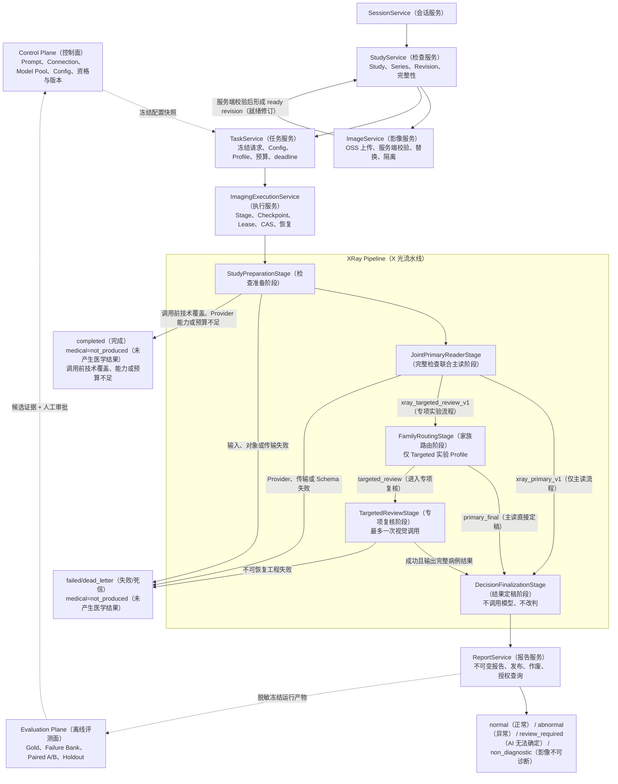

# MS-Image XRay（X 光）后续修正与分阶段实施指南

状态：`HISTORICAL_PHASE_GUIDE（历史阶段指南） / APPROVED_TARGET_CONTEXT（已批准目标上下文）`

更新日期：2026-08-25

适用工作区：`/Users/mozhicheng/workspace/code/cy-code/ms-image`

> **当前事实提示**：本文保留 2026-08-25 前一阶段的合同修正、阶段目标与取舍背景。当前运行事实、下一开发动作和新会话入口以 [24-current-runtime-audit-and-next-development-guide.md](24-current-runtime-audit-and-next-development-guide.md) 为准；本文中“当前实施权威”“以本文为准”等表述仅为历史上下文，不能覆盖 24 号文档、当前源码、测试或经授权取得的运行证据。

## 1. 文档定位

本文用于后续新会话继续开发 `ms-image（影像服务）` 的 XRay（X 光）AI（人工智能）与 Prompt（提示词）链路。它不是重新创造一套架构，而是基于当前代码、已有设计和已确认缺口，回答以下问题：

1. 当前代码实际上已经完成了什么；
2. 已批准的目标链路应该是什么；
3. 哪些合同需要先修正，哪些能力应该后做；
4. 每个阶段接收什么、处理什么、输出什么、怎样失败和怎样验收；
5. 下一会话应该从哪里开始，不能同时做哪些事情。

本文记录了其形成阶段对 `22-xray-full-ai-prompt-chain-development-guide.md（X 光完整 AI 与提示词链路开发指南）` 的修正。当本文件与 22 号文档的历史表述冲突时，以 24 号文档、当前源码和运行证据为准；22 号文档保留完整架构背景，21 号文档保留完整能力范围。

本轮文档设计不授权：

- 修改业务代码；
- 新增或执行数据库迁移；
- 新建独立测试脚本；
- 直接操作真实数据库、OSS（对象存储）或生产环境；
- 删除 v1（第一版）兼容链。

## 2. 三类权威边界

系统事实、目标设计和医学发布不能由同一个“最高权威”混在一起判断。

| 权威类别 | 中文含义 | 可以证明什么 | 不能证明什么 |
|---|---|---|---|
| `Current Fact Authority（当前实现事实权威）` | 当前 worktree（工作树）的源码、模型、配置、测试和时间绑定运行证据 | 当前代码实际存在什么、当前运行到哪里、当前字段和状态是什么 | 不能因为错误代码已经存在，就反向推翻批准后的目标合同；也不能证明医学准确率 |
| `Approved Target Contract（批准目标行为权威）` | 用户批准的架构合同和本文修正后的目标规则 | 系统应该实现什么、各层职责和禁止事项是什么 | 不能把尚未实现的目标写成当前已完成事实 |
| `Medical Release Authority（医学发布权威）` | 冻结 Gold（可信金标准）、Failure Bank（失败样本库）、Paired A/B（配对实验）、Holdout（留出集）和发布审批 | 医学效果是否改善、是否允许发布 | 代码通过、接口返回 JSON 或单次病例表现不能替代医学证据 |

冲突处理顺序不是简单的“源码永远最高”，而是按问题选择权威：

```text
问“现在实现了什么”
-> 看 Current Fact Authority（当前实现事实权威）

问“应该实现成什么”
-> 看 Approved Target Contract（批准目标行为权威）

问“是否提高准确率、能否发布”
-> 看 Medical Release Authority（医学发布权威）
```

## 3. 当前真实状态

当前统一状态必须保持为：

```text
D5_CODE_FOUNDATION_COMPLETE（D5 代码基础完成）
ENGINEERING_SEGMENTS_PASSED（工程分段检查通过）
FULL_RUNTIME_NOT_QUALIFIED（完整运行时未资格化）
MEDICAL_ACCURACY_UNKNOWN（医学准确率未知）
MEDICAL_RELEASE_NO_GO（医学发布禁止放行）
```

### 3.1 已存在的代码基础

- Session/Study/Series/Image/Revision（会话/检查/序列/影像/修订）代码基础；
- Task/StageCheckpoint/Outbox/Worker（任务/阶段检查点/事务发件箱/工作进程）可靠执行骨架；
- Prompt/Connection/ModelPool/Config/Audit（提示词/连接/模型池/配置/审计）控制面骨架；
- Prompt Source/Import/Renderer/Message Contract（提示词来源/导入/渲染/消息合同）和安全变量白名单代码基础；
- v2 Targeted Prompt command（第二版专项提示词命令）的 family_key/focus_key/primary_complete_result（家族键/关注点键/主读完整结果）传递合同已经修复，并已有现有合同测试覆盖；
- Logical Call/Physical Attempt（逻辑调用/物理尝试）、真实网络边界、Attempt（尝试）终态化和 Winner CAS（胜出比较交换）骨架；
- OpenAI-compatible Gateway（OpenAI 兼容网关）、Secret Resolver（密钥解析器）、OSS Image Signer（OSS 影像签名器）和 Encrypted Response Store（加密响应存储器）边界；
- StudyPreparation/JointPrimaryReader/FamilyRouting/TargetedReview/DecisionFinalization（检查准备/联合主读/家族路由/专项复核/结果定稿）五个 Stage Handler（阶段处理器）；
- Report/Evaluation（报告/评测）代码骨架；
- Nacos Prompt -> Gateway -> Platform/Provider（Nacos 提示词到网关、平台和模型提供方）的分段验证证据。

### 3.2 尚不能宣称完成的部分

- 没有共享非生产环境下完整的 `MySQL -> Outbox -> Broker -> Worker -> OSS -> Provider -> Report（关系数据库到报告）` 资格化证据；
- `FamilyRouting（家族路由）` 当前仍固定 `primary_final（主读直接定稿）`，TargetedReview（专项复核）不可达；
- `AIConfigCompiler（AI 配置编译器）` 仍限制 single（单通道顺序模式）、一个 lane（通道）和 `max_attempts=1（最多一次尝试）`；
- unknown Attempt（未知尝试）默认查询能力为 unsupported（不支持原请求查询），缺少有界终止合同；
- 第二 Provider（模型提供方）、Retry（重试）、Fallback（自动降级）和 Race（双通道竞速）尚未分别资格化；
- 当前 active Primary Prompt/Connection/ModelPool/Config（激活主读提示词/连接/模型池/配置）尚未完成真实盘点、冻结、激活和端到端重放资格化；
- Prompt Runtime Contract（提示词运行合同）尚未在真实 Provider 链证明 developer/user/image/schema/actual_model（开发者消息/用户上下文/影像/结构/实际模型）完全一致；
- Primary Prompt A/B（主读提示词配对实验）和 Targeted Prompt Qualification（专项提示词资格化）尚未运行；
- `ms_image_eval（影像评测库）`、冻结 Gold（可信金标准）、标签仲裁和 Holdout（留出集）尚未形成可用医学发布证据；
- 当前主库迁移基线、旧 AI 表结构兼容和 `alembic_version（迁移版本）` 状态尚未闭环。

正确表述是：

```text
真实 Provider transport/attempt（模型传输/尝试）骨架已存在并有离线合同测试；
生产完整运行链尚未资格化；
医学准确率仍未知。
```

## 4. 辩证审查结论

### 4.1 哪些设计应该保留

1. 完整 Study（检查）联合主读，而不是恢复大量器官 Prompt（提示词）分别调用后由 Python（程序）拼接；
2. Service（服务）负责业务事实、可靠执行和外部依赖，Stage（阶段）负责医学流水线；
3. 一个医学 Stage 对应一个 Logical Call（逻辑调用），Retry/Fallback/Race（重试/降级/竞速）只增加 Physical Attempt（物理尝试）；
4. Winner（胜出结果）按技术合同和 CAS（比较交换）产生，不按“更异常”“置信度更高”或程序投票产生；
5. OSS（对象存储）保存对象，数据库保存对象身份、哈希、大小、状态和版本，不恢复公共 `file_asset（文件资产）` 表；
6. Family（家族）只作为首版路由词汇、报告组织和评测分层，不按 Family 拆表、拆 Service 或默认调用模型；
7. TargetedReview（专项复核）最多一次视觉调用，并输出新的完整病例结果，不输出 patch（补丁）供程序拼接。

### 4.2 哪些设计需要收敛

1. 不把 Targeted、Retry、Multi-Provider、Fallback 和 Race（专项复核/重试/多模型/降级/竞速）全部绑定成“核心链完成”的必要条件；
2. 不把五个 Family（家族）写成永久医学本体；它们只是 `v1 routing vocabulary（首版路由词汇）`；
3. 不把“一份 Prompt 正文、两种模式”写成永久不可打破的规则；应使用共享医学核心和两个冻结入口；
4. 不把 Prompt（提示词）优化放到 Race（竞速）之后；Prompt 和模型的单变量实验应在 Primary（主读）医学基线之后尽早开始；
5. 不在没有错误率、SLA（服务等级目标）和成本证据时提前打开 Retry/Fallback/Race；
6. 不让程序用“投照数量不足”直接产生 `non_diagnostic（影像不可诊断）` 医学结论。

### 4.3 表和 Service 是否过多

当前需要保留的事实 owner（事实所有者）是合理的，主要风险不是表数量，而是重复建模和能力过早抽象。默认不新增：

- Family 表；
- Targeted 表；
- Fallback 表；
- Race 表；
- Lane 表；
- 公共 `file_asset（文件资产）` 表；
- 平行 Repository（仓储层）、第二套 CRUDBase（数据访问基类）、DatabaseService（数据库服务）或第二套 Runtime（运行时）。

只有在真实 Attempt（尝试）查询和竞速实现证明现有字段无法表达稳定通道身份时，才评审向现有 Attempt 记录增加最小 `lane_key（通道键）`；这仍需单独迁移授权。

## 5. 修正后的端到端链路



## 6. 平面和 Service（服务）责任

| 平面/Service | 目的与意义 | 主要输入 | 核心处理 | 主要输出 | 主要数据落点 |
|---|---|---|---|---|---|
| `Control Plane（控制面）` | 冻结可追溯 AI 配置，防止运行中 Prompt、模型或连接漂移 | Prompt 候选、Connection、Model Pool、Schema、预算、Profile | 校验、编译、版本化、资格记录、激活和审计 | 不可变 Config Snapshot（配置快照） | Prompt/Connection/ModelPool/Config/Audit 记录 |
| `SessionService（会话服务）` | 建立业务会话和幂等入口 | 业务请求、可信身份、幂等键 | 创建/读取会话、权限和幂等校验 | session_id（会话标识） | session_record（会话记录表） |
| `StudyService（检查服务）` | 管理病例级检查、Series、Revision 和 ready 状态 | 会话、影像元数据、Series 集合 | 重算 revision manifest（修订清单）、封存和漂移校验 | ready revision（就绪修订） | study/series/revision 相关记录 |
| `ImageService（影像服务）` | 管理 OSS 上传、服务端校验、替换和隔离 | 上传意图、对象键、服务端读取结果 | 签名上传、HEAD/流式校验、hash/size/format 校验、版本替换 | ready/quarantined image（就绪/隔离影像） | image_record（影像记录表）和 OSS 对象 |
| `TaskService（任务服务）` | 把一次诊断请求冻结成可重放事实 | ready revision、Config、Profile、预算、deadline | 冻结请求快照、模型与 Prompt 指纹、创建首个 Stage 和 Outbox | task_id、frozen snapshot（任务标识、冻结快照） | task/stage/outbox 记录 |
| `ImagingExecutionService（影像执行服务）` | 可靠地推进 Stage，支持 lease、CAS、恢复和重复消息 | Task、Stage、Worker 身份、冻结输入 | claim、heartbeat、checkpoint、状态推进、恢复 | 下一 Stage、终态或重排 | stage_checkpoint/outbox/task 记录 |
| `AIRequestService（AI 请求服务）` | 管理 Logical Call/Physical Attempt 和真实 Provider 网络边界 | 冻结 Prompt、模型候选、影像引用、预算、deadline | 创建 Call/Attempt、事务外调用、技术校验、Winner CAS、终态化 | 技术有效结果或明确工程失败 | ai_call/ai_call_attempt 记录、加密响应对象 |
| `ReportService（报告服务）` | 固化和发布不可变医学结果，不重新做医学选择 | Final result（最终结果）、Task/Stage lineage（血缘） | 生成不可变报告版本、发布、作废、授权查询、通知幂等 | report_id、发布状态、医学状态 | report 记录、通知 Outbox（如现有合同承载） |
| `Evaluation Plane（离线评测面）` | 衡量准确率和决定候选是否可发布，不参与在线改判 | 脱敏病例、冻结输出、Gold、所有指纹 | 标签审计、评分、Failure Bank、配对实验、Holdout | 指标、置信区间、候选发布建议 | 独立评测库/评测产物；当前尚未资格化 |

Service（服务）实现继续遵循：

```text
API（接口层）
-> Service（业务服务层）
-> DalBase CRUD（数据访问层）
-> Model/DB（模型/数据库）
```

Worker（工作进程）也必须经 Service/DAL（服务/数据访问层）操作数据库；不得在 API、Service、Worker 或脚本中直接拼装 SQLAlchemy 查询。

## 7. 医学 Stage（阶段）详细合同

### 7.1 StudyPreparationStage（检查准备阶段）

**目的**：在任何付费模型调用前确认运行输入可复现、技术上可读取、符合冻结 Provider 能力和预算合同。

**接收**：

- task_id/stage_checkpoint_id（任务/阶段标识）；
- frozen study_revision_id（冻结检查修订标识）；
- manifest_sha256（清单哈希）；
- ready image snapshot（就绪影像快照）；
- Provider image capability（模型影像能力）；
- budget/deadline（预算/截止时间）。

**程序可以判断**：对象存在、hash/size/format（哈希/大小/格式）、影像隔离状态、已知投照元数据、影像数量和格式是否满足 Provider 合同、Revision（修订）是否漂移、预算和 deadline 是否允许调用。

**程序不能判断**：影像在医学上是否足以排除病变、是否具有诊断价值、最终是否为 `non_diagnostic（影像不可诊断）`。这些必须由医学模型在完整影像上下文中输出。

**输出**：

- `prepared（已准备）`：生成冻结 Provider image inputs（模型影像输入）；
- `completed + medical=not_produced（完成但未产生医学结果）`：调用前技术覆盖、能力或预算不足；
- `failed/dead_letter + medical=not_produced（失败/死信且未产生医学结果）`：对象、传输、清单漂移或不可恢复工程错误。

### 7.2 JointPrimaryReaderStage（联合主读阶段）

**目的**：让一个模型调用看到同一 Study（检查）的全部合格影像，产生病例级完整医学结果，避免器官级碎片结果由程序拼接。

**接收**：冻结 Study 输入、Shared Medical Core（共享医学核心）、Primary Frozen Entry（主读冻结入口）、冻结 Schema/Config/Model/Connection（结构/配置/模型/连接）、预算和 deadline。

**处理**：创建一个 Logical Call（逻辑调用）；根据当前已资格化能力创建 Physical Attempt（物理尝试）；通过 Gateway（网关）调用 Provider（模型提供方）；校验传输、JSON、Schema、完整病例结果和响应身份；用技术合同选定 Winner（胜出尝试）。

**输出**：完整 `complete_medical_result（完整医学结果）`、medical_status（医学状态）、findings/evidence/uncertainty（发现/证据/不确定性）以及所有运行指纹。工程失败只能输出 `medical=not_produced（未产生医学结果）`。

### 7.3 FamilyRoutingStage（家族路由阶段）

**目的**：只在 Targeted 实验 Profile（专项实验流程档）中，根据 Primary（主读）已经产生的结构化证据，确定是否值得进行一次专项复核。

五个 `v1 routing vocabulary（首版路由词汇）`：

| family_key（家族键） | 中文含义 | 使用范围 |
|---|---|---|
| `thoracic（胸腔）` | 胸腔、肺、气道、心影和胸膜 | 路由、报告组织、评测分层 |
| `abdominal（腹腔）` | 腹腔、消化和泌尿生殖 | 路由、报告组织、评测分层 |
| `appendicular_orthopedic（四肢骨关节）` | 四肢长骨、关节、髌骨和相关骨盆附肢关系 | 路由、报告组织、评测分层 |
| `axial_orthopedic（轴骨骼）` | 脊柱、肋骨、胸骨和轴骨骼 | 路由、报告组织、评测分层 |
| `head_neck（头颈）` | 头颅、颌面、鼻腔和颈部 | 路由、报告组织、评测分层 |

以下病例保持 `Primary-only（仅主读）`，不创建第六 Family（家族）：全身性、非特异性、多区域、跨 Family、无法唯一归族、路由证据不足。

**接收**：Primary 完整结果、冻结 Profile、技术覆盖上下文，以及 Primary Schema（主读结构合同）中明确允许路由使用的 uncertainty/conflict/risk signals（不确定性/冲突/风险信号）。

**确定性处理**：

1. `xray_primary_v1（仅主读流程）` 永远输出 `primary_final（主读直接定稿）`；
2. 只有 `xray_targeted_review_v1（专项实验流程）` 可以评估专项路由；
3. 有且只有一个 Family/Focus（家族/关注点）满足冻结路由合同，才输出 `targeted_review（进入专项复核）`；
4. 普通不满足、多 Family、跨区域、输入不完整、无法唯一归族或证据不足，统一输出 `primary_final（主读直接定稿）`；
5. 不调用模型、不读取 Gold（可信金标准）、不看标签、不创造 Finding（影像发现）、不改写 Primary 医学结果。

**只能输出**：

- `primary_final（主读直接定稿）`；或
- `targeted_review（进入专项复核）`。

Router（路由器）禁止创建、覆盖或修改 `normal/abnormal/review_required/non_diagnostic（正常/异常/AI 无法确定/影像不可诊断）`。

**输出数据**：route_signal（路由信号）、最多一个 family_key（家族键）、一个 selected_focus_key（选定关注点键）、route_reason_codes（路由原因码）、route_contract_version（路由合同版本）、Primary 完整结果和来源哈希的原样传递。

### 7.4 TargetedReviewStage（专项复核阶段）

**目的**：当 Primary（主读）已指出唯一的高风险、冲突或证据不足范围时，使用一次受控视觉调用复核该范围，同时仍检查完整 Study（检查）。

**接收**：与 Primary 相同的完整 Study、Primary 完整结果、唯一 family_key/focus_key（家族键/关注点键）、路由原因、Targeted Frozen Entry（专项冻结入口）、冻结 Schema/Config/Model（结构/配置/模型）、预算和 deadline。

**处理**：把 Primary 完整结果作为先验事实输入，但要求模型重新核对完整 Study；最多一个视觉 Logical Call；输出新的完整病例结果；使用与 Primary 同等级的技术 Schema 校验。

**成功输出**：新的完整 `complete_medical_result（完整医学结果）`，整体替代 Primary 成为 Final candidate（最终候选）；禁止输出 patch 后由 Python 拼接。

**失败语义**：当前 `xray_targeted_review_v1（专项实验流程）` 的 Targeted 技术失败必须进入 `failed/dead_letter + medical=not_produced（失败/死信且未产生医学结果）`，不得静默退回 Primary。如果未来需要回退 Primary，必须新建显式命名、独立冻结和独立评测的 Profile（流程档），不能作为运行时隐藏行为。

### 7.5 DecisionFinalizationStage（结果定稿阶段）

**目的**：把冻结流程已经选定的完整结果转换为唯一 Final result（最终结果），避免 ReportService（报告服务）再次做医学选择。

**接收**：Primary 完整结果或成功 Targeted 完整结果，以及 route lineage（路由血缘）、Call/Attempt lineage（调用/尝试血缘）和冻结合同指纹。

**处理**：校验输入是一个完整病例结果；记录来源；不调用模型、不新增 Finding、不改变 normal/abnormal/review_required/non_diagnostic，不对 Primary 和 Targeted 投票或拼接。

**输出**：不可变 Final result（最终结果）及其来源指纹，交给 ReportService（报告服务）。

### 7.6 ReportService（报告服务）

**目的**：持久化和发布已经定稿的不可变结果，提供可追溯查询和作废能力。

**接收**：Final result、Task/Study/Revision（任务/检查/修订）标识、Prompt/Config/Model/Schema（提示词/配置/模型/结构）指纹和报告发布命令。

**处理**：创建不可变报告版本；Task（任务）终态化；发布通知使用幂等事件键；允许后续作废或创建新版本，但不原地篡改已发布报告。

**输出**：report_id（报告标识）、发布状态、医学状态、查询授权结果和通知事件。

## 8. Prompt（提示词）完整设计与完善路线

Prompt（提示词）不是一段可以直接覆盖的长文本，而是一组必须分别冻结、追踪和评测的合同。系统需要同时解决两类问题：

1. `Prompt Runtime Contract（提示词运行合同）`：来源可信、变量安全、渲染确定、消息角色正确、Schema（结构合同）一致、Task（任务）可重放；
2. `Medical Prompt Optimization（医学提示词优化）`：在可信 Gold（可信金标准）和 Primary-only（仅主读）基线之上，提高异常召回、正常闭环、跨投照一致性和不确定性表达。

第一类属于 E1 Primary Runtime（真实主读工程链）的必要组成，现在就要完成；第二类属于医学实验，必须在 M1 Primary Medical Baseline（主读医学基线）之后通过 Paired A/B（配对实验）推进。二者不能混成“Prompt 已接通，所以准确率已提高”。

### 8.1 当前 Prompt 实现事实

当前代码已经具备以下基础：

- `Prompt Source（提示词来源） -> Prompt Import（提示词导入） -> ai_prompt_template（提示词模板记录） -> immutable AI Config（不可变 AI 配置） -> Task Snapshot（任务快照）` 的控制面骨架；
- Prompt 正文、变量合同、消息合同、来源回执、Schema、模型计划和 Config（配置）均可使用哈希冻结；
- `PromptRenderer（提示词渲染器）` 只允许 `SAFE_STUDY_CONTEXT_JSON（安全检查上下文）`、`OUTPUT_SCHEMA_JSON（输出结构合同）` 和 `PRIMARY_RESULT_JSON（主读结果）` 三类变量；
- `PromptMessageAssembler（提示词消息组装器）` 支持把冻结医学指令放在 `developer（开发者消息）`，把规范化病例上下文放在 `user（用户消息）`，避免上下文改变系统角色；
- v2 Primary（第二版主读）不再根据 Family（家族）动态选择 Prompt 正文，只使用 Task 冻结的唯一 Prompt；
- v2 Targeted Prompt command（第二版专项提示词命令）已经修复：唯一 `family_key（家族键）`、`focus_key（关注点键）`、可选 `strategy_key（策略键）` 和 Primary 完整结果会进入冻结命令与安全上下文；缺少路由选择会 fail closed（安全失败关闭）；
- 当前修改已有现有合同测试覆盖，不能再把该断点写成“待修复”。

当前仍未具备的事实：

- 尚未确认目标 Nacos namespace（命名空间）中哪一版 XRay Prompt 可以作为当前合格 Primary 候选；
- 尚未完成当前数据库 Prompt/Connection/ModelPool/Config（提示词/连接/模型池/配置）的真实冻结和激活链；
- 尚未证明启用 Provider 后的开发者消息、用户上下文、影像输入、Schema 返回和实际模型身份在完整运行中一致；
- 尚无可信医学基线，任何 Prompt 正文都不能宣称已提高正常或异常识别准确率；
- TargetedReview（专项复核）仍不可达，因此 Targeted Prompt 目前只能完成合同准备，不能宣称运行或医学资格化。

### 8.2 Prompt 分层结构

```text
Shared Medical Core（共享医学核心）
├── Primary Frozen Entry（主读冻结入口）
└── Targeted Frozen Entry（专项冻结入口）

Runtime Context（运行时上下文）
├── SAFE_STUDY_CONTEXT_JSON（安全检查上下文）
├── OUTPUT_SCHEMA_JSON（输出结构合同）
└── PRIMARY_RESULT_JSON（主读完整结果，仅专项使用）

Provider Payload（模型提供方请求）
├── developer message（冻结医学指令）
├── user message（规范化病例上下文）
├── image inputs（完整检查影像输入）
└── frozen generation parameters（冻结生成参数）
```

各层职责必须分开：

| 层 | 目的 | 允许变化 | 禁止承载 |
|---|---|---|---|
| `Shared Medical Core（共享医学核心）` | 定义跨 Primary/Targeted 共用的医学阅读原则和状态语义 | 只能通过新不可变 Prompt 版本变化 | 病例数据、Signed URL（签名地址）、Secret（密钥）、Gold 标签 |
| `Primary Frozen Entry（主读冻结入口）` | 定义首次独立完整 Study（检查）阅读任务 | 可通过 Primary Prompt A/B 形成候选版本 | Primary 先验、Family 路由结论、旧系统器官级结果拼接 |
| `Targeted Frozen Entry（专项冻结入口）` | 定义一次受控专项复核任务和反锚定要求 | 只在 M2 证据成立后形成候选版本 | 只看裁剪区域、输出局部 patch（补丁）、默认覆盖 Primary |
| `SAFE_STUDY_CONTEXT_JSON（安全检查上下文）` | 提供当前病例允许使用的结构化事实 | 每个 Task 按冻结 Revision（修订）变化 | 任意用户指令、标签、Gold、Secret、未净化文本 |
| `OUTPUT_SCHEMA_JSON（输出结构合同）` | 约束 Provider 返回可解析的完整病例结果 | 只能通过新 Schema/Config 版本变化 | 医学规则补丁、根据输出反向改判的程序逻辑 |
| `PRIMARY_RESULT_JSON（主读结果）` | 给 Targeted 提供完整 Primary 先验和来源事实 | 每个 Targeted Task 不同 | Primary 路径、离线 Gold、程序生成的医学结论 |
| `image inputs（影像输入）` | 向模型提供同一冻结 Study 的全部合格影像 | 随冻结 Study Revision 变化 | 把临时 Signed URL 写入 Prompt 永久指纹或普通日志 |

### 8.3 Shared Medical Core（共享医学核心）必须表达的内容

共享医学核心不应按器官拆成几十个 Prompt。它至少应稳定表达以下合同：

1. `Role and scope（角色与范围）`：执行兽医影像学分析；只基于当前完整 Study、允许的临床上下文和可见证据；不得臆测未提供的病史、实验室结果或检查结论；
2. `Whole-study reading（整组检查阅读）`：所有可用投照属于同一次检查，必须联合阅读，不能把单图结论直接当病例结论；
3. `Image inventory（影像清单）`：先确认影像数量、投照、方向、重复、缺失和技术限制，再进行医学判断；
4. `Systematic search（系统化搜索）`：按稳定顺序检查已覆盖解剖区域，主动寻找异常，也主动寻找支持正常结论的反证；
5. `Finding evidence（影像发现证据）`：异常 Finding（影像发现）必须说明可定位区域、影像表现、支持投照、跨投照一致性、严重程度或范围，以及仍存在的不确定性；
6. `Normal counterevidence（正常反证）`：正常不能只写“未见明显异常”，必须说明关键区域是否可见、哪些结构支持正常闭环、哪些区域无法充分评价；
7. `Cross-view consistency（跨投照一致性）`：不同投照支持、冲突或不可比较时要明确表达，不得把单投照伪影强行升级为确定异常；
8. `Uncertainty separation（不确定性分离）`：区分医学上证据冲突、局部无法充分评价、整组影像不可诊断和工程上根本没有产生医学结果；
9. `Complete case result（完整病例结果）`：Primary 和 Targeted 都输出完整病例级结果，不能依赖 Python 合并多个局部医学结论；
10. `Structured output only（只输出结构化结果）`：严格遵循冻结 Schema，不输出结构外解释、Markdown（标记文本）或无法追溯的自由文本字段。

### 8.4 Prompt 输入合同

| 输入 | 来源 | 进入方式 | 作用 | 边界 |
|---|---|---|---|---|
| Prompt 正文 | 经审核的 Prompt Source/Import（提示词来源/导入） | 冻结为 `developer message（开发者消息）` | 医学任务、阅读原则和输出要求 | 不在运行时动态拼接角色指令 |
| `species（物种）` | Task 冻结快照 | `SAFE_STUDY_CONTEXT_JSON` | 支持犬/猫等物种相关判断 | 未提供时必须表达未知，不猜测 |
| `anatomy_regions（解剖区域）` | Study/Task 元数据 | `SAFE_STUDY_CONTEXT_JSON` | 告知本次检查声明覆盖的区域 | 它是元数据，不代表已裁剪影像，也不能替代模型查看完整影像 |
| `view_positions（投照位置）` | Series/Image 元数据 | `SAFE_STUDY_CONTEXT_JSON` | 帮助跨投照对应和覆盖判断 | 不可信或缺失时按未知处理，不由程序生成医学结论 |
| `coverage/technical_limitations（覆盖/技术限制）` | StudyPreparation 和冻结快照 | `SAFE_STUDY_CONTEXT_JSON` | 提供技术事实和已知限制 | 程序只能给技术事实，`non_diagnostic（影像不可诊断）` 由模型决定 |
| `clinical_context_allowlist（临床上下文白名单）` | 可信调用方与冻结快照 | `SAFE_STUDY_CONTEXT_JSON` | 提供被允许的临床问题或背景 | 不接受任意 Prompt 注入文本，不包含 Gold 标签 |
| `ordered_image_refs（有序影像引用）` | 冻结 Series 清单 | `SAFE_STUDY_CONTEXT_JSON` 和 Provider 影像输入 | 保证影像顺序、数量和来源可追溯 | 临时 Signed URL 不写普通数据库和日志 |
| `OUTPUT_SCHEMA_JSON（输出结构合同）` | 冻结 AI Config | 渲染变量/Provider 结构化输出能力 | 保证结果可解析和可验证 | Schema 变化必须形成新 Config，不原地修改 |
| `PRIMARY_RESULT_JSON（主读结果）` | 成功 Primary 完整结果 | 仅 Targeted 的 user context（用户上下文） | 支持专项复核、冲突核对和来源追踪 | Primary 不接收；Targeted 不得只输出差量补丁 |
| Family/Focus/Reason（家族/关注点/原因） | FamilyRouting 冻结输出 | Targeted 安全上下文 | 限定专项问题和解释为什么调用 | 不选择另一份器官 Prompt 正文，不创建医学状态 |

### 8.5 Primary Frozen Entry（主读冻结入口）

**目的**：独立、完整、无 Primary 先验地读取同一 Study 的所有合格影像，输出病例级完整结果。

**输入**：Shared Medical Core、冻结安全上下文、冻结 Schema、完整影像输入、冻结模型与生成参数。

**主要指令**：

- 先核对影像清单和技术限制，再系统阅读；
- 同时执行异常搜索与正常反证搜索，避免只追求异常召回或只追求正常闭环；
- 对每个 Finding 给出可见证据和不确定性，不得从病名反推影像表现；
- 对未发现异常的高风险区域，只有在可见性足够时才能提供正常反证；
- 最终四类医学状态必须来自同一完整结果，不由程序二次选择；
- 输出必须完整满足冻结 Schema，缺字段是技术合同失败，不由 Python 补医学内容。

**输出**：一个完整 `complete_medical_result（完整医学结果）`，包含冻结 Schema 当前规定的医学状态、Finding、证据、正常反证、技术限制、不确定性和报告组织信息；具体字段名称以冻结 Schema 为准，未经证据不新增平行结果结构。

### 8.6 Targeted Frozen Entry（专项冻结入口）

**目的**：对 Primary 已经产生的唯一高风险、冲突或证据不足范围进行一次受控复核，同时仍然重新阅读完整 Study。

**输入**：与 Primary 相同的完整影像、Primary 完整结果、唯一 Family/Focus、路由原因、Shared Medical Core、冻结 Targeted Schema/Config/Model。

**反锚定要求**：

1. Primary 结果只是待核对的先验，不是正确答案；
2. 先独立查看影像，再逐项核对 Primary 的支持证据和反证；
3. 必须搜索与 Primary 相反的证据，避免只确认已有判断；
4. 专项范围用于提高注意力，不允许忽略同一 Study 的其他区域；
5. 成功时输出新的完整病例结果，整体成为 Final candidate（最终候选）；
6. 不输出 patch，不由程序合并 Primary 和 Targeted；
7. 技术失败按当前实验 Profile fail closed，不静默回退 Primary。

Targeted Prompt 可以在初期与 Primary 共享医学核心正文，但入口语义和消息上下文必须独立冻结。是否进一步拆分正文，只能由 Primary 残余 Failure Bank 和单变量 Paired A/B 证明，不能因为“专项听起来更专业”就提前拆成大量家族 Prompt。

### 8.7 四类医学状态在 Prompt 中的边界

| 状态 | Prompt 应要求的判定语义 | 不能混入的场景 |
|---|---|---|
| `normal（正常）` | 已覆盖且可评价的关键区域有明确正常反证；没有足以支持异常的影像发现；限制项被如实说明 | 不能把“没有认真搜索到异常”或工程未调用成功当正常 |
| `abnormal（异常）` | 至少有一个有影像证据、可定位、可追溯到投照的异常 Finding | 不能只凭临床背景、病名猜测或程序规则改为异常 |
| `review_required（AI 无法确定）` | 已产生有效医学阅读，但证据冲突、边界不清或多种解释无法可靠区分 | 不能承载 Provider 超时、Schema 失败、预算不足或对象读取失败 |
| `non_diagnostic（影像不可诊断）` | 模型在查看完整影像后判断技术质量或覆盖严重不足，无法形成可靠病例级医学结论 | 不能由 Python 仅凭数量/投照规则产生，也不能代替工程失败 |
| `medical=not_produced（未产生医学结果）` | 不是医学状态；表示调用前资格不足或工程链没有产生有效医学输出 | 不进入四类医学结果评分分母，必须单独统计工程失败原因 |

### 8.8 Prompt 生命周期和版本链路

```mermaid
flowchart LR
    SRC["Prompt Source（提示词来源）"] --> IMP["PromptImportService（提示词导入服务）<br/>规范化变量、拒绝危险模板"]
    IMP --> PT["ai_prompt_template（AI 提示词模板）<br/>正文、变量合同、消息合同、来源回执、SHA"]
    PT --> VAL["Prompt Validate（提示词校验）<br/>语言、变量白名单、占位符、消息角色"]
    VAL --> CFG["AIConfigService（AI 配置服务）<br/>冻结 Prompt、Schema、Model、Connection、Profile"]
    CFG --> TS["Task Snapshot（任务快照）<br/>冻结全部指纹"]
    TS --> CMD["Prompt Command（提示词命令）<br/>Primary 或 Targeted 安全上下文"]
    CMD --> RENDER["PromptRenderer（提示词渲染器）<br/>规范 JSON、字符预算、哈希"]
    RENDER --> MSG["PromptMessageAssembler（消息组装器）<br/>developer 指令 + user 上下文"]
    MSG --> AI["AIRequestService（AI 请求服务）<br/>影像签名、Provider 调用、Attempt"]
    AI --> VALID["Response Validation（响应校验）<br/>JSON、Schema、模型身份、完整结果"]
    VALID --> ART["Frozen Artifacts（冻结产物）<br/>结果、指纹、加密原始响应引用"]
    ART --> EV["Evaluation Plane（评测面）<br/>Failure Bank、Paired A/B、Holdout"]
    EV -. "候选证据 + 审批" .-> CFG
```



必须冻结或记录的 Prompt 身份至少包括：Prompt template id/version（模板标识/版本）、content SHA（正文哈希）、variables contract SHA（变量合同哈希）、message contract SHA（消息合同哈希）、output Schema SHA（输出结构哈希）、Config SHA、release fingerprint（发布指纹）、requested model/actual model（请求模型/实际模型）和 Study Revision/image hashes（检查修订/影像哈希）。

### 8.9 Prompt 完善的失败归因和单变量实验

不能看到最终病例错误就直接加长 Prompt。先把失败归因到一个主要层，再决定是否改 Prompt：

| Failure Bank（失败样本库） | 首要核查 | 可以验证的 Prompt 单变量 | 必须保护的反向指标 |
|---|---|---|---|
| `ABN -> normal（异常漏为正常）` | 标签、影像分组、可见性、模型是否系统搜索 | 强化系统化搜索顺序、关键区域显式检查、Finding 证据要求 | NOR 误报、review_required、延迟和字符预算 |
| `NOR -> abnormal（正常误为异常）` | 伪影、单投照、正常变异、临床文本锚定 | 强化正常反证、跨投照确认、正常变异与伪影约束 | ABN 召回和 non_diagnostic 比例 |
| `review_required` 过高 | 是否真正存在医学冲突，还是 Prompt 不敢闭环 | 明确证据充分时的闭环条件和冲突分级 | 错误自信、ABN 漏诊、NOR 误报 |
| `non_diagnostic` 过高 | 影像是否实际可评估、技术限制是否被夸大 | 明确“局部受限”不等于“整组不可诊断” | 不能强迫低质量影像给出确定结论 |
| `parse/schema failure（解析/结构失败）` | Schema 复杂度、消息角色、Provider 结构化能力 | 精简结构说明、明确只输出 JSON、修正字段合同 | 不得通过 Python 补写医学字段 |
| `cross-view conflict（跨投照冲突）` | 影像顺序、投照元数据、同一 Study 组装 | 强化跨投照核对和冲突表达 | 不能把单图异常全部降为正常 |
| Targeted 无净收益 | 路由是否唯一、Primary 是否已足够、锚定偏差 | Targeted 反锚定指令或取消该 Targeted 路径 | Primary-only 总体性能、成本和延迟 |

每轮只改变一个主要变量。允许的实验示例是“只加强正常反证”“只调整跨投照冲突规则”“只改变模型”；禁止同时修改 Prompt、模型、Schema、影像集合、FamilyRouting 和评分器。

### 8.10 Prompt 医学评测 Gate（门禁）

Prompt 候选进入发布审批前必须依次通过：

```text
Label Audit（标签审计）
-> Frozen Failure Bank Regression（冻结失败样本回归）
-> Full Development Set Regression（完整开发集回归）
-> Paired A/B（同病例配对实验）
-> Isolated Holdout（隔离留出集）
-> Release Review（发布审批）
```

每次实验必须保持病例、影像、Gold、Schema、模型、生成参数和评分器一致；若做 Model A/B，则 Prompt 必须一致。至少分别报告：

- ABN -> normal（异常漏为正常）；
- NOR -> abnormal（正常误为异常）；
- ABN not-normal（异常未被判为正常）；
- NOR clean-normal（正常干净闭环）；
- review_required/non_diagnostic（无法确定/不可诊断）比例；
- parse/schema/timeout/rate-limit（解析/结构/超时/限流）比例；
- 延迟、token、成本和 requested_model/actual_model 一致性；
- 总体指标与物种、解剖区域、投照数量和主要 Failure Bank 分层指标。

标签冲突、429、超时、缺图和解析失败必须保留事实并单独统计，不能静默删除后计算“更好看的准确率”。

### 8.11 Prompt 后续实施顺序

Prompt 完善按以下顺序嵌入总链路：

1. `Q0 Prompt Inventory（提示词盘点）`：只读确认 Nacos 来源、数据库模板、状态、变量合同、消息合同、来源回执和引用 Config；不打印 Secret 和完整敏感病例；
2. `Q1 Runtime Contract Qualification（运行合同资格化）`：为当前 Primary 候选确认 `prompt-message-contract.v1（提示词消息合同第一版）`、安全变量、Schema、字符预算、Config 冻结和 Task 重放；这属于 E1；
3. `Q2 Primary Baseline Freeze（主读基线冻结）`：完成真实 Primary 链后冻结当前 Prompt、模型、病例和评分器，形成 M1 基线；
4. `Q3 Primary Prompt A/B（主读提示词配对实验）`：按 Failure Bank 一次只改一个 Prompt 变量；
5. `Q4 Model A/B（模型配对实验）`：在同 Prompt 下比较已资格化模型，不同时启用 Fallback/Race；
6. `Q5 Targeted Prompt Qualification（专项提示词资格化）`：仅在 Primary 残余失败证明 M2 有必要后，验证反锚定、完整 Study 重读和完整结果输出；
7. `Q6 Release and Rollback（发布与回滚）`：新 Prompt 只通过新不可变 Template/Config 发布；回滚激活旧 Config，不原地修改历史正文。

当前下一会话可以完成 Q0/Q1 的代码与配置事实核验，并准备 E1 Primary Prompt；不能跳过真实运行和 M1 基线直接宣称 Q3/Q5 医学优化完成。

### 8.12 Prompt 禁止事项

- 不恢复旧系统大量系统级、器官级、单项级 Prompt 调用链；
- 不按 Family 动态选择不同医学正文作为默认路径；
- 不把标签、Gold 或评测答案放入在线 Prompt；
- 不把原始用户文本、Secret、Signed URL 或未净化临床文本拼入 developer message；
- 不让 Python 根据 Prompt 输出改写 normal/abnormal/review_required/non_diagnostic；
- 不用程序拼接 Primary 和 Targeted 的医学结果；
- 不在没有冻结基线时同时改 Prompt、模型、Schema、路由和影像选择；
- 不把结构校验通过、单例成功或 Mock 测试当成医学准确率证据；
- 不把某个具体模型名称永久写进医学正文；模型能力和版本由 Connection/ModelPool/Config 冻结并通过 A/B 验证。

## 9. 可靠执行尚需补齐的合同

### 9.1 unknown Attempt（未知尝试）

当前默认 `UnsupportedProviderAttemptLookup（不支持模型原请求查询）` 只能返回 unsupported/unknown（不支持/未知）并重排。后续必须定义：

- first_unknown_at（首次未知时间）或可由现有字段可靠推导的等价事实；
- 最大对账等待时间；
- 最大对账次数；
- provider lookup unsupported（模型不支持查询）时的终止/死信条件；
- 人工运维处置和审计入口；
- 禁止在 unknown 未终态前盲目发送替代请求。

若现有字段足以表达，应优先复用；字段确实不足时再单独评审迁移。

### 9.2 Cancel（取消）与迟到结果

必须明确：Task 取消后不再创建新 Attempt；正在网络中的 Attempt 允许记录实际返回和实际计费事实，但不能覆盖已取消 Task 的最终业务状态；迟到成功只能进入审计，不得重新发布报告；Winner 已产生后其余迟到 Attempt 只能终态化，不能改写 Winner。

### 9.3 Report Notification（报告通知）幂等

报告持久化、Task 完成和通知事件必须有明确事务边界。重复消费只能重复确认同一个发布事实，不能创建重复报告版本或重复向下游发送不可控通知。

### 9.4 requested_model/actual_model（请求模型/实际模型）

每个 Attempt 必须同时保存请求模型和 Provider 实际执行模型。若平台发生模型重定向，不能只记录 requested_model（请求模型）并误认为医学实验变量未变化。

### 9.5 Cost/Budget/Deadline（成本/预算/截止时间）

冻结 Profile（流程档）必须包含调用预算、最大 Attempt、deadline、可否重试/降级/竞速。取消不能抹掉已经发生的 token/费用事实；预算耗尽在调用前应是 `completed + medical=not_produced`，调用后的 Provider 失败则按工程失败合同终态化。

### 9.6 Retention/Deletion/PII（留存/删除/敏感信息）

必须分别定义：

- OSS 原始影像留存周期和删除/法律保留条件；
- 加密 Provider 原始响应的对象引用、密钥版本和留存周期；
- 报告及审计血缘留存周期；
- Evaluation（评测）脱敏产物和 Gold（可信金标准）的留存周期；
- 日志、Prompt 安全上下文和响应中 PII（个人敏感信息）脱敏规则；
- Secret、Signed URL（签名地址）和原始响应正文禁止进入普通日志或普通数据库字段。

### 9.7 医学治理边界

在线人工病例复核本阶段暂不开发，但离线 Gold（可信金标准）标签审计、分歧仲裁、Holdout（留出集）隔离和医学发布审批不能省略。Evaluation Plane（评测面）只能向 Control Plane（控制面）提交候选证据，不能自动在线激活配置。

## 10. 数据表保留边界

### 10.1 保留的事实组

| 事实组 | 用途 | 原则 |
|---|---|---|
| Session/Study/Series/Image/Revision（会话/检查/序列/影像/修订） | 病例与影像输入事实 | OSS 存对象，数据库存对象身份和版本 |
| Task/StageCheckpoint/Outbox（任务/阶段检查点/事务发件箱） | 冻结请求和可靠执行 | 状态推进、lease、CAS 和消息恢复 |
| Logical Call/Physical Attempt（逻辑调用/物理尝试） | AI 调用身份、尝试、成本、模型和 Winner | 一个医学 Stage 一个 Call，多次工程尝试复用同一 Call |
| Report（报告） | 不可变最终医学输出 | 发布、作废、授权查询和血缘 |
| Prompt/Connection/ModelPool/Config/Audit（提示词/连接/模型池/配置/审计） | 控制面版本、资格和发布 | 不可变快照和审计 |
| Evaluation（评测） | Gold、运行结果、评分和发布门禁 | 与在线库隔离，当前仍未资格化 |

### 10.2 统一数据库规则

- 每张 MySQL（关系数据库）物理表必须有独立、非空、服务端生成的 opaque `VARCHAR(64)` id（不透明字符串主键）；
- 不使用 foreign key（外键）、数据库 enum（枚举）、联合主键或 tenant_id（租户字段）；
- 状态和类型使用 string/json/timestamp（字符串/JSON/时间戳），字段 comment（注释）写候选类型和中文含义；
- 资源 ID 只放 query 参数或 request body（查询参数/请求体），接口不使用 `/{id}`；
- 数据库访问统一经实体 DAL 和现有 `DalBase（数据访问基类）`；
- 未经用户明确授权，不新增或执行 Alembic（数据库迁移）脚本。

## 11. 修正后的实施依赖顺序

```text
P0-A Targeted Prompt Command Contract（专项提示词命令合同，已完成）
-> P0-B Reliable Execution Contracts（可靠执行合同）
-> Q0 Prompt Inventory（提示词盘点）
-> Q1 Prompt Runtime Contract（提示词运行合同）
-> E1 Primary Runtime（真实单 Provider 主读工程链）
-> M1 Primary Medical Baseline（主读医学基线）
-> Primary Prompt A/B（主读提示词单变量实验）
-> Second Provider Minimal Qualification（第二模型最小资格化）
-> Model A/B（模型单变量对比）
-> M2 FamilyRouting + TargetedReview（家族路由与专项复核）
-> Retry Qualification（重试资格化）
-> Fallback Qualification（自动降级资格化）
-> Race Qualification（双通道竞速资格化）
```

这是一条依赖顺序，不是一次性开发清单：

- P0-A 已由当前源码和合同测试完成，下一会话不得重复修复；
- P0-B 与 Q0/Q1 是 E1 的前置收口，可在同一会话中按最小切片推进，但必须分别给出证据和完成状态；
- Prompt（提示词）优化不能等到 Race（竞速）之后；
- 第二 Provider（模型提供方）先只服务于 Model A/B（模型对比），不立即启用自动降级或竞速；
- Targeted（专项复核）必须由 Primary（主读）的残余 Failure Bank（失败样本库）证明有必要；
- Retry/Fallback/Race（重试/降级/竞速）必须分别由真实错误率、SLA、尾延迟和成本证据触发；
- 七项能力仍属于完整长期目标，但不再作为同一个完成状态一次性验收。

## 12. 分阶段实施卡

### 12.1 P0 Contract Corrections（P0 合同修正）

- **目的**：消除实现前的合同矛盾和确定性断点。
- **输入**：本文、当前源码、现有 Stage/Prompt/Config 合同。
- **已完成 P0-A**：FamilyRouting 输出边界已收敛；v2 Targeted command 已验证并传递 family/focus/primary complete result，缺少唯一路由选择时 fail closed；现有合同测试已经覆盖。不得重复修改或把它写回待办。
- **下一步 P0-B**：确认 StudyPreparation 只承担技术覆盖和调用前资格；定义 unknown Attempt、Task cancel、迟到 Attempt/Winner、Report notification 幂等和 requested_model/actual_model 最小可执行合同。
- **输出**：一致的代码合同和现有测试更新。
- **失败语义**：合同无法一致时停止后续能力启用，不用兼容分支掩盖。
- **主要落表**：原则上不新增表；先复用现有记录。
- **工程 Gate（工程门禁）**：针对性合同测试、Ruff、compileall、diff-check 通过。
- **医学 Gate（医学门禁）**：无；本阶段不得声称提高准确率。
- **停止条件**：需要迁移才能继续时，停止并请求迁移授权。
- **回滚单位**：单个合同修正和对应测试。

### 12.2 Q0/Q1 Prompt Runtime Preparation（提示词盘点与运行合同准备）

- **目的**：在真实 Primary 调用前确认系统到底会使用哪一个 Prompt、怎样渲染、怎样进入 Provider 请求，以及怎样被 Task 冻结和重放。
- **输入**：目标 Nacos namespace、数据库 Prompt 模板、Connection、ModelPool、AI Config、Schema、消息合同、安全变量白名单和引用关系；只检查变量名与元数据，不输出 Secret 或完整敏感病例。
- **处理**：完成 Q0 Inventory；选定唯一 Primary 候选；验证来源回执、状态、变量合同、消息角色、Schema、字符/图像预算、Config 指纹、Task 快照和重放一致性；区分代码可用、配置已创建、配置已激活和真实运行已资格化。
- **输出**：Prompt Inventory（提示词清单）、缺口清单、冻结候选及其哈希/版本关系、E1 可使用或不能使用的明确结论。
- **失败语义**：来源不明、变量不兼容、Schema 不一致、引用缺失、Config 不可冻结或 Secret/模型能力缺失时 fail closed，不临时拼 Prompt 或回退旧器官 Prompt。
- **主要落表**：复用现有 Prompt/Connection/ModelPool/Config/Audit/Task snapshot；不新增 Prompt 表或第二套配置中心。
- **工程 Gate**：同一冻结输入可确定性渲染；developer/user/image/schema 分层一致；Config 与 Task 指纹可追溯；无敏感数据泄露。
- **医学 Gate**：无；本阶段只资格化运行合同，不能声称 Prompt 医学效果改善。
- **停止条件**：需要真实 Secret、数据库迁移、外部配置写入或环境授权才能继续时，提交缺口和最小动作后等待授权。
- **回滚单位**：不可变 Prompt/Config 候选；禁止原地覆盖历史模板。

### 12.3 E1 Primary Runtime（真实单 Provider 主读工程链）

- **目的**：证明一个冻结 Config（配置）可以在共享非生产环境中产生一个可追溯不可变报告。
- **输入**：ready revision（就绪修订）、单 Provider、单模型、单 lane、单 Attempt、Primary Prompt、预算和 deadline。
- **处理**：Task/Outbox 创建、Worker 执行、StudyPreparation、OSS 签名、Provider 调用、加密响应存储、Attempt/Stage 终态、DecisionFinalization、Report 发布。
- **输出**：真实 report_id、完整 lineage（血缘）、实际 requested_model/actual_model、成本和延迟事实。
- **失败语义**：工程失败为 `medical=not_produced`；不得用 Mock/provider-disabled 宣称通过。
- **主要落表**：复用现有 Task/Stage/Outbox/Call/Attempt/Report。
- **工程 Gate**：重复消息、lease 恢复、Winner CAS、对象身份和发布幂等在共享非生产环境通过。
- **医学 Gate**：无；只证明工程运行。
- **停止条件**：真实基础设施配置、迁移或 Secret 未授权/未就绪。
- **回滚单位**：冻结 Config/Profile，不删除底层事实。

### 12.4 M1 Primary Medical Baseline（主读医学基线）

- **目的**：得到可比较的 Primary-only（仅主读）正常与异常基线。
- **输入**：标签审计后的 Gold、冻结病例/Revision/影像哈希、冻结 Prompt/Model/Schema/Scorer（提示词/模型/结构/评分器）。
- **处理**：固定分层运行、计算正常与异常指标、建立 Failure Bank 和置信区间。
- **输出**：基线指标、Failure Bank、不可修改的实验清单。
- **失败语义**：标签不一致、病例泄漏或运行指纹不完整时评测无效。
- **主要落表**：Evaluation Plane；不得把 Gold 写回在线路由。
- **工程 Gate**：同一病例可复现、所有指纹完整。
- **医学 Gate**：批准基线和阈值，但不必达到发布线才能开始单变量研究。
- **停止条件**：Gold 不可信或评测库不可用。
- **回滚单位**：评测运行和候选版本。

### 12.5 Primary Prompt A/B（主读提示词配对实验）

- **目的**：在不改变模型、病例、Schema 和评分器的前提下提高正常与异常识别。
- **输入**：M1 基线、Failure Bank、一个 Prompt 候选变量。
- **处理**：Paired A/B、固定 Failure Bank 回归、完整集回归、隔离 Holdout。
- **输出**：候选 Prompt 的净收益、代价和是否发布建议。
- **失败语义**：同时改模型/路由/图片选择或标签时实验作废。
- **主要落表**：Prompt 版本、Config 候选、Evaluation 结果。
- **工程 Gate**：Schema、渲染和运行合同不回退。
- **医学 Gate**：目标指标改善且正常误报、异常漏报和不确定率不越界。
- **停止条件**：连续候选无净收益或出现跨分层退化。
- **回滚单位**：不可变 Prompt/Config 版本。

### 12.6 Second Provider Minimal Qualification + Model A/B（第二模型最小资格化与模型对比）

- **目的**：判断另一个模型是否在相同 Prompt 和病例上提供净医学收益。
- **输入**：同一 Prompt、Schema、病例、Gold、评分器和预算口径；第二 Provider/Model 候选。
- **处理**：先做传输、Schema、actual_model、成本和速率工程资格，再做 Model A/B。
- **输出**：工程资格结果、医学对比结果和候选优先级。
- **失败语义**：API 能返回 JSON 只算工程连通，不算医学资格。
- **主要落表**：现有 Connection/ModelPool/Config/Call/Attempt 和 Evaluation。
- **工程 Gate**：真实模型身份、限流、超时、错误分类和成本可追溯。
- **医学 Gate**：同一实验条件下的配对结果和 Holdout。
- **停止条件**：actual_model 漂移不可控或没有净收益。
- **回滚单位**：候选 Connection/Model/Config。

### 12.7 M2 FamilyRouting + TargetedReview（家族路由与专项复核）

- **目的**：只针对 Primary 残余、可唯一归因的失败模式验证一次专项复核是否有净收益。
- **输入**：Primary 完整结果、版本化路由信号、唯一 Family/Focus、Targeted Prompt 入口和相同完整 Study。
- **处理**：确定性路由；最多一次 Targeted 调用；成功输出完整病例结果。
- **输出**：Primary-only 与 Targeted Profile 的配对差异。
- **失败语义**：Targeted 技术失败 fail closed，不静默回退 Primary。
- **主要落表**：复用 Stage/Call/Attempt/Report；不新建 Family/Targeted 表。
- **工程 Gate**：路由可重放、Targeted command 完整、单次调用和 lineage 正确。
- **医学 Gate**：残余失败改善，正常误报、跨 Family 退化、成本和延迟均不过线。
- **停止条件**：无稳定残余失败、无法唯一归族或无净收益。
- **回滚单位**：Targeted 实验 Profile 和路由合同版本。

### 12.8 Retry Qualification（重试资格化）

- **目的**：只恢复同一候选的明确临时工程失败。
- **输入**：真实 timeout/rate-limit/temporary transport（超时/限流/临时传输）错误分布。
- **处理**：错误分类、退避、最大 Attempt、预算/deadline、unknown 对账和 Winner 后停止。
- **输出**：恢复率、额外成本、尾延迟和重复调用风险。
- **失败语义**：unknown 不盲发；永久错误不重试；预算耗尽停止。
- **主要落表**：复用 ai_call_attempt_record（AI 尝试记录表）。
- **工程 Gate**：所有重试路径有界、幂等、可恢复。
- **医学 Gate**：无独立改判；Winner 医学结果仍按同一冻结候选产生。
- **停止条件**：恢复收益低于成本或重复计费不可控。
- **回滚单位**：冻结 Retry policy（重试策略）。

### 12.9 Fallback Qualification（自动降级资格化）

- **目的**：主候选明确工程失败时尝试第二个已资格化候选。
- **输入**：两个已冻结且分别资格化的候选、顺序、错误分类、总预算和 deadline。
- **处理**：single（顺序模式）下最多两个候选；只由工程失败触发。
- **输出**：可用性提升、成本和医学分布变化。
- **失败语义**：不能由 normal/abnormal、置信表达或“看起来不够异常”触发。
- **主要落表**：复用 Call/Attempt/Config；不新增 FallbackService（降级服务）。
- **工程 Gate**：双方成功/失败、unknown 阻断、预算和迟到结果全部可重放。
- **医学 Gate**：Fallback 结果作为独立模型变量完成评测。
- **停止条件**：候选未分别资格化或引入不可解释分布漂移。
- **回滚单位**：Fallback Config/Profile。

### 12.10 Race Qualification（双通道竞速资格化）

- **目的**：在已证明的 SLA 尾延迟问题下，用最多两个通道减少完成延迟。
- **输入**：两个已资格化 lane、总预算、并发计划、取消和迟到结果合同。
- **处理**：并发 Attempt；首个技术合同有效结果通过 Winner CAS 胜出；其余尝试只终态化。
- **输出**：p95/p99（高分位延迟）、额外成本、Winner 分布和迟到结果事实。
- **失败语义**：禁止医学投票、拼接、选择“更异常”的结果；取消不等于抹掉已发生计费。
- **主要落表**：优先复用现有 Attempt；只有证明确需稳定通道身份才评审 lane_key。
- **工程 Gate**：同时成功、先后成功、重复消息、取消和 Winner 并发全部通过。
- **医学 Gate**：不同 Winner 模型导致的医学分布必须被评测和接受。
- **停止条件**：没有 SLA 需求、成本过高或 Winner 分布不可控。
- **回滚单位**：Race Config/Profile。

## 13. 三层完成定义

### 13.1 CORE_DIAGNOSTIC_CHAIN_COMPLETE（核心诊断链完成）

满足：真实单 Provider Primary 链从 ready revision 到不可变 Report 完整运行；工程失败不产生医学结果；重复消息、lease、CAS、发布幂等和血缘闭环。

它不要求 Targeted、Retry、Fallback 或 Race 已经启用。

### 13.2 MEDICAL_BASELINE_QUALIFIED（医学基线资格化）

满足：Primary-only（仅主读）在冻结 Gold、同病例、同影像、同 Schema 和同评分器下形成可复现基线，并完成 Failure Bank 和 Holdout 隔离。

### 13.3 OPTIONAL_CAPABILITY_QUALIFIED（可选能力逐项资格化）

Targeted、Retry、Multi-Provider、Fallback 和 Race 必须分别拥有：

- `CODE_IMPLEMENTED（代码已实现）`；
- `RUNTIME_QUALIFIED（运行时已资格化）`；
- 需要影响医学结果的能力还必须有 `MEDICALLY_VALIDATED（医学效果已验证）`。

一个能力未资格化，不得抹掉其他已经完成层级的事实；也不得因为代码存在就默认启用。

## 14. 下一会话的精确第一任务

下一会话不要重复处理已经完成的 P0-A，也不要一次打开全部能力。第一任务由三个相互衔接、但必须分别验收的部分组成：

1. `P0-B Reliable Execution Contracts（可靠执行合同）`：核验并最小补齐 StudyPreparation 调用前资格、unknown Attempt、Task cancel、迟到 Attempt/Winner、Report notification 幂等和 requested_model/actual_model 合同；
2. `Q0 Prompt Inventory（提示词盘点）`：只读盘点目标 Nacos、数据库 Prompt、Connection、ModelPool、AI Config、Schema、消息合同、安全变量和引用关系，形成“存在/缺失/激活/被引用/可重放”的明确清单；
3. `Q1 Prompt Runtime Contract（提示词运行合同）`：选择唯一 Primary 候选，验证来源、渲染、developer/user/image/schema 分层、字符与图像预算、Config 冻结、Task 快照和重放一致性；
4. P0-B 与 Q0/Q1 在无需新增迁移、外部写入或额外授权的范围内完成后，直接进入 `E1 Primary Runtime（真实单 Provider 主读工程链）` 的最小可运行切片；
5. E1 必须从 ready revision（就绪修订）经过 Outbox、Broker/Worker、OSS Signed URL、Provider、Encrypted Response、Attempt/Stage Finalize、DecisionFinalization 到不可变 Report，不能停在“配置存在”或“单独网络调用成功”；
6. 遇到必须新增数据库字段/表、执行迁移、写外部配置或使用真实 Secret 的动作时，先提交精确证据、最小变更、风险和回滚单位，再等待授权。

下一会话必须保留以下已完成事实，不得倒退：

- v2 Targeted Prompt command 的 family/focus/primary complete result 传递已修复；
- FamilyRouting 只产生路由决定，不产生医学状态；
- Prompt 安全变量和 developer/user 消息角色分离已有代码基础；
- 当前仍是 `FULL_RUNTIME_NOT_QUALIFIED（完整运行时未资格化）` 和 `MEDICAL_ACCURACY_UNKNOWN（医学准确率未知）`。

## 15. 禁止事项

- 不新建无证据表、Service、Family、医学规则或第二套运行时；
- 不恢复旧系统几十个器官/系统 Prompt；
- 不让 FamilyRouting 创建医学状态；
- 不用 Python 对医学结果投票、拼接、覆盖或改判；
- 不把工程错误伪装为 `review_required` 或 `non_diagnostic`；
- 不根据 normal/abnormal 触发 Fallback；
- 不在 unknown Attempt 未终态时盲发替代请求；
- 不用 Mock、provider-disabled 或分段烟测宣称完整真实运行通过；
- 不在没有冻结 Gold 和 Holdout 时宣称准确率提高；
- 不创建公共 `file_asset（文件资产）` 表；
- 不使用 foreign key、数据库 enum、联合主键、tenant_id 或 `/{id}` 路由；
- 未经用户授权不新增/执行迁移，不生成独立测试脚本，不删除 v1 兼容链，不处理 Web 管理页面和在线人工病例复核。

## 16. 历史新会话 Prompt（提示词，已废止）

下方内容保留为本历史阶段形成时的交接样本，**禁止复制为当前新会话启动 Prompt（提示词）**。当前唯一可复制入口是仓库根目录 [AGENT_SESSION_PROMPTS.md](../../AGENT_SESSION_PROMPTS.md) 的“开启当前 XRay Runtime、Nacos Prompt 与完整能力开发会话（当前入口）”；当前事实和下一开发顺序以 [24-current-runtime-audit-and-next-development-guide.md](24-current-runtime-audit-and-next-development-guide.md) 为准。

```text
请继续开发 `/Users/mozhicheng/workspace/code/cy-code/ms-image` 的 XRay（X 光）AI（人工智能）与 Prompt（提示词）完整链路。目标是基于当前代码继续实施并真实跑通，不是重新发明架构、只写计划或只完成基础壳子；长期目标中的 Primary（主读）、Prompt（提示词）、TargetedReview（专项复核）、Retry（重试）、第二 Provider（第二模型提供方）、Fallback（自动降级）和 Race（双通道竞速）都不能被永久删除，但必须按证据和依赖逐项实现、资格化和验收，禁止一次性同时开启。

一、启动恢复与工作树保护

1. 只操作 `/Users/mozhicheng/workspace/code/cy-code/ms-image`。
2. 严格遵守仓库 `AGENTS.md`。当时要求先完整阅读：
   - `AGENT_HANDOFF.md`
   - `.agent-handoff/snapshot.md`
   - `.agent-handoff/risks.md`
   - `.agent-handoff/backlog.md`
   - `docs/refactor/23-xray-next-phase-correction-and-implementation-guide.md`
3. **历史表述，现已失效**：23 号文档曾被视作后续实施权威；当前必须改为先读取 24 号文档、`AGENT_HANDOFF.md`、当前源码和测试。若它们冲突，以 24 号文档和当前代码/运行证据为准。
4. 使用 `xray-v2-accuracy-governor（X 光准确率治理）`约束涉及 Prompt、模型和医学评测的工作；使用 `agent-handoff（代理交接）`维护跨会话状态。
5. 再完整阅读即将修改的确切源码和现有测试；不得只根据文档猜测代码。
6. 开始前运行并阅读：`git status --short --branch`、`git diff --name-status`、`git diff --stat`。文档记录分支为 `codex/prompt-runtime-ai-gateway`、HEAD 为 `492a249c98175bf818ce092451585db766d73e76`，但必须以新会话现场输出为准。
7. 当前工作树有大量用户或其他会话改动。禁止 `git reset`、`git clean`、`git checkout`、`git restore`、`git stash`、整文件覆盖和 `git add -A`；只能在完整阅读重叠文件后使用 `apply_patch` 定点修改。
8. 不输出 `.env`、Nacos、数据库或 Secret 的真实值；只报告变量名、是否存在、来源、引用关系和缺口。

二、必须保持的当前事实口径

当前统一状态是：

`D5_CODE_FOUNDATION_COMPLETE（D5 代码基础完成） / ENGINEERING_SEGMENTS_PASSED（工程分段检查通过） / FULL_RUNTIME_NOT_QUALIFIED（完整运行时未资格化） / MEDICAL_ACCURACY_UNKNOWN（医学准确率未知） / MEDICAL_RELEASE_NO_GO（医学发布禁止放行）`。

当前代码已经具备：

- Prompt/Connection/ModelPool/Config/Audit（提示词/连接/模型池/配置/审计）控制面骨架；
- Prompt Source/Import/Renderer/Message Contract（来源/导入/渲染/消息合同）和安全变量白名单；
- Task（任务）冻结 Prompt/Model/Schema/Profile 指纹的代码基础；
- Outbox -> Worker -> Stage -> AIRequestService（事务发件箱到 AI 请求服务）执行骨架；
- OpenAI-compatible transport、Logical Call/Physical Attempt（OpenAI 兼容传输/逻辑调用/物理尝试）和网络边界骨架；
- v2 Targeted Prompt command 已把唯一 `family_key（家族键）`、`focus_key（关注点键）`、可选 `strategy_key（策略键）` 和 `primary_complete_result（主读完整结果）`传入命令与安全上下文，并有现有合同测试。该项属于已完成的 P0-A，禁止重复修复。

当前仍未完成：

- 默认 Secret Resolver、OSS Image Signer、Encrypted Response Store 等真实环境依赖尚未完整资格化；
- active Primary Prompt/Connection/ModelPool/Config 尚未完成真实盘点、冻结、激活和完整重放证明；
- unknown Attempt 的真实 Provider 对账和有界终止合同仍不足；
- 多 Provider Registry 尚未完成，当前主要是一个 OpenAI-compatible Adapter 骨架；
- 真实 `MySQL -> Outbox -> Broker/Worker -> OSS -> Provider -> Report` 全链没有共享非生产资格化证据；
- Primary 医学基线、Primary Prompt A/B、Model A/B、Targeted 医学评测和 Holdout 均未完成；
- TargetedReview 当前不可达，Retry/Fallback/Race 尚未逐项启用和资格化。

必须分别报告：

- `CODE_IMPLEMENTED（代码已实现）`；
- `RUNTIME_QUALIFIED（运行时已资格化）`；
- `MEDICALLY_VALIDATED（医学效果已验证）`。

代码存在、单元测试、Fake/Mock、provider-disabled、单独网络调用成功或 JSON 可解析，都不能替代完整运行资格或医学准确率证据。

三、固定架构与医学边界

1. 业务数据库链保持 `API（接口） -> Service（服务） -> DalBase CRUD（数据访问层） -> Model/DB（模型/数据库）`；Worker 也必须通过 Service/DAL，不得直接拼 SQLAlchemy。
2. 复用现有 `apps/runtime/service/` 和 `apps/runtime/core/crud.py:DalBase`；不新增 Repository、第二套 CRUDBase、DatabaseService、平行 service 包或第二套 Runtime。
3. 公共 Service 继续复用 SessionService（会话服务）、StudyService（检查服务）、ImageService（影像服务）、TaskService（任务服务）、ImagingExecutionService（影像执行服务）、AIConfigService（AI 配置服务）、AIRequestService（AI 请求服务）、ReportService（报告服务）。医学能力放在现有 Stage handler（阶段处理器），不按 Family 新建 Service。
4. 两个 Profile（流程配置）保持：
   - `xray_primary_v1`：`StudyPreparation（检查准备） -> JointPrimaryReader（联合主读） -> DecisionFinalization（结果定稿） -> Report（报告）`；
   - `xray_targeted_review_v1`：Primary 后进入确定性 FamilyRouting（家族路由）；`primary_final（主读直接定稿）`进入 DecisionFinalization，`targeted_review（专项复核）`最多调用一次 TargetedReview，成功并输出完整病例结果后进入 DecisionFinalization。
5. FamilyRouting 不调用模型、不读 Gold、不创建或修改 normal/abnormal/review_required/non_diagnostic（正常/异常/AI 无法确定/影像不可诊断），只输出路由决定和版本化理由。
6. 五个 Family 只是首版路由词汇：thoracic（胸腔）、abdominal（腹腔）、appendicular_orthopedic（四肢骨关节）、axial_orthopedic（轴骨骼）、head_neck（头颈）。全身性、非特异性、多区域、跨 Family 或无法唯一归族保持 Primary-only，不创建第六 Family，不按 Family 新建表、Service 或默认 Prompt 调用。
7. TargetedReview 最多一次视觉 Logical Call，必须重读同一完整 Study，输出新的完整病例结果；禁止只看裁剪区域、输出 patch（补丁）或由 Python 拼接 Primary 与 Targeted。
8. Targeted 实验 Profile 一旦触发后发生不可恢复工程失败，必须 fail closed：`failed/dead_letter + medical=not_produced`，不得静默回退 Primary。
9. 一个医学 Stage 对应一个 Logical Call；Retry/Fallback/Race 只增加 Physical Attempt。Winner 只能由技术合同、`first_technically_valid（首个技术合同有效）` 和 `winner_attempt_id CAS（胜出尝试比较交换）`决定；禁止医学投票、选“更异常”的结果、按置信度覆盖或程序改判。
10. StudyPreparation 只判断对象完整性、技术覆盖、Provider 能力、预算和 deadline（截止时间）等调用前资格；医学可评估性由视觉模型在完整影像上判断。程序不得仅凭投照数量直接产生医学 `non_diagnostic`。
11. OSS 保存对象；`image_record（影像记录表）`保存对象键、哈希、大小、状态和版本。不建设公共 `file_asset（文件资产）`表。
12. MySQL 不使用 foreign key（外键）、数据库 enum（枚举）、联合主键或 tenant_id；每张表有服务端生成、非空、独立 opaque `VARCHAR(64)` id；状态和类型使用 string/json/timestamp，并写英文候选值与中文注释。接口 ID 只放 query 或 request body，不使用 `/{id}`。
13. 未经明确授权，不新增或执行数据库迁移，不生成独立测试脚本，不删除 v1 兼容链，不处理 Web 管理页面和在线人工病例复核。

四、Prompt（提示词）必须完善到的运行合同

Prompt 不等于一段文本，必须实现并验证以下分层：

`Shared Medical Core（共享医学核心） + Primary Frozen Entry（主读冻结入口） + Targeted Frozen Entry（专项冻结入口） + Runtime Context（运行上下文） + Output Schema（输出结构合同）`。

1. Shared Medical Core 定义完整 Study 阅读、跨投照对应、正常与异常同时检查、证据约束、不确定性、non_diagnostic 边界、结构化结果、禁止臆测和禁止泄漏标签；不包含病例数据、Gold、Secret、Signed URL 或具体模型名称。
2. Primary Frozen Entry 要求模型独立阅读完整 Study，不能接收 Primary 先验、Family 路由结果或旧系统器官级拼接结果。
3. Targeted Frozen Entry 只在 M2 证据成立后使用；必须带唯一 Family/Focus、Primary 完整结果和反锚定要求，重新检查完整 Study，并输出完整病例结果，不能只输出局部补丁。
4. Renderer 只允许安全变量：`SAFE_STUDY_CONTEXT_JSON（安全检查上下文）`、`OUTPUT_SCHEMA_JSON（输出结构合同）`、`PRIMARY_RESULT_JSON（主读完整结果，仅 Targeted）`。
5. 冻结医学正文进入 `developer message（开发者消息）`；净化后的病例上下文进入 `user message（用户消息）`；影像作为独立 image inputs（影像输入）；禁止让病例文本改变系统指令。
6. Prompt Template、变量合同、消息合同、Schema、来源回执、Connection、ModelPool、生成参数和 Config 都必须不可变或使用内容哈希冻结；Task 创建时冻结引用和指纹，重放不得漂移到新 active 版本。
7. 模型名称和版本归 Connection/ModelPool/Config 管理，不永久写入医学 Prompt。
8. normal/abnormal/review_required/non_diagnostic 是医学输出；`medical=not_produced` 是工程/调用前未产生医学结果。程序不得互相转换这些状态。
9. 不恢复旧系统大量系统级、器官级和单项 Prompt 调用链；Family/Focus 是 Targeted 路由证据，不是默认动态选择旧式 Prompt 的键。
10. 不允许 Python 补写、拼接、投票、覆盖或改判医学结果。

五、本会话必须执行的当前最小闭环

不要重新处理已完成的 P0-A。按以下顺序推进，并为每一步分别给出 `CODE_IMPLEMENTED / RUNTIME_QUALIFIED / MEDICALLY_VALIDATED`：

A. `P0-B Reliable Execution Contracts（可靠执行合同）`

- 核验 StudyPreparation 调用前资格边界；
- 核验 unknown Attempt 的 Provider request identity（请求身份）、查询能力、终止时间、最大重查次数、禁止盲发规则；
- 核验 Task cancel、Provider 调用前/中/后取消、迟到 Attempt、迟到 Winner、Worker crash（工作进程崩溃）和恢复语义；
- 核验 Report 发布与通知事件幂等；
- 核验 requested_model/actual_model、预算、deadline 和成本事实；
- 优先复用现有字段和状态。若确实需要新字段/表或迁移，停止写入并提交 `file:line` 证据、最小模型建议、兼容性、风险和回滚单位，等待授权。

B. `Q0 Prompt Inventory（提示词盘点）`

只读整理并输出一张清单，至少包括：来源、template_key、version、status、content_sha256、variable_contract、message_contract、source_receipt、schema_sha256、被哪些 Config 引用、是否 active、是否适合 Primary、缺口和证据位置。盘点目标 Nacos namespace、当前数据库 Prompt/Connection/ModelPool/Config 和代码默认值；禁止打印 Prompt 中的敏感病例内容和所有 Secret 值。

C. `Q1 Prompt Runtime Contract（提示词运行合同资格化）`

- 选择唯一 Primary Prompt 候选，不按 Family 动态选择正文；
- 验证安全变量、确定性渲染、字符预算、developer/user/image/schema 分层；
- 验证 Prompt/Schema/Connection/ModelPool/Config 的不可变引用和哈希；
- 验证 Task Snapshot（任务快照）冻结后即使 active Config 改变，重放仍使用原版本；
- 验证 Provider 请求中的请求模型、实际模型、结构化输出和响应存储血缘一致；
- 本阶段只证明运行合同，不修改医学 Prompt 结论逻辑，不声称提高准确率。

D. `E1 Primary Runtime（真实单 Provider 主读工程链）`

P0-B 和 Q0/Q1 在当前授权内闭环后，直接实现或推进 E1 的最小真实切片：

`ready Study Revision（就绪检查修订） -> Task + Outbox（任务与事务发件箱） -> Broker/Worker（消息代理/工作进程） -> StudyPreparation -> OSS Signed URL（OSS 签名地址） -> JointPrimaryReader -> Provider -> Encrypted Response（加密响应） -> Logical Call/Physical Attempt -> Stage Finalize（阶段定稿） -> DecisionFinalization -> immutable Report（不可变报告） -> idempotent notification（幂等通知）`。

E1 只使用一个已冻结 Primary Config、一个 Provider、一个模型、一个 lane 和一个 Attempt。必须覆盖成功、Provider/Schema 失败、重复消息、lease 过期恢复、Winner CAS、取消和发布幂等。不能用 Fake/Mock 或分段成功替代共享非生产真实证据。

六、后续完整路线，不能遗漏也不能提前混做

`P0-B + Q0 + Q1 -> E1 Primary Runtime -> M1 Primary Medical Baseline -> Q3 Primary Prompt A/B -> Second Provider Minimal Qualification -> Q4 Model A/B -> M2 FamilyRouting + Q5 Targeted Prompt + TargetedReview -> Retry Qualification -> Fallback Qualification -> Race Qualification -> Q6 Release/Rollback`。

1. M1 先做 label audit（标签审计），冻结 Gold、病例、Study Revision、影像哈希、Prompt、模型、Schema、预算和 Scorer（评分器），建立 Primary-only 基线和 Failure Bank。
2. Primary Prompt A/B 必须在同病例、同图像、同 Gold、同模型、同 Schema 和同评分器下，一次只改变一个 Prompt 主要变量；先固定 Failure Bank，再全量回归，最后进入隔离 Holdout。
3. 第二 Provider 先只做传输/Schema/actual_model/成本资格化，再在同 Prompt 下进行 Model A/B；不能立即用于 Fallback 或 Race。
4. M2 只能由 Primary 残余 Failure Bank 证明需要；没有稳定、可唯一归因并可路由的残余失败，就保持 Primary-only。
5. Retry 只处理同一候选的明确临时工程失败；unknown 未终态不得盲发。
6. Fallback 只由明确工程失败触发，不能由 normal/abnormal、置信表达或“看起来不够异常”触发。
7. Race 最多两个已分别资格化的 lane；只有真实 SLA 尾延迟收益足以覆盖成本时才启用。
8. 每次 Prompt、模型、路由、Retry、Fallback 或 Race 实验只改变一个主要变量；禁止修改标签、跳过失败病例、用模型输出推断 Gold 或用 Python 修改医学结论。

七、修改前与完成后的强制输出

修改前先输出：

1. 当前代码事实与精确 `file:line` 证据；
2. 当前所处阶段和选择该阶段的理由；
3. 本切片的目的、输入、处理、输出、失败语义和下游消费者；
4. 幂等、事务边界、重试、unknown、取消、迟到结果和恢复策略；
5. 精确 write set（计划修改文件集合）；
6. 是否需要新字段、表、Service、外部配置写入或迁移，并给出证据；
7. 工程 Gate、医学 Gate、停止条件和回滚单位；
8. 相对上一阶段唯一主要变量。

随后直接实施当前最小可验证切片，不要只输出计划后停止。优先扩展仓库现有测试；不要新建独立测试脚本。完成后运行与改动对应的现有 pytest、Ruff、compileall 和 `git diff --check`。真实基础设施、外部配置或医学验证无法运行时，明确写 `NOT RUN（未运行）`以及缺少的具体条件，不得用 Mock 替代。

八、完成定义与交接

- `CORE_DIAGNOSTIC_CHAIN_COMPLETE（核心诊断链完成）`：真实单 Provider Primary 从 ready revision 到不可变 Report 完整运行，工程失败不产生医学结果，幂等、恢复、CAS、发布和血缘闭环。它不要求 Targeted/Retry/Fallback/Race 已启用。
- `MEDICAL_BASELINE_QUALIFIED（医学基线资格化）`：冻结 Gold 和完整运行指纹下形成可复现 Primary-only 正常/异常基线、Failure Bank 和隔离 Holdout。
- `OPTIONAL_CAPABILITY_QUALIFIED（可选能力资格化）`：Targeted、Retry、第二 Provider、Fallback 和 Race 分别拥有自己的代码、运行和必要医学证据。

每个阶段完成后更新 `AGENT_HANDOFF.md` 体系中的 snapshot、work-log、validation、backlog、risks 和 decisions（如有长期决策），运行 handoff maintenance。不要为了显得完整添加没有证据的新表、新 Service、新 Family、医学规则、Repository、CRUDBase、第二套 Runtime 或公共 file_asset 表。
```

## 17. 本文结论

推荐路线不是“维持简单骨架”或“一次性把全部能力做完”二选一，而是：

```text
保留已完成的 P0-A
-> 收口 P0-B 可靠执行合同
-> 完成 Q0 Prompt 盘点和 Q1 Prompt 运行合同
-> 跑通真实单 Provider Primary 工程链
-> 冻结可信 Primary 医学基线
-> 尽早做可归因的 Prompt 和模型单变量实验
-> 用残余失败证明是否需要 Targeted
-> 再用真实可靠性、SLA 和成本证据逐项资格化 Retry/Fallback/Race
```

这样既覆盖用户要求的完整长期链路，也避免在准确率尚未知时用过度复杂的运行能力掩盖核心医学问题。
