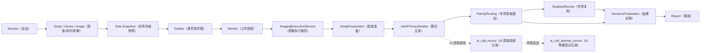
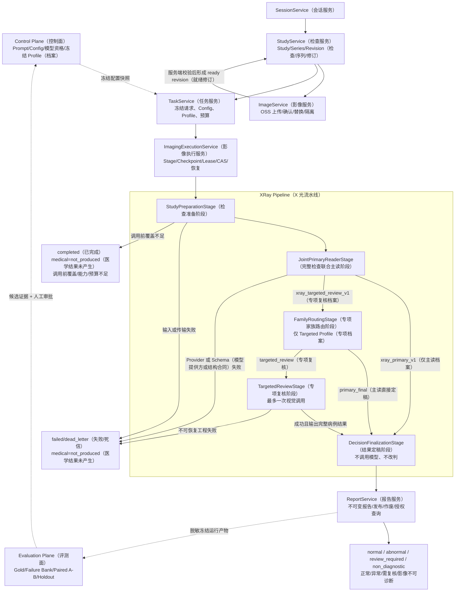

# MS-Image（影像服务）当前运行时审计、完整 XRay（X 光）开发路径与新会话交接

状态：`CURRENT_FACT_AND_NEXT_DEVELOPMENT_AUTHORITY（当前事实与后续开发权威）`

更新日期：2026-08-26

适用工作区：`/Users/mozhicheng/workspace/code/cy-code/ms-image`

适用提交：`492a249c98175bf818ce092451585db766d73e76`（工作树存在用户未提交修改，本文不将其视为可回退内容）

## 1. 结论先行

当前推荐的不是回退到旧提交后重写，也不是一次性打开专项、重试、自动降级和双通道；应在当前代码基础上做**分阶段的内部模块化收口**：先资格化真实运行时，再证明仅主读链路，再以冻结病例数据决定医学 Prompt（提示词）和专项能力是否值得引入。

当前唯一可以开绿灯的真实结论是：

```text
MS_IMAGE_CORE_AI_NETWORK_CHAIN_PASSED（MS-Image 核心 AI 网络链路已通过）
```

它证明的是一条非医疗冒烟链：

```text
Nacos（配置中心）已发布的非医疗 Prompt（提示词）
-> NacosPromptSourceClient（Nacos 提示词读取客户端）
-> PromptRenderer（提示词渲染器）
-> PromptMessageAssembler（提示词消息组装器）
-> EnvironmentReferenceSecretResolver（环境引用密钥解析器）
-> OpenAICompatibleGatewayAdapter（OpenAI 兼容网关适配器）
-> 外部 ms-ai-platform（AI 平台）
-> gemini-3.5-flash（模型）
-> 严格 JSON Schema（JSON 结构合同）校验与 Provider Request ID（模型提供方请求标识）回传
```

它**不能**证明完整 XRay（X 光）诊断已经可靠。当前统一状态必须保持为：

```text
D5_CODE_FOUNDATION_COMPLETE（D5 代码基础完成）
MS_IMAGE_CORE_AI_NETWORK_CHAIN_PASSED（核心 AI 网络链已通过）
FULL_WORKER_RUNTIME_NOT_QUALIFIED（完整 Worker 运行时未资格化）
MEDICAL_ACCURACY_UNKNOWN（医学准确率未知）
MEDICAL_RELEASE_NO_GO（医学发布不可放行）
```

原因是：真实 `Outbox（事务发件箱） -> Broker（消息代理） -> Worker（工作进程） -> OSS（对象存储） -> Provider（模型提供方） -> Attempt（物理尝试）终态化 -> Stage（阶段）终态化 -> Report（报告）` 尚未作为同一条冻结任务链在共享非生产环境形成可复核证据；更没有 Gold（可信金标准）、同病例 Paired A/B（配对 A/B）和 Holdout（留出集）证明医学效果。

## 2. 本文的权威范围与阅读方式

本文解决“当前真实代码和环境允许下一步做什么”，不重新定义全部医学规则或覆盖设计母文。

| 问题 | 权威来源 | 本文的用法 |
|---|---|---|
| 当前是否被授权改动 | 用户当前指令 + `AGENTS.md`（代理规则） | 最高优先级；本文不自行扩权 |
| 当前代码实际做什么 | 当前工作树源码、现有测试、运行合同 | 当前事实 |
| 当前外部环境实际发生什么 | 经授权取得的 MySQL（数据库）、OSS、Broker、Nacos、Provider 证据及时间 | 运行资格证据 |
| 目标架构与字段合同 | `docs/ms-image-final-architecture-and-database-design.md`（设计母文） | 目标合同，不等于已落地 |
| 当前完整能力目标 | `21-xray-complete-capability-chain-and-session-prompt.md`（完整能力合同） | 范围边界 |
| 逐层架构解释 | `22-xray-full-ai-prompt-chain-development-guide.md`（完整 AI/Prompt 开发指南） | 架构参考 |
| 旧的实施次序 | `23-xray-next-phase-correction-and-implementation-guide.md`（旧实施指南） | 目标合同参考；运行事实以本文为准 |
| 医学准确率是否改善 | 冻结 Gold + 同病例 Paired A/B + 确定性评分器 + 隔离 Holdout | 唯一医学证据 |

任何结论都必须同时标明以下三维状态，禁止用“完成度”一个词混淆它们：

| 维度 | `CODE_IMPLEMENTED（代码已实现）` | `RUNTIME_QUALIFIED（运行时已资格化）` | `MEDICALLY_VALIDATED（医学效果已验证）` |
|---|---|---|---|
| 证明的问题 | 源码是否实现结构与合同 | 真实依赖、真实 I/O（输入输出）和恢复是否跑通 | 对冻结医学数据是否有可解释净收益 |
| 可用证据 | 源码、单元测试、静态检查 | 环境绑定的真实 Trace（追踪）、对象哈希、任务状态 | Gold、Failure Bank（失败样本库）、Paired A/B、置信区间、Holdout |
| 不可替代者 | Mock（模拟）不能替代运行资格 | 单次 API 调用不能替代任务全链 | 工程成功不能替代准确率 |

## 3. 当前事实基线

### 3.1 已经存在且不应重复建设的代码能力

当前代码已具备以下结构；这表示“可在其上继续”，不等于它们都通过真实运行资格化。



当前五个 `Stage（阶段）` 都已注册：

| `Stage（阶段）` | 当前职责 | 当前证据 | 仍缺少的资格化 |
|---|---|---|---|
| `StudyPreparation（检查准备）` | 接收冻结的 `study_revision_id（检查修订标识）` 与 `manifest_sha256（清单哈希）` | 代码仅校验二者为字符串后产生 `prepared（已准备）` | OSS 对象存在、哈希/尺寸/格式、影像数、Revision（修订）漂移、Provider 能力与预算预检 |
| `JointPrimaryReader（联合主读）` | 构造 Primary（主读）Prompt Command（提示词命令），发起主读 AI Call（AI 调用），接受完整病例结果 | Prompt/AI Request（AI 请求）消费链存在 | 共享非生产 E1 的完整真实任务证据 |
| `FamilyRouting（专项家族路由）` | 承接 Primary（主读）输出并决定是否专项复核 | 当前固定输出 `primary_final（主读直接定稿）` | 确定性、零模型调用、唯一 `family/focus（家族/关注点）` 的真实规则 |
| `TargetedReview（专项复核）` | 最多创建一次专项 AI Logical Call（逻辑调用），成功时输出新的完整病例结果 | Stage（阶段）入口与 Prompt Command（提示词命令）存在 | 由真实 FamilyRouting（专项家族路由）触发并经 Paired A/B（配对 A/B）证明净收益 |
| `DecisionFinalization（结果定稿）` | 选择 Primary（主读）或 Targeted（专项复核）的完整结果，不调用模型、不拼接医学结论 | 代码将上游完整结果原样选定 | 取消、迟到结果、工程失败、报告发布幂等的 E1 实证 |

### 3.2 AI（人工智能）网络链已通过，但 Worker（工作进程）安全组成仍未资格化

当前 `.env（环境配置文件）` 的非敏感核验事实：

| 配置 | 当前值/状态 | 含义 |
|---|---|---|
| `BROKER_ENABLED（消息代理开关）` | `true（开启）` | 表示进程允许 Broker（消息代理）路径；不证明 RabbitMQ/Celery（消息队列/异步任务）已真实通达 |
| `AI_GATEWAY_ENABLED（AI 网关开关）` | `true（开启）` | 表示尝试构建真实 Gateway（网关）依赖；不证明依赖已合格 |
| Gateway 安全依赖 | 启用时固定 `EnvironmentReferenceSecretResolver（环境引用密钥解析器）` + OSS `AES256（AES-256 加密）` response store（响应存储）；不再有 mode/encryption/KMS 环境 selector（选择器） | 未注入符合前缀的非空 Secret（密钥）时仍 fail-closed（失败关闭）；固定安全合同不表示完整 Worker 已资格化 |
| `ALIYUN_OSS_*（阿里云 OSS 配置）` | 访问标识、访问密钥、端点、存储桶均存在 | 2026-08-26 隔离 synthetic（合成）对象已通过 AES256 PUT、HEAD、Worker GET、同机 signed GET 与 cleanup；Provider 外部可达性及完整任务链仍未证明 |
| `NACOS_*（Nacos 配置）` / `AI_PROMPT_NACOS_*（AI 提示词 Nacos 配置）` | `.env` 未显式出现 | 历史 smoke（冒烟）证据来自外部 Nacos 与临时上下文，不能误写为常态部署合同 |

这是一个正确的安全门：`build_gateway_runtime_dependencies()` 在开关开启时固定注入 `environment-reference（环境引用）` 密钥解析和 `AES256（AES-256 加密）` 响应存储，并继续校验合法 OSS（对象存储）与签名域名合同；不存在可将其切换为明文、disabled（禁用）或 KMS（密钥管理服务）模式的环境 selector（选择器）。当前真实依赖工厂仍使用 `UnsupportedProviderAttemptLookup（不支持的模型尝试查询器）`，因此 unknown（未知）原请求查询尚未资格化。

### 3.3 旧数据库不能直接承载新 Runtime（运行时）模型

已审计的旧 MySQL（关系数据库） `ms_image（影像库）` 有 45 张物理表。当前库中不存在完整新 Runtime（运行时）目标链依赖的一组新表，也没有 `alembic_version（Alembic 版本记录）`。

更重要的是，下列表名存在**同名不同义**，因此“删掉空表后直接跑当前迁移”不是安全方案：

| 物理表 | 遗留语义 | 目标 Runtime（运行时）语义 |
|---|---|---|
| `session_record（会话记录）` | 聊天消息、角色、父会话 | 影像业务会话、取消、幂等与状态 |
| `ai_prompt_template（AI 提示词模板）` | 旧正文、整数主键、人工权重 | 不可变版本、变量合同、来源回执、SHA（哈希） |
| `ai_api_connection（AI 接口连接）` | 可能含明文 API Key（接口密钥）的旧模型 | `secret_ref（密钥引用）`、能力与资格化状态 |
| `ai_model_pool（AI 模型池）` | 简单模型池 | 冻结 Lane Plan（通道计划）、预算与模型候选 |

因此，在用户明确确认前禁止执行建库、迁移、改表、删表、重命名、`DROP TABLE（删除表）` 或把旧表当新基线。推荐的目标决策是：

```text
ms_image（旧影像库）
-> Legacy / Archive（遗留/归档）

ms_image_runtime（在线运行时库）
-> 新 Runtime（运行时）在线事实

ms_image_eval（离线评测库）
-> Gold（可信金标准）、评测运行和产物
```

### 3.4 目标表是设计目标，不是本轮要立即执行的迁移

**在线 Runtime（运行时）16 表**：

| 域 | 表 | 中文用途 |
|---|---|---|
| 影像入口 | `session_record（会话记录）` | 一次影像业务会话、取消与幂等边界 |
| 影像入口 | `study_record（检查记录）` | 检查聚合、Revision（修订）、清单与封存事实 |
| 影像入口 | `series_record（序列记录）` | 一个检查中的影像序列与视位事实 |
| 影像入口 | `image_record（影像记录）` | OSS 对象引用、哈希、尺寸、状态与隔离事实 |
| 可靠执行 | `task_record（任务记录）` | 冻结请求、Config/Profile（配置/档案）、预算与任务状态 |
| 可靠执行 | `stage_checkpoint_record（阶段检查点记录）` | 每个 Stage（阶段）的输入、输出、版本、状态与恢复点 |
| 可靠执行 | `outbox_record（事务发件箱记录）` | 事务提交后可靠投递的事件 |
| 控制面 | `ai_prompt_template（AI 提示词模板）` | 不可变 Prompt（提示词）版本与变量/消息合同 |
| 控制面 | `ai_api_connection（AI 接口连接）` | `secret_ref（密钥引用）`、协议、能力与资格证据 |
| 控制面 | `ai_model_pool（AI 模型池）` | Lane Plan（通道计划）、候选模型、限制与预算 |
| 控制面 | `ai_config_record（AI 配置记录）` | 编译后的不可变 Config（配置）发布物 |
| 控制面 | `ai_control_audit_record（AI 控制面审计记录）` | Prompt/Config（提示词/配置）的操作与来源审计 |
| AI 运行 | `ai_call_record（AI 逻辑调用记录）` | 一个医学问题的一次 Logical Call（逻辑调用） |
| AI 运行 | `ai_call_attempt_record（AI 物理尝试记录）` | 一次真实网络发送、请求标识、实际模型与 Winner（胜出者） |
| 报告 | `report_record（报告记录）` | 不可变报告、发布、作废与授权查询 |
| 运维 | `object_reconcile_cursor_record（对象对账游标记录）` | OSS 对象对账/回收的可恢复游标 |

**离线 Evaluation（评测）4 表**：

| 表 | 中文用途 |
|---|---|
| `evaluation_job_record（评测任务记录）` | 一次冻结评测任务的范围、计划与状态 |
| `evaluation_outbox_record（评测事务发件箱记录）` | 离线评测可靠投递 |
| `evaluation_run_record（评测运行记录）` | 一次候选/基线实验的可复现运行事实 |
| `evaluation_artifact_record（评测产物记录）` | 脱敏输出、评分、差异和审计产物引用 |

`file_asset（公共文件资产）` 不恢复。OSS（对象存储）保存文件本体；以上领域表分别保存其所拥有对象的引用、哈希、尺寸、状态、权限与生命周期事实。这样不会再创建一个无领域归属的公共文件真相源。

`ai_call_record（AI 逻辑调用记录）` 与 `ai_call_attempt_record（AI 物理尝试记录）` 必须分离，不能合并：前者代表“一次医学问题”，后者代表“一次真实网络发送”。Retry（重试）、Fallback（降级）、Race（竞速）、`unknown（未知）` 对账、计费、实际模型记录、迟到结果与 CAS（比较交换）Winner（胜出者）都依赖这一区分。

## 4. 目标完整链路：先 Primary（主读），再由证据打开分支



两条 `Profile（档案）` 必须分开发布、冻结和评测：

| Profile（档案） | 允许的路径 | 当前用途 |
|---|---|---|
| `xray_primary_v1（仅主读档案）` | `StudyPreparation（检查准备） -> JointPrimaryReader（联合主读） -> DecisionFinalization（结果定稿） -> Report（报告）` | E1 与 M1 的默认基线；必须最先真实跑通 |
| `xray_targeted_review_v1（专项复核档案）` | Primary（主读）后经 FamilyRouting（专项家族路由）决定 `primary_final（主读直接定稿）` 或一次 TargetedReview（专项复核） | M2 后的实验档案；默认不应抢跑 |

`Family（专项家族）` 不是新的模型或独立数据库领域。它只是一条**确定性、零模型调用、唯一选择**的专项复核资格路由：只能根据 Primary（主读）结构化结果、技术覆盖证据和冻结 Profile（档案）规则产生唯一 `family_key（家族键）`、`focus_key（关注点键）`、`strategy_key（策略键）` 或 `primary_final（主读直接定稿）`。没有证据就不路由；不能用 Python（程序规则）解释医学影像或改变 `normal（正常）/abnormal（异常）`。

## 5. Prompt（提示词）到 Nacos（配置中心）再到病例调用的闭环

当前已经存在的消费闭环：


仍需实现的生产发布闭环应由一个最小 `PromptPublicationService（提示词发布服务）` 承担，且只放入现有 `apps/backend/services/ai_control/（AI 控制面服务）`：

```text
审核完成的、版本化 Prompt Package（提示词包）
-> 校验变量/消息/Schema（结构合同）
-> Nacos Publish（Nacos 发布）
-> Read-after-write（写后回读）校验正文/版本/SHA（哈希）
-> 现有 PromptImportService（提示词导入服务）导入
-> AIConfigService（AI 配置服务）编译为不可变 Config（配置）
-> Activate（激活）
-> 控制面审计
```

这一步**不新增 Prompt 发布表**，复用 `ai_control_audit_record（AI 控制面审计记录）`；也不允许 Worker（工作进程）自动发布 Prompt（提示词）或读取 Nacos latest（最新值）。Worker（工作进程）只能使用 `Task Snapshot（任务冻结快照）` 中已固定的 Prompt/Config（提示词/配置）版本。

禁止把病例原文、Gold（可信金标准）、标签答案、签名 URL（签名地址）或 Secret（密钥）写进 Prompt（提示词）包、Nacos（配置中心）或控制面审计中。

## 6. 开发顺序、每步输入输出与停止门禁

下列顺序是依赖顺序，不是功能优先级排名。未满足前一步的 Gate（门禁）时，后一步只能做设计或只读审计，不能以“代码先写好”为名将实验能力投入运行。

| 阶段 | 目的与唯一主要变量 | 输入 | 处理与输出 | 进入 Gate（门禁） | Stop / Rollback（停止/回滚） |
|---|---|---|---|---|---|
| `P0 Database Baseline（数据库基线）` | 确认新 Runtime（运行时）数据库归属，唯一变量是数据库基线选择 | 45 张旧表清单、同名冲突、业务保留要求 | 用户确认 `ms_image` 归档与新库边界；输出获批准的数据库切换决策 | 明确库名、备份/回滚、迁移授权 | 未获用户确认，不创建/迁移/删除任何表 |
| `P1 Worker Runtime Security Qualification（工作进程运行时安全资格化）` | 让真实 Gateway（网关）依赖能够安全组成，唯一变量是安全运行配置 | 现有 `.env`、OSS、Provider Secret Reference（密钥引用）合同 | 启用环境引用密钥解析、响应加密、OSS 签名/加密、Provider Attempt Lookup（模型尝试查询）资格方案；输出依赖资格证据 | 不泄密；OSS 可访问；密钥不落库/Nacos/日志；加密和签名合同可验证 | 任何明文密钥、未加密原始响应、非法签名域名或查询能力缺失均停止 |
| `E1 Primary-only Runtime（仅主读真实运行链）` | 证明最小业务端到端，唯一变量是单 Provider（单模型提供方）、单 lane（单通道）、单 Attempt（单尝试） | ready Study Revision（就绪检查修订）、冻结 Task Snapshot（任务快照）、已资格化 Config（配置） | Outbox -> Worker -> StudyPreparation -> Primary -> Attempt/Stage -> Finalization -> Report；输出一条可审计任务实例 | 真实 MySQL/OSS/Broker/Worker/Provider 成功；重复投递、取消、失败与报告幂等有证据 | 任一链路断裂、输入漂移、记录不一致或安全门禁绕过即停止；回滚为禁用 E1 Profile（档案） |
| `M1 Primary Medical Baseline（主读医学基线）` | 得到“当前主读真实水平”，唯一变量是冻结基线 | 冻结病例、Gold、图像哈希、Prompt、模型、Schema、预算、评分器 | 输出正常/异常分层指标、`review_required（需复核）`/`non_diagnostic（影像不可诊断）` 分布、Failure Bank（失败样本库）与置信区间 | 标签审计通过；全量 JSON（结构化输出）保留；工程失败与医学失败分开 | 标签冲突、图像哈希冲突、缺失行或工程污染实验结果时停止，不计算准确率 |
| `Q3 Primary Prompt A/B（主读提示词配对实验）` | 验证一个 Prompt（提示词）变量是否改善基线，唯一变量是一个 Prompt Package（提示词包）差异 | M1 Failure Bank（失败样本库）、相同病例/图像/模型/Schema/评分器 | Prompt 发布闭环后做 Paired A/B（配对 A/B），输出每病例差异与护栏变化 | 固定失败样本先改善；之后才做完整回归与隔离 Holdout | 没有可解释指标改善、正常误报恶化、结构失败增加或变量不单一即停用候选 Prompt |
| `Q4 Second Provider Qualification + Model A/B（第二模型资格化与模型对比）` | 比较模型而不是改善可用性，唯一变量是一个冻结 Connection/Model（连接/模型） | 合格 E1、同一冻结输入与 Prompt/Schema | 独立资格化第二连接；输出同病例 Model A/B（模型对比） | requested/actual model（请求/实际模型）都记录；图像能力和协议已验证 | 429、解析失败、标签冲突、不同样本或实际模型被重定向时结果不可解释，停止比较 |
| `M2 FamilyRouting + TargetedReview（专项家族路由与专项复核）` | 仅在 Primary（主读）残余失败证明必要时引入，唯一变量是专项 Profile（专项档案） | M1/Q3 的失败归因、Primary 完整结果、覆盖证据 | 实现确定性唯一 `family/focus（家族/关注点）`；最多一次 Targeted（专项）调用并产出新的完整病例结果 | 仅主读 Failure Bank（失败样本库）显示可归因残余；Targeted 对同病例有净收益 | 无证据的 Family（专项家族）、多分支拼接、Python 医学改判、Targeted 未产生完整结果即禁止启用 |
| `R1 Retry Qualification（重试资格化）` | 只处理可恢复工程失败，唯一变量是 `max_attempts（最大尝试次数）` | 冻结预算、deadline（截止时间）、错误分类、原请求查询能力 | 在同一 Logical Call（逻辑调用）下增加受控 Physical Attempt（物理尝试）；输出明确状态与成本 | unknown（未知）先按原幂等身份确认；没有 Winner（胜出者）才可重发 | 禁止因医学结果不满意重试；Winner 出现、预算不足或截止超时立即停止 |
| `R2 Fallback Qualification（自动降级资格化）` | 只处理明确工程失败，唯一变量是冻结的第二有序候选 | 合格 Retry、两个已资格化 Connection（连接）、单 lane（单通道） | 主候选工程失败后才尝试后备候选；输出真实 `actual_model（实际模型）` 与因果链 | 需要字段/迁移时先取得单独授权；两个候选均独立资格化 | 禁止按医学内容触发降级；不新建 `FallbackService（降级服务）` |
| `R3 Race Qualification（双通道竞速资格化）` | 只改善可用性/时延，唯一变量是最多两个并发 lane（通道） | 合格连接、预算、deadline、CAS（比较交换）合同 | 一个 Logical Call（逻辑调用）并发多个 Attempt（物理尝试）；第一个技术合同有效者成为 Winner（胜出者） | winner_attempt_id（胜出尝试标识）CAS；迟到结果被安全拒绝；成本护栏可见 | 禁止医学投票、医学拼接或按“结果较像异常”选 Winner；超预算即停用 Race |

### 6.1 每个切片开始前必须交付的设计说明

无论新会话做上表哪一步，首次回复必须先给出：

1. 当前代码事实与 `file:line（文件:行号）` 证据；
2. 当前阶段的目的、为什么现在做、与上一阶段的唯一主要变量；
3. 输入、处理、输出、下游消费者、状态机与失败语义；
4. 幂等、事务边界、取消、未知尝试、迟到结果、重试与恢复策略；
5. 精确 `write set（写入文件集合）`；
6. 是否需要表、字段、迁移、外部配置或新 Service（服务）；若不需要，明确写“不需要”；
7. 工程 Gate（工程门禁）、医学 Gate（医学门禁）、Stop（停止）条件与 Rollback（回滚）单位；
8. 哪些真实环境验证尚未获授权或尚未运行。

## 7. 必须保持的不变量

| 主题 | 不变量 |
|---|---|
| 分层 | `API（接口） -> Service（服务） -> DalBase CRUD（数据访问） -> Model/DB（模型/数据库）`；不得建立 Repository（仓储）、第二 `CRUDBase`、`DatabaseService（数据库服务）` 或平行微服务 |
| 事务 | 数据库事务内禁止 OSS/Broker/Provider（对象存储/消息代理/模型提供方）网络 I/O（输入输出）；用 Outbox（事务发件箱）在提交后投递 |
| Worker（工作进程） | 只消费 `Task Snapshot（任务冻结快照）`；不得读取 Nacos latest（Nacos 最新值）、自动发布 Prompt（提示词）或改写医学判定 |
| 医学判定 | Python（程序规则）只可路由、打包证据、验证 Schema（结构合同）、持久化、审计和评分；不得把 `normal（正常）/abnormal（异常）/review_required（需复核）/non_diagnostic（影像不可诊断）` 改判为更“高分” |
| 专项 | FamilyRouting（专项家族路由）是确定性零模型路由；TargetedReview（专项复核）最多一次，且成功时必须输出新的完整病例结果，禁止和 Primary（主读）局部拼接 |
| 多 Attempt（物理尝试） | `unknown（未知）` 未按原请求幂等身份查询清楚前不得盲发；Winner（胜出者）一经 CAS（比较交换）确定，禁止新 Attempt（物理尝试） |
| 数据库 | 新 MySQL（关系数据库）表不使用 foreign key（外键）、enum（枚举）、tenant_id（租户标识）或联合主键；每表用独立非空 `VARCHAR(64)` 不透明 `id（主键）`；字段以类型候选和中文含义写 `comment（注释）` |
| 接口 | 不设计 `/{id}`；资源标识放 query（查询参数）或 request body（请求体） |
| OSS（对象存储） | 文件本体只归 OSS；领域表持有对象引用与完整性/权限/生命周期事实；不得恢复 `file_asset（公共文件资产）` 真相源 |
| 兼容 | 未获明确授权不删除 v1（旧版）兼容链、不删除旧表、不创建迁移脚本或独立测试脚本 |

## 8. 建议的下一最小切片

下一会话默认应先进行 **P1 Worker Runtime Security Qualification（工作进程运行时安全资格化）的只读差距审计与最小实现方案**，因为它是 E1（仅主读真实运行链）之前的工程阻塞，而不是医学准确率调优问题。

最小切片应只回答并处理以下问题：

```text
1. Secret Resolver（密钥解析器）如何在正式 Worker 中使用环境引用，且不泄露、不入库、不入 Nacos？
2. Provider 原始响应如何使用 AES256（AES-256）或 KMS（密钥管理服务）加密保存到 OSS？
3. Attempt Image Signer（尝试影像签名器）如何只签发允许的 OSS 域名、最短必要有效期？
4. Provider Attempt Lookup（模型尝试查询）如何在 unknown（未知）请求时确认原请求，而不是盲目重复发送？
5. 用哪些非敏感运行探针证明 OSS/Broker/Worker/Provider 的真实依赖，而不把一次 API 调用误报为完整任务链？
```

在未回答这些问题以前，不要开始 TargetedReview（专项复核）、FamilyRouting（专项家族路由）、Retry（重试）、Fallback（降级）、Race（竞速）或医学 Prompt（提示词）优化。

## 9. 当前代码证据定位

下列锚点用于新会话快速复核，不能替代读取将要修改的完整源码：

| 主题 | 当前代码证据 |
|---|---|
| Gateway（网关）安全组成与 fail-closed（失败关闭） | `apps/backend/core/ai/gateway/runtime_dependencies.py:59-107` |
| `StudyPreparation（检查准备）` 目前只校验两个冻结字符串 | `apps/backend/services/runtime/stages/common/study_preparation.py:13-40` |
| `FamilyRouting（专项家族路由）` 当前固定 `primary_final（主读直接定稿）` | `apps/backend/services/runtime/stages/xray/family_routing.py:13-39` |
| `TargetedReview（专项复核）` 的单次 AI Call（AI 调用）入口 | `apps/backend/services/runtime/stages/xray/targeted_review.py:19-71` |
| `DecisionFinalization（结果定稿）` 只选择上游完整结果 | `apps/backend/services/runtime/stages/common/decision_finalization.py:13-41` |
| 五个 Stage（阶段）注册 | `apps/backend/services/runtime/stages/registry.py:24-41` |
| Targeted Prompt（专项提示词）所需唯一 `family/focus（家族/关注点）` | `apps/backend/services/runtime/stages/xray/prompt_commands.py:84-133` |
| 安全上下文的 `anatomy_regions（解剖区域）` 是元数据，不代表裁剪影像 | `apps/backend/services/runtime/stages/xray/prompt_commands.py:136-169` |
| Winner（胜出者）与 Logical Call（逻辑调用）/Physical Attempt（物理尝试）状态控制 | `apps/backend/services/runtime/service/ai_request_service.py:894-1284` |

## 10. 新会话完成定义

每次开发结束必须分别报告，不能合并为一句“链路已跑通”：

| 报告项 | 允许的结论形式 |
|---|---|
| `CODE_IMPLEMENTED（代码已实现）` | 本次精确修改的文件、合同和现有测试结果 |
| `RUNTIME_QUALIFIED（运行时已资格化）` | 真实环境、时间、依赖、任务标识、非敏感 Trace（追踪）和恢复结果；未运行则明确 `NOT RUN（未运行）` |
| `MEDICALLY_VALIDATED（医学效果已验证）` | Gold、冻结版本、评分器、Failure Bank（失败样本库）、Paired A/B（配对 A/B）、Holdout（留出集）与统计结果；未运行则明确 `UNKNOWN（未知）` |

关闭会话前必须更新 `AGENT_HANDOFF.md（代理交接入口）`、`.agent-handoff/snapshot.md（当前快照）`、`work-log.md（工作日志）`、`validation.md（验证记录）`、`decisions.md（决策记录）`、`backlog.md（待办）` 和 `risks.md（风险）`，并运行交接维护脚本。不要把 Secret（密钥）、病例正文、完整 Prompt（提示词）或完整模型响应写入交接材料。

## 11. 本文对旧文档的关系

- `21（完整能力合同）` 保留“后续必须纳入的能力范围”，但不代表能力已可运行。
- `22（完整 AI/Prompt 开发指南）` 保留逐层架构、输入输出和模块解释，但其“当前实现状态”须以本文和当前源码复核。
- `23（旧实施指南）` 保留阶段目标与历史调整上下文，但其中与当前 `.env（环境配置文件）`、核心 AI 网络实测、数据库 45 表审计相冲突的运行事实由本文覆盖。
- `17（早期 Prompt/Provider 最小合同）` 与 `19（控制面/运行时架构）` 仍可用于追溯设计取舍；其中“尚未实现真实 Provider（真实模型提供方）”或“Task（任务）只能引用 active（激活）Config（配置）”一类旧阶段描述，不得覆盖当前 v2（第二版）源码。修改 Prompt/Config/Runtime（提示词/配置/运行时）前，先读本文，再读将要修改的当前源码与测试。
- 后续文档发生冲突时：先标注“目标合同/当前事实/历史背景”的归属，再修改相应轴；不要用新文档暗中改写已批准的医学或数据库设计。
