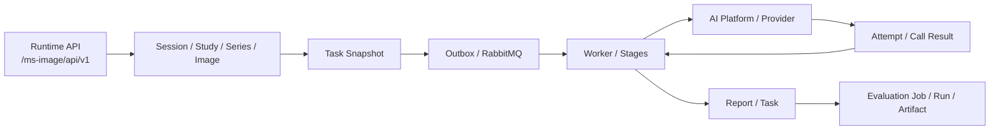

# MS-Image XRay 证据驱动开发指南

> 状态：`CURRENT_DEVELOPMENT_RECOMMENDATION`
>
> 版本：v1.0
>
> 日期：2026-08-27
>
> 适用工作区：`/Users/mozhicheng/workspace/code/cy-code/ms-image`
>
> 适用基线：分支 `codex/prompt-runtime-ai-gateway`，提交 `0a9aca4fb5c213799d70ab738ebc54c3dd7d76b9`，并包含当前工作树中尚未提交的既有修改
>
> 与 27 号文档的关系：本文取代 `27-xray-full-chain-api-and-link-design.md` 的实施建议，不删除 27 号文档，也不把 27 号文档中的 `PROPOSED` 内容当成已批准合同。

---

## 1. 执行结论

### 1.1 最终建议

**不按 27 号文档整体开发，也不重写完整 XRay 链路。**

当前应采用：

```text
保留现有 API 与运行主链
+ 修正内部状态和输出合同
+ 补齐逐图投照位与临床上下文的数据血缘
+ 复用现有 Evaluation Job / Run / Artifact 建立医学基线
+ 只在配对实验有净收益时继续增加 Prompt、模型或专项能力
```

重构级别判定为：

```text
Existing-entry internal modular refactor
保留现有入口的内部模块化重构
```

置信度：`CONFIRMED + INFERRED`。

- `CONFIRMED`：现有主链已经在本地真实通过，重新建设 Session、Study、Image、Task、Outbox、Worker、Attempt、Stage、Report 没有收益依据。
- `CONFIRMED`：当前存在会阻断 Evaluation 的医学状态合同错误，以及投照位、临床上下文、结果 Schema 三个真实缺口。
- `INFERRED`：补齐正确输入与严格结果合同有可能改善模型可见证据和评测可解释性，但在完成 Gold、Scorer 和 Paired A/B 前，不能声称准确率会提高。

### 1.2 现在最应该解决的问题

优先级不是“再加几个接口”，而是下面四件事：

1. 在 Report 持久化边界修复 `produced` 被当成医学状态的问题，先恢复结果合同真实性。
2. 关闭剩余 P1 运行时资格缺口，保证链路可恢复、可部署、凭据生命周期可控。
3. 版本化并收紧 `complete_medical_result`，建立稳定、可评分、可展示的模型输出合同。
4. 让逐图投照位和临床上下文沿 `Image -> Manifest -> Task Snapshot -> Prompt` 完整冻结，再用真实多视图病例重放 E1。

### 1.3 目前不能承诺的结果

以下结论仍必须保持：

```text
FULL_WORKER_RUNTIME_NOT_QUALIFIED
MEDICALLY_VALIDATED=UNKNOWN
MEDICAL_RELEASE=NO-GO
```

主链跑通只能证明工程执行成功，不能证明医学诊断准确，也不能证明 27 号文档中的分割、报告视图、灰度发布或上游编排能够提升医学指标。

---

## 2. 权威、范围与约束

### 2.1 证据权威顺序

| 问题 | 权威来源 |
|---|---|
| 当前允许改什么 | 用户当前指令、`AGENTS.md` |
| 当前系统真实做什么 | 当前工作树源码、配置、数据库与运行证据 |
| 当前状态和未完成项 | `.agent-handoff/snapshot.md`、`.agent-handoff/risks.md`、`.agent-handoff/backlog.md` |
| 当前实施阶段 | `24-current-runtime-audit-and-next-development-guide.md` 与本文 |
| 27 号文档中的新增设计 | 仅为候选建议，必须经本文和源码复核 |
| 医学效果是否改善 | 冻结 Gold、确定性 Scorer、同病例 Paired A/B、隔离 Holdout |

发生冲突时，代码和新鲜运行证据优先于接口清单；明确的项目规则优先于通用架构偏好。

### 2.2 本文允许和禁止的变化

本文授权的是开发顺序和边界建议，不等于自动授权实施。

当前文档阶段：

- 不修改业务代码。
- 不新增或修改数据库表。
- 不生成迁移脚本。
- 不生成独立测试脚本。
- 不删除或回退当前工作树中的既有修改。
- 不把 `vet-platform` 作为目标线上游或复制其旧执行链。

后续实施仍须遵守：

```text
API -> Service -> DalBase CRUD -> Model/DB
```

不新增 Repository、第二套 CRUD 基类、平行数据库服务或重复微服务；资源 ID 不设计为 `/{id}`。

### 2.3 目标指标

当前医学主指标的精确定义为 `UNKNOWN`，因为可信 Gold、Scorer、分母、排除规则和可连接的 Evaluation DB 尚未完成资格化。

M1 前必须由业务/医学负责人批准：

- 病例级主指标及其计算公式；
- `normal / abnormal / review_required / non_diagnostic` 的 Gold 生成和冲突裁决规则；
- Finding 级或病种级指标是否作为主指标或次指标；
- 技术失败、缺失结果、覆盖不足病例是否进入分母；
- 不安全翻转，例如 Gold normal 被预测为 abnormal，如何单独计数；
- development、failure bank、regression、holdout 的病例隔离规则。

在这份合同批准前，本文只优化“可正确执行、可追溯、可评测”，不宣称优化“准确率”。

---

## 3. 当前证据基线

| 维度 | 当前事实 | 状态 | 证据强度 |
|---|---|---|---|
| 本地完整执行链 | API -> OSS -> Outbox -> RabbitMQ -> Worker -> Provider -> Attempt/Call -> Stage -> Report 已真实通过 | `E2E_PASSED` | `CONFIRMED`，`.agent-handoff/snapshot.md` |
| 重复投递、取消、迟到结果 | 已真实或定向资格化 | `PASSED` | `CONFIRMED`，`.agent-handoff/snapshot.md` |
| unknown Attempt 安全停留与 lease 恢复 | 已通过，不盲目发替代请求 | `PASSED` | `CONFIRMED`，`.agent-handoff/snapshot.md` |
| 自动 reconcile 周期触发 | 只有任务注册，未证明生产自动调度 | `NOT QUALIFIED` | `CONFIRMED`，`.agent-handoff/snapshot.md` |
| unknown 持久有界终止 | 缺少可靠的首次 unknown 时间/次数事实 | `NOT IMPLEMENTED` | `CONFIRMED`，`.agent-handoff/risks.md` |
| Runtime/Admin JWT 与 Artifact signing | 生命周期未资格化 | `NOT QUALIFIED` | `CONFIRMED`，`.agent-handoff/snapshot.md` |
| 多图发送 | Provider 前会加载所有冻结 Series 的 ready Images | `IMPLEMENTED` | `CONFIRMED`，`ai_request_service.py:1545-1611` |
| 逐图投照位 | Model 有 `projection`，请求、写入、manifest、snapshot、prompt 均未闭合 | `INCOMPLETE` | `CONFIRMED`，见第 4、6 节 |
| 临床上下文 | Task 请求不接收，Snapshot 不冻结，Prompt 只能读取空回退 | `INCOMPLETE` | `CONFIRMED`，见第 4、6 节 |
| 医学状态 | Stage 写 `produced`，Report/Task 持久化，Evaluation 不接受该值 | `BROKEN CONTRACT` | `CONFIRMED`，见第 4、6 节 |
| 完整医学结果 Schema | 顶层有约束，但 Finding/Coverage/SourceRef 嵌套对象宽松 | `WEAK` | `CONFIRMED`，`complete_medical_result.schema.json:6-16` |
| 医学基线 | 无已批准 Gold、真实 Scorer、Failure Bank 和 Holdout 结果 | `UNKNOWN` | `CONFIRMED` |
| 医学发布 | 无医学放行证据 | `NO-GO` | `CONFIRMED` |

### 3.1 三个状态必须分开报告

| 状态轴 | 回答的问题 | 当前结论 |
|---|---|---|
| `CODE_IMPLEMENTED` | 代码是否存在 | 主链基础存在，本文列出的合同修正尚未实施 |
| `RUNTIME_QUALIFIED` | 真实依赖、失败和恢复是否通过 | 部分通过，完整 P1 未关闭 |
| `MEDICALLY_VALIDATED` | 对冻结病例是否有医学净收益 | `UNKNOWN` |

任何后续开发都不得用单元测试通过替代运行资格，也不得用全链路成功替代医学准确率。

---

## 4. 当前真实链路与问题归属



### 4.1 入口与外部路径

真实部署根路径是：

| 应用 | 外部根路径 | 代码证据 |
|---|---|---|
| Runtime | `/ms-image` | `apps/backend/services/runtime/main.py:27-33` |
| Admin | `/ms-image/admin` | `apps/backend/services/runtime/main.py:35-46` |
| AI Control | `/ms-image/ai-control` | `apps/backend/services/ai_control/main.py:26-33` |
| Evaluation Control | `/ms-image/evaluation-control` | `apps/backend/services/evaluation_control/main.py:26-33` |

各应用再挂载 `/api/v1`。27 号文档只列 `/api/v1`，可作为 ASGI 内部路由理解，但不能作为完整外部调用地址。

### 4.2 多图链已经存在

`AIRequestService._load_attempt_image_inputs()` 会遍历 Snapshot 中所有 Series，查询每个 Series 的 ready Images，重算 manifest，逐张形成发送输入，并验证总图数，见 `apps/backend/services/runtime/service/ai_request_service.py:1545-1611`。

因此当前问题不是“只能发一张图”，而是模型虽然收到多张图，却拿不到稳定的逐图投照位与逐图引用语义。

### 4.3 投照位链在四个边界断开

| 边界 | 当前事实 | 证据 |
|---|---|---|
| API Schema | `ImagePrepareUploadRequest` 没有 projection | `apps/backend/schemas/image.py:129-145` |
| Model | `image_record.projection` 已存在 | `apps/backend/models/image.py:141-145` |
| 写入 | `ImageService` 创建 values 时没有写 projection | `apps/backend/services/runtime/service/image_service.py:386-413` |
| Canonical Manifest | item 不含 projection | `apps/backend/core/imaging/manifest.py:68-109` |
| Task Snapshot | 只冻结 Series 级 id/hash/count | `apps/backend/services/runtime/service/task_service.py:377-399` |
| Prompt Context | `ordered_image_refs` 是 Series 级，`view_positions` 读取空回退 | `apps/backend/services/runtime/stages/xray/prompt_commands.py:143-175` |

`body_part` 和 `acquired_at` 已属于 Study，见 `apps/backend/schemas/study.py:25-39`。在没有“同一 Study 内各图 body part 不同”的真实需求前，不应把它们复制成逐图字段。

### 4.4 临床上下文没有进入冻结事实

- `TaskCreate` 只有 Study、Revision、request、task type、species、trace，见 `apps/backend/schemas/task.py:9-45`。
- `_build_request_snapshot()` 没有 clinical context，见 `apps/backend/services/runtime/service/task_service.py:358-430`。
- Prompt 读取 `clinical_context_allowlist`，但只能得到空对象，见 `apps/backend/services/runtime/stages/xray/prompt_commands.py:171-175`。

这不是新增 Session context 接口的问题。临床上下文应随诊断 Task 一次冻结，避免 Session 和 Task 形成两个竞争真相源。

### 4.5 医学状态合同当前是错误的

真实数据流：

```text
模型 complete_medical_result.medical_status
    = normal | abnormal | review_required | non_diagnostic

JointPrimaryReader / TargetedReview
    medical_status = produced

DecisionFinalization
    原样复制 produced

ReportService
    report.medical_status = produced
    task.ai_medical_status = produced

EvaluationExport
    predicted_status = report.medical_status
```

关键证据：

- `JointPrimaryReader` 写 `produced/not_produced`：`apps/backend/services/runtime/stages/xray/joint_primary_reader.py:47-66`。
- `TargetedReview` 具有同类合同：`apps/backend/services/runtime/stages/xray/targeted_review.py:47-66`。
- `DecisionFinalization` 复制该字段：`apps/backend/services/runtime/stages/common/decision_finalization.py:23-38`。
- `ReportService` 同时写 Report 和 Task：`apps/backend/services/runtime/service/report_service.py:87-120`。
- Evaluation 只接受五个医学值：`apps/backend/schemas/evaluation_execution.py:10-16`。
- Export 直接把 Report 字段作为 predicted status：`apps/backend/services/evaluation_control/service/evaluation_export_service.py:261-269`。

这是当前最明确的业务合同缺陷，必须在 M1 之前修复。

### 4.6 结果 Schema 还不能稳定支撑展示和评分

`complete_medical_result.schema.json` 的 `findings` 和 `source_refs` 只要求元素是 object，`coverage` 也只是 object，没有字段、类型、必填、长度和引用完整性约束，见 `prompts/xray/complete_medical_result.schema.json:6-16`。

这会产生三个后果：

1. 同一语义可能被不同模型写成不同结构，评分器难以稳定消费。
2. Report view 无法可靠投影 Finding 和来源引用。
3. Python 如果为了展示自行概括，将越过“不得生成医学结论”的边界。

---

## 5. 27 号文档逐项判定

| 27 号建议 | 判定 | 原因 | 本文处理 |
|---|---|---|---|
| 修复 `produced` 医学状态 | `ADOPT` | 真实阻断 Evaluation | 作为首个业务合同修正 |
| 补逐图 projection | `ADAPT` | 方向正确，但必须补 provenance、manifest、snapshot、prompt 全链 | 不新增表，不加 Study 派生缓存 |
| Task 增加 clinical context | `ADAPT` | 真实缺口；仅字段白名单不能防 free-text 标签泄漏 | 使用严格嵌套 Schema、长度、来源和评测泄漏政策 |
| `/tasks/page?session_id=` | `DEFER` | 路径选择正确，但不是医学或当前运行阻塞 | M1 后按真实消费者需求实现 |
| `/reports/view?task_id=` | `DEFER` | 有产品价值，但应先稳定结果 Schema | 不携带分割；先定义只读投影 |
| 一步 `/xray/diagnoses` | `REJECT AS WRITTEN` | 客户端 PUT 和异步校验尚未发生时不能返回 Task ID | 仅在消费者合同明确后设计两步计划/提交或可信 ObjectRef 导入 |
| release-state | `DEFER` | 单候选、无 M1/Holdout 时没有发布依据 | M1 及候选 A/B 胜出后再做 |
| fixed-bank 新 API | `REJECT` | 现有 Evaluation Job 已含 fingerprints、split、denominator、manifest | 复用现有 Job/Run/Artifact |
| segmentation 展示 | `REJECT FOR CURRENT SCOPE` | 没有证据表明改善诊断；角色常量不是完整元数据合同 | 不建表、不接入当前报告主路径 |
| `projection_summary_json` | `REJECT` | 复制 Image/Manifest 真相，存在漂移 | Task 创建时冻结 canonical per-image facts |
| `image_segmentation_record` | `REJECT` | 与“派生 Image 零新表”自相矛盾，当前也无消费者 Gate | 证据和产品合同出现后重新立项 |
| 按 27 号一次补齐多个接口 | `REJECT` | 同时改变输入、输出、展示和治理，无法归因 | 按单一不确定性分阶段实施 |

### 5.1 27 号文档的内部不一致

27 号不能直接作为开发权威，主要因为：

1. 第 4.4 节说 prepare-upload 增加 `projection_hint/body_part/study_event_key`，第 5.2 节又只保留 projection。
2. 第 4.5 节把 Task 医学状态写成 `not_produced -> produced`，第 5.10 节又明确 `produced` 不得持久化。
3. 第 5.6 节把一步接口改成两步且暂缓，第 7.2 节仍写一步 `/xray/diagnoses -> task_id`。
4. 第 5.8 节撤销 fixed-bank API，第 7.4 节仍把它写进评测调用序列。
5. 第 11.4 节声称“零新表、零新迁移”，第 12.5 节又要求新增 Study 列和 segmentation 表。
6. 第 11.5 节选择“派生 Image、不建表”，第 12.3 节又建议 `image_segmentation_record`。
7. Evaluation cancel 实际是 `POST /evaluation/jobs/cancel`，不是 GET，见 `apps/backend/services/evaluation_control/api/api_v1/endpoints/evaluation.py:126-137`。

这些问题不是文字瑕疵，而会导致开发顺序、数据库范围和接口合同在实施时互相冲突。

---

## 6. 重构级别决策

### 6.1 方案比较

| 维度 | 局部修补 | 保留入口的内部模块化重构 | 完整重写 |
|---|---|---|---|
| 修复状态合同 | `Strong` | `Strong` | `Strong`，但代价过高 |
| 补齐跨层 projection/context | `Weak`，涉及多个边界 | `Strong` | `Moderate` |
| 保留已通过主链 | `Strong` | `Strong` | `Weak` |
| 单变量验证 | `Moderate` | `Strong` | `Weak` |
| 避免重复真相源 | `Moderate` | `Strong` | `Unknown` |
| 兼容未完成 Task 和冻结 Config | `Strong` | `Strong` | `Weak` |
| 回滚成本 | `Low` | `Low/Moderate` | `High` |
| 医学收益证据 | `Unknown` | `Unknown，可逐步产生` | `Unknown` |

### 6.2 决策

```text
Decision: existing-entry internal modular refactor
Confidence: Direct for engineering fit; Unknown for medical gain
```

为什么不是只做局部修补：状态错误可以局部修，但 projection 和 clinical context 横跨 Schema、Service、Manifest、Snapshot、Prompt、Evaluation 血缘，单文件补丁会继续留下断点。

为什么不是完整重写：当前已有单一入口、稳定分层、冻结 Snapshot、可靠 Outbox/Worker、Attempt/Call 分离和不可变 Report；主链也已真实通过。没有三条独立边界反复失败、没有不可兼容数据合同、没有 shadow migration/rollback 方案，也没有候选链在最小实验中胜出，重写条件不成立。

### 6.3 必须保留的合同

- Runtime、Admin、AI Control、Evaluation Control 四个现有应用入口。
- Session -> Study -> Series -> Image -> Task 的现有资源模型。
- OSS 直传和异步校验/finalize 流程。
- Task Snapshot、Outbox、Stage lease/CAS、Logical Call/Physical Attempt。
- 不可变 final Report 和现有 Evaluation Job/Run/Artifact。
- v1 冻结 Task/Config 的重放兼容；新合同使用版本号，不原地解释旧快照。

---

## 7. 目标内部架构

### 7.1 目标数据流

```mermaid
flowchart LR
    U["Caller-declared facts"]
    I["Image\nprojection + provenance"]
    M["Canonical per-image manifest"]
    T["Task Snapshot\nimages + clinical_context"]
    P["Versioned Prompt input"]
    L["LLM / Provider"]
    C["CompleteMedicalResult v2"]
    F["DecisionFinalization\nselect + validate only"]
    R["Report / Task\nmedical_status"]
    E["Existing Evaluation Plane"]

    U --> I --> M --> T --> P --> L --> C --> F --> R --> E
```



### 7.2 状态所有权

必须把三种状态分开：

| 状态 | 候选值 | Owner | 是否医学判断 |
|---|---|---|---|
| `result_availability` | `produced / not_produced` | Stage/执行链 | 否 |
| `medical_status` | `normal / abnormal / review_required / non_diagnostic / not_produced` | 模型完整结果；无结果时由执行链写 `not_produced` | 是，除 `not_produced` |
| `technical_status` | `completed / technical_failure / missing / over_budget / partial_sent / provider_unknown / schema_invalid` | Evaluation 投影 | 否 |

首版不新增数据库字段，也不直接改写已经冻结的 v1 Stage handler 语义：

- v1 Stage output 中的 `medical_status=produced/not_produced` 被明确视为遗留的 availability 标记，不能直接写入 Report/Task 医学字段。
- `ImagingExecutionService -> ReportService` 持久化边界建立唯一规范化器：有完整结果时，只从 `complete_medical_result.medical_status` 取医学值并校验 allowlist；无完整结果时写 `not_produced`。
- 持久化 `content_json` 时同时形成明确的 `result_availability`，不得保留一个会和顶层真实 `medical_status` 冲突的 `produced` 医学字段。
- ReportService 做第二层 fail-closed 校验，禁止 `produced` 或任意未知值进入 Report/Task。
- `provider_called` 继续表示网络事实，不从医学状态推断。
- CompleteMedicalResult v2 再正式把 Stage 间 availability 字段版本化为 `result_availability`；旧 v1 Task 仍可由上述边界规范化器安全完成。

Python 不得根据 Findings 自行判断 medical status，也不得为了兼容旧错误值把 `produced` 猜成 normal/abnormal。

### 7.3 Canonical per-image facts

每张 ready Image 的唯一事实最小集合：

```json
{
  "image_id": "opaque-id",
  "series_id": "opaque-id",
  "sequence_no": 1,
  "projection": "LAT",
  "projection_provenance": {
    "source": "caller_declared",
    "schema_version": "xray-projection.v1"
  },
  "sha256": "...",
  "size_bytes": 123456,
  "content_type": "image/jpeg",
  "storage_profile": "...",
  "object_key": "...",
  "object_version_id": null
}
```

规则：

- `projection` 是逐图事实；`body_part`、`acquired_at` 继续由 Study 持有。
- API 初始只接受受控 code 集合；未知允许显式 `UNKNOWN`，不允许默默猜测。
- 请求字段统一命名为 `projection`，避免 `projection_hint` 和 Model 字段形成第二套词汇；新 XRay diagnose 输入必须显式传受控 code 或 `UNKNOWN`。
- `projection_provenance` 必须说明 caller-declared，不能把未经资格化的 AI 推断伪装成拍片端事实。首版由 Service 写入 `technical_metadata_json` 的保留命名空间，调用方不得覆盖该保留键；Manifest/Snapshot 冻结该来源。
- Image/Manifest 是真相源；Task Snapshot 冻结提交时版本，不增加 `projection_summary_json`。
- Prompt 的 `ordered_image_refs` 必须逐图，并与真正发送顺序一致。

### 7.4 Clinical context v1

建议的首版请求合同：

```json
{
  "clinical_context": {
    "schema_version": "xray-clinical-context.v1",
    "source": "requester_supplied",
    "chief_complaint": "可选，限制长度",
    "study_reason": "可选，限制长度",
    "clinical_signs": ["可选，限制数量和单项长度"]
  }
}
```

规则：

- `extra=forbid`，字段、数组数量、单字段长度和总序列化大小都要有上限。
- 不接受 Gold label、dataset class、ABN/NOR、评分结果等评测专用字段。
- 不把上下文复制到 Session 或 Image 表；随 Task Snapshot 冻结。
- 普通自由文本可能合法包含既往诊断，所以简单关键词过滤不能证明无标签泄漏。
- Evaluation 数据集必须单独审计上下文来源，证明上下文在目标诊断时点可获得，且不是由 Gold 或未来报告生成。

### 7.5 CompleteMedicalResult v2

新 Schema 必须版本化，不原地改变旧 Config 的冻结含义。最低要求：

| 对象 | 必须约束的字段 |
|---|---|
| Result | `schema_version`、`medical_status`、`summary/impression`、findings、coverage、limitations、review_reason、source_refs |
| Finding | 稳定 `finding_id`、解剖位置、观察描述、严重度/置信表达候选、对应 `source_ref_ids` |
| Coverage | 可评估区域、未评估区域、技术限制、逐图覆盖引用 |
| SourceRef | 稳定 ref id、image id、series id、projection、可选区域定位 |

约束：

- 嵌套 object 均 `additionalProperties=false`。
- 字符串、数组长度和唯一性有上限。
- Finding 引用的 source ref 必须存在。
- `summary/impression` 必须由模型在同一受约束输出中生成。
- Python renderer 只允许投影、排序、格式化和权限过滤，不得概括或补写医学结论。
- 旧 v1 Task 继续按冻结 Schema 重放；v2 通过新 Prompt/Config version 启用。

### 7.6 Evaluation 复用

现有 `EvaluationJobCreate` 已冻结 dataset、gold、scorer、experiment fingerprints、case split、denominator 和 input manifest，见 `apps/backend/schemas/evaluation.py:49-59`。

因此固定病例库是一个版本化 Dataset Artifact，不是第二套 HTTP API。目标链为：

```text
Frozen Dataset/Gold/Scorer Artifacts
-> existing Evaluation Job
-> existing Evaluation Run
-> existing Evaluation Artifact
-> paired comparison and approval evidence
```

---

## 8. 失败到改动的因果矩阵

| 证据支持的问题 | 精确边界 | 改动 | 可能改善指标的机制 | 护栏 | 最小验证 | 停止/回滚 | 状态 |
|---|---|---|---|---|---|---|---|
| 自动 reconcile 未资格化 | Worker 调度 | 接入真实周期触发并证明崩溃后自动恢复 | 改善工程恢复率，不直接改善医学准确率 | 不并发重复 claim，不盲发 | 人为制造 due unknown，等待自动触发 | 重复发送、无界并发即停用 schedule | `PROPOSED` |
| `produced` 污染医学状态 | Stage -> Finalization -> Report -> Evaluation | 分离 availability 与 medical status | 让分母、预测状态和错误分类可计算 | Python 不改判 | normal/abnormal/review/non-diagnostic/无结果逐类合同验证 | 出现非法新值或错投影即停止 diagnose，并修复 C1 部署单元 | `CONFIRMED PROBLEM` |
| 投照位未进入 Prompt | Image -> Manifest -> Snapshot -> Prompt | 冻结逐图 projection + provenance | 模型可把具体视图与证据对应，可能减少单视图误读 | 图片顺序/hash 不漂移 | 一例真实 LAT+VD/DV 同病例 E1 | manifest、发送顺序、Prompt refs 任一不一致即停 | `CONFIRMED PROBLEM` |
| 临床上下文为空 | Task API -> Snapshot -> Prompt | 严格 context v1 | 合法病史可能改善鉴别语境 | 防长度滥用和评测标签泄漏 | 同一病例有/无 context 的单变量 A/B | 上下文来自 Gold/未来报告则整轮作废 | `CONFIRMED PROBLEM` |
| Result 嵌套结构宽松 | Prompt Schema -> Report -> Scorer | CompleteMedicalResult v2 | 减少 Schema 漂移和不可评分行；不必然提升医学判断 | Schema failure rate、missing row | v1/v2 零行为预检 + 结构回归 | 技术失败率上升或旧 Task 不能重放即停 | `CONFIRMED PROBLEM` |
| 医学水平未知 | Evaluation | 建 Gold/Scorer/M1 | 首次得到可解释基线 | 标签冲突、缺失行、unsafe flips | 固定 development set 的 M1 | Gold 审计失败则不计算准确率 | `UNKNOWN METRIC` |
| 报告不够易读 | Report projection | M1 后新增 read model | 改善产品可读性，不改善医学准确率 | 不改写模型结果 | 字段逐字投影与权限验证 | renderer 产生新医学文本即回滚 | `DEFERRED` |
| 分割想“展示能力” | 产品展示 | 当前不做 | 没有已证实的诊断或产品指标机制 | 不污染 Prompt/Report | 先定义消费者与独立指标 | 无消费者/无指标则不立项 | `REJECTED NOW` |

---

## 9. 分阶段开发顺序

每一阶段只消除一个主要不确定性。进入下一阶段前，必须记录 `CODE_IMPLEMENTED / RUNTIME_QUALIFIED / MEDICALLY_VALIDATED` 三轴结论。

### C1：结果可用性与医学状态合同修正

- 事实状态：`CONFIRMED PROBLEM`。
- 目的：先让 Report、Task、Evaluation 表达同一医学事实，同时保持冻结 v1 Stage 可重放。
- 精确 write set：
  - `apps/backend/services/runtime/service/imaging_execution_service.py`
  - `apps/backend/services/runtime/service/report_service.py`
  - 更新现有 `apps/backend/tests/test_ai_gateway_attempt_contracts.py` 中相关合同，不创建独立测试脚本
- 表/字段/迁移：无 Schema 迁移；存量非法 `produced` 数据需先盘点，数据修正必须另行授权。
- 处理合同：持久化边界从嵌套完整结果投影受控医学状态；同时写明确 availability；ReportService 拒绝任何非法医学值。
- 工程 Gate：所有新 Report/Task medical status 只属于受控集合；无结果明确为 `not_produced`；Evaluation Export 可构造输入；冻结 v1 Task 可继续完成。
- 医学 Gate：不判断预测是否正确，只验证模型值被原样投影。
- Stop：任何 Python 逻辑从 Findings 猜 medical status，或把旧 `produced` 静默映射为某个诊断值。
- 回滚单位：C1 部署单元；发生异常时应禁用 diagnose Profile，不能回退到继续持久化已知非法值。
- 非目标：不改 Prompt 内容、不换模型、不新增报告 view、不在本切片重写 Stage handler 版本。

### P1-A：自动 reconcile 调度资格化

- 事实状态：`CONFIRMED GAP`。
- 目的：证明 unknown Attempt 无需人工 `run_once()` 也能被周期恢复。
- 建议 write set：`apps/backend/workers/imaging_worker/celery_app.py`、现有实际部署/本地进程定义；仅当调度合同需要时调整 `ai_attempt_reconcile.py`。
- 表/字段/迁移：不需要。
- 工程 Gate：自动触发、单次 claim、lease 到期恢复、无重复 Provider POST。
- 医学 Gate：`N/A`。
- Stop：重复 Attempt、重复计费、schedule 重叠或凭据泄露。
- 非目标：不同时引入 Retry/Fallback/Race。

### P1-B：unsupported unknown 持久有界终止

- 事实状态：`CONFIRMED GAP / AUTHORIZATION REQUIRED`。
- 目的：防止 provider 不支持 lookup 时永久重排。
- 候选最小事实：`first_unknown_at`、`reconcile_count`，或等价可持久恢复的事实；上限必须配置版本化。
- 建议 write set：Attempt Model/Schema/DAL、现有 reconcile Service/Worker、正式 Alembic 迁移。
- 表/字段/迁移：需要，必须单独取得用户授权；本轮不实施。
- 工程 Gate：进程重启后次数不丢失，达到上限确定性终止，原幂等 identity 不变。
- Stop：无法区分“未查询”和“已确认失败”，或需要盲发替代请求。
- 非目标：不把医学输出内容作为终止/重试条件。

### P1-C：JWT 与 Artifact signing 生命周期

- 事实状态：`CONFIRMED GAP`。
- 目的：使 Runtime/Admin 鉴权和 Evaluation Artifact 可在目标部署中安全使用。
- write set：必须在实施前根据真实 Secret 管理和部署方式单独冻结；不能只改 `.env` 示例就宣称通过。
- 表/字段/迁移：默认不需要；若密钥版本审计需要持久化，另行授权。
- 工程 Gate：issuer/audience/scope、rotation、旧 key grace、撤销、最小权限签名、过期行为真实通过。
- 医学 Gate：`N/A`。
- Stop：密钥进入 DB/Nacos/Snapshot/日志，或旧 token 无限有效。

### C2：CompleteMedicalResult v2

- 事实状态：`CONFIRMED STRUCTURE GAP`。
- 目的：建立稳定的模型结果、评分和展示边界。
- 精确 write set：
  - 保留 `prompts/xray/complete_medical_result.schema.json` 作为 v1，新增明确版本名的 v2 Schema 文件/发布物
  - 对应版本化 Primary Prompt package
  - `apps/backend/core/pipeline.py` 与 `apps/backend/services/runtime/stages/registry.py` 中必要的 v2 handler/profile 注册，v1 注册不得删除
  - 现有 Config 编译/导入合同中必要的 Schema/handler version 校验
  - 更新现有 Prompt/Config 合同测试，不创建独立测试脚本
- 表/字段/迁移：不需要。
- 工程 Gate：Schema 正反例、旧 v1 重放、新 v2 冻结 hash、Finding/SourceRef 引用完整性。
- 医学 Gate：`N/A`，Schema 更严格不等于更准确。
- Stop：Provider 结构失败率明显上升、旧 Task 无法重放或 summary 由 Python 生成。
- 非目标：不同时调整模型、图片选择、Targeted 或重试。

### D1：逐图 projection 数据链

- 事实状态：`CONFIRMED GAP`。
- 目的：让模型收到的每张图和投照位、顺序、hash 形成同一冻结血缘。
- 精确 write set：
  - `apps/backend/schemas/image.py`
  - `apps/backend/services/runtime/service/image_service.py`
  - `apps/backend/core/imaging/manifest.py`
  - `apps/backend/services/runtime/service/task_service.py`
  - `apps/backend/services/runtime/stages/xray/prompt_commands.py`
  - 必要时只扩展现有 `ImageDal` 查询，数据库访问仍经 `DalBase`
  - 更新现有相关测试，不创建独立测试脚本
- 表/字段/迁移：不需要，复用 `image_record.projection` 与现有 JSON/Snapshot。
- 工程 Gate：prepare 写入、ready manifest hash 包含 projection、Task Snapshot 逐图冻结、Prompt refs 与 Provider 发送顺序一一对应。
- 医学 Gate：先只证明 E1 输入正确；准确率变化留给后续单变量实验。
- Stop：同一 Image 在 Manifest、Snapshot、Prompt 出现不同 projection/hash/order。
- 非目标：不加 `projection_summary_json`，不做 AI 体位识别，不复制 Study body part/date。

### D2：Task clinical context v1

- 事实状态：`CONFIRMED GAP`。
- 目的：让合法、诊断时点可获得的上下文稳定进入 Prompt。
- 精确 write set：
  - `apps/backend/schemas/task.py`
  - `apps/backend/services/runtime/service/task_service.py`
  - `apps/backend/services/runtime/stages/xray/prompt_commands.py`
  - 更新现有相关测试，不创建独立测试脚本
- 表/字段/迁移：不需要，只冻结进 `request_snapshot_json`。
- 工程 Gate：extra forbid、长度/数量/总大小限制、request hash 包含 context、幂等冲突可检测、Prompt 原样消费。
- 医学 Gate：Evaluation 病例必须有上下文来源与时点审计，禁止 Gold/未来报告泄漏。
- Stop：上下文来源不可证明，或同一实验 arm 的上下文不一致。
- 非目标：不新增 `/sessions/context`，不新增 Session/Image context 字段。

### E1-MV：真实多视图工程重放

- 事实状态：`PROPOSED VALIDATION`。
- 目的：证明 D1/D2 后真实多视图病例能从上传走到 Report，且血缘不漂移。
- 写入：原则上不增加产品代码；使用现有主链和既有验证方式。
- 表/字段/迁移：不需要。
- 工程 Gate：至少一例同 Study 的真实两视图，Snapshot、Prompt、Provider image receipt/attempt、Report trace 可对齐；重复投递和取消语义不回退。
- 医学 Gate：`N/A`，该病例输出不能作为准确率证明。
- Stop：缺图、顺序漂移、projection 错配、hash 不一致、Provider 实际少收图。
- 非目标：不在这一步优化 Prompt 或切换模型。

### M1：Primary 医学基线

- 事实状态：`UNKNOWN / REQUIRED`。
- 目的：得到当前 Primary-only 的真实医学水平和失败归因。
- write set：优先复用现有 Evaluation Schema/Service/CRUD；只补真实 Gold、Scorer、Evaluation DB 和 Artifact 合同的必要缺口。
- 表/字段/迁移：Evaluation DB 是否创建/修复需单独确认；不新建 fixed-bank API。
- 工程 Gate：dataset/gold/scorer/experiment fingerprints 全冻结；病例无缺失行；技术失败与医学错误分开。
- 医学 Gate：标签审计、分母合同、逐病例差异、unsafe flips、置信区间和 Failure Bank 完整。
- Stop：Gold 冲突、图像 hash 不一致、上下文泄漏、缺失行被排除后才计算指标。
- 非目标：不做 Holdout 调参，不启用 Targeted。

### Q3/Q4：单变量 Prompt A/B，再做 Model A/B

- 事实状态：`DEFERRED UNTIL M1`。
- 顺序：先固定模型只改一份 Prompt，再固定胜出 Prompt 只改模型。
- 工程 Gate：相同病例、图片、上下文、Schema、预算、Scorer 和 schedule；requested/actual model 均留痕。
- 医学 Gate：预先声明主指标、护栏、unsafe flips 和 No-Go 门槛；先 Failure Bank，再 regression，最后 isolated Holdout。
- Stop：变量不单一、结构失败上升、正常误报恶化、收益只来自缺失行处理方式变化。
- 非目标：不同时打开 Retry/Fallback/Race/Targeted。

### P2：真实产品需求出现后再补查询和接入

只有消费者合同明确后才实施：

1. `GET /tasks/page?session_id=`：`API -> TaskService -> TaskDal`，通过 Study/Session 关系查询，首版不新增 `task.session_id`。
2. `GET /reports/view?task_id=`：只投影 CompleteMedicalResult v2，返回模型生成 summary/impression；不含 segmentation。
3. 上游简化接入：
   - signed URL 模式采用 `diagnosis-plans -> client PUT/complete -> diagnosis-commits`；或
   - 可信 ObjectRef 异步导入，先返回 intake/job id。

远程 URL import 若被提出，必须另行处理 SSRF、域名 allowlist、重定向、流式大小限制、超时、内容类型、对象所有权和审计，不得把任意 URL 直接交给服务端下载。

---

## 10. 验证与实验合同

### 10.1 每次运行必须冻结的指纹

- dataset、gold、scorer、experiment fingerprint；
- case split 和 denominator contract；
- Study manifest、逐图 hash、projection、顺序；
- clinical context payload hash 和来源策略版本；
- Config、Profile、Prompt、Schema、requested/actual model；
- connection、schedule、预算与 deadline；
- 代码 revision 和运行环境标识。

### 10.2 Paired A/B 的最低条件

```text
同病例
+ 同图片 bytes/hash/order/projection
+ 同 clinical context
+ 同 Gold/Scorer/分母
+ 同 Schema（除非 Schema 本身是唯一变量）
+ 同模型（Prompt A/B）或同 Prompt（Model A/B）
= 可解释比较
```

不满足时必须标记为 `multi-variable` 或 `not interpretable`，不得汇总成“候选更准”。

### 10.3 缺失和技术失败政策

- 技术失败、schema invalid、provider unknown、缺失行不能被静默排除。
- `not_produced` 不是医学阴性，也不是 `normal`。
- 每个 arm 必须报告 missing rows、技术失败率、成本和延迟。
- 医学指标必须同时报告总体和 normal/abnormal/review/non-diagnostic 分层。
- unsafe flips 单独列出，不能被平均指标掩盖。

### 10.4 开发集、回归集与 Holdout

- development/failure bank 可用于诊断和迭代。
- regression 用于防止已知能力回退。
- isolated holdout 只能在候选冻结后运行，不能查看结果后继续修改候选再重复宣称同一 Holdout。
- rollout 是上线治理，不是实验成功证据。

---

## 11. API 设计结论

### 11.1 当前保留的外部调用链

```text
POST /ms-image/api/v1/sessions
POST /ms-image/api/v1/studies
POST /ms-image/api/v1/series
POST /ms-image/api/v1/images/prepare-upload
客户端 PUT OSS
POST /ms-image/api/v1/images/complete-upload
POST /ms-image/api/v1/studies/finalize
POST /ms-image/api/v1/tasks
GET  /ms-image/api/v1/tasks?id=...
GET  /ms-image/api/v1/reports/history?task_id=...
```

控制面和评测面必须带各自 root path，不能都写成裸 `/api/v1`。

### 11.2 当前不新增的 API

- 不新增 `/sessions/context`。
- 不新增 fixed-bank validation API。
- 不新增 segmentation API。
- 不新增 release-state API。
- 不新增一步式 `/xray/diagnoses`。
- 暂不新增 task page 和 report view，直到有真实调用方与稳定 v2 result contract。

### 11.3 后续接口规则

- 单对象继续使用 `GenericResponse[T]`。
- 分页继续使用 `PagedResponse[T]` 和 `/page` 路径。
- ID 放 query 或 request body，不使用 `/{id}`。
- Endpoint 只做校验、依赖注入、Service 调用和统一响应。
- 多实体查询/编排由现有 Service 完成，实体查询封装进对应 DalBase DAL。

---

## 12. 风险、回滚与明确非目标

| 风险 | 预防 | 检测 | 停止条件 | 回滚单位 |
|---|---|---|---|---|
| 旧 Task/Config 失去可重放性 | v1/v2 合同并存 | 旧冻结 Task replay | 任一旧快照被新语义解释失败 | 新 Config/handler version |
| projection 被错误标注 | 记录 provenance，不做隐式 AI 猜测 | manifest/snapshot/prompt 对账 | 来源不明或顺序错配 | D1 合同版本 |
| clinical context 标签泄漏 | 来源/时点审计，评测策略隔离 | Gold-context 关联审计 | context 来自 Gold/未来报告 | 整次实验作废 |
| Schema 收紧导致 Provider 失败 | 先零行为预检和开发集 | schema failure rate | 相比 control 显著上升 | v2 Config 退回 v1 |
| Python 越权生成医学文本 | Renderer 只投影 | 字段 lineage 对账 | 出现模型结果外的新医学结论 | Report view 关闭 |
| 新接口形成第二真相源 | 复用现有入口和实体 | 数据 owner 审查 | Session/Image/Task 同事实冲突 | 不发布新接口 |
| 工程成功被误报为医学成功 | 三轴状态报告 | closeout 审查 | 无 Gold 却声明准确率 | 撤销声明/保持 NO-GO |

当前明确非目标：

- segmentation 表、分割执行链或分割报告展示；
- AI 自动体位识别；
- TargetedReview/FamilyRouting 启用；
- Retry、Fallback、Race；
- release-state；
- 任意远程 URL 下载；
- 新 Repository、数据库服务、平行 Evaluation API；
- 为了“看起来完整”而新增表或接口。
- **人工复核工作流（2026-08-27 用户决策）**：`review_required` 当前作为可发布终态原样暴露，不建设 review queue 表/接口/后台。待产品侧出现真实人工复核需求时，另行立项并单独授权。
- **报告通知/回调（2026-08-27 用户决策）**：不做 webhook/队列通知，上游按 `GET /tasks?id=` / `GET /reports/history?task_id=` 轮询即可；速度优先。

---

## 13. 决策请求与剩余 UNKNOWN

| UNKNOWN | 需要什么证据解决 | 何时决定 |
|---|---|---|
| 生产周期调度的真实承载方式 | 部署进程/编排合同，是否使用 Celery Beat 或外部 scheduler | P1-A 开始前 |
| unknown 有界终止上限 | Provider SLA、最大等待时间、最大对账次数、字段授权 | P1-B 开始前 |
| JWT/Artifact key 管理系统 | 目标环境 Secret manager、rotation 和审计合同 | P1-C 开始前 |
| 医学主指标和分母 | 医学负责人批准的 Gold/Scorer/denominator | M1 开始前 |
| projection 允许值和来源 | 实际拍片端 payload 样本、DICOM/上游字典 | D1 开始前 |
| clinical context 首版字段 | 真实调用方 payload 和医学/隐私审查 | D2 开始前 |
| Task page/report view 消费者 | 前端或上游调用合同、权限和分页需求 | P2 开始前 |
| 是否需要简化上传编排 | 调用方是否能使用 signed URL 与 complete/finalize | P2 开始前 |

### 13.1 建议立即批准的最小开发切片

下一次代码实施建议只批准一个切片：

```text
C1：结果可用性与医学状态合同修正
```

理由：它是已确认的错误，改动边界小，不需要新表/字段/迁移，不改变 Prompt 或模型，是 M1 前最明确且最容易验证的前置修复。

P1 剩余资格化应继续推进，但要按 P1-A/P1-B/P1-C 分开，不要和 C1、projection、clinical context 打包成一次不可归因的大改。

### 13.2 本文完成定义

只有满足以下条件，才可以进入“Prompt 或模型优化”阶段：

```text
P1 运行时剩余项有明确资格结论
+ C1 医学状态合同正确
+ C2 结果 Schema 可稳定评分
+ D1/D2 输入血缘闭合
+ E1-MV 真实多视图工程重放通过
+ M1 Gold/Scorer/分母基线成立
= 可以开始单变量医学优化
```

在此之前，继续增加接口、分割、专项节点或多 Provider 只会增加工程体量，不会产生可证明的医学改进。
