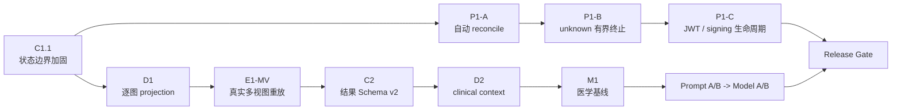

# MS-Image XRay C1 后续开发实施指南

> 状态：`CURRENT_POST_C1_DEVELOPMENT_GUIDE`
>
> 版本：v1.0
>
> 日期：2026-08-27
>
> 适用工作区：`/Users/mozhicheng/workspace/code/cy-code/ms-image`
>
> 适用基线：分支 `codex/prompt-runtime-ai-gateway`，提交 `0a9aca4fb5c213799d70ab738ebc54c3dd7d76b9`，以及当前工作树中已经存在但尚未提交的修改
>
> 文档关系：27 号保留候选设计背景；28 号保留 C1 实施前的证据驱动裁决；本文从 C1 已实施的事实继续，作为当前开发顺序、合同和验收门禁。

---

## 1. 执行结论

### 1.1 对 DeepSeek 本轮结论的最终判定

DeepSeek 的核心结论成立，但“C1 完成并真实验证通过”只能解释为：

```text
C1 happy-path code implemented
+ real happy-path E2E passed
!= C1 boundary fully hardened
!= Full Worker Runtime qualified
!= medical accuracy validated
```

逐项判定如下：

| DeepSeek 结论 | 判定 | 本文修正 |
|---|---|---|
| 新 Task/Report 不再持久化 `produced` | `CONFIRMED` | 当前真实 E2E 已得到 `review_required` |
| v1 Stage 内部仍保留 `produced` | `CONFIRMED` | 这是正确的重放兼容边界 |
| `ReportService.finalize()` 拒绝非法入参 | `CONFIRMED` | 只校验列入参，尚未校验 content 与列一致 |
| 全量测试 `94 passed, 22 warnings` | `CONFIRMED` | 已独立复跑；但没有直接覆盖 C1 异常组合 |
| Provider 坏 JSON 证明 C1 fail-closed | `OVERSTATED` | 坏 JSON 在更早的 Provider/Schema 边界失败，不直接证明 C1 投影器正确 |
| C1 已完全闭环 | `PARTIAL` | happy-path 完成；还需要 C1.1 边界加固 |
| 下一步直接做 P1-A | `ADAPT` | 先完成很小的 C1.1，再做 P1-A；P1-A 不能只加 Beat 配置 |
| P1-A 无授权且当天可闭环 | `OVERSTATED` | 无表迁移，但仍需调度器所有权、部署进程、队列路由和真实自动触发验收 |

### 1.2 本文采用的总体方案

不重写现有主链，也不按 27 号文档一次性增加接口和表。当前采用两条受控开发路线：



两条路线可以在等待外部授权时交错推进，但不能混淆完成状态：

- 运行时路线回答“系统能否自动、可靠、安全地持续运行”。
- 医学证据路线回答“输入、输出和评测是否真实、可追溯、可比较”。
- 两条路线都完成以前，统一结论仍是 `MEDICAL_RELEASE=NO-GO`。

### 1.3 推荐的开发顺序

默认顺序：

```text
1. C1.1 医学状态持久化边界加固
2. P1-A 自动 reconcile 调度与真实资格化
3. P1-B unsupported unknown 持久有界终止（需字段/迁移授权）
4. P1-C Runtime/Admin JWT 与 Artifact signing 生命周期
5. D1 逐图 projection + provenance 全链
6. E1-MV 真实两视图工程重放
7. C2 CompleteMedicalResult v2
8. D2 clinical context v1 + 泄漏审计
9. M1 Primary 医学基线
10. 单变量 Prompt A/B，再做 Model A/B
11. P2 轮询易用性、Task page、Report view、可选 segmentation 和两步 intake
```

若 P1-B 或 P1-C 正在等待用户/部署环境决定，可以先推进 D1，但不得跳过 P1 Gate 宣称运行时已资格化。

---

## 2. 权威、范围与实施约束

### 2.1 证据权威顺序

| 问题 | 权威来源 |
|---|---|
| 当前允许改什么 | 用户当前授权、`AGENTS.md` |
| 代码当前真实做什么 | 当前工作树源码与配置 |
| 已经真实跑过什么 | `.agent-handoff/validation.md` 中可定位的运行记录 |
| 当前开发基线和风险 | 本文、`.agent-handoff/snapshot.md`、`risks.md`、`backlog.md` |
| 27/28 号中的候选设计 | 背景证据；与当前代码冲突时不能覆盖当前事实 |
| 医学效果是否改善 | 冻结 Gold、确定性 Scorer、Paired A/B、隔离 Holdout |

### 2.2 四个应用边界必须分开

当前不是一个裸 `/api/v1` 应用，而是四个独立入口：

| 应用 | 外部 root path | 责任 |
|---|---|---|
| Runtime | `/ms-image` | Session/Study/Image/Task/Report 在线链 |
| Admin | `/ms-image/admin` | 管理操作与报告发布 |
| AI Control | `/ms-image/ai-control` | Connection/Prompt/Config 控制面 |
| Evaluation Control | `/ms-image/evaluation-control` | Job/Run/Artifact/Export 评测面 |

每个应用内部再挂 `/api/v1`。实现、文档、调用样例和鉴权配置不得把四个 root path 合并为同一地址。

### 2.3 分层和数据库约束

所有业务实现继续遵守：

```text
API -> Service -> DalBase CRUD -> Model/DB
```

- Endpoint 只做 Schema 校验、依赖注入、鉴权、Service 调用和统一响应包装。
- 多实体编排只能放在现有 `apps/backend/services/runtime/service/` 或对应 Control Plane Service。
- 所有数据库访问通过继承 `apps.backend.core.crud.DalBase` 的现有实体 DAL。
- 不新建 Repository、第二套 CRUDBase、DatabaseService 或平行微服务。
- ID 放 query 或 request body，不使用 `/{id}`。
- 新表如果以后获批：独立 opaque `VARCHAR(64)` 主键、不设 foreign key、不用数据库 enum、状态/类型用 string 并写中文注释。

### 2.4 本文授权边界

本文是开发设计和验收合同，不自动授权业务代码、表结构、迁移或存量数据修正。

当前明确：

- 不生成独立测试脚本；后续代码切片只更新现有测试文件。
- P1-B 的字段和迁移必须单独获得用户授权。
- 存量 `task_record/report_record.medical_status=produced` 不在本文中修正。
- 不修改冻结 v1 Stage handler 的 `produced/not_produced` 语义。
- 不把工程链路成功描述为医学准确或医学放行。

---

## 3. 当前已验证基线

### 3.1 C1 已完成的事实

当前实现位于：

- `apps/backend/services/runtime/service/imaging_execution_service.py`
- `apps/backend/services/runtime/service/report_service.py`

当前 happy-path 行为：

```text
DecisionFinalization v1 output.medical_status = produced
DecisionFinalization v1 output.complete_medical_result.medical_status = review_required
        |
        v
ImagingExecutionService persistence projection
        |
        +-> Task.ai_medical_status = review_required
        +-> Report.medical_status = review_required
        +-> Report.content_json.medical_status = review_required

Stage.output_json.medical_status = produced  # 保持 v1 冻结语义
```

真实 E2E 新 Task `f125fb933401403b89b7e1cd954c4f31` 已记录三层持久化值均为 `review_required`。当前工作树全量后端测试也已独立复跑：

```text
94 passed, 22 warnings
```

warning 是已有 Pydantic 和 `datetime.utcnow()` 弃用告警，不是本次 C1 新失败。

### 3.2 C1 尚未覆盖的异常合同

当前 `_project_medical_status()` 的实际逻辑是：只要嵌套结果里找到五值集合中的任一值就返回，否则统一返回 `not_produced`。

这会把以下合同损坏静默伪装成“没有结果”：

| Stage availability | 嵌套完整结果 | 当前行为 | 正确行为 |
|---|---|---|---|
| `produced` | 缺失 | `not_produced` 并继续完成 | 工程失败，拒绝生成 final Report |
| `produced` | 非 object | `not_produced` 并继续完成 | 工程失败 |
| `produced` | medical status 未知 | `not_produced` 并继续完成 | 工程失败 |
| `produced` | medical status=`not_produced` | 接受 | 工程失败；模型 Schema 不允许该值 |
| `not_produced` | 存在合法完整结果 | 接受嵌套医学值 | 工程失败；availability 与 payload 冲突 |
| 未知 availability | 存在合法完整结果 | 接受嵌套医学值 | 工程失败；遗留合同损坏 |

另外两个缺口：

1. 五值持久化集合在多个模块重复定义，后续会漂移。
2. `ReportService.finalize()` 不验证 `medical_status == content["medical_status"]`。

### 3.3 当前三轴状态

| 状态轴 | 当前结论 | 说明 |
|---|---|---|
| `CODE_IMPLEMENTED` | `C1_HAPPY_PATH_IMPLEMENTED` | 新 Report happy-path 已正确投影 |
| `RUNTIME_QUALIFIED` | `PARTIAL` | 自动 reconcile、unknown 有界终止、JWT/signing 生命周期未关闭 |
| `MEDICALLY_VALIDATED` | `UNKNOWN` | 尚无获批 Gold/Scorer/M1/Holdout |
| `MEDICAL_RELEASE` | `NO-GO` | `review_required` 可作为 API 终态，不等于人工或医学批准 |

### 3.4 DeepSeek 没有考虑完整的事项

除 C1 异常边界外，还包括：

- P1-A 没有定义谁启动和托管 Beat、如何保证单 active scheduler、如何路由到 Worker 正在消费的 queue。
- 当前本地脚本只启动 API、Relay、Worker 三个进程，没有 Beat，清理逻辑也只管理三个 PID。
- unsupported lookup 当前会无限重排，P1-A 只会让“无限重排”自动发生，不能解决 P1-B。
- `TaskResponse` 没有 `current_report_id`，所以轮询完成后仍需按 task 查询 Report history。
- 轮询没有退避、抖动、总超时和终态停止合同。
- D1 不是 prepare-upload 增加一个字段；manifest、Task Snapshot、Prompt refs 全部必须同步。
- 当前 `ordered_image_refs` 实际是逐 Series，不是逐 Image。
- C2 前 Report renderer 没有稳定 Finding/SourceRef 字段可投影。
- Evaluation 已有 Job/Run/Artifact/Export，但当前 scorer 名称和能力仍是工程用 `FakeEvaluationScorer`，不能冒充医学 Gold scorer。
- segmentation 的 `image_role` 常量只是派生 Image 基础，不是完整的上传、查询、版本、来源和生命周期合同。

---

## 4. C1.1 医学状态边界加固

### 4.1 目标

在不改 v1 Stage 输出、不推断医学结论、不新增表的前提下，使所有合法与非法组合都有唯一、可测试的行为。

### 4.2 唯一状态所有权

建议建立一个小型 Runtime domain contract 模块，例如：

```text
apps/backend/services/runtime/medical_status_contract.py
```

该模块只定义纯合同，不访问数据库，不依赖 Evaluation：

```python
MODEL_MEDICAL_STATUSES = {
    "normal",
    "abnormal",
    "review_required",
    "non_diagnostic",
}

PERSISTED_MEDICAL_STATUSES = MODEL_MEDICAL_STATUSES | {"not_produced"}

RESULT_AVAILABILITIES = {"produced", "not_produced"}
```

`ImagingExecutionService` 和 `ReportService` 共用该模块。Evaluation 可以保持自己的 Pydantic `Literal` 边界，但必须有合同测试证明其集合与 Runtime 持久化集合一致，避免 Runtime 反向依赖 Evaluation Control Plane。

### 4.3 严格组合矩阵

| availability | `complete_medical_result` | 持久化 medical status | 结论 |
|---|---|---|---|
| `produced` | object，且值属于四个模型医学状态 | 原样投影嵌套值 | 合法 |
| `not_produced` | 不存在 | `not_produced` | 合法兼容路径 |
| `produced` | 缺失、非 object、字段缺失、未知值或 `not_produced` | 不持久化 | `finalization_medical_result_invalid` |
| `not_produced` | 任意 complete result | 不持久化 | `finalization_result_availability_conflict` |
| 任意未知 availability | 任意 payload | 不持久化 | `finalization_result_availability_invalid` |

失败语义：

- Stage/Task 按现有工程失败路径收敛为 `failed/not_produced`。
- 不创建 final Report。
- 不从 Findings、normal_basis、review_reason 或其他文本猜 medical status。
- 错误码稳定、无 Provider 原始响应、Prompt、PHI 或 Secret。

### 4.4 Report 二次防线

`ReportService.finalize()` 在任何数据库写入前必须验证：

```text
medical_status in PERSISTED_MEDICAL_STATUSES
content is a dict
content.medical_status == medical_status
```

建议稳定错误码：

- `report_medical_status_invalid`
- `report_content_medical_status_missing`
- `report_content_medical_status_conflict`

同源幂等检查继续比较 `source_call_id`、列 medical status 和 content hash，不降低现有约束。

### 4.5 精确 write set

- 新增一个 Runtime 内纯状态合同模块。
- 更新 `apps/backend/services/runtime/service/imaging_execution_service.py`。
- 更新 `apps/backend/services/runtime/service/report_service.py`。
- 更新现有 `apps/backend/tests/test_ai_gateway_attempt_contracts.py`，不创建独立测试脚本。

无 Model、表字段和迁移变化。

### 4.6 验收 Gate

现有测试必须至少覆盖：

- 四个模型医学值逐一原样投影。
- `not_produced + 无完整结果` 的兼容行为。
- 上表所有非法组合逐一拒绝。
- `produced` 永远不能进入 Task、Report 列或 Report content 顶层。
- Report 入参和 content 冲突时在 DAL 写入前失败。
- 同源重复 finalize 仍保持幂等。
- 冻结 v1 Stage handler 输出仍为 `produced/not_produced`。

完成判定：

```text
focused contract tests pass
+ full backend tests pass
+ one real produced result persists nested medical status
+ one synthetic incoherent finalization fails before Report creation
= C1_FULLY_HARDENED
```

坏 JSON Provider 失败不能替代最后一项。

### 4.7 存量非法数据

存量 `produced` 行与新代码修复分开处理。未获得用户授权前只允许只读盘点：

- 受影响 Task/Report 行数。
- Task、Report、content 三者是否一致。
- 能否从对应不可变 Stage output 的嵌套完整结果进行确定性投影。
- 缺失或冲突行必须列为不可自动修复，不从 Findings 推断。

数据修正必须单独给出 write set、备份/回滚和前后校验，再请求授权。

---

## 5. P1 运行时资格化

### 5.1 P1-A 自动 reconcile 调度

#### 目标

证明 due unknown Attempt 不需要人工调用 `run_once()`，能够自动触发、安全领取、查询或重排，并且不会产生第二次 Provider POST。

#### 推荐承载方式

当前已经使用 Celery，且 `imaging.reconcile_ai_attempts` 已注册。若目标部署没有现成的 Kubernetes CronJob/平台调度器，首选独立 **Celery Beat 单实例进程**：

```text
celery beat singleton
        |
        v
imaging.reconcile_ai_attempts
        |
        v
existing imaging queue -> existing Worker -> AIAttemptReconcileWorker
```

不能把周期循环直接塞进 API、Relay 或 Worker task 内部；也不能同时启用 Beat 和外部 scheduler。

#### 配置合同

建议使用显式环境配置，名称按现有 settings 风格最终核对：

| 配置 | 建议约束 | 含义 |
|---|---|---|
| `AI_ATTEMPT_RECONCILE_SCHEDULE_ENABLED` | bool，默认 false | 是否由本部署拥有周期调度 |
| `AI_ATTEMPT_RECONCILE_INTERVAL_SECONDS` | 30..3600 | 发送周期 |
| `AI_ATTEMPT_RECONCILE_BATCH_LIMIT` | 1..500 | 单次最多 claim 数 |
| 现有 lease seconds | 30..900 | 单 candidate claim lease |
| 现有 retry seconds | 30..86400 | unknown/unsupported 下次时间 |

默认关闭可以防止没有明确 scheduler ownership 的环境意外出现双调度器。生产启用前必须说明哪一个部署实例是 owner。

#### Queue 和进程合同

- Beat 发出的 task 必须显式路由到 Worker 实际消费的 durable imaging queue。
- 当前 owner 决策已取代早期“本地 launcher 增加 Beat”的候选方案：
  `scripts/dev/run_local_chain.sh` 不拥有 Beat；仓库内 scheduler owner 是独立 Compose
  `scheduler` Profile，或者由外部唯一调度器拥有，二者不可同时启用。
- 生产 Compose/Kubernetes/systemd 定义需要增加独立 scheduler process，而不是只改 `celery_app.py`。
- active scheduler 数量必须为 1；Worker 可以水平扩展，最终由 DB CAS/lease 防止重复 claim。
- 不新增第二个 reconcile queue，除非观测到它被长任务饥饿且有真实容量数据。

#### 重叠与幂等

Beat 单例只减少重复发送，不是数据库正确性的唯一保障。两个 reconcile task 重叠时必须满足：

- due 查询可以看到同一候选，但只有一次 CAS claim 成功。
- 失败 claim 计入 `conflicted`，不执行 Provider lookup。
- lease 未过期不重复处理；过期后可以恢复。
- 任何 `unknown/unsupported` 都只 lookup/reschedule，不创建新 Physical Attempt，不 POST Provider。

#### 可观测性

每轮输出一条聚合、非敏感结构日志或等价指标：

```json
{
  "event": "ai_attempt_reconcile_completed",
  "claimed": 0,
  "succeeded": 0,
  "failed": 0,
  "unknown": 0,
  "unsupported": 0,
  "conflicted": 0,
  "due_remaining_estimate": 0,
  "duration_ms": 0
}
```

不得记录签名 URL、Authorization、Provider 原始响应或临床文本。若 due 数持续达到 batch limit，必须能看出 backlog lag，不能只显示“本轮成功”。

#### 精确 write set

- `apps/backend/workers/imaging_worker/celery_app.py`
- 现有 settings/config 模块中的必要字段
- `scripts/dev/run_local_chain.sh`
- 真实生产进程定义（开始前先定位实际文件）
- 必要时小幅更新 `apps/backend/workers/imaging_worker/ai_attempt_reconcile.py` 的聚合结果
- 更新现有合同测试，不新建独立测试脚本

无表字段和迁移。

#### 真实验收

```text
1. 创建一个 next_reconcile_at 已到期的 unknown Attempt
2. 不手工调用 run_once()，不手工发送 Celery task
3. 启动完整 API/Relay/Worker/Beat 进程
4. 等待 Beat 自动触发
5. 验证 Attempt 被 claim 并安全 lookup/reschedule
6. 验证没有新 Attempt、没有第二次 Provider POST
7. 人为制造两个重叠周期，验证只有一个 claim
8. 停止并重启 Worker/Beat，验证 lease 到期后恢复
```

只有以上真实通过，才可标记 `P1_A_RUNTIME_QUALIFIED`。仅看 Beat 日志或直接调用 task 函数不算。

### 5.2 P1-B unsupported unknown 持久有界终止

P1-A 会自动运行现有逻辑，但现有默认 lookup 是 unsupported，因此可能永久重排。P1-B 必须单独解决。

#### 最小持久事实

建议在 `ai_call_attempt_record` 评审两个字段：

| 字段 | 类型建议 | 语义 |
|---|---|---|
| `first_unknown_at` | `DATETIME(6) NULL` | 首次进入网络结果未知的时间，只写一次 |
| `reconcile_count` | `INT NOT NULL DEFAULT 0` | 已实际执行 lookup 的累计次数 |

不要复用：

- `state_version`：它是通用 CAS fencing，不是业务计数。
- `usage_json`：它是 Provider 用量，不是对账状态。
- 进程内存计数：重启会丢失。

#### 终止合同

上限由版本化配置决定，至少同时包含：

- `max_reconcile_count`
- `max_unknown_age_seconds`

达到任一上限后：

```text
Attempt -> failed / provider_result_unresolved
Logical Call / Stage / Task -> existing technical failure path
Task.ai_medical_status -> not_produced
Report -> 不生成 final medical Report
Provider POST -> 禁止补发
```

这是“无法确认 Provider 结果”的工程失败，不是确认 Provider 诊断失败，更不是医学 `normal`。

#### 授权和验收

P1-B 需要 Model、DAL、Service、Worker 和正式迁移；必须先取得字段/迁移授权。验收必须覆盖进程重启、上限边界、并发 claim、迟到成功、达到上限后的重复事件和无替代 POST。

### 5.3 P1-C JWT 与 Artifact signing 生命周期

这一步不是改一组 `.env` 就完成。开始前必须冻结真实目标环境：

- token issuer、audience、scope 与 subject 规则；
- Runtime、Admin、AI Control、Evaluation Control 的独立最小权限；
- key 来源、版本、rotation、旧 key grace、撤销和过期；
- Evaluation Artifact 签名/下载 URL 的 issuer、TTL、object scope 和审计；
- 本地开发 key 与生产 key 的隔离。

验收至少包含：正确 token、错 audience、缺 scope、过期、撤销、rotation 前后 grace、Artifact 越权对象、签名 URL 过期和日志脱敏。

禁止 key 进入 DB、Nacos、Task Snapshot、日志或 git。未通过真实部署验证前保持 `P1_C_NOT_QUALIFIED`。

---

## 6. D1 逐图 projection 与 provenance 全链

### 6.1 为什么不是“prepare-upload 加一个字段”

当前链路在多个边界丢失逐图事实：

| 边界 | 当前状态 |
|---|---|
| Image Model | 已有 `projection` 列 |
| prepare-upload Schema | 不接收 projection |
| ImageService 写入 | 不写 projection |
| Series manifest item | 不含 projection/provenance |
| Task Snapshot | 只冻结 Series id/hash/count |
| Prompt `ordered_image_refs` | 实际是逐 Series ref |
| Provider image input | 会发多图，但和 Prompt ref 缺少逐图一一映射 |

只改 API 会产生“数据库有字段、模型仍看不到”的假完成。

### 6.2 Canonical per-image fact

建议首版冻结：

```json
{
  "image_id": "opaque-id",
  "series_id": "opaque-id",
  "sequence_no": 1,
  "projection": "LAT",
  "projection_provenance": {
    "source": "caller_declared",
    "schema_version": "xray-projection.v1"
  },
  "storage_profile": "default",
  "object_key": "...",
  "object_version_id": null,
  "sha256": "...",
  "size_bytes": 123456,
  "content_type": "image/jpeg"
}
```

规则：

- projection 是逐图事实；Study 的 `body_part/acquired_at` 不复制到 Image 列。
- 上游没有值时显式传 `UNKNOWN`，不允许 Service 或 Python 根据图片猜。
- 来源首版固定为 `caller_declared`；若以后接 DICOM，新增受控 provenance version。
- 保留命名空间由 Service 生成，调用方不能伪造 `projection_provenance`。
- 不新增 `study_record.projection_summary_json`，避免双写真相。

当前没有已确认的 projection code 集，因此 D1 不校验医学枚举、大小写或字符白名单；只按现有 `VARCHAR(64)` 存储边界做 trim、非空和最大长度校验。未来若取得权威上游 payload/DICOM 字典，应通过明确的版本化变更引入，不能仅凭本文发明临床字典。

### 6.3 数据流和 hash

```text
ImagePrepareUploadRequest.projection
    -> ImageService writes image_record.projection
    -> build_series_manifest includes projection + provenance
    -> Series.manifest_sha256 changes with these facts
    -> Study resolved manifest changes through existing finalize
    -> Task Snapshot freezes per-image ordered refs
    -> Prompt context consumes the same ordered refs
    -> AIRequestService sends images in the exact same order
    -> Attempt receipt records sent manifest/hash/count
```

任何边界重排或丢字段都必须造成合同失败，不能静默回退为空 `view_positions`。

### 6.4 Task Snapshot 兼容

- 新 Task Snapshot 使用新 contract version，逐 Series 内包含 ordered images。
- v1 已冻结 Task 继续使用旧 Series-only 结构；Prompt builder 按 snapshot version 分支。
- 新版本缺 projection/image ref 必须 fail-closed；旧版本可以保持旧行为用于 replay。
- `request_sha256` 必须覆盖 projection、provenance 和逐图顺序，确保同 request id 的漂移被识别为幂等冲突。

### 6.5 精确 write set

- `apps/backend/schemas/image.py`
- `apps/backend/services/runtime/service/image_service.py`
- `apps/backend/core/imaging/manifest.py`
- `apps/backend/services/runtime/service/task_service.py`
- `apps/backend/services/runtime/stages/xray/prompt_commands.py`
- `apps/backend/services/runtime/service/ai_request_service.py` 中必要的 order/ref 对账
- 必要时扩展现有 ImageDal 查询
- 更新现有测试文件

不新增表、字段或迁移。

### 6.6 工程 Gate

- prepare-upload 的 projection 必填、trim、非空、最大 64 字符、`UNKNOWN` 与 extra forbid 合同通过；不新增医学枚举、大小写或字符白名单。
- manifest hash 对 projection 改变敏感，对无关 JSON key 不漂移。
- 同一 image id/hash/order/projection 在 manifest、snapshot、prompt、attempt receipt 一致。
- Provider 实际接收张数和顺序与 refs 一致。
- 替换 Image version 后旧 Task 仍引用旧冻结事实，新 Task 使用新版本。
- 多 Series 和同 sequence 冲突按 canonical sort 可重复。

Stop 条件：任一 Image 错配 projection、hash、object version 或顺序；出现时停止 E1，不进入 Prompt/模型调整。

### 6.7 2026-08-28 实施状态

当前结论：`D1_CODE_COMPLETE / LEGACY_ADOPTION_PENDING / E1_MV_NOT_RUN`。

已经落地：

- direct/multipart prepare 共用必填 `projection` 合同；输入只做 trim、非空和最大 64 字符校验，不转换大小写、不校验医学枚举或字符白名单；未知值由调用方显式传 `UNKNOWN`，服务端不读文件名、像素、body part 或模型结果猜测；
- direct/multipart replace 共用相同规则：字段省略时继承旧事实，显式传值时记录为 caller correction，显式 `null` 被拒绝；
- `projection_provenance` 是 Service 保留命名空间，调用方不能在 `technical_metadata` 伪造；新写固定为 `caller_declared/xray-projection.v1`；
- 历史空字段只在读取/重算时规范成 `UNKNOWN + legacy_unspecified`，不修改旧行，也不冒充 caller 声明；
- `series-image-manifest.v2` 已覆盖 Image id、Series id、版本、顺序、projection/provenance、对象版本、hash、size 和 content type；旧 `build_series_manifest_legacy()` 只为冻结 v1/v2 Task 重放保留；
- 新 Config v2 Task 冻结 `task-request-snapshot.v3`，逐 Series 保存 canonical ordered images；Prompt 暴露逐图安全 refs 和对应 view positions；
- Provider 输入对 v3 只读 Snapshot，不再查询 mutable ready Image；因此 Image 被替换后，旧 v3 Task 仍发送原冻结对象事实；
- `ai-image-receipt.v2` 记录无 signed URL 的 image id/version/hash/order/projection/provenance，并同时写入 Attempt 与 Logical Call 审计字段；
- 当前 Runtime OpenAPI 已确认 prepare projection 必填、replace 可选、Image response 显式返回 provenance；backend 全量 `94 passed, 22 warnings`。

真实库只读结果：当前有 8 张 ready Image，projection 均为 NULL，8 个 Series 均仍保存 D1 前 legacy manifest；现有 9 个 `task-request-snapshot.v2` Task 均可继续按 legacy builder 重放。未经存量数据修正授权，本轮没有回填 Image，也没有原地改写 Series/Study manifest。新上传形成的新 Revision 会使用 D1 manifest；旧 ready Study 若要创建 v3 Task，需要先通过受控 Image 变更形成新的 D1 Revision。E1-MV 仍需真实两视图病例和运行环境验证，不能因代码合同通过而标记完成。

---

## 7. E1-MV 真实多视图工程重放

### 7.1 目的

E1-MV 只证明“真实两视图被正确冻结、发送和追踪”，不证明诊断准确率。

### 7.2 病例要求

- 至少一个真实 dog/cat XRay Study。
- 至少两张可确认投照位的不同图片，例如 LAT + VD/DV；实际 code 以 D1 字典为准。
- 原始 bytes、sha256、Image version、Study revision 全冻结。
- projection 来源和填入时间可审计。
- 不使用同一图片复制两份冒充多视图。

### 7.3 对账证据

| 层 | 必须记录 |
|---|---|
| Image | id/version/projection/provenance/hash |
| Series Manifest | ordered item 与 manifest hash |
| Task Snapshot | frozen ordered refs 与 request hash |
| Prompt | rendered refs、prompt hash、schema hash |
| Attempt | sent manifest hash、image count、receipt |
| Provider | 实际模型和 image receipt |
| Report | source stage/call、合法 medical status |

验收还必须确认 duplicate delivery、cancel/late-result 语义没有因 D1 退化。

### 7.4 结论边界

通过后的唯一允许结论：

```text
MULTI_VIEW_ENGINEERING_CHAIN_PASSED
```

不允许写“多视图准确率提高”“模型已理解投照位”或“医学可发布”。

---

## 8. C2 CompleteMedicalResult v2

### 8.1 为什么在 E1-MV 后版本化

D1/E1 先只改变输入血缘并继续使用 v1 输出，可把“图片/投照位传递问题”与“输出 Schema 变化”分开。E1 通过后再引入 v2，失败归因更清楚。

### 8.2 v2 设计原则

- v1 Schema 和 handler/profile 注册保留，旧 Task 可重放。
- v2 使用新的 schema filename、schema version、Prompt package 和 Config hash。
- JSON Schema 内嵌对象全部 `additionalProperties=false`。
- 所有数组有元素类型、数量上限；文本有长度上限。
- 所有 Finding 与 SourceRef 使用稳定 ID 相互引用。
- 医学 summary/impression 必须由模型在结构化结果中直接生成；Python 只能选择、排序、透传。
- `not_produced` 仍不属于模型医学 status，只属于持久化无结果状态。

### 8.3 建议结构边界

字段级医学词典仍需医学负责人批准，但最小结构应包括：

```json
{
  "result_schema_version": "xray-complete-medical-result.v2",
  "medical_status": "review_required",
  "summary": "模型生成的原文摘要",
  "impression": "模型生成的原文印象",
  "findings": [
    {
      "finding_id": "f-1",
      "label": "受控或原文标签",
      "description": "模型生成的原文",
      "anatomy_region": "受控 code 或 UNKNOWN",
      "laterality": "受控 code 或 UNKNOWN",
      "source_ref_ids": ["src-1"]
    }
  ],
  "normal_basis": [],
  "coverage": {
    "status": "complete",
    "assessed_regions": [],
    "missing_or_limited_views": []
  },
  "families_not_assessed": [],
  "limitations": [],
  "review_reason": null,
  "source_refs": [
    {
      "source_ref_id": "src-1",
      "image_id": "opaque-id",
      "series_id": "opaque-id",
      "projection": "LAT",
      "manifest_sha256": "..."
    }
  ],
  "targeted_candidate": null
}
```

这只是工程结构，不代表本文批准任何病种 ontology、严重度等级或正常/异常判定规则。

### 8.4 引用完整性

Schema 或确定性 validator 必须保证：

- `finding_id` 和 `source_ref_id` 在结果内唯一。
- Finding 引用的 source ref 必须存在。
- source ref 的 image id 必须存在于冻结 Task Snapshot。
- projection 必须与冻结 per-image fact 一致。
- source ref 不能引用未实际发送的图片。
- normal 结果不得同时携带语义冲突的 abnormal Finding；这类医学一致性规则需医学负责人明确，Python 不自行发明。

### 8.5 write set 和 Gate

- 保留 v1 文件，新增显式 v2 Schema 资产。
- 新增对应版本 Prompt package/Nacos canonical 资产。
- 在现有 pipeline/registry 以新 handler/profile version 注册，不删除 v1。
- 更新 Config compiler/import 的 Schema/handler version 校验。
- 更新现有 Prompt/Config/Runtime 合同测试。

Gate：正反 Schema cases、引用完整性、旧 v1 replay、新 v2 hash 冻结、Provider 结构成功率和 Report 原文投影全部通过。若 v2 结构失败率相对 v1 明显增加，停止并调整 Schema/Prompt，不切模型掩盖问题。

---

## 9. D2 clinical context v1

### 9.1 Owner 和入口

clinical context 属于本次诊断请求事实，应随 `TaskCreate` 一次冻结：

```text
TaskCreate.clinical_context
    -> TaskService validation
    -> request_snapshot_json
    -> request_sha256
    -> Prompt clinical_context_allowlist
```

不新增 `/sessions/context`，不把可变 Session metadata 作为诊断时动态真相源。

### 9.2 首版合同

首版必须使用严格嵌套 Schema，禁止任意 dict。候选字段只能在拿到真实上游 payload 后确认，至少应区分：

- 来源系统与记录时间；
- 症状/主诉的受控或限长原文；
- 症状持续时间；
- 已知外伤/手术等当前时点可用事实；
- 不允许进入 Prompt 的标识、Gold、未来报告和诊断标签。

每个字符串、数组数量和总 JSON bytes 都要有上限，`extra="forbid"`。不允许把整份病历或任意备注直接塞进 Prompt。

### 9.3 泄漏政策

Evaluation 对每例 context 保存非敏感来源元数据和 payload hash，并审计：

- 信息是否在拍片/诊断请求时已经存在；
- 是否来自本病例 Gold、最终报告、后续检查或人工裁决；
- control/candidate 两个 arm 是否完全一致；
- 不同 split 是否执行同一 context policy version。

任何未来信息或标签泄漏都使整次实验作废，不能只删除异常病例后重新计算。

### 9.4 write set 和 Gate

- `apps/backend/schemas/task.py`
- `apps/backend/services/runtime/service/task_service.py`
- `apps/backend/services/runtime/stages/xray/prompt_commands.py`
- Evaluation export 中必要的 context hash/provenance 投影
- 更新现有测试文件

不需要表和迁移，只写现有 Snapshot JSON。Gate 包括幂等 hash、大小限制、敏感字段拒绝、Prompt 原样消费、A/B 两臂一致和旧 Snapshot replay。

---

## 10. M1 医学基线与后续 A/B

### 10.1 复用现有 Evaluation Plane

当前已有：

- Evaluation Job 创建/查询/取消；
- 在线结果 export；
- Run 创建/查询；
- Artifact 查询；
- dataset/gold/scorer/experiment fingerprints；
- denominator、split、failure bank role、paired A/B 工程合同。

因此不新增 fixed-bank API，也不绕过现有 `EvaluationService -> DAL -> Evaluation DB`。

### 10.2 当前不能直接开始 M1 的原因

- 现有 `FakeEvaluationScorer` 是确定性工程 scorer，只比较冻结 expected/predicted status；它不是经过医学批准的 scorer。
- Gold 来源、冲突裁决、病例纳入/排除、分母尚未批准。
- v1 Result 嵌套字段太宽，Finding/SourceRef 评分不稳定。
- D1/D2 前输入血缘和上下文政策不完整。
- 存量 `produced` Report 会阻断或污染 export，需要只选 C1 后合法数据，或另行批准修正。

### 10.3 M1 冻结合同

M1 开始前必须冻结：

- dataset fingerprint 和病例清单；
- gold fingerprint、双人/仲裁或其他医学标注流程；
- scorer fingerprint 和版本化代码；
- experiment fingerprint；
- development/failure_bank/regression/holdout split；
- medical denominator 与 end-to-end population denominator；
- 图片 bytes/hash/order/projection；
- clinical context payload hash/policy version；
- Config/Profile/Prompt/Schema/requested model/actual model；
- connection/schedule/budget/deadline；
- 代码 revision 与环境标识。

### 10.4 最低输出

M1 不只输出一个 accuracy 数字，至少包括：

- 总病例数、可医学评测数、端到端分母；
- `normal/abnormal/review_required/non_diagnostic` 分层；
- technical failure、missing、schema invalid、provider unknown；
- coverage loss、receipt completeness；
- unsafe flips；
- 成本、延迟；
- 逐病例 Failure Bank；
- 置信区间和 UNKNOWN 解释。

`not_produced` 不是 normal，也不能从医学分母中静默删除。

### 10.5 Prompt A/B 和 Model A/B

顺序固定：

```text
M1 control
-> 同模型、同 Schema、同输入，只改一份 Prompt
-> Prompt 候选通过 regression / holdout
-> 固定胜出 Prompt，只改 requested model
-> Model 候选通过同一 Gate
```

一次实验只能改变一个主要变量。图片、projection、context、Gold、Scorer、denominator、schedule 或缺失行政策任一不同，都必须标记 `multi-variable / not interpretable`。

任何候选出现结构失败上升、正常误报恶化、unsafe flip 增加、成本/延迟越界或 actual model 漂移，停止发布，不用总体平均值掩盖。

---

## 11. P2 产品接口、轮询、报告与分割

### 11.1 当前轮询合同

用户已决定不做报告通知/webhook。当前调用方应：

```text
POST /ms-image/api/v1/tasks
    -> GET /ms-image/api/v1/tasks?id=...
    -> terminal completed
    -> GET /ms-image/api/v1/reports/history?task_id=...
```

终态停止条件：

| Task status | 客户端行为 |
|---|---|
| `completed` | 停止 Task 轮询，查询 Report history |
| `failed` | 停止，展示稳定 error code，不继续查 Report |
| `cancelled` | 停止，不继续查 Report |
| `dead_letter` | 停止，进入工程处理，不继续查 Report |
| 其他非终态 | 按退避继续 |

建议客户端退避：初始 1 秒，倍率 1.5，最大 10 秒，加入约正负 20% jitter；总时长由产品 SLA 配置，不能无限轮询。401/403、404 和参数错误立即停止，不按任务未完成重试。

Task 与 Report 查询都按 caller scope 校验资源所有权，不能只凭 opaque id 跨 requester 读取。

### 11.2 轮询易用性改进

当前 `TaskResponse` 没有 `current_report_id`，所以 completed 后必须再查询 history。P2 可在不改表的情况下投影现有 Task model 字段：

- `current_report_id: str | None`
- 可选 `retry_after_seconds` 只作为 API 提示，不作为数据库真相

是否增加取决于真实调用方；它不是 M1 前置条件。仍不新增通知系统。

### 11.3 Task page

真实前端需要时可增加：

```text
GET /ms-image/api/v1/tasks/page?session_id=...&page=...&page_size=...
```

实现链必须是 `API -> TaskService -> TaskDal`。当前 Task 无 `session_id`，首版通过 Study/Session 关系查询，不在 endpoint 写 join，也不为查询便利立即复制 session_id。

### 11.4 Report view

只有 C2 稳定以后实现：

```text
GET /ms-image/api/v1/reports/view?task_id=...
```

Renderer 只能：

- 选择 v2 字段；
- 保持模型原文；
- 确定性排序；
- 标记字段缺失；
- 生成签名对象 URL 等非医学展示数据。

Renderer 不能概括 Findings、补 disease list、改写 impression 或把 `review_required` 解释成医学批准。v1 raw content 继续通过现有 Report API 读取，不强行套 v2 view。

### 11.5 Segmentation 的正确定位

segmentation 是用户保留的产品展示需求，但不是 M1 准确率前置条件。`image_role="segmentation"` 可以作为派生 Image 的基础，却还不等于完整功能。

如果以后选择复用现有 Image 表，必须同时定义：

- 派生对象确实是 mask/overlay raster，而不是把任意 JSON 塞成 Image；
- `source_manifest` 精确引用原 Image id/version/hash；
- `technical_metadata_json` 使用受控 `xray-segmentation.v1` 命名空间；
- algorithm/model/config fingerprint、label set、mask format、尺寸、坐标系；
- 上传、ready 校验、替换、删除、源图失效和权限继承；
- 按 source image/study/role 查询的 Service/DAL 合同；
- Report view 如何只关联展示，不把分割输出改写为医学结论。

长期只存 `storage_profile/object_key/object_version_id`，不得把短 TTL signed URL 写进 JSON。

若真实需求是多版本标注、像素级结构化查询、独立审计/删除或非 raster segmentation，派生 Image 可能不够；届时再比较独立表，先给出读写集合和迁移授权。不能因为已有 role 常量就宣称“零接口、零表已经满足分割”。

### 11.6 两步 intake

只有上游确实无法使用现有 Session/Study/Series/Image 流程时再设计：

```text
POST /xray/diagnosis-plans
-> 返回 upload plans
-> 客户端 PUT / complete
POST /xray/diagnosis-commits
-> 创建 Task
```

一步接口不能在客户端尚未 PUT/complete 和异步校验前承诺 Task 已创建。任意远程 URL import 需要单独的 SSRF、redirect、host allowlist、stream size、timeout、content type、object ownership 和审计设计。

---

## 12. 风险、回滚、停止条件与非目标

### 12.1 风险矩阵

| 风险 | 预防 | 检测 | Stop | 回滚单位 |
|---|---|---|---|---|
| 合同损坏被降成 `not_produced` | C1.1 组合矩阵 | focused negative tests | 任一非法 final Report | C1.1 deployment |
| Beat 双实例/错队列 | scheduler owner + explicit route | scheduler/queue 指标 | 重复发送或无人消费 | P1-A process config |
| unsupported 无限循环 | P1-B 持久上限 | age/count/backlog | 超限仍重排 | P1-B contract |
| 旧 Task 无法重放 | v1/v2 并存 | frozen replay | 任一旧快照失败 | 新 version/Profile |
| projection 错配 | canonical per-image refs | 四层 hash/order 对账 | 任一 image 错位 | D1 version |
| context 标签泄漏 | source/time policy | Evaluation audit | Gold/未来信息进入 | 整次实验作废 |
| Schema v2 失败率上升 | 零行为预检 | schema failure rate | 明显高于 v1 | v2 Config 回退 v1 |
| Python 生成医学判断 | 模型字段原文投影 | lineage review | 出现新医学文本 | Report view 关闭 |
| 工程成功误报医学成功 | 三轴状态 | closeout 审查 | 无 M1/Holdout 宣称准确 | 撤销声明，保持 NO-GO |

### 12.2 回滚原则

- 回滚按 Config/Profile/handler/scheduler deployment 单元，不回滚数据库到非法 `produced` 行为。
- 新 Snapshot/Schema 必须显式版本化；旧版本资产不删除。
- P1-A 可关闭 schedule flag 停止新周期发送，已入队任务仍按幂等合同完成。
- P1-B 迁移一旦获批必须提供向前/向后兼容窗口，不先删字段或旧读路径。
- D1/C2/D2 任何一项失败都不能通过切模型或加 Retry 掩盖。

### 12.3 明确非目标

当前阶段不做：

- 人工复核 queue、表、接口或后台；`review_required` 作为 AI 终态原样暴露，但不代表医学批准。
- 报告 webhook、消息通知或 callback；调用方轮询。
- TargetedReview/FamilyRouting 正式启用。
- Retry/Fallback/Race、多 Provider 编排。
- release-state / shadow / gray 状态机。
- 新 fixed-bank API。
- AI 自动 projection 识别。
- 任意远程 URL 下载。
- 为展示方便生成 Python 医学 summary/disease list。
- 在 M1 前让 segmentation、Task page、Report view 阻塞主线。

---

## 13. 里程碑、完成定义与待决策项

### 13.1 里程碑表

| 里程碑 | 进入条件 | 完成证据 | 是否需用户新授权 |
|---|---|---|---|
| C1.1 | 当前 C1 happy-path | 异常组合、共享集合、content 一致性、真实/合成 Gate | 否，纯代码合同 |
| P1-A | C1.1 通过 | 非人工自动触发、重叠、重启、无新 POST | 否表授权；需明确 scheduler owner |
| P1-B | Provider lookup/SLA 决策 | count/age 跨重启、有界终止、迟到结果 | 是，字段与迁移 |
| P1-C | 目标 Secret/部署合同 | JWT/signing rotation/expiry/authorization 真实通过 | 可能需要环境决定 |
| D1 | projection 字典/来源确认 | 四层逐图 refs/hash/order 一致 | 否表授权 |
| E1-MV | D1 完成 | 真实两视图全链 trace | 真实病例/运行环境 |
| C2 | E1-MV 通过 | v1 replay + v2 strict Schema/Provider/Report | 否表授权 |
| D2 | 上游 context payload 审核 | freeze/hash/leakage policy | 需业务/隐私字段确认 |
| M1 | C1.1/D1/E1/C2/D2 + Evaluation DB | Gold/Scorer/分母/Failure Bank | 需医学负责人批准 |
| A/B | M1 完成 | paired delta、unsafe flips、holdout | 需发布 Gate |
| P2 | 真实消费者需求 | API/权限/分页/展示/生命周期验收 | 按具体范围 |

### 13.2 下一最小开发切片

当前最合理的下一切片不是直接“加 Celery Beat”，而是：

```text
C1.1：状态边界严格组合 + 共享合同 + focused tests
```

理由：

- C1.1 改动比 P1-A 小。
- 它关闭的是持久化医学事实边界，优先级高于调度易用性。
- 当前 94 个测试没有直接覆盖该异常路径。
- 不需要表、字段、迁移、Prompt、模型或外部系统授权。

C1.1 通过后立刻进入 P1-A，并按本文完整调度/部署/验收合同实施。

### 13.3 当前待决策项

| UNKNOWN / 决策 | 所需输入 | 最晚决定时间 |
|---|---|---|
| P1-A scheduler owner | 目标部署是否已有 CronJob/平台 scheduler；否则用 Beat singleton | P1-A 开始前 |
| P1-B 上限 | Provider SLA、最大 unknown 时间、最大 lookup 次数 | P1-B 设计前 |
| P1-B 字段/迁移 | 用户明确授权 | 实施前 |
| JWT/signing key manager | 目标环境 Secret 管理、rotation 审计能力 | P1-C 开始前 |
| projection codes | 上游真实 payload/DICOM 字典、UNKNOWN 规则 | D1 开始前 |
| clinical context fields | 真实调用方 payload、隐私/泄漏审查 | D2 开始前 |
| M1 Gold/Scorer/denominator | 医学负责人批准 | M1 创建 Job 前 |
| 存量 `produced` 修正 | 只读盘点、确定性修复率、备份/回滚 | 需要纳入 M1 历史数据时 |
| segmentation 产品合同 | 展示消费者、mask 类型、版本/删除/查询需求 | P2 segmentation 立项前 |

### 13.4 总完成定义

只有满足以下条件，才进入正式医学优化和发布评审：

```text
C1_FULLY_HARDENED
+ P1_A/B/C explicit qualification conclusions
+ D1 per-image lineage closed
+ E1-MV engineering replay passed
+ C2 strict result contract qualified
+ D2 context leakage policy qualified
+ M1 Gold/Scorer/denominator baseline complete
+ one-variable paired experiments complete
+ isolated holdout gate complete
= eligible for medical release review
```

即使全部完成，最终医学放行仍由业务/医学负责人按预先批准的 Gate 决定，代码或模型不能自行把状态升级为 `MEDICAL_RELEASE=GO`。
