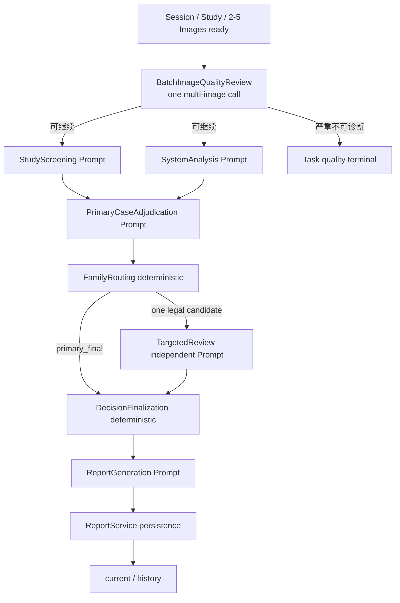

# MS-Image 非分割 X-Ray 全接口、AI 调用与独立 Prompt 架构审计

> 状态：`DESIGN_REVIEW_ONLY`
>
> 日期：2026-09-01
>
> 目标仓库：`/Users/mozhicheng/workspace/code/cy-code/ms-image`
>
> 对照仓库：`/Users/mozhicheng/workspace/code/py-project-v2/vet-platform-system`
>
> 对照提交：`6d1dd28bfb74143fb903503cdd08ced1f06a4d91`

## 1. 执行结论

本轮最终裁决不是整体照搬 `vet-platform`，不是把现有 Cat/Dog v4 双模式正文剪成几段，也不是仅为
Primary/Targeted 改名，而是：

```text
保留 ms-image 已有公开入口、Study/Image 冻结、Task/Stage/Outbox/Worker、
AIRequestService、Gateway、Report 和 Nacos/Config 控制面
    +
重新定义完整非分割 AI 链的阶段职责
    +
为每个 provider-required stage kind 从零编写 Cat/Dog 专用 Prompt
```

推荐重构等级：`existing-entry internal modular refactor`（保留入口的内部模块化重构）。

完整目标链：

```text
Session / 主诉上下文 / Study / 2–5 张原始 X-Ray
  -> BatchImageQualityReview（首版一次多图、独立 Prompt）
  -> 并行：StudyScreening + SystemAnalysis（两个独立 Prompt）
  -> PrimaryCaseAdjudication（一次多图、独立 Prompt）
  -> FamilyRouting（确定性，无 Prompt）
  -> TargetedReview（条件性一次、独立 Prompt）
  -> DecisionFinalization（确定性，无 Prompt）
  -> ReportGeneration（独立 Prompt，只消费最终医学结果）
  -> ReportService 持久化 final Report
  -> current/history 查询
```

目标固定为 6 类 provider-required stage kind，Cat/Dog 各一份，共 12 份全新 Runtime Prompt：

| AI Stage kind | Cat | Dog |
|---|---|---|
| BatchImageQualityReview | `xray_cat_image_quality` | `xray_dog_image_quality` |
| StudyScreening | `xray_cat_study_screening` | `xray_dog_study_screening` |
| SystemAnalysis | `xray_cat_system_analysis` | `xray_dog_system_analysis` |
| PrimaryCaseAdjudication | `xray_cat_primary_adjudication` | `xray_dog_primary_adjudication` |
| TargetedReview | `xray_cat_targeted_review` | `xray_dog_targeted_review` |
| ReportGeneration | `xray_cat_report_generation` | `xray_dog_report_generation` |

“全新”表示：

- 不从现有 v4 删除条件分支后冒充新 Primary；
- 不把 `targeted-review/common` 复制成猫犬文件；
- 不直接复制旧 A/B/C、Grid、System 或 Crop Prompt；
- 旧正文只提供检查清单、猫犬差异、输入风险、失败经验和反例；
- 每份新 Prompt 单独定义角色、输入变量、图片合同、输出 Schema、禁止职责和错误语义。

本设计不声称 Prompt 越多越准确。它首先解决职责和版本生命周期混合问题。目标不创建 17×2 器官裁剪
Prompt 或 6×2 system-crop Prompt，也不实现旧链的 segmentation/crop 依赖。

## 2. 权威、范围与排除项

### 2.1 权威顺序

1. 用户本轮明确要求；
2. `ms-image/AGENTS.md`；
3. `ms-image` 当前工作树源码；
4. 当前 handoff 和开发合同；
5. `vet-platform` 指定提交的源码和 Prompt；
6. 历史路线图和旧设计文档。

`vet-platform` 当前工作树存在大量未提交修改，因此本文只把指定提交 `6d1dd28...` 当作旧链事实，不把其当前脏工作树当作证据。

### 2.2 明确包含

- Token 依赖边界；
- Session 创建；
- 主诉提交和 clinical context；
- 1–4/2–5 图上传、确认和冻结；
- 批量质量检查；
- 诊断 Task 和异步执行；
- 多图联合分析；
- 条件专项复核；
- 综合报告生成；
- Task/Report 轮询与最终读取；
- 每一次 AI 调用需要的独立 Prompt；
- Prompt 之间的并行、前置依赖和汇合关系。

### 2.3 明确排除

图片红框中的旧接口不作为目标能力：

```text
POST /x_ray/xray_batch_organ_segmentation
GET  /x_ray/xray_organ_seg_status
```

同时排除：

- pixel mask、器官分割、bbox/crop/overlay 实现；
- 用分割结果作为诊断或报告的硬前置；
- 新建第二套 AI 请求服务、Gateway、Worker、Outbox 或竞速逻辑；
- Provider 选择、race_count、重试/fallback 的重新设计；
- Nacos、数据库、Provider、Docker 或 Runtime 写入；
- 医学准确率优化和发布裁决。

### 2.4 事实标记

| 标记 | 含义 |
|---|---|
| `CONFIRMED` | 当前源码或指定 commit 可直接证明 |
| `INFERRED` | 由多处事实推导，仍需实现/运行验证 |
| `PROPOSED` | 本文建议的目标设计，尚未实现 |
| `UNKNOWN` | 当前证据无法证明 |
| `N/A` | 该节点不需要 AI 或 Prompt |

## 3. 当前证据基线

| 维度 | `vet-platform@6d1dd28` | 当前 `ms-image` | 证据强度 |
|---|---|---|---|
| 非分割上传入口 | 有通用上传和批量 URL 质检 | 有完整 prepare/complete/validate/finalize | `CONFIRMED` |
| 主诉保存 | 独立接口，只落记录，不调用 AI | `TaskCreate.clinical_context` 冻结到诊断 Task | `CONFIRMED` |
| AI 影像质量/部位识别 | 有，逐图并发 | 没有独立 AI Quality Stage | `CONFIRMED` |
| 多图主读 | 旧报告链按 task_key 聚合同意图图片，最多 3 张/组 | 已有一次 2–5 图 Study 级 Primary | `CONFIRMED` |
| 专项分析 | 大量全图/系统/crop Prompt，并发执行 | 最多一次 TargetedReview | `CONFIRMED` |
| Prompt 阶段隔离 | 部位、A、B、C、系统/crop 均有不同 config key | Cat/Dog 分开，但同物种 Primary/Targeted 共用 v4 双模式正文 | `CONFIRMED` |
| 报告生成 Prompt | A/B/C 三 Prompt；C 是报告组织层 | 没有独立 ReportGeneration Prompt，直接持久化 finalization output | `CONFIRMED` |
| 分割依赖 | `gen_organ_seg_report` 对已完成分割任务硬依赖 | 诊断主链不依赖 Localization | `CONFIRMED` |
| 工程 Runtime | 旧提交本轮未运行 | 诊断猫狗 2–5 图有历史 Runtime 证据 | `CONFIRMED`（历史证据） |
| 医学准确率 | 本轮不评价 | `UNKNOWN` | `UNKNOWN` |

## 4. 截图流程逐接口核对

### 4.1 Step 0：获取 Token

旧截图从外部 Auth 服务获取 Token。它不是 X-Ray AI 阶段，不需要 Prompt。

`ms-image` 当前 Runtime 接口通过 caller scope 鉴权。本文不增加 Token API，也不修改认证链。

状态：`N/A / EXTERNAL_DEPENDENCY`。

### 4.2 Step 1：创建会话

#### 旧链

```text
POST /session_record/session-start
```

- endpoint：`session_start`；
- 输入：`SessionRecordCreate`；
- 创建 `medical_record`，返回 `session_id/medical_record_id/pet_profile_id`；
- 明确不保存主诉、不调用 AI。

证据：`vet-platform@6d1dd28:vet-platform/app/api/api_v1/endpoints/session_record.py:23-82`。

#### `ms-image`

```text
POST /ms-image/api/v1/sessions
GET  /ms-image/api/v1/sessions?id=
POST /ms-image/api/v1/sessions/complete|close|cancel
```

由 `SessionService` 和 `SessionDal` 承载，已经具备创建、查询和生命周期状态。无需复制旧 `medical_record` 会话模型。

状态：`KEEP / NO PROMPT`。

### 4.3 Step 2：提交主诉

#### 旧链

```text
POST /x_ray/submit-chief-complaint
```

请求：

```json
{
  "medical_record_id": 12345,
  "chief_complaint": "..."
}
```

接口只保存 `session_record`，代码注释明确“不触发 AI 分析”。

证据：

- `vet-platform@6d1dd28:vet-platform/app/api/api_v1/endpoints/x_ray.py:29-93`
- `vet-platform@6d1dd28:vet-platform/app/service/x_ray_service.py:77-137`
- `vet-platform@6d1dd28:vet-platform/app/schemas/x_ray_schema.py:120-123`

#### `ms-image`

主诉不需要新增独立 Prompt 或旧式接口。现有 `TaskClinicalContext` 已提供：

```text
source.system
source.recorded_at
source.temporal_scope
chief_complaint
study_reason
```

创建 `diagnose` Task 时冻结；非 diagnose Task 禁止携带。证据：

- `apps/backend/schemas/task.py:37-85`
- `apps/backend/services/runtime/service/task_service.py`

状态：`KEEP CURRENT CONTRACT / NO PROMPT`。

产品调用方如果需要“先保存、后创建 Task”，应由上游病例系统持有主诉；`ms-image` 只接收拍片前已存在的冻结事实，不另建主诉数据库。

### 4.4 Step 3：上传 1–4/2–5 张 X-Ray

#### 旧链

通用文件上传：

```text
POST /upload_file/upload-file?file_type=image&module_type=7
```

它把文件交给 OSS，返回 URL；无 AI。证据：

`vet-platform@6d1dd28:vet-platform/app/api/api_v1/endpoints/upload_file.py:22-36`。

旧批量质检随后接收 URL，不是同一上传事务。

#### `ms-image`

现有链更完整，应直接复用：

```text
POST /images/prepare-upload
客户端 PUT OSS
POST /images/complete-upload
validation Outbox / Worker
Image ready
POST /studies/finalize
```

同时支持 multipart 和 replace：

```text
/images/prepare-multipart-upload
/images/replace
/images/replace-multipart
/images/prepare-upload-parts
/images/list-upload-parts
/images/abort-upload
```

这些是传输、格式、哈希、版本和状态合同，不调用医学 AI，不需要 Prompt。

状态：`KEEP / NO PROMPT`。

### 4.5 Step 4：批量质量检查

#### 旧链接口

```text
POST /x_ray/xray_batch_quality_check
```

输入：

```json
{
  "session_id": "...",
  "image_urls": [
    {"image_url": "...", "body_part": "optional"}
  ]
}
```

`image_urls` 允许 1–50。证据：

- `vet-platform@6d1dd28:vet-platform/app/api/api_v1/endpoints/x_ray.py:133-172`
- `vet-platform@6d1dd28:vet-platform/app/schemas/x_ray_schema.py:108-117`

每张图执行：

```text
下载/DICOM 转图
  -> 并行：AI body-part/projection 识别 + 本地质量检查
  -> 汇总 body_part、projection、quality_check
```

跨图片再通过同一 scheduler stage 并发。证据：

- `vet-platform@6d1dd28:vet-platform/app/service/x_ray_service.py:804-877`
- `vet-platform@6d1dd28:vet-platform/app/service/x_ray_service.py:884-1027`

旧 AI Prompt key：

```text
x-ray-body-part-verification
```

旧模板资产：

```text
vet-platform/prompts/templates/imaging/X-RAY-部位识别验证.md
```

模板接收 `$expected_body_part/$image_url`，输出 `is_valid_xray`、解剖区域、projection、证据和质量备注。

#### 对旧 Prompt 的裁决

可借鉴：

- 一张图一个独立质量结论；
- 部位、投照、覆盖和技术质量分开表达；
- 逐图并发，汇合后再决定是否进入诊断；
- Prompt 不承担病例级诊断。

禁止照搬：

- 证据不足时仍禁止 `projection=unknown`；
- 没有标记时默认 `right_lateral`；
- AI 调用失败时把图像默认标记为有效；
- AI 结果静默覆盖调用方声明的 projection。

上述策略会把未知包装成确定事实。旧模板证据：

`vet-platform@6d1dd28:vet-platform/prompts/templates/imaging/X-RAY-部位识别验证.md:113-121,229-260`。

#### `ms-image` 现状与目标

当前 Image validation 负责对象存在、哈希、格式和状态，不提供独立的视觉质量/部位 AI Stage。`TaskCreate` 支持的类型也没有 quality control。

判定：`ABSENT / ADD`。

为快速搭建，首版不新增独立 Quality Task，也不复制旧同步长接口。推荐把它作为 `diagnose` Profile 内的一个
provider-required Stage：

```text
study_preparation
-> batch_image_quality_review
-> joint_primary_reader
```

`batch_image_quality_review` 一次接收同一冻结 Study 的全部 2–5 张图，输出逐图结果。这样直接复用当前
`AIRequestService` 的全 Study 图片装配，不需要首版增加逐图 image subset、N 个动态 Stage 或跨 Task 引用。

Quality 结果作为同一 diagnose Task 内部 Stage evidence 传给 Primary，并通过 final Report 的技术质量/限制字段交付。
首版不增加公共 Quality 结果接口。若产品后来确实需要“先质检、用户确认后再诊断”，再单独立项独立 Task 和安全查询。

### 4.6 Step 5/6：器官分割提交与状态

状态：`EXCLUDED`。

本文不把它们迁移到 `ms-image`，也不让后续诊断/报告依赖它们。

### 4.7 Step 7：生成多图综合报告

#### 旧链接口

```text
POST /x_ray/gen_organ_seg_report
```

请求只含 `session_id`。证据：

- `vet-platform@6d1dd28:vet-platform/app/api/api_v1/endpoints/x_ray.py:844-880`
- `vet-platform@6d1dd28:vet-platform/app/schemas/report_schema.py:11-13`

旧接口首先查找 `TASK_TYPE_XRAY_ORGAN_SEG`；任务不存在、未完成或失败均返回冲突。因此它虽然名称是“生成报告”，实际硬依赖已排除的器官分割链。证据：

`vet-platform@6d1dd28:vet-platform/app/service/x_ray_service.py:2018-2041`。

结论：A/B/C 的模板角色文本只能作为 Prompt 素材，前置数据链不能照搬，也没有旧运行证据证明它们在移除
specialist/crop/annotated assets 后保持等价。

#### 旧报告 Prompt

| Prompt | 旧 config key | 唯一职责 |
|---|---|---|
| A：初筛与预处理 | `x-ray-fusion-screening-{cat|dog}` | 技术质量、范围、上游状态、急症汇总 |
| B：器官特异性分析 | `x-ray-fusion-organ-{cat|dog}` | 器官系统整合、鉴别、跨器官关联 |
| C：综合诊断/报告 | `x-ray-fusion-conclusion-{cat|dog}` | 形成核心诊断、鉴别、建议、随访和报告，不只是格式化 |

模板资产：

```text
X-RAY-融合初筛与预处理-{犬|猫}.md
X-RAY-融合器官特异性分析-{犬|猫}.md
X-RAY-融合综合报告-{犬|猫}.md
```

猫犬版输出结构同构，但正常变异、参考阈值、急症集合、鉴别规则和用药风险不同，不能合并成一个“species 条件分支”模板。

旧代码把 A/B/C 放在同一 scheduler stage 并发：

```text
task_schedule = [[A_screening, B_organ, C_conclusion]]
```

三者接收相同 payload 和相同图片，随后由代码 `adjudicate_final_normality()` 汇合。证据：

- `vet-platform@6d1dd28:vet-platform/app/service/x_ray_service.py:4007-4148`
- `vet-platform@6d1dd28:vet-platform/app/helper/xray_fusion_helper.py:1700-1790`

该并发实现存在语义错位：C 的模板声明自己是 Phase 3 报告组织层，但运行时并未接收 A/B 的输出，而是和 A/B 同时执行。目标链不能复制这一点。

#### `ms-image` 目标

旧 A/B 的职责文本可以作为新阶段候选素材，但不能从旧运行事实推出“去掉 segmentation/crop 后仍等价”：

```text
StudyScreening（A）
  = Study 级范围、技术限制、跨图初筛和急症信号

SystemAnalysis（B）
  = 对原图实际覆盖的全部系统做结构化分析
```

A/B 无分割版本是新的设计假设。如果用户选择 M2，它们只依赖相同冻结原图、批量 Quality 结果和拍片前
clinical context，因此可以并行。它们之后必须有一个
`JointPrimaryReader/CaseAdjudication` 查看 A/B 结构化证据和同一批原图，输出唯一
`complete_medical_result`。不能再像旧链那样让 C 与 A/B 同时运行却自称 Phase 3。

`DecisionFinalization` 再确定唯一最终医学结果。默认直接由现有 `ReportService` 持久化，因为
`CompleteMedicalResult v2` 已经包含 `summary/impression/findings`。只有产品明确需要另一份非医学展示文案时，
才考虑后置独立 ReportGeneration Prompt。

### 4.8 Step 8：查询最终结果

#### 旧链

```text
GET /medical_record/medical_record?medical_record_id=
```

返回 medical record、report_content、medical_images 等聚合数据，不调用 AI。证据：

`vet-platform@6d1dd28:vet-platform/app/api/api_v1/endpoints/medical_record.py:41-190`。

#### `ms-image`

复用现有：

```text
GET /tasks?id=
GET /tasks/page
GET /reports/current?task_id=
GET /reports/history?task_id=
GET /reports?id=
```

Task completed 后读取 current Report，不新增旧式大聚合 `medical_record` 接口。

状态：`KEEP / NO PROMPT`。

## 5. `vet-platform` AI 调用与并发模型

### 5.1 逐图质量并发

```text
image_1 ─┬─ AI body part / projection Prompt
         └─ local quality check
image_2 ─┬─ AI body part / projection Prompt
         └─ local quality check
...
        -> batch aggregation -> serial DB save
```

可迁移点：网络/计算阶段不占用同一个 DB session；配置先批量加载；每图失败隔离；最终统一落库。

### 5.2 旧系统/器官专项并发

旧 `_analyze_all_images_with_organ_seg()` 在被排除的分割结果上继续构建三层任务：

1. full-image；
2. system union crop；
3. organ crop。

同 `task_key` 的同意图多视图先聚合，最多 3 张一组，然后所有 analysis item 并发执行。证据：

- `vet-platform@6d1dd28:vet-platform/app/service/x_ray_service.py:3050-3070`
- `vet-platform@6d1dd28:vet-platform/app/service/x_ray_service.py:3205-3534`

Prompt 路由来自：

```text
FULL_IMAGE_PROMPT_{CAT|DOG}
SYSTEM_TO_PROMPT_{CAT|DOG}
ORGAN_TO_CROP_PROMPT_{CAT|DOG}
```

证据：`vet-platform@6d1dd28:vet-platform/app/constants/x_ray_constants.py:335-543`。

这些 Prompt 的医学角色素材有参考价值，但其运行输入依赖 segmentation bbox、crop、PiP 和 annotated image，不满足本轮非分割边界。因此：

```text
资产可读、规则可抽取
运行链不照搬
首版不创建 17×2 器官 crop Prompt
```

### 5.3 A/B/C 并发与汇合

旧链的错误隔离值得借鉴：

- `asyncio.gather(..., return_exceptions=True)`；
- 单任务返回 `{success,error}`；
- 保留 partial result；
- 汇合点统一提取结果。

但目标依赖必须改为：

```text
A/B 独立时才允许并行
C 如果负责整合 A/B，就必须位于 A/B 之后
```

### 5.4 不迁移的失败语义

旧代码有以下危险 fallback：

```text
AI 调用失败 -> 默认 normal / is_valid_xray=True
```

例如 crop LLM 失败会生成 `overall_status='normal'` 和 `is_abnormal=False`。证据：

`vet-platform@6d1dd28:vet-platform/app/service/xray_grid/grid_analyzer.py:1211-1227`。

`ms-image` 必须继续 fail-closed：技术失败不能转换为正常医学结果。

### 5.5 旧提交 Prompt 身份与资产总表

下面区分“代码可路由的 Config identity”和“仓库内存在的 Markdown”。旧 Runtime 通过 AI Config DB 取正文，
不是按文件名直接 `open()`；因此文件存在不等于该 key 当时已经绑定，代码有 key 也不等于仓库有对应正文。

| Prompt 家族 | 代码身份/数量 | 在旧流程中的职责 | 本轮裁决 |
|---|---:|---|---|
| 部位/投照验证 | `x-ray-body-part-verification` ×1 | 单图 X-Ray 有效性、部位、projection | 提取为 Cat/Dog Quality Prompt |
| 通用 Grid 分析 | 13 个 identity | 头颅、脊柱、胸腔、腹部、附肢、肌骨、呼吸、心血管、消化、泌尿生殖、神经、全身、通用 | 不照搬运行链；仅作规则参考 |
| Dog Grid 分析 | 12 个物种 identity + 共用 general | 与上项相同的犬版 | 不照搬 |
| Cat Grid 分析 | 12 个物种 identity + 共用 general | 与上项相同的猫版 | 不照搬 |
| Full image | `x-ray-full-image-{dog|cat}` ×2 | 全图兜底、跨系统和未归属异常 | 吸收到 SystemAnalysis/Primary |
| System analysis | `x-ray-system-{cardiovascular|respiratory|digestive|urogenital|axial-skeletal|appendicular}-{dog|cat}` ×12 | 系统 union crop 分析 | 不创建 12 个首版 Runtime Prompt；吸收到 Study 级 B Prompt |
| Organ crop | `x-ray-crop-*-{dog|cat}`，17 类×2=34 | 器官 crop 细节分析 | 依赖 segmentation/crop，排除运行链；仅作医学规则素材 |
| Fusion A | `x-ray-fusion-screening-{dog|cat}` ×2 | 初筛、质量、范围、急症 | 迁移为 StudyScreening Cat/Dog |
| Fusion B | `x-ray-fusion-organ-{dog|cat}` ×2 | 系统整合、鉴别和跨器官关联 | 迁移为无 crop 的 SystemAnalysis Cat/Dog |
| Fusion C | `x-ray-fusion-conclusion-{dog|cat}` ×2 | 综合报告组织 | 迁移为 ReportGeneration Cat/Dog，并放到最终医学结果之后 |
| Visual verify | `x-ray-visual-verify-{dog|cat}` ×2 | 旧常量中存在 | 当前 A/B/C schedule 未调用，不能当成已执行 Prompt |
| Anatomy/organ segmentation | anatomy detection、system crop、organ seg、organ detection 等 | bbox/crop/分割 | 本轮排除 |

Grid identity 证据：

- `vet-platform@6d1dd28:vet-platform/app/service/report_service.py:103-151`
- `vet-platform@6d1dd28:vet-platform/app/service/xray_grid/grid_analyzer.py:924-1057`

System/crop identity 证据：

- `vet-platform@6d1dd28:vet-platform/app/constants/x_ray_constants.py:335-543`
- `vet-platform@6d1dd28:vet-platform/app/service/xray_grid/grid_analyzer.py:1063-1209`

Fusion identity 证据：

- `vet-platform@6d1dd28:vet-platform/app/service/report_service.py:169-177`
- `vet-platform@6d1dd28:vet-platform/app/service/x_ray_service.py:3971-4135`

本次直接核验、与截图主链最相关的模板资产（不是仓库全部 Prompt 的穷尽清单）：

```text
X-RAY-部位识别验证.md
X-RAY-融合初筛与预处理-犬.md
X-RAY-融合初筛与预处理-猫.md
X-RAY-融合器官特异性分析-犬.md
X-RAY-融合器官特异性分析-猫.md
X-RAY-融合综合报告-犬.md
X-RAY-融合综合报告-猫.md
X-RAY-全图综合分析-犬.md
X-RAY-系统分析-泌尿生殖系统-犬.md
X-RAY-系统分析-消化系统-犬.md
X-RAY-裁剪分析-头颅-{犬|猫}.md
X-RAY-裁剪分析-心脏与大血管-{犬|猫}.md
X-RAY-裁剪分析-肾脏-{犬|猫}.md
X-RAY-裁剪分析-胃-{犬|猫}.md
X-RAY-裁剪分析-膀胱-{犬|猫}.md
```

其余 code-routed key 的正文可能只存在 AI Config DB 或其他发布资产中，本次没有读取旧数据库，必须标记
`UNKNOWN`，不能根据 key 编造正文。

## 6. 当前 `ms-image` 接口与内部链

### 6.1 Runtime 公共接口

外部 root path 为 `/ms-image`，版本前缀来自 `settings.API_V1_STR`。下表省略共同前缀。

| Method/path | Endpoint / Request Schema | Service / DAL | 状态与输出 | AI/Prompt |
|---|---|---|---|---|
| `POST /sessions` | `create_session` / `SessionCreate` | `SessionService -> SessionDal` | 创建 open Session，返回 Session DTO | 无 |
| `GET /sessions?id=` | `get_session` | `SessionService -> SessionDal` | owner-safe 查询 | 无 |
| `POST /sessions/complete` | `SessionVersionCommand` | `SessionService` | processing -> completed | 无 |
| `POST /sessions/close` | `SessionVersionCommand` | `SessionService` | completed -> closed | 无 |
| `POST /sessions/cancel` | `SessionCancelCommand` | `SessionService -> Task/Study/Image DAL` | 原子记录 Session/Task 取消事实 | 无 |
| `POST /studies` | `StudyCreate` | `StudyService -> Session/Study DAL` | 创建 ingesting Study | 无 |
| `GET /studies?id=` | Study detail query | `StudyService -> Study/Series/Image DAL` | 返回 Study/Revision 信息 | 无 |
| `POST /series` | `SeriesCreate` | `StudyService -> SeriesDal` | 创建 ingesting Series | 无 |
| `POST /studies/finalize` | `StudyFinalizeRequest` | `StudyService -> Study/Series/Image DAL` | ready Images -> ready Study + immutable revision/manifest | 无 |
| `POST /images/prepare-upload` | `ImagePrepareUploadRequest` | `ImageService -> Image/Outbox DAL + OSS gateway` | 创建 uploading Image 和 direct upload ticket | 无 |
| `POST /images/prepare-multipart-upload` | `ImagePrepareMultipartRequest` | 同上 | 创建 multipart upload | 无 |
| `POST /images/replace` | `ImageReplaceRequest` | 同上 | 创建新 Image version | 无 |
| `POST /images/replace-multipart` | `ImageReplaceMultipartRequest` | 同上 | 创建 multipart replacement | 无 |
| `POST /images/prepare-upload-parts` | `ImagePreparePartsRequest` | `ImageService + OSS gateway` | 返回 part upload tickets | 无 |
| `POST /images/list-upload-parts` | `ImageListMultipartPartsRequest` | 同上 | 返回 OSS parts receipt | 无 |
| `POST /images/complete-upload` | `ImageCompleteUploadRequest` | `ImageService -> Image/Outbox DAL` | uploading -> validating；validation event 入 Outbox | 无 |
| `POST /images/abort-upload` | `ImageAbortCommand` | `ImageService` | -> quarantined | 无 |
| `GET /images?id=` | Image query | `ImageService -> ImageDal` | owner-safe 宽 DTO | 无 |
| `GET /images/page` | `ImagePageQuery` | `ImageService -> ImageDal` | Series scope 分页精简 DTO | 无 |
| `POST /tasks` | `TaskCreate` | `TaskService -> Config/Task/Stage/Outbox DAL` | 创建 Task、首 Stage 和 Outbox；HTTP 内不请求 AI | 异步执行时由 Profile 决定 |
| `GET /tasks?id=` | Task query | `TaskService -> TaskDal` | 轮询状态、current_report_id 和时间 | 无 |
| `GET /tasks/page` | `TaskPageQuery` | `TaskService -> TaskDal` | Session/Study scope 分页 | 无 |
| `POST /tasks/cancel` | `TaskCancelRequest` | `TaskService -> Task/Stage/Outbox DAL` | 记录异步取消请求 | 无 |
| `GET /reports?id=` | Report query | `ReportService -> Report/Task DAL` | 读取指定 Report | 无 |
| `GET /reports/current?task_id=` | current query | `ReportService` | 读取 final/published current，允许 null | 无 |
| `GET /reports/history?task_id=` | history query | `ReportService` | 按 revision 查询历史 | 无 |

主要 endpoint 证据：

- `apps/backend/services/runtime/api/api_v1/endpoints/sessions.py`
- `apps/backend/services/runtime/api/api_v1/endpoints/studies.py`
- `apps/backend/services/runtime/api/api_v1/endpoints/images.py`
- `apps/backend/services/runtime/api/api_v1/endpoints/tasks.py`
- `apps/backend/services/runtime/api/api_v1/endpoints/reports.py`

公开接口遵循 query/body 资源 ID，不新增 `/{id}`。Admin publish/void 不属于“上传到第一份 final Report”的主链；
其现有 `state_version` 阻断也不应混进本次 Prompt 拆分。

### 6.2 当前诊断 DAG

```text
StudyPreparation（无 AI）
  -> JointPrimaryReader（AI）
  -> FamilyRouting（无 AI）
       ├─ primary_final
       └─ TargetedReview（条件 AI，最多一次）
  -> DecisionFinalization（无 AI）
  -> ReportService.finalize（无 AI）
```

源码证据：

- `apps/backend/core/pipeline.py:64-188`
- `apps/backend/services/runtime/stages/common/study_preparation.py`
- `apps/backend/services/runtime/stages/xray/joint_primary_reader.py`
- `apps/backend/services/runtime/stages/xray/family_routing.py`
- `apps/backend/services/runtime/stages/xray/targeted_review.py`
- `apps/backend/services/runtime/stages/common/decision_finalization.py`
- `apps/backend/services/runtime/service/imaging_execution_service.py:404-472`

### 6.3 当前 Prompt 合并事实

当前 Cat/Dog v4 是物种独立、阶段双模式：

```text
无 PRIMARY_RESULT_JSON -> Primary
有 PRIMARY_RESULT_JSON -> Targeted
```

正文：

```text
prompts/xray/nacos/primary/cat/...v4.0.0.md
prompts/xray/nacos/primary/dog/...v4.0.0.md
```

`prompt_commands.py` 也明确 v2 每个 Config 只拥有一份冻结正文。证据：

- `apps/backend/services/runtime/stages/xray/prompt_commands.py:66-95`
- `apps/backend/services/runtime/stages/xray/prompt_commands.py:98-150`

这满足历史工程链，但不符合本轮“每个 AI 阶段有独立 Prompt”的产品要求。

### 6.4 当前 Config 阻断

`AIConfigRecord` v2 只有一组 Prompt 快照字段：

```text
prompt_template_id
prompt_key
prompt_version
prompt_content
prompt_variables_json
prompt_content_sha256
```

证据：`apps/backend/models/ai_config_record.py:60-90`。

Task 也只有一个根 `ai_config_id`，当前 `AIRequestService` 要求 AICall Config 与 Task Config 一致。因此，仅在 Nacos 创建 Targeted/Report Prompt 不会自动生效。

另一个确定阻断是图片选择：当前 `StageAIRequest` 只包含 `prompt_command`，而
`AIRequestService._load_attempt_image_inputs()` 会从 Task Snapshot 加载整个冻结 Study 的全部图片。逐图 Quality fan-out
不能只靠新增 Stage 完成，否则每个 Quality Call 仍可能收到全部 N 张图。

证据：

- `apps/backend/services/runtime/stages/contracts.py:20-41`
- `apps/backend/services/runtime/service/ai_request_service.py:1832-1881`

目标需要在现有 Stage intent 中增加冻结的 image selection（例如一个 `image_id/source_ref_id` 集合），并在现有
`AIRequestService` 内验证它是 Task manifest 的非空子集后签名发送。它是对现有请求内核的局部输入合同扩展，
不是新建第二套请求服务、Provider 或竞速实现。

### 6.5 当前 `ms-image` 非分割 Prompt 资产

| 资产 | 当前作用 | 本轮处理 |
|---|---|---|
| `primary/cat/...v3.0.0.md` | 历史猫 Primary | 保留不可变，不覆盖 |
| `primary/cat/...v4.0.0.md` | 当前猫 Primary/Targeted 双模式 | 只作规则与失败经验参考；新 Prompt 不从其裁剪生成 |
| `primary/dog/...v3.0.0.md` | 历史犬 Primary | 保留不可变 |
| `primary/dog/...v4.0.0.md` | 当前犬 Primary/Targeted 双模式 | 只作规则与失败经验参考；新 Prompt 不从其裁剪生成 |
| `primary/common/...v1/v2.txt` | 历史 common compatibility | 不作为猫犬新链 fallback |
| `targeted-review/common/...v1/v2.txt` | 独立 Targeted 候选正文 | 只提取合同要求和反例；Cat/Dog Targeted 从零重写 |
| `catalog.zh-CN.json` 和 20 个模块资产 | 历史 v1 组合素材 | 只提取医学检查清单，不逐个发布 v2 Prompt |
| `offline_evaluation_failure_analysis.zh-CN.txt` | 离线失败归因 | 不进入在线 Runtime |
| Anatomy Localization Prompts | bbox 展示支线 | 本轮排除，不删除、不改写 |

本地文件目录只证明资产存在。实际历史 Task 的权威仍是其 immutable Config 中冻结的 Prompt identity、正文和 SHA。

## 7. 能力与 Prompt 差距矩阵

| 能力 | 旧链 | 当前 `ms-image` | 目标动作 |
|---|---|---|---|
| 主诉保存 | 独立接口，无 AI | Task clinical context | 复用，不新增 Prompt |
| 批量视觉质检 | AI 部位/投照 + 本地 QC；旧实现逐图并发 | 仅工程 validation | 新建一次多图 BatchQuality Stage/Prompt；输出逐图结果 |
| Study 初筛 | 旧 A Prompt 依赖上游 specialist/crop 结果 | 当前 Primary 内混合承担 | 从零新建无分割 StudyScreening Prompt；旧 A 仅作参考 |
| 全系统分析 | 旧 B + 大量 system/crop Prompt，依赖分割资产 | 当前 Primary 内混合承担 | 从零新建原图 Study 级 SystemAnalysis Prompt；旧 B/Crop 仅作参考 |
| 多图联合主读/裁决 | 旧链由融合和代码共同承担 | 已实现直接阅片 | 从零新建 PrimaryCaseAdjudication Prompt，消费 A/B 并复核原图 |
| 专项复核 | 多系统/器官 Prompt | 最多一次 Targeted，但与 Primary 共正文 | 从零新建 Cat/Dog Targeted Prompt |
| 结果 owner 选择 | 代码仲裁 | DecisionFinalization | 保留确定性 |
| 报告组织 | 旧 C 实际同时做综合诊断与报告 | 当前 CompleteMedicalResult 已含报告核心字段 | 从零新建受限 ReportGeneration Prompt，禁止重新诊断 |
| 最终查询 | medical_record 聚合 | Task + Report current/history | 保留当前接口 |
| Prompt 并发 | 逐图、专项、A/B/C 多处并发 | 无 Prompt fan-out | BatchQuality 单调用；StudyScreening/SystemAnalysis 并发；后续串行 |
| 分割/crop | 报告硬依赖 | 独立 Localization，不进入 Report | 继续隔离 |

## 8. 目标 DAG 与并发合同

### 8.1 完整目标 DAG



BatchQuality、StudyScreening、SystemAnalysis、PrimaryCaseAdjudication、TargetedReview 均接收同一冻结 Study 的
2–5 张原图；ReportGeneration 默认不接收图片，只消费最终医学结果和技术质量证据。

### 8.2 并行规则

1. BatchQuality 首版不做逐图 fan-out，一次返回 N 个逐图结果；
2. StudyScreening 与 SystemAnalysis 接收相同上游输入，允许并行；
3. PrimaryCaseAdjudication 必须等待 A/B 都进入明确终态；
4. Targeted 必须等待 Primary 和 FamilyRouting；
5. ReportGeneration 必须等待 DecisionFinalization；
6. 本文不重新设计 Provider、竞速、lane 或 attempt；Stage-specific Config 和 A/B fan-out/fan-in 会修改现有 Pipeline/执行编排，不能描述成零影响。

### 8.3 后置的逐图 Quality fan-out

旧项目逐图并发值得保留为第二阶段候选，但当前 `StageAIRequest` 无 image subset、X-Ray 调用又要求 2–5 图。
如果真实延迟证据表明 BatchQuality 不满足目标，再版本化单图选择、动态 Stage、fan-in 和单图 count contract。

### 8.4 首版不做的 Family Prompt 并发

首版不同时调用所有 Family/系统 Prompt。当前 result schema 和路由合同只允许一个 `targeted_candidate`，Targeted 最多一次。若未来要并行多个 Family，必须先版本化：

```text
candidate list schema
fan-out budget
每个结果的 lineage
冲突 adjudication owner
缺失/部分成功语义
```

否则会重新引入旧链“多个模型结果由 Python 拼医学结论”的问题。

## 9. 独立 Prompt 创建清单

### 9.1 Prompt Q-Cat：猫批量逐图质量核验（全新创建）

建议 identity：

```text
internal key: xray_cat_image_quality
Nacos Data ID: ms-image.x-ray.image-quality.cat.zh-CN
version: 1.0.0
```

唯一职责：在一次调用中逐张核验同一 Study 的 2–5 张图，并为每张图分别输出：

- 判断输入是否为猫 X-Ray；
- 判断主要可见解剖区域；
- 观察投照/体位证据；
- 评价摆位、曝光、对比度、锐利度、运动、截断、重叠和外物；
- 给出 `diagnostic/review_required/non_diagnostic` 技术可用性；
- 不输出疾病、诊断、鉴别诊断或治疗建议。

变量：

```text
SAFE_STUDY_CONTEXT_JSON
OUTPUT_SCHEMA_JSON
```

图片：同一冻结 Study 的全部 2–5 张原图；输出必须按 `ordered_image_refs` 一一覆盖，不得缺失、重复或合并。

建议输出合同 `xray-image-quality.v1`：

```text
results[]:
  image_id / series_id / manifest_sha256
  is_xray
  species_consistency
  anatomy_region
  declared_projection
  observed_projection
  projection_consistency: match|mismatch|unknown
  quality_status: diagnostic|review_required|non_diagnostic
  quality_issues[]
  coverage_limitations[]
  retake_recommendations[]
study_quality_summary
```

硬规则：证据不足时必须 `unknown`，不得猜投照；AI 观察不能静默覆盖 caller-declared projection。

### 9.2 Prompt Q-Dog：犬批量逐图质量核验（全新创建）

```text
internal key: xray_dog_image_quality
Nacos Data ID: ms-image.x-ray.image-quality.dog.zh-CN
version: 1.0.0
```

结构与 Q-Cat 相同，但犬的体型、胸廓和品种差异说明独立维护，不能在一个正文中用 `$species` 分支合并。

### 9.3 Prompt A-Cat：猫 Study 初筛（全新创建）

```text
internal key: xray_cat_study_screening
Nacos Data ID: ms-image.x-ray.study-screening.cat.zh-CN
version: 1.0.0
```

这是新的无分割 Prompt。旧 `X-RAY-融合初筛与预处理-猫.md` 只提供技术质量、范围和急症检查清单；旧 specialist/crop 输入、变量、判断和输出正文均不复制。

唯一职责：

- 汇总逐图质量、投照、范围和 Study 完整性；
- 在全部原图上做快速跨图初筛；
- 记录明确急症信号、重要技术限制和未覆盖系统；
- 只产出 screening evidence，不给最终病例诊断，不生成最终 Report。

变量：

```text
SAFE_STUDY_CONTEXT_JSON
QUALITY_RESULTS_JSON
OUTPUT_SCHEMA_JSON
```

图片：同一冻结 Study 的全部 2–5 张原图。

建议输出合同 `xray-study-screening.v1`：

```text
study_quality_status
coverage_summary
technical_limitations[]
emergency_signals[]
screening_findings[]
families_requiring_analysis[]
families_not_assessed[]
source_refs[]
```

它不得把可疑信号升级成最终疾病，也不得把未覆盖/失败图写成正常。

### 9.4 Prompt A-Dog：犬 Study 初筛（全新创建）

```text
internal key: xray_dog_study_screening
Nacos Data ID: ms-image.x-ray.study-screening.dog.zh-CN
version: 1.0.0
```

与 A-Cat 使用同一结构合同，但犬的体型差异、胸廓解释和犬特异急症说明独立维护。

### 9.5 Prompt B-Cat：猫全系统分析（全新创建）

```text
internal key: xray_cat_system_analysis
Nacos Data ID: ms-image.x-ray.system-analysis.cat.zh-CN
version: 1.0.0
```

这是新的原图 Study 级全系统 Prompt。旧 A/B、System/Crop Prompt 只用于提取系统检查清单、猫正常变异、证据优先级和保守升级反例；不复制任何 segmentation/crop/annotation 变量和正文。

唯一职责：

- 对原图实际覆盖的胸腔、腹腔、轴骨骼、附肢骨骼、头颈和跨系统模式逐项分析；
- 每个系统分别输出可见结构、异常征象、正常反证、限制和 SourceRef；
- 记录合理的影像学解释和不确定性；
- 不生成最终病例 summary/impression，不决定最终 medical status。

变量：

```text
SAFE_STUDY_CONTEXT_JSON
QUALITY_RESULTS_JSON
OUTPUT_SCHEMA_JSON
```

图片：同一冻结 Study 的全部 2–5 张原图。不得依赖 segmentation、bbox、crop、PiP 或标注图。

建议输出合同 `xray-system-analysis.v1`：

```text
systems[]:
  family_key
  assessment_status
  visible_structures[]
  findings[]
  normal_counterevidence[]
  limitations[]
  source_ref_ids[]
cross_system_patterns[]
unresolved_conflicts[]
source_refs[]
```

### 9.6 Prompt B-Dog：犬全系统分析（全新创建）

```text
internal key: xray_dog_system_analysis
Nacos Data ID: ms-image.x-ray.system-analysis.dog.zh-CN
version: 1.0.0
```

与 B-Cat 同构；犬的心影/胸廓/骨关节/胃肠正常变异和常见模式独立维护。

### 9.7 Prompt P-Cat：猫病例级主读裁决（全新创建）

```text
internal key: xray_cat_primary_adjudication
Nacos Data ID: ms-image.x-ray.primary-adjudication.cat.zh-CN
version: 1.0.0
```

这是新的病例级裁决 Prompt，不从现有猫 v4 删除分支后生成。现有 v4 只提供 SourceRef、可诊断性、
多视位互证和猫正常变异等合同参考。

变量：

```text
SAFE_STUDY_CONTEXT_JSON
QUALITY_RESULTS_JSON
STUDY_SCREENING_RESULT_JSON
SYSTEM_ANALYSIS_RESULT_JSON
OUTPUT_SCHEMA_JSON
```

图片：同一冻结 Study 的全部 2–5 张原图，一次请求。A/B 是待核对证据，不是真值；Primary 必须重新核对原图。

输出：`xray-complete-medical-result.v2`，可产生最多一个合法 `targeted_candidate`。

### 9.8 Prompt P-Dog：犬病例级主读裁决（全新创建）

```text
internal key: xray_dog_primary_adjudication
Nacos Data ID: ms-image.x-ray.primary-adjudication.dog.zh-CN
version: 1.0.0
```

职责、变量和输出与 P-Cat 同构，犬医学规则独立维护。

### 9.9 Prompt T-Cat：猫专项复核（全新创建）

```text
internal key: xray_cat_targeted_review
Nacos Data ID: ms-image.x-ray.targeted-review.cat.zh-CN
version: 1.0.0
```

这是新的猫专项复核 Prompt。旧 common/v4 只提供“Primary 不是真值、完整 Study 复核、不得输出 patch、
不得二次路由”等合同参考，正文不复制。

变量：

```text
SAFE_STUDY_CONTEXT_JSON
PRIMARY_RESULT_JSON
ROUTE_CONTEXT_JSON
QUALITY_RESULTS_JSON
STUDY_SCREENING_RESULT_JSON
SYSTEM_ANALYSIS_RESULT_JSON
OUTPUT_SCHEMA_JSON
```

图片：与 Primary 完全相同的全部冻结原图。

输出：新的完整 `xray-complete-medical-result.v2`，不得输出 patch；`targeted_candidate` 必须为 null，避免递归复核。

### 9.10 Prompt T-Dog：犬专项复核（全新创建）

```text
internal key: xray_dog_targeted_review
Nacos Data ID: ms-image.x-ray.targeted-review.dog.zh-CN
version: 1.0.0
```

与 T-Cat 同构，犬医学规则独立维护。

### 9.11 Prompt R-Cat：猫报告生成（全新创建）

```text
internal key: xray_cat_report_generation
Nacos Data ID: ms-image.x-ray.report-generation.cat.zh-CN
version: 1.0.0
```

唯一职责：把已经定稿的完整医学结果组织成产品报告。

变量：

```text
FINAL_MEDICAL_RESULT_JSON
QUALITY_RESULTS_JSON
REPORT_SCHEMA_JSON
```

默认不传原始图像。报告阶段不得重新阅片。

必须保持：

- `medical_status` 原值；
- finding/source_ref 身份和正文；
- limitations/review_reason；
- 所有不确定性；
- 最终结果 owner 和来源 SHA。

禁止：新增/删除 Finding、升级或降低疾病判断、改变 normal/abnormal/review_required/non_diagnostic。

建议输出 `xray-final-report.v1`：

```text
result_schema_version
medical_status
study_summary
findings[] 原样投影
impression 原样投影
technical_quality_summary
limitations
review_reason
source_result_sha256
```

### 9.12 Prompt R-Dog：犬报告生成（全新创建）

```text
internal key: xray_dog_report_generation
Nacos Data ID: ms-image.x-ray.report-generation.dog.zh-CN
version: 1.0.0
```

与 R-Cat 同构，报告语言和犬特异上下文独立维护。

### 9.13 单病例全部 AI 调用矩阵

| 顺序 | AI Stage | 触发次数 | 图片 | 必须等待 | 输出消费者 | 并发关系 |
|---:|---|---:|---|---|---|---|
| 1 | ImageQualityReview | N 次，N=2..5 | 每次 1 张原图 | Study/Image ready | QualityAggregation | N 次并行 |
| 2A | StudyScreening | 1 次 | 全部 N 张原图 | QualityAggregation | Primary | 与 2B 并行 |
| 2B | SystemAnalysis | 1 次 | 全部 N 张原图 | QualityAggregation | Primary | 与 2A 并行 |
| 3 | JointPrimaryReader/CaseAdjudication | 1 次 | 全部 N 张原图 | 2A + 2B | FamilyRouting | 串行汇合 |
| 4 | TargetedReview | 0 或 1 次 | 全部 N 张原图 | Primary + legal route | DecisionFinalization | 条件串行 |
| 5 | ReportGeneration | 1 次 | 默认 0 张 | DecisionFinalization | ReportService | 最后串行 |

调用数量：

```text
Primary-only：N + 4 次 AI Logical Call
Targeted：    N + 5 次 AI Logical Call

N=2 -> 6 或 7 次
N=5 -> 9 或 10 次
```

这比当前 `ms-image` 的 1/2 次调用明显更慢、更贵。拆分的价值是职责、证据和 Prompt 生命周期独立，
不是免费提高准确率。实施时必须为整个 Profile 单独冻结总调用预算和 deadline；不能只给每个 Config 各自预算后
忽略 Task 总预算。

## 10. 不应创建 Prompt 的节点

| 节点 | 原因 |
|---|---|
| Token/Auth | 外部身份边界 |
| Session 创建/完成/关闭/取消 | 确定性状态机 |
| 主诉保存 | 业务事实记录，不是模型推理 |
| OSS 上传/确认/校验 | 传输和对象完整性 |
| StudyPreparation | 冻结输入和能力预检 |
| QualityAggregation | 汇总逐图技术结果，不做医学推理 |
| FamilyRouting | 消费受控 candidate，确定性路由 |
| DecisionFinalization | 选择已有唯一完整结果 |
| Report 持久化/current/history | 数据持久化和查询 |
| Outbox/Relay/Worker | 执行底座 |
| Retry/Fallback/Race | Attempt 调度，不是医学任务 |

## 11. Stage 级 Config 绑定方案

### 11.1 当前限制

当前一个 Task 绑定一个根 `ai_config_id`，v2 Config 冻结一份 Prompt。不能靠多建 Nacos Data ID 自动实现阶段拆分。

当前 Stage AI intent 也没有逐 Stage 图片子集；Quality fan-out 必须同时冻结并校验单图选择，否则无法证明每个
Quality Prompt 只看了指定图片。

### 11.2 最小无迁移方案

每个 Prompt 各自编译成现有不可变 `AIConfigRecord`，不增加表。Task 创建时在现有 `request_snapshot_json` 中冻结：

```json
{
  "stage_ai_config_bindings": {
    "study_screening": {
      "ai_config_id": "...",
      "config_sha256": "...",
      "prompt_content_sha256": "...",
      "output_schema_sha256": "..."
    },
    "system_analysis": {
      "ai_config_id": "...",
      "config_sha256": "...",
      "prompt_content_sha256": "...",
      "output_schema_sha256": "..."
    },
    "joint_primary_reader": {
      "ai_config_id": "...",
      "config_sha256": "...",
      "prompt_content_sha256": "...",
      "output_schema_sha256": "..."
    },
    "targeted_review": {
      "ai_config_id": "...",
      "config_sha256": "..."
    },
    "report_generation": {
      "ai_config_id": "...",
      "config_sha256": "..."
    }
  }
}
```

质量 Task 单独冻结 `image_quality_review` binding。

每个 Quality Stage 的 input/intent 还必须冻结：

```text
image_id
series_id
sequence_no
projection
series_manifest_sha256
image_content_sha256
```

执行时只允许从 Task Snapshot 精确选择该图，禁止按文件名、数组位置或运行时 latest 查询。

`AICall.ai_config_id` 已存在，可记录每个 Stage 实际使用的 Config。需要局部修改 `AIRequestService` 当前“Call Config 必须等于 Task 根 Config”的校验，改为“必须等于冻结 stage binding”。

优点：

- 不新增表/字段/migration；
- 不创建第二套 Config Service；
- 历史 Task 保持单 Config 读取；
- 每个 Prompt 可独立版本化、激活、回滚和审计；
- 不影响 AI 请求/竞速实现。

### 11.3 不推荐方案

- 把 12 份 Prompt 拼成一个超长双/多模式正文；
- 运行时按 Nacos latest 查 Prompt；
- 在 Stage Handler 里直接调用 Nacos 或 Gateway；
- 用 Python 字符串拼接医学 Prompt；
- 把旧 `prompt_bundle_json` v1 兼容字段无版本地改造成新合同；
- 为每个 Prompt 新建表或 Service。

## 12. 新增与复用接口清单

### 12.1 直接复用

```text
POST /sessions
POST /studies
POST /series
POST /images/prepare-upload
POST /images/complete-upload
POST /studies/finalize
POST /tasks
GET  /tasks?id=
GET  /tasks/page
GET  /reports/current?task_id=
GET  /reports/history?task_id=
GET  /reports?id=
```

### 12.2 建议最小新增

不增加专门的“启动 QC”接口；复用：

```text
POST /tasks
task_type=xray_quality_control
```

若采用独立 Quality Task，`diagnose` 的 `TaskCreate` 需要增加可选 body 字段 `quality_task_id`。`TaskService` 必须验证
Quality Task 与 diagnose Task 的 requester、Study、revision、manifest 和 species 完全一致、状态为 completed，随后把
Quality Task ID、结果 SHA 和合同版本冻结进 diagnose Snapshot。该字段不能放 path，也不能运行时查询“最新一次质检”。

建议增加安全结果查询：

```text
GET /xray-quality-results?task_id=
```

若后续 `TaskStatusResponse` 能稳定承载逐图质量结果，可取消该新增接口。必须二选一，不能形成两个结果真相。

### 12.3 不新增

- `/session-start` 兼容壳；
- `/submit-chief-complaint` 兼容壳；
- `/xray_batch_quality_check` 同步长请求；
- `/gen_organ_seg_report`；
- `/medical_record` 大聚合；
- segmentation submit/status；
- webhook/通知。

如果真实上游必须保持旧 URL，再单独设计 adapter；不能把旧接口语义直接塞进 Runtime endpoint。

## 13. 目标状态与失败语义

### 13.1 Quality Task

```text
queued -> running -> completed|failed|cancelled|dead_letter
```

- 任一图 AI 调用技术失败：对应图为 technical failure，不得默认通过；
- 任一图 `non_diagnostic`：QualityAggregation 明确输出不适合诊断；
- `projection_consistency=mismatch/unknown` 不允许 Python 自动改 metadata；
- Quality Task 不生成 Report，`current_report_id=null`。

### 13.2 Diagnose Task

- 只能引用相同 Study revision/manifest 的 Quality 结果；
- Quality 结果缺失、过期或 manifest 不一致时 fail-closed 或由明确 Profile 决定跳过，不能静默引用旧结果；
- Primary/Targeted/Report 的任何技术失败不能转成 normal；
- Targeted 失败是否允许 Primary 交付必须由 Profile 明示，首版建议 fail-closed；
- ReportGeneration 失败时保留最终医学结果审计，但 Task 不得谎报已有 final Report。

## 14. 实施顺序

### Phase 0：冻结本文设计

- 用户确认 12 个 Prompt 身份；
- 确认 Quality 是独立 Task 还是 diagnose 内部 Stage；
- 确认 ReportGeneration 是否为必经 AI Stage；
- 确认新环境 Nacos namespace 和不可变版本策略。

### Phase 1：只创建 Prompt 与 Schema 资产，不激活

1. Cat/Dog image-quality Prompt；
2. Cat/Dog StudyScreening Prompt；
3. Cat/Dog SystemAnalysis Prompt；
4. Cat/Dog Primary-only 新版本；
5. Cat/Dog TargetedReview 独立 Prompt；
6. Cat/Dog ReportGeneration Prompt；
7. `xray-image-quality.v1`；
8. `xray-study-screening.v1`；
9. `xray-system-analysis.v1`；
10. `xray-final-report.v1`。

只做本地变量/Schema/内容一致性验证，不修改已发布版本。

### Phase 2：Stage 级 Config 冻结

- 扩展 exact Prompt Source mappings；
- 每个 Prompt 单独 import/validate；
- 每个 Prompt 单独编译 immutable Config；
- Task Snapshot 冻结 stage config binding；
- 历史单 Config Task 保持兼容。

### Phase 3：Quality Task/Profile

- 新 task type/profile；
- N 个动态 image quality Stage；
- bounded fan-out；
- deterministic QualityAggregation；
- 安全结果查询。

### Phase 4：拆 Primary/Targeted

- 新增 A/B 并发阶段，并在 Primary 前确定性汇合；
- Primary-only Prompt 不接收 `PRIMARY_RESULT_JSON`；
- Targeted 只接收独立 Prompt/Config；
- 保持当前 FamilyRouting 和最多一次 Targeted；
- 不改变 AIRequest/Gateway/race。

### Phase 5：ReportGeneration

- DecisionFinalization 先选最终医学结果；
- ReportGeneration 只组织报告；
- ReportService 从 ReportGeneration Stage 持久化 final Report；
- current/history 保持现有接口。

### Phase 6：真实非分割闭环

```text
Session
-> clinical context
-> upload 2 images
-> ready/finalize
-> quality task
-> diagnose task
   -> parallel screening/system analysis
   -> primary/optional targeted/report generation
-> final report
-> current/history
```

两图通过后再做 Cat/Dog 和 3/4/5 图。

## 15. 验证策略

### 15.1 静态/合同验证

- 每个 Prompt 的变量集合精确；
- StudyScreening 和 SystemAnalysis 的输出 Schema 分离，且都不能输出最终 Report；
- Primary 不允许 `PRIMARY_RESULT_JSON`；
- Primary 必须绑定同一 Study 的 Quality/A/B 结果 SHA，并重新核对原图；
- Targeted 必须要求 `PRIMARY_RESULT_JSON` 和 route context；
- ReportGeneration 不允许原始图像或原始用户自由指令；
- Cat/Dog key/variant 不跨物种 fallback；
- stage binding 的 Config/SHA/Schema/Profile 全部冻结；
- 旧 Task 单 Config 重放不受影响；
- 质量失败不得生成正常结果。

### 15.2 Runtime 工程验证

- 2 张图产生 2 个 Quality Stage/Call，并发执行后汇合；
- 5 张图不丢图、不重复、不超过预算；
- A/B 对同一 Study 并发各执行一次，Primary 在两者之后只执行一次；
- Primary 仍是一次携带全部 N 张原图；
- Targeted 只在合法 candidate 下产生一次；
- ReportGeneration 只消费 final medical result；
- Task completed 时必须存在 final/current Report；
- 不依赖 segmentation、crop、bbox 或 overlay；
- 不手工改数据库状态。

### 15.3 本阶段明确不验证

- 医学准确率；
- Prompt 优化收益；
- 新 Prompt 比旧 Prompt 更好；
- Pixel segmentation/bbox 准确率；
- Provider/race 性能。

## 16. 风险与回滚

| 风险 | 预防 | 检测 | Stop/rollback |
|---|---|---|---|
| Prompt 已创建但运行时仍使用根 Config | stage binding 冻结校验 | AICall Config ID/SHA 对账 | 停止激活，回滚到历史 Config |
| Quality AI 猜 projection | schema 允许 unknown，禁止 metadata 自动覆盖 | declared/observed 对账 | 拒绝结果，不改 Image |
| Report Prompt 重新诊断 | 不传图片，冻结 final result hash | 输出 Finding/status 对账 | 拒绝 Report，保留 final result |
| 并发漏图/重复 | image ID/manifest 全覆盖门禁 | N/requested/sent/result 对账 | Task fail-closed |
| Targeted 失败静默回 Primary | Profile 明确 fallback policy | selected owner/route audit | 首版 fail-closed |
| 历史 Task 无法重放 | 保留单 Config v2 分支 | 历史 fixture/Task replay | 回滚新 Profile |
| 复制旧 segmentation 依赖 | Prompt/Schema 不接受 bbox/crop | dependency scan | 阻止发布 |

## 17. 仍需用户裁决

只有三个产品决定会改变实施：

1. Quality 是独立 Task（最接近截图流程）还是 diagnose 内部前置 Stage；
2. ReportGeneration 是否必须由 AI 执行，还是继续由模型完整结果直接持久化；
3. 首版 Targeted 技术失败是否允许明确回退 Primary。

本文建议：

```text
Quality = 独立 Task
ReportGeneration = 独立 AI Stage
Targeted 技术失败 = fail-closed
```

## 18. 最终状态裁决

当前事实：

```text
LEGACY_NON_SEGMENTATION_CHAIN_AUDITED
MS_IMAGE_PUBLIC_UPLOAD_AND_DIAGNOSE_CHAIN_IMPLEMENTED
MS_IMAGE_IMAGE_QUALITY_AI_STAGE_ABSENT
MS_IMAGE_STUDY_SCREENING_AI_STAGE_ABSENT
MS_IMAGE_SYSTEM_ANALYSIS_AI_STAGE_ABSENT
MS_IMAGE_PRIMARY_TARGETED_PROMPT_IDENTITY_MERGED
MS_IMAGE_REPORT_GENERATION_AI_STAGE_ABSENT
STAGE_SPECIFIC_PROMPT_ARCHITECTURE_PROPOSED
IMPLEMENTATION_NOT_STARTED
MEDICAL_ACCURACY_UNKNOWN
```

最小下一动作不是改 AI 请求层，也不是先发布 Nacos，而是先确认本文第 17 章三个产品决定。确认后，按 Phase 1 只创建 12 个独立 Prompt 和 4 个中间/报告 Schema 资产，再进入代码绑定。
